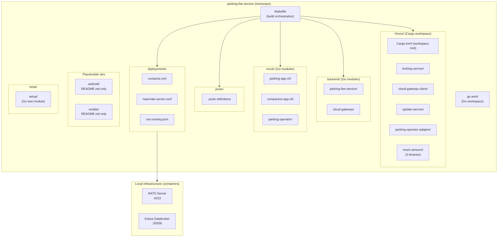

# Design: Project Setup

## Overview

This document describes the architecture and design for **Spec 01 — Project Setup**. The goal is to establish a fully functional monorepo with compilable skeletons for all components, shared proto definitions, local infrastructure, and test runner configuration. This spec produces no runtime business logic — it creates the structural foundation for specs 02–09.

The design follows three principles: (1) each component lives in a predictable directory location determined by its technology and deployment target, (2) a single root Makefile provides a uniform interface across Rust and Go toolchains, and (3) local infrastructure (NATS, Kuksa Databroker) is managed via Podman Compose with one-command start/stop.

## Architecture



## Module Responsibilities

| Module | Responsibility |
|--------|---------------|
| `Makefile` | Root build orchestration. Delegates to Cargo and Go toolchains. Manages infrastructure lifecycle via Podman Compose. Provides uniform `build`, `test`, `clean`, `check`, `proto`, `infra-up`, `infra-down`, `test-setup` targets. |
| `rhivos/Cargo.toml` | Declares Cargo workspace membership. All Rust crates share a single `Cargo.lock`. |
| `rhivos/{component}/` | Individual Rust crate. Contains `Cargo.toml`, `src/main.rs` (skeleton), and a placeholder test. |
| `rhivos/mock-sensors/` | Single Rust crate with three binary targets (`location-sensor`, `speed-sensor`, `door-sensor`). Shares common code structure. |
| `backend/{service}/` | Individual Go module. Contains `go.mod`, `main.go` (skeleton), and a placeholder test file. |
| `mock/{app}/` | Individual Go module for mock CLI apps. Same structure as backend modules. |
| `proto/` | Shared `.proto` files. Contains full message/service definitions for all component interfaces. |
| `deployments/compose.yml` | Podman Compose file defining NATS and Kuksa Databroker services. |
| `deployments/nats/nats-server.conf` | NATS server configuration (port 4222, default settings). |
| `deployments/vss-overlay.json` | Custom VSS signal definitions for `Vehicle.Parking.*` and `Vehicle.Command.*`. |
| `android/` | Placeholder directory with README. Reserved for AAOS PARKING_APP (Kotlin). |
| `mobile/` | Placeholder directory with README. Reserved for Flutter COMPANION_APP. |
| `go.work` | Go workspace file referencing all Go modules in the repository. |
| `tests/setup/` | Standalone Go test module with subprocess-based tests that verify the entire project setup. |

## Execution Paths

### Path 1: Full Build (`make build`)

1. `Makefile::build` invokes `Makefile::build-rust` and `Makefile::build-go`
2. `Makefile::build-rust` runs `cargo build --workspace` in `rhivos/` -> returns exit code (int)
3. `Makefile::build-go` runs `go build ./...` using Go workspace -> returns exit code (int)
4. `Makefile::build` returns exit code 0 if both succeed, non-zero otherwise

### Path 2: Full Test (`make test`)

1. `Makefile::test` invokes `Makefile::test-rust` and `Makefile::test-go`
2. `Makefile::test-rust` runs `cargo test --workspace` in `rhivos/` -> returns test results (stdout) and exit code (int)
3. `Makefile::test-go` runs `go test ./...` using Go workspace -> returns test results (stdout) and exit code (int)
4. `Makefile::test` returns exit code 0 if both succeed, non-zero otherwise

### Path 3: Infrastructure Lifecycle (`make infra-up` / `make infra-down`)

1. `Makefile::infra-up` runs `podman-compose -f deployments/compose.yml up -d` -> returns exit code (int)
2. Podman starts NATS container (port 4222) and Kuksa Databroker container (port 55556)
3. `Makefile::infra-down` runs `podman-compose -f deployments/compose.yml down` -> returns exit code (int)

### Path 4: Proto Generation (`make proto`)

1. `Makefile::proto` invokes `protoc` with Go plugins on all `.proto` files in `proto/` -> returns exit code (int)
2. Generated `.pb.go` files are placed in the appropriate Go package directories
3. Returns exit code 0 on success

### Path 5: Setup Verification (`make test-setup`)

1. `Makefile::test-setup` runs `go test ./...` in `tests/setup/` -> returns test results (stdout) and exit code (int)
2. Each test function invokes a subprocess (e.g., `cargo build`, `go build`, `protoc`) -> returns subprocess exit code (int)
3. Test asserts subprocess exit code == 0

### Path 6: Skeleton Execution

1. User invokes a built binary (e.g., `./rhivos/target/debug/locking-service`) -> returns version string (string) to stdout, exit code 0 (int)
2. IF invoked with an unrecognized flag -> returns usage message (string) to stderr, exit code non-zero (int)

## Components and Interfaces

### Root Makefile

```makefile
# Targets and their signatures (all return exit codes)
build:          # Builds all Rust and Go components
build-rust:     # Builds Cargo workspace in rhivos/
build-go:       # Builds all Go modules via go.work
test:           # Runs all Rust and Go tests
test-rust:      # Runs cargo test --workspace in rhivos/
test-go:        # Runs go test ./... for Go workspace
test-setup:     # Runs setup verification tests in tests/setup/
clean:          # Removes build artifacts for both toolchains
proto:          # Generates Go code from proto/ definitions
infra-up:       # Starts NATS and Kuksa Databroker containers
infra-down:     # Stops and removes infrastructure containers
check:          # Runs lint + all tests
```

### Rust Skeleton Binary Interface

Each Rust skeleton `main.rs` follows this pattern:

```rust
fn main() {
    // Prints: "{component-name} v0.1.0"
    // Exits with code 0
}
```

### Go Skeleton Binary Interface

Each Go skeleton `main.go` follows this pattern:

```go
func main() {
    // Prints: "{component-name} v0.1.0"
    // Exits with code 0
}
```

### Proto File Organization

```
proto/
  kuksa/           # Kuksa Databroker value types (val.proto)
  update/          # UPDATE_SERVICE interface (update_service.proto)
  adapter/         # PARKING_OPERATOR_ADAPTOR interface (adapter_service.proto)
  gateway/         # CLOUD_GATEWAY_CLIENT relay types (gateway.proto)
```

### Compose Services Interface

```yaml
# deployments/compose.yml
services:
  nats:
    image: nats:latest
    ports: ["4222:4222"]
    # Config: deployments/nats/nats-server.conf

  kuksa-databroker:
    image: ghcr.io/eclipse-kuksa/kuksa-databroker:0.6
    ports: ["55556:55555"]
    # VSS overlay: deployments/vss-overlay.json
```

## Data Models

### Proto: UPDATE_SERVICE Messages

```protobuf
// Adapter lifecycle states
enum AdapterState {
  UNKNOWN = 0;
  DOWNLOADING = 1;
  INSTALLING = 2;
  RUNNING = 3;
  STOPPED = 4;
  ERROR = 5;
  OFFLOADING = 6;
}

message InstallAdapterRequest {
  string image_ref = 1;
  string checksum_sha256 = 2;
}

message InstallAdapterResponse {
  string job_id = 1;
  string adapter_id = 2;
  AdapterState state = 3;
}

message AdapterStateEvent {
  string adapter_id = 1;
  AdapterState old_state = 2;
  AdapterState new_state = 3;
  int64 timestamp = 4;
}

message AdapterInfo {
  string adapter_id = 1;
  string image_ref = 2;
  AdapterState state = 3;
}
```

### Proto: PARKING_OPERATOR_ADAPTOR Messages

```protobuf
message StartSessionRequest {
  string vehicle_id = 1;
  string zone_id = 2;
}

message StopSessionRequest {
  string session_id = 1;
}

message SessionStatus {
  string session_id = 1;
  bool active = 2;
  int64 start_time = 3;
  string zone_id = 4;
}

message ParkingRate {
  string operator_id = 1;
  string rate_type = 2;  // "per_hour" or "flat_fee"
  double amount = 3;
  string currency = 4;
}
```

### Proto: CLOUD_GATEWAY Relay Messages

```protobuf
message VehicleCommand {
  string command_id = 1;
  string action = 2;      // "lock" or "unlock"
  repeated string doors = 3;
  string source = 4;
  string vin = 5;
  int64 timestamp = 6;
}

message CommandResponse {
  string command_id = 1;
  string status = 2;      // "success" or "failed"
  string reason = 3;
  int64 timestamp = 4;
}
```

### VSS Overlay Schema

```json
{
  "Vehicle.Parking.SessionActive": {
    "type": "sensor",
    "datatype": "boolean",
    "description": "Adapter-managed parking session state"
  },
  "Vehicle.Command.Door.Lock": {
    "type": "actuator",
    "datatype": "string",
    "description": "Lock/unlock command request (JSON payload)"
  },
  "Vehicle.Command.Door.Response": {
    "type": "sensor",
    "datatype": "string",
    "description": "Command execution result (JSON payload)"
  }
}
```

## Correctness Properties

### Property 1: Build Completeness

*For any* component defined in the monorepo directory structure, there exists a corresponding build configuration (Cargo.toml for Rust, go.mod for Go) such that the component compiles without errors when the root build target is invoked.

**Validates: Requirements 01-REQ-2.4, 01-REQ-3.4, 01-REQ-6.2**

### Property 2: Skeleton Determinism

*For any* skeleton binary, invoking it with no arguments always produces the same version string on stdout and always exits with code 0. Invoking it with an unrecognized flag always produces a usage message on stderr and exits with a non-zero code.

**Validates: Requirements 01-REQ-4.1, 01-REQ-4.2, 01-REQ-4.E1**

### Property 3: Infrastructure Idempotency

*For any* sequence of `make infra-up` and `make infra-down` invocations, the final state is consistent: after `infra-up`, both containers are running and ports are bound; after `infra-down`, no infrastructure containers remain and ports are released.

**Validates: Requirements 01-REQ-7.4, 01-REQ-7.5, 01-REQ-7.E2**

### Property 4: Test Isolation

*For any* test in the Rust workspace or Go modules, the test is self-contained and does not depend on external infrastructure, other tests, or filesystem state beyond the repository itself.

**Validates: Requirements 01-REQ-8.1, 01-REQ-8.2, 01-REQ-8.3, 01-REQ-8.4**

### Property 5: Proto Consistency

*For any* `.proto` file in the `proto/` directory, the file is syntactically valid proto3 and contains a `package` declaration and a `go_package` option, ensuring code generation succeeds for all target languages.

**Validates: Requirements 01-REQ-5.2, 01-REQ-5.3, 01-REQ-5.4, 01-REQ-10.1**

## Error Handling

| Error Condition | Behavior | Requirement |
|----------------|----------|-------------|
| Rust build failure in one crate | `cargo build` reports failing crate name, `make build` returns non-zero | 01-REQ-2.E1, 01-REQ-6.E1 |
| Go module missing dependency | `go build` fails with import error for the module | 01-REQ-3.E1 |
| Skeleton invoked with unknown flag | Prints usage to stderr, exits non-zero | 01-REQ-4.E1 |
| Proto file references missing import | `protoc` fails with error identifying missing import | 01-REQ-5.E1 |
| Port conflict on infra-up | Podman Compose reports port conflict, container does not start | 01-REQ-7.E1 |
| infra-down with no running containers | Completes without error, exit code 0 | 01-REQ-7.E2 |
| Test file syntax error | Test runner reports file/line, returns non-zero | 01-REQ-8.E1 |
| Missing toolchain in setup tests | Test skips with message naming the missing tool | 01-REQ-9.E1 |
| protoc not installed for proto target | Makefile prints error message, returns non-zero | 01-REQ-10.E1 |

## Technology Stack

| Technology | Version | Purpose |
|-----------|---------|---------|
| Rust | Edition 2021 | RHIVOS service skeletons (Cargo workspace) |
| Go | 1.22+ | Backend services, mock CLI apps, setup tests (Go workspace) |
| Protocol Buffers | proto3 | Shared interface definitions |
| protoc | 3.x+ | Proto code generation |
| protoc-gen-go | latest | Go code generation from proto files |
| protoc-gen-go-grpc | latest | Go gRPC code generation from proto files |
| Podman | latest | Container runtime for local infrastructure |
| Podman Compose | latest | Container orchestration for NATS and Kuksa |
| NATS | latest (container) | Message broker on port 4222 |
| Eclipse Kuksa Databroker | latest (container) | VSS signal broker on port 55556 |
| GNU Make | 3.x+ | Build orchestration |

## Definition of Done

1. All directories listed in [01-REQ-1] exist with correct contents.
2. `cargo build --workspace` in `rhivos/` succeeds (exit code 0).
3. `go build ./...` with Go workspace succeeds (exit code 0).
4. All skeleton binaries print version info and exit 0.
5. All `.proto` files parse with `protoc` (exit code 0).
6. `make proto` generates compilable Go code.
7. `make build` succeeds (exit code 0).
8. `make test` succeeds (exit code 0), running all placeholder tests.
9. `make infra-up` starts NATS on 4222 and Kuksa on 55556.
10. `make infra-down` stops and removes infrastructure containers.
11. `make test-setup` runs setup verification tests successfully.
12. `make check` succeeds (exit code 0).

## Testing Strategy

Testing for this spec is structural, not behavioral:

- **Unit tests (placeholder):** Each Rust crate and Go module contains at least one trivial test proving the component compiles. These are run by `make test`.
- **Setup verification tests:** The `tests/setup/` module runs subprocess-based tests that invoke build commands and assert success. These are run by `make test-setup`.
- **Infrastructure smoke tests:** Manual or scripted verification that `make infra-up` brings containers online and ports are reachable. Infrastructure tests require Podman and are not part of the default `make test` target.

No mocking is required for this spec. All tests either assert compilation success or infrastructure availability.

## Operational Readiness

| Aspect | Status | Notes |
|--------|--------|-------|
| Build from clean checkout | Required | `make build` must work on a fresh clone with Rust, Go, and Make installed |
| Local infrastructure | Required | `make infra-up` / `make infra-down` for NATS and Kuksa |
| CI/CD | Out of scope | Covered by Phase 3 |
| Monitoring | N/A | No runtime services in this spec |
| Logging | N/A | Skeletons only print version info |
| Documentation | Required | README.md updated to reflect actual project structure |
