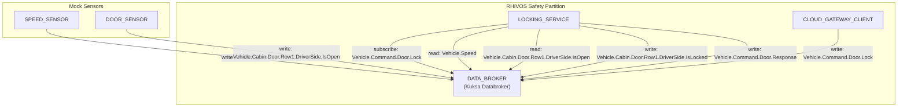
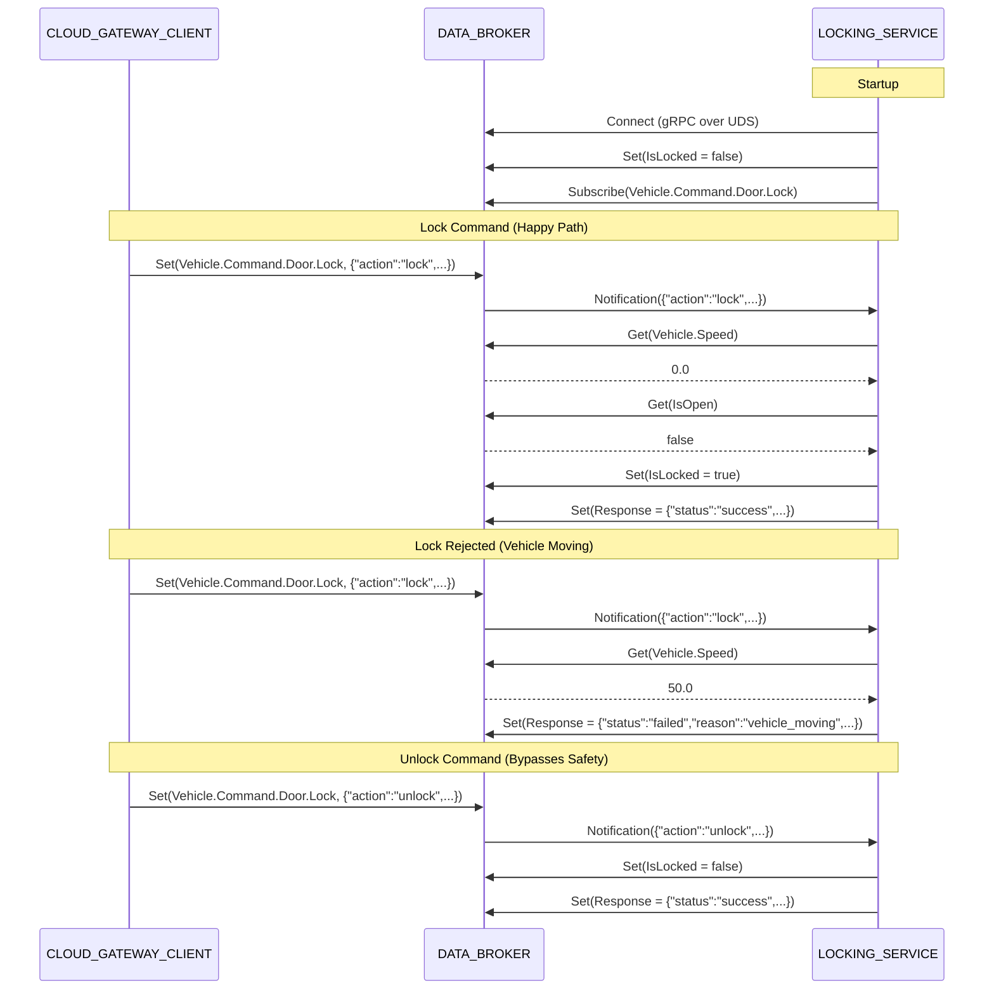

# Design Document: LOCKING_SERVICE

## Overview

This design covers the implementation of the LOCKING_SERVICE, an ASIL-B rated Rust service running in the RHIVOS safety partition. The service subscribes to lock/unlock command signals from DATA_BROKER (`Vehicle.Command.Door.Lock`), validates safety constraints (vehicle speed < 1.0 km/h, door not ajar), manages the door lock state (`Vehicle.Cabin.Door.Row1.DriverSide.IsLocked`), and publishes command responses (`Vehicle.Command.Door.Response`). Communication with DATA_BROKER uses gRPC over UDS via tonic-generated Rust client from the kuksa.val.v1 proto definitions.

## Architecture





## Module Responsibilities

1. **`main`** (`src/main.rs`) -- Entry point. Parses CLI args, initialises logging, connects to DATA_BROKER, publishes initial state, subscribes to command signal, runs the command processing loop, and handles graceful shutdown on SIGTERM/SIGINT.
2. **`broker`** (`src/broker.rs`) -- Abstracts the DATA_BROKER gRPC client. Defines the `BrokerClient` trait with `get_float`, `get_bool`, `set_bool`, `set_string` methods. Implements `GrpcBrokerClient` using tonic-generated kuksa.val.v1 client with exponential-backoff connection retry and subscription stream management.
3. **`command`** (`src/command.rs`) -- Defines `LockCommand` struct (serde-deserialized) and `Action` enum. Provides `parse_command` (JSON string to `LockCommand`) and `validate_command` (field validation) functions. Defines `CommandError` enum.
4. **`safety`** (`src/safety.rs`) -- Implements `check_safety` function that reads Vehicle.Speed and Vehicle.Cabin.Door.Row1.DriverSide.IsOpen from the broker and returns `SafetyResult` (Safe, VehicleMoving, DoorOpen).
5. **`process`** (`src/process.rs`) -- Orchestrates command execution. `process_command` dispatches to `process_lock` (safety check + state update) or `process_unlock` (state update only). Handles idempotent operations and publishes responses.
6. **`response`** (`src/response.rs`) -- Defines `CommandResponse` struct. Provides `success_response` and `failure_response` builder functions that produce JSON strings.
7. **`config`** (`src/config.rs`) -- Reads the `DATABROKER_ADDR` environment variable with fallback to `http://localhost:55556`.
8. **`testing`** (`src/testing.rs`) -- Test-only module providing `MockBrokerClient` that implements `BrokerClient` trait with configurable return values and call recording.
9. **`proptest_cases`** (`src/proptest_cases.rs`) -- Test-only module containing property-based tests using the proptest crate.

## Execution Paths

### Path 1: Startup

`main::main()` -> `config::get_databroker_addr() -> String` -> `broker::GrpcBrokerClient::connect(&str) -> Result<GrpcBrokerClient, BrokerError>` -> `broker::GrpcBrokerClient::set_bool(&str, bool) -> Result<(), BrokerError>` (publish initial state) -> `broker::GrpcBrokerClient::subscribe(&str) -> Result<Receiver<String>, BrokerError>`

### Path 2: Lock Command (Success)

`main::handle_command_payload()` -> `command::parse_command(&str) -> Result<LockCommand, CommandError>` -> `command::validate_command(&LockCommand) -> Result<(), CommandError>` -> `process::process_command(&B, &LockCommand, &mut bool) -> String` -> `safety::check_safety(&B) -> SafetyResult` -> `broker::set_bool(SIGNAL_IS_LOCKED, true)` -> `response::success_response(&str) -> String` -> `broker::set_string(SIGNAL_RESPONSE, &str)`

### Path 3: Lock Command (Safety Rejection)

`main::handle_command_payload()` -> `command::parse_command()` -> `command::validate_command()` -> `process::process_command()` -> `safety::check_safety() -> SafetyResult::VehicleMoving | SafetyResult::DoorOpen` -> `response::failure_response(&str, &str) -> String` -> `broker::set_string(SIGNAL_RESPONSE, &str)`

### Path 4: Unlock Command

`main::handle_command_payload()` -> `command::parse_command()` -> `command::validate_command()` -> `process::process_command()` -> `process::process_unlock()` (no safety check) -> `broker::set_bool(SIGNAL_IS_LOCKED, false)` -> `response::success_response(&str) -> String` -> `broker::set_string(SIGNAL_RESPONSE, &str)`

### Path 5: Invalid Command

`main::handle_command_payload()` -> `command::parse_command() -> Err(CommandError::InvalidCommand)` -> `main::extract_command_id(&str) -> Option<String>` -> `response::failure_response(&str, "invalid_command") -> String` -> `broker::set_string(SIGNAL_RESPONSE, &str)`

### Path 6: Invalid JSON

`main::handle_command_payload()` -> `command::parse_command() -> Err(CommandError::InvalidJson)` -> log warning, discard (no response published)

## Components and Interfaces

### BrokerClient Trait

```rust
pub trait BrokerClient {
    async fn get_float(&self, signal: &str) -> Result<Option<f32>, BrokerError>;
    async fn get_bool(&self, signal: &str) -> Result<Option<bool>, BrokerError>;
    async fn set_bool(&self, signal: &str, value: bool) -> Result<(), BrokerError>;
    async fn set_string(&self, signal: &str, value: &str) -> Result<(), BrokerError>;
}
```

### GrpcBrokerClient

| Method | Description |
|--------|-------------|
| `connect(addr: &str) -> Result<Self, BrokerError>` | Connect with exponential backoff (5 attempts, 1s/2s/4s/8s delays) |
| `subscribe(signal: &str) -> Result<Receiver<String>, BrokerError>` | Subscribe to a VSS signal, returns mpsc channel receiver |

### Signal Paths

| Signal Path | Type | Direction | Purpose |
|-------------|------|-----------|---------|
| `Vehicle.Command.Door.Lock` | string (JSON) | Read (subscribe) | Incoming lock/unlock commands |
| `Vehicle.Speed` | float | Read (get) | Safety constraint: speed check |
| `Vehicle.Cabin.Door.Row1.DriverSide.IsOpen` | bool | Read (get) | Safety constraint: door ajar check |
| `Vehicle.Cabin.Door.Row1.DriverSide.IsLocked` | bool | Write (set) | Published lock state |
| `Vehicle.Command.Door.Response` | string (JSON) | Write (set) | Command execution result |

## Data Models

### LockCommand (Incoming)

```rust
pub struct LockCommand {
    pub command_id: String,        // Required, non-empty UUID
    pub action: Action,            // Required: Lock | Unlock
    pub doors: Vec<String>,        // Required: must contain "driver"
    pub source: Option<String>,    // Optional metadata
    pub vin: Option<String>,       // Optional metadata
    pub timestamp: Option<i64>,    // Optional metadata
}

pub enum Action {
    Lock,
    Unlock,
}
```

### CommandResponse (Outgoing)

```rust
pub struct CommandResponse {
    pub command_id: String,        // Echoed from request
    pub status: String,            // "success" or "failed"
    pub reason: Option<String>,    // Present only on failure
    pub timestamp: i64,            // Current Unix timestamp (seconds)
}
```

### Success Response JSON

```json
{
  "command_id": "<uuid>",
  "status": "success",
  "timestamp": 1700000001
}
```

### Failure Response JSON

```json
{
  "command_id": "<uuid>",
  "status": "failed",
  "reason": "vehicle_moving",
  "timestamp": 1700000001
}
```

### Failure Reasons

| Reason | Trigger |
|--------|---------|
| `vehicle_moving` | Vehicle.Speed >= 1.0 km/h during lock |
| `door_open` | Door is ajar during lock |
| `unsupported_door` | `doors` array contains non-"driver" value |
| `invalid_command` | Missing/invalid required field |

### SafetyResult Enum

```rust
pub enum SafetyResult {
    Safe,
    VehicleMoving,
    DoorOpen,
}
```

## Correctness Properties

### Property 1: Command Validation Completeness

*For any* string input received as a command payload, the service either parses and validates it to a well-formed `LockCommand` (with non-empty `command_id`, valid `action`, and `doors` containing "driver") or rejects it with an appropriate error.

**Validates:** Requirements 03-REQ-2.1, 03-REQ-2.2, 03-REQ-2.3, 03-REQ-2.E1, 03-REQ-2.E2, 03-REQ-2.E3

### Property 2: Safety Gate for Lock

*For any* lock command with valid fields, the command succeeds if and only if `Vehicle.Speed < 1.0` AND `Vehicle.Cabin.Door.Row1.DriverSide.IsOpen == false`. Speed is checked first; if speed >= 1.0 the result is "vehicle_moving" regardless of door state.

**Validates:** Requirements 03-REQ-3.1, 03-REQ-3.2, 03-REQ-3.3

### Property 3: Unlock Always Succeeds

*For any* valid unlock command, regardless of vehicle speed or door state, the command succeeds with status "success".

**Validates:** Requirements 03-REQ-3.4

### Property 4: State-Response Consistency

*For any* command that returns status "success", the internal lock state matches the requested action (true for lock, false for unlock) and the corresponding `IsLocked` signal is published to DATA_BROKER.

**Validates:** Requirements 03-REQ-4.1, 03-REQ-4.2, 03-REQ-5.1

### Property 5: Idempotent Operations

*For any* sequence of N identical commands (all lock or all unlock) with safety conditions met, every command returns "success" and `set_bool` is called at most once (on the first command that changes state).

**Validates:** Requirements 03-REQ-4.E1, 03-REQ-4.E2

### Property 6: Response Completeness

*For any* processed command (valid or invalid), exactly one response is published to `Vehicle.Command.Door.Response` containing `command_id`, `status`, and `timestamp`. Failed responses additionally include `reason`. The sole exception is invalid JSON payloads, which are discarded without a response.

**Validates:** Requirements 03-REQ-5.1, 03-REQ-5.2, 03-REQ-5.3, 03-REQ-2.E1

## Error Handling

| Error Condition | Behavior | Requirement |
|----------------|----------|-------------|
| DATA_BROKER unreachable at startup | Exponential backoff retry (5 attempts), exit non-zero | 03-REQ-1.E1 |
| Subscription stream interrupted | Resubscribe up to max attempts, then exit | 03-REQ-1.E2 |
| Invalid JSON payload | Log warning, discard without response | 03-REQ-2.E1 |
| Missing required field (with command_id) | Failure response with "invalid_command" | 03-REQ-2.E2, 03-REQ-2.E3 |
| Unsupported door value | Failure response with "unsupported_door" | 03-REQ-2.2 |
| Vehicle speed >= 1.0 km/h | Failure response with "vehicle_moving" | 03-REQ-3.1 |
| Door ajar during lock | Failure response with "door_open" | 03-REQ-3.2 |
| Speed signal unset | Treat as 0.0 (safe default) | 03-REQ-3.E1 |
| Door signal unset | Treat as closed (safe default) | 03-REQ-3.E2 |
| Lock when already locked | Success response, no state write | 03-REQ-4.E1 |
| Unlock when already unlocked | Success response, no state write | 03-REQ-4.E2 |
| Response publish failure | Log error, continue processing | 03-REQ-5.E1 |
| SIGTERM/SIGINT received | Complete current command, exit 0 | 03-REQ-6.1, 03-REQ-6.E1 |

## Technology Stack

| Technology | Version | Purpose |
|-----------|---------|---------|
| Rust | 2021 edition | Service implementation language |
| tokio | 1.x (full features) | Async runtime |
| tonic | 0.11 | gRPC client (kuksa.val.v1 generated) |
| tonic-build | 0.11 | Proto code generation at build time |
| prost | 0.12 | Protocol buffer serialization |
| serde / serde_json | 1.x | JSON command/response serialization |
| tracing / tracing-subscriber | 0.1 / 0.3 | Structured logging |
| futures | 0.3 | Stream utilities for gRPC subscription |
| proptest | 1.x (dev) | Property-based testing |
| tokio-test | 0.4 (dev) | Async test utilities |

## Definition of Done

A task group is complete when ALL of the following are true:

1. All subtasks within the group are checked off (`[x]`)
2. All spec tests (`test_spec.md` entries) for the task group pass
3. All property tests for the task group pass
4. All previously passing tests still pass (no regressions)
5. No linter warnings or errors introduced
6. Code is committed on a feature branch and pushed to remote
7. Feature branch is merged back to `main`
8. `tasks.md` checkboxes are updated to reflect completion

## Testing Strategy

- **Unit tests:** Each module has co-located `#[cfg(test)]` tests using `MockBrokerClient` from the `testing` module. These test command parsing, validation, safety checks, state management, and response formatting in isolation.
- **Property tests:** The `proptest_cases` module uses the proptest crate to verify invariants across randomised inputs. Property tests are marked `#[ignore]` and run separately via `cargo test -- --ignored`.
- **Integration tests:** Integration tests live in `tests/locking-service/` as a standalone Go module. They start the locking-service binary and DATA_BROKER container, send commands via gRPC, and verify published signals. These require Podman and skip gracefully when unavailable.
- **Mock broker:** The `MockBrokerClient` records all calls and returns configurable values, enabling deterministic unit testing without a running DATA_BROKER.

## Operational Readiness

- **Health check:** The service logs "locking-service ready" after successful startup, subscription, and initial state publication. Integration tests use this log line as a readiness indicator.
- **Startup time:** Connection to DATA_BROKER uses exponential backoff (1s, 2s, 4s, 8s, 16s). Maximum startup delay before failure is ~31 seconds.
- **Configuration:** Single environment variable `DATABROKER_ADDR` (default: `http://localhost:55556`).
- **Logs:** Structured logging via the tracing crate. Key events: startup metadata, connection status, command received, safety check result, state changes, response published, shutdown.
- **Graceful shutdown:** SIGTERM/SIGINT triggers orderly shutdown: complete current command, close subscription, exit 0.
