# Design: CLOUD_GATEWAY_CLIENT

## Overview

The CLOUD_GATEWAY_CLIENT is a Rust service running in the RHIVOS safety partition that bridges the vehicle's DATA_BROKER (Eclipse Kuksa Databroker) with the cloud-based CLOUD_GATEWAY via NATS messaging. It implements three data flows: (1) inbound command processing (NATS to DATA_BROKER), (2) outbound command response relay (DATA_BROKER to NATS), and (3) outbound telemetry publishing (DATA_BROKER to NATS).

The service is structured as a single async Rust binary using tokio, with dedicated modules for NATS communication, DATA_BROKER gRPC interaction, command validation, and telemetry aggregation. All inter-service communication within the safety partition goes through DATA_BROKER -- the service never calls LOCKING_SERVICE directly.

## Architecture

```mermaid
flowchart TD
    subgraph NATS["NATS Server"]
        CMD_SUB["vehicles.{VIN}.commands"]
        CMD_RSP["vehicles.{VIN}.command_responses"]
        TELEM["vehicles.{VIN}.telemetry"]
        STATUS["vehicles.{VIN}.status"]
    end

    subgraph CGC["CLOUD_GATEWAY_CLIENT"]
        CONFIG["config"]
        NATS_MOD["nats_client"]
        BROKER["broker_client"]
        VALIDATOR["command_validator"]
        TELEMETRY["telemetry"]
        MAIN["main"]
    end

    subgraph DB["DATA_BROKER (Kuksa)"]
        CMD_SIGNAL["Vehicle.Command.Door.Lock"]
        RSP_SIGNAL["Vehicle.Command.Door.Response"]
        LOCK_STATE["Vehicle.Cabin.Door.Row1.DriverSide.IsLocked"]
        LAT["Vehicle.CurrentLocation.Latitude"]
        LON["Vehicle.CurrentLocation.Longitude"]
        PARK["Vehicle.Parking.SessionActive"]
    end

    CMD_SUB -->|subscribe| NATS_MOD
    NATS_MOD -->|validated command| VALIDATOR
    VALIDATOR -->|SetRequest| BROKER
    BROKER -->|write| CMD_SIGNAL

    RSP_SIGNAL -->|subscribe stream| BROKER
    BROKER -->|response JSON| NATS_MOD
    NATS_MOD -->|publish| CMD_RSP

    LOCK_STATE -->|subscribe stream| BROKER
    LAT -->|subscribe stream| BROKER
    LON -->|subscribe stream| BROKER
    PARK -->|subscribe stream| BROKER
    BROKER -->|signal change| TELEMETRY
    TELEMETRY -->|aggregated JSON| NATS_MOD
    NATS_MOD -->|publish| TELEM

    MAIN -->|startup| NATS_MOD
    MAIN -->|startup| BROKER
    NATS_MOD -->|publish| STATUS
    CONFIG -->|env vars| MAIN
```



## Module Responsibilities

### `main` (src/main.rs)

Entry point. Reads configuration, orchestrates startup sequence, spawns async tasks for command processing, response relay, and telemetry publishing. Handles graceful shutdown.

### `config` (src/config.rs)

Reads and validates environment variables. Returns a typed `Config` struct or exits with code 1 if `VIN` is missing.

### `nats_client` (src/nats_client.rs)

Manages the NATS connection lifecycle: connect with retry, subscribe to commands, publish responses/telemetry/status. Encapsulates all `async-nats` API usage.

### `broker_client` (src/broker_client.rs)

Manages the DATA_BROKER gRPC connection. Provides methods to write command signals, subscribe to telemetry signals, and subscribe to command response signals. Encapsulates all `tonic` gRPC usage.

### `command_validator` (src/command_validator.rs)

Validates bearer tokens and command payload structure. Pure functions with no I/O dependencies.

### `telemetry` (src/telemetry.rs)

Maintains current telemetry state. Accepts signal updates and produces aggregated JSON payloads, omitting fields that have never been set.

## Execution Paths

### Path 1: Startup

```
main::main()
  -> config::Config::from_env() -> Result<Config, ConfigError>
  -> nats_client::NatsClient::connect(&config) -> Result<NatsClient, NatsError>
     (retries: 1s, 2s, 4s, up to 5 attempts)
  -> broker_client::BrokerClient::connect(&config) -> Result<BrokerClient, BrokerError>
  -> nats_client::NatsClient::publish_registration(&self) -> Result<(), NatsError>
  -> spawn command_loop task
  -> spawn response_relay task
  -> spawn telemetry_loop task
```

### Path 2: Command Processing (inbound)

```
nats_client::NatsClient::next_command(&self) -> Option<NatsMessage>
  -> command_validator::validate_bearer_token(&message, &config) -> Result<(), AuthError>
  -> command_validator::validate_command_payload(&payload) -> Result<CommandPayload, ValidationError>
  -> broker_client::BrokerClient::write_command(&self, &payload) -> Result<(), BrokerError>
```

### Path 3: Command Response Relay (outbound)

```
broker_client::BrokerClient::subscribe_responses(&self) -> Stream<Result<String, BrokerError>>
  -> (for each response JSON string)
  -> nats_client::NatsClient::publish_response(&self, &json) -> Result<(), NatsError>
```

### Path 4: Telemetry Publishing (outbound)

```
broker_client::BrokerClient::subscribe_telemetry(&self) -> Stream<Result<SignalUpdate, BrokerError>>
  -> telemetry::TelemetryState::update(&mut self, signal_update) -> Option<String>
     (returns Some(json) if state changed, None if duplicate)
  -> nats_client::NatsClient::publish_telemetry(&self, &json) -> Result<(), NatsError>
```

## Components and Interfaces

### Config

```rust
pub struct Config {
    pub vin: String,
    pub nats_url: String,        // default: "nats://localhost:4222"
    pub databroker_addr: String,  // default: "http://localhost:55556"
    pub bearer_token: String,     // default: "demo-token"
}
```

### NatsClient

```rust
impl NatsClient {
    pub async fn connect(config: &Config) -> Result<Self, NatsError>;
    pub async fn publish_registration(&self) -> Result<(), NatsError>;
    pub async fn subscribe_commands(&self) -> Result<Subscriber, NatsError>;
    pub async fn publish_response(&self, json: &str) -> Result<(), NatsError>;
    pub async fn publish_telemetry(&self, json: &str) -> Result<(), NatsError>;
}
```

### BrokerClient

```rust
impl BrokerClient {
    pub async fn connect(config: &Config) -> Result<Self, BrokerError>;
    pub async fn write_command(&self, payload: &str) -> Result<(), BrokerError>;
    pub async fn subscribe_responses(&self) -> Result<impl Stream<Item = Result<String, BrokerError>>, BrokerError>;
    pub async fn subscribe_telemetry(&self) -> Result<impl Stream<Item = Result<SignalUpdate, BrokerError>>, BrokerError>;
}
```

### CommandValidator

```rust
pub fn validate_bearer_token(headers: &HeaderMap, expected: &str) -> Result<(), AuthError>;
pub fn validate_command_payload(payload: &[u8]) -> Result<CommandPayload, ValidationError>;
```

### TelemetryState

```rust
impl TelemetryState {
    pub fn new(vin: String) -> Self;
    pub fn update(&mut self, signal: SignalUpdate) -> Option<String>;
}
```

## Data Models

### CommandPayload

```rust
#[derive(Debug, Deserialize)]
pub struct CommandPayload {
    pub command_id: String,
    pub action: String,       // "lock" or "unlock"
    pub doors: Vec<String>,
    #[serde(flatten)]
    pub extra: serde_json::Map<String, serde_json::Value>,
}
```

### CommandResponse

```rust
#[derive(Debug, Deserialize, Serialize)]
pub struct CommandResponse {
    pub command_id: String,
    pub status: String,       // "success" or "failed"
    #[serde(skip_serializing_if = "Option::is_none")]
    pub reason: Option<String>,
    pub timestamp: u64,
}
```

### TelemetryMessage

```rust
#[derive(Debug, Serialize)]
pub struct TelemetryMessage {
    pub vin: String,
    #[serde(skip_serializing_if = "Option::is_none")]
    pub is_locked: Option<bool>,
    #[serde(skip_serializing_if = "Option::is_none")]
    pub latitude: Option<f64>,
    #[serde(skip_serializing_if = "Option::is_none")]
    pub longitude: Option<f64>,
    #[serde(skip_serializing_if = "Option::is_none")]
    pub parking_active: Option<bool>,
    pub timestamp: u64,
}
```

### RegistrationMessage

```rust
#[derive(Debug, Serialize)]
pub struct RegistrationMessage {
    pub vin: String,
    pub status: String,  // "online"
    pub timestamp: u64,
}
```

### SignalUpdate

```rust
pub enum SignalUpdate {
    IsLocked(bool),
    Latitude(f64),
    Longitude(f64),
    ParkingActive(bool),
}
```

### Error Types

```rust
pub enum ConfigError {
    MissingVin,
}

pub enum NatsError {
    ConnectionFailed(String),
    RetriesExhausted,
    PublishFailed(String),
    SubscribeFailed(String),
}

pub enum AuthError {
    MissingHeader,
    InvalidToken,
}

pub enum ValidationError {
    InvalidJson(String),
    MissingField(String),
    InvalidAction(String),
}

pub enum BrokerError {
    ConnectionFailed(String),
    WriteFailed(String),
    SubscribeFailed(String),
}
```

## Correctness Properties

### Property 1: Command Authentication Integrity

*For any* NATS message received on `vehicles.{VIN}.commands`, the system writes to DATA_BROKER *only if* the message contains an `Authorization` header with a value matching `Bearer <configured_token>`.

**Validates:** [04-REQ-5.1], [04-REQ-5.2], [04-REQ-5.E1], [04-REQ-5.E2]

### Property 2: Command Structural Validity

*For any* command that passes authentication, the system writes to DATA_BROKER *only if* the payload is valid JSON containing a non-empty `command_id`, an `action` of `"lock"` or `"unlock"`, and a `doors` array.

**Validates:** [04-REQ-6.1], [04-REQ-6.2], [04-REQ-6.3], [04-REQ-6.E1], [04-REQ-6.E2], [04-REQ-6.E3]

### Property 3: Command Passthrough Fidelity

*For any* validated command, the payload written to `Vehicle.Command.Door.Lock` in DATA_BROKER is identical to the original payload received from NATS. The service does not modify, enrich, or strip fields.

**Validates:** [04-REQ-6.3], [04-REQ-6.4]

### Property 4: Response Relay Fidelity

*For any* change to `Vehicle.Command.Door.Response` in DATA_BROKER, the JSON value is published verbatim to `vehicles.{VIN}.command_responses` on NATS without modification.

**Validates:** [04-REQ-7.1], [04-REQ-7.2]

### Property 5: Telemetry Completeness

*For any* change to a subscribed telemetry signal, the system publishes an aggregated JSON message to NATS that includes all currently known signal values and omits signals that have never been set.

**Validates:** [04-REQ-8.1], [04-REQ-8.2], [04-REQ-8.3]

### Property 6: Startup Determinism

*For any* execution of the service, initialization proceeds in strict order (config, NATS, DATA_BROKER, registration, processing) and a failure at any step prevents subsequent steps from executing.

**Validates:** [04-REQ-9.1], [04-REQ-9.2]

## Error Handling

| Error Condition | Handling Strategy | Req ID |
|----------------|-------------------|--------|
| `VIN` env var missing | Log error, exit with code 1 | [04-REQ-1.E1] |
| NATS connection fails | Retry with exponential backoff (1s, 2s, 4s), max 5 attempts | [04-REQ-2.2] |
| NATS retries exhausted | Log error, exit with code 1 | [04-REQ-2.E1] |
| DATA_BROKER connection fails | Log error, exit with code 1 | [04-REQ-3.E1] |
| Missing Authorization header | Log warning, discard message | [04-REQ-5.E1] |
| Invalid bearer token | Log warning, discard message | [04-REQ-5.E2] |
| Invalid JSON payload | Log warning, discard message | [04-REQ-6.E1] |
| Missing required command field | Log warning, discard message | [04-REQ-6.E2] |
| Invalid action value | Log warning, discard message | [04-REQ-6.E3] |
| Invalid response JSON from DATA_BROKER | Log error, skip NATS publish | [04-REQ-7.E1] |
| NATS publish failure (telemetry/response) | Log error, continue processing | [04-REQ-10.4] |
| DATA_BROKER write failure | Log error, continue processing | [04-REQ-10.4] |

## Technology Stack

| Component | Technology | Version/Notes |
|-----------|-----------|---------------|
| Language | Rust | Edition 2021 |
| Async runtime | tokio | Multi-threaded runtime |
| NATS client | async-nats | Latest stable |
| gRPC client | tonic | With UDS support |
| Serialization | serde, serde_json | JSON payloads |
| Logging | tracing, tracing-subscriber | Structured logging |
| Build | Cargo | Part of rhivos workspace |

## Definition of Done

1. All unit tests pass (`cargo test -p cloud-gateway-client`).
2. All integration tests pass with NATS and DATA_BROKER containers running.
3. Service connects to NATS, subscribes to commands, and publishes to all required subjects.
4. Service connects to DATA_BROKER via gRPC and reads/writes all required VSS signals.
5. Bearer token validation rejects invalid/missing tokens.
6. Command validation enforces required fields and valid action values.
7. Telemetry publishes on-change with field omission for unset signals.
8. Command responses are relayed verbatim from DATA_BROKER to NATS.
9. Self-registration message published on startup.
10. Exponential backoff retry for NATS connection works correctly.
11. Structured logging at appropriate levels for all operations.

## Testing Strategy

### Unit Tests

- `config`: Verify env var parsing, defaults, missing VIN error.
- `command_validator`: Verify bearer token validation (valid, missing, invalid). Verify command payload validation (valid, invalid JSON, missing fields, invalid action).
- `telemetry`: Verify state aggregation, field omission, on-change detection.

### Integration Tests

- Start NATS and DATA_BROKER containers.
- Verify end-to-end command flow: publish command on NATS -> observe write to DATA_BROKER.
- Verify end-to-end response relay: write response to DATA_BROKER -> observe publish on NATS.
- Verify end-to-end telemetry: update signal in DATA_BROKER -> observe telemetry publish on NATS.
- Verify self-registration message on startup.
- Verify NATS reconnection with exponential backoff.

### Smoke Tests

- Service starts with valid configuration.
- Service exits with code 1 when VIN is missing.
- Service publishes registration on startup.

## Operational Readiness

| Aspect | Approach |
|--------|----------|
| Configuration | Environment variables with sensible defaults |
| Logging | Structured JSON via tracing-subscriber, configurable log level via `RUST_LOG` |
| Health | Self-registration message on `vehicles.{VIN}.status` indicates online status |
| Failure modes | Exit with code 1 on unrecoverable errors; log and continue on transient errors |
| Resource usage | Single async binary, minimal memory footprint, no persistent state |
| Dependencies | NATS server, DATA_BROKER (Kuksa Databroker) |
