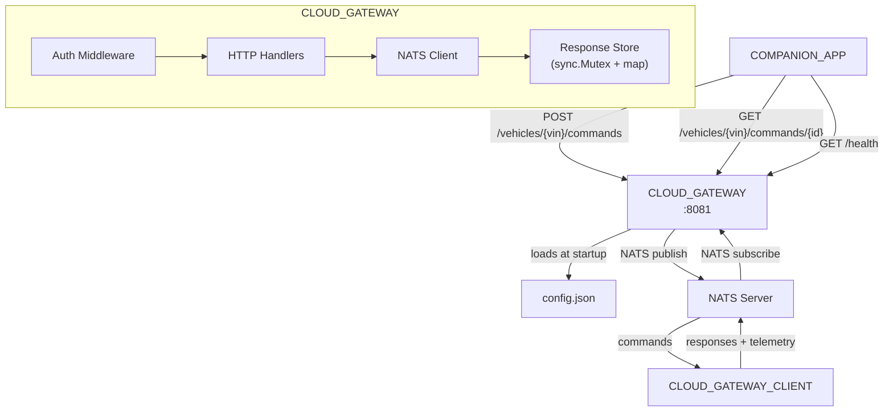
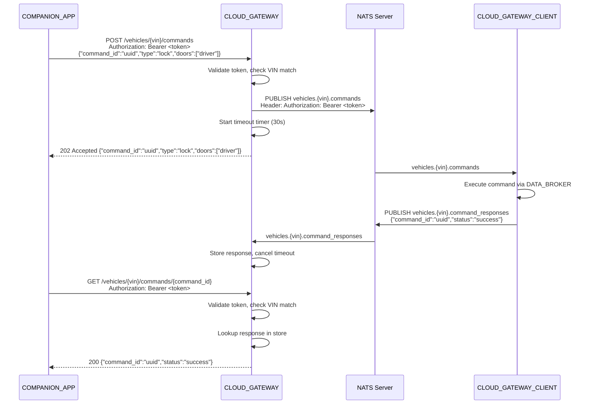

# Design Document: CLOUD_GATEWAY

## Overview

The CLOUD_GATEWAY is a Go service (`backend/cloud-gateway`) with two interfaces: a REST API on port 8081 for COMPANION_APPs and a NATS pub/sub interface for vehicles (CLOUD_GATEWAY_CLIENT). It translates between REST and NATS protocols, authenticating requests with bearer tokens mapped to VINs via a JSON config file. Command responses are stored in an in-memory map protected by a mutex. Commands time out after a configurable duration (default 30s). Telemetry is subscribed and logged but not stored.

## Architecture





### Module Responsibilities

1. **main** -- Entry point: loads config, connects to NATS with retry, sets up HTTP routes, starts server, handles shutdown signals.
2. **config** -- Configuration loading and parsing: reads JSON file, validates structure, provides token-VIN lookup.
3. **auth** -- Authentication middleware: extracts bearer token, validates against config, enforces VIN authorization.
4. **handler** -- HTTP request handlers: command submission, command status query, health check.
5. **nats_client** -- NATS connection management: publish commands, subscribe to responses and telemetry, exponential backoff retry.
6. **store** -- In-memory command response storage: thread-safe map with mutex, timeout management.
7. **model** -- Core data types: Command, CommandResponse, Config, TokenMapping.

## Execution Paths

### POST /vehicles/{vin}/commands

1. `auth.Middleware` extracts bearer token from `Authorization` header -> `(token string, err error)`
2. `auth.Middleware` calls `config.GetVINForToken(token)` -> `(vin string, ok bool)` -- returns 401 if not found
3. `auth.Middleware` compares config VIN with URL path VIN -> returns 403 if mismatch
4. `handler.SubmitCommand` parses JSON body -> `(model.Command, error)` -- returns 400 if invalid
5. `handler.SubmitCommand` validates `type` field is "lock" or "unlock" -> returns 400 if invalid
6. `handler.SubmitCommand` calls `nats_client.PublishCommand(vin, command, token)` -> `error`
7. `handler.SubmitCommand` calls `store.StartTimeout(command.CommandID, timeout)` -> starts goroutine
8. Returns HTTP 202 with command JSON

### GET /vehicles/{vin}/commands/{command_id}

1. `auth.Middleware` validates token and VIN (same as above)
2. `handler.GetCommandStatus` extracts `command_id` from URL path
3. `handler.GetCommandStatus` calls `store.GetResponse(commandID)` -> `(*model.CommandResponse, bool)`
4. Returns HTTP 200 with response JSON, or HTTP 404 if not found

### NATS Response Subscription (background)

1. `nats_client.SubscribeResponses` receives message on `vehicles.*.command_responses`
2. Parses JSON payload -> `model.CommandResponse`
3. Calls `store.StoreResponse(response)` -> stores in map, cancels timeout timer

### NATS Telemetry Subscription (background)

1. `nats_client.SubscribeTelemetry` receives message on `vehicles.*.telemetry`
2. Logs telemetry payload with VIN extracted from subject

## Components and Interfaces

### REST API

| Method | Path | Request | Response (Success) | Errors |
|--------|------|---------|-------------------|--------|
| POST | `/vehicles/{vin}/commands` | Bearer token + JSON body | 202 `{Command}` | 400, 401, 403 |
| GET | `/vehicles/{vin}/commands/{command_id}` | Bearer token | 200 `{CommandResponse}` | 401, 403, 404 |
| GET | `/health` | -- | 200 `{"status":"ok"}` | -- |

### NATS Subjects

| Subject | Direction | Payload |
|---------|-----------|---------|
| `vehicles.{vin}.commands` | Publish (gateway -> vehicle) | `Command` JSON + `Authorization` header |
| `vehicles.{vin}.command_responses` | Subscribe (vehicle -> gateway) | `CommandResponse` JSON |
| `vehicles.{vin}.telemetry` | Subscribe (vehicle -> gateway) | Telemetry JSON (logged only) |

### Module Interfaces

```go
// config package
func LoadConfig(path string) (*Config, error)
func (c *Config) GetVINForToken(token string) (string, bool)

// auth package
func Middleware(cfg *Config) func(http.Handler) http.Handler

// handler package
func NewSubmitCommandHandler(nc *NATSClient, store *Store, timeout time.Duration) http.HandlerFunc
func NewGetCommandStatusHandler(store *Store) http.HandlerFunc
func HealthHandler() http.HandlerFunc

// nats_client package
func Connect(url string, maxRetries int) (*NATSClient, error)
func (nc *NATSClient) PublishCommand(vin string, cmd Command, token string) error
func (nc *NATSClient) SubscribeResponses(store *Store) error
func (nc *NATSClient) SubscribeTelemetry() error
func (nc *NATSClient) Drain() error

// store package
func NewStore() *Store
func (s *Store) StoreResponse(resp CommandResponse)
func (s *Store) GetResponse(commandID string) (*CommandResponse, bool)
func (s *Store) StartTimeout(commandID string, duration time.Duration)
```

## Data Models

### Configuration File (config.json)

```json
{
  "port": 8081,
  "nats_url": "nats://localhost:4222",
  "command_timeout_seconds": 30,
  "tokens": [
    {
      "token": "demo-token-001",
      "vin": "VIN12345"
    },
    {
      "token": "demo-token-002",
      "vin": "VIN67890"
    }
  ]
}
```

### Core Data Types

```go
type Config struct {
    Port                  int            `json:"port"`
    NatsURL               string         `json:"nats_url"`
    CommandTimeoutSeconds int            `json:"command_timeout_seconds"`
    Tokens                []TokenMapping `json:"tokens"`
}

type TokenMapping struct {
    Token string `json:"token"`
    VIN   string `json:"vin"`
}

type Command struct {
    CommandID string   `json:"command_id"`
    Type      string   `json:"type"`       // "lock" | "unlock"
    Doors     []string `json:"doors"`
}

type CommandResponse struct {
    CommandID string `json:"command_id"`
    Status    string `json:"status"`     // "success" | "failed" | "timeout"
    Reason    string `json:"reason,omitempty"`
}

type Store struct {
    mu        sync.Mutex
    responses map[string]CommandResponse
    timers    map[string]*time.Timer
}
```

### Command Submission Response (HTTP 202)

```json
{
  "command_id": "550e8400-e29b-41d4-a716-446655440000",
  "type": "lock",
  "doors": ["driver"]
}
```

### Command Status Response (HTTP 200)

```json
{
  "command_id": "550e8400-e29b-41d4-a716-446655440000",
  "status": "success"
}
```

### Error Response

```json
{"error": "unauthorized"}
```

## Correctness Properties

### Property 1: Token-VIN Isolation

*For any* valid token T mapped to VIN V, a request using token T to `/vehicles/{W}/commands` where W != V SHALL return HTTP 403.

**Validates: Requirements 06-REQ-3.2**

### Property 2: Response Store Consistency

*For any* command response stored via `StoreResponse`, a subsequent call to `GetResponse` with the same `command_id` SHALL return the stored response.

**Validates: Requirements 06-REQ-2.1, 06-REQ-2.2**

### Property 3: Timeout Completeness

*For any* submitted command that receives no NATS response within the configured timeout, the response store SHALL contain a response with `status: "timeout"` for that `command_id`.

**Validates: Requirements 06-REQ-1.3**

### Property 4: Authentication Gate

*For any* request to `/vehicles/{vin}/commands` or `/vehicles/{vin}/commands/{id}` without a valid bearer token, the service SHALL return HTTP 401 before reaching the handler.

**Validates: Requirements 06-REQ-3.E1**

### Property 5: NATS Header Propagation

*For any* command published to NATS, the message SHALL contain an `Authorization` header with the bearer token from the originating REST request.

**Validates: Requirements 06-REQ-1.2**

### Property 6: Timeout Cancellation

*For any* command that receives a NATS response before the timeout expires, the timeout timer SHALL be cancelled and the stored status SHALL NOT be "timeout".

**Validates: Requirements 06-REQ-1.3, 06-REQ-2.2**

## Error Handling

| Error Condition | Behavior | Requirement |
|----------------|----------|-------------|
| Missing/invalid Authorization header | 401 with `{"error":"unauthorized"}` | 06-REQ-3.E1 |
| Token not authorized for VIN | 403 with `{"error":"forbidden"}` | 06-REQ-3.2 |
| Missing command_id, type, or doors | 400 with `{"error":"invalid command payload"}` | 06-REQ-1.E1 |
| Invalid command type | 400 with `{"error":"invalid command type"}` | 06-REQ-1.E2 |
| Command not found in store | 404 with `{"error":"command not found"}` | 06-REQ-2.E1 |
| NATS unreachable at startup | Retry 5x with backoff, then exit non-zero | 06-REQ-5.E1 |
| NATS disconnected at runtime | Automatic reconnection via nats.go | 06-REQ-5.E2 |
| Config file missing or invalid | Exit non-zero, log error | 06-REQ-6.E1 |
| Command timeout (no response) | Store `{"status":"timeout"}` | 06-REQ-1.3 |

## Technology Stack

| Technology | Version | Purpose |
|-----------|---------|---------|
| Go | 1.22+ | Service implementation |
| net/http | stdlib | HTTP server (Go 1.22 ServeMux patterns) |
| encoding/json | stdlib | JSON encoding/decoding |
| sync | stdlib | Mutex for concurrent map access |
| time | stdlib | Command timeout timers |
| os/signal | stdlib | Graceful shutdown |
| log/slog | stdlib | Structured logging |
| nats.go | latest | NATS client (github.com/nats-io/nats.go) |

## Definition of Done

A task group is complete when ALL of the following are true:

1. All subtasks within the group are checked off (`[x]`)
2. All spec tests (`test_spec.md` entries) for the task group pass
3. All property tests for the task group pass
4. All previously passing tests still pass (no regressions)
5. No linter warnings or errors introduced
6. Code is committed on a feature branch and pushed to remote
7. Feature branch is merged back to `main`
8. `tasks.md` checkboxes are updated to reflect completion

## Testing Strategy

- **Unit tests:** Go `_test.go` files alongside source. The `config`, `auth`, `store`, `handler`, and `nats_client` packages each have unit tests.
- **Property tests:** Table-driven tests with boundary values and randomized inputs for auth, store, and timeout logic.
- **Integration tests:** `httptest` server for REST endpoint testing. NATS integration tests require a running NATS server (from compose.yml, spec 01_project_setup group 7).
- **Integration smoke tests:** Full-stack tests verifying REST -> NATS -> response flow with a real NATS server.
- **All tests run via:** `cd backend && go test -v ./cloud-gateway/...`
- **Integration tests:** `cd backend && go test -v ./cloud-gateway/... -tags=integration`

## Operational Readiness

- **Startup logging:** Logs version, port, NATS URL, token count, ready message.
- **Shutdown:** Handles SIGTERM/SIGINT, drains NATS connection, uses `http.Server.Shutdown()` for graceful drain.
- **Health:** `/health` endpoint returns `{"status":"ok"}`.
- **Rollback:** Revert via `git checkout`. No persistent state (in-memory only).
- **NATS resilience:** Exponential backoff retry at startup (1s, 2s, 4s, up to 5 attempts). Automatic reconnection at runtime via nats.go client.
