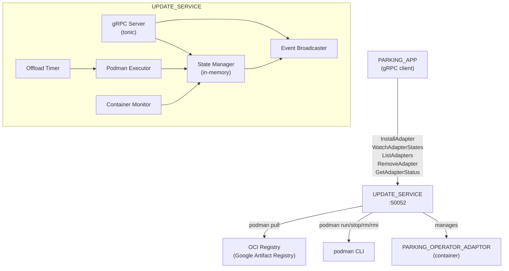
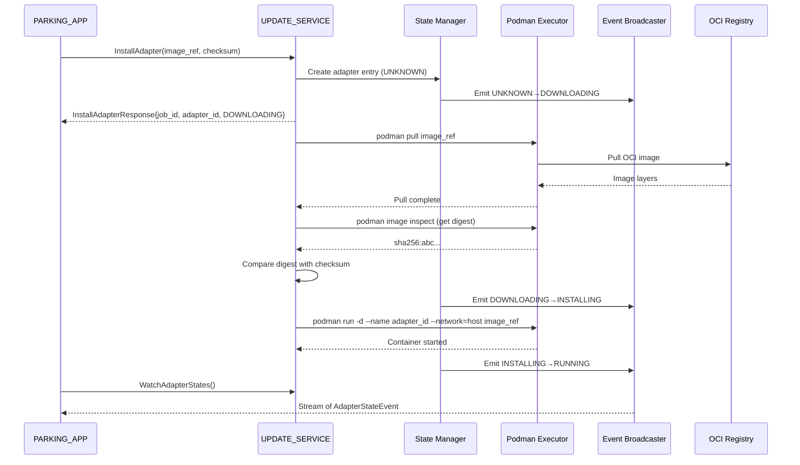

# Design Document: UPDATE_SERVICE

## Overview

The UPDATE_SERVICE is a Rust gRPC server (`rhivos/update-service/`) managing the lifecycle of containerized PARKING_OPERATOR_ADAPTORs in the RHIVOS QM partition. It exposes five RPCs (InstallAdapter, WatchAdapterStates, ListAdapters, RemoveAdapter, GetAdapterStatus) via tonic on a configurable TCP port (default 50052). Container operations are performed by shelling out to podman CLI via `tokio::process::Command`. Adapter state is maintained in-memory only (no persistence). A background task monitors container exits and another handles automatic offloading of unused adapters after a configurable inactivity period.

## Architecture





### Module Responsibilities

1. **main** -- Entry point: loads config, creates shared state, starts gRPC server, registers signal handlers for graceful shutdown.
2. **config** -- Configuration loading and parsing: reads JSON file from `CONFIG_PATH` env var, provides defaults, validates structure.
3. **grpc** -- gRPC service implementation: implements the `UpdateService` tonic trait with all five RPCs, delegates to state manager and podman executor.
4. **state** -- In-memory state manager: thread-safe adapter state storage (`DashMap` or `Arc<Mutex<HashMap>>`), state transition logic, event emission via broadcast channel.
5. **podman** -- Podman executor: async wrappers around podman CLI commands (pull, inspect, run, stop, rm, rmi, wait) via `tokio::process::Command`.
6. **adapter** -- Adapter ID derivation and adapter data types: image ref parsing, adapter state enum, state event structures.
7. **offload** -- Offload timer: background tokio task that periodically checks for STOPPED adapters past the inactivity timeout and triggers offloading.
8. **monitor** -- Container monitor: background task that watches running containers for exit events via `podman wait` and updates state accordingly.

## Execution Paths

### Install Adapter (happy path)

1. Receive `InstallAdapter` RPC with `image_ref` and `checksum_sha256`.
2. Validate inputs (non-empty).
3. Derive `adapter_id` from `image_ref`.
4. Check if another adapter is RUNNING; if so, stop it first (single adapter constraint).
5. Create adapter entry in state manager with state UNKNOWN.
6. Transition to DOWNLOADING, emit event.
7. Return `InstallAdapterResponse{job_id, adapter_id, DOWNLOADING}` immediately.
8. Spawn async task: `podman pull image_ref`.
9. On pull success: `podman image inspect` to get digest, compare with checksum.
10. On checksum match: transition to INSTALLING, emit event; `podman run -d --name adapter_id --network=host image_ref`.
11. On container start: transition to RUNNING, emit event; spawn container monitor for exit detection.

### Remove Adapter

1. Receive `RemoveAdapter` RPC with `adapter_id`.
2. Look up adapter in state manager; if not found, return NOT_FOUND.
3. If RUNNING: `podman stop adapter_id`.
4. Execute `podman rm adapter_id`, then `podman rmi image_ref`.
5. Remove adapter from in-memory state.
6. Return success.

### Automatic Offloading

1. Background task runs on a periodic interval (e.g., every 60 seconds).
2. For each adapter in STOPPED state: check if `now - stopped_at > inactivity_timeout`.
3. If expired: transition to OFFLOADING, emit event.
4. Execute `podman rm adapter_id`, then `podman rmi image_ref`.
5. Remove adapter from in-memory state.

### Container Exit Detection

1. After starting a container, spawn a background task: `podman wait adapter_id`.
2. When `podman wait` returns: read exit code.
3. If exit code 0: transition to STOPPED, emit event, start inactivity timer.
4. If exit code non-zero: transition to ERROR, emit event.

## Components and Interfaces

### gRPC API

| RPC | Request | Response | Errors |
|-----|---------|----------|--------|
| `InstallAdapter` | `image_ref: string, checksum_sha256: string` | `job_id: string, adapter_id: string, state: AdapterState` | INVALID_ARGUMENT |
| `WatchAdapterStates` | (empty) | `stream AdapterStateEvent` | -- |
| `ListAdapters` | (empty) | `adapters: [AdapterInfo]` | -- |
| `RemoveAdapter` | `adapter_id: string` | (empty/success) | NOT_FOUND, INTERNAL |
| `GetAdapterStatus` | `adapter_id: string` | `adapter_id: string, state: AdapterState, image_ref: string` | NOT_FOUND |

### Core Types (Rust)

```rust
#[derive(Clone, Debug, PartialEq)]
pub enum AdapterState {
    Unknown,
    Downloading,
    Installing,
    Running,
    Stopped,
    Error,
    Offloading,
}

pub struct AdapterEntry {
    pub adapter_id: String,
    pub image_ref: String,
    pub checksum_sha256: String,
    pub state: AdapterState,
    pub job_id: String,
    pub stopped_at: Option<Instant>,
    pub error_message: Option<String>,
}

pub struct AdapterStateEvent {
    pub adapter_id: String,
    pub old_state: AdapterState,
    pub new_state: AdapterState,
    pub timestamp: u64, // Unix seconds
}

pub struct Config {
    pub grpc_port: u16,
    pub registry_url: String,
    pub inactivity_timeout_secs: u64,
    pub container_storage_path: String,
}
```

### Module Interfaces

```rust
// config module
pub fn load_config(path: &str) -> Result<Config, ConfigError>;
pub fn default_config() -> Config;

// adapter module
pub fn derive_adapter_id(image_ref: &str) -> String;

// podman module (trait for testability)
#[async_trait]
pub trait PodmanExecutor: Send + Sync {
    async fn pull(&self, image_ref: &str) -> Result<(), PodmanError>;
    async fn inspect_digest(&self, image_ref: &str) -> Result<String, PodmanError>;
    async fn run(&self, adapter_id: &str, image_ref: &str) -> Result<(), PodmanError>;
    async fn stop(&self, adapter_id: &str) -> Result<(), PodmanError>;
    async fn rm(&self, adapter_id: &str) -> Result<(), PodmanError>;
    async fn rmi(&self, image_ref: &str) -> Result<(), PodmanError>;
    async fn wait(&self, adapter_id: &str) -> Result<i32, PodmanError>;
}

// state module
pub struct StateManager { /* ... */ }
impl StateManager {
    pub fn new(broadcaster: broadcast::Sender<AdapterStateEvent>) -> Self;
    pub fn create_adapter(&self, entry: AdapterEntry);
    pub fn transition(&self, adapter_id: &str, new_state: AdapterState, error_msg: Option<String>) -> Result<(), StateError>;
    pub fn get_adapter(&self, adapter_id: &str) -> Option<AdapterEntry>;
    pub fn list_adapters(&self) -> Vec<AdapterEntry>;
    pub fn remove_adapter(&self, adapter_id: &str) -> Result<(), StateError>;
    pub fn get_running_adapter(&self) -> Option<AdapterEntry>;
    pub fn get_offload_candidates(&self, timeout: Duration) -> Vec<AdapterEntry>;
}
```

## Data Models

### Configuration File (config.json)

```json
{
  "grpc_port": 50052,
  "registry_url": "us-docker.pkg.dev/sdv-demo/adapters",
  "inactivity_timeout_secs": 86400,
  "container_storage_path": "/var/lib/containers/adapters/"
}
```

### Adapter State Machine

```
UNKNOWN ──► DOWNLOADING ──► INSTALLING ──► RUNNING ──► STOPPED ──► OFFLOADING ──► (removed)
                 │                │            │                        │
                 └──► ERROR ◄────┘            └──► ERROR               └──► ERROR
                                              │
                                              └──► STOPPED (exit code 0)
```

## Correctness Properties

### Property 1: Adapter ID Determinism

*For any* valid OCI image reference, `derive_adapter_id` SHALL return the same adapter ID on every invocation, and two different image references with different last-segment:tag combinations SHALL produce different adapter IDs.

**Validates: Requirements 07-REQ-1.6**

### Property 2: Single Adapter Invariant

*For any* sequence of `InstallAdapter` calls, the state manager SHALL have at most one adapter in state RUNNING at any point in time.

**Validates: Requirements 07-REQ-2.1, 07-REQ-2.2**

### Property 3: State Transition Validity

*For any* adapter state transition, the transition SHALL follow the valid state machine paths (UNKNOWN to DOWNLOADING, DOWNLOADING to INSTALLING or ERROR, INSTALLING to RUNNING or ERROR, RUNNING to STOPPED or ERROR, STOPPED to RUNNING or OFFLOADING, OFFLOADING to removed or ERROR).

**Validates: Requirements 07-REQ-8.1**

### Property 4: Event Delivery Completeness

*For any* state transition that occurs while subscribers are active, all active subscribers SHALL receive the corresponding `AdapterStateEvent` containing the correct `adapter_id`, `old_state`, and `new_state`.

**Validates: Requirements 07-REQ-3.3, 07-REQ-8.3**

### Property 5: Checksum Verification Soundness

*For any* `InstallAdapter` call where the pulled image digest does not match the provided checksum, the adapter SHALL transition to ERROR and the image SHALL be removed.

**Validates: Requirements 07-REQ-1.3, 07-REQ-1.E4**

### Property 6: Offload Timing Correctness

*For any* adapter in STOPPED state, offloading SHALL NOT occur before `inactivity_timeout_secs` has elapsed since the adapter entered STOPPED state.

**Validates: Requirements 07-REQ-6.1**

## Error Handling

| Error Condition | Behavior | Requirement |
|----------------|----------|-------------|
| Empty image_ref | INVALID_ARGUMENT gRPC status | 07-REQ-1.E1 |
| Empty checksum_sha256 | INVALID_ARGUMENT gRPC status | 07-REQ-1.E2 |
| podman pull fails | Adapter transitions to ERROR, error event emitted | 07-REQ-1.E3 |
| Checksum mismatch | Adapter transitions to ERROR, image removed via podman rmi | 07-REQ-1.E4 |
| podman run fails | Adapter transitions to ERROR, error event emitted | 07-REQ-1.E5 |
| Stop running adapter fails | Old adapter transitions to ERROR, new install proceeds | 07-REQ-2.E1 |
| Subscriber disconnects | Subscriber removed silently, no effect on others | 07-REQ-3.E1 |
| GetAdapterStatus unknown ID | NOT_FOUND gRPC status | 07-REQ-4.E1 |
| RemoveAdapter unknown ID | NOT_FOUND gRPC status | 07-REQ-5.E1 |
| Podman removal command fails | Adapter transitions to ERROR, INTERNAL gRPC status | 07-REQ-5.E2 |
| Offload cleanup fails | Adapter transitions to ERROR, error event emitted | 07-REQ-6.E1 |
| Config file missing | Start with defaults, log warning | 07-REQ-7.E1 |
| Config file invalid JSON | Exit non-zero, log error | 07-REQ-7.E2 |
| Container exits non-zero | Adapter transitions to ERROR, error event emitted | 07-REQ-9.1 |
| Container exits with code 0 | Adapter transitions to STOPPED, event emitted | 07-REQ-9.2 |
| podman wait fails | Adapter transitions to ERROR, error event emitted | 07-REQ-9.E1 |
| Shutdown timeout (10s) | Force-terminate, exit code 0 | 07-REQ-10.E1 |

## Technology Stack

| Technology | Version | Purpose |
|-----------|---------|---------|
| Rust | edition 2021 | Service implementation |
| tonic | latest | gRPC server framework |
| prost | latest | Protobuf code generation |
| tokio | 1.x | Async runtime, process spawning, timers |
| serde | 1.x | JSON config deserialization |
| serde_json | 1.x | JSON parsing |
| uuid | 1.x | UUID v4 generation for job IDs |
| tracing | latest | Structured logging |
| tracing-subscriber | latest | Log output formatting |
| tokio::sync::broadcast | (tokio) | Event broadcasting to subscribers |
| proptest | latest (dev) | Property-based testing |

## Definition of Done

A task group is complete when ALL of the following are true:

1. All subtasks within the group are checked off (`[x]`)
2. All spec tests (`test_spec.md` entries) for the task group pass
3. All property tests for the task group pass
4. All previously passing tests still pass (no regressions)
5. No linter warnings or errors introduced
6. Code is committed on a feature branch and pushed to remote
7. Feature branch is merged back to `main`
8. `tasks.md` checkboxes are updated to reflect completion

## Testing Strategy

- **Unit tests:** Rust `#[cfg(test)]` modules alongside source. The `config`, `adapter`, `state`, and `podman` modules each have unit tests. The podman module uses a `MockPodmanExecutor` implementing the `PodmanExecutor` trait for deterministic testing without real containers.
- **Property tests:** `proptest` crate for adapter ID derivation, state machine invariants, and single-adapter constraint verification.
- **Integration tests:** Go test harness in `tests/update-service/` using `grpcurl` or a generated Go gRPC client to test the running service against a real or mock podman environment.
- **All Rust tests run via:** `cd rhivos && cargo test -p update-service`
- **Integration tests run via:** `cd tests/update-service && go test -v ./...`

## Operational Readiness

- **Startup logging:** Logs gRPC port, inactivity timeout, and a ready message via `tracing`.
- **Shutdown:** Handles SIGTERM/SIGINT via `tokio::signal`, drains in-flight RPCs with a 10-second timeout, then exits with code 0.
- **Health:** Service availability is indicated by the gRPC server accepting connections.
- **Rollback:** Revert via `git checkout`. In-memory state is lost on restart (by design -- demo simplification).
