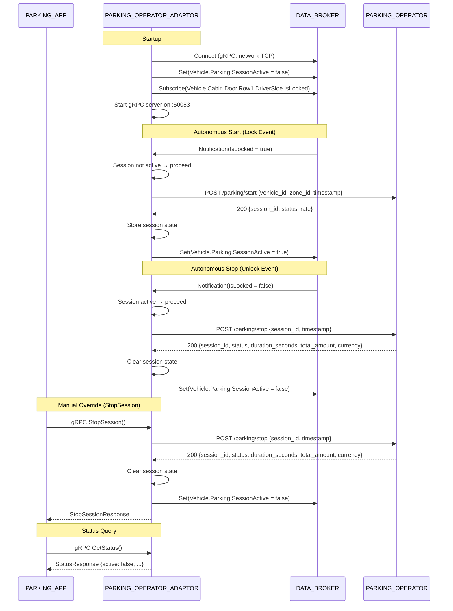

# Design Document: PARKING_OPERATOR_ADAPTOR

## Overview

The PARKING_OPERATOR_ADAPTOR is a Rust binary (`rhivos/parking-operator-adaptor`) that runs as a long-lived containerized process in the RHIVOS QM partition. It serves a dual role: (1) exposing a gRPC interface for PARKING_APP to manually manage parking sessions, and (2) autonomously starting/stopping sessions based on lock/unlock events from DATA_BROKER. Outbound communication with the PARKING_OPERATOR backend uses REST (reqwest). Session state is maintained in-memory only. Events and commands are serialized through a single processing loop to prevent race conditions.

## Architecture

```mermaid
flowchart TD
    subgraph QMPartition["RHIVOS QM Partition"]
        POA["PARKING_OPERATOR_ADAPTOR\n(gRPC :50053)"]
    end

    subgraph SafetyPartition["RHIVOS Safety Partition"]
        DB["DATA_BROKER\n(Kuksa Databroker)"]
    end

    PA["PARKING_APP"] -->|gRPC: StartSession, StopSession,\nGetStatus, GetRate| POA

    DB -->|subscribe:\nVehicle.Cabin.Door.Row1.DriverSide.IsLocked| POA
    POA -->|write:\nVehicle.Parking.SessionActive| DB

    PO["PARKING_OPERATOR\n(REST)"] <-->|POST /parking/start\nPOST /parking/stop\nGET /parking/status/{id}| POA
```



### Module Responsibilities

1. **main** — Entry point: parses config from env vars, connects to DATA_BROKER, starts gRPC server, creates the event processing loop, handles shutdown signals.
2. **config** — Configuration: reads and validates environment variables (PARKING_OPERATOR_URL, DATA_BROKER_ADDR, GRPC_PORT, VEHICLE_ID, ZONE_ID) with defaults.
3. **session** — Session state management: in-memory session record (session_id, zone_id, start_time, rate, active), start/stop/query operations.
4. **operator** — PARKING_OPERATOR REST client: sends start/stop/status requests via reqwest, parses responses, implements retry logic with exponential backoff.
5. **broker** — DATA_BROKER client abstraction: wraps tonic-generated kuksa.val.v1 gRPC client, provides typed subscribe/set operations on VSS signals.
6. **grpc_server** — gRPC service implementation: handles StartSession, StopSession, GetStatus, GetRate RPCs, delegates to the session/operator modules.
7. **event_loop** — Event processing: receives lock/unlock events from DATA_BROKER subscription and gRPC commands from the server, serializes them into a single processing stream.

## Execution Paths

### Path 1: Autonomous Session Start (Lock Event)

1. DATA_BROKER subscription delivers `IsLocked = true`
2. Event loop checks session state: if active → log info, no-op
3. If not active → call `operator::start_session(vehicle_id, zone_id)`
4. On success → update session state, set `Vehicle.Parking.SessionActive = true` in DATA_BROKER
5. On failure (after retries) → log error, session state unchanged

### Path 2: Autonomous Session Stop (Unlock Event)

1. DATA_BROKER subscription delivers `IsLocked = false`
2. Event loop checks session state: if not active → log info, no-op
3. If active → call `operator::stop_session(session_id)`
4. On success → clear session state, set `Vehicle.Parking.SessionActive = false` in DATA_BROKER
5. On failure (after retries) → log error, session state unchanged

### Path 3: Manual StartSession (gRPC)

1. PARKING_APP calls `StartSession(zone_id)` via gRPC
2. If session already active → return `ALREADY_EXISTS` error
3. Call `operator::start_session(vehicle_id, zone_id)`
4. On success → update session state, set `Vehicle.Parking.SessionActive = true` in DATA_BROKER
5. Return StartSessionResponse with session_id, status, rate

### Path 4: Manual StopSession (gRPC)

1. PARKING_APP calls `StopSession()` via gRPC
2. If no session active → return `FAILED_PRECONDITION` error
3. Call `operator::stop_session(session_id)`
4. On success → clear session state, set `Vehicle.Parking.SessionActive = false` in DATA_BROKER
5. Return StopSessionResponse with session_id, status, duration, total, currency

### Path 5: GetStatus / GetRate Query (gRPC)

1. PARKING_APP calls `GetStatus()` or `GetRate()` via gRPC
2. Read in-memory session state
3. Return current state (or empty/inactive response if no session)

## Components and Interfaces

### CLI Interface

```
$ parking-operator-adaptor
parking-operator-adaptor v0.1.0 - Parking operator adapter for RHIVOS QM

Usage: parking-operator-adaptor [options]

Environment:
  PARKING_OPERATOR_URL   Operator REST base URL (default: http://localhost:8080)
  DATA_BROKER_ADDR       DATA_BROKER gRPC address (default: http://localhost:55556)
  GRPC_PORT              gRPC listen port (default: 50053)
  VEHICLE_ID             Vehicle identifier (default: DEMO-VIN-001)
  ZONE_ID                Default parking zone (default: zone-demo-1)

The service subscribes to lock/unlock events and manages parking sessions
autonomously. Manual override available via gRPC.
```

### Core Data Types

```rust
/// In-memory parking session state
struct SessionState {
    session_id: String,
    zone_id: String,
    start_time: i64,        // Unix timestamp
    rate: Rate,
    active: bool,
}

/// Rate information from PARKING_OPERATOR
struct Rate {
    rate_type: String,      // "per_hour" | "flat_fee"
    amount: f64,
    currency: String,
}

/// Configuration parsed from environment
struct Config {
    parking_operator_url: String,
    data_broker_addr: String,
    grpc_port: u16,
    vehicle_id: String,
    zone_id: String,
}

/// Operator REST start response
struct StartResponse {
    session_id: String,
    status: String,
    rate: Rate,
}

/// Operator REST stop response
struct StopResponse {
    session_id: String,
    status: String,
    duration_seconds: u64,
    total_amount: f64,
    currency: String,
}

/// Internal event type for serialized processing
enum SessionEvent {
    LockChanged(bool),                          // from DATA_BROKER subscription
    ManualStart { zone_id: String },            // from gRPC StartSession
    ManualStop,                                 // from gRPC StopSession
    QueryStatus { reply: oneshot::Sender },     // from gRPC GetStatus
    QueryRate { reply: oneshot::Sender },        // from gRPC GetRate
}
```

### Module Interfaces

```rust
// config module
fn load_config() -> Result<Config, ConfigError>;

// session module
struct Session { /* wraps Option<SessionState> */ }
impl Session {
    fn new() -> Self;
    fn is_active(&self) -> bool;
    fn start(&mut self, session_id: String, zone_id: String, start_time: i64, rate: Rate);
    fn stop(&mut self) -> Option<String>;  // returns session_id if was active
    fn status(&self) -> Option<&SessionState>;
    fn rate(&self) -> Option<&Rate>;
}

// operator module
struct OperatorClient { /* wraps reqwest::Client + base_url */ }
impl OperatorClient {
    fn new(base_url: &str) -> Self;
    async fn start_session(&self, vehicle_id: &str, zone_id: &str) -> Result<StartResponse, OperatorError>;
    async fn stop_session(&self, session_id: &str) -> Result<StopResponse, OperatorError>;
    async fn get_status(&self, session_id: &str) -> Result<StatusResponse, OperatorError>;
}

// broker module
struct BrokerClient { /* wraps kuksa.val.v1 gRPC client */ }
impl BrokerClient {
    async fn connect(addr: &str) -> Result<Self, BrokerError>;
    async fn subscribe_bool(&self, signal: &str) -> Result<BoolSubscriptionStream, BrokerError>;
    async fn set_bool(&self, signal: &str, value: bool) -> Result<(), BrokerError>;
}

// grpc_server module
struct ParkingAdaptorService { /* holds event channel sender */ }
impl ParkingAdaptor for ParkingAdaptorService {
    async fn start_session(&self, request: Request<StartSessionRequest>) -> Result<Response<StartSessionResponse>, Status>;
    async fn stop_session(&self, request: Request<StopSessionRequest>) -> Result<Response<StopSessionResponse>, Status>;
    async fn get_status(&self, request: Request<GetStatusRequest>) -> Result<Response<GetStatusResponse>, Status>;
    async fn get_rate(&self, request: Request<GetRateRequest>) -> Result<Response<GetRateResponse>, Status>;
}
```

## Data Models

### Operator REST: Start Session Request

```json
{
  "vehicle_id": "string (from VEHICLE_ID env)",
  "zone_id": "string (from ZONE_ID env or StartSession param)",
  "timestamp": "integer (Unix timestamp)"
}
```

### Operator REST: Start Session Response

```json
{
  "session_id": "string (UUID from operator)",
  "status": "string (e.g. 'active')",
  "rate": {
    "type": "string ('per_hour' | 'flat_fee')",
    "amount": "number (e.g. 2.50)",
    "currency": "string (e.g. 'EUR')"
  }
}
```

### Operator REST: Stop Session Request

```json
{
  "session_id": "string (from session state)",
  "timestamp": "integer (Unix timestamp)"
}
```

### Operator REST: Stop Session Response

```json
{
  "session_id": "string",
  "status": "string (e.g. 'completed')",
  "duration_seconds": "integer",
  "total_amount": "number",
  "currency": "string"
}
```

### Configuration

| Env Var | Default | Description |
|---------|---------|-------------|
| `PARKING_OPERATOR_URL` | `http://localhost:8080` | PARKING_OPERATOR REST base URL |
| `DATA_BROKER_ADDR` | `http://localhost:55556` | DATA_BROKER gRPC endpoint (network TCP) |
| `GRPC_PORT` | `50053` | gRPC listen port |
| `VEHICLE_ID` | `DEMO-VIN-001` | Vehicle identifier for operator requests |
| `ZONE_ID` | `zone-demo-1` | Default parking zone identifier |

## Correctness Properties

### Property 1: Session State Consistency

*For any* sequence of lock events, unlock events, and manual gRPC calls, the in-memory session state SHALL match the last successful operation outcome. If a start succeeded, `active == true`. If a stop succeeded or no start has occurred, `active == false`.

**Validates: Requirements 08-REQ-6.1, 08-REQ-6.2, 08-REQ-6.3**

### Property 2: Idempotent Lock Events

*For any* lock event received when a session is already active, the service SHALL not call the PARKING_OPERATOR and SHALL not modify session state. For any unlock event received when no session is active, the same applies.

**Validates: Requirements 08-REQ-3.E1, 08-REQ-3.E2**

### Property 3: Override Non-Persistence

*For any* manual StopSession followed by a lock event, the service SHALL start a new session autonomously. Manual override does not disable autonomous behavior beyond the current cycle.

**Validates: Requirements 08-REQ-5.1, 08-REQ-5.2, 08-REQ-5.3, 08-REQ-5.E1**

### Property 4: Retry Exhaustion Safety

*For any* PARKING_OPERATOR REST call that fails all 3 retry attempts, the service SHALL not update session state and SHALL return an error to the caller. The service SHALL remain operational and process subsequent events.

**Validates: Requirements 08-REQ-2.E1, 08-REQ-2.E2**

### Property 5: SessionActive Signal Consistency

*For any* successful session start, `Vehicle.Parking.SessionActive` SHALL be `true` in DATA_BROKER. For any successful session stop, it SHALL be `false`. The signal value SHALL always match `session.active`.

**Validates: Requirements 08-REQ-4.1, 08-REQ-4.2, 08-REQ-4.3**

### Property 6: Sequential Event Processing

*For any* concurrent arrival of lock/unlock events and gRPC commands, the service SHALL serialize processing so that at most one operation is in-flight at any time. No race conditions on session state.

**Validates: Requirements 08-REQ-9.1, 08-REQ-9.2**

## Error Handling

| Error Condition | Behavior | Requirement |
|----------------|----------|-------------|
| PARKING_OPERATOR REST call fails | Retry up to 3 times with exponential backoff (1s, 2s, 4s), then return UNAVAILABLE error | 08-REQ-2.E1 |
| PARKING_OPERATOR returns non-200 status | Treat as failure, apply retry logic | 08-REQ-2.E2 |
| DATA_BROKER unreachable on startup | Retry with exponential backoff (1s, 2s, 4s) up to 5 attempts, then exit non-zero | 08-REQ-3.E3 |
| Lock event while session active | No-op, log info message | 08-REQ-3.E1 |
| Unlock event while no session active | No-op, log info message | 08-REQ-3.E2 |
| StartSession when session active | Return ALREADY_EXISTS gRPC error | 08-REQ-1.E1 |
| StopSession when no session active | Return FAILED_PRECONDITION gRPC error | 08-REQ-1.E2 |
| Publishing SessionActive to DATA_BROKER fails | Log error, continue operation | 08-REQ-4.E1 |
| GRPC_PORT non-numeric | Exit with non-zero code, log error | 08-REQ-7.E1 |
| Service restart | Session state lost, start with no active session | 08-REQ-6.E1 |
| SIGTERM during in-flight REST call | Wait for call to complete or timeout, then exit 0 | 08-REQ-8.E1 |

## Technology Stack

| Technology | Version | Purpose |
|-----------|---------|---------|
| Rust | edition 2021 | Service implementation |
| tonic | 0.11+ | gRPC server and DATA_BROKER client |
| prost | 0.12+ | Protocol Buffer code generation |
| tokio | 1.x | Async runtime |
| reqwest | 0.11+ | HTTP client for PARKING_OPERATOR REST API |
| serde / serde_json | 1.x | JSON serialization/deserialization |
| tracing | 0.1+ | Structured logging |
| kuksa.val.v1 proto | — | Kuksa Databroker gRPC API definitions (vendored) |
| parking_adaptor.proto | — | ParkingAdaptor gRPC service definition (from spec 01 group 6) |

## Definition of Done

A task group is complete when ALL of the following are true:

1. All subtasks within the group are checked off (`[x]`)
2. All spec tests (`test_spec.md` entries) for the task group pass
3. All property tests for the task group pass
4. All previously passing tests still pass (no regressions)
5. No linter warnings or errors introduced
6. Code is committed on a feature branch and pushed to remote
7. Feature branch is merged back to `main`
8. `tasks.md` checkboxes are updated to reflect completion

## Testing Strategy

- **Unit tests:** The `config`, `session`, `operator`, and `grpc_server` modules contain pure functions or mockable interfaces testable without external services. Tests use `#[test]` and `#[tokio::test]` with mock HTTP servers (via `mockito` or `wiremock`) and mock DATA_BROKER clients.
- **Integration tests:** A `tests/parking-operator-adaptor/` Go module starts the DATA_BROKER container and a mock PARKING_OPERATOR HTTP server, runs the parking-operator-adaptor binary, and verifies end-to-end lock→start→unlock→stop flows via gRPC and DATA_BROKER signals.
- **Property tests:** Use `proptest` crate for session state invariants (idempotent operations, override non-persistence, state consistency after arbitrary event sequences).
- **Mock operator:** Unit tests for the operator module use a mock HTTP server (wiremock or similar) that returns configurable responses and can simulate failures for retry testing.
- **Mock broker:** Unit tests for the event loop and gRPC server use a mock `BrokerClient` trait implementation to avoid dependency on a live DATA_BROKER.

## Operational Readiness

- **Startup logging:** Service logs version, all configuration values (PARKING_OPERATOR_URL, DATA_BROKER_ADDR, GRPC_PORT, VEHICLE_ID, ZONE_ID), and a "ready" message once initialized.
- **Shutdown:** Handles SIGTERM/SIGINT, completes in-flight operations, logs shutdown message, exits 0.
- **Health:** The service is healthy if the gRPC server is listening and the DATA_BROKER subscription is active. No separate health endpoint (containerized service — liveness is checked by the container runtime).
- **Rollback:** Revert to skeleton binary via `git checkout`. No persistent state — session state is in-memory only.
