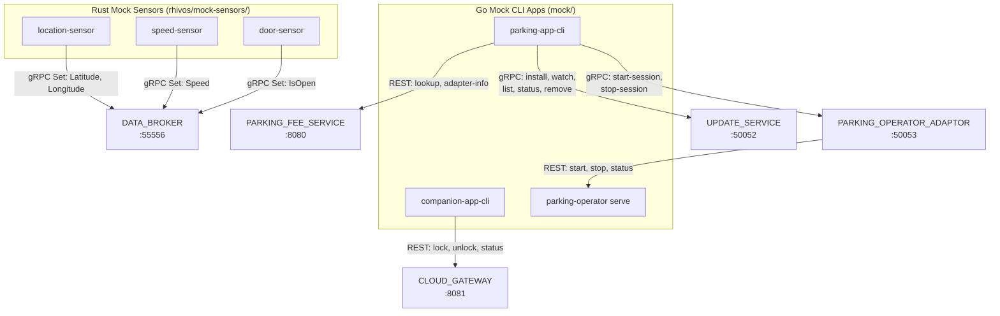
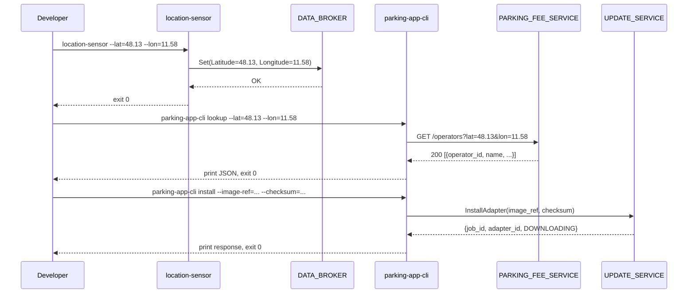

# Design Document: Mock Apps

## Overview

The Mock Apps are six on-demand CLI tools that simulate real vehicle sensors, the PARKING_APP, the COMPANION_APP, and a PARKING_OPERATOR. They are divided into two groups: three Rust sensor binaries in `rhivos/mock-sensors/` (fire-and-forget tools publishing to DATA_BROKER via kuksa.val.v1 gRPC) and three Go CLI applications in `mock/` (parking-app-cli querying REST/gRPC backends, companion-app-cli issuing REST commands, and parking-operator running a long-lived HTTP server). All tools follow consistent error handling: stderr for errors, exit 1 on failure, exit 0 on success.

## Architecture





### Module Responsibilities

#### Rust Mock Sensors (`rhivos/mock-sensors/`)

1. **lib.rs** — Shared helper: `publish_datapoint(broker_addr, path, value)` connecting to DATA_BROKER via kuksa.val.v1 gRPC `Set` RPC.
2. **bin/location-sensor.rs** — Parses `--lat`, `--lon`, `--broker-addr` args; calls `publish_datapoint` twice (Latitude, Longitude).
3. **bin/speed-sensor.rs** — Parses `--speed`, `--broker-addr` args; calls `publish_datapoint` once (Speed).
4. **bin/door-sensor.rs** — Parses `--open`/`--closed`, `--broker-addr` args; calls `publish_datapoint` once (IsOpen).
5. **build.rs** — tonic-build code generation from vendored `proto/` kuksa.val.v1 protos.

#### Go Mock CLI Apps (`mock/`)

6. **parking-app-cli/main.go** — CLI with subcommands: `lookup`, `adapter-info`, `install`, `watch`, `list`, `remove`, `status`, `start-session`, `stop-session`. Routes to REST or gRPC clients based on subcommand.
7. **companion-app-cli/main.go** — CLI with subcommands: `lock`, `unlock`, `status`. HTTP client with bearer token auth targeting CLOUD_GATEWAY.
8. **parking-operator/main.go** — CLI with `serve` subcommand. Starts HTTP server with `/parking/start`, `/parking/stop`, `/parking/status/{session_id}` endpoints. In-memory session store, UUID generation, rate calculation.

## Execution Paths

### Mock Sensor Execution (fire-and-forget)

1. Parse CLI arguments (clap).
2. Resolve DATA_BROKER address (flag > env > default).
3. Connect to DATA_BROKER via tonic gRPC.
4. Call kuksa.val.v1 `Set` RPC with the target VSS path and value.
5. Exit 0 on success; print error to stderr and exit 1 on failure.

### parking-app-cli Execution

1. Parse subcommand and flags.
2. Resolve target service address (flag > env > default).
3. **REST subcommands** (lookup, adapter-info): HTTP GET, print JSON response, exit 0.
4. **gRPC subcommands** (install, list, watch, status, remove): Connect via tonic, call RPC, print response, exit 0.
5. **Session subcommands** (start-session, stop-session): Connect to PARKING_OPERATOR_ADAPTOR via tonic, call RPC, print response, exit 0.
6. `watch` is streaming: print each event until stream ends or SIGINT.

### companion-app-cli Execution

1. Parse subcommand and flags.
2. Resolve CLOUD_GATEWAY address and bearer token (flag > env).
3. **lock/unlock**: POST to `/vehicles/{vin}/commands` with Authorization header.
4. **status**: GET `/vehicles/{vin}/commands/{command_id}` with Authorization header.
5. Print JSON response, exit 0. Print error to stderr, exit 1 on failure.

### parking-operator serve Execution

1. Parse `serve` subcommand and `--port` flag.
2. Start HTTP server on configured port.
3. Handle requests:
   - `POST /parking/start`: Generate UUID session_id, store session in memory, return JSON.
   - `POST /parking/stop`: Look up session, calculate duration, compute total_amount, return JSON.
   - `GET /parking/status/{session_id}`: Look up session, return JSON.
4. Graceful shutdown on SIGTERM/SIGINT, exit 0.

## Components and Interfaces

### Mock Sensor Shared Library (Rust)

```rust
// rhivos/mock-sensors/src/lib.rs

pub mod kuksa {
    pub mod val {
        pub mod v1 {
            tonic::include_proto!("kuksa.val.v1");
        }
    }
}

pub enum DatapointValue {
    Double(f64),
    Float(f32),
    Bool(bool),
}

pub async fn publish_datapoint(
    broker_addr: &str,
    path: &str,
    value: DatapointValue,
) -> Result<(), Box<dyn std::error::Error>>;
```

### parking-operator REST API

| Endpoint | Method | Request Body | Response Body |
|----------|--------|-------------|---------------|
| `/parking/start` | POST | `{"vehicle_id", "zone_id", "timestamp"}` | `{"session_id", "status": "active", "rate": {"rate_type": "per_hour", "amount": 2.50, "currency": "EUR"}}` |
| `/parking/stop` | POST | `{"session_id", "timestamp"}` | `{"session_id", "status": "stopped", "duration_seconds", "total_amount", "currency": "EUR"}` |
| `/parking/status/{session_id}` | GET | — | `{"session_id", "status", "zone_id", "start_time", ...}` |

### companion-app-cli REST Calls

| Subcommand | Method | Endpoint | Request Body |
|------------|--------|----------|-------------|
| `lock` | POST | `/vehicles/{vin}/commands` | `{"type": "lock", "doors": ["driver"]}` |
| `unlock` | POST | `/vehicles/{vin}/commands` | `{"type": "unlock", "doors": ["driver"]}` |
| `status` | GET | `/vehicles/{vin}/commands/{command_id}` | — |

### parking-app-cli gRPC Calls

| Subcommand | Service | RPC |
|------------|---------|-----|
| `install` | UpdateService | `InstallAdapter(image_ref, checksum)` |
| `watch` | UpdateService | `WatchAdapterStates()` (stream) |
| `list` | UpdateService | `ListAdapters()` |
| `status` | UpdateService | `GetAdapterStatus(adapter_id)` |
| `remove` | UpdateService | `RemoveAdapter(adapter_id)` |
| `start-session` | ParkingAdaptor | `StartSession(zone_id)` |
| `stop-session` | ParkingAdaptor | `StopSession()` |

## Data Models

### Session (parking-operator in-memory)

```go
type Session struct {
    SessionID  string    `json:"session_id"`
    VehicleID  string    `json:"vehicle_id"`
    ZoneID     string    `json:"zone_id"`
    Status     string    `json:"status"`       // "active" | "stopped"
    StartTime  int64     `json:"start_time"`
    StopTime   int64     `json:"stop_time,omitempty"`
    Duration   uint64    `json:"duration_seconds,omitempty"`
    TotalAmt   float64   `json:"total_amount,omitempty"`
    Currency   string    `json:"currency,omitempty"`
    Rate       Rate      `json:"rate"`
}

type Rate struct {
    RateType string  `json:"rate_type"` // "per_hour"
    Amount   float64 `json:"amount"`    // 2.50
    Currency string  `json:"currency"`  // "EUR"
}
```

### VSS Signals Written by Mock Sensors

| Signal Path | Data Type | Binary |
|-------------|-----------|--------|
| `Vehicle.CurrentLocation.Latitude` | double | location-sensor |
| `Vehicle.CurrentLocation.Longitude` | double | location-sensor |
| `Vehicle.Speed` | float | speed-sensor |
| `Vehicle.Cabin.Door.Row1.DriverSide.IsOpen` | bool | door-sensor |

## Correctness Properties

### Property 1: Sensor Publish-and-Exit

*For any* invocation of a mock sensor binary with valid arguments and a reachable DATA_BROKER, the tool SHALL publish exactly the specified VSS signal value(s) and exit with code 0.

**Validates: Requirements 09-REQ-1.1, 09-REQ-2.1, 09-REQ-3.1**

### Property 2: CLI Argument Validation

*For any* invocation of a mock tool with missing required arguments, the tool SHALL print a usage error to stderr and exit with code 1 without making any network calls.

**Validates: Requirements 09-REQ-1.E1, 09-REQ-2.E1, 09-REQ-3.E1, 09-REQ-4.E1, 09-REQ-5.E1, 09-REQ-7.E1**

### Property 3: Connection Error Propagation

*For any* invocation of a mock tool when the target service is unreachable, the tool SHALL print a connection error to stderr and exit with code 1.

**Validates: Requirements 09-REQ-1.E2, 09-REQ-2.E2, 09-REQ-3.E2, 09-REQ-4.E2, 09-REQ-5.E2, 09-REQ-6.E1, 09-REQ-7.E3**

### Property 4: Parking Operator Session Integrity

*For any* start-stop sequence on the mock parking-operator, the returned `duration_seconds` SHALL equal `stop_timestamp - start_timestamp` and `total_amount` SHALL equal `rate.amount * duration_hours`.

**Validates: Requirements 09-REQ-8.2, 09-REQ-8.3, 09-REQ-8.5**

### Property 5: Parking Operator Session Uniqueness

*For any* `POST /parking/start` request, the server SHALL generate a unique UUID-format `session_id` and store the session in memory.

**Validates: Requirements 09-REQ-8.2, 09-REQ-8.5**

### Property 6: Bearer Token Enforcement

*For any* companion-app-cli invocation, the tool SHALL include the bearer token from `--token` or `CLOUD_GATEWAY_TOKEN` in the Authorization header, and SHALL fail with exit code 1 if no token is available.

**Validates: Requirements 09-REQ-7.4, 09-REQ-7.E2**

## Error Handling

| Error Condition | Behavior | Requirement |
|----------------|----------|-------------|
| Missing required CLI arguments | Print usage to stderr, exit 1 | 09-REQ-1.E1, 09-REQ-2.E1, 09-REQ-3.E1, 09-REQ-4.E1, 09-REQ-5.E1, 09-REQ-7.E1 |
| DATA_BROKER unreachable | Print error to stderr, exit 1 | 09-REQ-1.E2, 09-REQ-2.E2, 09-REQ-3.E2 |
| PARKING_FEE_SERVICE non-2xx response | Print HTTP status and body to stderr, exit 1 | 09-REQ-4.E2 |
| UPDATE_SERVICE gRPC error | Print gRPC status and message to stderr, exit 1 | 09-REQ-5.E2 |
| PARKING_OPERATOR_ADAPTOR gRPC error | Print gRPC status and message to stderr, exit 1 | 09-REQ-6.E1 |
| Missing bearer token | Print error to stderr, exit 1 | 09-REQ-7.E2 |
| CLOUD_GATEWAY non-2xx response | Print HTTP status and body to stderr, exit 1 | 09-REQ-7.E3 |
| Unknown session_id on stop/status | HTTP 404 with error JSON | 09-REQ-8.E1, 09-REQ-8.E2 |
| Malformed request body | HTTP 400 with error JSON | 09-REQ-8.E3 |

## Technology Stack

| Technology | Version | Purpose |
|-----------|---------|---------|
| Rust | 2021 edition | Mock sensors |
| tonic | latest | gRPC client (sensors to DATA_BROKER) |
| tonic-build | latest | Proto code generation (build.rs) |
| prost | latest | Protobuf serialization |
| tokio | latest | Async runtime |
| clap | latest | CLI argument parsing (Rust) |
| Go | 1.22+ | Mock CLI apps |
| cobra | latest | CLI framework (Go) |
| google.golang.org/grpc | latest | gRPC client (Go) |
| net/http | stdlib | HTTP client/server (Go) |
| google/uuid | latest | UUID generation (Go) |

## Definition of Done

A task group is complete when ALL of the following are true:

1. All subtasks within the group are checked off (`[x]`)
2. All spec tests (`test_spec.md` entries) for the task group pass
3. All property tests for the task group pass
4. All previously passing tests still pass (no regressions)
5. No linter warnings or errors introduced
6. Code is committed on a feature branch and pushed to remote
7. Feature branch is merged back to `main`
8. `tasks.md` checkboxes are updated to reflect completion

## Testing Strategy

- **Rust unit tests:** `#[cfg(test)]` modules in `rhivos/mock-sensors/src/lib.rs` for the `publish_datapoint` helper (using mock gRPC server or error simulation).
- **Rust integration tests:** Binary invocation tests via `assert_cmd` or `std::process::Command`, verifying exit codes and stderr output for argument validation and connection errors.
- **Go unit tests:** Table-driven tests for CLI argument parsing, HTTP request construction, session management logic.
- **Go integration tests:** `tests/mock-apps/` Go module for end-to-end testing of all six mock tools against real or mock backend services.
- **Mock sensor tests run via:** `cd rhivos && cargo test -p mock-sensors`
- **Go mock app tests run via:** `cd mock && go test -v ./...`
- **Integration tests run via:** `cd tests/mock-apps && go test -v ./...`

## Operational Readiness

- **No persistent state:** All mock tools are stateless (sensors) or in-memory only (parking-operator). Restart clears all state.
- **Graceful shutdown:** parking-operator handles SIGTERM/SIGINT, exits with code 0.
- **Logging:** All errors to stderr. Successful output to stdout. parking-operator logs incoming requests to stderr.
- **Rollback:** Revert via `git checkout`. No persistent state to clean up.
