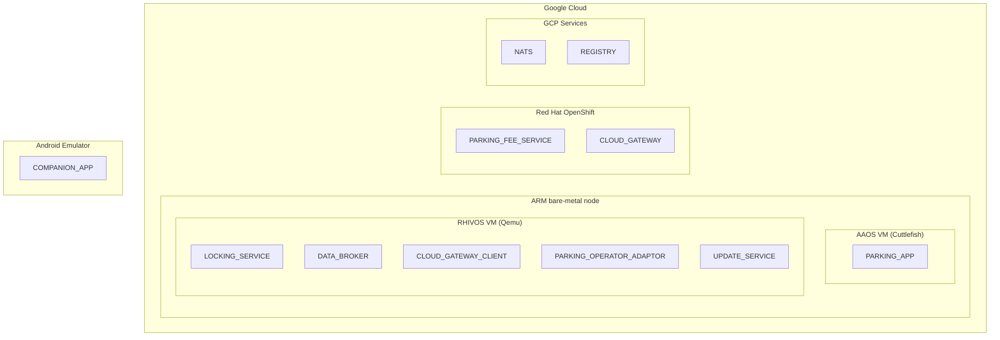
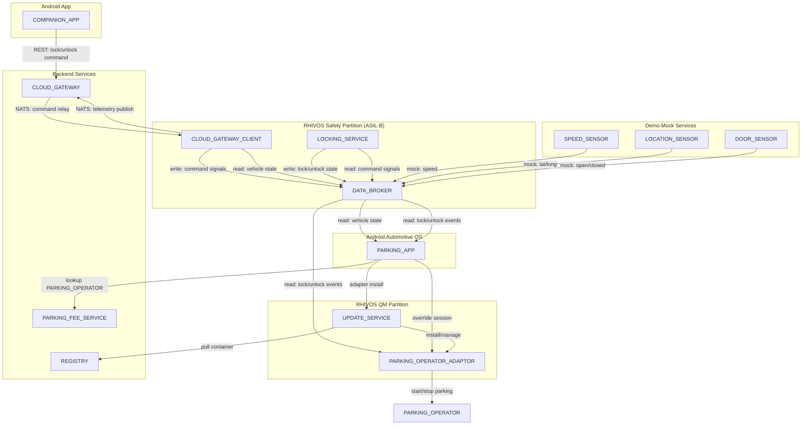

# Abstract

Modern vehicles require communication between safety-critical systems and non-critical applications. This demo shows a working implementation where an on-board parking payment service (Android Automotive OS App) communicates with an ASIL-B door locking service running on Red Hat In-Vehicle OS (RHIVOS). The scenario is realistic: automatic parking fee payment starts when the vehicle locks and stops when it unlocks, requiring cross-domain communication between a QM-level Android application and a safety-relevant locking system.

The architecture spans multiple domains: Android IVI for user interaction, RHIVOS safety partition for door locking (ASIL-B), RHIVOS QM partition for cloud connectivity and access to backend-services deployed in Google Cloud. Development uses Red Hat OpenShift for Cloud Development Environments (CDE) and CI/CD pipelines (also deployed on Google Cloud).

The demo addresses another challenge: how to dynamically provision location-specific services without preloading every possible integration. Parking operators vary by location (city, country), making static deployment impractical. Our implementation uses containerized adapters that download on-demand based on vehicle location, run during the parking session, and offload when unused for some time. This "feature-on-demand" pattern demonstrates how OEMs can enable new services post-production and create additional revenue opportunities through software monetization.

The system supports multiple vehicles simultaneously. Each vehicle is identified by a unique VIN, and COMPANION_APPs are paired with specific VINs for the demo.

Attendees will see functioning code demonstrating practical mixed-criticality integration patterns, container deployment to vehicles, and cloud-native SDV development workflows across multiple domains (Android Automotive, Safe Linux/RHIVOS, Cloud-native services).

## User Journey

1. **Vehicle Arrival:** User parks their vehicle at a designated parking spot in a participating zone.
2. **Automatic Location Detection:** The vehicle's onboard system detects its current location and queries the PARKING_FEE_SERVICE to identify available parking operators for that zone.
3. **Adapter Provisioning:** The PARKING_APP selects the appropriate PARKING_OPERATOR and triggers download of the corresponding PARKING_OPERATOR_ADAPTOR via UPDATE_SERVICE. The adapter initializes automatically on the vehicle's RHIVOS QM partition.
4. **Parking Session Confirmation:** The infotainment (IVI) screen displays: "Parking active - €X.XX/hr" confirming the adapter is ready and showing the applicable rate.
5. **Session Start:** User locks the vehicle with their key fob or the car's COMPANION_APP. The LOCKING_SERVICE publishes the lock event to DATA_BROKER. The PARKING_OPERATOR_ADAPTOR subscribes to this event and autonomously starts the parking session with the PARKING_OPERATOR. The PARKING_APP can override the session state if needed. No physical ticket or app interaction required.
6. **Session End:** User unlocks the vehicle upon return. The PARKING_OPERATOR_ADAPTOR detects the unlock event via DATA_BROKER and autonomously stops the parking session. Payment is processed seamlessly based on actual duration.
7. **Resource Management:** If the adapter remains unused for a configurable period (default: 24 hours) or when RHIVOS QM resources become scarce, the adapter is automatically offloaded to optimize storage and system resources.

## Problem Statement

Parking regulations and payment systems vary significantly by location and PARKING_OPERATOR. Pre-loading the car with all possible PARKING_OPERATOR integrations is impractical due to the dynamic nature of operators and their location-specific requirements.

The car's PARKING_APP uses location data to find a suitable PARKING_OPERATOR by querying a cloud-based PARKING_FEE_SERVICE. The PARKING_FEE_SERVICE needs a flexible solution to support diverse PARKING_OPERATORs and PARKING_METER systems (physical meters, app-based, pay-by-plate, etc.).

### Solution: Dynamic PARKING_OPERATOR_ADAPTORS

The PARKING_APP will utilize flexible PARKING_OPERATOR_ADAPTORS that are loaded into the car on demand. These adaptors interface with both the car's systems (via DATA_BROKER) and the PARKING_OPERATOR they belong to. The PARKING_FEE_SERVICE acts as a "trusted source" for discovering PARKING_OPERATORs and providing validated adapter metadata (image references, checksums) to the PARKING_APP. Unused adaptors can be offloaded to free up resources on the car after a configurable period of inactivity.

### Session Lifecycle

Session ownership belongs to the PARKING_OPERATOR_ADAPTOR:

1. **Setup phase:** The PARKING_APP discovers operators via PARKING_FEE_SERVICE, selects one, and triggers adapter installation via UPDATE_SERVICE.
2. **Autonomous operation:** Once running, the PARKING_OPERATOR_ADAPTOR subscribes to lock/unlock events from DATA_BROKER and autonomously starts/stops parking sessions with the PARKING_OPERATOR.
3. **Override:** The PARKING_APP can override the session state (e.g., manually stop a session before unlocking, or prevent auto-start).

### Objectives and Benefits

- To enable automatic parking fee payment via the car's IVI system.
- To eliminate the need for car owners to use multiple, dedicated parking apps.
- To orchestrate interactions with various PARKING_OPERATORs on the user's behalf.
- To provide a flexible and adaptable solution for diverse parking environments.

## Architecture Overview

### Component Placement

1. **Android IVI (QM)**: In-car user interface for the parking app
2. **RHIVOS QM Partition**: Dynamic parking operator adapters (containers), update service
3. **RHIVOS Safety Partition**: ASIL-B door lock service, DATA_BROKER (vehicle signals), cloud gateway client
4. **Cloud (OpenShift)**: Parking fee service (operator discovery), cloud gateway, CDE, CI/CD for development and validation
5. **GCP Services**: OCI container registry (Google Artifact Registry), NATS server
6. **Mobile Companion App**: Typical Android app (optional: iOS), paired with a specific VIN

### Mixed-Criticality Communication Pattern

- ASIL-B services publish safety-relevant state (door lock/unlock) to DATA_BROKER
- ASIL-B services subscribe to command signals from DATA_BROKER (written by CLOUD_GATEWAY_CLIENT)
- QM adapters subscribe to state signals from DATA_BROKER (read-only access to safety-relevant state)
- Isolation enforced by RHIVOS partitioning + hypervisor
- Cross-partition communication uses network TCP/gRPC; same-partition uses Unix Domain Sockets/gRPC

### Development Workflow (Primary Demo Focus)

1. Develop ASIL-B service with RHAS tooling (development, validation, tracing)
2. Develop QM adapter as OCI container
3. All apps and services are developed on OpenShift Dev Spaces or in local IDE
4. All build processes use OpenShift pipelines

### Simplified Implementation (Demo Scope)

- Mock payment processing (no real transactions)
- Generic adapter type (demonstrate pattern, not all operators)
- Simulated location (GPS optional)
- Pre-signed adapters (simplified trust chain)
- Bare-minimum UIX for the Android apps

## Demo Scenarios

### Scenario 1: Happy Path (5 minutes)

1. Show AAOS IVI with parking app
2. Set mock location to Demo Zone
3. Adapter downloads automatically
4. Lock via companion app
5. Show parking session active on IVI
6. Unlock via companion app
7. Show parking fee calculated

### Scenario 2: Adapter Already Installed (2 minutes)

- Return to same zone, no download needed

### Scenario 3: Error Handling (3 minutes)

- Simulate registry unavailable
- Show retry logic and error messages
- Show error capturing in the telemetry stack (optional, future)

## Components

### RHIVOS

#### QM-Partition

##### PARKING_OPERATOR_ADAPTOR

- Containerized application running in the RHIVOS QM partition
- Implements a common gRPC interface towards the PARKING_APP (StartSession, StopSession, GetStatus, GetRate)
- Implements a proprietary REST interface towards its PARKING_OPERATOR
- Subscribes to lock/unlock state signals from DATA_BROKER (cross-partition, network gRPC)
- Autonomously starts parking sessions when a lock event is detected, and stops sessions on unlock events
- The PARKING_APP can override the autonomous session behavior (e.g., manual stop, prevent auto-start)
- Writes parking session state (Vehicle.Parking.SessionActive) to DATA_BROKER

##### UPDATE_SERVICE

- Manages containerized adapter lifecycle in RHIVOS QM partition
- Pulls containers from REGISTRY on demand
- Handles installation, updates, and automatic offloading of unused adapters
- Offloading is triggered by a configurable inactivity timer OR when RHIVOS QM resources become scarce
- gRPC interface: InstallAdapter, WatchAdapterStates, ListAdapters, RemoveAdapter, GetAdapterStatus
- Adapter lifecycle states: UNKNOWN, DOWNLOADING, INSTALLING, RUNNING, STOPPED, ERROR, OFFLOADING

#### Safety-Partition

##### LOCKING_SERVICE

- Runs in the RHIVOS safety-partition
- Subscribes to command signals from DATA_BROKER (Vehicle.Command.Door.Lock) for remote lock/unlock requests from CLOUD_GATEWAY_CLIENT
- Validates safety constraints (e.g., vehicle velocity, door ajar status) before executing lock/unlock commands
- Writes lock/unlock state to DATA_BROKER (Vehicle.Cabin.Door.Row1.DriverSide.IsLocked)
- Writes command response to DATA_BROKER (Vehicle.Command.Door.Response)
- Note: For this demo, focuses on stationary vehicle scenarios where velocity checks are trivial

##### DATA_BROKER

- Eclipse Kuksa Databroker, deployed as a pre-built binary (no wrapper or reimplementation)
- Runs in the RHIVOS safety partition
- VSS-compliant gRPC pub/sub interface for vehicle signals
- Manages signal state and enforces read/write access control
- Same-partition consumers use Unix Domain Sockets (UDS)
- Cross-partition and cross-domain consumers use network TCP (gRPC over HTTP/2)
- The network address and port configuration for cross-partition access is specified in the component design documents

##### CLOUD_GATEWAY_CLIENT

- Maintains secure connection to CLOUD_GATEWAY (NATS with TLS)
- Uses the async-nats Rust client crate for NATS connectivity
- Receives authenticated lock/unlock commands from COMPANION_APP via CLOUD_GATEWAY
- Validates command structure and bearer tokens
- Publishes validated commands to DATA_BROKER as command signals (Vehicle.Command.Door.Lock) — does NOT call LOCKING_SERVICE directly
- Subscribes to DATA_BROKER for vehicle state (lock status, location, parking state)
- Publishes vehicle telemetry (location, door status, parking state) to CLOUD_GATEWAY
- Observes command response signals from DATA_BROKER (Vehicle.Command.Door.Response) and relays results to CLOUD_GATEWAY

### Backend Services

#### PARKING_FEE_SERVICE

- Cloud-based service providing:
  - REST API for parking operator discovery and adapter provisioning
  - Location-based lookup of available PARKING_OPERATORs (geofence polygon matching)
  - Adapter metadata retrieval (OCI image reference, SHA-256 checksum)
  - Health check endpoint
- Acts as a gatekeeper for an external OCI registry (Google Artifact Registry); does not run its own registry
- Operator validation and approval workflow (out-of-scope)
- Does NOT manage parking sessions — session lifecycle is handled by PARKING_OPERATOR_ADAPTOR and PARKING_OPERATOR directly

REST API endpoints:
- `GET /operators?lat={lat}&lon={lon}` — lookup operators by location
- `GET /operators/{id}/adapter` — get adapter metadata (image_ref, checksum)
- `GET /health` — health check

#### REGISTRY

- OCI Container Registry: Google Artifact Registry
- Stores validated and signed PARKING_OPERATOR_ADAPTORs
- Managed by the PARKING_FEE_SERVICE operator (access control, image validation)
- Adapter images are verified by SHA-256 checksum of the OCI manifest digest

#### CLOUD_GATEWAY

- Cloud-based service with two interfaces:
  - **REST API** towards COMPANION_APPs (HTTPS) — receives lock/unlock commands, returns command status
  - **NATS** towards vehicles (CLOUD_GATEWAY_CLIENT) — relays commands and receives telemetry
- Authenticates vehicles and COMPANION_APPs using bearer tokens
- Routes commands between mobile apps and vehicles, translating between REST and NATS protocols
- Aggregates telemetry for fleet operations (optional, later phase)
- Deployed on Google Cloud infrastructure
- Uses containerized NATS server (nats-server) for local development

### AAOS

#### PARKING_APP

- Android Automotive OS application running in the vehicle's IVI
- Provides user interface for parking sessions
- Queries PARKING_FEE_SERVICE for available operators based on vehicle location
- Selects a PARKING_OPERATOR and triggers adapter download via UPDATE_SERVICE
- Can override the PARKING_OPERATOR_ADAPTOR's autonomous session behavior
- Displays session status to the driver (subscribes to DATA_BROKER for Vehicle.Parking.SessionActive)

### Android

#### COMPANION_APP

- Mobile app (Android, optional: iOS)
- Paired with a specific VIN for the demo
- Allows querying the car's state via CLOUD_GATEWAY REST API
- Issues lock/unlock commands to the car remotely via CLOUD_GATEWAY REST API
- Receives command status responses via CLOUD_GATEWAY REST API
- Does NOT use NATS directly; CLOUD_GATEWAY handles protocol translation

**Note**: In production deployments, cloud connectivity typically resides in a separate TCU or QM partition. For this demo, we consolidate CLOUD_GATEWAY_CLIENT into the safety partition to simplify the command path and focus on mixed-criticality application development rather than network architecture.

### Mock Services

All mock services are on-demand tools: they publish values when triggered by CLI interactions or test harnesses. They do not run continuously or publish data on a periodic schedule.

#### LOCATION_SENSOR

- CLI tool that sends mock location data to DATA_BROKER via gRPC
- VSS Vehicle.CurrentLocation.Latitude (double)
- VSS Vehicle.CurrentLocation.Longitude (double)
- Values are specified via CLI arguments or test harness commands

#### SPEED_SENSOR

- CLI tool that sends mock velocity data to DATA_BROKER via gRPC
- VSS Vehicle.Speed (float)
- Values are specified via CLI arguments or test harness commands

#### DOOR_SENSOR

- CLI tool that sends mock door open/closed data to DATA_BROKER via gRPC
- VSS Vehicle.Cabin.Door.Row1.DriverSide.IsOpen (bool)
- Values are specified via CLI arguments or test harness commands

#### PARKING_OPERATOR

- Mock service that receives start/stop parking events from PARKING_OPERATOR_ADAPTOR
- Simulates a real parking operator's REST API

### Deployment Architecture

Since the scope of the demo is primarily on the development workflow and virtual testing, the following deployment architecture is used:



## Communication

### Component Architecture



### Communication Protocols

| Source Component         | Target Component         | Protocol       | Direction          |
| ------------------------ | -------------------------| -------------- | ------------------ |
| LOCKING_SERVICE          | DATA_BROKER              | gRPC (UDS)     | Bidirectional (Write state, Read commands) |
| CLOUD_GATEWAY_CLIENT     | DATA_BROKER              | gRPC (UDS)     | Bidirectional (Write commands, Read state) |
| PARKING_APP              | DATA_BROKER              | Network gRPC   | Read               |
| PARKING_APP              | UPDATE_SERVICE           | Network gRPC   | Request/Response   |
| PARKING_APP              | PARKING_OPERATOR_ADAPTOR | Network gRPC   | Request/Response   |
| PARKING_APP              | PARKING_FEE_SERVICE      | HTTPS/REST     | Request/Response   |
| UPDATE_SERVICE           | REGISTRY                 | HTTPS/OCI      | Pull only          |
| PARKING_OPERATOR_ADAPTOR | DATA_BROKER              | Network gRPC   | Read               |
| PARKING_OPERATOR_ADAPTOR | PARKING_OPERATOR         | HTTPS/REST     | Request/Response   |
| COMPANION_APP            | CLOUD_GATEWAY            | HTTPS/REST     | Request/Response   |
| CLOUD_GATEWAY_CLIENT     | CLOUD_GATEWAY            | NATS (with TLS)| Bidirectional      |

**Note:** All gRPC services use Unix Domain Sockets (UDS) for same-partition communication and network TCP (HTTP/2 over TLS) for cross-partition or cross-domain communication (e.g., AAOS to RHIVOS, QM to Safety). gRPC benefits for this architecture:

1. **Consistency**: All local IPC uses gRPC (DATA_BROKER, UPDATE_SERVICE)
2. **Language Agnostic**: Kotlin (AAOS) ↔ Rust (RHIVOS) seamlessly
3. **Type Safety**: Protocol buffers provide strong typing
4. **Streaming**: Native support for watching adapter state changes
5. **Performance**: Binary protocol, efficient serialization
6. **Tooling**: Excellent debugging tools (`grpcurl`, Postman, Wireshark)
7. **Modern**: Industry-standard, well-documented, actively maintained

### VSS Signals Used

Based on COVESA VSS, version 5.1.

#### State Signals (standard VSS)

- Vehicle.Cabin.Door.Row1.DriverSide.IsLocked (bool) — current lock state, written by LOCKING_SERVICE
- Vehicle.Cabin.Door.Row1.DriverSide.IsOpen (bool) — door ajar detection, written by DOOR_SENSOR
- Vehicle.CurrentLocation.Latitude (double) — vehicle latitude, written by LOCATION_SENSOR
- Vehicle.CurrentLocation.Longitude (double) — vehicle longitude, written by LOCATION_SENSOR
- Vehicle.Speed (float) — vehicle speed, written by SPEED_SENSOR

#### Custom Signals

- Vehicle.Parking.SessionActive (bool) — adapter-managed parking state, written by PARKING_OPERATOR_ADAPTOR
- Vehicle.Command.Door.Lock (string, JSON) — lock/unlock command request, written by CLOUD_GATEWAY_CLIENT
  - Payload: `{"command_id": "<uuid>", "action": "lock"|"unlock", "doors": ["driver"], "source": "companion_app", "vin": "<vin>", "timestamp": <unix_ts>}`
- Vehicle.Command.Door.Response (string, JSON) — command execution result, written by LOCKING_SERVICE
  - Payload: `{"command_id": "<uuid>", "status": "success"|"failed", "reason": "<optional>", "timestamp": <unix_ts>}`

## Message Flows

### Flow 1: Parking Session Start

```
1. LOCKING_SERVICE → DATA_BROKER (gRPC, UDS)
   SetRequest(Vehicle.Cabin.Door.Row1.DriverSide.IsLocked = true)

2. DATA_BROKER → PARKING_OPERATOR_ADAPTOR (gRPC subscription stream, network TCP)
   SubscribeResponse(IsLocked = true, timestamp = T)

3. PARKING_OPERATOR_ADAPTOR → PARKING_OPERATOR (REST)
   POST /parking/start
   {vehicle_id, zone_id, timestamp}

4. PARKING_OPERATOR → PARKING_OPERATOR_ADAPTOR (REST)
   200 OK {session_id, status}

5. PARKING_OPERATOR_ADAPTOR → DATA_BROKER (gRPC, network TCP)
   SetRequest(Vehicle.Parking.SessionActive = true)

6. DATA_BROKER → PARKING_APP (gRPC subscription stream, network TCP)
   SubscribeResponse(SessionActive = true)
```

Note: The PARKING_APP can override the autonomous session behavior by calling StartSession or StopSession on the PARKING_OPERATOR_ADAPTOR directly via gRPC.

### Flow 2: Remote Unlock via Companion App

```
1. COMPANION_APP → CLOUD_GATEWAY (REST)
   POST /vehicles/VIN12345/commands
   Headers: Authorization: Bearer <token>
   Body: {"command_id": "<uuid>", "type": "unlock", "doors": ["driver"]}

2. CLOUD_GATEWAY validates bearer token and publishes to NATS
   CLOUD_GATEWAY → CLOUD_GATEWAY_CLIENT (NATS with TLS)
   PUBLISH vehicles.VIN12345.commands
   {"command_id": "<uuid>", "action": "unlock", "doors": ["driver"], "source": "companion_app"}

3. CLOUD_GATEWAY_CLIENT validates command structure and token

4. CLOUD_GATEWAY_CLIENT → DATA_BROKER (gRPC, UDS)
   SetRequest(Vehicle.Command.Door.Lock = {"command_id": "<uuid>", "action": "unlock", ...})

5. DATA_BROKER → LOCKING_SERVICE (gRPC subscription stream, UDS)
   SubscribeResponse(Vehicle.Command.Door.Lock = {"action": "unlock", ...})

6. LOCKING_SERVICE validates safety constraints (door not ajar, vehicle stationary)

7. LOCKING_SERVICE → DATA_BROKER (gRPC, UDS)
   SetRequest(Vehicle.Cabin.Door.Row1.DriverSide.IsLocked = false)
   SetRequest(Vehicle.Command.Door.Response = {"command_id": "<uuid>", "status": "success"})

8. CLOUD_GATEWAY_CLIENT observes command response via DATA_BROKER subscription
   CLOUD_GATEWAY_CLIENT → CLOUD_GATEWAY (NATS with TLS)
   PUBLISH vehicles.VIN12345.command_responses
   {"command_id": "<uuid>", "status": "success"}

9. CLOUD_GATEWAY → COMPANION_APP (REST)
   Response: 200 OK {"command_id": "<uuid>", "status": "success"}
```

### Flow 3: Adapter Download & Installation

```
1. PARKING_APP → PARKING_FEE_SERVICE (REST)
   GET /operators?lat=48.1351&lon=11.5820
   → Returns [{operator_id, name, zone, rate}]

2. PARKING_APP → PARKING_FEE_SERVICE (REST)
   GET /operators/{operator_id}/adapter
   → Returns {image_ref, checksum_sha256, version}

3. PARKING_APP → UPDATE_SERVICE (gRPC, network TCP)
   InstallAdapter(image_ref, checksum_sha256)
   → Returns InstallAdapterResponse{job_id, adapter_id, state=DOWNLOADING}

4. PARKING_APP starts watching adapter states (gRPC stream)
   WatchAdapterStates() → stream of AdapterStateEvent

5. UPDATE_SERVICE → REGISTRY (HTTPS/OCI)
   GET /v2/adapters/demo-operator/manifests/v1.0
   → Returns manifest

6. UPDATE_SERVICE → REGISTRY (HTTPS/OCI)
   GET /v2/adapters/demo-operator/blobs/{digest}
   → Returns container layers (streaming)

7. UPDATE_SERVICE verifies SHA-256 checksum of OCI manifest digest
   → State: DOWNLOADING → INSTALLING

8. UPDATE_SERVICE extracts container to /var/lib/containers/adapters/

9. UPDATE_SERVICE starts container via podman/crun
   → State: INSTALLING → RUNNING

10. UPDATE_SERVICE → PARKING_APP (gRPC stream)
    AdapterStateEvent{
      adapter_id,
      old_state=INSTALLING,
      new_state=RUNNING
    }

11. PARKING_OPERATOR_ADAPTOR initializes
    - Subscribes to DATA_BROKER for lock events (gRPC, network TCP)
    - Reads current location from DATA_BROKER (gRPC, network TCP)
    - Ready for autonomous parking sessions
```

## Error Handling

### gRPC Error Response Format

```
// Standard gRPC status codes used:
// - OK (0): Success
// - CANCELLED (1): Operation cancelled
// - UNKNOWN (2): Unknown error
// - INVALID_ARGUMENT (3): Invalid request
// - DEADLINE_EXCEEDED (4): Timeout
// - NOT_FOUND (5): Adapter/resource not found
// - ALREADY_EXISTS (6): Adapter already installed
// - PERMISSION_DENIED (7): Insufficient permissions
// - RESOURCE_EXHAUSTED (8): Out of storage/memory
// - FAILED_PRECONDITION (9): System not ready
// - UNAVAILABLE (14): Service temporarily unavailable
// - INTERNAL (13): Internal server error

// Example error details in response metadata:
message ErrorDetails {
  string code = 1;          // "ADAPTER_DOWNLOAD_FAILED"
  string message = 2;       // "Failed to pull container image"
  map<string, string> details = 3;  // Additional context
  int64 timestamp = 4;      // Unix timestamp
}
```

## Development Plan

The following tech stacks are used to develop the various components.

### Implementation

- RHIVOS services: Rust
- Android Automotive OS app: Kotlin
- Android app: Flutter/Dart
- Backend-services: Golang

### Infrastructure and Tooling

- Local development: VS Code based IDE (e.g. Cursor), with Android and Flutter extensions installed.
- Local infrastructure: Podman to build and serve containers, containerized NATS server (nats-server) to simulate the NATS communication.
- Cloud Development: OpenShift Dev Spaces, with Android and Flutter extensions installed in the Dev Spaces container.
- OpenShift Automotive Suite (RHAS): OpenShift cluster on Google Cloud, with Jumpstarter and Builder operator installed to build and validate RHIVOS images.
- Google Compute Engine: ARM bare-metal instance to run Red Hat Jumpstarter exporters and Android Cuttlefish.
- Google Artifact Registry: OCI-compliant container registry to store the PARKING_OPERATOR_ADAPTOR container images.

### Android Development Separation

The two Android applications (PARKING_APP on AAOS and COMPANION_APP on mobile Android) differ fundamentally from the rest of the codebase in toolchain, platform, runtime, and deployment model. To avoid coupling their development lifecycle to the backend-services and RHIVOS components, the following principles apply:

1. **Separate specification and development.** Android app specifications, implementation, and testing are tracked independently from backend-services and RHIVOS work. Each Android app gets its own specification document(s) and can progress on its own schedule without blocking or being blocked by the other domains.

2. **Mock apps for early integration testing.** Until the real Android applications are available, use *mock apps*: lightweight command-line programs that expose the same gRPC interface stubs and follow the same messaging protocols as the real PARKING_APP and COMPANION_APP. These mock apps:
   - Can be run interactively by a developer to manually trigger actions (e.g., send a lock command, query parking status).
   - Can be scripted for automated end-to-end tests against the backend-services and RHIVOS components.
   - Are written in the same language as the component they interact with most closely (e.g., Go for backend-facing mocks, Rust for RHIVOS-facing mocks), keeping toolchain overhead minimal.
   - Share the same `.proto` definitions and message schemas as the real Android apps, ensuring interface fidelity.

This approach lets backend and RHIVOS development proceed at full speed, with testable integration points, long before any Android UI work begins.

### Code Repositories

- [rhadp/parking-fee-service](https://github.com/rhadp/parking-fee-service): The monorepo used for all components.

### Specification Strategy

Each component or development phase gets its own specification (one spec per component and development phase). This keeps individual specs focused and allows parallel development across teams. Cross-spec dependencies are tracked via dependency tables in each spec's PRD.

### Development Phases

Developing the demo happens in multiple phases. The first iterations SHOULD happen locally, until a first MVP state is reached. Once sufficient functionality is in place, create end-to-end pipelines for e.g. nightly builds and continuous deployment. At this point, local and cloud-based development should be interchangeable.

#### Phase 1: Planning and Setup

##### Phase 1.1: Requirements Engineering

- Iterate over PRD.md (this document) and translate the "product requirements" into a series of specifications.
- One specification per component and development phase.

##### Phase 1.2: Setup

- Setup the code repo, with dedicated sub-folders for each type of code:
  - RHIVOS services: Rust
  - Android Automotive OS app: Kotlin
  - Android app: Flutter, Dart
  - Backend-services: Golang
- Create skeleton implementations for each component, except for the Android Automotive OS and Android app. They will come in a later stage. Just keep the placeholder directories.
- Create mock CLI apps for PARKING_APP and COMPANION_APP (see *Android Development Separation*) so that backend-services and RHIVOS components can be integration-tested without real Android builds.
- Create local build capabilities for each toolchain using make/cmake etc.
- Setup local infrastructure, used for local unit and integration testing.
- Setup local unit and integration testing capabilities.

#### Phase 2: Implementation

##### Phase 2.1: RHIVOS Safety Partition

- Implementation of the ASIL-B services:
  - CLOUD_GATEWAY_CLIENT
  - LOCKING_SERVICE
  - DATA_BROKER (deployment and configuration of Eclipse Kuksa Databroker)
  - Demo Mock Services to test the above services

##### Phase 2.2: Vehicle-to-Cloud Connectivity

- Implementation of the V2X connectivity:
  - CLOUD_GATEWAY (dual interface: REST for COMPANION_APP, NATS for vehicle)
  - Mock COMPANION_APP CLI app to test the CLOUD_GATEWAY without the real COMPANION_APP (see *Android Development Separation*)
  - Integration test of bidirectional CLOUD_GATEWAY ↔ CLOUD_GATEWAY_CLIENT communication (over NATS)

##### Phase 2.3: RHIVOS QM Partition

- Implementation of the RHIVOS QM services:
  - Generic PARKING_OPERATOR_ADAPTOR (with autonomous session management via DATA_BROKER events)
  - UPDATE_SERVICE
  - Mock PARKING_OPERATOR to test the PARKING_OPERATOR_ADAPTOR
  - Mock PARKING_APP CLI app to test the UPDATE_SERVICE without the real PARKING_APP (see *Android Development Separation*)
  - Integration test of DATA_BROKER to PARKING_OPERATOR_ADAPTOR communication

##### Phase 2.4: Parking Fee Service

- Implementation of the PARKING_FEE_SERVICE (operator discovery and adapter metadata only)
- Integration test of PARKING_APP mock, PARKING_FEE_SERVICE, UPDATE_SERVICE communication

##### Phase 2.5: PARKING_APP (AAOS)

- Implementation of the PARKING_APP Android Automotive OS application
- Integration test of PARKING_APP, PARKING_FEE_SERVICE, UPDATE_SERVICE communication
- Integration test of PARKING_APP, PARKING_OPERATOR_ADAPTOR communication

##### Phase 2.6: Companion App

- Implementation of the COMPANION_APP mobile application (Flutter/Dart)
- Integration test of COMPANION_APP, CLOUD_GATEWAY, CLOUD_GATEWAY_CLIENT end-to-end

#### Phase 3: Integration

##### Phase 3.1: Cloud CI/CD Setup

- Create CI/CD pipelines for a cloud-based (on OpenShift) build of all components, including the Android apps
- Deployment of all non-Android components to OpenShift, for end-to-end integration testing (software-in-the-loop testing)

##### Phase 3.2: Virtual Validation

- Create CI/CD pipelines for RHIVOS image builds
- Deployment of RHIVOS image to a "virtual device" (Qemu VM)
- Deployment of the PARKING_APP to a "virtual device" (Cuttlefish)

#### Phase 4: Final Demo Scenario Validation

- Verify that all three demo scenarios work end-to-end

## Out-of-Scope

In order to keep the scope of the demo in check, the following aspects are out-of-scope:

- Real payment processing
- Authentication/authorization beyond basic bearer tokens
- Multi-user scenarios
- Edge cases (e.g., network failures during parking session)
- Production-grade security/encryption
- Real GPS or other hardware integration

## Clarifications

The following clarifications were obtained during requirements engineering.

### Architecture

- **A1 (COMPANION_APP protocol):** CLOUD_GATEWAY exposes two interfaces: REST towards mobile apps (COMPANION_APP) and NATS towards vehicle (CLOUD_GATEWAY_CLIENT). The COMPANION_APP uses REST exclusively. CLOUD_GATEWAY handles protocol translation between REST and NATS.

- **A2 (Command flow to LOCKING_SERVICE):** CLOUD_GATEWAY_CLIENT publishes validated commands to DATA_BROKER as custom VSS command signals (Vehicle.Command.Door.Lock). LOCKING_SERVICE subscribes to DATA_BROKER for command signals. There are no direct service calls between CLOUD_GATEWAY_CLIENT and LOCKING_SERVICE.

- **A3 (PARKING_FEE_SERVICE ↔ REGISTRY):** PARKING_FEE_SERVICE acts as a gatekeeper for an external OCI registry (Google Artifact Registry). It does not run its own registry.

- **A4 (Adapter discovery flow):** PARKING_FEE_SERVICE exposes a location-based lookup endpoint. The PARKING_APP sends the vehicle's location and receives a list of feasible parking operators. Once the user/PARKING_APP selects an operator, the PARKING_APP requests adapter metadata (image ref, SHA-256 checksum) needed for secure installation via UPDATE_SERVICE.

- **A5 (Adapter offloading):** Offloading is triggered by either a configurable inactivity timer OR when RHIVOS QM resources become scarce.

- **A6 (Session ownership):** The PARKING_OPERATOR_ADAPTOR owns the parking session lifecycle. It autonomously starts/stops sessions based on lock/unlock events from DATA_BROKER. The PARKING_APP selects the operator and adapter, but once running, the adaptor operates autonomously. The PARKING_APP can override the session state if needed.

- **A7 (PARKING_FEE_SERVICE scope):** PARKING_FEE_SERVICE is used only for operator discovery and adapter metadata retrieval. It does NOT manage parking sessions (no start/stop/fee endpoints). Sessions are managed directly between PARKING_OPERATOR_ADAPTOR and PARKING_OPERATOR.

### Protocols

- **I1 (COMPANION_APP):** Confirmed: COMPANION_APP uses REST towards CLOUD_GATEWAY.

- **I2 (Cross-partition transport):** Cross-partition gRPC uses network TCP (not UDS). Same-partition uses UDS.

- **I3 (DATA_BROKER):** DATA_BROKER IS Eclipse Kuksa Databroker, deployed as a pre-built binary. No wrapper or reimplementation.

- **I4 (Command signals via DATA_BROKER):** Lock/unlock commands flow through DATA_BROKER using custom VSS signals (Vehicle.Command.Door.Lock, Vehicle.Command.Door.Response). This allows all inter-service communication within the safety partition to go through DATA_BROKER, maintaining a consistent pub/sub architecture.

### Interfaces

- **U1 (PARKING_FEE_SERVICE REST API):** Endpoints: lookup operator by location, get adapter metadata, health check.

- **U2 (Adapter common interface):** gRPC methods: StartSession, StopSession, GetStatus, GetRate.

- **U3 (Zone definition):** Geofence polygons (lat/lon). Lookups allow fuzziness — "near" a zone counts as a match. Secondary option (future): address-based with reverse geo-lookup.

- **U4 (Authentication):** Bearer tokens for the demo.

- **U5 (Adapter lifecycle states):** Full state machine: UNKNOWN, DOWNLOADING, INSTALLING, RUNNING, STOPPED, ERROR, OFFLOADING.

- **U7 (UPDATE_SERVICE interface):** InstallAdapter, WatchAdapterStates, ListAdapters, RemoveAdapter, GetAdapterStatus.

### Implementation

- **U6 (Mock services):** On-demand CLI tools connecting to DATA_BROKER via gRPC. Values are specified via CLI arguments or test harness commands. They do not publish data on a periodic schedule.

- **U8 (Demo adapters):** Pre-built images pushed manually to the registry.

- **IA1 (Adapter checksum):** SHA-256 checksum of the OCI manifest digest. Provided by PARKING_FEE_SERVICE as part of adapter metadata.

- **IA2 (NATS):** Containerized NATS server (nats-server) for local dev. CLOUD_GATEWAY_CLIENT uses the async-nats Rust crate.

- **IA4 (Zones):** Hardcoded but realistic geofence polygons. Data TBD.

- **IA5 (Container runtime):** Podman on RHIVOS; OpenShift for cloud.

- **IA6 (Vehicle identity):** Self-created VINs, self-registration on startup. Must support many virtual devices/cars simultaneously. COMPANION_APP is paired with a specific VIN.

- **IA7 (DATA_BROKER network boundary):** The network address and port configuration for cross-partition access to DATA_BROKER is specified in the component design documents.

### Additional Clarifications

- **AC1 (Geofence proximity matching):** Zone lookups use proximity matching with a configurable distance threshold defined in the service settings. A vehicle "near" a zone (within the threshold) is considered a match.

- **AC2 (Parking rate model):** Two rate types are supported: per-hour and flat-fee. Keep the data model simple.

- **AC3 (NATS topic structure):** Each component spec defines its own NATS subjects. The general pattern is: addressing a specific car uses `vehicles.{vin}.{action}` subjects; generic data (e.g., telemetry) uses broader subjects back to the backend.

- **AC4 (Adapter gRPC port allocation):** Static port assignment defined in configuration files. No dynamic port allocation.

- **AC5 (PARKING_OPERATOR REST API):** The mock PARKING_OPERATOR REST API contract is defined in the PARKING_OPERATOR_ADAPTOR spec. Use common-sense endpoints (start session, stop session, get status).

- **AC6 (Single adapter constraint):** Only one PARKING_OPERATOR_ADAPTOR can run at a time per vehicle, since a vehicle can only park at one location at a time. This is enforced by UPDATE_SERVICE.

- **AC7 (VSS overlay file):** The VSS overlay file for custom signals (Vehicle.Parking.*, Vehicle.Command.*) is shared across all vehicle services. It is managed as shared infrastructure in the DATA_BROKER spec.

## References

- [NATS](https://nats.io)
- [async-nats Rust client](https://github.com/nats-io/nats.rs)
- [nats.go Go client](https://github.com/nats-io/nats.go)
- [Eclipse Kuksa Databroker](https://github.com/eclipse-kuksa/kuksa-databroker)
- [COVESA Vehicle Signal Specification v5.1](https://covesa.github.io/vehicle_signal_specification/)
