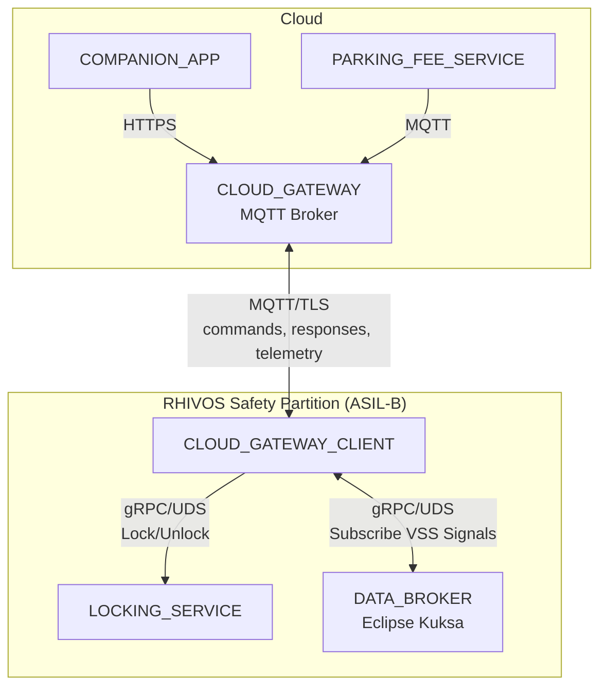
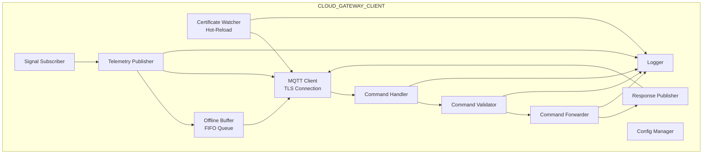
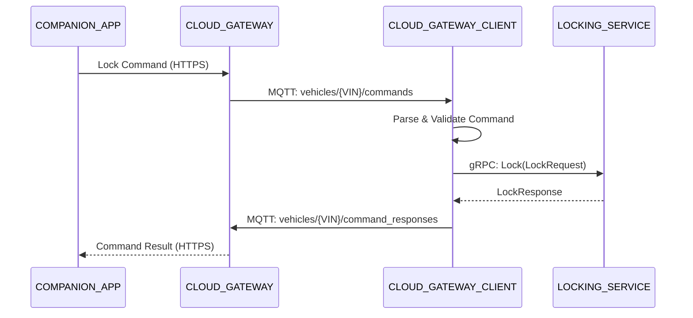
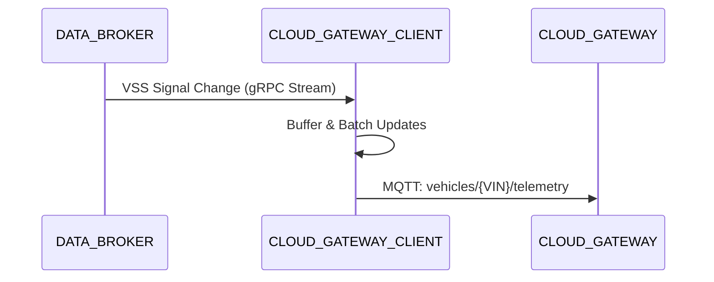
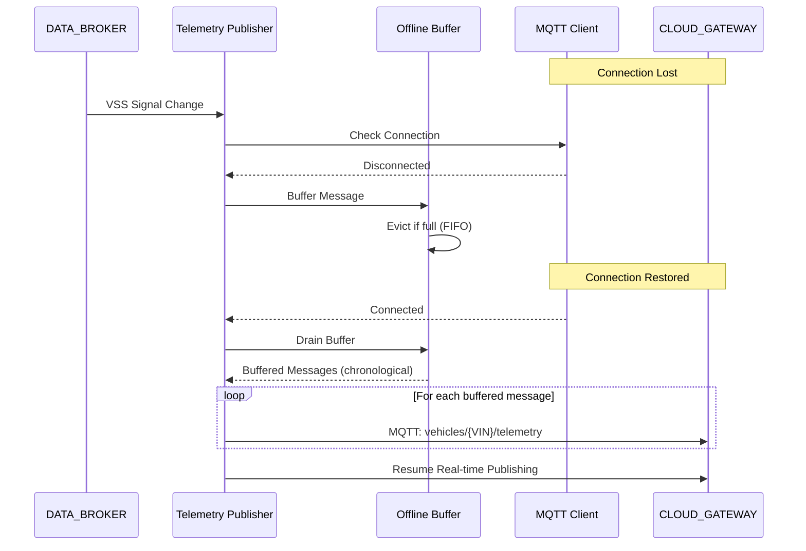
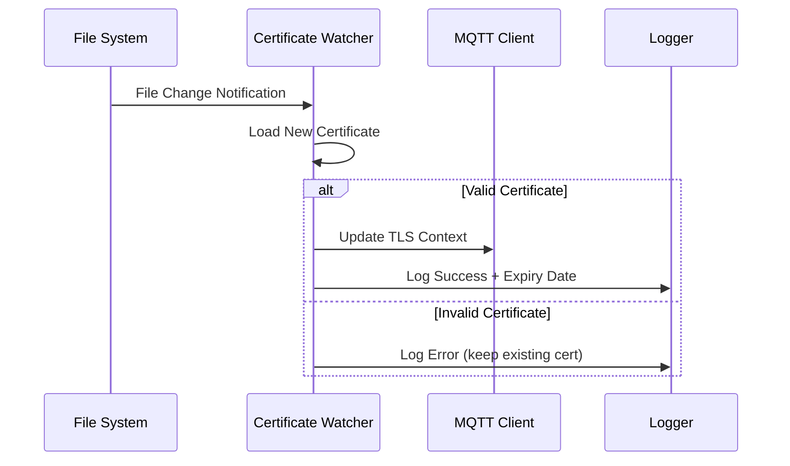

# Design Document: CLOUD_GATEWAY_CLIENT

## Overview

The CLOUD_GATEWAY_CLIENT is an ASIL-B Rust service running in the RHIVOS safety partition. It serves as the bridge between cloud-based commands (from COMPANION_APP via CLOUD_GATEWAY) and local vehicle services (LOCKING_SERVICE, DATA_BROKER).

The service maintains a persistent MQTT connection over TLS to the CLOUD_GATEWAY, receives and validates lock/unlock commands, forwards them to the LOCKING_SERVICE via gRPC over UDS, and publishes command responses back to the cloud. Additionally, it subscribes to vehicle state changes from the DATA_BROKER and publishes telemetry data to the cloud.

## Architecture

### Component Context



### Internal Architecture



### Message Flow - Command Processing



### Message Flow - Telemetry Publishing



### Message Flow - Offline Telemetry Buffering



### Message Flow - Certificate Hot-Reload



## Components and Interfaces

### MQTT Topics

| Topic | Direction | Purpose |
|-------|-----------|---------|
| `vehicles/{VIN}/commands` | Subscribe | Receive lock/unlock commands |
| `vehicles/{VIN}/command_responses` | Publish | Send command execution results |
| `vehicles/{VIN}/telemetry` | Publish | Send vehicle state updates |

### Command Message Format (JSON)

```json
{
  "command_id": "uuid-string",
  "type": "lock | unlock",
  "doors": ["driver", "passenger", "rear_left", "rear_right", "all"],
  "auth_token": "token-string"
}
```

### Response Message Format (JSON)

```json
{
  "command_id": "uuid-string",
  "status": "success | failed",
  "error_code": "optional-error-code",
  "error_message": "optional-error-description"
}
```

### Telemetry Message Format (JSON)

```json
{
  "timestamp": "ISO8601-datetime",
  "location": {
    "latitude": 0.0,
    "longitude": 0.0
  },
  "door_locked": true,
  "door_open": false,
  "parking_session_active": false
}
```

### Internal Components

#### MqttClient

Manages the MQTT connection with TLS, automatic reconnection, and certificate hot-reload.

```rust
pub struct MqttClient {
    client: rumqttc::AsyncClient,
    event_loop: rumqttc::EventLoop,
    config: MqttConfig,
    connection_state: Arc<RwLock<ConnectionState>>,
    cert_watcher: CertificateWatcher,
}

impl MqttClient {
    pub async fn new(config: MqttConfig) -> Result<Self, MqttError>;
    pub async fn connect(&mut self) -> Result<(), MqttError>;
    pub async fn subscribe(&self, topic: &str) -> Result<(), MqttError>;
    pub async fn publish(&self, topic: &str, payload: &[u8]) -> Result<(), MqttError>;
    pub async fn disconnect(&self) -> Result<(), MqttError>;
    pub fn is_connected(&self) -> bool;
}

#[derive(Debug, Clone, PartialEq)]
pub enum ConnectionState {
    Disconnected,
    Connecting,
    Connected,
    Reconnecting { attempt: u32 },
}
```

#### CertificateWatcher

Monitors TLS certificate files for changes and triggers hot-reload without service restart.

```rust
pub struct CertificateWatcher {
    watcher: notify::RecommendedWatcher,
    cert_paths: CertificatePaths,
    current_certs: Arc<RwLock<LoadedCertificates>>,
    logger: Logger,
}

#[derive(Debug, Clone)]
pub struct CertificatePaths {
    pub ca_cert_path: PathBuf,
    pub client_cert_path: PathBuf,
    pub client_key_path: PathBuf,
}

#[derive(Debug, Clone)]
pub struct LoadedCertificates {
    pub ca_cert: Vec<u8>,
    pub client_cert: Vec<u8>,
    pub client_key: Vec<u8>,
    pub expiry_date: Option<DateTime<Utc>>,
    pub loaded_at: DateTime<Utc>,
}

#[derive(Debug, Clone, Serialize)]
pub struct CertReloadEvent {
    pub timestamp: DateTime<Utc>,
    pub status: CertReloadStatus,
    pub cert_path: String,
    pub expiry_date: Option<DateTime<Utc>>,
    pub error_message: Option<String>,
}

#[derive(Debug, Clone, Copy, PartialEq, Eq, Serialize)]
pub enum CertReloadStatus {
    Success,
    Failed,
}

impl CertificateWatcher {
    pub fn new(paths: CertificatePaths, logger: Logger) -> Result<Self, CertWatcherError>;
    
    /// Starts watching certificate files for changes
    pub async fn start(&mut self) -> Result<(), CertWatcherError>;
    
    /// Handles file system notification and attempts certificate reload
    async fn handle_cert_change(&mut self, path: &Path) -> CertReloadEvent;
    
    /// Attempts to load and validate a certificate file
    fn load_certificate(&self, path: &Path) -> Result<Vec<u8>, CertLoadError>;
    
    /// Extracts expiry date from X.509 certificate
    fn extract_expiry_date(&self, cert_data: &[u8]) -> Option<DateTime<Utc>>;
    
    /// Returns current loaded certificates (for TLS context rebuild)
    pub fn get_current_certs(&self) -> LoadedCertificates;
}
```

#### CommandHandler

Receives and orchestrates command processing.

```rust
pub struct CommandHandler {
    validator: CommandValidator,
    forwarder: CommandForwarder,
    response_publisher: ResponsePublisher,
    logger: Logger,
}

impl CommandHandler {
    pub async fn handle_message(&self, topic: &str, payload: &[u8]) -> Result<(), HandleError>;
}
```

#### CommandValidator

Validates command structure and authentication.

```rust
pub struct CommandValidator {
    valid_tokens: Vec<String>,
}

impl CommandValidator {
    /// Validates command structure and auth token
    /// Returns parsed Command on success
    pub fn validate(&self, payload: &[u8]) -> Result<Command, ValidationError>;
    
    /// Validates auth token against configured valid tokens
    fn validate_auth_token(&self, token: &str) -> Result<(), ValidationError>;
    
    /// Validates command type is "lock" or "unlock"
    fn validate_command_type(&self, cmd_type: &str) -> Result<CommandType, ValidationError>;
    
    /// Validates door identifiers
    fn validate_doors(&self, doors: &[String]) -> Result<Vec<Door>, ValidationError>;
}
```

#### CommandForwarder

Forwards validated commands to LOCKING_SERVICE via gRPC.

```rust
pub struct CommandForwarder {
    locking_client: LockingServiceClient,
    timeout: Duration,
}

impl CommandForwarder {
    pub async fn forward_lock(&self, command: &Command) -> Result<CommandResult, ForwardError>;
    pub async fn forward_unlock(&self, command: &Command) -> Result<CommandResult, ForwardError>;
}
```

#### ResponsePublisher

Publishes command responses to MQTT.

```rust
pub struct ResponsePublisher {
    mqtt_client: Arc<MqttClient>,
    vin: String,
}

impl ResponsePublisher {
    pub async fn publish_success(&self, command_id: &str) -> Result<(), PublishError>;
    pub async fn publish_failure(
        &self, 
        command_id: &str, 
        error_code: &str, 
        error_message: &str
    ) -> Result<(), PublishError>;
}
```

#### SignalSubscriber

Subscribes to VSS signals from DATA_BROKER.

```rust
pub struct SignalSubscriber {
    data_broker_client: DataBrokerClient,
    signal_tx: mpsc::Sender<SignalUpdate>,
}

impl SignalSubscriber {
    pub async fn subscribe_all(&self) -> Result<(), SubscribeError>;
    pub async fn run(&mut self) -> Result<(), SubscribeError>;
}

pub struct SignalUpdate {
    pub signal_path: String,
    pub value: SignalValue,
    pub timestamp: SystemTime,
}
```

#### TelemetryPublisher

Batches and publishes telemetry to MQTT with offline buffering support.

```rust
pub struct TelemetryPublisher {
    mqtt_client: Arc<MqttClient>,
    vin: String,
    signal_rx: mpsc::Receiver<SignalUpdate>,
    current_state: TelemetryState,
    publish_interval: Duration,
    offline_buffer: OfflineTelemetryBuffer,
}

impl TelemetryPublisher {
    /// Runs the telemetry publishing loop
    /// Batches updates and publishes at most once per publish_interval
    /// Buffers messages when MQTT is offline
    pub async fn run(&mut self) -> Result<(), TelemetryError>;
    
    /// Attempts to publish telemetry, buffering if offline
    async fn publish_or_buffer(&mut self, telemetry: Telemetry) -> Result<(), TelemetryError>;
    
    /// Drains offline buffer when connection is restored
    async fn drain_offline_buffer(&mut self) -> Result<(), TelemetryError>;
}

#[derive(Debug, Clone, Default)]
pub struct TelemetryState {
    pub latitude: Option<f64>,
    pub longitude: Option<f64>,
    pub door_locked: Option<bool>,
    pub door_open: Option<bool>,
    pub parking_session_active: Option<bool>,
    pub last_updated: Option<SystemTime>,
}
```

#### OfflineTelemetryBuffer

Manages buffering of telemetry messages during MQTT connection outages.

```rust
pub struct OfflineTelemetryBuffer {
    buffer: VecDeque<BufferedTelemetry>,
    max_messages: usize,
    max_age: Duration,
}

#[derive(Debug, Clone)]
pub struct BufferedTelemetry {
    pub telemetry: Telemetry,
    pub buffered_at: Instant,
}

impl OfflineTelemetryBuffer {
    /// Creates a new buffer with specified limits
    /// Default: max 100 messages, max 60 seconds age
    pub fn new(max_messages: usize, max_age: Duration) -> Self;
    
    /// Adds a telemetry message to the buffer
    /// Evicts oldest messages if buffer is full (FIFO)
    /// Also evicts messages older than max_age
    pub fn push(&mut self, telemetry: Telemetry);
    
    /// Returns all buffered messages in chronological order and clears buffer
    pub fn drain(&mut self) -> Vec<Telemetry>;
    
    /// Returns current buffer size
    pub fn len(&self) -> usize;
    
    /// Returns true if buffer is empty
    pub fn is_empty(&self) -> bool;
    
    /// Evicts messages that exceed max_age
    fn evict_expired(&mut self);
}

impl Default for OfflineTelemetryBuffer {
    fn default() -> Self {
        Self {
            buffer: VecDeque::new(),
            max_messages: 100,
            max_age: Duration::from_secs(60),
        }
    }
```

## Data Models

### Command

```rust
#[derive(Debug, Clone, Serialize, Deserialize)]
pub struct Command {
    pub command_id: String,
    #[serde(rename = "type")]
    pub command_type: CommandType,
    pub doors: Vec<Door>,
    pub auth_token: String,
}

#[derive(Debug, Clone, Copy, PartialEq, Eq, Serialize, Deserialize)]
#[serde(rename_all = "lowercase")]
pub enum CommandType {
    Lock,
    Unlock,
}

#[derive(Debug, Clone, Copy, PartialEq, Eq, Serialize, Deserialize)]
#[serde(rename_all = "snake_case")]
pub enum Door {
    Driver,
    Passenger,
    RearLeft,
    RearRight,
    All,
}
```

### Command Response

```rust
#[derive(Debug, Clone, Serialize, Deserialize)]
pub struct CommandResponse {
    pub command_id: String,
    pub status: ResponseStatus,
    #[serde(skip_serializing_if = "Option::is_none")]
    pub error_code: Option<String>,
    #[serde(skip_serializing_if = "Option::is_none")]
    pub error_message: Option<String>,
}

#[derive(Debug, Clone, Copy, PartialEq, Eq, Serialize, Deserialize)]
#[serde(rename_all = "lowercase")]
pub enum ResponseStatus {
    Success,
    Failed,
}
```

### Telemetry

```rust
#[derive(Debug, Clone, Serialize, Deserialize)]
pub struct Telemetry {
    pub timestamp: String,  // ISO8601 format
    pub location: Location,
    pub door_locked: bool,
    pub door_open: bool,
    pub parking_session_active: bool,
}

#[derive(Debug, Clone, Serialize, Deserialize)]
pub struct Location {
    pub latitude: f64,
    pub longitude: f64,
}
```

### Configuration

```rust
#[derive(Debug, Clone)]
pub struct ServiceConfig {
    /// Vehicle Identification Number
    pub vin: String,
    /// MQTT broker configuration
    pub mqtt: MqttConfig,
    /// LOCKING_SERVICE UDS socket path
    pub locking_service_socket: String,
    /// DATA_BROKER UDS socket path
    pub data_broker_socket: String,
    /// Valid auth tokens (demo-grade)
    pub valid_tokens: Vec<String>,
    /// Command processing timeout
    pub command_timeout_ms: u64,
    /// Telemetry publish interval
    pub telemetry_interval_ms: u64,
    /// Graceful shutdown timeout
    pub shutdown_timeout_ms: u64,
}

#[derive(Debug, Clone)]
pub struct MqttConfig {
    /// MQTT broker URL (mqtts://host:port)
    pub broker_url: String,
    /// Client ID for MQTT connection
    pub client_id: String,
    /// Path to TLS CA certificate
    pub ca_cert_path: String,
    /// Path to client certificate
    pub client_cert_path: String,
    /// Path to client private key
    pub client_key_path: String,
    /// Keepalive interval in seconds
    pub keepalive_secs: u64,
    /// Initial reconnect delay in milliseconds
    pub reconnect_initial_delay_ms: u64,
    /// Maximum reconnect delay in milliseconds
    pub reconnect_max_delay_ms: u64,
}

impl Default for ServiceConfig {
    fn default() -> Self {
        Self {
            vin: "DEMO_VIN_001".to_string(),
            mqtt: MqttConfig::default(),
            locking_service_socket: "/run/rhivos/locking.sock".to_string(),
            data_broker_socket: "/run/kuksa/databroker.sock".to_string(),
            valid_tokens: vec!["demo-token".to_string()],
            command_timeout_ms: 5000,
            telemetry_interval_ms: 1000,
            shutdown_timeout_ms: 10000,
        }
    }
}

impl Default for MqttConfig {
    fn default() -> Self {
        Self {
            broker_url: "mqtts://localhost:8883".to_string(),
            client_id: "cloud-gateway-client".to_string(),
            ca_cert_path: "/etc/rhivos/certs/ca.crt".to_string(),
            client_cert_path: "/etc/rhivos/certs/client.crt".to_string(),
            client_key_path: "/etc/rhivos/certs/client.key".to_string(),
            keepalive_secs: 30,
            reconnect_initial_delay_ms: 1000,
            reconnect_max_delay_ms: 60000,
        }
    }
}
```

### Error Types

```rust
#[derive(Debug, thiserror::Error)]
pub enum CloudGatewayError {
    #[error("MQTT error: {0}")]
    MqttError(#[from] MqttError),
    
    #[error("Validation error: {0}")]
    ValidationError(#[from] ValidationError),
    
    #[error("Forward error: {0}")]
    ForwardError(#[from] ForwardError),
    
    #[error("Telemetry error: {0}")]
    TelemetryError(#[from] TelemetryError),
    
    #[error("Configuration error: {0}")]
    ConfigError(String),
}

#[derive(Debug, thiserror::Error)]
pub enum ValidationError {
    #[error("Malformed JSON: {0}")]
    MalformedJson(String),
    
    #[error("Missing required field: {0}")]
    MissingField(String),
    
    #[error("Authentication failed")]
    AuthFailed,
    
    #[error("Invalid command type: {0}")]
    InvalidCommandType(String),
    
    #[error("Invalid door: {0}")]
    InvalidDoor(String),
}

#[derive(Debug, thiserror::Error)]
pub enum ForwardError {
    #[error("LOCKING_SERVICE unavailable: {0}")]
    ServiceUnavailable(String),
    
    #[error("Command execution failed: {0}")]
    ExecutionFailed(String),
    
    #[error("Command timeout")]
    Timeout,
}

#[derive(Debug, thiserror::Error)]
pub enum MqttError {
    #[error("Connection failed: {0}")]
    ConnectionFailed(String),
    
    #[error("TLS error: {0}")]
    TlsError(String),
    
    #[error("Subscribe failed: {0}")]
    SubscribeFailed(String),
    
    #[error("Publish failed: {0}")]
    PublishFailed(String),
}

#[derive(Debug, thiserror::Error)]
pub enum CertWatcherError {
    #[error("Failed to initialize file watcher: {0}")]
    WatcherInitFailed(String),
    
    #[error("Failed to watch path: {0}")]
    WatchPathFailed(String),
}

#[derive(Debug, thiserror::Error)]
pub enum CertLoadError {
    #[error("Certificate file not found: {0}")]
    FileNotFound(String),
    
    #[error("Permission denied: {0}")]
    PermissionDenied(String),
    
    #[error("Invalid certificate format: {0}")]
    InvalidFormat(String),
    
    #[error("Certificate parsing failed: {0}")]
    ParseFailed(String),
}
```

### VSS Signal Paths

| Signal | Path | Type | Purpose |
|--------|------|------|---------|
| Latitude | `Vehicle.CurrentLocation.Latitude` | f64 | Vehicle location |
| Longitude | `Vehicle.CurrentLocation.Longitude` | f64 | Vehicle location |
| Door Lock State | `Vehicle.Cabin.Door.Row1.DriverSide.IsLocked` | bool | Door security status |
| Door Open State | `Vehicle.Cabin.Door.Row1.DriverSide.IsOpen` | bool | Door physical state |
| Parking Session | `Vehicle.Parking.SessionActive` | bool | Parking session status |

### Log Entry Structure

```rust
#[derive(Debug, Serialize)]
pub struct LogEntry {
    pub timestamp: DateTime<Utc>,
    pub level: LogLevel,
    pub command_id: Option<String>,
    pub correlation_id: String,
    pub event_type: EventType,
    pub details: serde_json::Value,
}

#[derive(Debug, Serialize)]
pub enum EventType {
    MqttConnected,
    MqttDisconnected,
    MqttReconnecting,
    CommandReceived,
    CommandValidated,
    CommandForwarded,
    CommandCompleted,
    ResponsePublished,
    TelemetryPublished,
    TelemetryBuffered,
    TelemetryBufferDrained,
    DataBrokerConnected,
    DataBrokerDisconnected,
    SignalReceived,
    CertReloadSuccess,
    CertReloadFailed,
    ShutdownInitiated,
    ShutdownCompleted,
}
```


## Correctness Properties

*A property is a characteristic or behavior that should hold true across all valid executions of a system—essentially, a formal statement about what the system should do. Properties serve as the bridge between human-readable specifications and machine-verifiable correctness guarantees.*

Based on the prework analysis, the following properties can be verified through property-based testing:

### Property 1: Exponential Backoff Calculation

*For any* reconnection attempt number N, the calculated delay SHALL be `min(initial_delay * 2^N, max_delay)` where initial_delay is 1 second and max_delay is 60 seconds.

**Validates: Requirements 1.3**

### Property 2: Command JSON Round-Trip

*For any* valid Command struct, serializing to JSON and then deserializing SHALL produce an equivalent Command with matching command_id, command_type, doors, and auth_token fields.

**Validates: Requirements 2.2**

### Property 3: Malformed JSON Rejection

*For any* byte sequence that is not valid JSON, the CommandValidator SHALL return a MalformedJson error and the command SHALL NOT be forwarded to LOCKING_SERVICE.

**Validates: Requirements 2.3**

### Property 4: Missing Required Fields Rejection

*For any* valid JSON object that is missing one or more of command_id, type, or auth_token fields, the CommandValidator SHALL return a MissingField error identifying the missing field.

**Validates: Requirements 2.4**

### Property 5: Invalid Auth Token Rejection

*For any* command with an auth_token that is not in the configured valid_tokens list, the CommandValidator SHALL return an AuthFailed error and the command SHALL NOT be forwarded to LOCKING_SERVICE.

**Validates: Requirements 3.2**

### Property 6: Invalid Command Type Rejection

*For any* command with a type field that is not "lock" or "unlock", the CommandValidator SHALL return an InvalidCommandType error.

**Validates: Requirements 3.3**

### Property 7: Invalid Door Rejection

*For any* command with a doors array containing a value not in ["driver", "passenger", "rear_left", "rear_right", "all"], the CommandValidator SHALL return an InvalidDoor error.

**Validates: Requirements 3.4**

### Property 8: Command Forwarding by Type

*For any* valid lock command, the CommandForwarder SHALL call LOCKING_SERVICE.Lock(). *For any* valid unlock command, the CommandForwarder SHALL call LOCKING_SERVICE.Unlock(). The command type SHALL determine which RPC is invoked.

**Validates: Requirements 4.1, 4.2**

### Property 9: Response Status Matches LOCKING_SERVICE Result

*For any* command forwarded to LOCKING_SERVICE, if LOCKING_SERVICE returns success then the published response status SHALL be "success", and if LOCKING_SERVICE returns an error then the published response status SHALL be "failed".

**Validates: Requirements 4.3, 4.4**

### Property 10: Response Command ID Correlation

*For any* command processed by the CLOUD_GATEWAY_CLIENT, the published response SHALL contain the same command_id as the original command.

**Validates: Requirements 5.2**

### Property 11: Response Structure Completeness

*For any* command response, the status field SHALL be either "success" or "failed". *For any* response with status "failed", the error_code and error_message fields SHALL be present and non-empty.

**Validates: Requirements 5.3, 5.4**

### Property 12: Command Timeout Enforcement

*For any* command, if processing (validation + forwarding + response) exceeds 5 seconds, the command SHALL be aborted and a timeout failure response SHALL be published.

**Validates: Requirements 5.5**

### Property 13: Telemetry Contains All Required Fields

*For any* published telemetry message, the JSON payload SHALL contain timestamp (ISO8601 format), location.latitude, location.longitude, door_locked, door_open, and parking_session_active fields.

**Validates: Requirements 7.2**

### Property 14: Telemetry Rate Limiting

*For any* sequence of N signal updates occurring within T seconds, the number of published telemetry messages SHALL be at most ceil(T / publish_interval) where publish_interval is 1 second.

**Validates: Requirements 7.3**

### Property 15: Configuration Validation

*For any* configuration with missing or invalid required fields (empty VIN, invalid broker URL, non-existent certificate paths), the configuration validation SHALL fail with a descriptive error message.

**Validates: Requirements 8.3**

### Property 16: Shutdown Timeout Enforcement

*For any* shutdown initiated by SIGTERM, the service SHALL complete shutdown within 10 seconds. If in-flight operations do not complete within this window, they SHALL be forcibly terminated.

**Validates: Requirements 9.4**

### Property 17: Certificate Hot-Reload on File Change

*For any* valid certificate file update on disk, the CertificateWatcher SHALL detect the change and reload the certificate without requiring a service restart. The new certificate SHALL be used for subsequent TLS connections.

**Validates: Requirements 1.6**

### Property 18: Certificate Reload Failure Resilience

*For any* invalid certificate file (malformed, wrong format, permission denied), the CertificateWatcher SHALL continue using the existing valid certificate and SHALL NOT disrupt the current MQTT connection.

**Validates: Requirements 1.7**

### Property 19: Certificate Reload Event Logging

*For any* certificate reload attempt (success or failure), the log entry SHALL contain: timestamp, reload status (success/failed), certificate path, and for successful reloads the certificate expiry date.

**Validates: Requirements 1.8**

### Property 20: Offline Telemetry Buffer Limits

*For any* sequence of telemetry messages generated while MQTT is offline, the OfflineTelemetryBuffer SHALL contain at most 100 messages AND no message older than 60 seconds, whichever limit is reached first.

**Validates: Requirements 7.6**

### Property 21: Offline Buffer FIFO Eviction

*For any* sequence of telemetry messages that exceeds the buffer capacity, the OfflineTelemetryBuffer SHALL evict the oldest messages first (FIFO order) to make room for new messages.

**Validates: Requirements 7.7**

### Property 22: Buffered Message Chronological Publishing

*For any* set of buffered telemetry messages, when the MQTT connection is restored, the messages SHALL be published in chronological order (oldest first) before resuming real-time publishing.

**Validates: Requirements 7.8**

## Error Handling

### Error Code Mapping

| Error Scenario | Error Code | HTTP-like Status |
|----------------|------------|------------------|
| Malformed JSON payload | MALFORMED_JSON | 400 Bad Request |
| Missing required field | MISSING_FIELD | 400 Bad Request |
| Invalid auth token | AUTH_FAILED | 401 Unauthorized |
| Invalid command type | INVALID_COMMAND_TYPE | 400 Bad Request |
| Invalid door identifier | INVALID_DOOR | 400 Bad Request |
| LOCKING_SERVICE unavailable | SERVICE_UNAVAILABLE | 503 Service Unavailable |
| LOCKING_SERVICE error | EXECUTION_FAILED | 500 Internal Error |
| Command timeout | TIMEOUT | 504 Gateway Timeout |

### Error Response Generation

```rust
impl From<ValidationError> for CommandResponse {
    fn from(err: ValidationError) -> Self {
        let (error_code, error_message) = match err {
            ValidationError::MalformedJson(msg) => ("MALFORMED_JSON", msg),
            ValidationError::MissingField(field) => ("MISSING_FIELD", format!("Missing required field: {}", field)),
            ValidationError::AuthFailed => ("AUTH_FAILED", "Authentication failed".to_string()),
            ValidationError::InvalidCommandType(t) => ("INVALID_COMMAND_TYPE", format!("Invalid command type: {}", t)),
            ValidationError::InvalidDoor(d) => ("INVALID_DOOR", format!("Invalid door: {}", d)),
        };
        
        CommandResponse {
            command_id: String::new(), // Will be set by caller if available
            status: ResponseStatus::Failed,
            error_code: Some(error_code.to_string()),
            error_message: Some(error_message),
        }
    }
}

impl From<ForwardError> for CommandResponse {
    fn from(err: ForwardError) -> Self {
        let (error_code, error_message) = match err {
            ForwardError::ServiceUnavailable(msg) => ("SERVICE_UNAVAILABLE", msg),
            ForwardError::ExecutionFailed(msg) => ("EXECUTION_FAILED", msg),
            ForwardError::Timeout => ("TIMEOUT", "Command execution timed out".to_string()),
        };
        
        CommandResponse {
            command_id: String::new(),
            status: ResponseStatus::Failed,
            error_code: Some(error_code.to_string()),
            error_message: Some(error_message),
        }
    }
}
```

### MQTT Reconnection Strategy

```rust
async fn reconnect_with_backoff(&mut self) -> Result<(), MqttError> {
    let mut delay = Duration::from_millis(self.config.reconnect_initial_delay_ms);
    let max_delay = Duration::from_millis(self.config.reconnect_max_delay_ms);
    let mut attempt = 0u32;
    
    loop {
        self.set_state(ConnectionState::Reconnecting { attempt });
        log::info!("Reconnection attempt {} after {:?}", attempt + 1, delay);
        
        match self.try_connect().await {
            Ok(_) => {
                self.set_state(ConnectionState::Connected);
                self.resubscribe_all().await?;
                return Ok(());
            }
            Err(e) => {
                log::warn!("Reconnection attempt {} failed: {}", attempt + 1, e);
                tokio::time::sleep(delay).await;
                delay = std::cmp::min(delay * 2, max_delay);
                attempt += 1;
            }
        }
    }
}
```

### Certificate Hot-Reload Handler

```rust
impl CertificateWatcher {
    async fn handle_cert_change(&mut self, path: &Path) -> CertReloadEvent {
        let timestamp = Utc::now();
        
        match self.load_certificate(path) {
            Ok(cert_data) => {
                let expiry_date = self.extract_expiry_date(&cert_data);
                
                // Update the current certificates
                let mut certs = self.current_certs.write().await;
                if path == self.cert_paths.ca_cert_path {
                    certs.ca_cert = cert_data;
                } else if path == self.cert_paths.client_cert_path {
                    certs.client_cert = cert_data;
                } else if path == self.cert_paths.client_key_path {
                    certs.client_key = cert_data;
                }
                certs.expiry_date = expiry_date;
                certs.loaded_at = timestamp;
                
                let event = CertReloadEvent {
                    timestamp,
                    status: CertReloadStatus::Success,
                    cert_path: path.to_string_lossy().to_string(),
                    expiry_date,
                    error_message: None,
                };
                
                self.logger.log_cert_reload(&event);
                event
            }
            Err(e) => {
                // Keep existing certificate, log error
                let event = CertReloadEvent {
                    timestamp,
                    status: CertReloadStatus::Failed,
                    cert_path: path.to_string_lossy().to_string(),
                    expiry_date: None,
                    error_message: Some(e.to_string()),
                };
                
                self.logger.log_cert_reload(&event);
                event
            }
        }
    }
}
```

### Offline Telemetry Buffer Management

```rust
impl OfflineTelemetryBuffer {
    pub fn push(&mut self, telemetry: Telemetry) {
        // First, evict expired messages
        self.evict_expired();
        
        // If buffer is full, evict oldest (FIFO)
        while self.buffer.len() >= self.max_messages {
            self.buffer.pop_front();
        }
        
        // Add new message
        self.buffer.push_back(BufferedTelemetry {
            telemetry,
            buffered_at: Instant::now(),
        });
    }
    
    pub fn drain(&mut self) -> Vec<Telemetry> {
        // Evict expired before draining
        self.evict_expired();
        
        // Return messages in chronological order (oldest first)
        self.buffer
            .drain(..)
            .map(|bt| bt.telemetry)
            .collect()
    }
    
    fn evict_expired(&mut self) {
        let now = Instant::now();
        self.buffer.retain(|bt| now.duration_since(bt.buffered_at) < self.max_age);
    }
}

impl TelemetryPublisher {
    async fn publish_or_buffer(&mut self, telemetry: Telemetry) -> Result<(), TelemetryError> {
        if self.mqtt_client.is_connected() {
            // Drain any buffered messages first (chronological order)
            if !self.offline_buffer.is_empty() {
                self.drain_offline_buffer().await?;
            }
            
            // Publish current telemetry
            let payload = serde_json::to_vec(&telemetry)?;
            let topic = format!("vehicles/{}/telemetry", self.vin);
            self.mqtt_client.publish(&topic, &payload).await?;
        } else {
            // Buffer for later
            self.offline_buffer.push(telemetry);
        }
        Ok(())
    }
    
    async fn drain_offline_buffer(&mut self) -> Result<(), TelemetryError> {
        let buffered = self.offline_buffer.drain();
        let topic = format!("vehicles/{}/telemetry", self.vin);
        
        for telemetry in buffered {
            let payload = serde_json::to_vec(&telemetry)?;
            self.mqtt_client.publish(&topic, &payload).await?;
        }
        Ok(())
    }
}
```
```

### Graceful Shutdown Handler

```rust
async fn shutdown_handler(
    shutdown_rx: oneshot::Receiver<()>,
    in_flight: Arc<AtomicUsize>,
    mqtt_client: Arc<MqttClient>,
    timeout: Duration,
) {
    let _ = shutdown_rx.await;
    log::info!("Shutdown initiated, waiting for in-flight operations");
    
    let deadline = Instant::now() + timeout;
    
    // Wait for in-flight operations or timeout
    while in_flight.load(Ordering::SeqCst) > 0 && Instant::now() < deadline {
        tokio::time::sleep(Duration::from_millis(100)).await;
    }
    
    if in_flight.load(Ordering::SeqCst) > 0 {
        log::warn!("Forcing shutdown with {} in-flight operations", in_flight.load(Ordering::SeqCst));
    }
    
    // Clean MQTT disconnect
    if let Err(e) = mqtt_client.disconnect().await {
        log::error!("Error during MQTT disconnect: {}", e);
    }
    
    log::info!("Shutdown completed");
}
```

## Testing Strategy

### Dual Testing Approach

The CLOUD_GATEWAY_CLIENT uses both unit tests and property-based tests:

- **Unit tests**: Verify specific examples, edge cases, error conditions, and integration points
- **Property tests**: Verify universal properties across all inputs

### Property-Based Testing

Property-based tests use the `proptest` crate for Rust. Each property test:
- Runs minimum 100 iterations
- References the design document property
- Uses tag format: **Feature: cloud-gateway-client, Property {number}: {property_text}**

### Test Organization

```
rhivos/cloud-gateway-client/
├── src/
│   ├── lib.rs
│   ├── main.rs
│   ├── mqtt.rs
│   ├── command.rs
│   ├── validator.rs
│   ├── forwarder.rs
│   ├── response.rs
│   ├── telemetry.rs
│   ├── offline_buffer.rs
│   ├── cert_watcher.rs
│   ├── config.rs
│   └── error.rs
└── tests/
    ├── unit/
    │   ├── mqtt_test.rs
    │   ├── validator_test.rs
    │   ├── forwarder_test.rs
    │   ├── telemetry_test.rs
    │   ├── offline_buffer_test.rs
    │   └── cert_watcher_test.rs
    └── property/
        ├── backoff_properties.rs      # Property 1
        ├── parsing_properties.rs      # Properties 2, 3, 4
        ├── validation_properties.rs   # Properties 5, 6, 7
        ├── forwarding_properties.rs   # Properties 8, 9
        ├── response_properties.rs     # Properties 10, 11, 12
        ├── telemetry_properties.rs    # Properties 13, 14
        ├── config_properties.rs       # Properties 15, 16
        ├── cert_reload_properties.rs  # Properties 17, 18, 19
        └── offline_buffer_properties.rs # Properties 20, 21, 22
```

### Property Test Examples

```rust
// Property 1: Exponential Backoff Calculation
proptest! {
    #![proptest_config(ProptestConfig::with_cases(100))]
    
    /// Feature: cloud-gateway-client, Property 1: Exponential Backoff Calculation
    #[test]
    fn exponential_backoff_calculation(attempt in 0u32..20) {
        let initial_delay = Duration::from_secs(1);
        let max_delay = Duration::from_secs(60);
        
        let calculated = calculate_backoff_delay(attempt, initial_delay, max_delay);
        let expected = std::cmp::min(
            initial_delay * 2u32.saturating_pow(attempt),
            max_delay
        );
        
        prop_assert_eq!(calculated, expected);
        prop_assert!(calculated >= initial_delay);
        prop_assert!(calculated <= max_delay);
    }
}

// Property 2: Command JSON Round-Trip
proptest! {
    /// Feature: cloud-gateway-client, Property 2: Command JSON Round-Trip
    #[test]
    fn command_json_roundtrip(
        command_id in "[a-f0-9]{8}-[a-f0-9]{4}-[a-f0-9]{4}-[a-f0-9]{4}-[a-f0-9]{12}",
        command_type in prop_oneof![Just(CommandType::Lock), Just(CommandType::Unlock)],
        doors in prop::collection::vec(prop_door(), 1..5),
        auth_token in "[a-zA-Z0-9]{10,50}",
    ) {
        let original = Command {
            command_id: command_id.clone(),
            command_type,
            doors: doors.clone(),
            auth_token: auth_token.clone(),
        };
        
        let json = serde_json::to_string(&original).unwrap();
        let parsed: Command = serde_json::from_str(&json).unwrap();
        
        prop_assert_eq!(parsed.command_id, original.command_id);
        prop_assert_eq!(parsed.command_type, original.command_type);
        prop_assert_eq!(parsed.doors, original.doors);
        prop_assert_eq!(parsed.auth_token, original.auth_token);
    }
}

// Property 5: Invalid Auth Token Rejection
proptest! {
    /// Feature: cloud-gateway-client, Property 5: Invalid Auth Token Rejection
    #[test]
    fn invalid_auth_token_rejected(
        token in "[a-zA-Z0-9]{1,50}".prop_filter("not valid token", |t| t != "demo-token"),
    ) {
        let validator = CommandValidator::new(vec!["demo-token".to_string()]);
        let command = create_test_command_with_token(&token);
        
        let result = validator.validate_auth_token(&command.auth_token);
        
        prop_assert!(result.is_err());
        prop_assert!(matches!(result.unwrap_err(), ValidationError::AuthFailed));
    }
}

// Property 10: Response Command ID Correlation
proptest! {
    /// Feature: cloud-gateway-client, Property 10: Response Command ID Correlation
    #[test]
    fn response_contains_original_command_id(
        command_id in "[a-f0-9]{8}-[a-f0-9]{4}-[a-f0-9]{4}-[a-f0-9]{4}-[a-f0-9]{12}",
    ) {
        let command = create_test_command_with_id(&command_id);
        let response = process_command_and_get_response(&command);
        
        prop_assert_eq!(response.command_id, command_id);
    }
}

// Property 14: Telemetry Rate Limiting
proptest! {
    /// Feature: cloud-gateway-client, Property 14: Telemetry Rate Limiting
    #[test]
    fn telemetry_rate_limited(
        num_updates in 1usize..100,
        time_window_ms in 100u64..5000,
    ) {
        let publish_interval = Duration::from_secs(1);
        let time_window = Duration::from_millis(time_window_ms);
        
        let published_count = simulate_telemetry_publishing(num_updates, time_window, publish_interval);
        let max_expected = (time_window.as_secs_f64() / publish_interval.as_secs_f64()).ceil() as usize;
        
        prop_assert!(published_count <= max_expected + 1); // +1 for initial publish
    }
}

// Property 17: Certificate Hot-Reload on File Change
proptest! {
    /// Feature: cloud-gateway-client, Property 17: Certificate Hot-Reload on File Change
    #[test]
    fn cert_hot_reload_on_valid_change(
        cert_data in prop::collection::vec(any::<u8>(), 100..1000),
    ) {
        let valid_cert = create_valid_test_certificate(&cert_data);
        let watcher = create_test_cert_watcher();
        
        let event = watcher.handle_cert_change_sync(&valid_cert.path);
        
        prop_assert_eq!(event.status, CertReloadStatus::Success);
        prop_assert!(event.expiry_date.is_some());
        prop_assert!(watcher.get_current_certs().loaded_at > event.timestamp - Duration::from_secs(1));
    }
}

// Property 18: Certificate Reload Failure Resilience
proptest! {
    /// Feature: cloud-gateway-client, Property 18: Certificate Reload Failure Resilience
    #[test]
    fn cert_reload_failure_keeps_existing(
        invalid_data in prop::collection::vec(any::<u8>(), 10..100)
            .prop_filter("not valid cert", |d| !is_valid_certificate(d)),
    ) {
        let watcher = create_test_cert_watcher_with_valid_cert();
        let original_cert = watcher.get_current_certs().clone();
        
        let event = watcher.handle_invalid_cert_change(&invalid_data);
        
        prop_assert_eq!(event.status, CertReloadStatus::Failed);
        prop_assert!(event.error_message.is_some());
        // Verify existing cert is still in use
        prop_assert_eq!(watcher.get_current_certs().ca_cert, original_cert.ca_cert);
    }
}

// Property 20: Offline Telemetry Buffer Limits
proptest! {
    /// Feature: cloud-gateway-client, Property 20: Offline Telemetry Buffer Limits
    #[test]
    fn offline_buffer_respects_limits(
        num_messages in 1usize..500,
    ) {
        let mut buffer = OfflineTelemetryBuffer::new(100, Duration::from_secs(60));
        
        for i in 0..num_messages {
            buffer.push(create_test_telemetry(i));
        }
        
        prop_assert!(buffer.len() <= 100);
    }
}

// Property 21: Offline Buffer FIFO Eviction
proptest! {
    /// Feature: cloud-gateway-client, Property 21: Offline Buffer FIFO Eviction
    #[test]
    fn offline_buffer_fifo_eviction(
        num_messages in 101usize..300,
    ) {
        let mut buffer = OfflineTelemetryBuffer::new(100, Duration::from_secs(60));
        
        for i in 0..num_messages {
            buffer.push(create_test_telemetry_with_id(i));
        }
        
        let drained = buffer.drain();
        
        // Should have exactly 100 messages (the newest ones)
        prop_assert_eq!(drained.len(), 100);
        
        // First message should be (num_messages - 100), last should be (num_messages - 1)
        let expected_first_id = num_messages - 100;
        prop_assert!(drained[0].contains_id(expected_first_id));
        prop_assert!(drained[99].contains_id(num_messages - 1));
    }
}

// Property 22: Buffered Message Chronological Publishing
proptest! {
    /// Feature: cloud-gateway-client, Property 22: Buffered Message Chronological Publishing
    #[test]
    fn buffered_messages_chronological_order(
        num_messages in 1usize..100,
    ) {
        let mut buffer = OfflineTelemetryBuffer::new(100, Duration::from_secs(60));
        
        for i in 0..num_messages {
            buffer.push(create_test_telemetry_with_timestamp(i));
            std::thread::sleep(Duration::from_millis(1)); // Ensure distinct timestamps
        }
        
        let drained = buffer.drain();
        
        // Verify chronological order (oldest first)
        for i in 1..drained.len() {
            prop_assert!(drained[i-1].timestamp <= drained[i].timestamp);
        }
    }
}
```

### Unit Test Coverage

Unit tests focus on:
- Specific JSON parsing edge cases (empty strings, null values, extra fields)
- MQTT connection state machine transitions
- Error message content verification
- Mock LOCKING_SERVICE integration
- Mock DATA_BROKER signal subscription
- Telemetry batching behavior
- Configuration loading from environment
- Certificate file loading and validation edge cases
- Certificate expiry date extraction
- Offline buffer boundary conditions (exactly 100 messages, exactly 60 seconds)
- Buffer eviction timing edge cases

### Integration Testing

Integration tests verify:
- MQTT client connects to test broker and subscribes to topics
- Commands flow from MQTT → validation → forwarding → response
- Telemetry flows from DATA_BROKER subscription → batching → MQTT publish
- Graceful shutdown completes in-flight operations
- Reconnection behavior with simulated disconnects
- Certificate hot-reload with file system changes
- Offline buffer draining on reconnection
- Telemetry ordering after connection restoration
