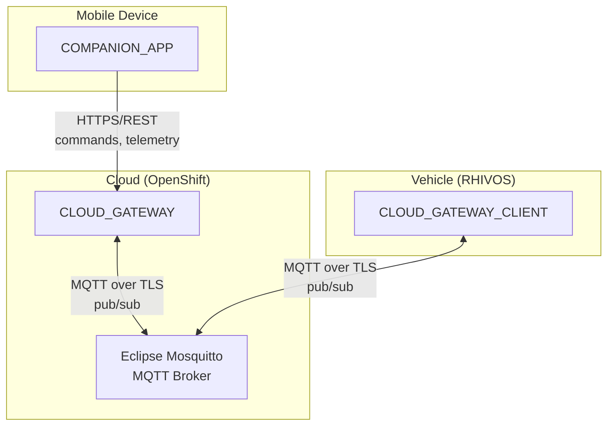
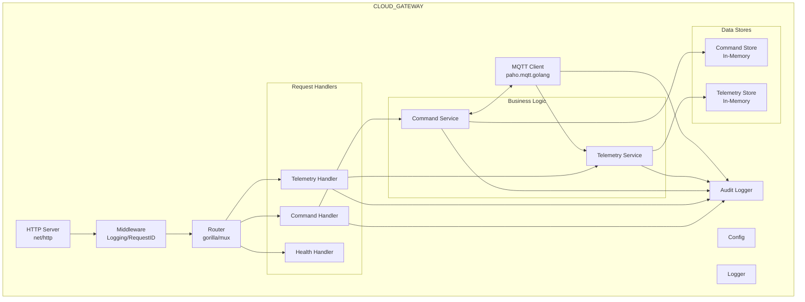
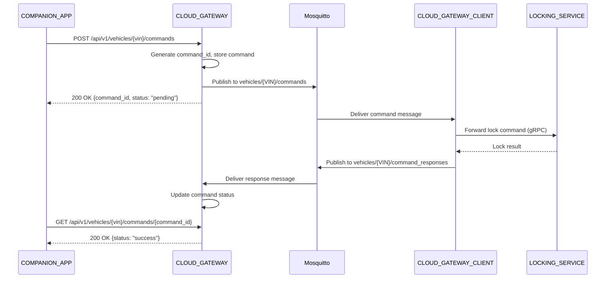
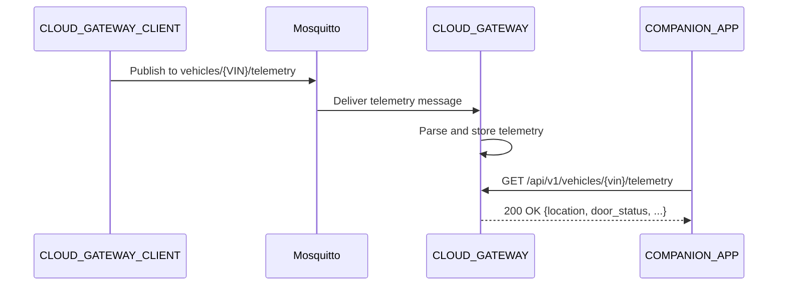

# Design Document: CLOUD_GATEWAY

## Overview

The CLOUD_GATEWAY is a Go backend service deployed on OpenShift that acts as an MQTT broker/router for vehicle-to-cloud communication. It bridges commands from the COMPANION_APP to vehicles and routes telemetry from vehicles to interested clients.

The service connects to an Eclipse Mosquitto MQTT broker to communicate with vehicles (via CLOUD_GATEWAY_CLIENT), and exposes REST APIs for the COMPANION_APP to send lock/unlock commands and query vehicle state. Commands and telemetry are stored in-memory for the demo scope.

## Architecture

### Component Context



### Internal Architecture



### Message Flow: Lock Command



### Message Flow: Telemetry



## Components and Interfaces

### REST API Endpoints

#### Command Submission

```
POST /api/v1/vehicles/{vin}/commands

Request:
{
  "command_type": "lock" | "unlock",
  "doors": ["driver"] | ["all"],
  "auth_token": "demo-token-123"
}

Response 200:
{
  "command_id": "cmd-abc123",
  "status": "pending",
  "request_id": "req-xyz789"
}

Response 400:
{
  "error_code": "INVALID_COMMAND_TYPE",
  "message": "command_type must be 'lock' or 'unlock'",
  "request_id": "req-xyz789"
}

Response 404:
{
  "error_code": "VEHICLE_NOT_FOUND",
  "message": "Vehicle not found: UNKNOWN_VIN",
  "request_id": "req-xyz789"
}
```

#### Command Status Query

```
GET /api/v1/vehicles/{vin}/commands/{command_id}

Response 200 (pending):
{
  "command_id": "cmd-abc123",
  "command_type": "lock",
  "status": "pending",
  "created_at": "2024-01-15T10:30:00Z",
  "request_id": "req-xyz789"
}

Response 200 (success):
{
  "command_id": "cmd-abc123",
  "command_type": "lock",
  "status": "success",
  "created_at": "2024-01-15T10:30:00Z",
  "completed_at": "2024-01-15T10:30:02Z",
  "request_id": "req-xyz789"
}

Response 200 (failed):
{
  "command_id": "cmd-abc123",
  "command_type": "lock",
  "status": "failed",
  "created_at": "2024-01-15T10:30:00Z",
  "completed_at": "2024-01-15T10:30:02Z",
  "error_code": "DOOR_BLOCKED",
  "error_message": "Door is physically blocked",
  "request_id": "req-xyz789"
}

Response 200 (timeout):
{
  "command_id": "cmd-abc123",
  "command_type": "lock",
  "status": "timeout",
  "created_at": "2024-01-15T10:30:00Z",
  "completed_at": "2024-01-15T10:30:30Z",
  "error_code": "TIMEOUT",
  "error_message": "Vehicle did not respond within timeout period",
  "request_id": "req-xyz789"
}

Response 404:
{
  "error_code": "COMMAND_NOT_FOUND",
  "message": "Command not found: cmd-unknown",
  "request_id": "req-xyz789"
}
```

#### Telemetry Query

```
GET /api/v1/vehicles/{vin}/telemetry

Response 200:
{
  "timestamp": "2024-01-15T10:30:00Z",
  "latitude": 37.7749,
  "longitude": -122.4194,
  "door_locked": true,
  "door_open": false,
  "parking_session_active": true,
  "received_at": "2024-01-15T10:30:01Z",
  "request_id": "req-xyz789"
}

Response 404:
{
  "error_code": "TELEMETRY_NOT_FOUND",
  "message": "No telemetry received for vehicle: DEMO_VIN",
  "request_id": "req-xyz789"
}
```

#### Health Endpoints

```
GET /health

Response 200:
{
  "status": "healthy",
  "service": "cloud-gateway",
  "timestamp": "2024-01-15T10:30:00Z"
}

GET /ready

Response 200:
{
  "status": "ready",
  "mqtt_connected": true
}

Response 503:
{
  "status": "not ready",
  "mqtt_connected": false
}
```

### MQTT Topics

#### Commands to Vehicle (Publish)

```
Topic: vehicles/{VIN}/commands

Message:
{
  "command_id": "cmd-abc123",
  "type": "lock" | "unlock",
  "doors": ["driver"] | ["all"],
  "auth_token": "demo-token-123",
  "timestamp": "2024-01-15T10:30:00Z"
}
```

#### Command Responses from Vehicle (Subscribe)

```
Topic: vehicles/{VIN}/command_responses

Message:
{
  "command_id": "cmd-abc123",
  "status": "success" | "failed",
  "error_code": "DOOR_BLOCKED",      // only if failed
  "error_message": "Door is blocked", // only if failed
  "timestamp": "2024-01-15T10:30:02Z"
}
```

#### Telemetry from Vehicle (Subscribe)

```
Topic: vehicles/{VIN}/telemetry

Message:
{
  "timestamp": "2024-01-15T10:30:00Z",
  "latitude": 37.7749,
  "longitude": -122.4194,
  "door_locked": true,
  "door_open": false,
  "parking_session_active": true
}
```

### Internal Components

#### CommandHandler

Handles REST API requests for commands.

```go
type CommandHandler struct {
    commandService *CommandService
    configuredVIN  string
    logger         *slog.Logger
}

func NewCommandHandler(commandService *CommandService, vin string, logger *slog.Logger) *CommandHandler

// HandleSubmitCommand handles POST /api/v1/vehicles/{vin}/commands
func (h *CommandHandler) HandleSubmitCommand(w http.ResponseWriter, r *http.Request)

// HandleGetCommandStatus handles GET /api/v1/vehicles/{vin}/commands/{command_id}
func (h *CommandHandler) HandleGetCommandStatus(w http.ResponseWriter, r *http.Request)
```

#### TelemetryHandler

Handles REST API requests for telemetry.

```go
type TelemetryHandler struct {
    telemetryService *TelemetryService
    configuredVIN    string
    logger           *slog.Logger
}

func NewTelemetryHandler(telemetryService *TelemetryService, vin string, logger *slog.Logger) *TelemetryHandler

// HandleGetTelemetry handles GET /api/v1/vehicles/{vin}/telemetry
func (h *TelemetryHandler) HandleGetTelemetry(w http.ResponseWriter, r *http.Request)
```

#### HealthHandler

Handles health and readiness checks.

```go
type HealthHandler struct {
    mqttClient MQTTClient
    logger     *slog.Logger
}

func NewHealthHandler(mqttClient MQTTClient, logger *slog.Logger) *HealthHandler

// HandleHealth handles GET /health
func (h *HealthHandler) HandleHealth(w http.ResponseWriter, r *http.Request)

// HandleReady handles GET /ready
func (h *HealthHandler) HandleReady(w http.ResponseWriter, r *http.Request)
```

#### CommandService

Business logic for command operations.

```go
type CommandService struct {
    store          *CommandStore
    mqttClient     MQTTClient
    configuredVIN  string
    commandTimeout time.Duration
    logger         *slog.Logger
    mu             sync.RWMutex
}

func NewCommandService(store *CommandStore, mqttClient MQTTClient, vin string, timeout time.Duration, logger *slog.Logger) *CommandService

// SubmitCommand creates a new command and publishes it to MQTT
// Returns the created command with pending status
func (s *CommandService) SubmitCommand(req *SubmitCommandRequest) (*Command, error)

// GetCommandStatus returns the current status of a command
// Returns nil if command not found
func (s *CommandService) GetCommandStatus(commandID string) *Command

// HandleCommandResponse processes a command response from the vehicle
func (s *CommandService) HandleCommandResponse(response *CommandResponse)

// StartTimeoutChecker starts a goroutine to check for timed-out commands
func (s *CommandService) StartTimeoutChecker(ctx context.Context)
```

#### TelemetryService

Business logic for telemetry operations.

```go
type TelemetryService struct {
    store  *TelemetryStore
    logger *slog.Logger
}

func NewTelemetryService(store *TelemetryStore, logger *slog.Logger) *TelemetryService

// GetLatestTelemetry returns the latest telemetry for a vehicle
// Returns nil if no telemetry has been received
func (s *TelemetryService) GetLatestTelemetry(vin string) *Telemetry

// HandleTelemetryMessage processes a telemetry message from the vehicle
func (s *TelemetryService) HandleTelemetryMessage(vin string, msg *TelemetryMessage)
```

#### MQTTClient

Interface for MQTT operations.

```go
type MQTTClient interface {
    // Connect establishes connection to the MQTT broker
    Connect() error
    
    // Disconnect cleanly disconnects from the broker
    Disconnect()
    
    // IsConnected returns true if connected to the broker
    IsConnected() bool
    
    // Subscribe subscribes to a topic with a message handler
    Subscribe(topic string, handler MessageHandler) error
    
    // Publish publishes a message to a topic
    Publish(topic string, payload []byte) error
}

type MessageHandler func(topic string, payload []byte)

// MQTTClientImpl implements MQTTClient using paho.mqtt.golang
type MQTTClientImpl struct {
    client  mqtt.Client
    config  *MQTTConfig
    logger  *slog.Logger
}

func NewMQTTClient(config *MQTTConfig, logger *slog.Logger) *MQTTClientImpl
```

#### CommandStore

In-memory storage for commands.

```go
type CommandStore struct {
    commands   map[string]*Command
    order      []string  // maintains insertion order for eviction
    maxSize    int
    mu         sync.RWMutex
}

func NewCommandStore(maxSize int) *CommandStore

// Save stores a command
func (s *CommandStore) Save(cmd *Command)

// Get retrieves a command by ID
func (s *CommandStore) Get(commandID string) *Command

// Update updates an existing command
func (s *CommandStore) Update(cmd *Command)

// GetPendingCommands returns all commands with pending status
func (s *CommandStore) GetPendingCommands() []*Command
```

#### TelemetryStore

In-memory storage for telemetry.

```go
type TelemetryStore struct {
    telemetry map[string]*Telemetry  // keyed by VIN
    mu        sync.RWMutex
}

func NewTelemetryStore() *TelemetryStore

// Save stores telemetry for a vehicle (overwrites previous)
func (s *TelemetryStore) Save(vin string, telemetry *Telemetry)

// Get retrieves the latest telemetry for a vehicle
func (s *TelemetryStore) Get(vin string) *Telemetry
```

#### Middleware

Request middleware for logging and request ID.

```go
// RequestIDMiddleware adds a unique request ID to each request
func RequestIDMiddleware(next http.Handler) http.Handler

// LoggingMiddleware logs request details and duration
func LoggingMiddleware(logger *slog.Logger) func(http.Handler) http.Handler

// GetRequestID extracts request ID from context
func GetRequestID(ctx context.Context) string
```

#### AuditLogger

Handles security-relevant audit logging for compliance and incident investigation.

```go
type AuditLogger interface {
    // LogCommandSubmission logs a command submission event
    LogCommandSubmission(ctx context.Context, event *CommandSubmissionEvent)
    
    // LogCommandStatusChange logs a command status change event
    LogCommandStatusChange(ctx context.Context, event *CommandStatusChangeEvent)
    
    // LogAuthAttempt logs an authentication attempt event
    LogAuthAttempt(ctx context.Context, event *AuthAttemptEvent)
    
    // LogTelemetryUpdate logs a telemetry update event
    LogTelemetryUpdate(ctx context.Context, event *TelemetryUpdateEvent)
    
    // LogMQTTConnectionEvent logs MQTT connection events
    LogMQTTConnectionEvent(ctx context.Context, event *MQTTConnectionEvent)
    
    // LogValidationFailure logs a validation failure event
    LogValidationFailure(ctx context.Context, event *ValidationFailureEvent)
}

// AuditLoggerImpl implements AuditLogger using structured JSON logging
type AuditLoggerImpl struct {
    logger *slog.Logger
}

func NewAuditLogger(logger *slog.Logger) *AuditLoggerImpl

// hashToken returns first 8 characters of SHA256 hash of token
// Used to log auth tokens without exposing sensitive data
func hashToken(token string) string
```

## Data Models

### Command

```go
type Command struct {
    CommandID    string     `json:"command_id"`
    CommandType  string     `json:"command_type"`  // "lock" or "unlock"
    Doors        []string   `json:"doors"`         // ["driver"] or ["all"]
    AuthToken    string     `json:"-"`             // not serialized in responses
    Status       string     `json:"status"`        // "pending", "success", "failed", "timeout"
    CreatedAt    time.Time  `json:"created_at"`
    CompletedAt  *time.Time `json:"completed_at,omitempty"`
    ErrorCode    string     `json:"error_code,omitempty"`
    ErrorMessage string     `json:"error_message,omitempty"`
}

const (
    CommandStatusPending = "pending"
    CommandStatusSuccess = "success"
    CommandStatusFailed  = "failed"
    CommandStatusTimeout = "timeout"
)

const (
    CommandTypeLock   = "lock"
    CommandTypeUnlock = "unlock"
)

const (
    DoorDriver = "driver"
    DoorAll    = "all"
)
```

### Telemetry

```go
type Telemetry struct {
    Timestamp            time.Time `json:"timestamp"`
    Latitude             float64   `json:"latitude"`
    Longitude            float64   `json:"longitude"`
    DoorLocked           bool      `json:"door_locked"`
    DoorOpen             bool      `json:"door_open"`
    ParkingSessionActive bool      `json:"parking_session_active"`
    ReceivedAt           time.Time `json:"received_at"`
}
```

### Request/Response Models

```go
// Submit command request
type SubmitCommandRequest struct {
    CommandType string   `json:"command_type"`
    Doors       []string `json:"doors"`
    AuthToken   string   `json:"auth_token"`
}

// Submit command response
type SubmitCommandResponse struct {
    CommandID string `json:"command_id"`
    Status    string `json:"status"`
    RequestID string `json:"request_id"`
}

// Command status response
type CommandStatusResponse struct {
    CommandID    string  `json:"command_id"`
    CommandType  string  `json:"command_type"`
    Status       string  `json:"status"`
    CreatedAt    string  `json:"created_at"`
    CompletedAt  *string `json:"completed_at,omitempty"`
    ErrorCode    string  `json:"error_code,omitempty"`
    ErrorMessage string  `json:"error_message,omitempty"`
    RequestID    string  `json:"request_id"`
}

// Telemetry response
type TelemetryResponse struct {
    Timestamp            string  `json:"timestamp"`
    Latitude             float64 `json:"latitude"`
    Longitude            float64 `json:"longitude"`
    DoorLocked           bool    `json:"door_locked"`
    DoorOpen             bool    `json:"door_open"`
    ParkingSessionActive bool    `json:"parking_session_active"`
    ReceivedAt           string  `json:"received_at"`
    RequestID            string  `json:"request_id"`
}

// Error response
type ErrorResponse struct {
    ErrorCode string `json:"error_code"`
    Message   string `json:"message"`
    RequestID string `json:"request_id"`
}

// Health response
type HealthResponse struct {
    Status    string `json:"status"`
    Service   string `json:"service"`
    Timestamp string `json:"timestamp"`
}

// Ready response
type ReadyResponse struct {
    Status        string `json:"status"`
    MQTTConnected bool   `json:"mqtt_connected"`
}
```

### MQTT Message Models

```go
// Command message published to vehicle
type MQTTCommandMessage struct {
    CommandID string   `json:"command_id"`
    Type      string   `json:"type"`
    Doors     []string `json:"doors"`
    AuthToken string   `json:"auth_token"`
    Timestamp string   `json:"timestamp"`
}

// Command response message from vehicle
type MQTTCommandResponse struct {
    CommandID    string `json:"command_id"`
    Status       string `json:"status"`
    ErrorCode    string `json:"error_code,omitempty"`
    ErrorMessage string `json:"error_message,omitempty"`
    Timestamp    string `json:"timestamp"`
}

// Telemetry message from vehicle
type MQTTTelemetryMessage struct {
    Timestamp            string  `json:"timestamp"`
    Latitude             float64 `json:"latitude"`
    Longitude            float64 `json:"longitude"`
    DoorLocked           bool    `json:"door_locked"`
    DoorOpen             bool    `json:"door_open"`
    ParkingSessionActive bool    `json:"parking_session_active"`
}
```

### Audit Event Models

```go
// Base audit event fields included in all audit log entries
type AuditEventBase struct {
    LogType       string    `json:"log_type"`       // Always "audit"
    CorrelationID string    `json:"correlation_id"` // Request tracing ID
    Timestamp     time.Time `json:"timestamp"`
}

// CommandSubmissionEvent logs command submission details
type CommandSubmissionEvent struct {
    AuditEventBase
    EventType   string   `json:"event_type"` // "command_submission"
    VIN         string   `json:"vin"`
    CommandType string   `json:"command_type"`
    Doors       []string `json:"doors"`
    SourceIP    string   `json:"source_ip"`
    RequestID   string   `json:"request_id"`
    CommandID   string   `json:"command_id"`
}

// CommandStatusChangeEvent logs command status transitions
type CommandStatusChangeEvent struct {
    AuditEventBase
    EventType      string `json:"event_type"` // "command_status_change"
    CommandID      string `json:"command_id"`
    PreviousStatus string `json:"previous_status"`
    NewStatus      string `json:"new_status"`
}

// AuthAttemptEvent logs authentication attempts
type AuthAttemptEvent struct {
    AuditEventBase
    EventType     string `json:"event_type"` // "auth_attempt"
    VIN           string `json:"vin"`
    AuthTokenHash string `json:"auth_token_hash"` // First 8 chars of SHA256 hash
    Success       bool   `json:"success"`
    SourceIP      string `json:"source_ip"`
}

// TelemetryUpdateEvent logs telemetry updates
type TelemetryUpdateEvent struct {
    AuditEventBase
    EventType        string `json:"event_type"` // "telemetry_update"
    VIN              string `json:"vin"`
    LocationPresent  bool   `json:"location_present"`
    DoorStateChanged bool   `json:"door_state_changed"`
}

// MQTTConnectionEvent logs MQTT connection events
type MQTTConnectionEvent struct {
    AuditEventBase
    EventType     string `json:"event_type"` // "mqtt_connect", "mqtt_disconnect", "mqtt_reconnect"
    BrokerAddress string `json:"broker_address"`
}

// ValidationFailureEvent logs validation failures
type ValidationFailureEvent struct {
    AuditEventBase
    EventType       string `json:"event_type"` // "validation_failure"
    VIN             string `json:"vin"`
    Endpoint        string `json:"endpoint"`
    ValidationError string `json:"validation_error"`
    SourceIP        string `json:"source_ip"`
}
```

### Configuration

```go
type Config struct {
    // Server configuration
    Port int `env:"PORT" envDefault:"8080"`
    
    // MQTT configuration
    MQTTBrokerURL  string `env:"MQTT_BROKER_URL" envRequired:"true"`
    MQTTUsername   string `env:"MQTT_USERNAME" envDefault:""`
    MQTTPassword   string `env:"MQTT_PASSWORD" envDefault:""`
    MQTTClientID   string `env:"MQTT_CLIENT_ID" envDefault:"cloud-gateway"`
    
    // Vehicle configuration
    ConfiguredVIN string `env:"CONFIGURED_VIN" envRequired:"true"`
    
    // Command configuration
    CommandTimeoutSeconds int `env:"COMMAND_TIMEOUT_SECONDS" envDefault:"30"`
    
    // Storage configuration
    MaxCommands int `env:"MAX_COMMANDS" envDefault:"100"`
    
    // Logging
    LogLevel string `env:"LOG_LEVEL" envDefault:"info"`
}

type MQTTConfig struct {
    BrokerURL string
    Username  string
    Password  string
    ClientID  string
}

func LoadConfig() (*Config, error)
```

### Error Codes

```go
const (
    ErrInvalidCommandType = "INVALID_COMMAND_TYPE"
    ErrInvalidDoor        = "INVALID_DOOR"
    ErrMissingAuthToken   = "MISSING_AUTH_TOKEN"
    ErrVehicleNotFound    = "VEHICLE_NOT_FOUND"
    ErrCommandNotFound    = "COMMAND_NOT_FOUND"
    ErrTelemetryNotFound  = "TELEMETRY_NOT_FOUND"
    ErrTimeout            = "TIMEOUT"
    ErrInternalError      = "INTERNAL_ERROR"
)
```


## Correctness Properties

*A property is a characteristic or behavior that should hold true across all valid executions of a system—essentially, a formal statement about what the system should do. Properties serve as the bridge between human-readable specifications and machine-verifiable correctness guarantees.*

Based on the prework analysis, the following properties can be verified through property-based testing:

### Property 1: VIN Validation Across Endpoints

*For any* VIN that does not match the configured vehicle VIN, all API endpoints (command submission, command status, telemetry) SHALL return HTTP 404 with error code "VEHICLE_NOT_FOUND".

**Validates: Requirements 2.8, 3.6, 6.6**

### Property 2: Command Creation with Unique ID

*For any* valid command submission request, the service SHALL create a command with a unique command_id and initial status "pending". For any sequence of N command submissions, all N command_ids SHALL be distinct.

**Validates: Requirements 2.1, 2.3, 2.4**

### Property 3: Command Type Validation

*For any* command_type value that is not "lock" or "unlock", the command submission endpoint SHALL return HTTP 400 with error code "INVALID_COMMAND_TYPE".

**Validates: Requirements 2.6**

### Property 4: Auth Token Validation

*For any* command submission request where auth_token is missing or empty string, the endpoint SHALL return HTTP 400 with error code "MISSING_AUTH_TOKEN".

**Validates: Requirements 2.7**

### Property 5: Command Status Response Completeness

*For any* stored command, the status response SHALL include command_id, command_type, status, and created_at. If status is "success", "failed", or "timeout", the response SHALL include completed_at. If status is "failed" or "timeout", the response SHALL include error_code and error_message.

**Validates: Requirements 3.2, 3.3, 3.4**

### Property 6: Command Not Found

*For any* command_id that does not exist in the store, the command status endpoint SHALL return HTTP 404 with error code "COMMAND_NOT_FOUND".

**Validates: Requirements 3.5**

### Property 7: Command Response Processing

*For any* command response message with a valid command_id matching a stored command, the stored command status SHALL be updated to match the response status ("success" or "failed"). If the response status is "failed", the error_code and error_message from the response SHALL be stored.

**Validates: Requirements 4.2, 4.3, 4.4**

### Property 8: Command Timeout Status

*For any* command that has been pending longer than the configured timeout duration, the command status SHALL be set to "timeout" with error_code "TIMEOUT" and error_message "Vehicle did not respond within timeout period".

**Validates: Requirements 5.2, 5.3**

### Property 9: Telemetry Round-Trip

*For any* valid telemetry message received from MQTT, storing the telemetry and then retrieving it via the REST API SHALL return equivalent data (timestamp, latitude, longitude, door_locked, door_open, parking_session_active) plus a received_at timestamp.

**Validates: Requirements 6.1, 6.2, 6.3, 6.4**

### Property 10: Telemetry Overwrites Previous

*For any* vehicle, storing new telemetry SHALL overwrite the previous telemetry. Retrieving telemetry SHALL always return the most recently stored data.

**Validates: Requirements 12.3**

### Property 11: Error Response Format Consistency

*For any* error response from the service, the response body SHALL include "error_code", "message", and "request_id" fields. The HTTP status code SHALL be 400 for validation errors, 404 for not found errors, and 500 for internal errors.

**Validates: Requirements 11.1, 11.2, 11.3**

### Property 12: Command Store FIFO Eviction

*For any* sequence of commands exceeding the maximum store size (100), the oldest commands SHALL be evicted first. After inserting N commands where N > max_size, only the most recent max_size commands SHALL be retrievable.

**Validates: Requirements 12.1, 12.2**

### Property 13: Exponential Backoff Calculation

*For any* reconnection attempt number N, the backoff delay SHALL be min(2^N seconds, 30 seconds). The sequence SHALL be: 1s, 2s, 4s, 8s, 16s, 30s, 30s, ...

**Validates: Requirements 1.4**

### Property 14: Audit Log Event Completeness

*For any* audit event type (command_submission, command_status_change, auth_attempt, telemetry_update, mqtt_connection, validation_failure), the audit log entry SHALL contain all required fields for that event type as specified in Requirement 14.

**Validates: Requirements 14.1, 14.2, 14.3, 14.4, 14.6, 14.7**

### Property 15: Audit Log Structure Consistency

*For any* audit log entry, it SHALL contain a `log_type` field set to "audit" and a `correlation_id` field for request tracing.

**Validates: Requirements 14.5, 14.8**

### Property 16: Sensitive Data Exclusion

*For any* audit log entry, it SHALL NOT contain the full auth_token or user credentials. Auth tokens SHALL only appear as truncated hashes (first 8 characters of SHA256).

**Validates: Requirements 14.9**

### Property 17: Command Lifecycle Traceability

*For any* complete command lifecycle (submission → status changes → completion/timeout), the audit logs SHALL contain sufficient detail to reconstruct the sequence of events including all status transitions with timestamps.

**Validates: Requirements 14.10**

## Error Handling

### HTTP Status Code Mapping

| Error Scenario | HTTP Status | Error Code |
|----------------|-------------|------------|
| Invalid command_type | 400 | INVALID_COMMAND_TYPE |
| Invalid door value | 400 | INVALID_DOOR |
| Missing auth_token | 400 | MISSING_AUTH_TOKEN |
| VIN not found | 404 | VEHICLE_NOT_FOUND |
| Command not found | 404 | COMMAND_NOT_FOUND |
| Telemetry not found | 404 | TELEMETRY_NOT_FOUND |
| Command timeout | - | TIMEOUT |
| Internal server error | 500 | INTERNAL_ERROR |

### Error Response Helper

```go
func WriteError(w http.ResponseWriter, r *http.Request, status int, code, message string) {
    w.Header().Set("Content-Type", "application/json")
    w.WriteHeader(status)
    
    response := ErrorResponse{
        ErrorCode: code,
        Message:   message,
        RequestID: GetRequestID(r.Context()),
    }
    
    json.NewEncoder(w).Encode(response)
}

func WriteValidationError(w http.ResponseWriter, r *http.Request, code, message string) {
    WriteError(w, r, http.StatusBadRequest, code, message)
}

func WriteNotFound(w http.ResponseWriter, r *http.Request, code, message string) {
    WriteError(w, r, http.StatusNotFound, code, message)
}
```

### Input Validation

```go
func ValidateSubmitCommandRequest(req *SubmitCommandRequest) error {
    if req.CommandType != CommandTypeLock && req.CommandType != CommandTypeUnlock {
        return &ValidationError{Code: ErrInvalidCommandType, Message: "command_type must be 'lock' or 'unlock'"}
    }
    if req.AuthToken == "" {
        return &ValidationError{Code: ErrMissingAuthToken, Message: "auth_token is required"}
    }
    for _, door := range req.Doors {
        if door != DoorDriver && door != DoorAll {
            return &ValidationError{Code: ErrInvalidDoor, Message: fmt.Sprintf("invalid door: %s", door)}
        }
    }
    return nil
}

type ValidationError struct {
    Code    string
    Message string
}

func (e *ValidationError) Error() string {
    return e.Message
}
```

## Testing Strategy

### Dual Testing Approach

The CLOUD_GATEWAY uses both unit tests and property-based tests:

- **Unit tests**: Verify specific examples, edge cases, integration points, and error conditions
- **Property tests**: Verify universal properties across all inputs

### Property-Based Testing

Property-based tests use the `gopter` library for Go. Each property test:
- Runs minimum 100 iterations
- References the design document property
- Uses tag format: **Feature: cloud-gateway, Property {number}: {property_text}**

### Test Organization

```
backend/cloud-gateway/
├── cmd/
│   └── server/
│       └── main.go
├── internal/
│   ├── config/
│   │   └── config.go
│   ├── handler/
│   │   ├── command.go
│   │   ├── telemetry.go
│   │   └── health.go
│   ├── service/
│   │   ├── command.go
│   │   └── telemetry.go
│   ├── store/
│   │   ├── command.go
│   │   └── telemetry.go
│   ├── mqtt/
│   │   └── client.go
│   ├── audit/
│   │   └── logger.go
│   ├── model/
│   │   └── models.go
│   └── middleware/
│       └── middleware.go
└── tests/
    ├── unit/
    │   ├── command_handler_test.go
    │   ├── telemetry_handler_test.go
    │   ├── command_service_test.go
    │   ├── telemetry_service_test.go
    │   ├── audit_logger_test.go
    │   └── validation_test.go
    └── property/
        ├── command_properties_test.go    # Properties 2, 3, 4, 5, 6, 7, 8
        ├── telemetry_properties_test.go  # Properties 9, 10
        ├── store_properties_test.go      # Property 12
        ├── error_properties_test.go      # Properties 1, 11
        ├── backoff_properties_test.go    # Property 13
        └── audit_properties_test.go      # Properties 14, 15, 16, 17
```

### Property Test Examples

```go
// Property 2: Command Creation with Unique ID
func TestCommandCreationUniqueID(t *testing.T) {
    // Feature: cloud-gateway, Property 2: Command Creation with Unique ID
    parameters := gopter.DefaultTestParameters()
    parameters.MinSuccessfulTests = 100
    
    properties := gopter.NewProperties(parameters)
    
    properties.Property("all command IDs are unique", prop.ForAll(
        func(numCommands int) bool {
            store := NewCommandStore(100)
            service := NewCommandService(store, nil, "DEMO_VIN", 30*time.Second, nil)
            
            ids := make(map[string]bool)
            for i := 0; i < numCommands; i++ {
                req := &SubmitCommandRequest{
                    CommandType: "lock",
                    Doors:       []string{"all"},
                    AuthToken:   "test-token",
                }
                cmd, err := service.SubmitCommand(req)
                if err != nil {
                    return false
                }
                if ids[cmd.CommandID] {
                    return false // duplicate found
                }
                ids[cmd.CommandID] = true
            }
            return true
        },
        gen.IntRange(1, 50),
    ))
    
    properties.TestingRun(t)
}

// Property 9: Telemetry Round-Trip
func TestTelemetryRoundTrip(t *testing.T) {
    // Feature: cloud-gateway, Property 9: Telemetry Round-Trip
    parameters := gopter.DefaultTestParameters()
    parameters.MinSuccessfulTests = 100
    
    properties := gopter.NewProperties(parameters)
    
    properties.Property("stored telemetry is retrievable", prop.ForAll(
        func(lat, lng float64, locked, open, parking bool) bool {
            store := NewTelemetryStore()
            service := NewTelemetryService(store, nil)
            
            msg := &MQTTTelemetryMessage{
                Timestamp:            time.Now().Format(time.RFC3339),
                Latitude:             lat,
                Longitude:            lng,
                DoorLocked:           locked,
                DoorOpen:             open,
                ParkingSessionActive: parking,
            }
            
            service.HandleTelemetryMessage("DEMO_VIN", msg)
            
            result := service.GetLatestTelemetry("DEMO_VIN")
            if result == nil {
                return false
            }
            
            return result.Latitude == lat &&
                   result.Longitude == lng &&
                   result.DoorLocked == locked &&
                   result.DoorOpen == open &&
                   result.ParkingSessionActive == parking
        },
        gen.Float64Range(-90, 90),
        gen.Float64Range(-180, 180),
        gen.Bool(),
        gen.Bool(),
        gen.Bool(),
    ))
    
    properties.TestingRun(t)
}

// Property 12: Command Store FIFO Eviction
func TestCommandStoreFIFOEviction(t *testing.T) {
    // Feature: cloud-gateway, Property 12: Command Store FIFO Eviction
    parameters := gopter.DefaultTestParameters()
    parameters.MinSuccessfulTests = 100
    
    properties := gopter.NewProperties(parameters)
    
    maxSize := 10
    
    properties.Property("oldest commands evicted first", prop.ForAll(
        func(numCommands int) bool {
            store := NewCommandStore(maxSize)
            
            var allIDs []string
            for i := 0; i < numCommands; i++ {
                cmd := &Command{
                    CommandID:   fmt.Sprintf("cmd-%d", i),
                    CommandType: "lock",
                    Status:      CommandStatusPending,
                    CreatedAt:   time.Now(),
                }
                store.Save(cmd)
                allIDs = append(allIDs, cmd.CommandID)
            }
            
            // Check that only the most recent maxSize commands exist
            expectedStart := 0
            if numCommands > maxSize {
                expectedStart = numCommands - maxSize
            }
            
            for i, id := range allIDs {
                cmd := store.Get(id)
                if i < expectedStart {
                    if cmd != nil {
                        return false // should have been evicted
                    }
                } else {
                    if cmd == nil {
                        return false // should still exist
                    }
                }
            }
            return true
        },
        gen.IntRange(1, 30),
    ))
    
    properties.TestingRun(t)
}

// Property 13: Exponential Backoff Calculation
func TestExponentialBackoff(t *testing.T) {
    // Feature: cloud-gateway, Property 13: Exponential Backoff Calculation
    parameters := gopter.DefaultTestParameters()
    parameters.MinSuccessfulTests = 100
    
    properties := gopter.NewProperties(parameters)
    
    properties.Property("backoff follows exponential pattern capped at 30s", prop.ForAll(
        func(attempt int) bool {
            delay := CalculateBackoff(attempt)
            expected := time.Duration(math.Min(math.Pow(2, float64(attempt)), 30)) * time.Second
            return delay == expected
        },
        gen.IntRange(0, 10),
    ))
    
    properties.TestingRun(t)
}

// Property 14: Audit Log Event Completeness
func TestAuditLogEventCompleteness(t *testing.T) {
    // Feature: cloud-gateway, Property 14: Audit Log Event Completeness
    parameters := gopter.DefaultTestParameters()
    parameters.MinSuccessfulTests = 100
    
    properties := gopter.NewProperties(parameters)
    
    properties.Property("command submission audit logs contain all required fields", prop.ForAll(
        func(vin, cmdType, sourceIP, requestID, commandID string, doors []string) bool {
            var buf bytes.Buffer
            logger := slog.New(slog.NewJSONHandler(&buf, nil))
            auditLogger := NewAuditLogger(logger)
            
            event := &CommandSubmissionEvent{
                AuditEventBase: AuditEventBase{
                    LogType:       "audit",
                    CorrelationID: requestID,
                    Timestamp:     time.Now(),
                },
                EventType:   "command_submission",
                VIN:         vin,
                CommandType: cmdType,
                Doors:       doors,
                SourceIP:    sourceIP,
                RequestID:   requestID,
                CommandID:   commandID,
            }
            
            auditLogger.LogCommandSubmission(context.Background(), event)
            
            logOutput := buf.String()
            return strings.Contains(logOutput, vin) &&
                   strings.Contains(logOutput, cmdType) &&
                   strings.Contains(logOutput, sourceIP) &&
                   strings.Contains(logOutput, requestID) &&
                   strings.Contains(logOutput, commandID)
        },
        gen.AlphaString(),
        gen.OneConstOf("lock", "unlock"),
        gen.AlphaString(),
        gen.AlphaString(),
        gen.AlphaString(),
        gen.SliceOf(gen.OneConstOf("driver", "all")),
    ))
    
    properties.TestingRun(t)
}

// Property 15: Audit Log Structure Consistency
func TestAuditLogStructureConsistency(t *testing.T) {
    // Feature: cloud-gateway, Property 15: Audit Log Structure Consistency
    parameters := gopter.DefaultTestParameters()
    parameters.MinSuccessfulTests = 100
    
    properties := gopter.NewProperties(parameters)
    
    properties.Property("all audit logs have log_type=audit and correlation_id", prop.ForAll(
        func(correlationID string) bool {
            var buf bytes.Buffer
            logger := slog.New(slog.NewJSONHandler(&buf, nil))
            auditLogger := NewAuditLogger(logger)
            
            event := &CommandSubmissionEvent{
                AuditEventBase: AuditEventBase{
                    LogType:       "audit",
                    CorrelationID: correlationID,
                    Timestamp:     time.Now(),
                },
                EventType: "command_submission",
            }
            
            auditLogger.LogCommandSubmission(context.Background(), event)
            
            logOutput := buf.String()
            return strings.Contains(logOutput, `"log_type":"audit"`) &&
                   strings.Contains(logOutput, correlationID)
        },
        gen.AlphaString().SuchThat(func(s string) bool { return len(s) > 0 }),
    ))
    
    properties.TestingRun(t)
}

// Property 16: Sensitive Data Exclusion
func TestSensitiveDataExclusion(t *testing.T) {
    // Feature: cloud-gateway, Property 16: Sensitive Data Exclusion
    parameters := gopter.DefaultTestParameters()
    parameters.MinSuccessfulTests = 100
    
    properties := gopter.NewProperties(parameters)
    
    properties.Property("auth tokens are hashed and truncated in audit logs", prop.ForAll(
        func(authToken string) bool {
            if len(authToken) < 10 {
                return true // skip short tokens
            }
            
            var buf bytes.Buffer
            logger := slog.New(slog.NewJSONHandler(&buf, nil))
            auditLogger := NewAuditLogger(logger)
            
            tokenHash := hashToken(authToken)
            
            event := &AuthAttemptEvent{
                AuditEventBase: AuditEventBase{
                    LogType:       "audit",
                    CorrelationID: "test-correlation",
                    Timestamp:     time.Now(),
                },
                EventType:     "auth_attempt",
                AuthTokenHash: tokenHash,
                Success:       true,
            }
            
            auditLogger.LogAuthAttempt(context.Background(), event)
            
            logOutput := buf.String()
            // Full token should NOT appear, only truncated hash
            return !strings.Contains(logOutput, authToken) &&
                   len(tokenHash) == 8
        },
        gen.AlphaString().SuchThat(func(s string) bool { return len(s) >= 10 }),
    ))
    
    properties.TestingRun(t)
}
```

### Unit Test Coverage

Unit tests focus on:
- HTTP handler request/response parsing
- Error condition handling
- MQTT message serialization/deserialization
- Integration with mock MQTT client
- Graceful shutdown behavior
- Configuration loading and validation
- Audit logger event formatting and field population
- Token hashing for sensitive data protection
- Audit log correlation ID propagation
