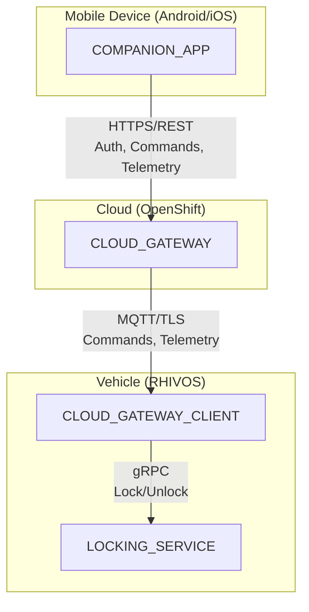
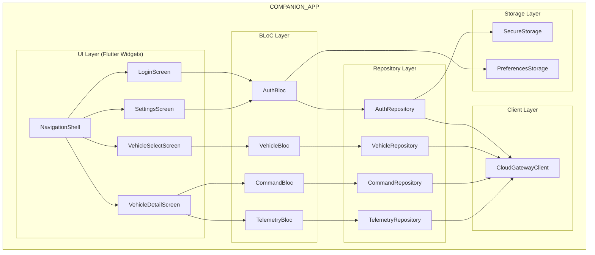
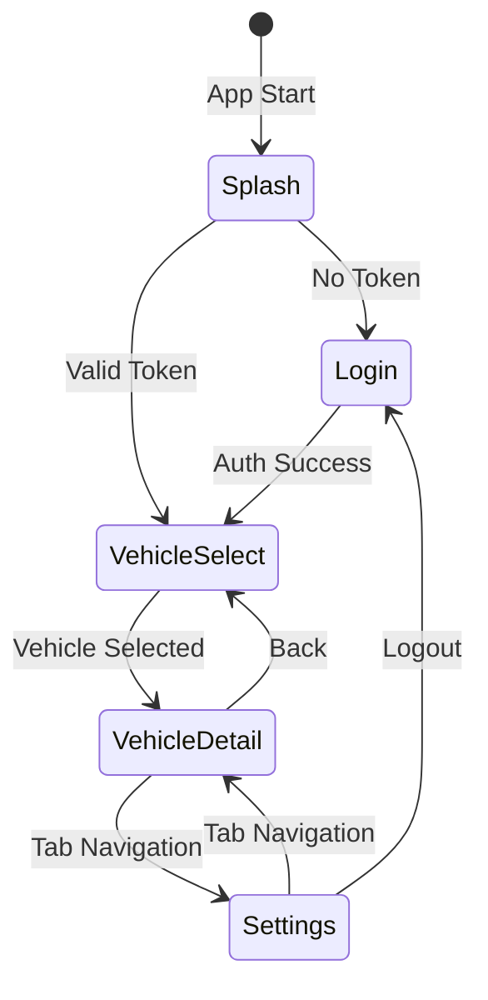
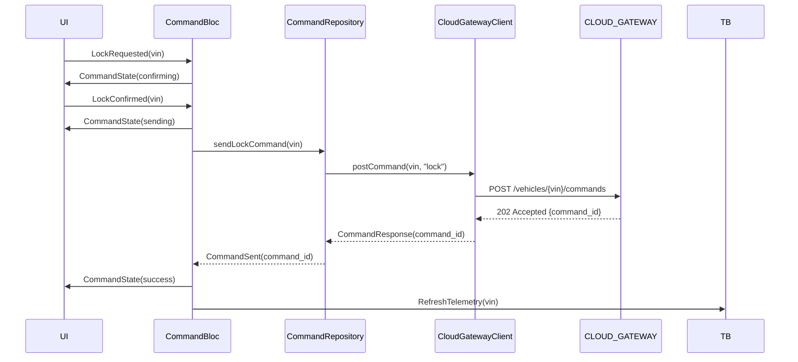

# Design Document: COMPANION_APP

## Overview

The COMPANION_APP is a Flutter/Dart mobile application that provides remote vehicle control for the SDV Parking Demo System. It runs on Android and iOS devices and enables users to:

1. Authenticate and select their vehicle
2. View vehicle telemetry (location, door status, parking state)
3. Send remote lock/unlock commands to start/stop parking sessions
4. Monitor command execution and receive feedback

The application uses Flutter's BLoC pattern for state management, Dio for HTTP communication, and flutter_secure_storage for credential storage.

## Architecture

### Component Context




### Internal Architecture



### Screen Flow State Machine



### Request Flow: Remote Lock Command



## Components and Interfaces

### REST API Client

#### CloudGatewayClient

Communicates with CLOUD_GATEWAY for all operations.

```dart
abstract class CloudGatewayClient {
  /// Authenticates user with email and password
  /// Returns AuthResponse with token on success
  Future<AuthResponse> authenticate(String email, String password);
  
  /// Refreshes authentication token
  Future<AuthResponse> refreshToken(String refreshToken);
  
  /// Gets list of vehicles for authenticated user
  Future<List<Vehicle>> getVehicles();
  
  /// Gets current telemetry for a vehicle
  Future<VehicleTelemetry> getTelemetry(String vin);
  
  /// Sends a command to a vehicle
  /// Returns command_id for tracking
  Future<CommandResponse> sendCommand(String vin, VehicleCommand command);
  
  /// Gets command status
  Future<CommandStatus> getCommandStatus(String vin, String commandId);
}
```


### Data Models

```dart
// Authentication
class AuthResponse {
  final String accessToken;
  final String refreshToken;
  final int expiresIn;
  final String userId;
  final String email;
}

class AuthCredentials {
  final String email;
  final String password;
}

// Vehicle
class Vehicle {
  final String vin;
  final String name;
  final String model;
}

// Telemetry
class VehicleTelemetry {
  final String vin;
  final double latitude;
  final double longitude;
  final bool isLocked;
  final bool isDoorOpen;
  final bool parkingSessionActive;  // Boolean from vehicle telemetry
  final ParkingSession? activeSession;  // Detailed session info from CLOUD_GATEWAY (if available)
  final DateTime timestamp;
}

/// Parking session details obtained from CLOUD_GATEWAY parking endpoint.
/// Note: Vehicle telemetry only provides `parking_session_active` boolean.
/// Full session details must be fetched separately from CLOUD_GATEWAY
/// when `parking_session_active` is true.
class ParkingSession {
  final String sessionId;
  final String zoneName;
  final double hourlyRate;
  final String currency;
  final Duration duration;
  final double currentCost;
}

// Commands
enum VehicleCommandType { lock, unlock }

class VehicleCommand {
  final VehicleCommandType type;
  final List<String> doors; // ["driver", "all"]
}

class CommandResponse {
  final String commandId;
  final String status; // "accepted", "rejected"
  final String? errorMessage;
}

class CommandStatus {
  final String commandId;
  final CommandState state;
  final String? errorMessage;
  final DateTime timestamp;
}

enum CommandState {
  pending,
  sent,
  delivered,
  executed,
  failed,
  timeout
}
```

### Repository Layer

#### AuthRepository

Manages authentication state and token storage.

```dart
class AuthRepository {
  final CloudGatewayClient _client;
  final SecureStorage _secureStorage;
  
  /// Authenticates user and stores tokens
  Future<AuthResult> login(String email, String password);
  
  /// Refreshes token if needed
  Future<String?> getValidToken();
  
  /// Clears stored credentials
  Future<void> logout();
  
  /// Checks if user is authenticated
  Future<bool> isAuthenticated();
  
  /// Gets stored user email
  Future<String?> getUserEmail();
}

sealed class AuthResult {
  const AuthResult();
}
class AuthSuccess extends AuthResult {
  final String userId;
  final String email;
}
class AuthFailure extends AuthResult {
  final String message;
}
```


#### VehicleRepository

Manages vehicle list retrieval.

```dart
class VehicleRepository {
  final CloudGatewayClient _client;
  
  /// Gets list of vehicles for current user
  Future<List<Vehicle>> getVehicles();
}
```

#### TelemetryRepository

Manages vehicle telemetry with caching.

```dart
class TelemetryRepository {
  final CloudGatewayClient _client;
  
  VehicleTelemetry? _cachedTelemetry;
  DateTime? _lastFetchTime;
  
  /// Gets current telemetry, uses cache if fresh
  Future<TelemetryResult> getTelemetry(String vin);
  
  /// Gets cached telemetry without network call
  VehicleTelemetry? getCachedTelemetry(String vin);
  
  /// Clears cached telemetry
  void clearCache();
}

sealed class TelemetryResult {
  const TelemetryResult();
}
class TelemetrySuccess extends TelemetryResult {
  final VehicleTelemetry telemetry;
}
class TelemetryFailure extends TelemetryResult {
  final String message;
  final VehicleTelemetry? cachedTelemetry;
}
```

#### CommandRepository

Manages command sending and status tracking.

```dart
class CommandRepository {
  final CloudGatewayClient _client;
  
  /// Sends lock command to vehicle
  Future<CommandResult> sendLockCommand(String vin);
  
  /// Sends unlock command to vehicle
  Future<CommandResult> sendUnlockCommand(String vin);
  
  /// Gets status of a sent command
  Future<CommandStatus> getCommandStatus(String vin, String commandId);
}

sealed class CommandResult {
  const CommandResult();
}
class CommandAccepted extends CommandResult {
  final String commandId;
}
class CommandRejected extends CommandResult {
  final String message;
}
class CommandError extends CommandResult {
  final String message;
  final bool isRetryable;
}
```

### BLoC Layer

#### AuthBloc

Manages authentication state.

```dart
// Events
sealed class AuthEvent {}
class AuthCheckRequested extends AuthEvent {}
class AuthLoginRequested extends AuthEvent {
  final String email;
  final String password;
}
class AuthLogoutRequested extends AuthEvent {}

// States
sealed class AuthState {}
class AuthInitial extends AuthState {}
class AuthLoading extends AuthState {}
class AuthAuthenticated extends AuthState {
  final String email;
}
class AuthUnauthenticated extends AuthState {}
class AuthError extends AuthState {
  final String message;
}
```


#### VehicleBloc

Manages vehicle selection state.

```dart
// Events
sealed class VehicleEvent {}
class VehicleListRequested extends VehicleEvent {}
class VehicleSelected extends VehicleEvent {
  final String vin;
}

// States
sealed class VehicleState {}
class VehicleInitial extends VehicleState {}
class VehicleLoading extends VehicleState {}
class VehicleListLoaded extends VehicleState {
  final List<Vehicle> vehicles;
}
class VehicleSelectedState extends VehicleState {
  final Vehicle vehicle;
}
class VehicleError extends VehicleState {
  final String message;
}
```

#### TelemetryBloc

Manages telemetry polling and display.

```dart
// Events
sealed class TelemetryEvent {}
class TelemetryStartPolling extends TelemetryEvent {
  final String vin;
}
class TelemetryStopPolling extends TelemetryEvent {}
class TelemetryRefreshRequested extends TelemetryEvent {}

// States
sealed class TelemetryState {}
class TelemetryInitial extends TelemetryState {}
class TelemetryLoading extends TelemetryState {}
class TelemetryLoaded extends TelemetryState {
  final VehicleTelemetry telemetry;
  final bool isStale;
}
class TelemetryOffline extends TelemetryState {
  final VehicleTelemetry? cachedTelemetry;
  final DateTime? lastUpdated;
}
class TelemetryError extends TelemetryState {
  final String message;
}
```

#### CommandBloc

Manages command execution state.

```dart
// Events
sealed class CommandEvent {}
class LockRequested extends CommandEvent {
  final String vin;
}
class UnlockRequested extends CommandEvent {
  final String vin;
}
class CommandConfirmed extends CommandEvent {}
class CommandCancelled extends CommandEvent {}

// States
sealed class CommandState {}
class CommandIdle extends CommandState {}
class CommandConfirming extends CommandState {
  final VehicleCommandType commandType;
}
class CommandSending extends CommandState {}
class CommandSuccess extends CommandState {
  final String message;
}
class CommandFailure extends CommandState {
  final String message;
  final bool isRetryable;
}
```

### Configuration

```dart
class AppConfig {
  // CLOUD_GATEWAY connection
  final String cloudGatewayBaseUrl;
  
  // Timeouts
  final Duration connectTimeout;
  final Duration receiveTimeout;
  final Duration commandTimeout;
  
  // Polling
  final Duration telemetryPollInterval;
  
  // Retry configuration
  final int maxRetryAttempts;
  final Duration retryBaseDelay;
  final Duration retryMaxDelay;  // Standardized max delay (30 seconds)
  
  // Demo mode
  final bool demoModeEnabled;
  final Duration demoCommandDelay;
  
  factory AppConfig.fromEnvironment() {
    return AppConfig(
      cloudGatewayBaseUrl: const String.fromEnvironment(
        'CLOUD_GATEWAY_URL',
        defaultValue: 'https://cloud-gateway.example.com',
      ),
      connectTimeout: const Duration(seconds: 10),
      receiveTimeout: const Duration(seconds: 30),
      commandTimeout: const Duration(seconds: 60),
      telemetryPollInterval: const Duration(seconds: 10),
      maxRetryAttempts: 3,
      retryBaseDelay: const Duration(seconds: 1),
      retryMaxDelay: const Duration(seconds: 30),  // Standardized max delay
      demoModeEnabled: const bool.fromEnvironment('DEMO_MODE'),
      demoCommandDelay: const Duration(seconds: 2),
    );
  }
}
```


### Error Types

```dart
sealed class AppException implements Exception {
  String get userMessage;
  bool get isRetryable;
}

class NetworkException extends AppException {
  @override
  String get userMessage => 'Unable to connect. Please check your internet connection.';
  @override
  bool get isRetryable => true;
}

class AuthenticationException extends AppException {
  final String? serverMessage;
  AuthenticationException([this.serverMessage]);
  
  @override
  String get userMessage => serverMessage ?? 'Invalid credentials. Please try again.';
  @override
  bool get isRetryable => false;
}

class TokenExpiredException extends AppException {
  @override
  String get userMessage => 'Your session has expired. Please log in again.';
  @override
  bool get isRetryable => false;
}

class CommandTimeoutException extends AppException {
  @override
  String get userMessage => 'Command timed out. Please try again.';
  @override
  bool get isRetryable => true;
}

class VehicleOfflineException extends AppException {
  @override
  String get userMessage => 'Vehicle is offline. Please try again later.';
  @override
  bool get isRetryable => true;
}

class UnknownException extends AppException {
  final String? details;
  UnknownException([this.details]);
  
  @override
  String get userMessage => 'An unexpected error occurred. Please try again.';
  @override
  bool get isRetryable => true;
}
```

## REST API Endpoints

The COMPANION_APP communicates with CLOUD_GATEWAY using the following endpoints:

### Authentication

```
POST /auth/login
Request:
{
  "email": "user@example.com",
  "password": "password123"
}
Response (200):
{
  "access_token": "eyJ...",
  "refresh_token": "eyJ...",
  "expires_in": 3600,
  "user_id": "user-123",
  "email": "user@example.com"
}
Response (401):
{
  "error": "invalid_credentials",
  "message": "Invalid email or password"
}

POST /auth/refresh
Request:
{
  "refresh_token": "eyJ..."
}
Response (200):
{
  "access_token": "eyJ...",
  "refresh_token": "eyJ...",
  "expires_in": 3600
}
```

### Vehicles

```
GET /vehicles
Headers: Authorization: Bearer {token}
Response (200):
{
  "vehicles": [
    {
      "vin": "VIN12345",
      "name": "My Car",
      "model": "Demo Vehicle"
    }
  ]
}

GET /vehicles/{vin}/telemetry
Headers: Authorization: Bearer {token}
Response (200):
{
  "vin": "VIN12345",
  "latitude": 37.7749,
  "longitude": -122.4194,
  "is_locked": true,
  "is_door_open": false,
  "parking_session_active": true,
  "timestamp": "2024-01-15T10:30:00Z"
}

Note: The telemetry endpoint returns `parking_session_active` as a boolean.
To get detailed parking session information, use the parking session endpoint below.

GET /vehicles/{vin}/parking-session
Headers: Authorization: Bearer {token}
Response (200) - when session is active:
{
  "session_id": "session-123",
  "zone_name": "Demo Zone",
  "hourly_rate": 2.50,
  "currency": "EUR",
  "duration_seconds": 3600,
  "current_cost": 2.50,
  "timestamp": "2024-01-15T10:30:00Z"
}
Response (404) - when no active session:
{
  "error": "no_active_session",
  "message": "No active parking session for this vehicle"
}

Note: COMPANION_APP should call this endpoint when `parking_session_active` is true
in telemetry to get detailed session information. The vehicle only publishes a boolean
`parking_session_active` flag in telemetry; full session details are proxied through
CLOUD_GATEWAY from PARKING_FEE_SERVICE.
```


### Commands

```
POST /vehicles/{vin}/commands
Headers: Authorization: Bearer {token}
Request:
{
  "type": "lock",
  "doors": ["all"]
}
Response (202):
{
  "command_id": "cmd-123",
  "status": "accepted"
}
Response (400):
{
  "error": "invalid_command",
  "message": "Invalid command type"
}
Response (503):
{
  "error": "vehicle_offline",
  "message": "Vehicle is not connected"
}

GET /vehicles/{vin}/commands/{command_id}
Headers: Authorization: Bearer {token}
Response (200):
{
  "command_id": "cmd-123",
  "state": "executed",
  "timestamp": "2024-01-15T10:30:05Z"
}
```

## Correctness Properties

Based on the requirements analysis, the following properties can be verified through property-based testing:

### Property 1: Token Storage Security

*For any* successful authentication response, the COMPANION_APP SHALL store the access_token and refresh_token in secure storage. Retrieving the tokens SHALL return the exact values that were stored.

**Validates: Requirements 1.3**

### Property 2: Authentication State Transitions

*For any* authentication attempt:
- If credentials are valid, the AuthState SHALL transition to AuthAuthenticated with the user's email
- If credentials are invalid, the AuthState SHALL transition to AuthError with an error message
- The AuthState SHALL never be AuthAuthenticated without a valid stored token

**Validates: Requirements 1.2, 1.4**

### Property 3: Vehicle List Display

*For any* list of vehicles returned from CLOUD_GATEWAY, the VehicleState SHALL contain all vehicles with their VIN and name fields. The displayed list SHALL have the same count as the API response.

**Validates: Requirements 2.1, 2.2**

### Property 4: Telemetry Data Completeness

*For any* telemetry response from CLOUD_GATEWAY, the TelemetryState SHALL contain:
- latitude and longitude (both present or both absent)
- isLocked boolean
- isDoorOpen boolean
- parkingSession (if active)
- timestamp

**Validates: Requirements 3.2, 3.3, 3.4**

### Property 5: Telemetry Polling Interval

*For any* active telemetry polling session, the time between consecutive telemetry requests SHALL be within 10 seconds ± 1 second tolerance.

**Validates: Requirements 3.6**

### Property 6: Command Confirmation Flow

*For any* lock or unlock command initiated by the user:
1. The CommandState SHALL first transition to CommandConfirming
2. If confirmed, the CommandState SHALL transition to CommandSending
3. If cancelled, the CommandState SHALL return to CommandIdle without making an API call

**Validates: Requirements 6.1, 6.2, 6.3**


### Property 7: Command Success Triggers Telemetry Refresh

*For any* command that completes successfully (CommandState becomes CommandSuccess), the TelemetryBloc SHALL receive a refresh event within 1 second.

**Validates: Requirements 4.4, 5.4**

### Property 8: Button Disable During Command

*For any* command in progress (CommandState is CommandSending), the lock and unlock buttons SHALL be disabled. When CommandState returns to CommandIdle, CommandSuccess, or CommandFailure, the buttons SHALL be enabled.

**Validates: Requirements 4.6, 5.6**

### Property 9: Error Message Mapping

*For any* AppException thrown by the application, the userMessage property SHALL return a non-empty, user-friendly string that does not contain technical details like stack traces or HTTP status codes.

**Validates: Requirements 7.1, 7.2, 7.3, 7.4**

### Property 10: Offline State Detection

*For any* NetworkException during telemetry fetch, the TelemetryState SHALL transition to TelemetryOffline with:
- cachedTelemetry containing the last successful telemetry (if any)
- lastUpdated timestamp of the cached data

**Validates: Requirements 8.1, 8.3**

### Property 11: Offline Button State

*For any* TelemetryOffline state, the lock and unlock buttons SHALL be disabled. When connectivity is restored (TelemetryLoaded state), the buttons SHALL be enabled.

**Validates: Requirements 8.2**

### Property 12: Logout Clears Credentials

*For any* logout action, the secure storage SHALL be cleared such that:
- getValidToken() returns null
- isAuthenticated() returns false
- The AuthState transitions to AuthUnauthenticated

**Validates: Requirements 10.3**

### Property 13: Demo Mode Command Simulation

*For any* command sent when demoModeEnabled is true:
- No actual API call SHALL be made to CLOUD_GATEWAY
- The command SHALL succeed after exactly demoCommandDelay (2 seconds ± 100ms)
- The CommandState SHALL follow the same transitions as real commands

**Validates: Requirements 11.1, 11.2**

### Property 14: Parking Session Display

*For any* telemetry with an active parking session, the UI SHALL display:
- session duration formatted as HH:MM:SS
- current cost formatted with currency symbol
- zone name

**Validates: Requirements 3.5**

## Error Handling

### HTTP Status Code Mapping

| HTTP Status | Exception Type | User Message |
|-------------|----------------|--------------|
| 401 | AuthenticationException | "Invalid credentials. Please try again." |
| 403 | TokenExpiredException | "Your session has expired. Please log in again." |
| 404 | VehicleNotFoundException | "Vehicle not found." |
| 408 | CommandTimeoutException | "Command timed out. Please try again." |
| 503 | VehicleOfflineException | "Vehicle is offline. Please try again later." |
| Network Error | NetworkException | "Unable to connect. Please check your internet connection." |
| Other | UnknownException | "An unexpected error occurred. Please try again." |

### Retry Strategy

```dart
Future<T> retryWithBackoff<T>({
  required Future<T> Function() operation,
  int maxAttempts = 3,
  Duration baseDelay = const Duration(seconds: 1),
  Duration maxDelay = const Duration(seconds: 10),
}) async {
  var currentDelay = baseDelay;
  for (var attempt = 0; attempt < maxAttempts - 1; attempt++) {
    try {
      return await operation();
    } on AppException catch (e) {
      if (!e.isRetryable) rethrow;
      await Future.delayed(currentDelay);
      currentDelay = Duration(
        milliseconds: min(currentDelay.inMilliseconds * 2, maxDelay.inMilliseconds),
      );
    }
  }
  return await operation(); // Last attempt, let exception propagate
}
```


## Testing Strategy

### Dual Testing Approach

The COMPANION_APP uses both unit tests and property-based tests:

- **Unit tests**: Verify specific examples, edge cases, UI interactions, and integration points
- **Property tests**: Verify universal properties across all inputs

### Property-Based Testing

Property-based tests use the `glados` package for Dart. Each property test:
- Runs minimum 100 iterations
- References the design document property
- Uses tag format: **Feature: companion_app, Property {number}: {property_text}**

### Test Organization

```
android/companion_app/
├── lib/
│   ├── main.dart
│   ├── app.dart
│   ├── config/
│   │   └── app_config.dart
│   ├── data/
│   │   ├── client/
│   │   │   └── cloud_gateway_client.dart
│   │   ├── models/
│   │   │   ├── auth_models.dart
│   │   │   ├── vehicle_models.dart
│   │   │   ├── telemetry_models.dart
│   │   │   └── command_models.dart
│   │   └── repository/
│   │       ├── auth_repository.dart
│   │       ├── vehicle_repository.dart
│   │       ├── telemetry_repository.dart
│   │       └── command_repository.dart
│   ├── bloc/
│   │   ├── auth/
│   │   │   ├── auth_bloc.dart
│   │   │   ├── auth_event.dart
│   │   │   └── auth_state.dart
│   │   ├── vehicle/
│   │   │   ├── vehicle_bloc.dart
│   │   │   ├── vehicle_event.dart
│   │   │   └── vehicle_state.dart
│   │   ├── telemetry/
│   │   │   ├── telemetry_bloc.dart
│   │   │   ├── telemetry_event.dart
│   │   │   └── telemetry_state.dart
│   │   └── command/
│   │       ├── command_bloc.dart
│   │       ├── command_event.dart
│   │       └── command_state.dart
│   ├── ui/
│   │   ├── navigation/
│   │   │   └── navigation_shell.dart
│   │   ├── screens/
│   │   │   ├── login_screen.dart
│   │   │   ├── vehicle_select_screen.dart
│   │   │   ├── vehicle_detail_screen.dart
│   │   │   └── settings_screen.dart
│   │   └── widgets/
│   │       ├── loading_indicator.dart
│   │       ├── error_message.dart
│   │       ├── telemetry_card.dart
│   │       └── command_buttons.dart
│   └── util/
│       ├── exceptions.dart
│       └── retry_utils.dart
├── test/
│   ├── unit/
│   │   ├── auth_repository_test.dart
│   │   ├── vehicle_repository_test.dart
│   │   ├── telemetry_repository_test.dart
│   │   ├── command_repository_test.dart
│   │   ├── auth_bloc_test.dart
│   │   ├── vehicle_bloc_test.dart
│   │   ├── telemetry_bloc_test.dart
│   │   └── command_bloc_test.dart
│   └── property/
│       ├── auth_properties_test.dart
│       ├── telemetry_properties_test.dart
│       ├── command_properties_test.dart
│       └── error_properties_test.dart
└── pubspec.yaml
```

## Dependencies

```yaml
dependencies:
  flutter:
    sdk: flutter
  flutter_bloc: ^8.1.0
  dio: ^5.0.0
  flutter_secure_storage: ^9.0.0
  shared_preferences: ^2.2.0
  go_router: ^12.0.0
  equatable: ^2.0.0
  intl: ^0.18.0

dev_dependencies:
  flutter_test:
    sdk: flutter
  bloc_test: ^9.1.0
  mocktail: ^1.0.0
  glados: ^1.1.0
```
