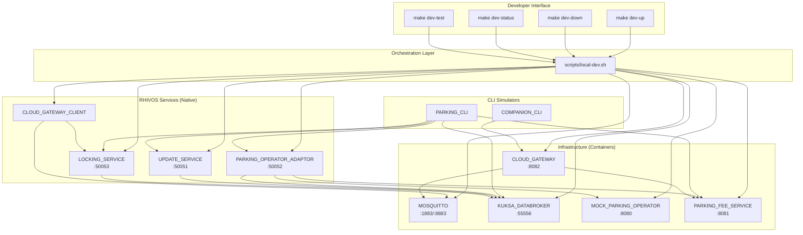
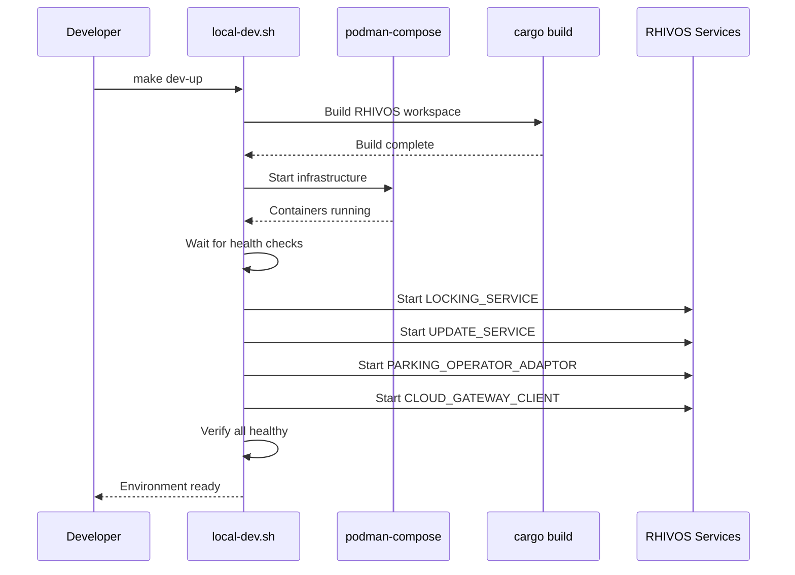
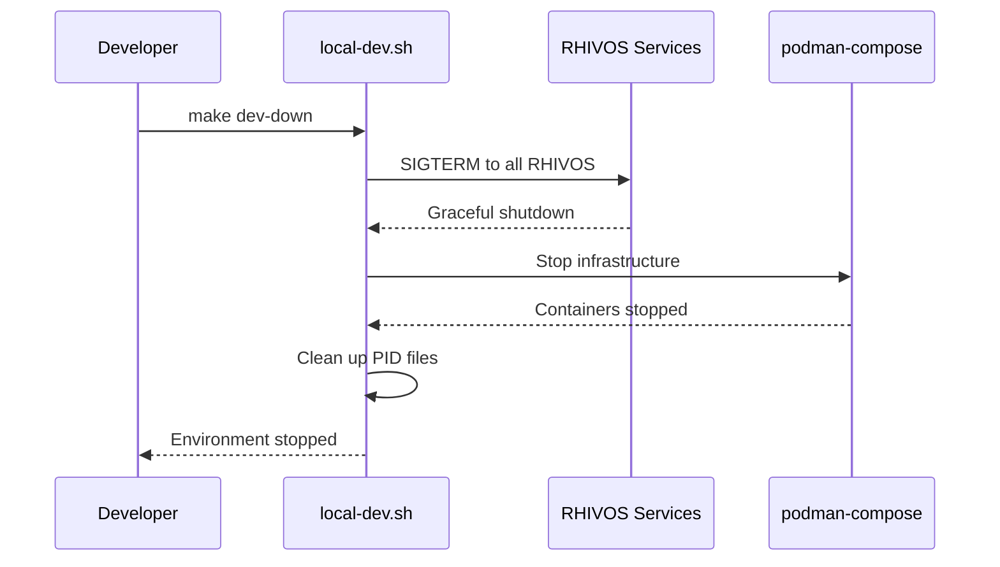

# Design Document: Local Development Environment

## Overview

This design describes the implementation of a local development environment for the SDV Parking Demo System. The environment enables developers to run all system components (except Android apps) locally for manual testing with CLI simulators and automated integration testing with TMT.

The solution uses a layered approach:
1. Infrastructure services run in containers via podman-compose (existing)
2. RHIVOS services run as native Rust processes for fast iteration
3. A shell script orchestrates startup/shutdown with dependency ordering
4. Makefile targets provide the developer interface

## Architecture



## Components and Interfaces

### Makefile Targets

| Target | Description | Implementation |
|--------|-------------|----------------|
| `dev-up` | Start complete local environment | Calls `scripts/local-dev.sh start` |
| `dev-down` | Stop all services | Calls `scripts/local-dev.sh stop` |
| `dev-status` | Show service health status | Calls `scripts/local-dev.sh status` |
| `dev-test` | Run TMT integration tests | Calls `scripts/local-dev.sh test` |

### Orchestration Script: `scripts/local-dev.sh`

The script manages the complete lifecycle with these commands:

```bash
scripts/local-dev.sh start   # Start all services
scripts/local-dev.sh stop    # Stop all services
scripts/local-dev.sh status  # Check service health
scripts/local-dev.sh test    # Run TMT tests
scripts/local-dev.sh logs    # Tail all service logs
```

#### Startup Sequence



#### Shutdown Sequence



### Service Configuration

#### Port Assignments

| Service | Port | Protocol | Environment Variable |
|---------|------|----------|---------------------|
| MOSQUITTO | 1883 | MQTT | `MQTT_BROKER_URL=tcp://localhost:1883` |
| MOSQUITTO | 8883 | MQTT/TLS | `MQTT_BROKER_URL=mqtts://localhost:8883` |
| KUKSA_DATABROKER | 55556 | gRPC | `DATA_BROKER_ADDR=localhost:55556` |
| MOCK_PARKING_OPERATOR | 8080 | HTTP | `OPERATOR_BASE_URL=http://localhost:8080` |
| PARKING_FEE_SERVICE | 8081 | HTTP | `PARKING_FEE_SERVICE_URL=http://localhost:8081` |
| CLOUD_GATEWAY | 8082 | HTTP | `CLOUD_GATEWAY_URL=http://localhost:8082` |
| UPDATE_SERVICE | 50051 | gRPC | `UPDATE_SERVICE_ADDR=localhost:50051` |
| PARKING_OPERATOR_ADAPTOR | 50052 | gRPC | `PARKING_ADAPTOR_ADDR=localhost:50052` |
| LOCKING_SERVICE | 50053 | gRPC | `LOCKING_SERVICE_ADDR=localhost:50053` |

#### RHIVOS Service Environment Variables

Each RHIVOS service requires specific environment variables for local development:

**LOCKING_SERVICE:**
```bash
LOCKING_SOCKET_PATH=tcp://0.0.0.0:50053  # Use TCP instead of UDS
DATA_BROKER_SOCKET=localhost:55556       # Connect to Kuksa via TCP
LOG_LEVEL=debug
```

**UPDATE_SERVICE:**
```bash
UPDATE_SERVICE_LISTEN_ADDR=0.0.0.0:50051
DATA_BROKER_SOCKET=localhost:55556
UPDATE_SERVICE_STORAGE_PATH=/tmp/sdv-adapters
LOG_LEVEL=debug
```

**PARKING_OPERATOR_ADAPTOR:**
```bash
LISTEN_ADDR=0.0.0.0:50052
DATA_BROKER_SOCKET=localhost:55556
OPERATOR_BASE_URL=http://localhost:8080/api/v1
PARKING_FEE_SERVICE_URL=http://localhost:8081/api/v1
STORAGE_PATH=/tmp/sdv-parking-session.json
LOG_LEVEL=debug
```

**CLOUD_GATEWAY_CLIENT:**
```bash
CGC_VIN=DEMO_VIN_001
CGC_MQTT_BROKER_URL=mqtt://localhost:1883
CGC_LOCKING_SERVICE_SOCKET=localhost:50053
CGC_DATA_BROKER_SOCKET=localhost:55556
LOG_LEVEL=debug
```

### Health Check Implementation

The status command checks each service:

| Service | Health Check Method |
|---------|-------------------|
| MOSQUITTO | `nc -zv localhost 1883` |
| KUKSA_DATABROKER | `nc -zv localhost 55556` |
| MOCK_PARKING_OPERATOR | `curl -sf http://localhost:8080/health` |
| PARKING_FEE_SERVICE | `curl -sf http://localhost:8081/health` |
| CLOUD_GATEWAY | `curl -sf http://localhost:8082/health` |
| LOCKING_SERVICE | `grpcurl -plaintext localhost:50053 list` or PID check |
| UPDATE_SERVICE | `grpcurl -plaintext localhost:50051 list` or PID check |
| PARKING_OPERATOR_ADAPTOR | `grpcurl -plaintext localhost:50052 list` or PID check |
| CLOUD_GATEWAY_CLIENT | PID file check |

### Process Management

RHIVOS services run as background processes with:
- PID files stored in `logs/pids/`
- stdout/stderr redirected to `logs/{service}.log`
- Graceful shutdown via SIGTERM

```
logs/
├── pids/
│   ├── locking-service.pid
│   ├── update-service.pid
│   ├── parking-operator-adaptor.pid
│   └── cloud-gateway-client.pid
├── locking-service.log
├── update-service.log
├── parking-operator-adaptor.log
└── cloud-gateway-client.log
```

## Data Models

### Service State

```bash
# Service state tracked via PID files and port checks
# No persistent state required for orchestration
```

### TMT Test Plan Structure

```
tests/
├── integration/
│   ├── main.fmf           # TMT test plan metadata
│   ├── test-lock-unlock.sh
│   ├── test-parking-session.sh
│   └── test-adapter-lifecycle.sh
```

**main.fmf format:**
```yaml
summary: SDV Parking Demo Integration Tests
description: |
    Integration tests for the local development environment.
    Requires all services to be running via `make dev-up`.

discover:
    how: fmf
    filter: tier:1

execute:
    how: tmt

prepare:
    - how: shell
      script: |
        # Verify services are healthy
        make dev-status || exit 1

environment:
    CLOUD_GATEWAY_URL: http://localhost:8082
    PARKING_FEE_SERVICE_URL: http://localhost:8081
    DATA_BROKER_ADDR: localhost:55556
```

## Correctness Properties

*A property is a characteristic or behavior that should hold true across all valid executions of a system—essentially, a formal statement about what the system should do. Properties serve as the bridge between human-readable specifications and machine-verifiable correctness guarantees.*


Based on the prework analysis, the following properties are testable:

### Property 1: Service Startup Completeness

*For any* execution of `make dev-up`, all expected services SHALL be running and listening on their assigned ports within a reasonable timeout (60 seconds).

**Validates: Requirements 1.1, 1.2, 1.3, 6.2, 6.3, 6.4, 6.5, 6.6, 7.1, 7.2, 7.3, 7.4, 7.5, 7.6, 7.7, 7.8**

### Property 2: Service Shutdown Completeness

*For any* execution of `make dev-down` after `make dev-up`, all services SHALL be stopped and all assigned ports SHALL be released (available for binding).

**Validates: Requirements 2.1, 2.2, 2.3, 2.4**

### Property 3: CLI Connectivity

*For any* running LOCAL_DEV_ENVIRONMENT, both COMPANION_CLI and PARKING_CLI SHALL successfully connect to their respective services and execute basic commands without connection errors.

**Validates: Requirements 4.1, 4.2, 4.3, 4.4, 4.5, 4.6**

### Property 4: Dependency Ordering

*For any* execution of `make dev-up`, dependent services SHALL only start after their dependencies are healthy. Specifically:
- CLOUD_GATEWAY_CLIENT starts after MOSQUITTO is healthy
- CLOUD_GATEWAY starts after MOSQUITTO and PARKING_FEE_SERVICE are healthy
- RHIVOS services start after KUKSA_DATABROKER is healthy

**Validates: Requirements 8.1, 8.2, 8.3, 8.4, 8.5, 8.7**

### Property 5: Log File Creation

*For any* RHIVOS service started by `make dev-up`, a corresponding log file SHALL be created in the `logs/` directory containing service output.

**Validates: Requirements 6.7**

## Error Handling

### Startup Errors

| Error Condition | Handling |
|-----------------|----------|
| Port already in use | Display error with port number and service name, suggest `make dev-down` or `lsof -i :PORT` |
| Cargo build failure | Display build error, abort startup |
| Container pull failure | Display podman error, suggest checking network |
| Service crash on startup | Display service name and log file location |
| Health check timeout | Display service name and timeout duration |

### Shutdown Errors

| Error Condition | Handling |
|-----------------|----------|
| Service not responding to SIGTERM | Send SIGKILL after 5 second timeout |
| PID file missing | Skip service, log warning |
| Container stop failure | Display podman error, continue with other services |

### Status Check Errors

| Error Condition | Handling |
|-----------------|----------|
| Health endpoint unreachable | Mark service as unhealthy |
| Port not listening | Mark service as not running |
| grpcurl not installed | Fall back to port check only |

## Testing Strategy

### Unit Tests

Unit tests are not applicable for this feature as it primarily involves shell scripting and orchestration.

### Integration Tests

Integration tests verify the complete workflow:

1. **Startup Test**: Run `make dev-up`, verify all services healthy via `make dev-status`
2. **CLI Test**: Run basic commands with COMPANION_CLI and PARKING_CLI
3. **Shutdown Test**: Run `make dev-down`, verify all ports released
4. **Idempotency Test**: Run `make dev-up` twice, verify no errors
5. **Recovery Test**: Kill a service, run `make dev-up`, verify recovery

### Property-Based Tests

Property tests should use a shell-based testing framework (e.g., bats-core) with the following configuration:
- Minimum 3 iterations per property test (due to service startup time)
- Each test references its design document property
- Tag format: **Feature: local-dev-environment, Property {number}: {property_text}**

**Test File Location**: `tests/integration/local-dev-environment.bats`

```bash
# Example property test structure
@test "Property 1: Service Startup Completeness" {
    # Feature: local-dev-environment, Property 1: Service Startup Completeness
    make dev-up
    
    # Verify all ports are listening
    nc -zv localhost 1883   # MOSQUITTO
    nc -zv localhost 55556  # KUKSA_DATABROKER
    curl -sf http://localhost:8080/health  # MOCK_PARKING_OPERATOR
    curl -sf http://localhost:8081/health  # PARKING_FEE_SERVICE
    curl -sf http://localhost:8082/health  # CLOUD_GATEWAY
    nc -zv localhost 50051  # UPDATE_SERVICE
    nc -zv localhost 50052  # PARKING_OPERATOR_ADAPTOR
    nc -zv localhost 50053  # LOCKING_SERVICE
}
```

### TMT Test Plan

TMT tests are defined in `tests/integration/main.fmf` and executed via `make dev-test`. These tests validate end-to-end scenarios:

1. Lock/unlock flow via COMPANION_CLI
2. Parking session lifecycle via PARKING_CLI
3. Adapter installation via UPDATE_SERVICE

### Test Dependencies

- `bats-core`: Shell testing framework
- `tmt`: Test Management Tool
- `grpcurl`: gRPC health checks (optional, falls back to port check)
- `nc` (netcat): Port availability checks
- `curl`: HTTP health checks
