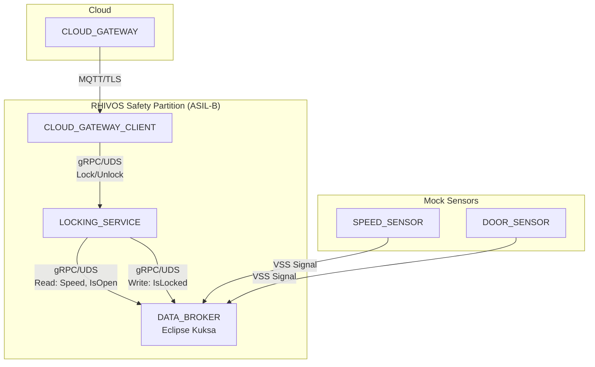
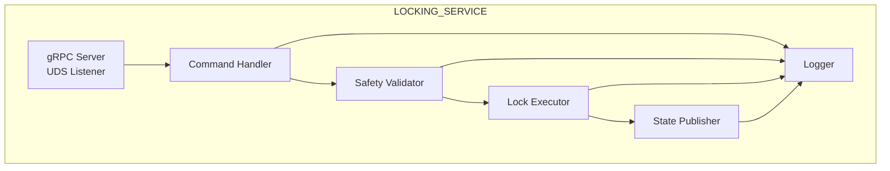

# Design Document: LOCKING_SERVICE

## Overview

The LOCKING_SERVICE is an ASIL-B safety-critical Rust service running in the RHIVOS safety partition. It provides door lock/unlock functionality with safety constraint validation, integrating with the DATA_BROKER for signal reading and state publication.

The service receives commands from CLOUD_GATEWAY_CLIENT via gRPC over Unix Domain Sockets, validates safety constraints by reading vehicle signals from DATA_BROKER, executes lock operations, and publishes state changes back to DATA_BROKER for consumption by other components (PARKING_APP, PARKING_OPERATOR_ADAPTOR).

## Architecture

### Component Context



### Internal Architecture



### Request Flow

1. **Command Reception**: gRPC server receives Lock/Unlock request via UDS
2. **Authentication**: Validate Auth_Token (basic demo-grade validation)
3. **Safety Validation**: Read required signals from DATA_BROKER
4. **Execution**: Execute lock/unlock operation (simulated for demo)
5. **State Publication**: Publish new IsLocked state to DATA_BROKER
6. **Response**: Return success/failure with Command_ID

## Components and Interfaces

### gRPC Service Definition

The service implements the interface defined in `proto/services/locking_service.proto`:

```protobuf
syntax = "proto3";
package sdv.services.locking;

service LockingService {
  rpc Lock(LockRequest) returns (LockResponse);
  rpc Unlock(UnlockRequest) returns (UnlockResponse);
  rpc GetLockState(GetLockStateRequest) returns (GetLockStateResponse);
}

enum Door {
  DOOR_UNKNOWN = 0;
  DOOR_DRIVER = 1;
  DOOR_PASSENGER = 2;
  DOOR_REAR_LEFT = 3;
  DOOR_REAR_RIGHT = 4;
  DOOR_ALL = 5;
}

message LockRequest {
  Door door = 1;
  string command_id = 2;
  string auth_token = 3;
}

message LockResponse {
  bool success = 1;
  string error_message = 2;
  string command_id = 3;
  bool state_published = 4;  // Indicates if DATA_BROKER update succeeded
}

message UnlockRequest {
  Door door = 1;
  string command_id = 2;
  string auth_token = 3;
}

message UnlockResponse {
  bool success = 1;
  string error_message = 2;
  string command_id = 3;
  bool state_published = 4;
}

message GetLockStateRequest {
  Door door = 1;
}

message GetLockStateResponse {
  Door door = 1;
  bool is_locked = 2;
  bool is_open = 3;
}
```

### Internal Components

#### LockingServiceImpl

Main service implementation handling gRPC requests.

```rust
pub struct LockingServiceImpl {
    data_broker_client: DataBrokerClient,
    lock_state: Arc<RwLock<LockState>>,
    config: ServiceConfig,
    logger: Logger,
}

impl LockingServiceImpl {
    pub fn new(config: ServiceConfig) -> Result<Self, Error>;
    async fn validate_auth_token(&self, token: &str) -> Result<(), AuthError>;
}
```

#### SafetyValidator

Validates safety constraints before command execution.

```rust
pub struct SafetyValidator {
    data_broker_client: DataBrokerClient,
    validation_timeout: Duration,
}

impl SafetyValidator {
    /// Validates constraints for lock operation
    /// Returns error if door is open (IsOpen = true)
    pub async fn validate_lock(&self, door: Door) -> Result<(), SafetyError>;
    
    /// Validates constraints for unlock operation
    /// Returns error if vehicle speed > 0
    pub async fn validate_unlock(&self) -> Result<(), SafetyError>;
}
```

#### LockExecutor

Executes lock/unlock operations (simulated for demo).

```rust
pub struct LockExecutor {
    lock_state: Arc<RwLock<LockState>>,
    execution_timeout: Duration,
}

impl LockExecutor {
    pub async fn execute_lock(&self, door: Door) -> Result<(), ExecutionError>;
    pub async fn execute_unlock(&self, door: Door) -> Result<(), ExecutionError>;
}
```

#### StatePublisher

Publishes lock state changes to DATA_BROKER with retry logic.

```rust
pub struct StatePublisher {
    data_broker_client: DataBrokerClient,
    max_retries: u32,
    base_delay: Duration,
}

impl StatePublisher {
    /// Publishes IsLocked state with exponential backoff retry
    pub async fn publish_lock_state(
        &self, 
        door: Door, 
        is_locked: bool
    ) -> Result<(), PublishError>;
}
```

## Data Models

### Lock State

```rust
/// Internal lock state for all doors
#[derive(Debug, Clone)]
pub struct LockState {
    pub driver: DoorState,
    pub passenger: DoorState,
    pub rear_left: DoorState,
    pub rear_right: DoorState,
}

#[derive(Debug, Clone)]
pub struct DoorState {
    pub is_locked: bool,
    pub is_open: bool,
    pub last_updated: SystemTime,
}

impl LockState {
    pub fn get_door(&self, door: Door) -> Option<&DoorState>;
    pub fn set_locked(&mut self, door: Door, locked: bool);
}
```

### Configuration

```rust
/// Service configuration loaded from environment/file
#[derive(Debug, Clone)]
pub struct ServiceConfig {
    /// UDS socket path for gRPC server
    pub socket_path: String,
    /// DATA_BROKER UDS socket path
    pub data_broker_socket: String,
    /// Command execution timeout
    pub execution_timeout_ms: u64,
    /// Safety validation timeout
    pub validation_timeout_ms: u64,
    /// Max retries for DATA_BROKER publish
    pub publish_max_retries: u32,
    /// Base delay for exponential backoff (ms)
    pub publish_base_delay_ms: u64,
    /// Valid auth tokens (demo-grade, not production)
    pub valid_tokens: Vec<String>,
}

impl Default for ServiceConfig {
    fn default() -> Self {
        Self {
            socket_path: "/run/rhivos/locking.sock".to_string(),
            data_broker_socket: "/run/kuksa/databroker.sock".to_string(),
            execution_timeout_ms: 500,
            validation_timeout_ms: 100,
            publish_max_retries: 3,
            publish_base_delay_ms: 50,
            valid_tokens: vec!["demo-token".to_string()],
        }
    }
}
```

### Error Types

```rust
#[derive(Debug, thiserror::Error)]
pub enum LockingError {
    #[error("Authentication failed: {0}")]
    AuthError(String),
    
    #[error("Safety constraint violated: {0}")]
    SafetyError(SafetyViolation),
    
    #[error("Execution failed: {0}")]
    ExecutionError(String),
    
    #[error("DATA_BROKER unavailable: {0}")]
    DataBrokerError(String),
    
    #[error("Command timeout after {0}ms")]
    TimeoutError(u64),
    
    #[error("Invalid door: {0:?}")]
    InvalidDoor(Door),
}

#[derive(Debug)]
pub enum SafetyViolation {
    DoorAjar { door: Door },
    VehicleMoving { speed_kmh: f32 },
}
```

### VSS Signal Paths

| Signal | Path | Type | Access |
|--------|------|------|--------|
| Door Lock State | `Vehicle.Cabin.Door.Row1.DriverSide.IsLocked` | bool | Read/Write |
| Door Open State | `Vehicle.Cabin.Door.Row1.DriverSide.IsOpen` | bool | Read |
| Vehicle Speed | `Vehicle.Speed` | float | Read |

### Log Entry Structure

```rust
#[derive(Debug, Serialize)]
pub struct LogEntry {
    pub timestamp: DateTime<Utc>,
    pub level: LogLevel,
    pub command_id: Option<String>,
    pub correlation_id: String,
    pub event_type: EventType,
    pub door: Option<Door>,
    pub details: serde_json::Value,
}

#[derive(Debug, Serialize)]
pub enum EventType {
    CommandReceived,
    AuthValidation,
    SafetyValidation,
    Execution,
    StatePublish,
    CommandComplete,
}
```

## Correctness Properties

*A property is a characteristic or behavior that should hold true across all valid executions of a system—essentially, a formal statement about what the system should do. Properties serve as the bridge between human-readable specifications and machine-verifiable correctness guarantees.*

Based on the prework analysis, the following properties can be verified through property-based testing:

### Property 1: Invalid Auth Token Rejection

*For any* Lock or Unlock command with an invalid or missing Auth_Token, the LOCKING_SERVICE SHALL reject the command and return an authentication error without executing any lock operation.

**Validates: Requirements 1.4, 2.4**

### Property 2: Lock Fails When Door Is Open

*For any* Lock command when the door is in the open state (IsOpen = true), the LOCKING_SERVICE SHALL reject the command with a safety violation error, and the lock state SHALL remain unchanged.

**Validates: Requirements 1.3**

### Property 3: Unlock Fails When Vehicle Is Moving

*For any* Unlock command when the vehicle speed is greater than 0, the LOCKING_SERVICE SHALL reject the command with a safety violation error, and the lock state SHALL remain unchanged.

**Validates: Requirements 2.3**

### Property 4: Valid Commands Return Correct Command_ID

*For any* Lock or Unlock command that passes authentication and safety validation, the response SHALL contain the same Command_ID that was provided in the request, and the success field SHALL be true.

**Validates: Requirements 1.2, 2.2**

### Property 5: State Publication Consistency

*For any* successful Lock operation, the state published to DATA_BROKER SHALL be IsLocked=true. *For any* successful Unlock operation, the state published to DATA_BROKER SHALL be IsLocked=false. The published state SHALL always match the operation performed.

**Validates: Requirements 1.5, 2.5, 5.1**

### Property 6: GetLockState Returns Complete State

*For any* valid door identifier, GetLockState SHALL return a response containing both is_locked and is_open fields that accurately reflect the current state of that door.

**Validates: Requirements 3.1, 3.2**

### Property 7: Invalid Door Returns Error

*For any* request (Lock, Unlock, or GetLockState) with an invalid door identifier (DOOR_UNKNOWN or out-of-range value), the LOCKING_SERVICE SHALL return an error indicating the door is not recognized.

**Validates: Requirements 3.3**

### Property 8: Timeout Preserves State Consistency

*For any* command that times out during execution, the lock state SHALL be left in a consistent state—either the operation completed fully or it did not occur at all. There SHALL be no partial state changes.

**Validates: Requirements 6.3**

## Error Handling

### gRPC Status Code Mapping

| Error Scenario | gRPC Status Code | Error Code |
|----------------|------------------|------------|
| Invalid/missing auth token | UNAUTHENTICATED (16) | AUTH_INVALID_TOKEN |
| Door is open (lock safety) | FAILED_PRECONDITION (9) | SAFETY_DOOR_AJAR |
| Vehicle moving (unlock safety) | FAILED_PRECONDITION (9) | SAFETY_VEHICLE_MOVING |
| Invalid door identifier | INVALID_ARGUMENT (3) | INVALID_DOOR |
| DATA_BROKER unavailable | UNAVAILABLE (14) | DATABROKER_UNAVAILABLE |
| Command timeout | DEADLINE_EXCEEDED (4) | COMMAND_TIMEOUT |
| State publish failed (partial success) | OK (0) | PUBLISH_FAILED (in response) |

### Error Response Structure

```rust
impl From<LockingError> for tonic::Status {
    fn from(err: LockingError) -> Self {
        match err {
            LockingError::AuthError(msg) => {
                Status::unauthenticated(msg)
                    .with_details(ErrorDetails {
                        code: "AUTH_INVALID_TOKEN".into(),
                        message: msg,
                        ..Default::default()
                    })
            }
            LockingError::SafetyError(SafetyViolation::DoorAjar { door }) => {
                Status::failed_precondition(format!("Door {:?} is open", door))
                    .with_details(ErrorDetails {
                        code: "SAFETY_DOOR_AJAR".into(),
                        message: "Cannot lock while door is open".into(),
                        details: [("door".into(), format!("{:?}", door))].into(),
                        ..Default::default()
                    })
            }
            LockingError::SafetyError(SafetyViolation::VehicleMoving { speed_kmh }) => {
                Status::failed_precondition(format!("Vehicle moving at {} km/h", speed_kmh))
                    .with_details(ErrorDetails {
                        code: "SAFETY_VEHICLE_MOVING".into(),
                        message: "Cannot unlock while vehicle is moving".into(),
                        details: [("speed_kmh".into(), speed_kmh.to_string())].into(),
                        ..Default::default()
                    })
            }
            LockingError::DataBrokerError(msg) => {
                Status::unavailable(msg)
                    .with_details(ErrorDetails {
                        code: "DATABROKER_UNAVAILABLE".into(),
                        message: msg,
                        ..Default::default()
                    })
            }
            LockingError::TimeoutError(ms) => {
                Status::deadline_exceeded(format!("Command timed out after {}ms", ms))
            }
            LockingError::InvalidDoor(door) => {
                Status::invalid_argument(format!("Invalid door: {:?}", door))
            }
            _ => Status::internal("Internal error"),
        }
    }
}
```

### Retry Strategy for DATA_BROKER Publishing

```rust
async fn publish_with_retry(&self, door: Door, is_locked: bool) -> Result<(), PublishError> {
    let mut delay = self.base_delay;
    
    for attempt in 0..self.max_retries {
        match self.data_broker_client.set_signal(/* ... */).await {
            Ok(_) => return Ok(()),
            Err(e) if attempt < self.max_retries - 1 => {
                log::warn!("Publish attempt {} failed: {}, retrying in {:?}", 
                          attempt + 1, e, delay);
                tokio::time::sleep(delay).await;
                delay *= 2; // Exponential backoff
            }
            Err(e) => return Err(PublishError::AllRetriesFailed(e.to_string())),
        }
    }
    unreachable!()
}
```

## Testing Strategy

### Dual Testing Approach

The LOCKING_SERVICE uses both unit tests and property-based tests:

- **Unit tests**: Verify specific examples, edge cases, and error conditions
- **Property tests**: Verify universal properties across all inputs

### Property-Based Testing

Property-based tests use the `proptest` crate for Rust. Each property test:
- Runs minimum 100 iterations
- References the design document property
- Uses tag format: **Feature: locking-service, Property {number}: {property_text}**

### Test Organization

```
rhivos/locking-service/
├── src/
│   ├── lib.rs
│   ├── service.rs
│   ├── validator.rs
│   ├── executor.rs
│   └── publisher.rs
└── tests/
    ├── unit/
    │   ├── auth_test.rs
    │   ├── safety_test.rs
    │   └── state_test.rs
    └── property/
        ├── auth_properties.rs      # Property 1
        ├── safety_properties.rs    # Properties 2, 3
        ├── command_properties.rs   # Property 4
        ├── state_properties.rs     # Properties 5, 6
        ├── error_properties.rs     # Property 7
        └── timeout_properties.rs   # Property 8
```

### Property Test Examples

```rust
// Property 1: Invalid Auth Token Rejection
proptest! {
    #![proptest_config(ProptestConfig::with_cases(100))]
    
    /// Feature: locking-service, Property 1: Invalid Auth Token Rejection
    #[test]
    fn invalid_token_rejected(
        token in prop::string::string_regex("[a-z]{0,20}").unwrap()
            .prop_filter("not valid token", |t| !VALID_TOKENS.contains(t)),
        door in prop_door(),
    ) {
        let service = create_test_service();
        let request = LockRequest {
            door: door.into(),
            command_id: "test-cmd".into(),
            auth_token: token,
        };
        
        let result = block_on(service.lock(request));
        prop_assert!(result.is_err());
        prop_assert_eq!(result.unwrap_err().code(), tonic::Code::Unauthenticated);
    }
}

// Property 2: Lock Fails When Door Is Open
proptest! {
    /// Feature: locking-service, Property 2: Lock Fails When Door Is Open
    #[test]
    fn lock_fails_when_door_open(door in prop_door()) {
        let service = create_test_service_with_state(DoorState {
            is_locked: false,
            is_open: true,  // Door is open
            ..Default::default()
        });
        
        let request = LockRequest {
            door: door.into(),
            command_id: "test-cmd".into(),
            auth_token: VALID_TOKEN.into(),
        };
        
        let initial_state = service.get_lock_state(door);
        let result = block_on(service.lock(request));
        let final_state = service.get_lock_state(door);
        
        prop_assert!(result.is_err());
        prop_assert_eq!(result.unwrap_err().code(), tonic::Code::FailedPrecondition);
        prop_assert_eq!(initial_state.is_locked, final_state.is_locked); // State unchanged
    }
}
```

### Unit Test Coverage

Unit tests focus on:
- Specific error message content
- Edge cases (empty command_id, boundary values)
- Integration with mock DATA_BROKER
- Timeout behavior simulation
- Log output verification

### Integration Testing

Integration tests verify:
- gRPC server starts and accepts connections on UDS
- DATA_BROKER client connects and reads/writes signals
- End-to-end command flow from request to state publication
- Concurrent command handling
