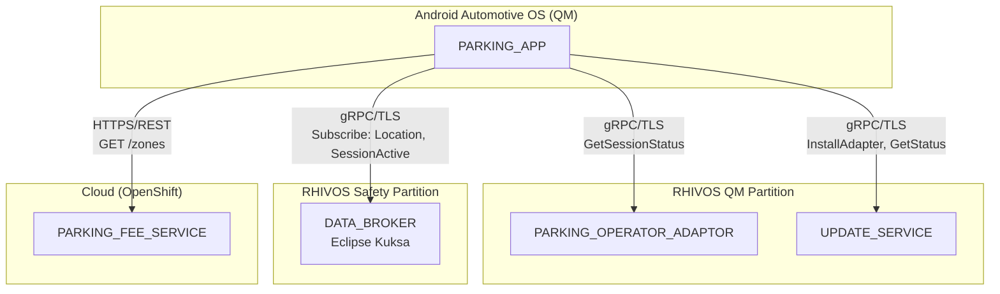
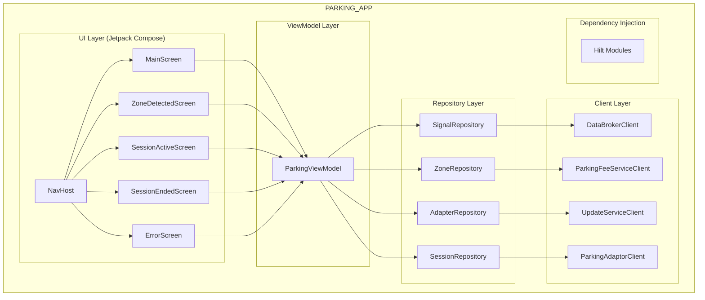
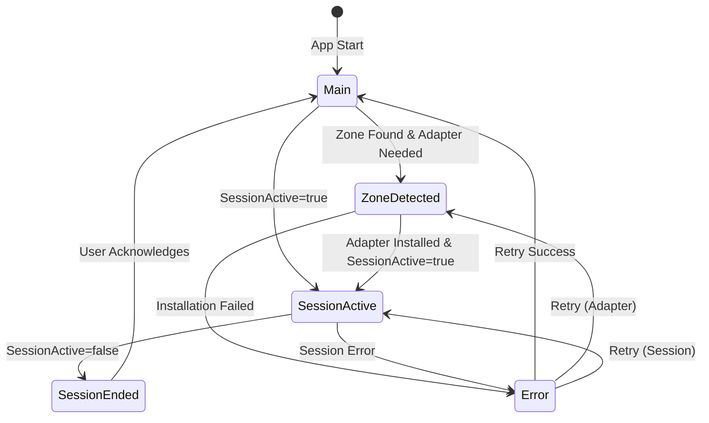
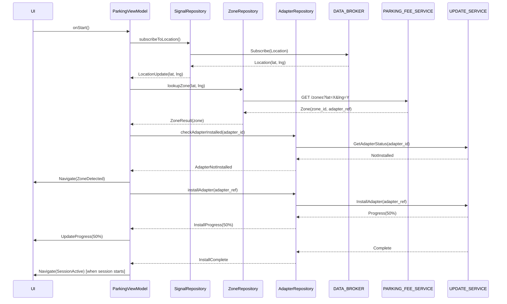

# Design Document: PARKING_APP

## Overview

The PARKING_APP is a Kotlin Android Automotive OS (AAOS) application that provides the user interface for the SDV Parking Demo System. It runs on the vehicle's In-Vehicle Infotainment (IVI) system and orchestrates the parking workflow by:

1. Subscribing to vehicle signals (location, parking state) from DATA_BROKER
2. Querying PARKING_FEE_SERVICE for zone information based on location
3. Requesting adapter installation from UPDATE_SERVICE when needed
4. Displaying parking session status from PARKING_OPERATOR_ADAPTOR
5. Presenting a minimal, demo-focused UI with five main screens

The application uses Jetpack Compose for UI, Kotlin Coroutines for async operations, and gRPC-kotlin for service communication.

## Architecture

### Component Context



### Internal Architecture



### Screen Flow State Machine



### Request Flow: Zone Detection and Adapter Installation



## Components and Interfaces

### gRPC Service Clients

#### DataBrokerClient

Communicates with DATA_BROKER for vehicle signal subscriptions.

```kotlin
interface DataBrokerClient {
    /**
     * Subscribes to location signals (Latitude, Longitude)
     * Emits LocationUpdate on each signal change
     */
    fun subscribeToLocation(): Flow<LocationUpdate>
    
    /**
     * Subscribes to parking session active signal
     * Emits true when session starts, false when session ends
     */
    fun subscribeToSessionActive(): Flow<Boolean>
    
    /**
     * Checks if connection to DATA_BROKER is established
     */
    suspend fun isConnected(): Boolean
    
    /**
     * Attempts to reconnect with exponential backoff
     * @param maxAttempts Maximum reconnection attempts (default 5)
     */
    suspend fun reconnect(maxAttempts: Int = 5): Result<Unit>
    
    /**
     * Connection state flow for monitoring gRPC connectivity
     * When connection is lost, UI should show "not available" state
     */
    val connectionState: StateFlow<GrpcConnectionState>
}

/**
 * gRPC connection state for RHIVOS services
 * When DISCONNECTED or FAILED, the app displays "not available" overlay
 */
enum class GrpcConnectionState {
    CONNECTED,      // Normal operation
    DISCONNECTED,   // Connection lost, attempting reconnect
    RECONNECTING,   // Actively reconnecting with backoff
    FAILED          // All reconnection attempts exhausted
}

data class LocationUpdate(
    val latitude: Double,
    val longitude: Double,
    val timestamp: Long
)
```

### Offline Behavior

When the gRPC connection to RHIVOS services is lost, the app displays a "not available" overlay:

```kotlin
/**
 * Offline state management for RHIVOS connectivity
 * The app monitors gRPC connection state and displays appropriate UI
 */
data class OfflineState(
    val isOffline: Boolean,
    val reason: OfflineReason,
    val lastConnectedTimestamp: Long?
)

enum class OfflineReason {
    NONE,                    // Connected normally
    DATA_BROKER_UNAVAILABLE, // Cannot reach DATA_BROKER
    UPDATE_SERVICE_UNAVAILABLE, // Cannot reach UPDATE_SERVICE
    ADAPTOR_UNAVAILABLE,     // Cannot reach PARKING_OPERATOR_ADAPTOR
    NETWORK_ERROR            // General network connectivity issue
}
```

When offline:
- A semi-transparent overlay displays "Parking Service Not Available"
- The underlying screen remains visible but non-interactive
- Automatic reconnection attempts continue in background
- When connection is restored, overlay dismisses automatically

#### UpdateServiceClient

Communicates with UPDATE_SERVICE for adapter lifecycle management.

```kotlin
interface UpdateServiceClient {
    /**
     * Checks if an adapter is currently installed
     * @param adapterId The adapter identifier
     */
    suspend fun isAdapterInstalled(adapterId: String): Boolean
    
    /**
     * Requests adapter installation
     * @param imageRef OCI image reference for the adapter
     * @return Flow of installation progress (0-100) and completion status
     */
    fun installAdapter(imageRef: String): Flow<InstallationProgress>
    
    /**
     * Gets the current status of an adapter
     * @param adapterId The adapter identifier
     */
    suspend fun getAdapterStatus(adapterId: String): AdapterStatus
}

sealed class InstallationProgress {
    data class InProgress(val percent: Int) : InstallationProgress()
    object Complete : InstallationProgress()
    data class Failed(val error: String) : InstallationProgress()
}

/**
 * Adapter status aligned with UPDATE_SERVICE proto AdapterState enum.
 * Maps UPDATE_SERVICE states to PARKING_APP display states.
 */
enum class AdapterStatus {
    /** Maps from ADAPTER_STATE_UNKNOWN - adapter state is unknown */
    UNKNOWN,
    /** Maps from ADAPTER_STATE_DOWNLOADING - image being downloaded from registry */
    DOWNLOADING,
    /** Maps from ADAPTER_STATE_INSTALLING - container being installed */
    INSTALLING,
    /** Maps from ADAPTER_STATE_RUNNING - container is running and ready */
    RUNNING,
    /** Maps from ADAPTER_STATE_STOPPED - container is stopped */
    STOPPED,
    /** Maps from ADAPTER_STATE_ERROR - error occurred during lifecycle */
    ERROR;
    
    companion object {
        /**
         * Maps UPDATE_SERVICE proto AdapterState to PARKING_APP AdapterStatus.
         * Handles the prefix stripping from proto enum values.
         */
        fun fromProto(protoState: AdapterStateProto): AdapterStatus = when (protoState) {
            AdapterStateProto.ADAPTER_STATE_UNKNOWN -> UNKNOWN
            AdapterStateProto.ADAPTER_STATE_DOWNLOADING -> DOWNLOADING
            AdapterStateProto.ADAPTER_STATE_INSTALLING -> INSTALLING
            AdapterStateProto.ADAPTER_STATE_RUNNING -> RUNNING
            AdapterStateProto.ADAPTER_STATE_STOPPED -> STOPPED
            AdapterStateProto.ADAPTER_STATE_ERROR -> ERROR
            AdapterStateProto.UNRECOGNIZED -> UNKNOWN
        }
    }
    
    /** Returns true if the adapter is ready to handle parking operations */
    fun isReady(): Boolean = this == RUNNING
    
    /** Returns true if the adapter is in a transitional state */
    fun isInProgress(): Boolean = this == DOWNLOADING || this == INSTALLING
}
```

#### ParkingAdaptorClient

Communicates with PARKING_OPERATOR_ADAPTOR for session management.

```kotlin
interface ParkingAdaptorClient {
    /**
     * Gets the current session status
     * @return Session status or null if no session
     */
    suspend fun getSessionStatus(): SessionStatus?
    
    /**
     * Checks if there is an active session
     */
    suspend fun hasActiveSession(): Boolean
}

data class SessionStatus(
    val sessionId: String,
    val state: SessionState,
    val startTimeUnix: Long,
    val durationSeconds: Long,
    val currentCost: Double,
    val zoneId: String,
    val errorMessage: String?
)

enum class SessionState {
    NONE,
    STARTING,
    ACTIVE,
    STOPPING,
    STOPPED,
    ERROR
}
```

### REST API Client

#### ParkingFeeServiceClient

Communicates with PARKING_FEE_SERVICE for zone lookup.

```kotlin
interface ParkingFeeServiceClient {
    /**
     * Looks up parking zone by coordinates
     * @param latitude Location latitude
     * @param longitude Location longitude
     * @return Zone information or null if not found
     */
    suspend fun lookupZone(latitude: Double, longitude: Double): ZoneInfo?
}

data class ZoneInfo(
    val zoneId: String,
    val operatorName: String,
    val hourlyRate: Double,
    val currency: String,
    val adapterImageRef: String,
    val adapterChecksum: String
)
```

### Repository Layer

#### SignalRepository

Manages vehicle signal subscriptions with reconnection logic.

```kotlin
class SignalRepository(
    private val dataBrokerClient: DataBrokerClient,
    private val dispatcher: CoroutineDispatcher = Dispatchers.IO
) {
    private val _locationFlow = MutableStateFlow<LocationUpdate?>(null)
    val locationFlow: StateFlow<LocationUpdate?> = _locationFlow.asStateFlow()
    
    private val _sessionActiveFlow = MutableStateFlow<Boolean?>(null)
    val sessionActiveFlow: StateFlow<Boolean?> = _sessionActiveFlow.asStateFlow()
    
    private val _connectionState = MutableStateFlow(ConnectionState.DISCONNECTED)
    val connectionState: StateFlow<ConnectionState> = _connectionState.asStateFlow()
    
    /**
     * Starts subscriptions to all required signals
     * Handles reconnection with exponential backoff
     */
    suspend fun startSubscriptions()
    
    /**
     * Stops all signal subscriptions
     */
    fun stopSubscriptions()
}

enum class ConnectionState {
    CONNECTED,
    DISCONNECTED,
    RECONNECTING,
    FAILED
}
```

#### ZoneRepository

Manages zone lookup with retry logic.

```kotlin
class ZoneRepository(
    private val parkingFeeServiceClient: ParkingFeeServiceClient,
    private val dispatcher: CoroutineDispatcher = Dispatchers.IO
) {
    /**
     * Looks up zone with retry logic
     * @param latitude Location latitude
     * @param longitude Location longitude
     * @param maxRetries Maximum retry attempts (default 3)
     * @return Zone info or error
     */
    suspend fun lookupZone(
        latitude: Double,
        longitude: Double,
        maxRetries: Int = 3
    ): Result<ZoneInfo?>
}
```

#### AdapterRepository

Manages adapter installation lifecycle.

```kotlin
class AdapterRepository(
    private val updateServiceClient: UpdateServiceClient,
    private val dispatcher: CoroutineDispatcher = Dispatchers.IO
) {
    /**
     * Checks if adapter is installed
     */
    suspend fun isAdapterInstalled(adapterId: String): Boolean
    
    /**
     * Installs adapter and emits progress
     * @return Flow of installation progress
     */
    fun installAdapter(imageRef: String): Flow<InstallationProgress>
}
```

#### SessionRepository

Manages parking session status queries.

```kotlin
class SessionRepository(
    private val parkingAdaptorClient: ParkingAdaptorClient,
    private val dispatcher: CoroutineDispatcher = Dispatchers.IO
) {
    /**
     * Gets current session status
     */
    suspend fun getSessionStatus(): Result<SessionStatus?>
    
    /**
     * Polls session status at high frequency for responsive UI
     * @param intervalMs Polling interval in milliseconds (default 100ms = 10 updates/sec)
     * 
     * Note: Minimum 10 updates/second required for responsive UI feedback
     */
    fun pollSessionStatus(intervalMs: Long = 100L): Flow<SessionStatus?>
}
```

### ViewModel Layer

#### ParkingViewModel

Main ViewModel managing parking workflow state.

```kotlin
@HiltViewModel
class ParkingViewModel @Inject constructor(
    private val signalRepository: SignalRepository,
    private val zoneRepository: ZoneRepository,
    private val adapterRepository: AdapterRepository,
    private val sessionRepository: SessionRepository,
    private val savedStateHandle: SavedStateHandle
) : ViewModel() {
    
    private val _uiState = MutableStateFlow(ParkingUiState())
    val uiState: StateFlow<ParkingUiState> = _uiState.asStateFlow()
    
    private val _navigationEvent = MutableSharedFlow<NavigationEvent>()
    val navigationEvent: SharedFlow<NavigationEvent> = _navigationEvent.asSharedFlow()
    
    /**
     * Initializes the parking workflow
     * - Checks for existing session
     * - Starts signal subscriptions
     * - Begins zone detection
     */
    fun initialize()
    
    /**
     * Handles location updates
     */
    private fun onLocationUpdate(location: LocationUpdate)
    
    /**
     * Handles session active signal changes
     */
    private fun onSessionActiveChanged(active: Boolean)
    
    /**
     * Retries the last failed operation
     */
    fun retry()
    
    /**
     * Acknowledges session ended and returns to main
     */
    fun acknowledgeSessionEnded()
    
    /**
     * Sets mock location (debug mode only)
     */
    fun setMockLocation(latitude: Double, longitude: Double)
}
```

### UI State

```kotlin
data class ParkingUiState(
    val screen: ParkingScreen = ParkingScreen.MAIN,
    val isLoading: Boolean = false,
    val location: LocationUpdate? = null,
    val zone: ZoneInfo? = null,
    val adapterStatus: AdapterStatus = AdapterStatus.UNKNOWN,
    val installProgress: Int = 0,
    val session: SessionStatus? = null,
    val finalSession: FinalSessionInfo? = null,
    val error: ParkingError? = null,
    val connectionState: ConnectionState = ConnectionState.DISCONNECTED,
    val isMockMode: Boolean = false,
    // Offline state: when true, shows "not available" overlay
    val isOffline: Boolean = false,
    val offlineReason: OfflineReason = OfflineReason.NONE
)

enum class ParkingScreen {
    MAIN,
    ZONE_DETECTED,
    SESSION_ACTIVE,
    SESSION_ENDED,
    ERROR
}

/**
 * Reason for offline state - displayed to user in overlay
 */
enum class OfflineReason {
    NONE,                    // Connected normally
    DATA_BROKER_UNAVAILABLE, // Cannot reach DATA_BROKER
    UPDATE_SERVICE_UNAVAILABLE, // Cannot reach UPDATE_SERVICE
    ADAPTOR_UNAVAILABLE,     // Cannot reach PARKING_OPERATOR_ADAPTOR
    NETWORK_ERROR            // General network connectivity issue
}

data class FinalSessionInfo(
    val sessionId: String,
    val durationSeconds: Long,
    val finalCost: Double,
    val zoneName: String
)

sealed class ParkingError(
    val message: String,
    val retryable: Boolean
) {
    class ConnectionError(message: String) : ParkingError(message, true)
    class ZoneLookupError(message: String) : ParkingError(message, true)
    class AdapterInstallError(message: String) : ParkingError(message, true)
    class SessionError(message: String) : ParkingError(message, true)
    class UnknownError(message: String) : ParkingError(message, false)
}

sealed class NavigationEvent {
    object NavigateToMain : NavigationEvent()
    object NavigateToZoneDetected : NavigationEvent()
    object NavigateToSessionActive : NavigationEvent()
    object NavigateToSessionEnded : NavigationEvent()
    data class NavigateToError(val error: ParkingError) : NavigationEvent()
}
```

## Data Models

### Domain Models

```kotlin
// Location from DATA_BROKER
data class LocationUpdate(
    val latitude: Double,
    val longitude: Double,
    val timestamp: Long
)

// Zone from PARKING_FEE_SERVICE
data class ZoneInfo(
    val zoneId: String,
    val operatorName: String,
    val hourlyRate: Double,
    val currency: String,
    val adapterImageRef: String,
    val adapterChecksum: String
)

// Session from PARKING_OPERATOR_ADAPTOR
data class SessionStatus(
    val sessionId: String,
    val state: SessionState,
    val startTimeUnix: Long,
    val durationSeconds: Long,
    val currentCost: Double,
    val zoneId: String,
    val errorMessage: String?
)

enum class SessionState {
    NONE,
    STARTING,
    ACTIVE,
    STOPPING,
    STOPPED,
    ERROR
}

// Final session summary
data class FinalSessionInfo(
    val sessionId: String,
    val durationSeconds: Long,
    val finalCost: Double,
    val zoneName: String
)
```

### gRPC Proto Mappings

The app uses proto definitions from `proto/services/`:

```kotlin
// Mapping from proto to domain
fun GetSessionStatusResponse.toDomain(): SessionStatus = SessionStatus(
    sessionId = sessionId,
    state = state.toDomain(),
    startTimeUnix = startTimeUnix,
    durationSeconds = durationSeconds,
    currentCost = currentCost,
    zoneId = zoneId,
    errorMessage = errorMessage.takeIf { it.isNotEmpty() }
)

fun SessionStateProto.toDomain(): SessionState = when (this) {
    SessionStateProto.SESSION_STATE_NONE -> SessionState.NONE
    SessionStateProto.SESSION_STATE_STARTING -> SessionState.STARTING
    SessionStateProto.SESSION_STATE_ACTIVE -> SessionState.ACTIVE
    SessionStateProto.SESSION_STATE_STOPPING -> SessionState.STOPPING
    SessionStateProto.SESSION_STATE_STOPPED -> SessionState.STOPPED
    SessionStateProto.SESSION_STATE_ERROR -> SessionState.ERROR
    else -> SessionState.NONE
}
```

### REST API Response Models

```kotlin
// Zone lookup response from PARKING_FEE_SERVICE
@Serializable
data class ZoneResponse(
    @SerialName("zone_id") val zoneId: String,
    @SerialName("operator_name") val operatorName: String,
    @SerialName("hourly_rate") val hourlyRate: Double,
    @SerialName("currency") val currency: String,
    @SerialName("adapter_image_ref") val adapterImageRef: String,
    @SerialName("adapter_checksum") val adapterChecksum: String
)

// Error response
@Serializable
data class ErrorResponse(
    @SerialName("error") val error: String,
    @SerialName("message") val message: String,
    @SerialName("request_id") val requestId: String
)

// Mapping to domain
fun ZoneResponse.toDomain(): ZoneInfo = ZoneInfo(
    zoneId = zoneId,
    operatorName = operatorName,
    hourlyRate = hourlyRate,
    currency = currency,
    adapterImageRef = adapterImageRef,
    adapterChecksum = adapterChecksum
)
```

### Configuration

```kotlin
data class AppConfig(
    // DATA_BROKER connection
    val dataBrokerHost: String = "localhost",
    val dataBrokerPort: Int = 55555,
    val dataBrokerUseTls: Boolean = true,
    
    // UPDATE_SERVICE connection
    val updateServiceHost: String = "localhost",
    val updateServicePort: Int = 50052,
    val updateServiceUseTls: Boolean = true,
    
    // PARKING_OPERATOR_ADAPTOR connection
    val parkingAdaptorHost: String = "localhost",
    val parkingAdaptorPort: Int = 50053,
    val parkingAdaptorUseTls: Boolean = true,
    
    // PARKING_FEE_SERVICE connection
    val parkingFeeServiceBaseUrl: String = "https://parking-fee-service.example.com/api/v1",
    
    // Retry configuration
    val maxReconnectAttempts: Int = 5,
    val reconnectBaseDelayMs: Long = 1000,
    val reconnectMaxDelayMs: Long = 30000,  // Standardized max delay (30 seconds)
    val maxZoneLookupRetries: Int = 3,
    val zoneLookupBaseDelayMs: Long = 1000,
    val zoneLookupMaxDelayMs: Long = 30000,  // Standardized max delay (30 seconds)
    
    // Polling configuration
    // UI update rate: minimum 10 updates/second (100ms interval)
    val sessionPollIntervalMs: Long = 100,
    
    // Mock mode
    val mockLocationEnabled: Boolean = BuildConfig.DEBUG
)
```

### Error Types

```kotlin
sealed class ParkingException(message: String, cause: Throwable? = null) : Exception(message, cause) {
    class DataBrokerConnectionException(message: String, cause: Throwable? = null) : 
        ParkingException(message, cause)
    
    class DataBrokerReconnectFailedException(attempts: Int) : 
        ParkingException("Failed to reconnect after $attempts attempts")
    
    class ZoneLookupException(message: String, cause: Throwable? = null) : 
        ParkingException(message, cause)
    
    class ZoneNotFoundException(latitude: Double, longitude: Double) : 
        ParkingException("No zone found at ($latitude, $longitude)")
    
    class AdapterInstallException(message: String, cause: Throwable? = null) : 
        ParkingException(message, cause)
    
    class SessionQueryException(message: String, cause: Throwable? = null) : 
        ParkingException(message, cause)
    
    class InvalidLocationException(message: String) : 
        ParkingException(message)
}

// Error code to user message mapping
object ErrorMessages {
    fun getUserMessage(error: ParkingException): String = when (error) {
        is ParkingException.DataBrokerConnectionException -> 
            "Unable to connect to vehicle systems. Please try again."
        is ParkingException.DataBrokerReconnectFailedException -> 
            "Lost connection to vehicle systems. Please restart the app."
        is ParkingException.ZoneLookupException -> 
            "Unable to check parking zone. Please try again."
        is ParkingException.ZoneNotFoundException -> 
            "No parking zone detected at this location."
        is ParkingException.AdapterInstallException -> 
            "Unable to install parking adapter. Please try again."
        is ParkingException.SessionQueryException -> 
            "Unable to get parking session status. Please try again."
        is ParkingException.InvalidLocationException -> 
            "Invalid location data received."
    }
}
```


### VSS Signal Paths

| Signal | Path | Type | Access |
|--------|------|------|--------|
| Latitude | `Vehicle.CurrentLocation.Latitude` | float | Subscribe |
| Longitude | `Vehicle.CurrentLocation.Longitude` | float | Subscribe |
| Session Active | `Vehicle.Parking.SessionActive` | bool | Subscribe |


## Correctness Properties

*A property is a characteristic or behavior that should hold true across all valid executions of a system—essentially, a formal statement about what the system should do. Properties serve as the bridge between human-readable specifications and machine-verifiable correctness guarantees.*

Based on the prework analysis, the following properties can be verified through property-based testing:

### Property 1: Location Signal Storage

*For any* location signal received from the DATA_BROKER with valid latitude (between -90 and 90) and longitude (between -180 and 180), the PARKING_APP SHALL store the coordinates such that they are immediately available for zone lookup.

**Validates: Requirements 1.2**

### Property 2: Reconnection with Exponential Backoff

*For any* DATA_BROKER connection loss, the PARKING_APP SHALL attempt reconnection with delays following exponential backoff pattern: delay(n) = min(baseDelay * 2^n, maxDelay) for attempts 0 to 4. After 5 failed attempts, the connection state SHALL be FAILED.

**Validates: Requirements 1.3, 1.4**

### Property 3: Session State Transitions

*For any* change in the Vehicle.Parking.SessionActive signal:
- If the signal changes from false to true, the UI state SHALL transition to SESSION_ACTIVE screen
- If the signal changes from true to false while on SESSION_ACTIVE screen, the UI state SHALL transition to SESSION_ENDED screen

**Validates: Requirements 2.2, 2.3**

### Property 4: Zone Lookup Trigger

*For any* valid location coordinates stored in the app, the PARKING_APP SHALL initiate a zone lookup request to PARKING_FEE_SERVICE. The request SHALL include the exact latitude and longitude values.

**Validates: Requirements 3.1**

### Property 5: Zone Data Storage Completeness

*For any* successful zone lookup response, the PARKING_APP SHALL store all fields: zone_id, operator_name, hourly_rate, currency, adapter_image_ref, and adapter_checksum. Retrieving the stored zone SHALL return values equivalent to the response.

**Validates: Requirements 3.2**

### Property 6: Zone Lookup Retry with Backoff

*For any* zone lookup request that fails due to network error, the PARKING_APP SHALL retry up to 3 times with exponential backoff. The delay between retries SHALL double after each attempt starting from the base delay.

**Validates: Requirements 3.4**

### Property 7: Adapter Installation Workflow

*For any* detected zone where the required adapter is not installed:
1. The PARKING_APP SHALL request installation from UPDATE_SERVICE
2. The UI SHALL display ZONE_DETECTED screen
3. *For any* progress update from 0-100, the UI SHALL reflect the current progress value
4. Upon successful completion, the adapter status SHALL be INSTALLED

**Validates: Requirements 4.1, 4.2, 4.3, 4.4**

### Property 8: Session Status Polling and Display

*For any* active parking session:
1. The PARKING_APP SHALL query PARKING_OPERATOR_ADAPTOR for session status
2. The UI SHALL display session_id, zone_id, duration_seconds, and current_cost
3. Status queries SHALL occur at minimum 10 updates per second (100ms interval) while session is active
4. If session state is ERROR, the UI SHALL transition to ERROR screen with the error message

**Validates: Requirements 5.1, 5.2, 5.3, 5.4**

### Property 9: Session End Handling

*For any* parking session that transitions to STOPPED state:
1. The PARKING_APP SHALL query final session details from PARKING_OPERATOR_ADAPTOR
2. The UI SHALL display final_duration and final_cost on SESSION_ENDED screen
3. The displayed values SHALL match the values from the final session response

**Validates: Requirements 6.1, 6.2**

### Property 10: Error Message Mapping

*For any* ParkingException thrown by the application, the ErrorMessages.getUserMessage() function SHALL return a non-empty, user-friendly string that does not contain technical details like stack traces or error codes.

**Validates: Requirements 7.1, 7.4**

### Property 11: UI State Preservation

*For any* ParkingUiState, after a configuration change (simulated by saving and restoring from SavedStateHandle), the restored state SHALL be equivalent to the original state for all fields: screen, location, zone, session, and error.

**Validates: Requirements 8.3**

### Property 12: Loading Indicator During Async Operations

*For any* asynchronous operation (zone lookup, adapter installation, session query), the isLoading flag in ParkingUiState SHALL be true while the operation is in progress and false after completion or failure.

**Validates: Requirements 8.4**

### Property 13: Mock Location Mode

*For any* mock location coordinates set via setMockLocation() when mockLocationEnabled is true, the location used for zone lookup SHALL be the mock coordinates, not the DATA_BROKER signals.

**Validates: Requirements 9.1**

### Property 14: Background Subscription Persistence

*For any* app lifecycle transition to background state, the signal subscriptions to DATA_BROKER SHALL remain active. Location and session active signals received while backgrounded SHALL be processed.

**Validates: Requirements 10.1**

### Property 15: Foreground Status Refresh

*For any* app lifecycle transition from background to foreground, the PARKING_APP SHALL query the current session status from PARKING_OPERATOR_ADAPTOR and update the UI state accordingly.

**Validates: Requirements 10.2**

### Property 16: Restart Session Restoration

*For any* app restart (cold start after termination), the PARKING_APP SHALL query PARKING_OPERATOR_ADAPTOR for existing active session before starting signal subscriptions. If an active session exists, the UI SHALL display SESSION_ACTIVE screen.

**Validates: Requirements 10.3, 10.4**

### Property 17: Offline State Display

*For any* gRPC connection loss to RHIVOS services (DATA_BROKER, UPDATE_SERVICE, or PARKING_OPERATOR_ADAPTOR), the PARKING_APP SHALL:
1. Set isOffline to true in UI state
2. Display a "not available" overlay on the current screen
3. Continue reconnection attempts in background
4. Automatically dismiss the overlay when connection is restored

**Validates: Requirements 1.3, 1.4**

### Property 18: UI Update Rate Compliance

*For any* active parking session, the session status polling SHALL occur at minimum 10 updates per second (maximum 100ms between updates). The UI SHALL reflect the latest session data within 100ms of receiving it.

**Validates: Requirements 5.3**

## Error Handling

### Error Type Mapping

| Exception Type | User Message | Retryable |
|----------------|--------------|-----------|
| DataBrokerConnectionException | "Unable to connect to vehicle systems. Please try again." | Yes |
| DataBrokerReconnectFailedException | "Lost connection to vehicle systems. Please restart the app." | No |
| ZoneLookupException | "Unable to check parking zone. Please try again." | Yes |
| ZoneNotFoundException | "No parking zone detected at this location." | No |
| AdapterInstallException | "Unable to install parking adapter. Please try again." | Yes |
| SessionQueryException | "Unable to get parking session status. Please try again." | Yes |
| InvalidLocationException | "Invalid location data received." | No |

### Retry Strategy

```kotlin
suspend fun <T> retryWithBackoff(
    maxAttempts: Int,
    baseDelayMs: Long,
    maxDelayMs: Long = 30_000L,
    block: suspend () -> T
): T {
    var currentDelay = baseDelayMs
    repeat(maxAttempts - 1) { attempt ->
        try {
            return block()
        } catch (e: Exception) {
            if (!e.isRetryable()) throw e
            delay(currentDelay)
            currentDelay = minOf(currentDelay * 2, maxDelayMs)
        }
    }
    return block() // Last attempt, let exception propagate
}

private fun Exception.isRetryable(): Boolean = when (this) {
    is IOException -> true
    is StatusException -> status.code in listOf(
        Status.Code.UNAVAILABLE,
        Status.Code.DEADLINE_EXCEEDED
    )
    else -> false
}
```

### gRPC Status Code Handling

| gRPC Status | Action |
|-------------|--------|
| UNAVAILABLE | Retry with backoff |
| DEADLINE_EXCEEDED | Retry with backoff |
| NOT_FOUND | Return null/empty result |
| INVALID_ARGUMENT | Throw InvalidLocationException |
| INTERNAL | Throw appropriate exception |
| UNKNOWN | Throw UnknownError |

## Testing Strategy

### Dual Testing Approach

The PARKING_APP uses both unit tests and property-based tests:

- **Unit tests**: Verify specific examples, edge cases, UI interactions, and integration points
- **Property tests**: Verify universal properties across all inputs

### Property-Based Testing

Property-based tests use Kotest's property testing module. Each property test:
- Runs minimum 100 iterations
- References the design document property
- Uses tag format: **Feature: parking-app, Property {number}: {property_text}**

### Test Organization

```
android/parking-app/
├── app/
│   └── src/
│       ├── main/
│       │   └── kotlin/
│       │       └── com/sdv/parking/
│       │           ├── ParkingApplication.kt
│       │           ├── ui/
│       │           │   ├── MainActivity.kt
│       │           │   ├── ParkingNavHost.kt
│       │           │   ├── screens/
│       │           │   │   ├── MainScreen.kt
│       │           │   │   ├── ZoneDetectedScreen.kt
│       │           │   │   ├── SessionActiveScreen.kt
│       │           │   │   ├── SessionEndedScreen.kt
│       │           │   │   └── ErrorScreen.kt
│       │           │   └── components/
│       │           │       ├── ProgressIndicator.kt
│       │           │       └── ErrorMessage.kt
│       │           ├── viewmodel/
│       │           │   └── ParkingViewModel.kt
│       │           ├── repository/
│       │           │   ├── SignalRepository.kt
│       │           │   ├── ZoneRepository.kt
│       │           │   ├── AdapterRepository.kt
│       │           │   └── SessionRepository.kt
│       │           ├── client/
│       │           │   ├── DataBrokerClient.kt
│       │           │   ├── UpdateServiceClient.kt
│       │           │   ├── ParkingAdaptorClient.kt
│       │           │   └── ParkingFeeServiceClient.kt
│       │           ├── model/
│       │           │   └── Models.kt
│       │           ├── di/
│       │           │   └── AppModule.kt
│       │           └── util/
│       │               ├── RetryUtils.kt
│       │               └── ErrorMessages.kt
│       └── test/
│           └── kotlin/
│               └── com/sdv/parking/
│                   ├── unit/
│                   │   ├── ParkingViewModelTest.kt
│                   │   ├── SignalRepositoryTest.kt
│                   │   ├── ZoneRepositoryTest.kt
│                   │   ├── AdapterRepositoryTest.kt
│                   │   ├── SessionRepositoryTest.kt
│                   │   └── ErrorMessagesTest.kt
│                   └── property/
│                       ├── LocationStoragePropertyTest.kt      # Property 1
│                       ├── ReconnectionPropertyTest.kt         # Property 2
│                       ├── SessionTransitionPropertyTest.kt    # Property 3
│                       ├── ZoneLookupPropertyTest.kt           # Properties 4, 5, 6
│                       ├── AdapterInstallPropertyTest.kt       # Property 7
│                       ├── SessionStatusPropertyTest.kt        # Properties 8, 9
│                       ├── ErrorMappingPropertyTest.kt         # Property 10
│                       ├── UiStatePropertyTest.kt              # Properties 11, 12
│                       ├── MockLocationPropertyTest.kt         # Property 13
│                       ├── LifecyclePropertyTest.kt            # Properties 14, 15, 16
│                       ├── OfflineStatePropertyTest.kt         # Property 17
│                       └── UpdateRatePropertyTest.kt           # Property 18
```

### Property Test Examples

```kotlin
// Property 1: Location Signal Storage
class LocationStoragePropertyTest : FunSpec({
    // Feature: parking-app, Property 1: Location Signal Storage
    test("location signals are stored correctly").config(invocations = 100) {
        checkAll(
            Arb.double(-90.0, 90.0),
            Arb.double(-180.0, 180.0)
        ) { lat, lng ->
            val repository = SignalRepository(mockDataBrokerClient)
            
            // Simulate receiving location signal
            repository.onLocationReceived(LocationUpdate(lat, lng, System.currentTimeMillis()))
            
            // Verify storage
            val stored = repository.locationFlow.value
            stored shouldNotBe null
            stored!!.latitude shouldBe lat
            stored.longitude shouldBe lng
        }
    }
})

// Property 3: Session State Transitions
class SessionTransitionPropertyTest : FunSpec({
    // Feature: parking-app, Property 3: Session State Transitions
    test("session active true transitions to SESSION_ACTIVE screen").config(invocations = 100) {
        checkAll(
            Arb.enum<ParkingScreen>().filter { it != ParkingScreen.SESSION_ACTIVE }
        ) { initialScreen ->
            val viewModel = createTestViewModel(initialScreen = initialScreen)
            
            // Simulate SessionActive = true
            viewModel.onSessionActiveChanged(true)
            
            viewModel.uiState.value.screen shouldBe ParkingScreen.SESSION_ACTIVE
        }
    }
    
    test("session active false from SESSION_ACTIVE transitions to SESSION_ENDED").config(invocations = 100) {
        val viewModel = createTestViewModel(initialScreen = ParkingScreen.SESSION_ACTIVE)
        
        // Simulate SessionActive = false
        viewModel.onSessionActiveChanged(false)
        
        viewModel.uiState.value.screen shouldBe ParkingScreen.SESSION_ENDED
    }
})

// Property 5: Zone Data Storage Completeness
class ZoneStoragePropertyTest : FunSpec({
    // Feature: parking-app, Property 5: Zone Data Storage Completeness
    test("zone response fields are stored completely").config(invocations = 100) {
        checkAll(
            Arb.string(1..50),  // zoneId
            Arb.string(1..100), // operatorName
            Arb.double(0.5, 50.0), // hourlyRate
            Arb.string(3..3),   // currency
            Arb.string(10..200), // adapterImageRef
            Arb.string(64..64)  // adapterChecksum
        ) { zoneId, operatorName, hourlyRate, currency, imageRef, checksum ->
            val response = ZoneInfo(zoneId, operatorName, hourlyRate, currency, imageRef, checksum)
            val repository = ZoneRepository(mockClient)
            
            repository.storeZone(response)
            val stored = repository.currentZone
            
            stored shouldNotBe null
            stored!!.zoneId shouldBe zoneId
            stored.operatorName shouldBe operatorName
            stored.hourlyRate shouldBe hourlyRate
            stored.currency shouldBe currency
            stored.adapterImageRef shouldBe imageRef
            stored.adapterChecksum shouldBe checksum
        }
    }
})

// Property 10: Error Message Mapping
class ErrorMappingPropertyTest : FunSpec({
    // Feature: parking-app, Property 10: Error Message Mapping
    test("all exceptions map to user-friendly messages").config(invocations = 100) {
        checkAll(
            Arb.element(
                ParkingException.DataBrokerConnectionException("test"),
                ParkingException.DataBrokerReconnectFailedException(5),
                ParkingException.ZoneLookupException("test"),
                ParkingException.ZoneNotFoundException(0.0, 0.0),
                ParkingException.AdapterInstallException("test"),
                ParkingException.SessionQueryException("test"),
                ParkingException.InvalidLocationException("test")
            )
        ) { exception ->
            val message = ErrorMessages.getUserMessage(exception)
            
            message.shouldNotBeEmpty()
            message.shouldNotContain("Exception")
            message.shouldNotContain("Error:")
            message.shouldNotContain("at com.")
        }
    }
})

// Property 11: UI State Preservation
class UiStatePropertyTest : FunSpec({
    // Feature: parking-app, Property 11: UI State Preservation
    test("UI state survives configuration change").config(invocations = 100) {
        checkAll(
            Arb.enum<ParkingScreen>(),
            Arb.boolean(),
            Arb.double(-90.0, 90.0).orNull(),
            Arb.double(-180.0, 180.0).orNull()
        ) { screen, isLoading, lat, lng ->
            val location = if (lat != null && lng != null) {
                LocationUpdate(lat, lng, System.currentTimeMillis())
            } else null
            
            val originalState = ParkingUiState(
                screen = screen,
                isLoading = isLoading,
                location = location
            )
            
            // Simulate save/restore via SavedStateHandle
            val savedStateHandle = SavedStateHandle()
            savedStateHandle["uiState"] = originalState
            val restoredState: ParkingUiState = savedStateHandle["uiState"]!!
            
            restoredState.screen shouldBe originalState.screen
            restoredState.isLoading shouldBe originalState.isLoading
            restoredState.location shouldBe originalState.location
        }
    }
})
```

### Dependencies

```kotlin
// build.gradle.kts (app module)
dependencies {
    // Jetpack Compose
    implementation("androidx.compose.ui:ui:1.5.4")
    implementation("androidx.compose.material3:material3:1.1.2")
    implementation("androidx.compose.ui:ui-tooling-preview:1.5.4")
    implementation("androidx.activity:activity-compose:1.8.1")
    implementation("androidx.navigation:navigation-compose:2.7.5")
    
    // Lifecycle & ViewModel
    implementation("androidx.lifecycle:lifecycle-viewmodel-compose:2.6.2")
    implementation("androidx.lifecycle:lifecycle-runtime-compose:2.6.2")
    
    // Hilt
    implementation("com.google.dagger:hilt-android:2.48.1")
    kapt("com.google.dagger:hilt-compiler:2.48.1")
    implementation("androidx.hilt:hilt-navigation-compose:1.1.0")
    
    // gRPC
    implementation("io.grpc:grpc-kotlin-stub:1.4.0")
    implementation("io.grpc:grpc-okhttp:1.59.0")
    implementation("io.grpc:grpc-protobuf-lite:1.59.0")
    
    // Ktor (REST client)
    implementation("io.ktor:ktor-client-android:2.3.6")
    implementation("io.ktor:ktor-client-content-negotiation:2.3.6")
    implementation("io.ktor:ktor-serialization-kotlinx-json:2.3.6")
    
    // Coroutines
    implementation("org.jetbrains.kotlinx:kotlinx-coroutines-android:1.7.3")
    
    // Testing
    testImplementation("io.kotest:kotest-runner-junit5:5.8.0")
    testImplementation("io.kotest:kotest-property:5.8.0")
    testImplementation("io.mockk:mockk:1.13.8")
    testImplementation("org.jetbrains.kotlinx:kotlinx-coroutines-test:1.7.3")
}
```
