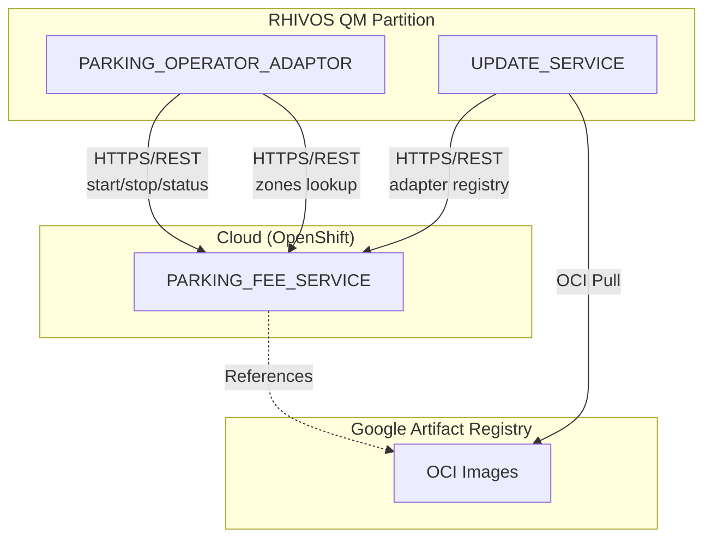
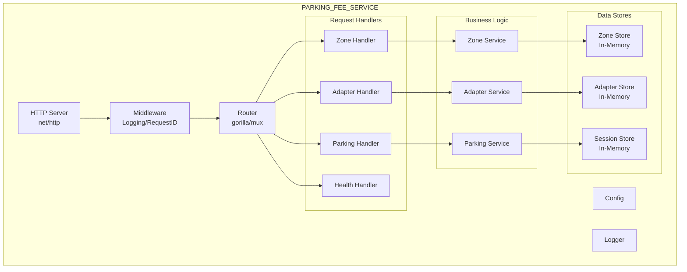

# Design Document: PARKING_FEE_SERVICE

## Overview

The PARKING_FEE_SERVICE is a Go backend service deployed on OpenShift that provides REST APIs for parking operations. It serves as the backend for the SDV Parking Demo System, providing zone lookup by location, adapter registry information, and mock parking operator functionality.

The service is stateless except for in-memory session storage (demo scope), making it horizontally scalable. It exposes RESTful endpoints consumed by the PARKING_OPERATOR_ADAPTOR (for parking operations) and UPDATE_SERVICE (for adapter registry queries).

## Architecture

### Component Context



### Internal Architecture



### Request Flow: Zone Lookup

1. **Request Reception**: HTTP server receives GET /api/v1/zones?lat=X&lng=Y
2. **Middleware**: Request ID generated, logging middleware records request
3. **Routing**: Router dispatches to Zone Handler
4. **Validation**: Handler validates lat/lng parameters
5. **Lookup**: Zone Service searches for zone containing the coordinates
6. **Response**: Handler returns zone details or 404 if not found

### Request Flow: Parking Session Start

1. **Request Reception**: HTTP server receives POST /api/v1/parking/start
2. **Middleware**: Request ID generated, body parsed
3. **Routing**: Router dispatches to Parking Handler
4. **Validation**: Handler validates required fields
5. **Session Creation**: Parking Service creates session with unique ID
6. **Storage**: Session stored in memory
7. **Response**: Handler returns session details

## Components and Interfaces

### REST API Endpoints

#### Zone Lookup

```
GET /api/v1/zones?lat={latitude}&lng={longitude}

Response 200:
{
  "zone_id": "demo-zone-001",
  "operator_name": "Demo Parking Operator",
  "hourly_rate": 2.50,
  "currency": "USD",
  "adapter_image_ref": "us-docker.pkg.dev/project/repo/demo-operator:v1.0.0",
  "adapter_checksum": "sha256:abc123..."
}

Response 400:
{
  "error": "INVALID_PARAMETERS",
  "message": "lat and lng query parameters are required",
  "request_id": "req-123"
}

Response 404:
{
  "error": "ZONE_NOT_FOUND",
  "message": "No parking zone found for location",
  "request_id": "req-123"
}
```

#### Adapter Registry

```
GET /api/v1/adapters

Response 200:
{
  "adapters": [
    {
      "adapter_id": "demo-operator",
      "operator_name": "Demo Parking Operator",
      "version": "1.0.0",
      "image_ref": "us-docker.pkg.dev/project/repo/demo-operator:v1.0.0"
    }
  ]
}

GET /api/v1/adapters/{adapter_id}

Response 200:
{
  "adapter_id": "demo-operator",
  "operator_name": "Demo Parking Operator",
  "version": "1.0.0",
  "image_ref": "us-docker.pkg.dev/project/repo/demo-operator:v1.0.0",
  "checksum": "sha256:abc123...",
  "created_at": "2024-01-15T10:30:00Z"
}

Response 404:
{
  "error": "ADAPTER_NOT_FOUND",
  "message": "Adapter not found: unknown-adapter",
  "request_id": "req-123"
}
```

#### Mock Parking Operator

```
POST /api/v1/parking/start

Request:
{
  "vehicle_id": "demo-vehicle-001",
  "latitude": 37.7749,
  "longitude": -122.4194,
  "zone_id": "demo-zone-001",
  "timestamp": "2024-01-15T10:30:00Z"
}

Response 200:
{
  "session_id": "sess-abc123",
  "zone_id": "demo-zone-001",
  "hourly_rate": 2.50,
  "start_time": "2024-01-15T10:30:00Z"
}

Response 400:
{
  "error": "VALIDATION_ERROR",
  "message": "vehicle_id is required",
  "request_id": "req-123"
}

POST /api/v1/parking/stop

Request:
{
  "session_id": "sess-abc123",
  "timestamp": "2024-01-15T11:30:00Z"
}

Response 200:
{
  "session_id": "sess-abc123",
  "start_time": "2024-01-15T10:30:00Z",
  "end_time": "2024-01-15T11:30:00Z",
  "duration_seconds": 3600,
  "total_cost": 2.50,
  "payment_status": "success"
}

Response 404:
{
  "error": "SESSION_NOT_FOUND",
  "message": "Session not found: sess-unknown",
  "request_id": "req-123"
}

Response 409:
{
  "error": "SESSION_ALREADY_STOPPED",
  "message": "Session already stopped",
  "request_id": "req-123"
}

GET /api/v1/parking/status/{session_id}

Response 200:
{
  "session_id": "sess-abc123",
  "state": "active",
  "start_time": "2024-01-15T10:30:00Z",
  "duration_seconds": 1800,
  "current_cost": 1.25,
  "zone_id": "demo-zone-001"
}
```

#### Health Endpoints

```
GET /health

Response 200:
{
  "status": "healthy",
  "service": "parking-fee-service",
  "timestamp": "2024-01-15T10:30:00Z"
}

GET /ready

Response 200:
{
  "status": "ready"
}

Response 503:
{
  "status": "not ready",
  "reason": "session store not initialized"
}
```

### Internal Components

#### ZoneHandler

Handles zone lookup requests.

```go
type ZoneHandler struct {
    zoneService *ZoneService
    logger      *slog.Logger
}

func NewZoneHandler(zoneService *ZoneService, logger *slog.Logger) *ZoneHandler

// HandleGetZone handles GET /api/v1/zones?lat=X&lng=Y
func (h *ZoneHandler) HandleGetZone(w http.ResponseWriter, r *http.Request)
```

#### AdapterHandler

Handles adapter registry requests.

```go
type AdapterHandler struct {
    adapterService *AdapterService
    logger         *slog.Logger
}

func NewAdapterHandler(adapterService *AdapterService, logger *slog.Logger) *AdapterHandler

// HandleListAdapters handles GET /api/v1/adapters
func (h *AdapterHandler) HandleListAdapters(w http.ResponseWriter, r *http.Request)

// HandleGetAdapter handles GET /api/v1/adapters/{adapter_id}
func (h *AdapterHandler) HandleGetAdapter(w http.ResponseWriter, r *http.Request)
```

#### ParkingHandler

Handles mock parking operator requests.

```go
type ParkingHandler struct {
    parkingService *ParkingService
    logger         *slog.Logger
}

func NewParkingHandler(parkingService *ParkingService, logger *slog.Logger) *ParkingHandler

// HandleStartSession handles POST /api/v1/parking/start
func (h *ParkingHandler) HandleStartSession(w http.ResponseWriter, r *http.Request)

// HandleStopSession handles POST /api/v1/parking/stop
func (h *ParkingHandler) HandleStopSession(w http.ResponseWriter, r *http.Request)

// HandleGetStatus handles GET /api/v1/parking/status/{session_id}
func (h *ParkingHandler) HandleGetStatus(w http.ResponseWriter, r *http.Request)
```

#### HealthHandler

Handles health and readiness checks.

```go
type HealthHandler struct {
    sessionStore *SessionStore
    logger       *slog.Logger
}

func NewHealthHandler(sessionStore *SessionStore, logger *slog.Logger) *HealthHandler

// HandleHealth handles GET /health
func (h *HealthHandler) HandleHealth(w http.ResponseWriter, r *http.Request)

// HandleReady handles GET /ready
func (h *HealthHandler) HandleReady(w http.ResponseWriter, r *http.Request)
```

#### ZoneService

Business logic for zone operations.

```go
type ZoneService struct {
    store *ZoneStore
}

func NewZoneService(store *ZoneStore) *ZoneService

// FindZoneByLocation finds the zone containing the given coordinates
// Returns nil if no zone contains the location
func (s *ZoneService) FindZoneByLocation(lat, lng float64) *Zone
```

#### AdapterService

Business logic for adapter registry operations.

```go
type AdapterService struct {
    store *AdapterStore
}

func NewAdapterService(store *AdapterStore) *AdapterService

// ListAdapters returns all registered adapters sorted by operator name
func (s *AdapterService) ListAdapters() []AdapterSummary

// GetAdapter returns adapter details by ID
// Returns nil if adapter not found
func (s *AdapterService) GetAdapter(adapterID string) *Adapter
```

#### ParkingService

Business logic for mock parking operations.

```go
type ParkingService struct {
    store      *SessionStore
    zoneStore  *ZoneStore
    hourlyRate float64
    mu         sync.RWMutex
}

func NewParkingService(store *SessionStore, zoneStore *ZoneStore, hourlyRate float64) *ParkingService

// StartSession creates a new parking session
// Returns error if validation fails
func (s *ParkingService) StartSession(req *StartSessionRequest) (*Session, error)

// StopSession ends an active parking session
// Returns error if session not found or already stopped
func (s *ParkingService) StopSession(req *StopSessionRequest) (*Session, error)

// GetSessionStatus returns current session status
// Returns nil if session not found
func (s *ParkingService) GetSessionStatus(sessionID string) *SessionStatus

// CalculateCost calculates cost based on duration and hourly rate
func (s *ParkingService) CalculateCost(durationSeconds int64) float64
```

#### ZoneStore

In-memory storage for zone data.

```go
type ZoneStore struct {
    zones []Zone
    mu    sync.RWMutex
}

func NewZoneStore(zones []Zone) *ZoneStore

// FindByLocation returns the zone containing the coordinates
func (s *ZoneStore) FindByLocation(lat, lng float64) *Zone

// ContainsPoint checks if a zone contains the given coordinates
func (z *Zone) ContainsPoint(lat, lng float64) bool
```

#### AdapterStore

In-memory storage for adapter registry.

```go
type AdapterStore struct {
    adapters map[string]Adapter
    mu       sync.RWMutex
}

func NewAdapterStore(adapters []Adapter) *AdapterStore

// List returns all adapters
func (s *AdapterStore) List() []Adapter

// Get returns adapter by ID
func (s *AdapterStore) Get(adapterID string) *Adapter
```

#### SessionStore

In-memory storage for parking sessions.

```go
type SessionStore struct {
    sessions map[string]*Session
    mu       sync.RWMutex
}

func NewSessionStore() *SessionStore

// Save stores a session
func (s *SessionStore) Save(session *Session) error

// Get retrieves a session by ID
func (s *SessionStore) Get(sessionID string) *Session

// IsInitialized returns true if store is ready
func (s *SessionStore) IsInitialized() bool
```

#### Middleware

Request middleware for logging and request ID.

```go
// RequestIDMiddleware adds a unique request ID to each request
func RequestIDMiddleware(next http.Handler) http.Handler

// LoggingMiddleware logs request details and duration
func LoggingMiddleware(logger *slog.Logger) func(http.Handler) http.Handler

// GetRequestID extracts request ID from context
func GetRequestID(ctx context.Context) string
```

## Data Models

### Zone

```go
type Zone struct {
    ZoneID         string  `json:"zone_id"`
    OperatorName   string  `json:"operator_name"`
    HourlyRate     float64 `json:"hourly_rate"`
    Currency       string  `json:"currency"`
    AdapterImageRef string `json:"adapter_image_ref"`
    AdapterChecksum string `json:"adapter_checksum"`
    Bounds         Bounds  `json:"bounds"`
}

type Bounds struct {
    MinLat float64 `json:"min_lat"`
    MaxLat float64 `json:"max_lat"`
    MinLng float64 `json:"min_lng"`
    MaxLng float64 `json:"max_lng"`
}

// ContainsPoint checks if coordinates are within bounds
func (b *Bounds) ContainsPoint(lat, lng float64) bool {
    return lat >= b.MinLat && lat <= b.MaxLat &&
           lng >= b.MinLng && lng <= b.MaxLng
}
```

### Adapter

```go
type Adapter struct {
    AdapterID    string    `json:"adapter_id"`
    OperatorName string    `json:"operator_name"`
    Version      string    `json:"version"`
    ImageRef     string    `json:"image_ref"`
    Checksum     string    `json:"checksum"`
    CreatedAt    time.Time `json:"created_at"`
}

type AdapterSummary struct {
    AdapterID    string `json:"adapter_id"`
    OperatorName string `json:"operator_name"`
    Version      string `json:"version"`
    ImageRef     string `json:"image_ref"`
}
```

### Session

```go
type Session struct {
    SessionID       string     `json:"session_id"`
    VehicleID       string     `json:"vehicle_id"`
    ZoneID          string     `json:"zone_id"`
    Latitude        float64    `json:"latitude"`
    Longitude       float64    `json:"longitude"`
    StartTime       time.Time  `json:"start_time"`
    EndTime         *time.Time `json:"end_time,omitempty"`
    HourlyRate      float64    `json:"hourly_rate"`
    State           string     `json:"state"` // "active" or "stopped"
    TotalCost       *float64   `json:"total_cost,omitempty"`
    PaymentStatus   *string    `json:"payment_status,omitempty"`
}

type SessionStatus struct {
    SessionID       string  `json:"session_id"`
    State           string  `json:"state"`
    StartTime       string  `json:"start_time"`
    DurationSeconds int64   `json:"duration_seconds"`
    CurrentCost     float64 `json:"current_cost"`
    ZoneID          string  `json:"zone_id"`
}
```

### Request/Response Models

```go
// Zone lookup response
type ZoneResponse struct {
    ZoneID          string  `json:"zone_id"`
    OperatorName    string  `json:"operator_name"`
    HourlyRate      float64 `json:"hourly_rate"`
    Currency        string  `json:"currency"`
    AdapterImageRef string  `json:"adapter_image_ref"`
    AdapterChecksum string  `json:"adapter_checksum"`
}

// Adapter list response
type AdapterListResponse struct {
    Adapters []AdapterSummary `json:"adapters"`
}

// Start session request
type StartSessionRequest struct {
    VehicleID string  `json:"vehicle_id"`
    Latitude  float64 `json:"latitude"`
    Longitude float64 `json:"longitude"`
    ZoneID    string  `json:"zone_id"`
    Timestamp string  `json:"timestamp"`
}

// Start session response
type StartSessionResponse struct {
    SessionID  string  `json:"session_id"`
    ZoneID     string  `json:"zone_id"`
    HourlyRate float64 `json:"hourly_rate"`
    StartTime  string  `json:"start_time"`
}

// Stop session request
type StopSessionRequest struct {
    SessionID string `json:"session_id"`
    Timestamp string `json:"timestamp"`
}

// Stop session response
type StopSessionResponse struct {
    SessionID       string  `json:"session_id"`
    StartTime       string  `json:"start_time"`
    EndTime         string  `json:"end_time"`
    DurationSeconds int64   `json:"duration_seconds"`
    TotalCost       float64 `json:"total_cost"`
    PaymentStatus   string  `json:"payment_status"`
}

// Error response
type ErrorResponse struct {
    Error     string `json:"error"`
    Message   string `json:"message"`
    RequestID string `json:"request_id"`
}

// Health response
type HealthResponse struct {
    Status    string `json:"status"`
    Service   string `json:"service"`
    Timestamp string `json:"timestamp"`
}

// Ready response
type ReadyResponse struct {
    Status string `json:"status"`
    Reason string `json:"reason,omitempty"`
}
```

### Configuration

```go
type Config struct {
    // Server configuration
    Port int `env:"PORT" envDefault:"8080"`
    
    // Demo zone configuration
    DemoZoneID         string  `env:"DEMO_ZONE_ID" envDefault:"demo-zone-001"`
    DemoOperatorName   string  `env:"DEMO_OPERATOR_NAME" envDefault:"Demo Parking Operator"`
    DemoZoneMinLat     float64 `env:"DEMO_ZONE_MIN_LAT" envDefault:"37.0"`
    DemoZoneMaxLat     float64 `env:"DEMO_ZONE_MAX_LAT" envDefault:"38.0"`
    DemoZoneMinLng     float64 `env:"DEMO_ZONE_MIN_LNG" envDefault:"-123.0"`
    DemoZoneMaxLng     float64 `env:"DEMO_ZONE_MAX_LNG" envDefault:"-122.0"`
    DemoHourlyRate     float64 `env:"DEMO_HOURLY_RATE" envDefault:"2.50"`
    DemoCurrency       string  `env:"DEMO_CURRENCY" envDefault:"USD"`
    
    // Demo adapter configuration
    DemoAdapterID       string `env:"DEMO_ADAPTER_ID" envDefault:"demo-operator"`
    DemoAdapterVersion  string `env:"DEMO_ADAPTER_VERSION" envDefault:"1.0.0"`
    DemoAdapterImageRef string `env:"DEMO_ADAPTER_IMAGE_REF" envDefault:"us-docker.pkg.dev/sdv-demo/adapters/demo-operator:v1.0.0"`
    DemoAdapterChecksum string `env:"DEMO_ADAPTER_CHECKSUM" envDefault:"sha256:0000000000000000000000000000000000000000000000000000000000000000"`
    
    // Logging
    LogLevel string `env:"LOG_LEVEL" envDefault:"info"`
}

func LoadConfig() (*Config, error)
```

### Error Codes

```go
const (
    ErrInvalidParameters    = "INVALID_PARAMETERS"
    ErrZoneNotFound         = "ZONE_NOT_FOUND"
    ErrAdapterNotFound      = "ADAPTER_NOT_FOUND"
    ErrSessionNotFound      = "SESSION_NOT_FOUND"
    ErrSessionAlreadyStopped = "SESSION_ALREADY_STOPPED"
    ErrValidationError      = "VALIDATION_ERROR"
    ErrInternalError        = "INTERNAL_ERROR"
)
```


## Correctness Properties

*A property is a characteristic or behavior that should hold true across all valid executions of a system—essentially, a formal statement about what the system should do. Properties serve as the bridge between human-readable specifications and machine-verifiable correctness guarantees.*

Based on the prework analysis, the following properties can be verified through property-based testing:

### Property 1: Zone Containment

*For any* latitude and longitude coordinates, if the coordinates are within the bounds of a configured zone, the zone lookup SHALL return that zone. If the coordinates are outside all configured zone bounds, the lookup SHALL return HTTP 404.

**Validates: Requirements 1.1, 1.3, 1.4**

### Property 2: Zone Response Completeness

*For any* successful zone lookup, the response SHALL include all required fields: zone_id, operator_name, hourly_rate, currency, adapter_image_ref, and adapter_checksum. No field SHALL be empty or null.

**Validates: Requirements 1.2**

### Property 3: Invalid Coordinate Validation

*For any* latitude value outside [-90, 90] or longitude value outside [-180, 180], the zone lookup SHALL return HTTP 400 with a validation error message.

**Validates: Requirements 1.6**

### Property 4: Adapter List Completeness and Sorting

*For any* adapter list response, each adapter entry SHALL include adapter_id, operator_name, version, and image_ref. The list SHALL be sorted alphabetically by operator_name.

**Validates: Requirements 2.2, 2.4**

### Property 5: Adapter Details Retrieval

*For any* valid adapter_id in the registry, the adapter details endpoint SHALL return the complete adapter information including adapter_id, operator_name, version, image_ref, checksum, and created_at.

**Validates: Requirements 3.1, 3.2**

### Property 6: Adapter Not Found

*For any* adapter_id that does not exist in the registry, the adapter details endpoint SHALL return HTTP 404 with an error message.

**Validates: Requirements 3.3**

### Property 7: Checksum Format Validation

*For any* adapter in the registry, the checksum field SHALL be a valid SHA256 digest in the format "sha256:" followed by exactly 64 hexadecimal characters.

**Validates: Requirements 3.4**

### Property 8: Session Creation Round-Trip

*For any* valid start session request, the service SHALL create a session with a unique session_id, store it in memory, and the session SHALL be retrievable by that session_id via the status endpoint.

**Validates: Requirements 4.1, 4.3, 4.4, 4.5**

### Property 9: Session Stop Response Completeness

*For any* active session that is stopped, the stop response SHALL include session_id, start_time, end_time, duration_seconds, total_cost, and payment_status. The end_time SHALL be after start_time.

**Validates: Requirements 5.1, 5.3**

### Property 10: Cost Calculation Correctness

*For any* parking session with a known duration and hourly rate, the calculated cost SHALL equal (duration_seconds / 3600) * hourly_rate, rounded to 2 decimal places.

**Validates: Requirements 5.4, 6.3**

### Property 11: Mock Payment Always Succeeds

*For any* stopped parking session, the payment_status SHALL always be "success".

**Validates: Requirements 5.5**

### Property 12: Session Not Found

*For any* session_id that does not exist, both the stop endpoint and status endpoint SHALL return HTTP 404 with an error message.

**Validates: Requirements 5.6, 6.5**

### Property 13: Session Already Stopped

*For any* session that has already been stopped, attempting to stop it again SHALL return HTTP 409 with an error message indicating the session is already stopped.

**Validates: Requirements 5.7**

### Property 14: Session Status Consistency

*For any* existing session, the status response SHALL include session_id, state, start_time, duration_seconds, current_cost, and zone_id. The state SHALL be "active" for ongoing sessions and "stopped" for ended sessions.

**Validates: Requirements 6.1, 6.2, 6.4**

### Property 15: Error Response Format Consistency

*For any* error response from the service, the response body SHALL include "error" and "message" fields, and SHALL include a "request_id" field for tracing.

**Validates: Requirements 11.1, 11.3**

## Error Handling

### HTTP Status Code Mapping

| Error Scenario | HTTP Status | Error Code |
|----------------|-------------|------------|
| Missing lat/lng parameters | 400 | INVALID_PARAMETERS |
| Invalid lat/lng values | 400 | INVALID_PARAMETERS |
| Missing required fields | 400 | VALIDATION_ERROR |
| Zone not found | 404 | ZONE_NOT_FOUND |
| Adapter not found | 404 | ADAPTER_NOT_FOUND |
| Session not found | 404 | SESSION_NOT_FOUND |
| Session already stopped | 409 | SESSION_ALREADY_STOPPED |
| Internal server error | 500 | INTERNAL_ERROR |

### Error Response Helper

```go
func WriteError(w http.ResponseWriter, r *http.Request, status int, code, message string) {
    w.Header().Set("Content-Type", "application/json")
    w.WriteHeader(status)
    
    response := ErrorResponse{
        Error:     code,
        Message:   message,
        RequestID: GetRequestID(r.Context()),
    }
    
    json.NewEncoder(w).Encode(response)
}

// Predefined error responses
func WriteValidationError(w http.ResponseWriter, r *http.Request, message string) {
    WriteError(w, r, http.StatusBadRequest, ErrValidationError, message)
}

func WriteNotFound(w http.ResponseWriter, r *http.Request, code, message string) {
    WriteError(w, r, http.StatusNotFound, code, message)
}

func WriteConflict(w http.ResponseWriter, r *http.Request, code, message string) {
    WriteError(w, r, http.StatusConflict, code, message)
}
```

### Input Validation

```go
func ValidateCoordinates(lat, lng float64) error {
    if lat < -90 || lat > 90 {
        return fmt.Errorf("latitude must be between -90 and 90, got %f", lat)
    }
    if lng < -180 || lng > 180 {
        return fmt.Errorf("longitude must be between -180 and 180, got %f", lng)
    }
    return nil
}

func ValidateStartSessionRequest(req *StartSessionRequest) error {
    if req.VehicleID == "" {
        return fmt.Errorf("vehicle_id is required")
    }
    if req.ZoneID == "" {
        return fmt.Errorf("zone_id is required")
    }
    if req.Timestamp == "" {
        return fmt.Errorf("timestamp is required")
    }
    return ValidateCoordinates(req.Latitude, req.Longitude)
}

func ValidateStopSessionRequest(req *StopSessionRequest) error {
    if req.SessionID == "" {
        return fmt.Errorf("session_id is required")
    }
    if req.Timestamp == "" {
        return fmt.Errorf("timestamp is required")
    }
    return nil
}
```

## Testing Strategy

### Dual Testing Approach

The PARKING_FEE_SERVICE uses both unit tests and property-based tests:

- **Unit tests**: Verify specific examples, edge cases, and error conditions
- **Property tests**: Verify universal properties across all inputs

### Property-Based Testing

Property-based tests use the `gopter` library for Go. Each property test:
- Runs minimum 100 iterations
- References the design document property
- Uses tag format: **Feature: parking-fee-service, Property {number}: {property_text}**

### Test Organization

```
backend/parking-fee-service/
├── cmd/
│   └── server/
│       └── main.go
├── internal/
│   ├── config/
│   │   └── config.go
│   ├── handler/
│   │   ├── zone.go
│   │   ├── adapter.go
│   │   ├── parking.go
│   │   └── health.go
│   ├── service/
│   │   ├── zone.go
│   │   ├── adapter.go
│   │   └── parking.go
│   ├── store/
│   │   ├── zone.go
│   │   ├── adapter.go
│   │   └── session.go
│   ├── model/
│   │   └── models.go
│   └── middleware/
│       └── middleware.go
└── tests/
    ├── unit/
    │   ├── zone_test.go
    │   ├── adapter_test.go
    │   ├── parking_test.go
    │   └── validation_test.go
    └── property/
        ├── zone_properties_test.go      # Properties 1, 2, 3
        ├── adapter_properties_test.go   # Properties 4, 5, 6, 7
        ├── parking_properties_test.go   # Properties 8, 9, 10, 11, 12, 13, 14
        └── error_properties_test.go     # Property 15
```

### Property Test Examples

```go
// Property 1: Zone Containment
func TestZoneContainment(t *testing.T) {
    // Feature: parking-fee-service, Property 1: Zone Containment
    parameters := gopter.DefaultTestParameters()
    parameters.MinSuccessfulTests = 100
    
    properties := gopter.NewProperties(parameters)
    
    store := NewZoneStore([]Zone{testDemoZone})
    service := NewZoneService(store)
    
    properties.Property("coordinates within bounds return zone", prop.ForAll(
        func(lat, lng float64) bool {
            zone := service.FindZoneByLocation(lat, lng)
            if testDemoZone.Bounds.ContainsPoint(lat, lng) {
                return zone != nil && zone.ZoneID == testDemoZone.ZoneID
            }
            return zone == nil
        },
        gen.Float64Range(-90, 90),
        gen.Float64Range(-180, 180),
    ))
    
    properties.TestingRun(t)
}

// Property 8: Session Creation Round-Trip
func TestSessionCreationRoundTrip(t *testing.T) {
    // Feature: parking-fee-service, Property 8: Session Creation Round-Trip
    parameters := gopter.DefaultTestParameters()
    parameters.MinSuccessfulTests = 100
    
    properties := gopter.NewProperties(parameters)
    
    properties.Property("created session is retrievable", prop.ForAll(
        func(vehicleID, zoneID string, lat, lng float64) bool {
            store := NewSessionStore()
            service := NewParkingService(store, nil, 2.50)
            
            req := &StartSessionRequest{
                VehicleID: vehicleID,
                Latitude:  lat,
                Longitude: lng,
                ZoneID:    zoneID,
                Timestamp: time.Now().Format(time.RFC3339),
            }
            
            session, err := service.StartSession(req)
            if err != nil {
                return false
            }
            
            status := service.GetSessionStatus(session.SessionID)
            return status != nil && status.SessionID == session.SessionID
        },
        gen.AlphaString().SuchThat(func(s string) bool { return len(s) > 0 }),
        gen.AlphaString().SuchThat(func(s string) bool { return len(s) > 0 }),
        gen.Float64Range(-90, 90),
        gen.Float64Range(-180, 180),
    ))
    
    properties.TestingRun(t)
}

// Property 10: Cost Calculation Correctness
func TestCostCalculation(t *testing.T) {
    // Feature: parking-fee-service, Property 10: Cost Calculation Correctness
    parameters := gopter.DefaultTestParameters()
    parameters.MinSuccessfulTests = 100
    
    properties := gopter.NewProperties(parameters)
    
    properties.Property("cost equals duration * rate / 3600", prop.ForAll(
        func(durationSeconds int64, hourlyRate float64) bool {
            service := NewParkingService(nil, nil, hourlyRate)
            
            calculatedCost := service.CalculateCost(durationSeconds)
            expectedCost := math.Round((float64(durationSeconds)/3600.0)*hourlyRate*100) / 100
            
            return math.Abs(calculatedCost-expectedCost) < 0.01
        },
        gen.Int64Range(0, 86400),      // 0 to 24 hours
        gen.Float64Range(0.5, 50.0),   // reasonable hourly rates
    ))
    
    properties.TestingRun(t)
}

// Property 15: Error Response Format Consistency
func TestErrorResponseFormat(t *testing.T) {
    // Feature: parking-fee-service, Property 15: Error Response Format Consistency
    parameters := gopter.DefaultTestParameters()
    parameters.MinSuccessfulTests = 100
    
    properties := gopter.NewProperties(parameters)
    
    properties.Property("error responses have required fields", prop.ForAll(
        func(code, message, requestID string) bool {
            response := ErrorResponse{
                Error:     code,
                Message:   message,
                RequestID: requestID,
            }
            
            data, err := json.Marshal(response)
            if err != nil {
                return false
            }
            
            var parsed map[string]interface{}
            if err := json.Unmarshal(data, &parsed); err != nil {
                return false
            }
            
            _, hasError := parsed["error"]
            _, hasMessage := parsed["message"]
            _, hasRequestID := parsed["request_id"]
            
            return hasError && hasMessage && hasRequestID
        },
        gen.AlphaString(),
        gen.AlphaString(),
        gen.AlphaString(),
    ))
    
    properties.TestingRun(t)
}
```

### Unit Test Examples

```go
// Edge case: Missing lat/lng parameters
func TestZoneLookupMissingParameters(t *testing.T) {
    handler := NewZoneHandler(zoneService, logger)
    
    // Missing both
    req := httptest.NewRequest("GET", "/api/v1/zones", nil)
    rec := httptest.NewRecorder()
    handler.HandleGetZone(rec, req)
    assert.Equal(t, http.StatusBadRequest, rec.Code)
    
    // Missing lng
    req = httptest.NewRequest("GET", "/api/v1/zones?lat=37.5", nil)
    rec = httptest.NewRecorder()
    handler.HandleGetZone(rec, req)
    assert.Equal(t, http.StatusBadRequest, rec.Code)
}

// Edge case: Empty adapter list
func TestAdapterListEmpty(t *testing.T) {
    store := NewAdapterStore([]Adapter{})
    service := NewAdapterService(store)
    handler := NewAdapterHandler(service, logger)
    
    req := httptest.NewRequest("GET", "/api/v1/adapters", nil)
    rec := httptest.NewRecorder()
    handler.HandleListAdapters(rec, req)
    
    assert.Equal(t, http.StatusOK, rec.Code)
    
    var response AdapterListResponse
    json.Unmarshal(rec.Body.Bytes(), &response)
    assert.Empty(t, response.Adapters)
}

// Health endpoint example
func TestHealthEndpoint(t *testing.T) {
    handler := NewHealthHandler(sessionStore, logger)
    
    req := httptest.NewRequest("GET", "/health", nil)
    rec := httptest.NewRecorder()
    handler.HandleHealth(rec, req)
    
    assert.Equal(t, http.StatusOK, rec.Code)
    
    var response HealthResponse
    json.Unmarshal(rec.Body.Bytes(), &response)
    assert.Equal(t, "healthy", response.Status)
    assert.Equal(t, "parking-fee-service", response.Service)
    assert.NotEmpty(t, response.Timestamp)
}
```
