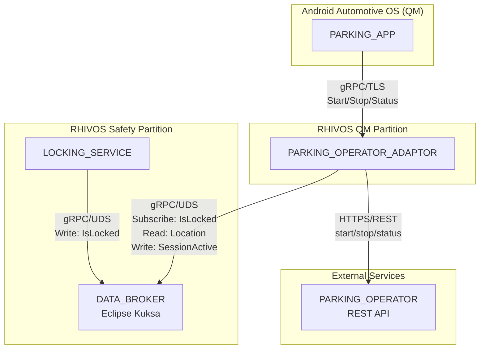
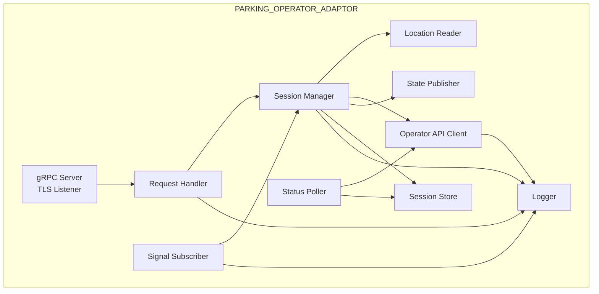
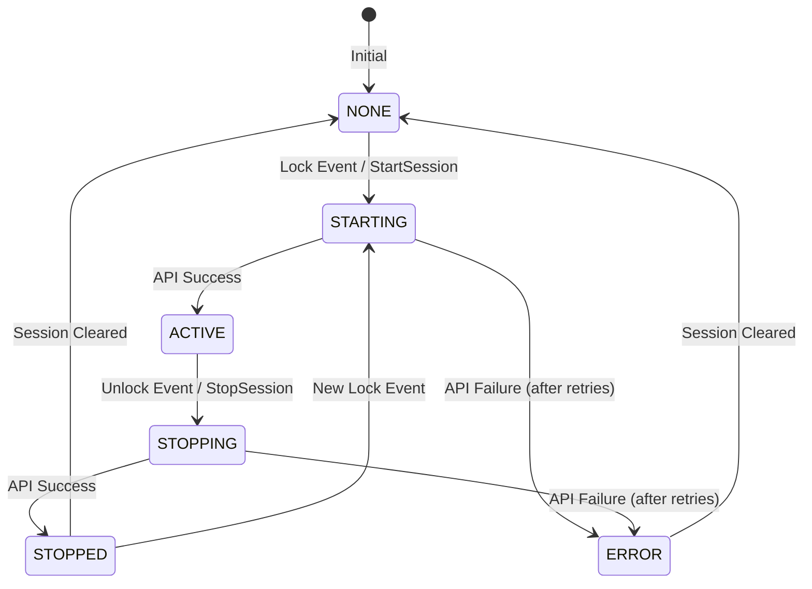

# Design Document: PARKING_OPERATOR_ADAPTOR

## Overview

The PARKING_OPERATOR_ADAPTOR is a containerized Rust service running in the RHIVOS QM partition that manages parking sessions automatically based on vehicle lock state. It subscribes to lock/unlock events from the DATA_BROKER, communicates with external parking operators via REST API, and provides session status to the PARKING_APP via gRPC.

The service implements the ParkingAdaptor gRPC interface for manual session control and status queries, while also reacting to VSS signal changes to automate the parking workflow. When the vehicle locks, a parking session starts; when it unlocks, the session ends and payment is processed (mock for demo).

## Architecture

### Component Context



### Internal Architecture



### Request Flow: Automatic Session Start (Lock Event)

1. **Signal Reception**: Signal Subscriber receives IsLocked=true from DATA_BROKER
2. **State Check**: Session Manager verifies no active session exists
3. **Location Read**: Location Reader fetches current latitude/longitude from DATA_BROKER
4. **Zone Lookup**: PARKING_APP queries PARKING_FEE_SERVICE for Zone_ID based on location
5. **API Call**: Operator API Client calls POST /parking/start with zone_id from PARKING_APP
6. **Session Creation**: Session Manager creates session with Session_ID from response
7. **State Publication**: State Publisher writes SessionActive=true to DATA_BROKER
8. **Persistence**: Session Store persists session state

### Request Flow: Manual Session Start (gRPC)

1. **Request Reception**: gRPC server receives StartSession request via TLS
2. **State Check**: Session Manager verifies no active session exists
3. **Location Read**: Location Reader fetches current latitude/longitude
4. **API Call**: Operator API Client calls POST /parking/start with retry
5. **Session Creation**: Session Manager creates session entry
6. **State Publication**: State Publisher writes SessionActive=true
7. **Response**: Return StartSessionResponse with session details

## Components and Interfaces

### gRPC Service Definition

The service implements the interface defined in `proto/services/parking_adaptor.proto`:

```protobuf
syntax = "proto3";
package sdv.services.parking;

service ParkingAdaptor {
  rpc StartSession(StartSessionRequest) returns (StartSessionResponse);
  rpc StopSession(StopSessionRequest) returns (StopSessionResponse);
  rpc GetSessionStatus(GetSessionStatusRequest) returns (GetSessionStatusResponse);
}

enum SessionState {
  SESSION_STATE_NONE = 0;
  SESSION_STATE_STARTING = 1;
  SESSION_STATE_ACTIVE = 2;
  SESSION_STATE_STOPPING = 3;
  SESSION_STATE_STOPPED = 4;
  SESSION_STATE_ERROR = 5;
}

message StartSessionRequest {
  string zone_id = 1;  // Zone_ID provided by PARKING_APP (obtained from PARKING_FEE_SERVICE)
}

message StartSessionResponse {
  bool success = 1;
  string error_message = 2;
  string session_id = 3;
  SessionState state = 4;
}

message StopSessionRequest {
  // Empty - uses current active session
}

message StopSessionResponse {
  bool success = 1;
  string error_message = 2;
  string session_id = 3;
  SessionState state = 4;
  double final_cost = 5;
  int64 duration_seconds = 6;
}

message GetSessionStatusRequest {
  // Empty - returns current/last session
}

message GetSessionStatusResponse {
  bool has_active_session = 1;
  string session_id = 2;
  SessionState state = 3;
  int64 start_time_unix = 4;
  int64 duration_seconds = 5;
  double current_cost = 6;
  string zone_id = 7;
  string error_message = 8;
  double latitude = 9;
  double longitude = 10;
}
```

### PARKING_OPERATOR REST API

The adaptor communicates with the external parking operator via REST:

```
Base URL: Configurable (e.g., https://parking-operator.example.com/api/v1)

POST /parking/start
Request:
{
  "vehicle_id": "string",
  "latitude": number,
  "longitude": number,
  "zone_id": "string",
  "timestamp": "ISO8601"
}
Response:
{
  "session_id": "string",
  "zone_id": "string",
  "hourly_rate": number,
  "start_time": "ISO8601"
}

POST /parking/stop
Request:
{
  "session_id": "string",
  "timestamp": "ISO8601"
}
Response:
{
  "session_id": "string",
  "start_time": "ISO8601",
  "end_time": "ISO8601",
  "duration_seconds": number,
  "total_cost": number,
  "payment_status": "string"
}

GET /parking/status/{session_id}
Response:
{
  "session_id": "string",
  "state": "active" | "stopped",
  "start_time": "ISO8601",
  "duration_seconds": number,
  "current_cost": number,
  "zone_id": "string"
}
```

### Internal Components

#### ParkingAdaptorImpl

Main service implementation handling gRPC requests.

```rust
pub struct ParkingAdaptorImpl {
    session_manager: Arc<SessionManager>,
    config: ServiceConfig,
    logger: Logger,
}

impl ParkingAdaptorImpl {
    pub fn new(
        session_manager: Arc<SessionManager>,
        config: ServiceConfig,
    ) -> Self;
}
```

#### SignalSubscriber

Subscribes to DATA_BROKER signals and triggers session operations.

```rust
pub struct SignalSubscriber {
    data_broker_client: DataBrokerClient,
    session_manager: Arc<SessionManager>,
    reconnect_attempts: u32,
    reconnect_base_delay: Duration,
}

impl SignalSubscriber {
    /// Starts subscription to IsLocked signal
    /// Triggers session start on false→true transition
    /// Triggers session stop on true→false transition
    pub async fn start(&self) -> Result<(), SubscriptionError>;
    
    /// Handles reconnection with exponential backoff
    async fn reconnect(&self) -> Result<(), SubscriptionError>;
}
```

#### SessionManager

Manages session lifecycle and state transitions.

```rust
pub struct SessionManager {
    current_session: RwLock<Option<Session>>,
    location_reader: LocationReader,
    operator_client: OperatorApiClient,
    state_publisher: StatePublisher,
    session_store: SessionStore,
    operation_lock: Mutex<()>,
}

impl SessionManager {
    /// Starts a new parking session
    /// Returns error if session already active or starting
    pub async fn start_session(&self) -> Result<Session, SessionError>;
    
    /// Stops the current parking session
    /// Returns error if no active session or already stopping
    pub async fn stop_session(&self) -> Result<Session, SessionError>;
    
    /// Gets current session status
    pub async fn get_status(&self) -> SessionStatus;
    
    /// Checks if an operation is in progress
    pub fn is_operation_in_progress(&self) -> bool;
}
```

#### LocationReader

Reads vehicle location from DATA_BROKER.

```rust
pub struct LocationReader {
    data_broker_client: DataBrokerClient,
}

impl LocationReader {
    /// Reads current latitude and longitude
    /// Returns error if signals unavailable
    pub async fn read_location(&self) -> Result<Location, LocationError>;
}

#[derive(Debug, Clone)]
pub struct Location {
    pub latitude: f64,
    pub longitude: f64,
}
```

#### OperatorApiClient

Communicates with external PARKING_OPERATOR REST API.

```rust
pub struct OperatorApiClient {
    http_client: reqwest::Client,
    base_url: String,
    vehicle_id: String,
    max_retries: u32,
    base_delay: Duration,
    request_timeout: Duration,
}

impl OperatorApiClient {
    /// Calls POST /parking/start with retry logic
    pub async fn start_session(
        &self,
        location: &Location,
        zone_id: &str,
    ) -> Result<StartResponse, ApiError>;
    
    /// Calls POST /parking/stop with retry logic
    pub async fn stop_session(
        &self,
        session_id: &str,
    ) -> Result<StopResponse, ApiError>;
    
    /// Calls GET /parking/status/{session_id}
    pub async fn get_status(
        &self,
        session_id: &str,
    ) -> Result<StatusResponse, ApiError>;
}
```

#### StatePublisher

Publishes session state to DATA_BROKER.

```rust
pub struct StatePublisher {
    data_broker_client: DataBrokerClient,
}

impl StatePublisher {
    /// Publishes Vehicle.Parking.SessionActive signal
    pub async fn publish_session_active(
        &self,
        active: bool,
    ) -> Result<(), PublishError>;
}
```

#### StatusPoller

Periodically polls session status during active sessions.

```rust
pub struct StatusPoller {
    operator_client: Arc<OperatorApiClient>,
    session_store: Arc<SessionStore>,
    poll_interval: Duration,
}

impl StatusPoller {
    /// Starts background polling task
    /// Updates session cost periodically
    pub fn start(self: Arc<Self>) -> JoinHandle<()>;
}
```

#### SessionStore

Persists session state for recovery after restart.

```rust
pub struct SessionStore {
    storage_path: PathBuf,
}

impl SessionStore {
    /// Saves current session to disk
    pub async fn save(&self, session: &Session) -> Result<(), StoreError>;
    
    /// Loads session from disk (for restart recovery)
    pub async fn load(&self) -> Result<Option<Session>, StoreError>;
    
    /// Clears stored session
    pub async fn clear(&self) -> Result<(), StoreError>;
}
```

## Data Models

### Session

```rust
#[derive(Debug, Clone, Serialize, Deserialize)]
pub struct Session {
    pub session_id: String,
    pub state: SessionState,
    pub start_time: SystemTime,
    pub end_time: Option<SystemTime>,
    pub location: Location,
    pub zone_id: String,
    pub hourly_rate: f64,
    pub current_cost: f64,
    pub final_cost: Option<f64>,
    pub error_message: Option<String>,
    pub last_updated: SystemTime,
}

#[derive(Debug, Clone, Copy, PartialEq, Eq, Serialize, Deserialize)]
pub enum SessionState {
    None,
    Starting,
    Active,
    Stopping,
    Stopped,
    Error,
}

impl Session {
    pub fn duration(&self) -> Duration;
    pub fn is_active(&self) -> bool;
    pub fn is_in_progress(&self) -> bool;
}
```

### Session State Machine



### Configuration

```rust
#[derive(Debug, Clone)]
pub struct ServiceConfig {
    /// TCP address for gRPC server (e.g., "0.0.0.0:50053")
    pub listen_addr: String,
    /// TLS certificate path
    pub tls_cert_path: String,
    /// TLS key path  
    pub tls_key_path: String,
    /// DATA_BROKER UDS socket path
    pub data_broker_socket: String,
    /// PARKING_OPERATOR base URL
    pub operator_base_url: String,
    /// Vehicle identifier
    pub vehicle_id: String,
    /// Configurable hourly rate (demo)
    pub hourly_rate: f64,
    /// Max retries for API calls
    pub api_max_retries: u32,
    /// Base delay for exponential backoff (ms)
    pub api_base_delay_ms: u64,
    /// API request timeout (ms)
    pub api_timeout_ms: u64,
    /// DATA_BROKER reconnect attempts
    pub reconnect_max_attempts: u32,
    /// DATA_BROKER reconnect base delay (ms)
    pub reconnect_base_delay_ms: u64,
    /// Status poll interval (seconds)
    pub poll_interval_seconds: u64,
    /// Session storage path
    pub storage_path: String,
}

impl Default for ServiceConfig {
    fn default() -> Self {
        Self {
            listen_addr: "0.0.0.0:50053".to_string(),
            tls_cert_path: "/etc/rhivos/certs/parking-adaptor.crt".to_string(),
            tls_key_path: "/etc/rhivos/certs/parking-adaptor.key".to_string(),
            data_broker_socket: "/run/kuksa/databroker.sock".to_string(),
            operator_base_url: "http://localhost:8080/api/v1".to_string(),
            vehicle_id: "demo-vehicle-001".to_string(),
            hourly_rate: 2.50,
            api_max_retries: 3,
            api_base_delay_ms: 1000,
            api_timeout_ms: 10000,
            reconnect_max_attempts: 5,
            reconnect_base_delay_ms: 1000,
            poll_interval_seconds: 60,
            storage_path: "/var/lib/parking-adaptor/session.json".to_string(),
        }
    }
}
```

### Error Types

```rust
#[derive(Debug, thiserror::Error)]
pub enum ParkingError {
    #[error("Session already active: {0}")]
    SessionAlreadyActive(String),
    
    #[error("No active session")]
    NoActiveSession,
    
    #[error("Session operation in progress")]
    OperationInProgress,
    
    #[error("Location unavailable: {0}")]
    LocationUnavailable(String),
    
    #[error("Operator API error: {0}")]
    OperatorApiError(String),
    
    #[error("DATA_BROKER error: {0}")]
    DataBrokerError(String),
    
    #[error("DATA_BROKER connection lost")]
    DataBrokerConnectionLost,
    
    #[error("Session storage error: {0}")]
    StorageError(String),
    
    #[error("API timeout after {0}ms")]
    ApiTimeout(u64),
}

#[derive(Debug, thiserror::Error)]
pub enum ApiError {
    #[error("HTTP error: {status} - {message}")]
    HttpError { status: u16, message: String },
    
    #[error("Network error: {0}")]
    NetworkError(String),
    
    #[error("Timeout after {0}ms")]
    Timeout(u64),
    
    #[error("Invalid response: {0}")]
    InvalidResponse(String),
}
```

### VSS Signal Paths

| Signal | Path | Type | Access |
|--------|------|------|--------|
| Door Lock State | `Vehicle.Cabin.Door.Row1.DriverSide.IsLocked` | bool | Subscribe |
| Latitude | `Vehicle.CurrentLocation.Latitude` | float | Read |
| Longitude | `Vehicle.CurrentLocation.Longitude` | float | Read |
| Session Active | `Vehicle.Parking.SessionActive` | bool | Write |

### API Request/Response Models

```rust
#[derive(Debug, Serialize)]
pub struct StartRequest {
    pub vehicle_id: String,
    pub latitude: f64,
    pub longitude: f64,
    pub zone_id: String,
    pub timestamp: String,
}

#[derive(Debug, Deserialize)]
pub struct StartResponse {
    pub session_id: String,
    pub zone_id: String,
    pub hourly_rate: f64,
    pub start_time: String,
}

#[derive(Debug, Serialize)]
pub struct StopRequest {
    pub session_id: String,
    pub timestamp: String,
}

#[derive(Debug, Deserialize)]
pub struct StopResponse {
    pub session_id: String,
    pub start_time: String,
    pub end_time: String,
    pub duration_seconds: i64,
    pub total_cost: f64,
    pub payment_status: String,
}

#[derive(Debug, Deserialize)]
pub struct StatusResponse {
    pub session_id: String,
    pub state: String,
    pub start_time: String,
    pub duration_seconds: i64,
    pub current_cost: f64,
    pub zone_id: String,
}
```


## Correctness Properties

*A property is a characteristic or behavior that should hold true across all valid executions of a system—essentially, a formal statement about what the system should do. Properties serve as the bridge between human-readable specifications and machine-verifiable correctness guarantees.*

Based on the prework analysis, the following properties can be verified through property-based testing:

### Property 1: Lock Event Triggers Session Start

*For any* vehicle in an unlocked state with no active session, when the IsLocked signal transitions from false to true, the PARKING_OPERATOR_ADAPTOR SHALL initiate a parking session start and transition to STARTING state.

**Validates: Requirements 1.2**

### Property 2: Unlock Event Triggers Session Stop

*For any* vehicle with an active parking session, when the IsLocked signal transitions from true to false, the PARKING_OPERATOR_ADAPTOR SHALL initiate a parking session stop and transition to STOPPING state.

**Validates: Requirements 1.3**

### Property 3: Location Reading During Session Start

*For any* session start operation, the PARKING_OPERATOR_ADAPTOR SHALL read both latitude and longitude from the DATA_BROKER. If either signal is unavailable, the session start SHALL be rejected with an error indicating location is required.

**Validates: Requirements 2.1, 2.2, 2.3**

### Property 4: Session Start API Request Completeness

*For any* session start operation with valid location, the POST /parking/start request SHALL include vehicle_id, latitude, longitude, zone_id, and timestamp. Upon successful response, the Session_ID from the response SHALL be stored in the session.

**Validates: Requirements 3.1, 3.2, 3.3**

### Property 5: Session Stop API Request Completeness

*For any* session stop operation with an active session, the POST /parking/stop request SHALL include the Session_ID and timestamp. Upon successful response, the session SHALL be updated with final_cost and duration_seconds from the response.

**Validates: Requirements 4.1, 4.2, 4.3**

### Property 6: Session State Publication Consistency

*For any* successful session start, the PARKING_OPERATOR_ADAPTOR SHALL publish Vehicle.Parking.SessionActive = true to the DATA_BROKER. *For any* successful session stop, it SHALL publish Vehicle.Parking.SessionActive = false. The published state SHALL always match the session state.

**Validates: Requirements 3.4, 4.4**

### Property 7: API Retry with Exponential Backoff

*For any* PARKING_OPERATOR API call that fails due to network or server error, the PARKING_OPERATOR_ADAPTOR SHALL retry up to 3 times with exponential backoff. The delay between retries SHALL double after each attempt.

**Validates: Requirements 3.5, 4.5**

### Property 8: Error State After Retry Exhaustion

*For any* session operation where all API retries fail, the session state SHALL transition to ERROR with an error_message describing the failure. For stop operations, the session SHALL be preserved for manual resolution.

**Validates: Requirements 3.6, 4.6**

### Property 9: Status Response Completeness

*For any* GetSessionStatus request when a session exists, the response SHALL include session_id, state, start_time, duration, current_cost, zone_id, and error_message (if state is ERROR). All fields SHALL accurately reflect the current session state.

**Validates: Requirements 5.1, 5.2**

### Property 10: Manual Session Control Independence

*For any* StartSession gRPC request, the PARKING_OPERATOR_ADAPTOR SHALL initiate a session start regardless of the current lock state. *For any* StopSession gRPC request, it SHALL initiate a session stop regardless of the current lock state.

**Validates: Requirements 6.1, 6.2**

### Property 11: Invalid Operation Rejection

*For any* StartSession request when a session is already active or starting, the PARKING_OPERATOR_ADAPTOR SHALL return an error indicating a session is already in progress. *For any* StopSession request when no session is active, it SHALL return an error indicating no active session exists.

**Validates: Requirements 6.3, 6.4**

### Property 12: State Transition Timestamp Recording

*For any* session state change, the PARKING_OPERATOR_ADAPTOR SHALL update the last_updated timestamp. The timestamp SHALL reflect the time of the state transition, not the time of any subsequent query.

**Validates: Requirements 7.1, 7.2**

### Property 13: Session Persistence Round-Trip

*For any* session saved to persistent storage, loading that session SHALL produce an equivalent session object with all fields preserved (session_id, state, start_time, location, zone_id, current_cost, error_message).

**Validates: Requirements 7.3**

### Property 14: Concurrent Operation Prevention

*For any* session operation in progress (STARTING or STOPPING state), concurrent start or stop operations SHALL be rejected with an error indicating an operation is already in progress. Only one operation SHALL execute at a time.

**Validates: Requirements 7.5**

### Property 15: DATA_BROKER Reconnection with Backoff

*For any* DATA_BROKER connection loss, the PARKING_OPERATOR_ADAPTOR SHALL attempt to reconnect with exponential backoff. The delay between attempts SHALL increase, and after 5 failed attempts, the service SHALL enter a degraded state.

**Validates: Requirements 1.4, 1.5**

## Error Handling

### gRPC Status Code Mapping

| Error Scenario | gRPC Status Code | Error Code |
|----------------|------------------|------------|
| Session already active | ALREADY_EXISTS (6) | SESSION_ALREADY_ACTIVE |
| No active session | NOT_FOUND (5) | NO_ACTIVE_SESSION |
| Operation in progress | FAILED_PRECONDITION (9) | OPERATION_IN_PROGRESS |
| Location unavailable | FAILED_PRECONDITION (9) | LOCATION_UNAVAILABLE |
| Operator API error | UNAVAILABLE (14) | OPERATOR_API_ERROR |
| DATA_BROKER unavailable | UNAVAILABLE (14) | DATABROKER_UNAVAILABLE |
| API timeout | DEADLINE_EXCEEDED (4) | API_TIMEOUT |
| Storage error | INTERNAL (13) | STORAGE_ERROR |

### Error Response Structure

```rust
impl From<ParkingError> for tonic::Status {
    fn from(err: ParkingError) -> Self {
        match err {
            ParkingError::SessionAlreadyActive(id) => {
                Status::already_exists(format!("Session already active: {}", id))
            }
            ParkingError::NoActiveSession => {
                Status::not_found("No active session")
            }
            ParkingError::OperationInProgress => {
                Status::failed_precondition("Session operation already in progress")
            }
            ParkingError::LocationUnavailable(msg) => {
                Status::failed_precondition(format!("Location unavailable: {}", msg))
            }
            ParkingError::OperatorApiError(msg) => {
                Status::unavailable(format!("Parking operator API error: {}", msg))
            }
            ParkingError::DataBrokerError(msg) => {
                Status::unavailable(format!("DATA_BROKER error: {}", msg))
            }
            ParkingError::DataBrokerConnectionLost => {
                Status::unavailable("DATA_BROKER connection lost")
            }
            ParkingError::ApiTimeout(ms) => {
                Status::deadline_exceeded(format!("API timeout after {}ms", ms))
            }
            ParkingError::StorageError(msg) => {
                Status::internal(format!("Storage error: {}", msg))
            }
        }
    }
}
```

### Retry Strategy for PARKING_OPERATOR API

```rust
async fn call_with_retry<T, F, Fut>(
    &self,
    operation: &str,
    f: F,
) -> Result<T, ApiError>
where
    F: Fn() -> Fut,
    Fut: Future<Output = Result<T, ApiError>>,
{
    let mut delay = Duration::from_millis(self.base_delay_ms);
    
    for attempt in 0..self.max_retries {
        match f().await {
            Ok(result) => return Ok(result),
            Err(e) if e.is_retryable() && attempt < self.max_retries - 1 => {
                log::warn!(
                    "{} attempt {} failed: {}, retrying in {:?}",
                    operation, attempt + 1, e, delay
                );
                tokio::time::sleep(delay).await;
                delay *= 2; // Exponential backoff
            }
            Err(e) => {
                log::error!("{} failed after {} attempts: {}", operation, attempt + 1, e);
                return Err(e);
            }
        }
    }
    unreachable!()
}

impl ApiError {
    fn is_retryable(&self) -> bool {
        match self {
            ApiError::NetworkError(_) => true,
            ApiError::Timeout(_) => true,
            ApiError::HttpError { status, .. } => *status >= 500,
            ApiError::InvalidResponse(_) => false,
        }
    }
}
```

### DATA_BROKER Reconnection Strategy

```rust
async fn reconnect_with_backoff(&self) -> Result<(), SubscriptionError> {
    let mut delay = Duration::from_millis(self.reconnect_base_delay_ms);
    
    for attempt in 0..self.reconnect_max_attempts {
        log::info!("DATA_BROKER reconnection attempt {}", attempt + 1);
        
        match self.data_broker_client.connect().await {
            Ok(_) => {
                log::info!("DATA_BROKER reconnected successfully");
                return Ok(());
            }
            Err(e) if attempt < self.reconnect_max_attempts - 1 => {
                log::warn!(
                    "Reconnection attempt {} failed: {}, retrying in {:?}",
                    attempt + 1, e, delay
                );
                tokio::time::sleep(delay).await;
                delay *= 2;
            }
            Err(e) => {
                log::error!(
                    "DATA_BROKER reconnection failed after {} attempts: {}",
                    self.reconnect_max_attempts, e
                );
                return Err(SubscriptionError::ReconnectionFailed);
            }
        }
    }
    unreachable!()
}
```

## Testing Strategy

### Dual Testing Approach

The PARKING_OPERATOR_ADAPTOR uses both unit tests and property-based tests:

- **Unit tests**: Verify specific examples, edge cases, and error conditions
- **Property tests**: Verify universal properties across all inputs

### Property-Based Testing

Property-based tests use the `proptest` crate for Rust. Each property test:
- Runs minimum 100 iterations
- References the design document property
- Uses tag format: **Feature: parking-operator-adaptor, Property {number}: {property_text}**

### Test Organization

```
rhivos/parking-operator-adaptor/
├── src/
│   ├── lib.rs
│   ├── main.rs
│   ├── service.rs
│   ├── subscriber.rs
│   ├── session.rs
│   ├── location.rs
│   ├── operator.rs
│   ├── publisher.rs
│   ├── poller.rs
│   └── store.rs
└── tests/
    ├── unit/
    │   ├── session_test.rs
    │   ├── location_test.rs
    │   ├── operator_test.rs
    │   └── store_test.rs
    └── property/
        ├── lock_event_properties.rs    # Properties 1, 2
        ├── location_properties.rs      # Property 3
        ├── api_properties.rs           # Properties 4, 5, 7, 8
        ├── state_properties.rs         # Properties 6, 12
        ├── status_properties.rs        # Property 9
        ├── manual_properties.rs        # Properties 10, 11
        ├── persistence_properties.rs   # Property 13
        ├── concurrency_properties.rs   # Property 14
        └── reconnect_properties.rs     # Property 15
```

### Property Test Examples

```rust
// Property 1: Lock Event Triggers Session Start
proptest! {
    #![proptest_config(ProptestConfig::with_cases(100))]
    
    /// Feature: parking-operator-adaptor, Property 1: Lock Event Triggers Session Start
    #[test]
    fn lock_event_triggers_session_start(
        latitude in -90.0f64..90.0f64,
        longitude in -180.0f64..180.0f64,
    ) {
        let rt = tokio::runtime::Runtime::new().unwrap();
        rt.block_on(async {
            let (session_manager, mock_broker, mock_operator) = create_test_components();
            
            // Set up: no active session, location available
            mock_broker.set_location(latitude, longitude);
            mock_operator.set_start_response(Ok(StartResponse {
                session_id: "test-session".into(),
                zone_id: "zone-1".into(),
                hourly_rate: 2.50,
                start_time: Utc::now().to_rfc3339(),
            }));
            
            // Simulate lock event (false -> true)
            session_manager.on_lock_state_change(false, true).await;
            
            // Verify session started
            let status = session_manager.get_status().await;
            prop_assert!(status.has_active_session || status.state == SessionState::Starting);
        });
    }
}

// Property 6: Session State Publication Consistency
proptest! {
    /// Feature: parking-operator-adaptor, Property 6: Session State Publication Consistency
    #[test]
    fn session_state_publication_matches_operation(
        latitude in -90.0f64..90.0f64,
        longitude in -180.0f64..180.0f64,
    ) {
        let rt = tokio::runtime::Runtime::new().unwrap();
        rt.block_on(async {
            let (session_manager, mock_broker, mock_operator) = create_test_components();
            mock_broker.set_location(latitude, longitude);
            mock_operator.set_start_response(Ok(default_start_response()));
            mock_operator.set_stop_response(Ok(default_stop_response()));
            
            // Start session
            session_manager.start_session().await.unwrap();
            prop_assert_eq!(mock_broker.get_published_session_active(), Some(true));
            
            // Stop session
            session_manager.stop_session().await.unwrap();
            prop_assert_eq!(mock_broker.get_published_session_active(), Some(false));
        });
    }
}

// Property 13: Session Persistence Round-Trip
proptest! {
    /// Feature: parking-operator-adaptor, Property 13: Session Persistence Round-Trip
    #[test]
    fn session_persistence_round_trip(
        session_id in "[a-z0-9-]{8,36}",
        zone_id in "[a-z0-9-]{4,20}",
        latitude in -90.0f64..90.0f64,
        longitude in -180.0f64..180.0f64,
        hourly_rate in 0.5f64..50.0f64,
        current_cost in 0.0f64..1000.0f64,
    ) {
        let rt = tokio::runtime::Runtime::new().unwrap();
        rt.block_on(async {
            let store = SessionStore::new(temp_storage_path());
            
            let original = Session {
                session_id: session_id.clone(),
                state: SessionState::Active,
                start_time: SystemTime::now(),
                end_time: None,
                location: Location { latitude, longitude },
                zone_id: zone_id.clone(),
                hourly_rate,
                current_cost,
                final_cost: None,
                error_message: None,
                last_updated: SystemTime::now(),
            };
            
            // Save and load
            store.save(&original).await.unwrap();
            let loaded = store.load().await.unwrap().unwrap();
            
            // Verify round-trip
            prop_assert_eq!(loaded.session_id, original.session_id);
            prop_assert_eq!(loaded.state, original.state);
            prop_assert_eq!(loaded.zone_id, original.zone_id);
            prop_assert!((loaded.latitude - original.location.latitude).abs() < 0.0001);
            prop_assert!((loaded.longitude - original.location.longitude).abs() < 0.0001);
            prop_assert!((loaded.hourly_rate - original.hourly_rate).abs() < 0.01);
            prop_assert!((loaded.current_cost - original.current_cost).abs() < 0.01);
        });
    }
}

// Property 14: Concurrent Operation Prevention
proptest! {
    /// Feature: parking-operator-adaptor, Property 14: Concurrent Operation Prevention
    #[test]
    fn concurrent_operations_rejected(
        latitude in -90.0f64..90.0f64,
        longitude in -180.0f64..180.0f64,
    ) {
        let rt = tokio::runtime::Runtime::new().unwrap();
        rt.block_on(async {
            let (session_manager, mock_broker, mock_operator) = create_test_components();
            mock_broker.set_location(latitude, longitude);
            
            // Make API call slow
            mock_operator.set_start_delay(Duration::from_millis(500));
            mock_operator.set_start_response(Ok(default_start_response()));
            
            // Start first operation
            let handle = tokio::spawn({
                let sm = session_manager.clone();
                async move { sm.start_session().await }
            });
            
            // Wait for operation to begin
            tokio::time::sleep(Duration::from_millis(50)).await;
            
            // Try concurrent operation
            let result = session_manager.start_session().await;
            
            // Verify rejection
            prop_assert!(matches!(result, Err(ParkingError::OperationInProgress)));
            
            // Clean up
            handle.await.unwrap().unwrap();
        });
    }
}
```

### Unit Test Coverage

Unit tests focus on:
- Specific error message content
- Edge cases (empty session_id, boundary coordinates)
- Mock PARKING_OPERATOR API responses
- Timeout behavior simulation
- Log output verification
- Configuration validation

### Integration Testing

Integration tests verify:
- gRPC server starts and accepts TLS connections
- DATA_BROKER subscription receives signal updates
- End-to-end session flow from lock event to API call
- Session recovery after container restart
- Status polling during active sessions
- Graceful shutdown handling
