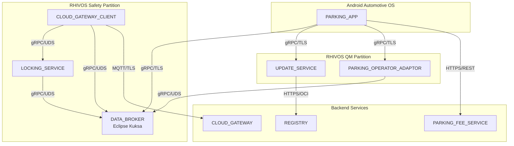

# Design Document: Project Foundation

## Overview

This design document describes the foundational infrastructure for the SDV Parking Demo System. The foundation establishes a monorepo structure, shared Protocol Buffer definitions, local development infrastructure, build system, communication protocol configurations, and container base image standards that enable development of all system components.

The architecture supports mixed-criticality communication patterns between Android Automotive OS applications and RHIVOS safety/QM partitions, with containerized services and cloud backend integration. All container images are built on Red Hat Universal Base Image 10 (UBI10) to ensure enterprise support, security compliance, and consistency across deployments.

## Architecture

### High-Level Structure

```
parking-fee-service/
├── rhivos/                    # Rust services for RHIVOS
│   ├── locking-service/       # ASIL-B door locking (safety partition)
│   ├── data-broker/           # Kuksa integration wrapper
│   ├── cloud-gateway-client/  # MQTT client (safety partition)
│   ├── parking-operator-adaptor/  # Dynamic adapter (QM partition)
│   ├── update-service/        # Container lifecycle (QM partition)
│   └── shared/                # Shared Rust libraries
├── android/
│   ├── parking-app/           # Kotlin AAOS application
│   └── companion-app/         # Flutter/Dart mobile app
├── backend/
│   ├── parking-fee-service/   # Go service for parking operations
│   └── cloud-gateway/         # Go MQTT broker/router
├── proto/                     # Shared Protocol Buffer definitions
│   ├── vss/                   # VSS signal definitions
│   ├── services/              # Service interface definitions
│   └── common/                # Shared message types
├── containers/                # Containerfiles for building images
│   ├── rhivos/                # RHIVOS service Containerfiles
│   ├── backend/               # Backend service Containerfiles
│   └── mock/                  # Mock service Containerfiles
├── infra/                     # Local development infrastructure
│   ├── compose/               # Docker/Podman compose files
│   ├── certs/                 # Development TLS certificates
│   └── config/                # Service configurations
├── scripts/                   # Build and utility scripts
├── docs/                      # Documentation
└── Makefile                   # Root build orchestration
```

### Communication Architecture



## Components and Interfaces

### Protocol Buffer Organization

The `proto/` directory contains all shared interface definitions organized by domain:

#### proto/common/error.proto
Common error handling types used across all services.

```protobuf
syntax = "proto3";
package sdv.common;

message ErrorDetails {
  string code = 1;
  string message = 2;
  map<string, string> details = 3;
  int64 timestamp = 4;
}
```

#### proto/vss/signals.proto
VSS signal definitions for vehicle data.

```protobuf
syntax = "proto3";
package sdv.vss;

import "google/protobuf/timestamp.proto";

message DoorState {
  bool is_locked = 1;
  bool is_open = 2;
  google.protobuf.Timestamp timestamp = 3;
}

message Location {
  double latitude = 1;
  double longitude = 2;
  google.protobuf.Timestamp timestamp = 3;
}

message VehicleSpeed {
  float speed_kmh = 1;
  google.protobuf.Timestamp timestamp = 2;
}

message ParkingState {
  bool session_active = 1;
  string session_id = 2;
  google.protobuf.Timestamp timestamp = 3;
}

// Unified signal container for subscriptions
message VehicleSignal {
  oneof signal {
    DoorState door_state = 1;
    Location location = 2;
    VehicleSpeed speed = 3;
    ParkingState parking_state = 4;
  }
}
```

#### proto/services/databroker.proto
DATA_BROKER service interface (Kuksa-compatible).

```protobuf
syntax = "proto3";
package sdv.services.databroker;

import "vss/signals.proto";

service DataBroker {
  // Get current value of a signal
  rpc GetSignal(GetSignalRequest) returns (GetSignalResponse);
  
  // Set a signal value (write access required)
  rpc SetSignal(SetSignalRequest) returns (SetSignalResponse);
  
  // Subscribe to signal changes
  rpc Subscribe(SubscribeRequest) returns (stream SubscribeResponse);
}

message GetSignalRequest {
  repeated string signal_paths = 1;
}

message GetSignalResponse {
  repeated sdv.vss.VehicleSignal signals = 1;
}

message SetSignalRequest {
  string signal_path = 1;
  sdv.vss.VehicleSignal signal = 2;
}

message SetSignalResponse {
  bool success = 1;
  string error_message = 2;
}

message SubscribeRequest {
  repeated string signal_paths = 1;
}

message SubscribeResponse {
  string signal_path = 1;
  sdv.vss.VehicleSignal signal = 2;
}
```

#### proto/services/update_service.proto
UPDATE_SERVICE interface for adapter lifecycle management.

```protobuf
syntax = "proto3";
package sdv.services.update;

service UpdateService {
  // Install an adapter from registry
  rpc InstallAdapter(InstallAdapterRequest) returns (InstallAdapterResponse);
  
  // Uninstall an adapter
  rpc UninstallAdapter(UninstallAdapterRequest) returns (UninstallAdapterResponse);
  
  // List installed adapters
  rpc ListAdapters(ListAdaptersRequest) returns (ListAdaptersResponse);
  
  // Watch adapter state changes
  rpc WatchAdapterStates(WatchAdapterStatesRequest) returns (stream AdapterStateEvent);
}

enum AdapterState {
  ADAPTER_STATE_UNKNOWN = 0;
  ADAPTER_STATE_DOWNLOADING = 1;
  ADAPTER_STATE_INSTALLING = 2;
  ADAPTER_STATE_RUNNING = 3;
  ADAPTER_STATE_STOPPED = 4;
  ADAPTER_STATE_ERROR = 5;
}

message AdapterInfo {
  string adapter_id = 1;
  string image_ref = 2;
  string version = 3;
  AdapterState state = 4;
  string error_message = 5;
}

message InstallAdapterRequest {
  string image_ref = 1;
  string checksum = 2;
}

message InstallAdapterResponse {
  string job_id = 1;
  string adapter_id = 2;
  AdapterState state = 3;
}

message UninstallAdapterRequest {
  string adapter_id = 1;
}

message UninstallAdapterResponse {
  bool success = 1;
  string error_message = 2;
}

message ListAdaptersRequest {}

message ListAdaptersResponse {
  repeated AdapterInfo adapters = 1;
}

message WatchAdapterStatesRequest {
  repeated string adapter_ids = 1;  // Empty = watch all
}

message AdapterStateEvent {
  string adapter_id = 1;
  AdapterState old_state = 2;
  AdapterState new_state = 3;
  string error_message = 4;
}
```

#### proto/services/parking_adaptor.proto
PARKING_OPERATOR_ADAPTOR interface for parking session management.

```protobuf
syntax = "proto3";
package sdv.services.parking;

import "google/protobuf/timestamp.proto";

service ParkingAdaptor {
  // Start a parking session
  rpc StartSession(StartSessionRequest) returns (StartSessionResponse);
  
  // Stop a parking session
  rpc StopSession(StopSessionRequest) returns (StopSessionResponse);
  
  // Get current session status
  rpc GetSessionStatus(GetSessionStatusRequest) returns (GetSessionStatusResponse);
}

message StartSessionRequest {
  string vehicle_id = 1;
  string zone_id = 2;
  double latitude = 3;
  double longitude = 4;
}

message StartSessionResponse {
  string session_id = 1;
  bool success = 2;
  string error_message = 3;
  string operator_name = 4;
  double hourly_rate = 5;
  string currency = 6;
}

message StopSessionRequest {
  string session_id = 1;
}

message StopSessionResponse {
  bool success = 1;
  string error_message = 2;
  double total_amount = 3;
  string currency = 4;
  int64 duration_seconds = 5;
}

message GetSessionStatusRequest {
  string session_id = 1;
}

message GetSessionStatusResponse {
  string session_id = 1;
  bool active = 2;
  google.protobuf.Timestamp start_time = 3;
  double current_amount = 4;
  string currency = 5;
}
```

#### proto/services/locking_service.proto
LOCKING_SERVICE interface for door lock commands.

```protobuf
syntax = "proto3";
package sdv.services.locking;

service LockingService {
  // Execute a lock command
  rpc Lock(LockRequest) returns (LockResponse);
  
  // Execute an unlock command
  rpc Unlock(UnlockRequest) returns (UnlockResponse);
  
  // Get current lock state
  rpc GetLockState(GetLockStateRequest) returns (GetLockStateResponse);
}

enum Door {
  DOOR_UNKNOWN = 0;
  DOOR_DRIVER = 1;
  DOOR_PASSENGER = 2;
  DOOR_REAR_LEFT = 3;
  DOOR_REAR_RIGHT = 4;
  DOOR_ALL = 5;
}

message LockRequest {
  Door door = 1;
  string command_id = 2;
  string auth_token = 3;
}

message LockResponse {
  bool success = 1;
  string error_message = 2;
  string command_id = 3;
}

message UnlockRequest {
  Door door = 1;
  string command_id = 2;
  string auth_token = 3;
}

message UnlockResponse {
  bool success = 1;
  string error_message = 2;
  string command_id = 3;
}

message GetLockStateRequest {
  Door door = 1;
}

message GetLockStateResponse {
  Door door = 1;
  bool is_locked = 2;
  bool is_open = 3;
}
```

### Build System Components

#### Root Makefile Structure

```makefile
# Root Makefile targets
.PHONY: all proto build test clean

all: proto build

proto:           # Generate all language bindings
proto-rust:      # Generate Rust bindings
proto-kotlin:    # Generate Kotlin bindings
proto-dart:      # Generate Dart bindings
proto-go:        # Generate Go bindings

build:           # Build all components
build-rhivos:    # Build Rust services
build-android:   # Build Android apps
build-backend:   # Build Go services
build-containers: # Build all container images

test:            # Run all tests
test-rhivos:     # Run Rust tests
test-android:    # Run Android tests
test-backend:    # Run Go tests

infra-up:        # Start local infrastructure
infra-down:      # Stop local infrastructure

clean:           # Clean all build artifacts
```

### Local Infrastructure Components

#### Podman Compose Configuration

```yaml
# infra/compose/podman-compose.yml
version: '3.8'

services:
  mosquitto:
    image: eclipse-mosquitto:2
    ports:
      - "1883:1883"   # MQTT
      - "8883:8883"   # MQTT/TLS
    volumes:
      - ./config/mosquitto:/mosquitto/config
    healthcheck:
      test: ["CMD", "mosquitto_sub", "-t", "$$SYS/#", "-C", "1"]
      interval: 10s
      timeout: 5s
      retries: 3

  kuksa-databroker:
    image: registry.gitlab.com/centos/automotive/container-images/eclipse-kuksa/kuksa-databroker:latest
    ports:
      - "55555:55555"  # gRPC
    volumes:
      - ./config/kuksa:/config
    healthcheck:
      test: ["CMD", "grpc_health_probe", "-addr=:55555"]
      interval: 10s
      timeout: 5s
      retries: 3

  mock-parking-operator:
    build:
      context: ../../containers/mock
      dockerfile: Containerfile.parking-operator
    ports:
      - "8080:8080"
    depends_on:
      - mosquitto
```

## Data Models

### Configuration Data Models

#### Service Configuration

```rust
// rhivos/shared/src/config.rs
pub struct ServiceConfig {
    pub name: String,
    pub grpc_socket_path: Option<String>,  // For UDS
    pub grpc_address: Option<String>,       // For TCP
    pub tls_enabled: bool,
    pub tls_cert_path: Option<String>,
    pub tls_key_path: Option<String>,
}

pub struct DataBrokerConfig {
    pub address: String,
    pub use_tls: bool,
}

pub struct MqttConfig {
    pub broker_url: String,
    pub client_id: String,
    pub use_tls: bool,
    pub ca_cert_path: Option<String>,
}
```

#### Container Manifest

```rust
// Container manifest for validation
pub struct ContainerManifest {
    pub image_ref: String,
    pub digest: String,
    pub created_at: DateTime<Utc>,
    pub labels: HashMap<String, String>,
    pub signature: Option<String>,
}
```

### Communication Endpoint Configuration

| Service | Local (UDS) | Network (TCP) | Port |
|---------|-------------|---------------|------|
| DATA_BROKER | /run/kuksa/databroker.sock | 0.0.0.0:55555 | 55555 |
| LOCKING_SERVICE | /run/rhivos/locking.sock | - | - |
| UPDATE_SERVICE | /run/rhivos/update.sock | 0.0.0.0:50051 | 50051 |
| PARKING_ADAPTOR | /run/rhivos/parking.sock | 0.0.0.0:50052 | 50052 |
| CLOUD_GATEWAY | - | mqtt.example.com:8883 | 8883 |
| PARKING_FEE_SERVICE | - | api.example.com:443 | 443 |

### TLS Certificate Structure

```
infra/certs/
├── ca/
│   ├── ca.crt           # Root CA certificate
│   └── ca.key           # Root CA private key (dev only)
├── server/
│   ├── server.crt       # Server certificate
│   └── server.key       # Server private key
└── client/
    ├── client.crt       # Client certificate
    └── client.key       # Client private key
```

## Container Base Image Standards

All container images in this project use Red Hat Universal Base Image 10 (UBI10) as the base image to ensure enterprise support, security compliance, and consistency.

### UBI10 Variant Selection Guide

| Variant | Registry Path | Use Case | Size |
|---------|---------------|----------|------|
| UBI Standard | `registry.access.redhat.com/ubi10/ubi` | General-purpose containers with full tooling | ~200MB |
| UBI Minimal | `registry.access.redhat.com/ubi10/ubi-minimal` | Size-optimized containers with microdnf | ~100MB |
| UBI Micro | `registry.access.redhat.com/ubi10/ubi-micro` | Minimal footprint, no package manager | ~30MB |

### Containerfile Standards

Each Containerfile must:
1. Use a UBI10 variant as the base image (or final stage in multi-stage builds)
2. Include a comment documenting the rationale for the chosen variant
3. Use multi-stage builds when third-party dependencies require non-UBI images

#### Example: Rust Service Containerfile

```dockerfile
# containers/rhivos/Containerfile.locking-service
# 
# Base Image Rationale: Using ubi10/ubi-minimal for balance between size and 
# package availability. The locking-service requires minimal runtime dependencies
# and benefits from the smaller image size for faster deployment.
#
# Build Stage: Using ghcr.io/rhadp/builder per project standards for Rust builds.

# Build stage - MUST use ghcr.io/rhadp/builder for Rust/Go builds
FROM ghcr.io/rhadp/builder AS builder
WORKDIR /app
COPY rhivos/locking-service/ .
COPY rhivos/shared/ ../shared/
RUN cargo build --release

# Final stage - MUST use UBI10
FROM registry.access.redhat.com/ubi10/ubi-minimal

LABEL maintainer="SDV Team"
LABEL version="${GIT_VERSION}"
LABEL description="ASIL-B Door Locking Service"

# Install runtime dependencies
RUN microdnf install -y shadow-utils && microdnf clean all

# Create non-root user
RUN useradd -r -u 1000 -g root locking-service

COPY --from=builder /app/target/release/locking-service /usr/local/bin/

USER locking-service
ENTRYPOINT ["/usr/local/bin/locking-service"]
```

#### Example: Go Service Containerfile

```dockerfile
# containers/backend/Containerfile.parking-fee-service
#
# Base Image Rationale: Using ubi10/ubi-micro for minimal footprint. Go binaries
# are statically compiled and require no runtime dependencies, making micro the
# ideal choice for smallest possible image size.
#
# Build Stage: Using ghcr.io/rhadp/builder per project standards for Go builds.

# Build stage - MUST use ghcr.io/rhadp/builder for Rust/Go builds
FROM ghcr.io/rhadp/builder AS builder
WORKDIR /app
COPY backend/parking-fee-service/ .
RUN CGO_ENABLED=0 GOOS=linux go build -o parking-fee-service .

# Final stage - MUST use UBI10
FROM registry.access.redhat.com/ubi10/ubi-micro

LABEL maintainer="SDV Team"
LABEL version="${GIT_VERSION}"
LABEL description="Parking Fee Service Backend"

COPY --from=builder /app/parking-fee-service /usr/local/bin/

USER 1000
ENTRYPOINT ["/usr/local/bin/parking-fee-service"]
```

### Prohibited Base Images

The following base images are NOT permitted in final container stages:
- `alpine` / `alpine:*`
- `ubuntu` / `ubuntu:*`
- `debian` / `debian:*`
- `centos` / `centos:*` (use UBI instead)
- `fedora` / `fedora:*`
- Any `*-slim` variants of the above

These images may be used in build stages of multi-stage builds, but the final stage must always use UBI10.

### Build Stage Image Requirements

For Golang and Rust artifacts, the build stage MUST use `ghcr.io/rhadp/builder` as the base image:
- **Required**: `ghcr.io/rhadp/builder` for all Go and Rust build stages
- **Prohibited**: `docker.io/library/golang:*`, `docker.io/library/rust:*`, or other official Docker images

This ensures consistent build environments and enterprise support across all container builds.

## Correctness Properties

*A property is a characteristic or behavior that should hold true across all valid executions of a system—essentially, a formal statement about what the system should do. Properties serve as the bridge between human-readable specifications and machine-verifiable correctness guarantees.*

Based on the prework analysis, the following properties can be verified through property-based testing:

### Property 1: Proto Regeneration Round-Trip

*For any* modification to a Protocol Buffer definition file, running `make proto` SHALL regenerate language bindings that are syntactically valid and compile without errors in their respective languages (Rust, Kotlin, Dart, Go).

**Validates: Requirements 2.7**

This is a round-trip property: modifying a proto file and regenerating bindings should produce compilable code. We can test this by:
1. Generating random valid proto modifications (adding fields, messages, services)
2. Running the proto generation
3. Verifying the generated code compiles in each target language

### Property 2: Health Check Configuration Completeness

*For any* service defined in the Podman Compose configuration, there SHALL exist a corresponding health check configuration with test command, interval, timeout, and retries specified.

**Validates: Requirements 3.6**

This is an invariant property: every service must have health checks. We can test this by:
1. Parsing the compose file
2. Extracting all service definitions
3. Verifying each service has a healthcheck block with required fields

### Property 3: Container Image Git Tagging

*For any* container image built by the Build_System, the image tag SHALL contain valid git metadata (commit hash or version tag) that can be traced back to a specific commit in the repository.

**Validates: Requirements 4.8**

This is an invariant property: all built images must be traceable. We can test this by:
1. Building containers from various git states (tagged, untagged, dirty)
2. Inspecting the resulting image tags
3. Verifying the tag contains valid git reference information

### Property 4: Documentation Directory Coverage

*For any* major directory in the project structure (rhivos/, android/, backend/, proto/, infra/), there SHALL exist a README.md file that describes the directory's purpose and contents.

**Validates: Requirements 6.2**

This is an invariant property: all major directories must be documented. We can test this by:
1. Enumerating all major directories
2. Checking for README.md existence in each
3. Verifying the README contains non-empty content

### Property 5: UBI10 Base Image Compliance

*For any* Containerfile in the project, the final stage base image SHALL be a Red Hat Universal Base Image 10 (UBI10) variant from `registry.access.redhat.com/ubi10/*`.

**Validates: Requirements 8.1, 8.2, 8.5**

This is an invariant property: all final container images must use UBI10. We can test this by:
1. Parsing all Containerfiles in the containers/ directory
2. Identifying the final FROM instruction (last FROM in multi-stage builds)
3. Verifying the image reference matches `registry.access.redhat.com/ubi10/*` pattern
4. Rejecting any final stages using alpine, ubuntu, debian, or other non-UBI images

### Property 6: Containerfile Documentation Compliance

*For any* Containerfile in the project, there SHALL exist a comment block documenting the rationale for the chosen UBI10 variant.

**Validates: Requirements 8.4**

This is an invariant property: all Containerfiles must document their base image choice. We can test this by:
1. Parsing all Containerfiles in the containers/ directory
2. Searching for comment blocks containing "rationale" or "base image" keywords
3. Verifying the comment references UBI10 variant selection reasoning

### Property 7: Builder Image Compliance

*For any* Containerfile building Golang or Rust artifacts, the build stage base image SHALL be `ghcr.io/rhadp/builder`.

**Validates: Requirements 8.6**

This is an invariant property: all Go/Rust build stages must use the approved builder image. We can test this by:
1. Parsing all Containerfiles in the containers/ directory
2. Identifying Containerfiles that build Go or Rust code (by examining COPY and RUN instructions)
3. Verifying the build stage FROM instruction uses `ghcr.io/rhadp/builder`
4. Rejecting any build stages using `docker.io/library/golang:*` or `docker.io/library/rust:*`

## Error Handling

### gRPC Error Handling Strategy

All gRPC services use standard gRPC status codes with custom `ErrorDetails` metadata:

| Error Scenario | gRPC Status Code | Error Code |
|----------------|------------------|------------|
| Invalid proto message | INVALID_ARGUMENT (3) | INVALID_REQUEST |
| Service not ready | FAILED_PRECONDITION (9) | SERVICE_NOT_READY |
| Container pull failed | UNAVAILABLE (14) | REGISTRY_UNAVAILABLE |
| Checksum mismatch | INVALID_ARGUMENT (3) | CHECKSUM_MISMATCH |
| TLS handshake failed | UNAVAILABLE (14) | TLS_ERROR |
| Socket connection failed | UNAVAILABLE (14) | CONNECTION_FAILED |

### Build System Error Handling

```makefile
# Build targets should fail fast with clear error messages
proto:
	@echo "Generating Protocol Buffer bindings..."
	@protoc --version > /dev/null 2>&1 || (echo "Error: protoc not found. Install Protocol Buffers compiler." && exit 1)
	# ... generation commands
```

### Infrastructure Error Handling

The Podman Compose configuration includes:
- Health checks with retry logic
- Dependency ordering with `depends_on`
- Clear service names for error identification
- Volume mounts validated at startup

## Testing Strategy

### Dual Testing Approach

The foundation uses both unit tests and property-based tests:

- **Unit tests**: Verify specific examples, edge cases, and error conditions
- **Property tests**: Verify universal properties across all inputs

### Unit Testing

Unit tests focus on:
- Proto file parsing and validation
- Configuration file loading
- Build script target existence
- Certificate file validation

### Property-Based Testing

Property-based tests use the following libraries:
- **Rust**: `proptest` crate
- **Go**: `gopter` or `rapid`
- **Kotlin**: `kotest-property`
- **Dart**: `test` with custom generators

Each property test:
- Runs minimum 100 iterations
- References the design document property
- Uses tag format: **Feature: project-foundation, Property {number}: {property_text}**

### Test Organization

```
tests/
├── unit/
│   ├── proto_validation_test.go
│   ├── config_loading_test.rs
│   └── compose_validation_test.py
└── property/
    ├── proto_roundtrip_test.go
    ├── healthcheck_completeness_test.py
    ├── container_tagging_test.sh
    ├── documentation_coverage_test.py
    ├── ubi10_compliance_test.py
    ├── containerfile_docs_test.py
    └── builder_image_compliance_test.py
```

### Integration Testing

Integration tests verify:
- Local infrastructure starts successfully
- Services communicate over configured protocols
- Mock services respond correctly
- End-to-end message flows work

### Test Execution

```makefile
test:
	@echo "Running all tests..."
	$(MAKE) test-unit
	$(MAKE) test-property
	$(MAKE) test-integration

test-unit:
	# Run unit tests for each component

test-property:
	# Run property-based tests with 100+ iterations

test-integration:
	# Start infrastructure and run integration tests
```
