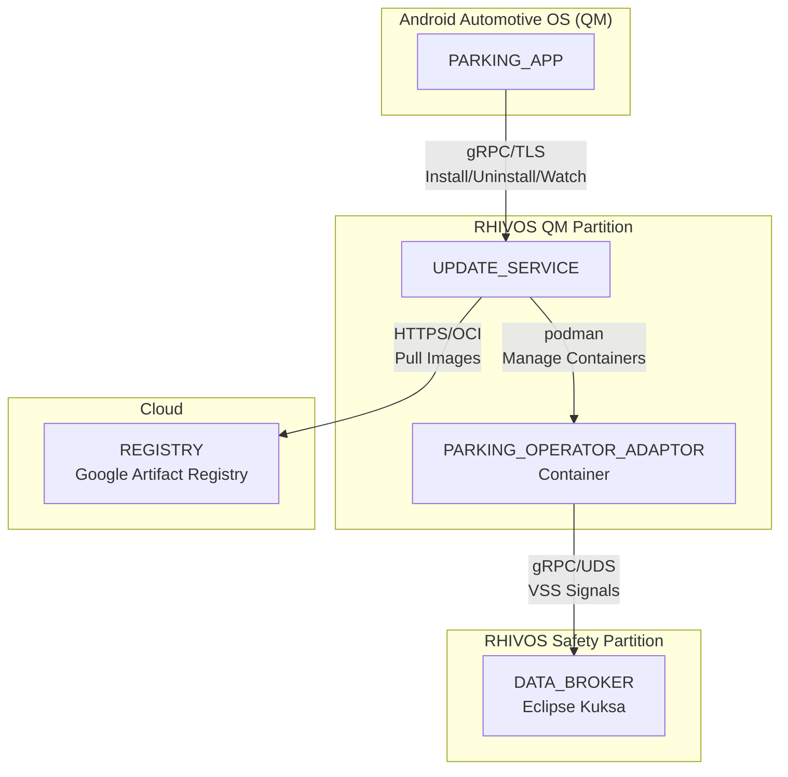
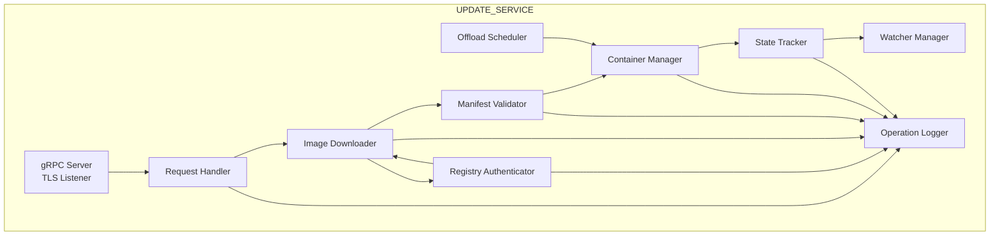
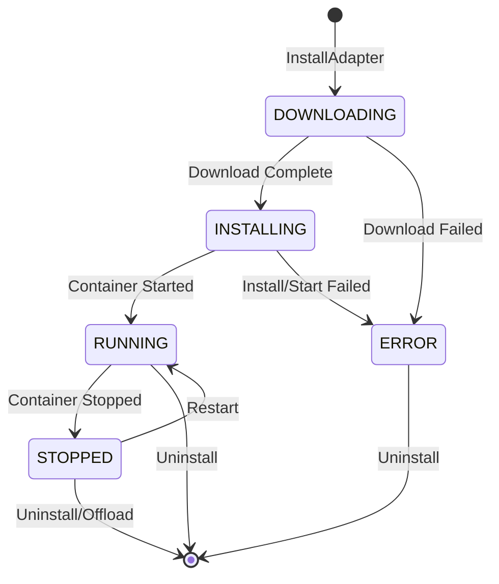

# Design Document: UPDATE_SERVICE

## Overview

The UPDATE_SERVICE is a Rust service running in the RHIVOS QM partition that manages the lifecycle of containerized parking operator adapters. It provides on-demand container image pulling from an OCI registry, manifest validation, container lifecycle management via podman, and real-time state streaming to clients.

The service receives requests from PARKING_APP via gRPC over TCP/TLS (cross-domain communication), pulls container images from the REGISTRY using HTTPS/OCI protocol, and manages adapter containers using podman/crun. It tracks adapter states and provides streaming updates to enable reactive UI updates in the PARKING_APP.

## Architecture

### Component Context



### Internal Architecture



### Request Flow: InstallAdapter

1. **Request Reception**: gRPC server receives InstallAdapter request via TLS
2. **Correlation ID**: Generate unique correlation ID for request tracing
3. **Request Logging**: Log incoming request with correlation ID, request type, and adapter_id
4. **Duplicate Check**: Check if adapter already installed or in progress
5. **State Initialization**: Create adapter entry with DOWNLOADING state, log state transition
6. **Authentication**: Obtain Bearer token from registry token endpoint (if credentials configured)
7. **Image Download**: Pull OCI image from REGISTRY with retry logic, log container pull operation
8. **Manifest Validation**: Verify checksum and required fields
9. **Container Installation**: Install container using podman, log install operation
10. **Container Startup**: Start container with DATA_BROKER network access, log start operation
11. **State Update**: Transition to RUNNING, log state transition, and emit state event
12. **Response**: Return InstallAdapterResponse with current state

## Components and Interfaces

### gRPC Service Definition

The service implements the interface defined in `proto/services/update_service.proto`:

```protobuf
syntax = "proto3";
package sdv.services.update;

service UpdateService {
  rpc InstallAdapter(InstallAdapterRequest) returns (InstallAdapterResponse);
  rpc UninstallAdapter(UninstallAdapterRequest) returns (UninstallAdapterResponse);
  rpc ListAdapters(ListAdaptersRequest) returns (ListAdaptersResponse);
  rpc WatchAdapterStates(WatchAdapterStatesRequest) returns (stream AdapterStateEvent);
}

enum AdapterState {
  ADAPTER_STATE_UNKNOWN = 0;
  ADAPTER_STATE_DOWNLOADING = 1;
  ADAPTER_STATE_INSTALLING = 2;
  ADAPTER_STATE_RUNNING = 3;
  ADAPTER_STATE_STOPPED = 4;
  ADAPTER_STATE_ERROR = 5;
}

message InstallAdapterRequest {
  string adapter_id = 1;
  string registry_url = 2;
  string image_digest = 3;  // Expected SHA256 digest for validation
}

message InstallAdapterResponse {
  bool success = 1;
  string error_message = 2;
  AdapterState state = 3;
}

message UninstallAdapterRequest {
  string adapter_id = 1;
}

message UninstallAdapterResponse {
  bool success = 1;
  string error_message = 2;
}

message ListAdaptersRequest {}

message ListAdaptersResponse {
  repeated AdapterInfo adapters = 1;
}

message AdapterInfo {
  string adapter_id = 1;
  AdapterState state = 2;
  string error_message = 3;
  int64 last_updated_unix = 4;
}

message WatchAdapterStatesRequest {}

message AdapterStateEvent {
  string adapter_id = 1;
  AdapterState previous_state = 2;
  AdapterState new_state = 3;
  int64 timestamp_unix = 4;
  string error_message = 5;
}
```

### Internal Components

#### UpdateServiceImpl

Main service implementation handling gRPC requests.

```rust
pub struct UpdateServiceImpl {
    state_tracker: Arc<StateTracker>,
    image_downloader: ImageDownloader,
    manifest_validator: ManifestValidator,
    container_manager: ContainerManager,
    watcher_manager: Arc<WatcherManager>,
    config: ServiceConfig,
    logger: OperationLogger,
}

impl UpdateServiceImpl {
    pub fn new(config: ServiceConfig) -> Result<Self, Error>;
    
    /// Generates a unique correlation ID for request tracing
    fn generate_correlation_id() -> String;
}
```

#### RegistryAuthenticator

Handles OCI registry authentication with Bearer token support.

```rust
pub struct RegistryAuthenticator {
    http_client: reqwest::Client,
    credentials: Option<RegistryCredentials>,
    token_cache: RwLock<HashMap<String, CachedToken>>,
}

#[derive(Clone)]
pub struct RegistryCredentials {
    pub username: String,
    pub password: String,
}

#[derive(Clone)]
pub struct CachedToken {
    pub token: String,
    pub expires_at: SystemTime,
}

impl RegistryAuthenticator {
    /// Creates authenticator from environment variables
    /// REGISTRY_USERNAME and REGISTRY_PASSWORD
    pub fn from_env() -> Self;
    
    /// Gets a valid Bearer token for the registry
    /// Returns cached token if valid, otherwise fetches new token
    pub async fn get_token(
        &self,
        registry_url: &str,
        scope: &str,
    ) -> Result<Option<String>, AuthError>;
    
    /// Handles 401 challenge and obtains token from token endpoint
    async fn fetch_token(
        &self,
        token_endpoint: &str,
        scope: &str,
    ) -> Result<CachedToken, AuthError>;
    
    /// Checks if cached token is still valid (not expired)
    fn is_token_valid(&self, token: &CachedToken) -> bool;
}

#[derive(Debug, thiserror::Error)]
pub enum AuthError {
    #[error("Authentication failed: {0}")]
    AuthenticationFailed(String),
    
    #[error("Token endpoint unreachable: {0}")]
    TokenEndpointUnreachable(String),
    
    #[error("Invalid credentials")]
    InvalidCredentials,
}
```

#### ImageDownloader

Downloads OCI container images from the registry with authentication support.

```rust
pub struct ImageDownloader {
    http_client: reqwest::Client,
    authenticator: RegistryAuthenticator,
    max_retries: u32,
    base_delay: Duration,
    logger: OperationLogger,
}

impl ImageDownloader {
    /// Downloads container image with retry logic and authentication
    /// Returns path to downloaded image layers
    pub async fn download(
        &self,
        registry_url: &str,
        adapter_id: &str,
        correlation_id: &str,
    ) -> Result<DownloadedImage, DownloadError>;
    
    /// Performs authenticated request to registry
    /// Handles 401 challenges by obtaining Bearer token
    async fn authenticated_request(
        &self,
        url: &str,
        scope: &str,
    ) -> Result<reqwest::Response, DownloadError>;
}

pub struct DownloadedImage {
    pub manifest_path: PathBuf,
    pub layers_dir: PathBuf,
    pub config_path: PathBuf,
}
```

#### ManifestValidator

Validates container manifests for integrity and completeness.

```rust
pub struct ManifestValidator;

impl ManifestValidator {
    /// Validates manifest checksum matches expected digest
    pub fn validate_checksum(
        &self,
        manifest_path: &Path,
        expected_digest: &str,
    ) -> Result<(), ValidationError>;
    
    /// Validates manifest contains required fields
    pub fn validate_structure(
        &self,
        manifest_path: &Path,
    ) -> Result<OciManifest, ValidationError>;
}

#[derive(Debug, Deserialize)]
pub struct OciManifest {
    pub schema_version: u32,
    pub media_type: String,
    pub config: OciDescriptor,
    pub layers: Vec<OciDescriptor>,
}

#[derive(Debug, Deserialize)]
pub struct OciDescriptor {
    pub media_type: String,
    pub digest: String,
    pub size: u64,
}
```

#### ContainerManager

Manages container lifecycle using podman.

```rust
pub struct ContainerManager {
    storage_path: PathBuf,
    data_broker_socket: String,
}

impl ContainerManager {
    /// Installs container from downloaded image
    pub async fn install(
        &self,
        adapter_id: &str,
        image: &DownloadedImage,
    ) -> Result<(), ContainerError>;
    
    /// Starts an installed container
    pub async fn start(&self, adapter_id: &str) -> Result<(), ContainerError>;
    
    /// Stops a running container
    pub async fn stop(&self, adapter_id: &str) -> Result<(), ContainerError>;
    
    /// Removes container and storage
    pub async fn remove(&self, adapter_id: &str) -> Result<(), ContainerError>;
    
    /// Lists running containers to restore state on startup
    pub async fn list_running(&self) -> Result<Vec<String>, ContainerError>;
}
```

#### StateTracker

Tracks adapter states and manages state transitions.

```rust
pub struct StateTracker {
    adapters: RwLock<HashMap<String, AdapterEntry>>,
    watcher_manager: Arc<WatcherManager>,
}

impl StateTracker {
    /// Gets current state of an adapter
    pub fn get_state(&self, adapter_id: &str) -> Option<AdapterState>;
    
    /// Transitions adapter to new state and notifies watchers
    pub async fn transition(
        &self,
        adapter_id: &str,
        new_state: AdapterState,
        error_message: Option<String>,
    ) -> Result<(), StateError>;
    
    /// Lists all adapters with their states
    pub fn list_all(&self) -> Vec<AdapterInfo>;
    
    /// Removes adapter from tracking
    pub fn remove(&self, adapter_id: &str);
    
    /// Restores state from running containers on startup
    pub async fn restore_from_containers(
        &self,
        container_manager: &ContainerManager,
    ) -> Result<(), StateError>;
}

#[derive(Debug, Clone)]
pub struct AdapterEntry {
    pub adapter_id: String,
    pub state: AdapterState,
    pub error_message: Option<String>,
    pub last_updated: SystemTime,
    pub last_activity: SystemTime,
}
```

#### WatcherManager

Manages streaming subscriptions for state updates.

```rust
pub struct WatcherManager {
    watchers: RwLock<Vec<mpsc::Sender<AdapterStateEvent>>>,
}

impl WatcherManager {
    /// Registers a new watcher and returns receiver for events
    pub fn register(&self) -> mpsc::Receiver<AdapterStateEvent>;
    
    /// Broadcasts state event to all active watchers
    pub async fn broadcast(&self, event: AdapterStateEvent);
    
    /// Removes disconnected watchers
    pub fn cleanup_disconnected(&self);
}
```

#### OffloadScheduler

Schedules automatic offloading of unused adapters.

```rust
pub struct OffloadScheduler {
    state_tracker: Arc<StateTracker>,
    container_manager: Arc<ContainerManager>,
    offload_threshold: Duration,
    check_interval: Duration,
    logger: OperationLogger,
}

impl OffloadScheduler {
    /// Starts the background offload check task
    pub fn start(self: Arc<Self>) -> JoinHandle<()>;
    
    /// Checks for and offloads inactive adapters
    async fn check_and_offload(&self);
}
```

#### OperationLogger

Provides structured logging for all adapter operations with correlation identifiers.

```rust
use tracing::{info, warn, error, span, Level};

pub struct OperationLogger {
    service_name: String,
}

impl OperationLogger {
    pub fn new(service_name: &str) -> Self;
    
    /// Logs incoming request with correlation ID
    pub fn log_request(
        &self,
        correlation_id: &str,
        request_type: &str,
        adapter_id: &str,
    );
    
    /// Logs state transition with previous and new state
    pub fn log_state_transition(
        &self,
        correlation_id: &str,
        adapter_id: &str,
        previous_state: AdapterState,
        new_state: AdapterState,
        reason: Option<&str>,
    );
    
    /// Logs container operation with outcome
    pub fn log_container_operation(
        &self,
        correlation_id: &str,
        adapter_id: &str,
        operation: ContainerOperation,
        outcome: OperationOutcome,
    );
    
    /// Logs authentication events
    pub fn log_auth_event(
        &self,
        correlation_id: &str,
        registry_url: &str,
        event: AuthEvent,
    );
}

#[derive(Debug, Clone, Copy)]
pub enum ContainerOperation {
    Pull,
    Install,
    Start,
    Stop,
    Remove,
}

#[derive(Debug, Clone)]
pub enum OperationOutcome {
    Success,
    Failure(String),
}

#[derive(Debug, Clone)]
pub enum AuthEvent {
    TokenRequested,
    TokenObtained,
    TokenCached,
    TokenRefreshed,
    AuthenticationFailed(String),
    AnonymousAccess,
}

/// Structured log entry format
#[derive(Debug, Serialize)]
pub struct LogEntry {
    pub timestamp: String,           // ISO 8601 format
    pub level: String,               // INFO, WARN, ERROR
    pub correlation_id: String,      // UUID for request tracing
    pub service: String,             // "update-service"
    pub adapter_id: Option<String>,
    pub event_type: String,          // request, state_transition, container_op, auth
    pub message: String,
    pub details: serde_json::Value,  // Additional structured data
}
```

## Data Models

### Adapter State Machine



### Configuration

```rust
/// Service configuration loaded from environment/file
#[derive(Debug, Clone)]
pub struct ServiceConfig {
    /// TCP address for gRPC server (e.g., "0.0.0.0:50052")
    pub listen_addr: String,
    /// TLS certificate path
    pub tls_cert_path: String,
    /// TLS key path
    pub tls_key_path: String,
    /// Container storage path
    pub storage_path: String,
    /// DATA_BROKER UDS socket path for container networking
    pub data_broker_socket: String,
    /// Max retries for image download
    pub download_max_retries: u32,
    /// Base delay for exponential backoff (ms)
    pub download_base_delay_ms: u64,
    /// Offload threshold (hours)
    pub offload_threshold_hours: u64,
    /// Offload check interval (minutes)
    pub offload_check_interval_minutes: u64,
    /// Registry username (from REGISTRY_USERNAME env var)
    pub registry_username: Option<String>,
    /// Registry password (from REGISTRY_PASSWORD env var)
    pub registry_password: Option<String>,
    /// Token cache TTL buffer (seconds before expiry to refresh)
    pub token_refresh_buffer_secs: u64,
    /// Log level (trace, debug, info, warn, error)
    pub log_level: String,
}

impl Default for ServiceConfig {
    fn default() -> Self {
        Self {
            listen_addr: "0.0.0.0:50052".to_string(),
            tls_cert_path: "/etc/rhivos/certs/update-service.crt".to_string(),
            tls_key_path: "/etc/rhivos/certs/update-service.key".to_string(),
            storage_path: "/var/lib/containers/adapters".to_string(),
            data_broker_socket: "/run/kuksa/databroker.sock".to_string(),
            download_max_retries: 3,
            download_base_delay_ms: 1000,
            offload_threshold_hours: 24,
            offload_check_interval_minutes: 60,
            registry_username: std::env::var("REGISTRY_USERNAME").ok(),
            registry_password: std::env::var("REGISTRY_PASSWORD").ok(),
            token_refresh_buffer_secs: 60,
            log_level: "info".to_string(),
        }
    }
}
```

### Error Types

```rust
#[derive(Debug, thiserror::Error)]
pub enum UpdateError {
    #[error("Download failed: {0}")]
    DownloadError(String),
    
    #[error("Manifest validation failed: {0}")]
    ValidationError(String),
    
    #[error("Container operation failed: {0}")]
    ContainerError(String),
    
    #[error("Adapter not found: {0}")]
    AdapterNotFound(String),
    
    #[error("Adapter already exists: {0}")]
    AdapterAlreadyExists(String),
    
    #[error("Registry unavailable: {0}")]
    RegistryUnavailable(String),
    
    #[error("Invalid registry URL: {0}")]
    InvalidRegistryUrl(String),
    
    #[error("Checksum mismatch: expected {expected}, got {actual}")]
    ChecksumMismatch { expected: String, actual: String },
    
    #[error("Missing manifest field: {0}")]
    MissingManifestField(String),
    
    #[error("Authentication failed: {0}")]
    AuthenticationFailed(String),
    
    #[error("Token endpoint unreachable: {0}")]
    TokenEndpointUnreachable(String),
    
    #[error("Invalid credentials")]
    InvalidCredentials,
}

## Correctness Properties

*A property is a characteristic or behavior that should hold true across all valid executions of a system—essentially, a formal statement about what the system should do. Properties serve as the bridge between human-readable specifications and machine-verifiable correctness guarantees.*

Based on the prework analysis, the following properties can be verified through property-based testing:

### Property 1: Install Initiates Download State

*For any* valid InstallAdapter request with a valid adapter_id and registry_url, the UPDATE_SERVICE SHALL return an InstallAdapterResponse with state set to DOWNLOADING, and the adapter SHALL be tracked in the state tracker.

**Validates: Requirements 1.1, 1.2**

### Property 2: Install Idempotence for Running Adapters

*For any* adapter that is already in RUNNING state, calling InstallAdapter with the same adapter_id SHALL return success without initiating a new download, and the adapter state SHALL remain RUNNING.

**Validates: Requirements 1.3**

### Property 3: Install Idempotence for In-Progress Adapters

*For any* adapter that is currently in DOWNLOADING or INSTALLING state, calling InstallAdapter with the same adapter_id SHALL return the current state without starting a duplicate installation process.

**Validates: Requirements 1.4**

### Property 4: Invalid Registry URL Returns Error

*For any* InstallAdapter request with a malformed registry_url (invalid URL format), the UPDATE_SERVICE SHALL return an error indicating the registry is unavailable or invalid, and no adapter entry SHALL be created.

**Validates: Requirements 1.5**

### Property 5: Download Retry and Failure Handling

*For any* download that fails due to network error, the UPDATE_SERVICE SHALL retry up to 3 times. If all retries fail, the adapter state SHALL transition to ERROR with an error message describing the failure.

**Validates: Requirements 2.4, 2.5**

### Property 6: State Progression Through Installation

*For any* successful installation, the adapter state SHALL progress through DOWNLOADING → INSTALLING → RUNNING in order, with each transition recorded.

**Validates: Requirements 2.3, 4.2, 4.3**

### Property 7: Checksum Validation

*For any* downloaded container image, if the manifest checksum does not match the expected SHA256 digest, the UPDATE_SERVICE SHALL reject the image, transition state to ERROR, and the downloaded content SHALL be deleted.

**Validates: Requirements 3.1, 3.2**

### Property 8: Manifest Structure Validation

*For any* container manifest missing required fields (config, layers, or mediaType), the UPDATE_SERVICE SHALL reject the image and transition the adapter state to ERROR with a message indicating the missing field.

**Validates: Requirements 3.3, 3.4**

### Property 9: Container Startup Failure Handling

*For any* container that fails to start after installation, the UPDATE_SERVICE SHALL transition the adapter state to ERROR and include the failure reason in the error message.

**Validates: Requirements 4.6**

### Property 10: State Timestamp Updates

*For any* adapter state change, the UPDATE_SERVICE SHALL update the last_updated timestamp, and the state information SHALL include adapter_id, current_state, error_message (if applicable), and last_updated.

**Validates: Requirements 5.2, 5.3**

### Property 11: Watcher Receives State Events

*For any* registered watcher, when an adapter state changes, the watcher SHALL receive an AdapterStateEvent containing adapter_id, previous_state, new_state, timestamp, and error_message (if applicable).

**Validates: Requirements 6.1, 6.2, 6.3**

### Property 12: Watcher Cleanup on Disconnect

*For any* watcher that disconnects, the UPDATE_SERVICE SHALL clean up the subscription, and other active watchers SHALL continue to receive events without interruption.

**Validates: Requirements 6.4**

### Property 13: New Watcher Receives Initial State

*For any* newly connected watcher, the UPDATE_SERVICE SHALL emit the current state of all tracked adapters as initial AdapterStateEvent messages before any subsequent state change events.

**Validates: Requirements 6.5**

### Property 14: List Adapters Returns Complete Info

*For any* set of installed adapters, ListAdapters SHALL return a list containing all adapters with their adapter_id, state, error_message, and last_updated fields populated correctly.

**Validates: Requirements 7.1, 7.2**

### Property 15: Uninstall Removes Adapter Completely

*For any* installed adapter, calling UninstallAdapter SHALL stop the container (if running), remove the container and storage, remove the adapter from tracked state, and emit a state change event to all watchers.

**Validates: Requirements 8.1, 8.2, 8.3, 8.5**

### Property 16: Uninstall Non-Existent Returns Error

*For any* UninstallAdapter request with an adapter_id that does not exist, the UPDATE_SERVICE SHALL return an error indicating the adapter was not found.

**Validates: Requirements 8.4**

### Property 17: Automatic Offload After Inactivity

*For any* adapter that has been in STOPPED state for more than 24 hours, the UPDATE_SERVICE SHALL automatically uninstall it and emit a state change event indicating automatic removal.

**Validates: Requirements 9.1, 9.2, 9.3**

### Property 18: Bearer Token Authentication on 401 Challenge

*For any* registry request that receives an HTTP 401 response, the UPDATE_SERVICE SHALL obtain a Bearer token from the token endpoint (GET /v2/token) and retry the request with the Authorization header containing the Bearer token.

**Validates: Requirements 11.1, 11.2, 11.3**

### Property 19: Token Caching and Refresh

*For any* valid authentication token obtained from the registry, the UPDATE_SERVICE SHALL cache the token and reuse it for subsequent requests until it approaches expiration, at which point it SHALL refresh the token.

**Validates: Requirements 11.5**

### Property 20: Authentication Failure Transitions to Error

*For any* adapter installation where registry authentication fails (invalid credentials or token endpoint unreachable), the UPDATE_SERVICE SHALL transition the adapter state to ERROR with a message indicating authentication failure.

**Validates: Requirements 11.6**

### Property 21: Anonymous Access for Public Registries

*For any* registry request where no credentials are configured (REGISTRY_USERNAME and REGISTRY_PASSWORD not set), the UPDATE_SERVICE SHALL attempt anonymous access and succeed if the registry allows public access.

**Validates: Requirements 11.7**

### Property 22: Request Logging with Correlation ID

*For any* received request (InstallAdapter, UninstallAdapter, ListAdapters, WatchAdapterStates), the UPDATE_SERVICE SHALL log the request with timestamp, request type, adapter_id, and a unique correlation identifier.

**Validates: Requirements 12.1, 12.4**

### Property 23: State Transition Logging

*For any* adapter state transition, the UPDATE_SERVICE SHALL log the transition with the previous state, new state, reason for transition, and correlation identifier.

**Validates: Requirements 12.2, 12.4**

### Property 24: Container Operation Logging

*For any* container operation (pull, install, start, stop, remove), the UPDATE_SERVICE SHALL log the operation with its outcome (success or failure with reason) and correlation identifier.

**Validates: Requirements 12.3, 12.4**

## Error Handling

### gRPC Status Code Mapping

| Error Scenario | gRPC Status Code | Error Code |
|----------------|------------------|------------|
| Invalid/malformed registry URL | INVALID_ARGUMENT (3) | INVALID_REGISTRY_URL |
| Registry unreachable | UNAVAILABLE (14) | REGISTRY_UNAVAILABLE |
| Download failed after retries | UNAVAILABLE (14) | DOWNLOAD_FAILED |
| Checksum mismatch | FAILED_PRECONDITION (9) | CHECKSUM_MISMATCH |
| Missing manifest fields | FAILED_PRECONDITION (9) | INVALID_MANIFEST |
| Container start failed | INTERNAL (13) | CONTAINER_START_FAILED |
| Adapter not found | NOT_FOUND (5) | ADAPTER_NOT_FOUND |
| Adapter already exists | ALREADY_EXISTS (6) | ADAPTER_ALREADY_EXISTS |
| Authentication failed | UNAUTHENTICATED (16) | AUTHENTICATION_FAILED |
| Token endpoint unreachable | UNAVAILABLE (14) | TOKEN_ENDPOINT_UNAVAILABLE |
| Invalid credentials | PERMISSION_DENIED (7) | INVALID_CREDENTIALS |

### Error Response Structure

```rust
impl From<UpdateError> for tonic::Status {
    fn from(err: UpdateError) -> Self {
        match err {
            UpdateError::InvalidRegistryUrl(msg) => {
                Status::invalid_argument(msg)
            }
            UpdateError::RegistryUnavailable(msg) => {
                Status::unavailable(msg)
            }
            UpdateError::DownloadError(msg) => {
                Status::unavailable(format!("Download failed: {}", msg))
            }
            UpdateError::ChecksumMismatch { expected, actual } => {
                Status::failed_precondition(
                    format!("Checksum mismatch: expected {}, got {}", expected, actual)
                )
            }
            UpdateError::MissingManifestField(field) => {
                Status::failed_precondition(
                    format!("Missing manifest field: {}", field)
                )
            }
            UpdateError::ContainerError(msg) => {
                Status::internal(format!("Container error: {}", msg))
            }
            UpdateError::AdapterNotFound(id) => {
                Status::not_found(format!("Adapter not found: {}", id))
            }
            UpdateError::AdapterAlreadyExists(id) => {
                Status::already_exists(format!("Adapter already exists: {}", id))
            }
            UpdateError::AuthenticationFailed(msg) => {
                Status::unauthenticated(format!("Authentication failed: {}", msg))
            }
            UpdateError::TokenEndpointUnreachable(msg) => {
                Status::unavailable(format!("Token endpoint unreachable: {}", msg))
            }
            UpdateError::InvalidCredentials => {
                Status::permission_denied("Invalid registry credentials")
            }
            _ => Status::internal("Internal error"),
        }
    }
}
```

### Retry Strategy for Image Download

```rust
async fn download_with_retry(
    &self,
    registry_url: &str,
    adapter_id: &str,
) -> Result<DownloadedImage, DownloadError> {
    let mut delay = Duration::from_millis(self.base_delay_ms);
    
    for attempt in 0..self.max_retries {
        match self.download_image(registry_url, adapter_id).await {
            Ok(image) => return Ok(image),
            Err(e) if attempt < self.max_retries - 1 => {
                log::warn!(
                    "Download attempt {} failed: {}, retrying in {:?}",
                    attempt + 1, e, delay
                );
                tokio::time::sleep(delay).await;
                delay *= 2; // Exponential backoff
            }
            Err(e) => {
                return Err(DownloadError::AllRetriesFailed(e.to_string()));
            }
        }
    }
    unreachable!()
}
```

## Testing Strategy

### Dual Testing Approach

The UPDATE_SERVICE uses both unit tests and property-based tests:

- **Unit tests**: Verify specific examples, edge cases, and error conditions
- **Property tests**: Verify universal properties across all inputs

### Property-Based Testing

Property-based tests use the `proptest` crate for Rust. Each property test:
- Runs minimum 100 iterations
- References the design document property
- Uses tag format: **Feature: update-service, Property {number}: {property_text}**

### Test Organization

```
rhivos/update-service/
├── src/
│   ├── lib.rs
│   ├── service.rs
│   ├── downloader.rs
│   ├── authenticator.rs
│   ├── validator.rs
│   ├── container.rs
│   ├── state.rs
│   ├── watcher.rs
│   ├── offload.rs
│   └── logger.rs
└── tests/
    ├── unit/
    │   ├── downloader_test.rs
    │   ├── authenticator_test.rs
    │   ├── validator_test.rs
    │   ├── container_test.rs
    │   ├── state_test.rs
    │   └── logger_test.rs
    └── property/
        ├── install_properties.rs     # Properties 1-4
        ├── download_properties.rs    # Properties 5-6
        ├── validation_properties.rs  # Properties 7-8
        ├── container_properties.rs   # Property 9
        ├── state_properties.rs       # Properties 10, 14
        ├── watcher_properties.rs     # Properties 11-13
        ├── uninstall_properties.rs   # Properties 15-16
        ├── offload_properties.rs     # Property 17
        ├── auth_properties.rs        # Properties 18-21
        └── logging_properties.rs     # Properties 22-24
```

### Property Test Examples

```rust
// Property 2: Install Idempotence for Running Adapters
proptest! {
    #![proptest_config(ProptestConfig::with_cases(100))]
    
    /// Feature: update-service, Property 2: Install Idempotence for Running Adapters
    #[test]
    fn install_idempotent_for_running(
        adapter_id in "[a-z][a-z0-9-]{3,20}",
    ) {
        let rt = tokio::runtime::Runtime::new().unwrap();
        rt.block_on(async {
            let service = create_test_service();
            
            // Set up adapter as RUNNING
            service.state_tracker.set_state(
                &adapter_id,
                AdapterState::Running,
                None,
            ).await;
            
            let request = InstallAdapterRequest {
                adapter_id: adapter_id.clone(),
                registry_url: "https://registry.example.com/adapter".into(),
                image_digest: "sha256:abc123".into(),
            };
            
            let response = service.install_adapter(request).await.unwrap();
            
            prop_assert!(response.success);
            prop_assert_eq!(response.state, AdapterState::Running as i32);
            
            // Verify no download was initiated
            prop_assert!(!service.downloader.was_called());
        });
    }
}

// Property 7: Checksum Validation
proptest! {
    /// Feature: update-service, Property 7: Checksum Validation
    #[test]
    fn checksum_mismatch_rejects_image(
        expected_digest in "sha256:[a-f0-9]{64}",
        actual_digest in "sha256:[a-f0-9]{64}",
    ) {
        prop_assume!(expected_digest != actual_digest);
        
        let validator = ManifestValidator::new();
        let manifest = create_test_manifest(&actual_digest);
        
        let result = validator.validate_checksum(&manifest, &expected_digest);
        
        prop_assert!(result.is_err());
        match result.unwrap_err() {
            ValidationError::ChecksumMismatch { expected, actual } => {
                prop_assert_eq!(expected, expected_digest);
                prop_assert_eq!(actual, actual_digest);
            }
            _ => prop_assert!(false, "Expected ChecksumMismatch error"),
        }
    }
}

// Property 11: Watcher Receives State Events
proptest! {
    /// Feature: update-service, Property 11: Watcher Receives State Events
    #[test]
    fn watcher_receives_events(
        adapter_id in "[a-z][a-z0-9-]{3,20}",
        new_state in prop_adapter_state(),
    ) {
        let rt = tokio::runtime::Runtime::new().unwrap();
        rt.block_on(async {
            let watcher_manager = Arc::new(WatcherManager::new());
            let state_tracker = StateTracker::new(watcher_manager.clone());
            
            // Register watcher
            let mut receiver = watcher_manager.register();
            
            // Trigger state change
            state_tracker.transition(
                &adapter_id,
                new_state,
                None,
            ).await.unwrap();
            
            // Verify event received
            let event = receiver.recv().await.unwrap();
            prop_assert_eq!(event.adapter_id, adapter_id);
            prop_assert_eq!(event.new_state, new_state as i32);
            prop_assert!(event.timestamp_unix > 0);
        });
    }
}

// Property 18: Bearer Token Authentication on 401 Challenge
proptest! {
    /// Feature: update-service, Property 18: Bearer Token Authentication on 401 Challenge
    #[test]
    fn auth_handles_401_challenge(
        registry_url in "https://[a-z]+\\.example\\.com/v2/[a-z]+",
        token in "[a-zA-Z0-9]{32,64}",
    ) {
        let rt = tokio::runtime::Runtime::new().unwrap();
        rt.block_on(async {
            let mock_server = MockServer::start().await;
            
            // First request returns 401 with WWW-Authenticate header
            Mock::given(method("GET"))
                .and(path_regex("/v2/.*"))
                .respond_with(ResponseTemplate::new(401)
                    .insert_header("WWW-Authenticate", 
                        format!("Bearer realm=\"{}/v2/token\"", mock_server.uri())))
                .expect(1)
                .mount(&mock_server).await;
            
            // Token endpoint returns valid token
            Mock::given(method("GET"))
                .and(path("/v2/token"))
                .respond_with(ResponseTemplate::new(200)
                    .set_body_json(json!({"token": token, "expires_in": 300})))
                .expect(1)
                .mount(&mock_server).await;
            
            // Retry with Bearer token succeeds
            Mock::given(method("GET"))
                .and(path_regex("/v2/.*"))
                .and(header("Authorization", format!("Bearer {}", token)))
                .respond_with(ResponseTemplate::new(200))
                .expect(1)
                .mount(&mock_server).await;
            
            let authenticator = RegistryAuthenticator::from_env();
            let result = authenticator.get_token(&mock_server.uri(), "repository:pull").await;
            
            prop_assert!(result.is_ok());
            prop_assert_eq!(result.unwrap(), Some(token));
        });
    }
}

// Property 22: Request Logging with Correlation ID
proptest! {
    /// Feature: update-service, Property 22: Request Logging with Correlation ID
    #[test]
    fn request_logging_includes_correlation_id(
        adapter_id in "[a-z][a-z0-9-]{3,20}",
        request_type in prop::sample::select(vec!["InstallAdapter", "UninstallAdapter", "ListAdapters"]),
    ) {
        let log_capture = LogCapture::new();
        let logger = OperationLogger::new("update-service");
        let correlation_id = uuid::Uuid::new_v4().to_string();
        
        logger.log_request(&correlation_id, &request_type, &adapter_id);
        
        let logs = log_capture.get_logs();
        prop_assert!(logs.len() >= 1);
        
        let log_entry: LogEntry = serde_json::from_str(&logs[0]).unwrap();
        prop_assert_eq!(log_entry.correlation_id, correlation_id);
        prop_assert_eq!(log_entry.event_type, "request");
        prop_assert!(log_entry.adapter_id.as_ref() == Some(&adapter_id));
        prop_assert!(!log_entry.timestamp.is_empty());
    }
}
```

### Unit Test Coverage

Unit tests focus on:
- Specific error message content
- Edge cases (empty adapter_id, boundary values)
- Mock container manager interactions
- Timeout behavior simulation
- Log output verification
- Token expiration edge cases
- Credential parsing from environment variables
- Log entry JSON structure validation
- Correlation ID uniqueness

### Integration Testing

Integration tests verify:
- gRPC server starts and accepts TLS connections
- End-to-end install flow with mock registry
- Watcher streaming over multiple state changes
- Offload scheduler timing behavior
- State restoration on service restart
```

