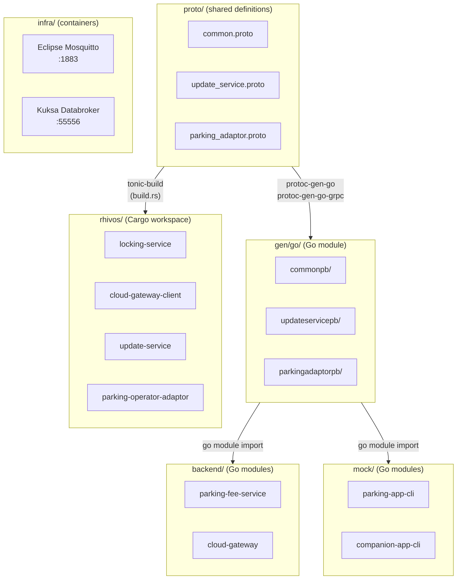
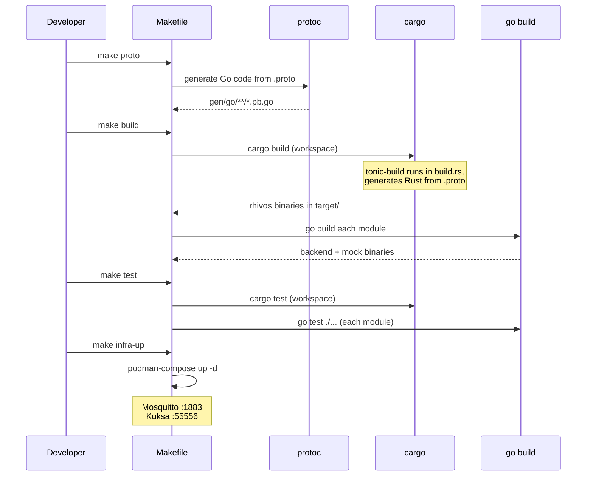

# Design Document: Project Setup (Phase 1.2)

## Overview

This design establishes the monorepo structure, shared protocol definitions,
build system, skeleton implementations, mock CLI applications, local
development infrastructure, and testing framework for the SDV Parking Demo
System. All design decisions prioritize simplicity and developer ergonomics
for a demo project while maintaining clear boundaries between technology
domains and components.

## Architecture



### Build Pipeline



### Module Responsibilities

1. **proto/** — single source of truth for all gRPC service contracts
2. **gen/go/** — auto-generated Go code from proto definitions (its own Go module)
3. **rhivos/** — Cargo workspace containing all Rust RHIVOS service skeletons
4. **backend/** — Go modules for cloud backend services
5. **mock/** — Go modules for mock CLI applications simulating Android apps
6. **infra/** — container composition for local development infrastructure
7. **aaos/** — placeholder directory for PARKING_APP (Kotlin, future)
8. **android/** — placeholder directory for COMPANION_APP (Flutter, future)
9. **tests/** — cross-component integration test structure

## Components and Interfaces

### Repository Layout

```
parking-fee-service/                    # repo root
├── Makefile                            # top-level build orchestration
├── go.work                             # Go workspace (links all Go modules)
├── README.md
├── AGENTS.md / CLAUDE.md
│
├── proto/                              # shared .proto definitions
│   ├── common.proto
│   ├── update_service.proto
│   └── parking_adaptor.proto
│
├── gen/                                # generated code
│   └── go/                             # Go generated code (Go module)
│       ├── go.mod
│       ├── commonpb/
│       │   └── common.pb.go
│       ├── updateservicepb/
│       │   ├── update_service.pb.go
│       │   └── update_service_grpc.pb.go
│       └── parkingadaptorpb/
│           ├── parking_adaptor.pb.go
│           └── parking_adaptor_grpc.pb.go
│
├── rhivos/                             # Rust workspace
│   ├── Cargo.toml                      # workspace definition
│   ├── locking-service/
│   │   ├── Cargo.toml
│   │   ├── build.rs                    # tonic-build proto generation
│   │   └── src/
│   │       ├── main.rs
│   │       └── lib.rs
│   ├── cloud-gateway-client/
│   │   ├── Cargo.toml
│   │   ├── build.rs
│   │   └── src/
│   │       ├── main.rs
│   │       └── lib.rs
│   ├── update-service/
│   │   ├── Cargo.toml
│   │   ├── build.rs
│   │   └── src/
│   │       ├── main.rs
│   │       └── lib.rs
│   └── parking-operator-adaptor/
│       ├── Cargo.toml
│       ├── build.rs
│       └── src/
│           ├── main.rs
│           └── lib.rs
│
├── backend/                            # Go backend services
│   ├── parking-fee-service/
│   │   ├── go.mod
│   │   ├── go.sum
│   │   └── main.go
│   └── cloud-gateway/
│       ├── go.mod
│       ├── go.sum
│       └── main.go
│
├── mock/                               # Mock CLI applications (Go)
│   ├── parking-app-cli/
│   │   ├── go.mod
│   │   ├── go.sum
│   │   └── main.go
│   └── companion-app-cli/
│       ├── go.mod
│       ├── go.sum
│       └── main.go
│
├── aaos/                               # AAOS placeholder
│   └── parking-app/
│       └── README.md
│
├── android/                            # Android placeholder
│   └── companion-app/
│       └── README.md
│
├── infra/                              # local infrastructure
│   ├── docker-compose.yml
│   └── mosquitto/
│       └── mosquitto.conf
│
└── tests/                              # cross-component integration tests
    └── integration/
        └── README.md
```

### Proto Service Definitions

#### common.proto

```protobuf
syntax = "proto3";
package parking.common.v1;

option go_package = "github.com/rhadp/parking-fee-service/gen/go/commonpb";

enum AdapterState {
  ADAPTER_STATE_UNKNOWN = 0;
  ADAPTER_STATE_DOWNLOADING = 1;
  ADAPTER_STATE_INSTALLING = 2;
  ADAPTER_STATE_RUNNING = 3;
  ADAPTER_STATE_STOPPED = 4;
  ADAPTER_STATE_ERROR = 5;
  ADAPTER_STATE_OFFLOADING = 6;
}

message AdapterInfo {
  string adapter_id = 1;
  string operator_id = 2;
  string image_ref = 3;
  string checksum_sha256 = 4;
  AdapterState state = 5;
}

message ErrorDetails {
  string code = 1;
  string message = 2;
  map<string, string> details = 3;
  int64 timestamp = 4;
}
```

#### update_service.proto

```protobuf
syntax = "proto3";
package parking.update.v1;

option go_package = "github.com/rhadp/parking-fee-service/gen/go/updateservicepb";

import "common.proto";

service UpdateService {
  rpc InstallAdapter(InstallAdapterRequest) returns (InstallAdapterResponse);
  rpc WatchAdapterStates(WatchAdapterStatesRequest) returns (stream AdapterStateEvent);
  rpc ListAdapters(ListAdaptersRequest) returns (ListAdaptersResponse);
  rpc RemoveAdapter(RemoveAdapterRequest) returns (RemoveAdapterResponse);
  rpc GetAdapterStatus(GetAdapterStatusRequest) returns (GetAdapterStatusResponse);
}

message InstallAdapterRequest {
  string image_ref = 1;
  string checksum_sha256 = 2;
}

message InstallAdapterResponse {
  string job_id = 1;
  string adapter_id = 2;
  parking.common.v1.AdapterState state = 3;
}

message WatchAdapterStatesRequest {}

message AdapterStateEvent {
  string adapter_id = 1;
  parking.common.v1.AdapterState old_state = 2;
  parking.common.v1.AdapterState new_state = 3;
  int64 timestamp = 4;
}

message ListAdaptersRequest {}

message ListAdaptersResponse {
  repeated parking.common.v1.AdapterInfo adapters = 1;
}

message RemoveAdapterRequest {
  string adapter_id = 1;
}

message RemoveAdapterResponse {}

message GetAdapterStatusRequest {
  string adapter_id = 1;
}

message GetAdapterStatusResponse {
  parking.common.v1.AdapterInfo adapter = 1;
}
```

#### parking_adaptor.proto

```protobuf
syntax = "proto3";
package parking.adaptor.v1;

option go_package = "github.com/rhadp/parking-fee-service/gen/go/parkingadaptorpb";

service ParkingAdaptor {
  rpc StartSession(StartSessionRequest) returns (StartSessionResponse);
  rpc StopSession(StopSessionRequest) returns (StopSessionResponse);
  rpc GetStatus(GetStatusRequest) returns (GetStatusResponse);
  rpc GetRate(GetRateRequest) returns (GetRateResponse);
}

message StartSessionRequest {
  string vehicle_id = 1;
  string zone_id = 2;
}

message StartSessionResponse {
  string session_id = 1;
  string status = 2;
}

message StopSessionRequest {
  string session_id = 1;
}

message StopSessionResponse {
  string session_id = 1;
  double total_fee = 2;
  int64 duration_seconds = 3;
  string currency = 4;
}

message GetStatusRequest {
  string session_id = 1;
}

message GetStatusResponse {
  string session_id = 1;
  bool active = 2;
  int64 start_time = 3;
  double current_fee = 4;
  string currency = 5;
}

message GetRateRequest {
  string zone_id = 1;
}

message GetRateResponse {
  double rate_per_hour = 1;
  string currency = 2;
  string zone_name = 3;
}
```

### Rust Workspace Configuration

The Cargo workspace root (`rhivos/Cargo.toml`) defines all members:

```toml
[workspace]
members = [
    "locking-service",
    "cloud-gateway-client",
    "update-service",
    "parking-operator-adaptor",
]
resolver = "2"

[workspace.dependencies]
tonic = "0.12"
prost = "0.13"
prost-types = "0.13"
tokio = { version = "1", features = ["full"] }
tonic-build = "0.12"
```

Each member's `build.rs` uses `tonic-build` to compile protos from `../proto/`
(resolved relative to the workspace root). Proto paths are configured via
`tonic_build::configure().proto_path("../../proto/")`.

Each member's skeleton `main.rs`:
- Initializes a tokio runtime
- Prints a "not implemented" message and exits

Each member's skeleton `lib.rs`:
- Re-exports generated proto types
- Contains a stub service implementation returning `tonic::Status::unimplemented`

### Go Module Configuration

A Go workspace (`go.work` at repo root) links all Go modules:

```go
go 1.22

use (
    ./gen/go
    ./backend/parking-fee-service
    ./backend/cloud-gateway
    ./mock/parking-app-cli
    ./mock/companion-app-cli
)
```

All Go modules use the import path prefix
`github.com/rhadp/parking-fee-service/`.

### Go Backend Skeletons

**PARKING_FEE_SERVICE** (`backend/parking-fee-service/main.go`):
- Starts an HTTP server on `:8080` (configurable via `PORT` env var)
- Registers handler stubs:
  - `GET /health` — returns `200 OK` with `{"status": "ok"}`
  - `GET /operators` — returns `501 Not Implemented`
  - `GET /operators/{id}/adapter` — returns `501 Not Implemented`
- Uses standard library `net/http` (no external framework)

**CLOUD_GATEWAY** (`backend/cloud-gateway/main.go`):
- Starts an HTTP server on `:8081` (configurable via `PORT` env var)
- Registers handler stubs:
  - `GET /health` — returns `200 OK` with `{"status": "ok"}`
  - `POST /vehicles/{vin}/commands` — returns `501 Not Implemented`
- Prints "MQTT client: not connected" on startup (MQTT integration deferred)
- Uses standard library `net/http`

### Mock CLI Applications

Both mocks use `github.com/spf13/cobra` for CLI structure.

**Mock PARKING_APP CLI** (`mock/parking-app-cli`):

```
parking-app-cli [command]

Commands:
  lookup          Query PARKING_FEE_SERVICE for operators by location
  install         Request adapter installation via UPDATE_SERVICE
  watch           Watch adapter state changes via UPDATE_SERVICE
  list            List installed adapters via UPDATE_SERVICE
  status          Get adapter status via UPDATE_SERVICE
  start-session   Start a parking session via PARKING_OPERATOR_ADAPTOR
  stop-session    Stop a parking session via PARKING_OPERATOR_ADAPTOR
  get-status      Get parking session status
  get-rate        Get parking rate for a zone

Global Flags:
  --pfs-url string       PARKING_FEE_SERVICE URL (default "http://localhost:8080")
  --update-addr string   UPDATE_SERVICE gRPC address (default "localhost:50051")
  --adaptor-addr string  PARKING_OPERATOR_ADAPTOR gRPC address (default "localhost:50052")
```

**Mock COMPANION_APP CLI** (`mock/companion-app-cli`):

```
companion-app-cli [command]

Commands:
  lock       Send lock command via CLOUD_GATEWAY
  unlock     Send unlock command via CLOUD_GATEWAY
  status     Query vehicle status via CLOUD_GATEWAY

Global Flags:
  --gateway-url string   CLOUD_GATEWAY URL (default "http://localhost:8081")
  --vin string           Vehicle identification number (default "VIN12345")
  --token string         Bearer token for authentication
```

All subcommands in both CLI apps are stubs that print
"not implemented: <command>" to stderr and exit with code 1.

### Local Infrastructure

#### docker-compose.yml

```yaml
services:
  mosquitto:
    image: eclipse-mosquitto:2
    ports:
      - "1883:1883"
    volumes:
      - ./mosquitto/mosquitto.conf:/mosquitto/config/mosquitto.conf:ro

  kuksa-databroker:
    image: ghcr.io/eclipse-kuksa/kuksa-databroker:0.5.1
    ports:
      - "55556:55555"
    command: ["--address", "0.0.0.0"]
```

#### mosquitto.conf

```
listener 1883
allow_anonymous true
```

### Port Assignments (Local Development)

| Service                    | Protocol | Port  |
|----------------------------|----------|-------|
| Eclipse Mosquitto          | MQTT     | 1883  |
| Eclipse Kuksa Databroker   | gRPC     | 55556 |
| PARKING_FEE_SERVICE        | HTTP     | 8080  |
| CLOUD_GATEWAY              | HTTP     | 8081  |
| UPDATE_SERVICE             | gRPC     | 50051 |
| PARKING_OPERATOR_ADAPTOR   | gRPC     | 50052 |

### Makefile Targets

| Target       | Description                                        |
|--------------|----------------------------------------------------|
| `build`      | Build all Rust and Go components                   |
| `test`       | Run all unit tests (Rust + Go)                     |
| `lint`       | Run linters: `cargo clippy`, `go vet`              |
| `proto`      | Regenerate Go code from `.proto` files             |
| `clean`      | Remove all build artifacts                         |
| `infra-up`   | Start local infrastructure (Mosquitto, Kuksa)      |
| `infra-down` | Stop local infrastructure                          |
| `check`      | Run `build` + `test` + `lint` in sequence          |

The Makefile detects missing tools (`rustc`, `go`, `protoc`, `podman`/`docker`)
and prints a clear error message naming the missing tool before failing.

## Data Models

No persistent data models in this spec. All state is transient (build
artifacts, running containers). Data models for business logic are defined
in later specs.

### Configuration

Each component uses environment variables for runtime configuration
(no config files at this stage):

| Variable     | Component            | Default             | Description              |
|-------------|----------------------|---------------------|--------------------------|
| `PORT`      | parking-fee-service  | `8080`              | HTTP listen port         |
| `PORT`      | cloud-gateway        | `8081`              | HTTP listen port         |

## Operational Readiness

Not applicable for this setup spec. Observability, rollout, and migration
concerns are addressed in component-specific specs (Phase 2+).

## Correctness Properties

### Property 1: Build Completeness

*For any* component (Rust crate or Go module) in the repository, building it
SHALL produce zero compilation errors.

**Validates: Requirements 01-REQ-3.2, 01-REQ-4.2**

### Property 2: Proto-to-Code Consistency

*For any* `.proto` file in the proto directory, the generated Rust code (via
tonic-build) and Go code (via protoc-gen-go) SHALL both compile without errors,
and SHALL define the same set of service methods and message types.

**Validates: Requirements 01-REQ-2.4, 01-REQ-3.4, 01-REQ-4.4**

### Property 3: Test Isolation

*For any* unit test in the repository, running it without any infrastructure
services (Mosquitto, Kuksa) SHALL produce no failures.

**Validates: Requirement 01-REQ-8.3**

### Property 4: Mock CLI Usability

*For any* mock CLI application, invoking it with no arguments or with `--help`
SHALL exit with code 0 and produce non-empty output on stdout.

**Validates: Requirements 01-REQ-5.3, 01-REQ-5.4**

### Property 5: Infrastructure Lifecycle Idempotency

*For any* sequence of `make infra-up` and `make infra-down` operations, the
system SHALL reach a consistent state: either all infrastructure services are
running and reachable, or all are stopped and ports released.

**Validates: Requirements 01-REQ-7.4, 01-REQ-7.5**

### Property 6: Clean Build Reproducibility

*For any* component, running `make clean` followed by `make build` SHALL
produce the same result (successful build, same binary outputs) as building
from a fresh checkout with no prior build artifacts.

**Validates: Requirements 01-REQ-6.2, 01-REQ-6.6**

### Property 7: Toolchain Detection

*For any* missing required tool (rustc, cargo, go, protoc, podman), the build
system SHALL fail with an error message that names the specific missing tool,
rather than producing an obscure error.

**Validates: Requirements 01-REQ-6.E1, 01-REQ-7.E2**

## Error Handling

| Error Condition | Behavior | Requirement |
|----------------|----------|-------------|
| Missing Rust toolchain | Makefile prints "Error: rustc not found" and exits 1 | 01-REQ-6.E1 |
| Missing Go toolchain | Makefile prints "Error: go not found" and exits 1 | 01-REQ-6.E1 |
| Missing protoc | Makefile prints "Error: protoc not found" and exits 1 | 01-REQ-6.E1 |
| Missing container runtime | Makefile prints "Error: podman/docker not found" and exits 1 | 01-REQ-7.E2 |
| Malformed .proto file | cargo build / protoc fails with proto file reference | 01-REQ-3.E1, 01-REQ-4.E1 |
| Port already in use | podman-compose reports bind error with port number | 01-REQ-7.E1 |
| Unknown CLI command | Mock app prints error and exits with non-zero code | 01-REQ-5.E1 |
| Build failure in one component | Makefile reports failure, continues others where possible | 01-REQ-6.E2 |

## Technology Stack

| Category | Technology | Version | Purpose |
|----------|-----------|---------|---------|
| Language | Rust | 1.75+ (edition 2021) | RHIVOS services |
| Language | Go | 1.22+ | Backend services, mock CLI apps |
| Serialization | Protocol Buffers (proto3) | 3.x | gRPC interface definitions |
| Rust gRPC | tonic | 0.12 | gRPC server/client framework |
| Rust protobuf | prost | 0.13 | Protobuf code generation |
| Rust async | tokio | 1.x | Async runtime |
| Rust build | tonic-build | 0.12 | Proto code generation at build time |
| Go gRPC | google.golang.org/grpc | 1.65+ | gRPC server/client framework |
| Go protobuf | google.golang.org/protobuf | 1.34+ | Protobuf runtime |
| Go protoc plugin | protoc-gen-go | 1.34+ | Go code generation from proto |
| Go protoc plugin | protoc-gen-go-grpc | 1.4+ | Go gRPC code generation |
| Go CLI | github.com/spf13/cobra | 1.8+ | CLI framework for mock apps |
| MQTT broker | Eclipse Mosquitto | 2.x | Local MQTT for development |
| Vehicle signals | Eclipse Kuksa Databroker | 0.5.x | VSS gRPC signal broker |
| Containers | Podman (or Docker) | 4.x+ | Container runtime for infra |
| Composition | docker-compose (podman-compose) | 2.x | Container orchestration |
| Build | GNU Make | 3.81+ | Top-level build orchestration |
| Linting (Rust) | clippy | bundled | Rust linter |
| Linting (Go) | go vet | bundled | Go linter |

## Definition of Done

A task group is complete when ALL of the following are true:

1. All subtasks within the group are checked off (`[x]`)
2. All spec tests (`test_spec.md` entries) for the task group pass
3. All property tests for the task group pass
4. All previously passing tests still pass (no regressions)
5. No linter warnings or errors introduced
6. Code is committed on a feature branch and pushed to remote
7. Feature branch is merged back to `develop`
8. `tasks.md` checkboxes are updated to reflect completion

## Testing Strategy

### Unit Tests

Each Rust crate and Go module includes at least one placeholder unit test
that validates the component compiles and its test framework is configured.
Unit tests do not require infrastructure services.

- **Rust:** Standard `#[test]` functions in `lib.rs` or dedicated test modules.
  Run via `cargo test` in the workspace root.
- **Go:** Standard `_test.go` files with `func Test*` functions. Run via
  `go test ./...` in each module.

### Build Verification Tests

The Makefile `check` target runs `build` + `test` + `lint` sequentially,
serving as a pre-commit verification gate.

### Infrastructure Tests

Infrastructure correctness (ports reachable, services responding) is verified
by manual or scripted checks after `make infra-up`:

- Mosquitto: `mosquitto_pub -t test -m hello` / `mosquitto_sub -t test`
- Kuksa: `grpcurl -plaintext localhost:55556 list`

These are not automated in this spec; integration test automation is
addressed in Phase 2 specs.

### Property Test Approach

Properties 1–7 are verified by the following test types:

| Property | Test Approach |
|----------|---------------|
| P1: Build Completeness | `make build` exits 0 |
| P2: Proto Consistency | `make proto && make build` exits 0; verify generated files exist |
| P3: Test Isolation | `make infra-down && make test` exits 0 |
| P4: Mock CLI Usability | Run each mock binary with `--help`, assert exit 0 + non-empty stdout |
| P5: Infra Idempotency | Run `make infra-up` twice, verify services reachable; run `make infra-down` twice, verify ports free |
| P6: Clean Reproducibility | `make clean && make build`, verify exit 0 |
| P7: Toolchain Detection | Temporarily hide a tool from PATH, run make, verify error message names the tool |
