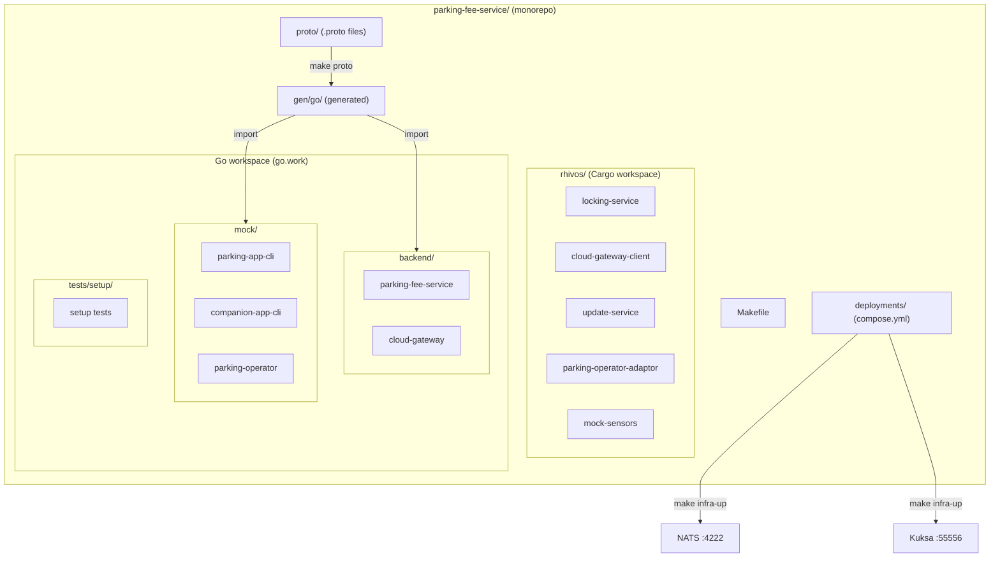

# Design Document: Project Setup

## Overview

This design establishes the monorepo foundation for the SDV Parking Demo System. It defines the directory layout, workspace configurations for Rust and Go, skeleton binary structure, Protocol Buffer definitions, local infrastructure via Podman Compose, and a root Makefile for build orchestration. All design decisions prioritize developer ergonomics and downstream spec compatibility.

## Architecture



### Module Responsibilities

1. **rhivos/** — Cargo workspace housing all Rust RHIVOS service crates and mock sensors.
2. **backend/** — Go module containing backend HTTP/gRPC services.
3. **mock/** — Go module containing mock CLI apps that simulate Android applications.
4. **proto/** — Single source of truth for all `.proto` interface definitions.
5. **gen/go/** — Auto-generated Go code from proto files (not checked in).
6. **deployments/** — Podman Compose configuration for local NATS and Kuksa Databroker.
7. **tests/setup/** — Go module with shell-script-driven verification tests for project structure.
8. **Makefile** — Root build orchestration across all toolchains.

## Components and Interfaces

### Makefile Targets

| Target | Command | Description |
|--------|---------|-------------|
| `build` | `cargo build` + `go build ./...` | Compile all Rust and Go components |
| `test` | `cargo test` + `go test ./...` | Run all unit tests |
| `lint` | `cargo clippy` + `go vet ./...` | Run linters |
| `check` | `build` + `test` + `lint` | Full verification pipeline |
| `proto` | `protoc` with Go plugins | Generate Go code from .proto files |
| `infra-up` | `podman compose up -d` | Start infrastructure containers |
| `infra-down` | `podman compose down` | Stop infrastructure containers |
| `clean` | `cargo clean` + `go clean` + rm artifacts | Remove all build artifacts |

### Skeleton Binary Interface

All skeleton binaries follow the same pattern:

```
$ ./binary-name
binary-name v0.1.0 - <one-line description>

Usage: binary-name [options]

This is a skeleton implementation. See spec XX for full functionality.
```

Exit code: 0 in all cases (including unrecognized flags).

### Proto Service Definitions

#### common.proto

```protobuf
syntax = "proto3";
package parking.common;
option go_package = "github.com/rhadp/parking-fee-service/gen/go/commonpb";

enum AdapterState {
  ADAPTER_STATE_UNKNOWN = 0;
  ADAPTER_STATE_DOWNLOADING = 1;
  ADAPTER_STATE_INSTALLING = 2;
  ADAPTER_STATE_RUNNING = 3;
  ADAPTER_STATE_STOPPED = 4;
  ADAPTER_STATE_ERROR = 5;
  ADAPTER_STATE_OFFLOADING = 6;
}

message AdapterInfo {
  string adapter_id = 1;
  string operator_id = 2;
  string image_ref = 3;
  string checksum_sha256 = 4;
  string version = 5;
  AdapterState state = 6;
}

message ErrorDetails {
  string code = 1;
  string message = 2;
  map<string, string> details = 3;
  int64 timestamp = 4;
}
```

#### update_service.proto

```protobuf
syntax = "proto3";
package parking.updateservice;
option go_package = "github.com/rhadp/parking-fee-service/gen/go/updateservicepb";

import "common.proto";

service UpdateService {
  rpc InstallAdapter(InstallAdapterRequest) returns (InstallAdapterResponse);
  rpc WatchAdapterStates(WatchAdapterStatesRequest) returns (stream AdapterStateEvent);
  rpc ListAdapters(ListAdaptersRequest) returns (ListAdaptersResponse);
  rpc RemoveAdapter(RemoveAdapterRequest) returns (RemoveAdapterResponse);
  rpc GetAdapterStatus(GetAdapterStatusRequest) returns (GetAdapterStatusResponse);
}

message InstallAdapterRequest {
  string image_ref = 1;
  string checksum_sha256 = 2;
}

message InstallAdapterResponse {
  string job_id = 1;
  string adapter_id = 2;
  parking.common.AdapterState state = 3;
}

message WatchAdapterStatesRequest {}

message AdapterStateEvent {
  string adapter_id = 1;
  parking.common.AdapterState old_state = 2;
  parking.common.AdapterState new_state = 3;
  int64 timestamp = 4;
}

message ListAdaptersRequest {}

message ListAdaptersResponse {
  repeated parking.common.AdapterInfo adapters = 1;
}

message RemoveAdapterRequest {
  string adapter_id = 1;
}

message RemoveAdapterResponse {
  bool success = 1;
}

message GetAdapterStatusRequest {
  string adapter_id = 1;
}

message GetAdapterStatusResponse {
  parking.common.AdapterInfo adapter = 1;
}
```

#### parking_adaptor.proto

```protobuf
syntax = "proto3";
package parking.adaptor;
option go_package = "github.com/rhadp/parking-fee-service/gen/go/parkingadaptorpb";

service ParkingAdaptor {
  rpc StartSession(StartSessionRequest) returns (StartSessionResponse);
  rpc StopSession(StopSessionRequest) returns (StopSessionResponse);
  rpc GetStatus(GetStatusRequest) returns (GetStatusResponse);
  rpc GetRate(GetRateRequest) returns (GetRateResponse);
}

message StartSessionRequest {
  string vehicle_id = 1;
  string zone_id = 2;
}

message StartSessionResponse {
  string session_id = 1;
  string status = 2;
}

message StopSessionRequest {
  string session_id = 1;
}

message StopSessionResponse {
  string session_id = 1;
  string status = 2;
  double total_fee = 3;
  int64 duration_seconds = 4;
}

message GetStatusRequest {
  string session_id = 1;
}

message GetStatusResponse {
  string session_id = 1;
  string status = 2;
  int64 started_at = 3;
  double accumulated_fee = 4;
}

message GetRateRequest {
  string zone_id = 1;
}

message GetRateResponse {
  string zone_id = 1;
  string rate_type = 2;
  double rate_value = 3;
  string currency = 4;
}
```

## Data Models

### Podman Compose Configuration (deployments/compose.yml)

```yaml
services:
  nats:
    image: docker.io/nats:latest
    ports:
      - "4222:4222"
    volumes:
      - ./nats/nats-server.conf:/etc/nats/nats-server.conf
    command: ["--config", "/etc/nats/nats-server.conf"]

  databroker:
    image: ghcr.io/eclipse-kuksa/kuksa-databroker:latest
    ports:
      - "55556:55555"
    volumes:
      - ./vss-overlay.json:/etc/kuksa/vss-overlay.json
    command: ["--metadata", "/etc/kuksa/vss-overlay.json"]
```

### VSS Overlay (deployments/vss-overlay.json)

Defines custom signals not in the standard VSS tree:

```json
{
  "Vehicle": {
    "type": "branch",
    "children": {
      "Parking": {
        "type": "branch",
        "children": {
          "SessionActive": {
            "type": "sensor",
            "datatype": "boolean",
            "description": "Whether a parking session is currently active"
          }
        }
      },
      "Command": {
        "type": "branch",
        "children": {
          "Door": {
            "type": "branch",
            "children": {
              "Lock": {
                "type": "actuator",
                "datatype": "string",
                "description": "JSON-encoded lock/unlock command request"
              },
              "Response": {
                "type": "sensor",
                "datatype": "string",
                "description": "JSON-encoded command execution result"
              }
            }
          }
        }
      }
    }
  }
}
```

### NATS Configuration (deployments/nats/nats-server.conf)

```
port: 4222
max_payload: 1048576
```

### Directory Layout with Key Files

```
parking-fee-service/
  Makefile
  go.work
  proto/
    common.proto
    update_service.proto
    parking_adaptor.proto
  gen/go/
    commonpb/
    updateservicepb/
    parkingadaptorpb/
  rhivos/
    Cargo.toml                          # Workspace root
    locking-service/
      Cargo.toml
      src/main.rs
    cloud-gateway-client/
      Cargo.toml
      src/main.rs
    update-service/
      Cargo.toml
      src/main.rs
    parking-operator-adaptor/
      Cargo.toml
      src/main.rs
    mock-sensors/
      Cargo.toml
      src/bin/location-sensor.rs
      src/bin/speed-sensor.rs
      src/bin/door-sensor.rs
      src/lib.rs                        # Shared DATA_BROKER client code
  backend/
    go.mod
    parking-fee-service/
      main.go
      main_test.go
    cloud-gateway/
      main.go
      main_test.go
  mock/
    go.mod
    parking-app-cli/
      main.go
      main_test.go
    companion-app-cli/
      main.go
      main_test.go
    parking-operator/
      main.go
      main_test.go
  android/
    README.md                           # Placeholder
  mobile/
    README.md                           # Placeholder
  deployments/
    compose.yml
    nats/nats-server.conf
    vss-overlay.json
  tests/
    setup/
      go.mod
      setup_test.go
```

## Operational Readiness

This is a project setup spec — no runtime services are deployed. Operational readiness concerns are deferred to component specs 02-09.

- **Local infrastructure health:** `make infra-up` starts containers; developers verify by checking `podman ps` output.
- **Rollback:** All changes are file-system-level. Rollback is `git checkout`.
- **Migration:** Not applicable — this is the initial setup (greenfield).

## Correctness Properties

### Property 1: Rust Workspace Completeness

*For any* Rust component listed in the PRD (locking-service, cloud-gateway-client, update-service, parking-operator-adaptor, mock-sensors), the Cargo workspace SHALL include that component as a member and `cargo build` SHALL produce its binary without errors.

**Validates: Requirements 01-REQ-2.1, 01-REQ-2.2, 01-REQ-4.3**

### Property 2: Go Workspace Completeness

*For any* Go component listed in the PRD (parking-fee-service, cloud-gateway, parking-app-cli, companion-app-cli, parking-operator), the Go workspace SHALL include that component's module and `go build` SHALL produce its binary without errors.

**Validates: Requirements 01-REQ-3.1, 01-REQ-3.2, 01-REQ-4.4**

### Property 3: Skeleton Exit Behavior

*For any* skeleton binary produced by this spec, invoking the binary with no arguments or with any combination of arguments SHALL result in exit code 0.

**Validates: Requirements 01-REQ-4.1, 01-REQ-4.2, 01-REQ-4.E1**

### Property 4: Proto Generation Idempotency

*For any* sequence of `make proto` invocations, the generated Go code in `gen/go/` SHALL be byte-identical after each invocation (deterministic output).

**Validates: Requirements 01-REQ-5.5, 01-REQ-5.6**

### Property 5: Infrastructure Idempotency

*For any* number of consecutive `make infra-up` invocations, the system SHALL have exactly one instance of each infrastructure container running (NATS, Kuksa Databroker).

**Validates: Requirements 01-REQ-6.2, 01-REQ-6.E2**

### Property 6: Directory Structure Completeness

*For any* directory listed in the PRD directory structure, that directory SHALL exist after project setup and SHALL contain at least one file (not counting `.gitkeep`).

**Validates: Requirements 01-REQ-1.1, 01-REQ-1.2, 01-REQ-1.3, 01-REQ-1.4, 01-REQ-1.5, 01-REQ-1.6**

### Property 7: Test Runner Discovery

*For any* component (Rust crate or Go module) in the project, the corresponding test runner (`cargo test` or `go test`) SHALL discover and execute at least one test.

**Validates: Requirements 01-REQ-8.1, 01-REQ-8.2, 01-REQ-8.4**

### Property 8: Proto Service Completeness

*For any* gRPC service defined in the PRD (UpdateService with 5 RPCs, ParkingAdaptor with 4 RPCs), the corresponding `.proto` file SHALL define that service with all specified RPC methods.

**Validates: Requirements 01-REQ-5.2, 01-REQ-5.3, 01-REQ-5.4**

## Error Handling

| Error Condition | Behavior | Requirement |
|----------------|----------|-------------|
| Required directory missing | `make check` reports missing directory | 01-REQ-1.E1 |
| Cargo workspace member missing | `cargo build` fails with member error | 01-REQ-2.E1 |
| Go module missing from workspace | `go build` fails with module error | 01-REQ-3.E1 |
| Unrecognized flag on skeleton binary | Print usage, exit 0 | 01-REQ-4.E1 |
| `protoc` not installed | `make proto` fails with "protoc required" error | 01-REQ-5.E1 |
| Podman not running | `make infra-up` fails with "Podman required" error | 01-REQ-6.E1 |
| Infrastructure already running | `make infra-up` is idempotent, no duplicates | 01-REQ-6.E2 |
| Toolchain not installed | Makefile target fails with missing toolchain error | 01-REQ-7.E1 |

## Technology Stack

| Technology | Version | Purpose |
|-----------|---------|---------|
| Rust | edition 2021, toolchain 1.75+ | RHIVOS service skeletons |
| Go | 1.22+ | Backend services, mock apps, setup tests |
| Protocol Buffers | proto3, protoc 3.x | Interface definitions |
| protoc-gen-go | 1.34+ | Go protobuf code generation |
| protoc-gen-go-grpc | 1.4+ | Go gRPC code generation |
| Podman | 4.x+ | Container runtime |
| Podman Compose | latest | Multi-container orchestration |
| GNU Make | 3.81+ | Build orchestration |
| NATS server | latest (container) | Message broker |
| Eclipse Kuksa Databroker | latest (container) | Vehicle signal broker |

## Definition of Done

A task group is complete when ALL of the following are true:

1. All subtasks within the group are checked off (`[x]`)
2. All spec tests (`test_spec.md` entries) for the task group pass
3. All property tests for the task group pass
4. All previously passing tests still pass (no regressions)
5. No linter warnings or errors introduced
6. Code is committed on a feature branch and pushed to remote
7. Feature branch is merged back to `main`
8. `tasks.md` checkboxes are updated to reflect completion

## Testing Strategy

- **Unit tests (placeholder):** Each Rust crate and Go module contains at least one trivial test that verifies the component compiles. These run via `cargo test` and `go test`.
- **Integration tests (setup verification):** The `tests/setup/` Go module contains shell-script-driven tests that verify:
  - All expected directories exist
  - All binaries compile successfully
  - Proto code generation produces expected packages
  - Infrastructure containers start and stop cleanly
- **Property tests:** Property-based testing is not directly applicable to project setup (which is structural). Properties are verified by integration tests that check structural invariants (e.g., all binaries exit 0, all directories exist).
- **Makefile target tests:** Each Makefile target is exercised by the setup verification tests to ensure the build pipeline is functional end-to-end.
