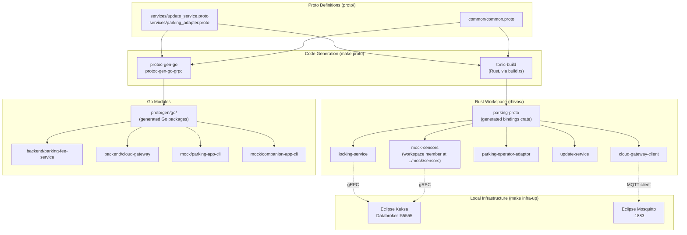
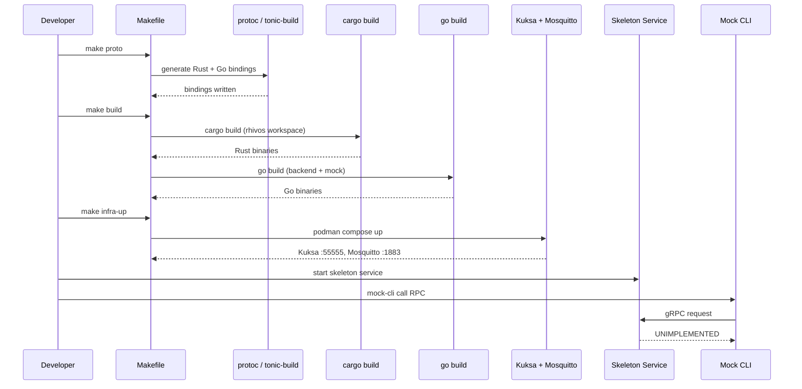

# Design Document: Repository Setup

## Overview

This design describes the foundational project layout, build toolchain, shared
protocol buffer definitions, local development infrastructure, and skeleton
service implementations for the SDV Parking Demo System. The goal is to produce
a monorepo where every service compiles, tests run, local middleware is
available, and mock CLI tools can exercise service stubs — all before any
business logic is implemented.

## Architecture

### Build Toolchain



### Development Workflow



### Module Responsibilities

1. **`proto/`** — Single source of truth for all gRPC service contracts and
   shared message types.
2. **`rhivos/parking-proto/`** — Rust crate that generates tonic bindings from
   proto files via `build.rs`. All Rust services depend on this crate.
3. **`rhivos/{service}/`** — Individual Rust service crates. In this spec, each
   contains a skeleton `main.rs` that registers stub handlers.
4. **`proto/gen/go/`** — Generated Go packages from proto files. Committed to
   the repo for convenience (standard Go proto workflow).
5. **`backend/{service}/`** — Individual Go service modules. In this spec, each
   contains a skeleton `main.go`.
6. **`mock/parking-app-cli/`** — Go CLI simulating the PARKING_APP for gRPC
   integration testing.
7. **`mock/companion-app-cli/`** — Go CLI simulating the COMPANION_APP for REST
   integration testing.
8. **`mock/sensors/`** — Rust CLI publishing mock VSS signals to Kuksa
   Databroker.
9. **`infra/`** — Container composition and configuration for local middleware.
10. **`containers/`** — Containerfiles for building OCI images of each service.
11. **`Makefile`** — Root orchestrator delegating to per-domain build systems.

## Components and Interfaces

### Proto Definitions

#### `proto/common/common.proto`

```protobuf
syntax = "proto3";
package parking.common;
option go_package = "github.com/rhadp/parking-fee-service/proto/gen/go/common";

message Location {
  double latitude = 1;
  double longitude = 2;
}

message VehicleId {
  string vin = 1;
}

message AdapterInfo {
  string adapter_id = 1;
  string name = 2;
  string image_ref = 3;
  string checksum = 4;
  string version = 5;
}

enum AdapterState {
  ADAPTER_STATE_UNKNOWN = 0;
  ADAPTER_STATE_DOWNLOADING = 1;
  ADAPTER_STATE_INSTALLING = 2;
  ADAPTER_STATE_RUNNING = 3;
  ADAPTER_STATE_STOPPED = 4;
  ADAPTER_STATE_ERROR = 5;
  ADAPTER_STATE_OFFLOADING = 6;
}

message ErrorDetails {
  string code = 1;
  string message = 2;
  map<string, string> details = 3;
  int64 timestamp = 4;
}
```

#### `proto/services/update_service.proto`

```protobuf
syntax = "proto3";
package parking.services.update;
option go_package = "github.com/rhadp/parking-fee-service/proto/gen/go/services/update";

import "common/common.proto";

service UpdateService {
  rpc InstallAdapter(InstallAdapterRequest) returns (InstallAdapterResponse);
  rpc WatchAdapterStates(WatchAdapterStatesRequest) returns (stream AdapterStateEvent);
  rpc ListAdapters(ListAdaptersRequest) returns (ListAdaptersResponse);
  rpc RemoveAdapter(RemoveAdapterRequest) returns (RemoveAdapterResponse);
  rpc GetAdapterStatus(GetAdapterStatusRequest) returns (GetAdapterStatusResponse);
}

message InstallAdapterRequest {
  string image_ref = 1;
  string checksum = 2;
}

message InstallAdapterResponse {
  string job_id = 1;
  string adapter_id = 2;
  parking.common.AdapterState state = 3;
}

message WatchAdapterStatesRequest {}

message AdapterStateEvent {
  string adapter_id = 1;
  parking.common.AdapterState old_state = 2;
  parking.common.AdapterState new_state = 3;
  int64 timestamp = 4;
}

message ListAdaptersRequest {}

message ListAdaptersResponse {
  repeated parking.common.AdapterInfo adapters = 1;
}

message RemoveAdapterRequest {
  string adapter_id = 1;
}

message RemoveAdapterResponse {}

message GetAdapterStatusRequest {
  string adapter_id = 1;
}

message GetAdapterStatusResponse {
  parking.common.AdapterInfo info = 1;
  parking.common.AdapterState state = 2;
}
```

#### `proto/services/parking_adapter.proto`

```protobuf
syntax = "proto3";
package parking.services.adapter;
option go_package = "github.com/rhadp/parking-fee-service/proto/gen/go/services/adapter";

import "common/common.proto";

service ParkingAdapter {
  rpc StartSession(StartSessionRequest) returns (StartSessionResponse);
  rpc StopSession(StopSessionRequest) returns (StopSessionResponse);
  rpc GetStatus(GetStatusRequest) returns (GetStatusResponse);
  rpc GetRate(GetRateRequest) returns (GetRateResponse);
}

message StartSessionRequest {
  parking.common.VehicleId vehicle_id = 1;
  string zone_id = 2;
  int64 timestamp = 3;
}

message StartSessionResponse {
  string session_id = 1;
  string status = 2;
}

message StopSessionRequest {
  string session_id = 1;
  int64 timestamp = 2;
}

message StopSessionResponse {
  string status = 1;
  double total_fee = 2;
  int64 duration_seconds = 3;
}

message GetStatusRequest {
  string session_id = 1;
}

message GetStatusResponse {
  string session_id = 1;
  bool active = 2;
  int64 start_time = 3;
  double current_fee = 4;
}

message GetRateRequest {
  string zone_id = 1;
}

message GetRateResponse {
  string zone_id = 1;
  double rate_per_hour = 2;
  string currency = 3;
}
```

### Makefile Targets

| Target | Command | Behavior |
|--------|---------|----------|
| `build` | `make build` | Runs `cargo build` in `rhivos/` and `go build ./...` for each Go module |
| `test` | `make test` | Runs `cargo test` in `rhivos/` and `go test ./...` for each Go module |
| `proto` | `make proto` | Runs `protoc` for Go generation; Rust uses `tonic-build` via `cargo build` |
| `infra-up` | `make infra-up` | Runs `podman compose up -d` in `infra/` |
| `infra-down` | `make infra-down` | Runs `podman compose down` in `infra/` |
| `infra-status` | `make infra-status` | Runs `podman compose ps` in `infra/` |
| `lint` | `make lint` | Runs `cargo clippy` and `go vet` / `golangci-lint` |
| `clean` | `make clean` | Runs `cargo clean` in `rhivos/` and removes Go binaries + generated protos |
| `build-containers` | `make build-containers` | Builds Containerfiles for all services via `podman build` |

### Skeleton Service Behavior

Each skeleton service:

1. Reads a listen address from an environment variable or CLI flag
   (e.g., `--listen-addr` / `LISTEN_ADDR`), defaulting to `0.0.0.0:{port}`.
2. Starts a gRPC server (Rust services) or HTTP server (Go REST services).
3. Registers all RPCs defined in its proto service definition.
4. Each RPC handler returns `UNIMPLEMENTED` (gRPC code 12) or HTTP 501.
5. Logs the listen address to stdout on startup.
6. Shuts down cleanly on SIGINT/SIGTERM.

Default ports (for local development):

| Service | Port | Protocol |
|---------|------|----------|
| locking-service | 50051 | gRPC |
| cloud-gateway-client | 50052 | gRPC |
| update-service | 50053 | gRPC |
| parking-operator-adaptor | 50054 | gRPC |
| parking-fee-service | 8080 | HTTP/REST |
| cloud-gateway | 8081 | HTTP/REST |
| Kuksa Databroker (infra) | 55555 | gRPC |
| Mosquitto (infra) | 1883 | MQTT |

### Mock CLI Interface

#### `parking-app-cli`

```
parking-app-cli [flags] <command>

Commands:
  install-adapter   Call UpdateService.InstallAdapter
  list-adapters     Call UpdateService.ListAdapters
  remove-adapter    Call UpdateService.RemoveAdapter
  adapter-status    Call UpdateService.GetAdapterStatus
  watch-adapters    Call UpdateService.WatchAdapterStates (streaming)
  start-session     Call ParkingAdapter.StartSession
  stop-session      Call ParkingAdapter.StopSession
  get-status        Call ParkingAdapter.GetStatus
  get-rate          Call ParkingAdapter.GetRate

Global Flags:
  --update-service-addr   Address of UpdateService (default: localhost:50053)
  --adapter-addr          Address of ParkingAdapter (default: localhost:50054)
```

#### `companion-app-cli`

```
companion-app-cli [flags] <command>

Commands:
  lock              POST /api/v1/vehicles/{vin}/lock
  unlock            POST /api/v1/vehicles/{vin}/unlock
  status            GET  /api/v1/vehicles/{vin}/status

Global Flags:
  --gateway-addr    Address of CloudGateway (default: http://localhost:8081)
  --vin             Vehicle VIN (required)
  --token           Bearer token (default: demo-token)
```

#### `mock-sensors` (Rust)

```
mock-sensors [flags] <command>

Commands:
  set-location      Set Vehicle.CurrentLocation (lat, lon)
  set-speed         Set Vehicle.Speed
  set-door          Set Vehicle.Cabin.Door.Row1.DriverSide.IsOpen (true/false)

Global Flags:
  --databroker-addr  Address of Kuksa Databroker (default: localhost:55555)
```

## Data Models

### Project Directory Layout

```
parking-fee-service/
├── Makefile                            # Root build orchestrator
├── proto/
│   ├── common/
│   │   └── common.proto                # Shared message types
│   ├── services/
│   │   ├── update_service.proto        # UPDATE_SERVICE interface
│   │   └── parking_adapter.proto       # PARKING_OPERATOR_ADAPTOR interface
│   └── gen/
│       └── go/                         # Generated Go packages (committed)
│           ├── common/
│           └── services/
│               ├── update/
│               └── adapter/
├── rhivos/
│   ├── Cargo.toml                      # Workspace manifest
│   ├── parking-proto/                  # Shared proto bindings crate
│   │   ├── Cargo.toml
│   │   ├── build.rs                    # tonic-build invocation
│   │   └── src/lib.rs                  # Re-exports generated types
│   ├── locking-service/
│   │   ├── Cargo.toml
│   │   └── src/main.rs
│   ├── cloud-gateway-client/
│   │   ├── Cargo.toml
│   │   └── src/main.rs
│   ├── parking-operator-adaptor/
│   │   ├── Cargo.toml
│   │   └── src/main.rs
│   └── update-service/
│       ├── Cargo.toml
│       └── src/main.rs
├── backend/
│   ├── parking-fee-service/
│   │   ├── go.mod
│   │   ├── go.sum
│   │   └── main.go
│   └── cloud-gateway/
│       ├── go.mod
│       ├── go.sum
│       └── main.go
├── mock/
│   ├── parking-app-cli/
│   │   ├── go.mod
│   │   ├── go.sum
│   │   └── main.go
│   ├── companion-app-cli/
│   │   ├── go.mod
│   │   ├── go.sum
│   │   └── main.go
│   └── sensors/
│       ├── Cargo.toml                  # Workspace member of rhivos/
│       └── src/main.rs
├── android/
│   ├── parking-app/
│   │   └── .gitkeep
│   └── companion-app/
│       └── .gitkeep
├── containers/
│   ├── rhivos/
│   │   ├── locking-service.Containerfile
│   │   ├── cloud-gateway-client.Containerfile
│   │   ├── parking-operator-adaptor.Containerfile
│   │   └── update-service.Containerfile
│   ├── backend/
│   │   ├── parking-fee-service.Containerfile
│   │   └── cloud-gateway.Containerfile
│   └── mock/
│       ├── sensors.Containerfile
│       ├── parking-app-cli.Containerfile
│       └── companion-app-cli.Containerfile
├── infra/
│   ├── compose.yaml                    # Podman/Docker Compose
│   └── config/
│       ├── mosquitto/
│       │   └── mosquitto.conf
│       └── kuksa/
│           └── vss.json                # VSS overlay or config
├── scripts/
│   └── check-tools.sh                  # Verify required tools
├── docs/
│   └── .gitkeep
└── tests/
    └── .gitkeep
```

### Rust Workspace Manifest (`rhivos/Cargo.toml`)

```toml
[workspace]
resolver = "2"
members = [
    "parking-proto",
    "locking-service",
    "cloud-gateway-client",
    "parking-operator-adaptor",
    "update-service",
    "../mock/sensors",
]

[workspace.dependencies]
tonic = "0.12"
prost = "0.13"
prost-types = "0.13"
tokio = { version = "1", features = ["full"] }
clap = { version = "4", features = ["derive"] }
tracing = "0.1"
tracing-subscriber = "0.3"
```

### Infrastructure Composition (`infra/compose.yaml`)

```yaml
services:
  databroker:
    image: ghcr.io/eclipse-kuksa/kuksa-databroker:0.5
    ports:
      - "55555:55555"
    environment:
      - KUKSA_DATA_BROKER_ADDR=0.0.0.0
      - KUKSA_DATA_BROKER_PORT=55555

  mosquitto:
    image: docker.io/library/eclipse-mosquitto:2
    ports:
      - "1883:1883"
    volumes:
      - ./config/mosquitto/mosquitto.conf:/mosquitto/config/mosquitto.conf
```

### Mosquitto Configuration (`infra/config/mosquitto/mosquitto.conf`)

```
listener 1883
allow_anonymous true
```

## Operational Readiness

### Observability

Not in scope for this spec. Skeleton services log to stdout only. Structured
logging and metrics are deferred to implementation specs.

### Rollout / Rollback

Not applicable. This spec establishes the initial project structure.

### Migration / Compatibility

Not applicable. This is the first spec; no existing code to migrate.

## Correctness Properties

### Property 1: Build Completeness

*For any* clean checkout of the repository with required tools installed
(Rust, Go, protoc), THE build system SHALL produce a compiled binary for
every service and mock application defined in the workspace.

**Validates: Requirements 01-REQ-2.2, 01-REQ-3.3, 01-REQ-5.1**

### Property 2: Proto-Binding Consistency

*For any* `.proto` file under `proto/`, THE generated Rust bindings (via
tonic-build) and Go bindings (via protoc-gen-go) SHALL define types and
service traits/interfaces that match the proto file's message and service
definitions exactly.

**Validates: Requirements 01-REQ-4.4, 01-REQ-4.5, 01-REQ-4.6**

### Property 3: Skeleton Contract

*For any* valid gRPC request sent to a skeleton Rust service, THE service
SHALL respond with gRPC status code `UNIMPLEMENTED` (12). *For any* valid
HTTP request sent to a skeleton Go REST service, THE service SHALL respond
with HTTP status 501.

**Validates: Requirements 01-REQ-7.4**

### Property 4: Infrastructure Lifecycle Idempotency

*For any* sequence of `make infra-up` invocations (without intervening
`infra-down`), THE infrastructure SHALL remain functional with Kuksa
Databroker accessible on port 55555 and Mosquitto accessible on port 1883.

**Validates: Requirements 01-REQ-6.2, 01-REQ-6.3, 01-REQ-6.4**

### Property 5: Mock Interface Fidelity

*For any* gRPC method defined in `update_service.proto` or
`parking_adapter.proto`, THE mock `parking-app-cli` SHALL have a
corresponding subcommand that constructs and sends a valid request using the
generated Go bindings from the same proto source.

**Validates: Requirements 01-REQ-8.1, 01-REQ-8.4**

### Property 6: Container Image Validity

*For any* Containerfile in `containers/`, THE built image SHALL contain
exactly one service binary at a documented path and SHALL start without error
when run with no arguments (binding to its default port).

**Validates: Requirements 01-REQ-10.2, 01-REQ-10.4**

### Property 7: Directory Completeness

*For any* component listed in the PRD component table, THE repository SHALL
contain the corresponding directory path as specified in the project layout.

**Validates: Requirements 01-REQ-1.1 through 01-REQ-1.7**

### Property 8: Graceful Startup Failure

*For any* skeleton service or mock CLI started with an unreachable target
address or an occupied port, THE process SHALL exit with a non-zero exit code
and print a human-readable error to stderr.

**Validates: Requirements 01-REQ-7.E1, 01-REQ-8.E1, 01-REQ-9.E1**

## Error Handling

| Error Condition | Behavior | Requirement |
|----------------|----------|-------------|
| Required tool missing (cargo, go, protoc, podman) | Makefile target fails with missing-tool message | 01-REQ-5.E1 |
| Proto syntax error | `protoc` / `tonic-build` fails with line-specific error | 01-REQ-4.E1 |
| Port already in use (infra) | `podman compose up` fails with port conflict message | 01-REQ-6.E1 |
| Container runtime missing | `make infra-up` / `make build-containers` fails with message | 01-REQ-6.E2, 01-REQ-10.E1 |
| Service cannot bind to address | Service exits non-zero, logs error to stderr | 01-REQ-7.E1 |
| Mock CLI target unreachable | CLI prints error, exits non-zero | 01-REQ-8.E1, 01-REQ-9.E1 |
| Cargo dependency conflict | `cargo build` fails with resolution error | 01-REQ-2.E1 |
| Go module resolution failure | `go build` fails with module error | 01-REQ-3.E1 |

## Technology Stack

| Component | Technology | Version | Purpose |
|-----------|-----------|---------|---------|
| Rust services | Rust + Cargo | 1.75+ | RHIVOS service skeletons |
| Rust gRPC | tonic | 0.12.x | gRPC server/client framework |
| Rust protobuf | prost | 0.13.x | Protobuf code generation |
| Rust async runtime | tokio | 1.x | Async runtime |
| Rust CLI parsing | clap | 4.x | CLI argument parsing |
| Go services | Go | 1.22+ | Backend service skeletons |
| Go gRPC | google.golang.org/grpc | latest | gRPC server/client |
| Go protobuf | google.golang.org/protobuf | latest | Protobuf runtime |
| Go HTTP router | net/http (stdlib) | — | REST API skeletons |
| Proto compiler | protoc | 3.x / 27+ | Proto compilation |
| Go proto plugins | protoc-gen-go, protoc-gen-go-grpc | latest | Go code generation |
| Container runtime | Podman | 4.x+ | Container builds, local infra |
| Container composition | Podman Compose / Docker Compose | — | Multi-container orchestration |
| VSS Databroker | Eclipse Kuksa Databroker | 0.5.x | Vehicle signal broker (pre-built) |
| MQTT Broker | Eclipse Mosquitto | 2.x | MQTT for cloud gateway (pre-built) |

## Definition of Done

A task group is complete when ALL of the following are true:

1. All subtasks within the group are checked off (`[x]`)
2. All property tests for the task group pass
3. All previously passing tests still pass (no regressions)
4. No linter warnings or errors introduced
5. Code is committed on a feature branch and pushed to remote
6. Feature branch is merged back to `develop`
7. `tasks.md` checkboxes are updated to reflect completion

## Testing Strategy

### Build Verification Tests

Verify that `make build`, `make test`, `make proto`, and `make lint` complete
successfully on a clean checkout. These are smoke tests run in CI or manually.

### Skeleton Contract Tests

For each Rust skeleton service, write a unit test that:

1. Starts the gRPC server on a random port.
2. Sends a request for each RPC method.
3. Asserts the response status is `UNIMPLEMENTED`.

For each Go skeleton REST service, write a test that:

1. Starts an `httptest.Server`.
2. Sends requests to known endpoints.
3. Asserts HTTP 501 responses.

### Proto Consistency Tests

Verify that the generated Go packages compile and that the generated Rust crate
compiles. The build itself is the test — if `make build` succeeds after
`make proto`, bindings are consistent.

### Infrastructure Tests

After `make infra-up`:

1. Verify Kuksa Databroker responds to a gRPC health check or signal read on
   port 55555.
2. Verify Mosquitto accepts an MQTT connection on port 1883.
3. Run `make infra-down` and verify containers are removed.

### Mock CLI Tests

For each mock CLI subcommand:

1. Verify the CLI parses arguments correctly (unit test on argument parsing).
2. Verify the CLI constructs a valid gRPC/REST request (unit test with a mock
   transport or recorded request).
3. Integration: verify the CLI can connect to a running skeleton service and
   receive an `UNIMPLEMENTED` / 501 response.

### Container Image Tests

For each Containerfile:

1. Build the image and verify it succeeds.
2. Run the image and verify the service starts (binds to default port, logs
   startup message).
3. Verify the image contains only the expected binary (inspect image layers or
   run `ls` inside the container).
