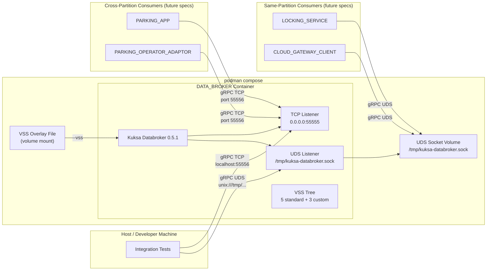

# Design: DATA_BROKER (Spec 02)

## Overview

This design describes the configuration and validation of Eclipse Kuksa Databroker as the DATA_BROKER component. No custom application code is written -- the deliverables are compose.yml updates, VSS overlay validation, and integration tests. The DATA_BROKER is a pre-built container image (`ghcr.io/eclipse-kuksa/kuksa-databroker:0.5.1`) configured for dual listeners (TCP on port 55555/container, 55556/host, and UDS at `/tmp/kuksa-databroker.sock`) running in permissive mode (no token auth). The VSS overlay file from spec 01 provides 3 custom signals; the remaining 5 standard VSS v5.1 signals are built into the Kuksa image.

## Architecture



## Module Responsibilities

| Module | Responsibility |
|--------|---------------|
| `deployments/compose.yml` | Defines the databroker service with pinned image, dual listener args, port mapping, volume mounts for overlay and UDS socket |
| `deployments/vss-overlay.json` | Declares 3 custom VSS signals (Vehicle.Parking.SessionActive, Vehicle.Command.Door.Lock, Vehicle.Command.Door.Response) |
| `tests/databroker/` | Integration tests verifying connectivity, signal availability, read/write, and cross-transport consistency |

## Execution Paths

### Path 1: Container startup

1. Developer runs `podman compose up kuksa-databroker`
2. Compose pulls `ghcr.io/eclipse-kuksa/kuksa-databroker:0.5.1` (if not cached)
3. Container starts with command args: `--address 0.0.0.0 --port 55555 --unix-socket /tmp/kuksa-databroker.sock --vss /vss-overlay.json`
4. Kuksa loads the default VSS v5.1 tree (5 standard signals)
5. Kuksa loads the overlay file (3 custom signals)
6. TCP listener binds to `0.0.0.0:55555`, mapped to host `55556`
7. UDS listener creates socket at `/tmp/kuksa-databroker.sock`
8. DATA_BROKER is ready to accept gRPC connections on both transports

### Path 2: Signal set/get via TCP

1. Client opens gRPC channel to `localhost:55556`
2. Client sends SetRequest for a signal (e.g., `Vehicle.Speed = 50.0`)
3. DATA_BROKER stores the value in its internal signal tree
4. Client sends GetRequest for the same signal
5. DATA_BROKER returns the stored value

### Path 3: Signal set/get via UDS

1. Client opens gRPC channel to `unix:///tmp/kuksa-databroker.sock`
2. Client sends SetRequest for a signal
3. DATA_BROKER stores the value
4. Client sends GetRequest and receives the stored value

### Path 4: Cross-transport consistency

1. Client A sets a signal via TCP
2. Client B reads the same signal via UDS
3. DATA_BROKER returns the value set by Client A
4. The reverse direction (UDS write, TCP read) works identically

### Path 5: Signal subscription

1. Client A subscribes to a signal via gRPC (TCP or UDS)
2. Client B sets the signal via gRPC (either transport)
3. DATA_BROKER delivers an update notification to Client A's subscription stream

## Components and Interfaces

### Kuksa Databroker gRPC API (provided by container)

The DATA_BROKER exposes the standard Kuksa Databroker gRPC API (kuksa.val.v2):

| Method | Description | Used By |
|--------|-------------|---------|
| `Set` | Set one or more signal values | All producers (sensors, services) |
| `Get` | Get current value of one or more signals | All consumers |
| `Subscribe` | Stream updates for one or more signals | Services watching for state changes |
| `GetMetadata` | Query signal metadata (type, description, access) | Integration tests, introspection |

### Compose service interface

| Property | Value |
|----------|-------|
| Service name | `kuksa-databroker` |
| Image | `ghcr.io/eclipse-kuksa/kuksa-databroker:0.5.1` |
| Ports | `55556:55555` |
| Volumes | Overlay file (read-only), UDS socket directory (read-write) |
| Command | `--address 0.0.0.0 --port 55555 --unix-socket /tmp/kuksa-databroker.sock --vss /vss-overlay.json` |

## Data Models

### VSS Signal Registry

| Signal Path | Type | Source | Origin |
|-------------|------|--------|--------|
| `Vehicle.Cabin.Door.Row1.DriverSide.IsLocked` | bool | Standard VSS v5.1 | Built-in |
| `Vehicle.Cabin.Door.Row1.DriverSide.IsOpen` | bool | Standard VSS v5.1 | Built-in |
| `Vehicle.CurrentLocation.Latitude` | double | Standard VSS v5.1 | Built-in |
| `Vehicle.CurrentLocation.Longitude` | double | Standard VSS v5.1 | Built-in |
| `Vehicle.Speed` | float | Standard VSS v5.1 | Built-in |
| `Vehicle.Parking.SessionActive` | boolean | Custom overlay | Overlay file |
| `Vehicle.Command.Door.Lock` | string | Custom overlay | Overlay file |
| `Vehicle.Command.Door.Response` | string | Custom overlay | Overlay file |

### Custom Signal Payloads

**Vehicle.Command.Door.Lock** (JSON string):
```json
{
  "command_id": "<uuid>",
  "action": "lock|unlock",
  "doors": ["driver"],
  "source": "companion_app",
  "vin": "<vin>",
  "timestamp": "<unix_ts>"
}
```

**Vehicle.Command.Door.Response** (JSON string):
```json
{
  "command_id": "<uuid>",
  "status": "success|failed",
  "reason": "<optional>",
  "timestamp": "<unix_ts>"
}
```

## Correctness Properties

### Property 1: Signal completeness

*For any* valid VSS signal in the set of 8 expected signals, querying the DATA_BROKER metadata SHALL return a valid entry with the correct data type.

**Validates:** 02-REQ-5, 02-REQ-6

### Property 2: Cross-transport consistency

*For any* signal value written via one transport (TCP or UDS), reading that signal via the other transport SHALL return the identical value.

**Validates:** 02-REQ-4, 02-REQ-9

### Property 3: Write-read idempotency

*For any* signal, setting a value and immediately getting it SHALL return exactly the value that was set, with no transformation or loss.

**Validates:** 02-REQ-8, 02-REQ-9

### Property 4: Subscription delivery

*For any* active subscription on a signal, a value change on that signal SHALL be delivered to the subscriber exactly once per change.

**Validates:** 02-REQ-10

## Error Handling

| Error Condition | Handling | Requirement |
|----------------|----------|-------------|
| Image not available (pull failure) | Compose fails with pull error, no fallback | 02-REQ-1.E1 |
| Port 55556 already in use | Compose fails with port-conflict error | 02-REQ-2.E1 |
| Stale UDS socket from previous run | Kuksa replaces socket automatically | 02-REQ-3.E2 |
| Overlay file has syntax error | Kuksa fails to start, logs parse error | 02-REQ-6.E1 |
| Overlay file missing | Kuksa fails to start, logs file-not-found | 02-REQ-6.E2 |
| Set non-existent signal | gRPC NOT_FOUND error returned | 02-REQ-8.E1 |
| UDS disconnection mid-operation | gRPC UNAVAILABLE error to client | 02-REQ-9.E1 |
| One listener fails to bind | Kuksa exits non-zero, logs error | 02-REQ-4.E1 |

## Technology Stack

| Technology | Version | Purpose |
|-----------|---------|---------|
| Eclipse Kuksa Databroker | 0.5.1 | Vehicle signal broker (pre-built container) |
| Podman Compose | latest | Container orchestration for local development |
| gRPC / Protocol Buffers | v2 API | Signal read/write/subscribe interface |
| COVESA VSS | 5.1 | Vehicle Signal Specification standard |
| Go | 1.22+ | Integration test implementation |
| kuksa-client or grpcurl | latest | CLI tools for ad-hoc signal operations |

## Definition of Done

1. `deployments/compose.yml` updated with pinned image (`0.5.1`), dual listener args, port mapping (`55556:55555`), and volume mounts (overlay file, UDS socket directory).
2. VSS overlay file (`deployments/vss-overlay.json`) validated: 3 custom signals with correct types loadable by the databroker.
3. `podman compose up kuksa-databroker` starts successfully with both TCP and UDS listeners active.
4. All 8 VSS signals (5 standard + 3 custom) queryable via metadata introspection.
5. Signal set/get works via TCP (host port 55556).
6. Signal set/get works via UDS (`/tmp/kuksa-databroker.sock`).
7. Cross-transport consistency verified (write TCP, read UDS and vice versa).
8. Signal subscription delivers notifications on value change.
9. All integration tests pass.
10. No token authentication required (permissive mode).

## Testing Strategy

Integration tests are the primary verification mechanism since there is no custom application code. Tests are implemented in Go under `tests/databroker/` and use gRPC client libraries to interact with the DATA_BROKER container.

### Test categories

| Category | Scope | Transport |
|----------|-------|-----------|
| Connectivity | Verify gRPC channel establishment | TCP, UDS |
| Metadata | Verify all 8 signals present with correct types | TCP |
| Read/Write | Verify set/get roundtrip for each signal type | TCP, UDS |
| Cross-transport | Verify write on one transport, read on other | TCP + UDS |
| Subscription | Verify subscription notifications delivered | TCP, UDS |
| Smoke | Quick health check for CI | TCP |

### Test execution

Tests require a running DATA_BROKER container. The test harness starts the container via `podman compose up kuksa-databroker`, waits for readiness, executes tests, and tears down the container.

## Operational Readiness

| Aspect | Approach |
|--------|----------|
| Health check | gRPC connectivity check to TCP port 55556 |
| Logging | Kuksa Databroker stdout/stderr via `podman compose logs kuksa-databroker` |
| Startup verification | Integration tests confirm both listeners and all signals available |
| Resource cleanup | `podman compose down` removes container and UDS socket |
| Reproducibility | Pinned image version ensures consistent behavior |
