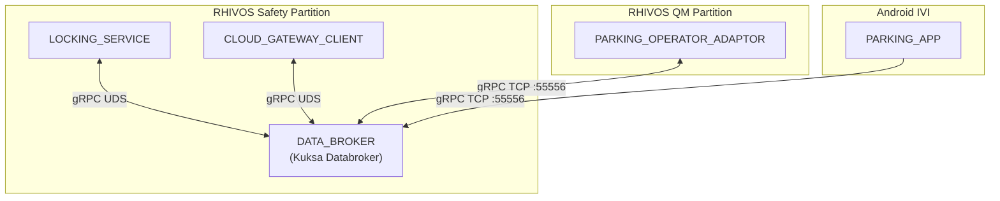
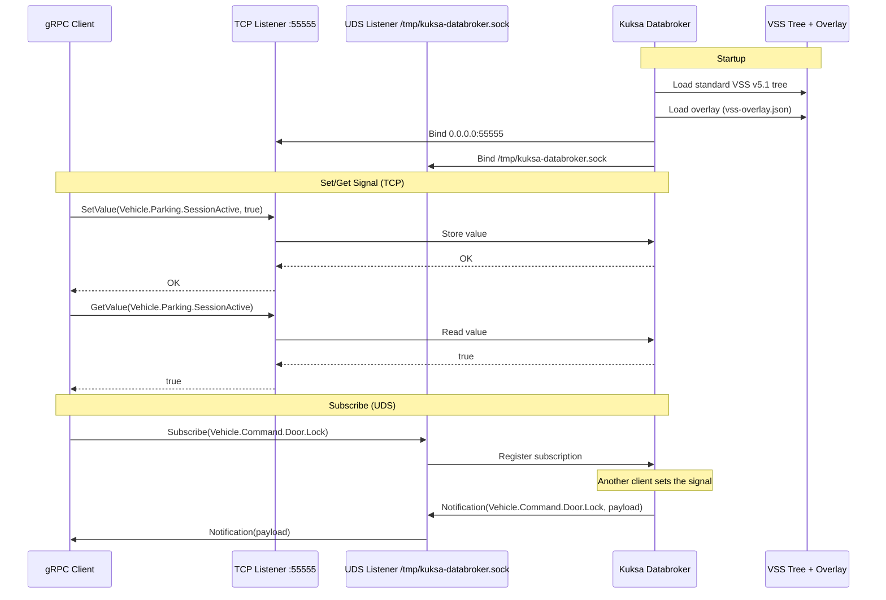

# Design Document: DATA_BROKER

## Overview

This design covers the configuration and validation of Eclipse Kuksa Databroker as the DATA_BROKER for the SDV Parking Demo. No application code is written — the deliverables are compose.yml updates (dual listeners, version pinning, UDS volume mount) and integration tests that verify signal availability and pub/sub functionality via gRPC. The databroker is a pre-built container image used as-is.

## Architecture





### Module Responsibilities

1. **Kuksa Databroker container** — Pre-built gRPC server managing VSS signal state, subscriptions, and dual-listener networking.
2. **deployments/compose.yml** — Container orchestration config defining databroker service with TCP + UDS listeners and VSS overlay volume mount.
3. **deployments/vss-overlay.json** — Custom signal definitions extending the standard VSS tree (created by spec 01, validated by this spec).
4. **tests/databroker/** — Integration test module verifying databroker connectivity, signal availability, and pub/sub behavior.

## Components and Interfaces

### Compose Service Configuration

The databroker service in `deployments/compose.yml` is updated from the spec 01 skeleton:

```yaml
services:
  databroker:
    image: ghcr.io/eclipse-kuksa/kuksa-databroker:0.5.1
    ports:
      - "55556:55555"
    volumes:
      - ./vss-overlay.json:/etc/kuksa/vss-overlay.json
      - kuksa-uds:/tmp
    command:
      - "--metadata"
      - "/etc/kuksa/vss-overlay.json"
      - "--address"
      - "0.0.0.0:55555"
      - "--uds-path"
      - "/tmp/kuksa-databroker.sock"

volumes:
  kuksa-uds:
    driver: local
    driver_opts:
      type: none
      o: bind
      device: /tmp/kuksa
```

### Kuksa Databroker gRPC Interface (pre-built, not implemented)

The databroker exposes the `kuksa.val.v1` gRPC API:

| RPC | Description |
|-----|-------------|
| `Get(GetRequest)` | Get current value of one or more signals |
| `Set(SetRequest)` | Set value of one or more signals |
| `Subscribe(SubscribeRequest)` | Subscribe to value changes of signals |
| `GetMetadata(GetMetadataRequest)` | Get signal metadata (type, description) |

### Signal Catalog

| Signal Path | Datatype | Source | Custom | Access |
|-------------|----------|--------|--------|--------|
| `Vehicle.Cabin.Door.Row1.DriverSide.IsLocked` | bool | Standard VSS v5.1 | No | R/W |
| `Vehicle.Cabin.Door.Row1.DriverSide.IsOpen` | bool | Standard VSS v5.1 | No | R/W |
| `Vehicle.CurrentLocation.Latitude` | double | Standard VSS v5.1 | No | R/W |
| `Vehicle.CurrentLocation.Longitude` | double | Standard VSS v5.1 | No | R/W |
| `Vehicle.Speed` | float | Standard VSS v5.1 | No | R/W |
| `Vehicle.Parking.SessionActive` | bool | VSS overlay | Yes | R/W |
| `Vehicle.Command.Door.Lock` | string | VSS overlay | Yes | R/W |
| `Vehicle.Command.Door.Response` | string | VSS overlay | Yes | R/W |

## Data Models

### VSS Overlay (deployments/vss-overlay.json)

Already created by spec 01. Contains three custom signal definitions:

```json
{
  "Vehicle": {
    "type": "branch",
    "children": {
      "Parking": {
        "type": "branch",
        "children": {
          "SessionActive": {
            "type": "sensor",
            "datatype": "boolean",
            "description": "Whether a parking session is currently active"
          }
        }
      },
      "Command": {
        "type": "branch",
        "children": {
          "Door": {
            "type": "branch",
            "children": {
              "Lock": {
                "type": "actuator",
                "datatype": "string",
                "description": "JSON-encoded lock/unlock command request"
              },
              "Response": {
                "type": "sensor",
                "datatype": "string",
                "description": "JSON-encoded command execution result"
              }
            }
          }
        }
      }
    }
  }
}
```

### Lock Command Payload Schema

```json
{
  "command_id": "<uuid>",
  "action": "lock|unlock",
  "doors": ["driver"],
  "source": "companion_app",
  "vin": "<vin>",
  "timestamp": "<unix_ts>"
}
```

### Command Response Payload Schema

```json
{
  "command_id": "<uuid>",
  "status": "success|failed",
  "reason": "<optional>",
  "timestamp": "<unix_ts>"
}
```

## Operational Readiness

- **Health check:** The databroker exposes its gRPC interface on startup. A simple `grpcurl` or `kuksa-client` call to `Get` verifies readiness.
- **Startup time:** Kuksa Databroker typically starts in < 2 seconds. Integration tests use a retry loop with 10-second timeout.
- **Rollback:** Revert compose.yml changes via `git checkout`. No persistent state beyond the container lifecycle.
- **Logs:** Container logs available via `podman logs databroker`.

## Correctness Properties

### Property 1: Dual Listener Availability

*For any* running instance of the databroker container, the databroker SHALL accept gRPC connections on both the TCP port (55556 from host) and the UDS socket (`/tmp/kuksa-databroker.sock`) simultaneously.

**Validates: Requirements 02-REQ-1.1, 02-REQ-1.2, 02-REQ-1.4**

### Property 2: Custom Signal Completeness

*For any* custom signal defined in the VSS overlay (`Vehicle.Parking.SessionActive`, `Vehicle.Command.Door.Lock`, `Vehicle.Command.Door.Response`), the running databroker SHALL expose that signal in its metadata with the correct datatype.

**Validates: Requirements 02-REQ-3.1, 02-REQ-3.2, 02-REQ-3.3**

### Property 3: Standard Signal Availability

*For any* standard VSS signal listed in the signal catalog (`Vehicle.Cabin.Door.Row1.DriverSide.IsLocked`, `Vehicle.Cabin.Door.Row1.DriverSide.IsOpen`, `Vehicle.CurrentLocation.Latitude`, `Vehicle.CurrentLocation.Longitude`, `Vehicle.Speed`), the running databroker SHALL expose that signal in its metadata with the correct datatype.

**Validates: Requirements 02-REQ-4.1, 02-REQ-4.2, 02-REQ-4.3, 02-REQ-4.4, 02-REQ-4.5**

### Property 4: Set/Get Roundtrip Integrity

*For any* signal in the catalog and any valid value for that signal's datatype, setting the value via gRPC and immediately reading it back SHALL return the identical value.

**Validates: Requirements 02-REQ-3.4, 02-REQ-5.2, 02-REQ-5.3**

### Property 5: Pub/Sub Notification Delivery

*For any* active subscription on a signal, when a client sets a new value for that signal, the subscriber SHALL receive a notification containing the new value.

**Validates: Requirements 02-REQ-5.1**

## Error Handling

| Error Condition | Behavior | Requirement |
|----------------|----------|-------------|
| UDS socket file exists from previous run | Databroker overwrites and starts | 02-REQ-1.E1 |
| Concurrent TCP and UDS clients | Both served independently | 02-REQ-1.E2 |
| Pinned image not in registry | `podman compose up` fails with pull error | 02-REQ-2.E1 |
| Malformed VSS overlay JSON | Container fails to start, logs error | 02-REQ-3.E1 |
| Get on unset custom signal | Returns response with no value | 02-REQ-3.E2 |
| Query non-existent signal path | Returns NOT_FOUND error | 02-REQ-4.E1 |
| Subscriber disconnects and reconnects | New subscription accepted | 02-REQ-5.E1 |

## Technology Stack

| Technology | Version | Purpose |
|-----------|---------|---------|
| Eclipse Kuksa Databroker | 0.5.1 (container) | VSS-compliant vehicle signal broker |
| Podman Compose | latest | Container orchestration |
| Go | 1.22+ | Integration test module |
| gRPC | proto3 | Databroker communication protocol |
| kuksa-client (or grpcurl) | latest | CLI tool for databroker interaction in tests |

## Definition of Done

A task group is complete when ALL of the following are true:

1. All subtasks within the group are checked off (`[x]`)
2. All spec tests (`test_spec.md` entries) for the task group pass
3. All property tests for the task group pass
4. All previously passing tests still pass (no regressions)
5. No linter warnings or errors introduced
6. Code is committed on a feature branch and pushed to remote
7. Feature branch is merged back to `main`
8. `tasks.md` checkboxes are updated to reflect completion

## Testing Strategy

- **Integration tests:** All tests for this spec are integration tests that require a running databroker container. They live in `tests/databroker/` as a standalone Go module.
- **Container lifecycle:** Tests use `podman compose up -d` to start the databroker, run gRPC assertions, then `podman compose down` to clean up. A shared `TestMain` handles setup/teardown.
- **gRPC client:** Tests use the Kuksa `kuksa.val.v1` gRPC API directly (generated Go client from Kuksa proto definitions) or shell out to `grpcurl`/`kuksa-client` CLI.
- **Skip condition:** Tests skip with a clear message if Podman is not available (`testing.Short()` or runtime detection).
- **UDS tests:** Tests that verify UDS connectivity connect to the socket path exposed via the volume mount at `/tmp/kuksa/kuksa-databroker.sock` on the host.
