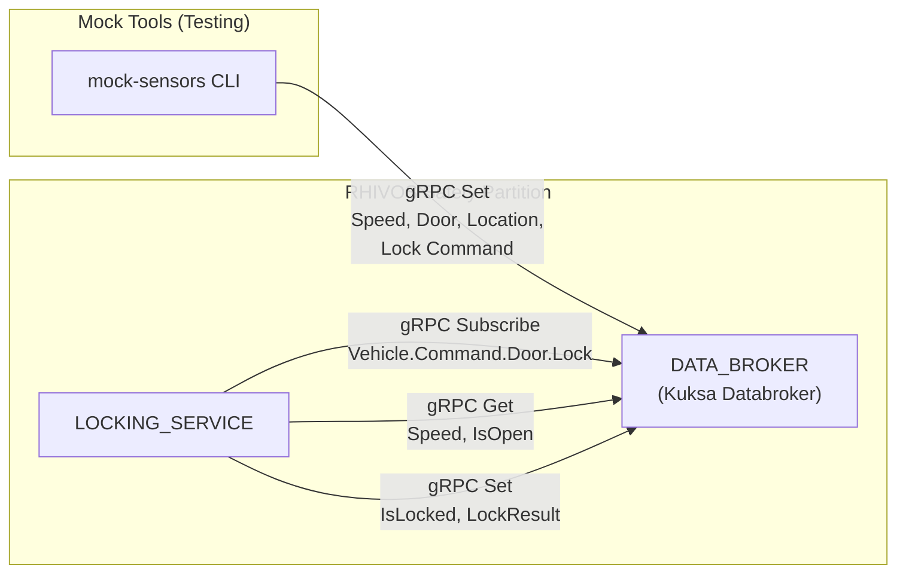
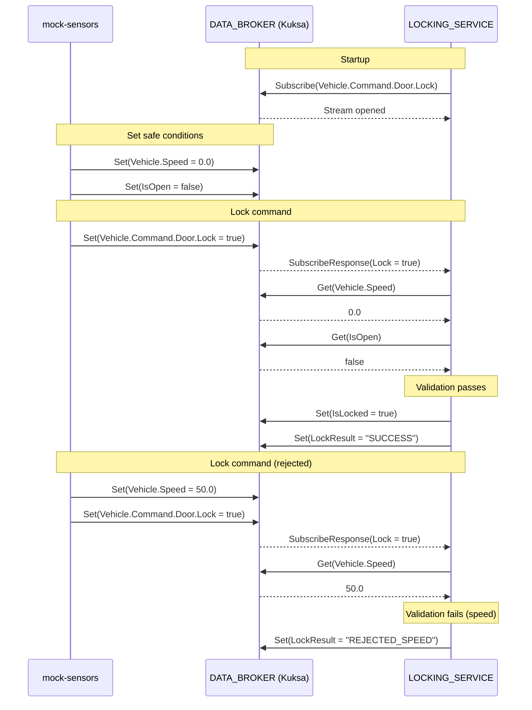

# Design Document: LOCKING_SERVICE + DATA_BROKER + Mock Sensors

## Overview

This design covers the RHIVOS safety-partition core: configuring Kuksa
Databroker with custom VSS signals, implementing the LOCKING_SERVICE as a
Rust service that processes lock/unlock commands with safety validation, and
implementing the mock sensor CLI tools for testing. The LOCKING_SERVICE acts
purely as a Kuksa client — it does not serve its own gRPC API but subscribes
to and writes VSS signals through Kuksa's `kuksa.val.v2` API.

## Architecture

### Runtime Architecture



### Signal Flow



### Module Responsibilities

1. **`infra/config/kuksa/vss_overlay.json`** — Custom VSS signal definitions
   extending the standard VSS model with command, result, and parking signals.
2. **`rhivos/parking-proto/`** — Extended to include Kuksa `kuksa.val.v2` proto
   bindings alongside existing parking service protos.
3. **`rhivos/locking-service/`** — Rust service implementing the lock command
   processing loop: subscribe → validate → execute → report.
4. **`mock/sensors/`** — Rust CLI implementing signal write operations against
   Kuksa Databroker.

## Components and Interfaces

### Kuksa val.v2 gRPC API (consumed)

The LOCKING_SERVICE and mock-sensors use Kuksa Databroker's `kuksa.val.v2`
API. Key RPCs consumed:

```protobuf
// From kuksa.val.v2 (vendored)
service VAL {
  rpc Get(GetRequest) returns (GetResponse);
  rpc Set(SetRequest) returns (SetResponse);
  rpc Subscribe(SubscribeRequest) returns (stream SubscribeResponse);
}
```

These proto files are vendored into `proto/vendor/kuksa/` and compiled by the
`parking-proto` crate's `build.rs`.

### Kuksa Client Module

A shared Kuksa client helper is added to the `parking-proto` crate (or a
new `kuksa-client` crate in the workspace) providing convenience functions:

```rust
pub struct KuksaClient { /* tonic channel */ }

impl KuksaClient {
    /// Connect to Kuksa Databroker at the given address.
    pub async fn connect(addr: &str) -> Result<Self>;

    /// Read a signal's current value.
    pub async fn get_bool(&self, path: &str) -> Result<Option<bool>>;
    pub async fn get_f32(&self, path: &str) -> Result<Option<f32>>;
    pub async fn get_f64(&self, path: &str) -> Result<Option<f64>>;
    pub async fn get_string(&self, path: &str) -> Result<Option<String>>;

    /// Write a signal value.
    pub async fn set_bool(&self, path: &str, value: bool) -> Result<()>;
    pub async fn set_f32(&self, path: &str, value: f32) -> Result<()>;
    pub async fn set_f64(&self, path: &str, value: f64) -> Result<()>;
    pub async fn set_string(&self, path: &str, value: &str) -> Result<()>;

    /// Subscribe to a signal, returning a stream of value changes.
    pub async fn subscribe_bool(&self, path: &str)
        -> Result<impl Stream<Item = Result<bool>>>;
}
```

### LOCKING_SERVICE Internal Architecture

```
locking-service/
├── src/
│   ├── main.rs          # Entry point, CLI parsing, service lifecycle
│   ├── config.rs        # Configuration (databroker addr, thresholds)
│   ├── safety.rs        # Safety validation logic (pure functions)
│   └── lock_handler.rs  # Command processing loop (subscribe, validate, execute)
```

#### Configuration (`config.rs`)

```rust
pub struct Config {
    pub databroker_addr: String,      // default: "http://localhost:55555"
    pub max_speed_kmh: f32,           // default: 1.0
}
```

#### Safety Validation (`safety.rs`)

```rust
#[derive(Debug, PartialEq)]
pub enum LockResult {
    Success,
    RejectedSpeed,
    RejectedDoorOpen,
}

/// Validate whether a lock command is safe to execute.
pub fn validate_lock(
    command_is_lock: bool,  // true = lock, false = unlock
    speed_kmh: f32,
    door_is_open: bool,
    max_speed_kmh: f32,
) -> LockResult {
    if speed_kmh >= max_speed_kmh {
        return LockResult::RejectedSpeed;
    }
    if command_is_lock && door_is_open {
        return LockResult::RejectedDoorOpen;
    }
    LockResult::Success
}
```

#### Command Handler (`lock_handler.rs`)

```rust
pub async fn run_lock_handler(client: KuksaClient, config: Config) -> Result<()> {
    let mut stream = client.subscribe_bool(SIGNAL_COMMAND_DOOR_LOCK).await?;

    while let Some(command_value) = stream.next().await {
        let command_is_lock = command_value?;

        // Read current vehicle state
        let speed = client.get_f32(SIGNAL_SPEED).await?.unwrap_or(0.0);
        let door_open = client.get_bool(SIGNAL_DOOR_IS_OPEN).await?.unwrap_or(false);

        // Validate
        let result = safety::validate_lock(
            command_is_lock, speed, door_open, config.max_speed_kmh
        );

        // Execute if valid
        if result == LockResult::Success {
            client.set_bool(SIGNAL_DOOR_IS_LOCKED, command_is_lock).await?;
        }

        // Report result
        client.set_string(SIGNAL_LOCK_RESULT, &result.to_string()).await?;
    }
    Ok(())
}
```

### VSS Signal Constants

Defined in `parking-proto` or `locking-service` for reuse:

```rust
pub const SIGNAL_DOOR_IS_LOCKED: &str = "Vehicle.Cabin.Door.Row1.DriverSide.IsLocked";
pub const SIGNAL_DOOR_IS_OPEN: &str = "Vehicle.Cabin.Door.Row1.DriverSide.IsOpen";
pub const SIGNAL_SPEED: &str = "Vehicle.Speed";
pub const SIGNAL_LOCATION_LAT: &str = "Vehicle.CurrentLocation.Latitude";
pub const SIGNAL_LOCATION_LON: &str = "Vehicle.CurrentLocation.Longitude";
pub const SIGNAL_COMMAND_DOOR_LOCK: &str = "Vehicle.Command.Door.Lock";
pub const SIGNAL_LOCK_RESULT: &str = "Vehicle.Command.Door.LockResult";
pub const SIGNAL_PARKING_SESSION_ACTIVE: &str = "Vehicle.Parking.SessionActive";
```

### Mock Sensors CLI

Updated from spec 01 skeleton to real implementation:

```
mock-sensors [flags] <command>

Commands:
  set-location <lat> <lon>        Write Vehicle.CurrentLocation.*
  set-speed <km/h>                Write Vehicle.Speed
  set-door <open|closed>          Write Vehicle.Cabin.Door.Row1.DriverSide.IsOpen
  lock-command <lock|unlock>      Write Vehicle.Command.Door.Lock

Global Flags:
  --databroker-addr <addr>        Kuksa Databroker address (default: localhost:55555)
```

Each subcommand connects to Kuksa, writes the signal, prints confirmation,
and exits.

## Data Models

### VSS Overlay (`infra/config/kuksa/vss_overlay.json`)

```json
{
  "Vehicle": {
    "type": "branch",
    "children": {
      "Command": {
        "type": "branch",
        "children": {
          "Door": {
            "type": "branch",
            "children": {
              "Lock": {
                "type": "actuator",
                "datatype": "boolean",
                "description": "Lock/unlock command request. true=lock, false=unlock."
              },
              "LockResult": {
                "type": "sensor",
                "datatype": "string",
                "description": "Result of the last lock command processed by LOCKING_SERVICE.",
                "allowed": ["SUCCESS", "REJECTED_SPEED", "REJECTED_DOOR_OPEN"]
              }
            }
          }
        }
      },
      "Parking": {
        "type": "branch",
        "children": {
          "SessionActive": {
            "type": "sensor",
            "datatype": "boolean",
            "description": "Whether a parking session is currently active. Managed by PARKING_OPERATOR_ADAPTOR."
          }
        }
      }
    }
  }
}
```

### Kuksa Databroker Container Configuration

Update `infra/compose.yaml` to mount the overlay:

```yaml
services:
  databroker:
    image: ghcr.io/eclipse-kuksa/kuksa-databroker:0.5
    ports:
      - "55555:55555"
    volumes:
      - ./config/kuksa/vss_overlay.json:/vss_overlay.json
    command: ["--vss", "/vss_overlay.json"]
```

> **Note:** The exact Kuksa CLI flags and overlay format must be verified
> against the actual Kuksa Databroker version used. The `--vss` flag or
> equivalent may differ. Adjust during implementation.

### LockResult Values

| Value | Meaning | When |
|-------|---------|------|
| `"SUCCESS"` | Command executed | Safety validation passed |
| `"REJECTED_SPEED"` | Command rejected | Vehicle.Speed >= 1.0 km/h |
| `"REJECTED_DOOR_OPEN"` | Command rejected | Door ajar during lock request |

## Operational Readiness

### Observability

- LOCKING_SERVICE uses `tracing` for structured logging.
- All command processing events are logged at INFO level: command received,
  validation result, signal writes.
- Errors (Kuksa connection failures, write failures) are logged at ERROR level.

### Areas of Improvement (Deferred)

- **Kuksa access control:** Currently anonymous. Should add token-based
  authorization so only LOCKING_SERVICE can write IsLocked.
- **Multi-door support:** Only driver side door for the demo.
- **Metrics/telemetry:** Not in scope for this spec.

## Correctness Properties

### Property 1: Command-Lock Invariant

*For any* lock command value `v` written to `Vehicle.Command.Door.Lock` when
vehicle speed < 1.0 km/h and (if `v = true`) door is closed, THE
LOCKING_SERVICE SHALL set `Vehicle.Cabin.Door.Row1.DriverSide.IsLocked = v`
in DATA_BROKER.

**Validates: Requirements 02-REQ-4.1**

### Property 2: Safety Rejection Guarantee

*For any* lock command received when vehicle speed >= 1.0 km/h OR (command is
lock AND door is open), THE LOCKING_SERVICE SHALL NOT modify
`Vehicle.Cabin.Door.Row1.DriverSide.IsLocked`.

**Validates: Requirements 02-REQ-3.1, 02-REQ-3.2, 02-REQ-3.3, 02-REQ-4.2**

### Property 3: Result Completeness

*For any* `Vehicle.Command.Door.Lock` signal change processed by
LOCKING_SERVICE, THE service SHALL write exactly one value to
`Vehicle.Command.Door.LockResult` that correctly reflects the outcome
(SUCCESS, REJECTED_SPEED, or REJECTED_DOOR_OPEN).

**Validates: Requirements 02-REQ-5.1, 02-REQ-5.2, 02-REQ-5.3, 02-REQ-5.4**

### Property 4: Safety Function Purity

*For any* combination of inputs (command_is_lock: bool, speed: f32,
door_is_open: bool), THE `validate_lock` function SHALL return a
deterministic `LockResult` that depends only on those inputs and the
configured speed threshold — with no side effects.

**Validates: Requirements 02-REQ-3.1, 02-REQ-3.2, 02-REQ-3.3, 02-REQ-3.4**

### Property 5: Mock Sensor Signal Accuracy

*For any* value written by mock-sensors to DATA_BROKER, a subsequent
`Get` on the same signal path SHALL return the written value.

**Validates: Requirements 02-REQ-6.1, 02-REQ-6.2, 02-REQ-6.3, 02-REQ-6.4**

### Property 6: Signal Availability

*For any* custom signal defined in the VSS overlay, THE Kuksa Databroker
SHALL accept `Set` and `Get` operations on that signal path without error
after startup.

**Validates: Requirements 02-REQ-1.1, 02-REQ-1.2, 02-REQ-1.3, 02-REQ-1.4**

### Property 7: Default-Safe Behavior

*For any* signal that has not been set in DATA_BROKER (no value available),
THE LOCKING_SERVICE SHALL use a safe default (speed = 0.0, door = closed)
such that the absence of sensor data does not block valid lock commands.

**Validates: Requirements 02-REQ-3.E1, 02-REQ-3.E2**

## Error Handling

| Error Condition | Behavior | Requirement |
|----------------|----------|-------------|
| DATA_BROKER unreachable at startup | Retry with exponential backoff, log attempts | 02-REQ-2.E1 |
| Subscription stream interrupted | Re-subscribe automatically | 02-REQ-2.E2 |
| Speed signal not set in DATA_BROKER | Treat as 0.0 (safe default) | 02-REQ-3.E1 |
| Door signal not set in DATA_BROKER | Treat as closed (safe default) | 02-REQ-3.E2 |
| Writing IsLocked fails | Log error, report result via LockResult | 02-REQ-4.E1 |
| Writing LockResult fails | Log error (best effort) | 02-REQ-5.E1 |
| VSS overlay malformed | Kuksa fails to start with error | 02-REQ-1.E1 |
| mock-sensors: DATA_BROKER unreachable | Print error, exit non-zero | 02-REQ-6.E1 |

## Technology Stack

| Component | Technology | Version | Purpose |
|-----------|-----------|---------|---------|
| LOCKING_SERVICE | Rust | 1.75+ | Service implementation |
| gRPC client | tonic | 0.12.x | Kuksa Databroker client |
| Async runtime | tokio | 1.x | Async runtime with signal handling |
| CLI parsing | clap | 4.x | Command-line argument parsing |
| Logging | tracing + tracing-subscriber | 0.1 / 0.3 | Structured logging |
| Kuksa proto | kuksa.val.v2 (vendored) | — | Databroker gRPC API |
| DATA_BROKER | Eclipse Kuksa Databroker | 0.5.x | VSS signal broker (pre-built) |

## Definition of Done

A task group is complete when ALL of the following are true:

1. All subtasks within the group are checked off (`[x]`)
2. All property tests for the task group pass
3. All previously passing tests still pass (no regressions)
4. No linter warnings or errors introduced
5. Code is committed on a feature branch and pushed to remote
6. Feature branch is merged back to `develop`
7. `tasks.md` checkboxes are updated to reflect completion

## Testing Strategy

### Unit Tests (safety.rs)

Property-based tests using the `proptest` crate on the `validate_lock`
function:

- Generate random combinations of (command_is_lock, speed, door_is_open).
- Assert that the function output matches the expected decision rules.
- This directly validates **Property 4** (Safety Function Purity).

Boundary-value tests:

- Speed exactly at 1.0 (rejected), speed at 0.99 (accepted).
- Lock with door open (rejected), lock with door closed (accepted).
- Unlock with door open (accepted — no door-ajar constraint for unlock).

### Unit Tests (lock_handler.rs)

Use a mock Kuksa client (trait-based) to test the command handler in
isolation:

- Verify correct signal reads and writes for each scenario.
- Verify that `IsLocked` is NOT written on rejection.
- Verify that `LockResult` is always written.

### Integration Tests

Require a running Kuksa Databroker (via `make infra-up`). Tests:

1. Start LOCKING_SERVICE connected to the real Kuksa.
2. Use Kuksa gRPC client directly (or mock-sensors) to set vehicle state.
3. Write a lock command signal.
4. Read back `IsLocked` and `LockResult` to verify behavior.
5. Cover: happy path (lock + unlock), speed rejection, door-ajar rejection.

Integration tests are gated on DATA_BROKER availability and skip cleanly
if Kuksa is not running.

### Mock Sensors Tests

- Unit tests: argument parsing for each subcommand.
- Integration tests: write a value via mock-sensors, read it back from Kuksa,
  verify match. Validates **Property 5**.
