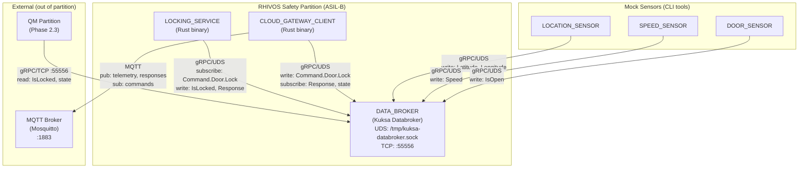
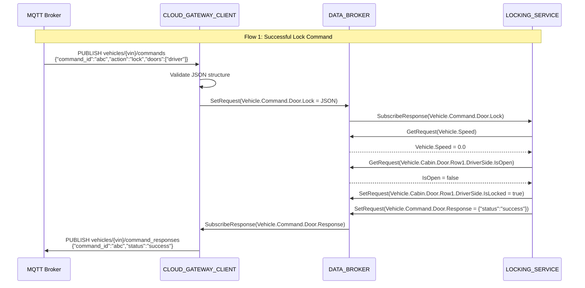
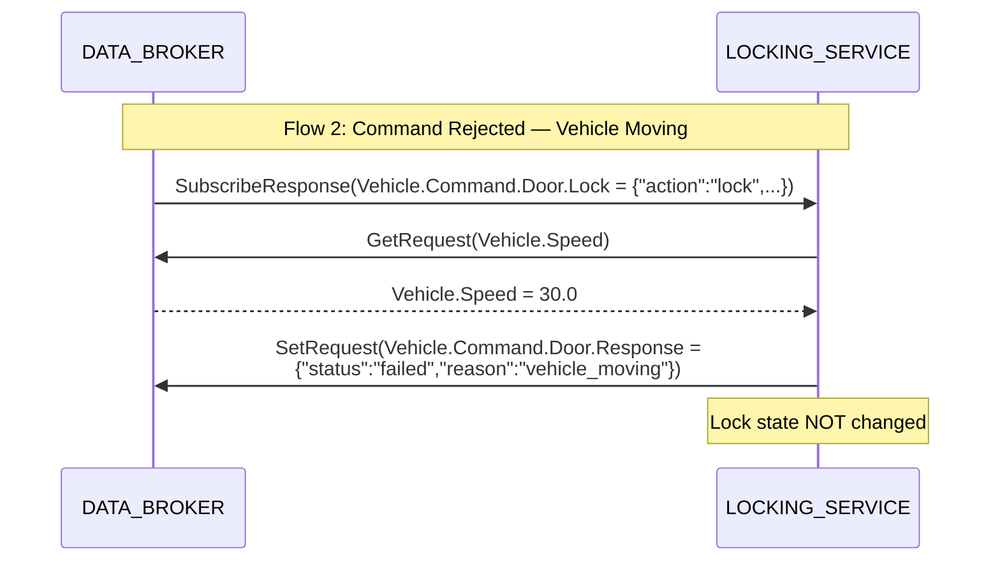

# Design Document: RHIVOS Safety Partition (Phase 2.1)

## Overview

This design describes the architecture, module responsibilities, interfaces,
configuration, and communication patterns for the RHIVOS safety-partition
services. The safety partition contains three runtime services (DATA_BROKER,
LOCKING_SERVICE, CLOUD_GATEWAY_CLIENT) and three on-demand CLI tools
(LOCATION_SENSOR, SPEED_SENSOR, DOOR_SENSOR). All same-partition
communication flows through DATA_BROKER via gRPC over Unix Domain Sockets.

## Architecture

### Component Topology



### Command Flow Sequence



### Safety Constraint Rejection Flow



## Module Responsibilities

### 1. DATA_BROKER (Eclipse Kuksa Databroker)

DATA_BROKER is Eclipse Kuksa Databroker deployed as a pre-built binary. No
wrapper code is written. Configuration is achieved through:

- **VSS overlay file** for custom signal definitions
- **Command-line arguments** for endpoint configuration
- **Token file** for access control

**Responsibilities:**
- Serve VSS signals via gRPC pub/sub interface
- Maintain signal state (latest value for each signal)
- Enforce read/write access control via bearer tokens
- Expose UDS endpoint for same-partition consumers
- Expose TCP endpoint for cross-partition consumers

### 2. LOCKING_SERVICE (Rust)

**Responsibilities:**
- Subscribe to Vehicle.Command.Door.Lock signals from DATA_BROKER
- Parse and validate command JSON payloads
- Read safety constraint signals (Vehicle.Speed, IsOpen) from DATA_BROKER
- Execute lock/unlock operations (write IsLocked to DATA_BROKER)
- Write command responses to Vehicle.Command.Door.Response

**Module Structure:**
```
rhivos/locking-service/
├── Cargo.toml
├── src/
│   ├── main.rs          # Entry point, tokio runtime, service startup
│   ├── lib.rs           # Re-exports, module declarations
│   ├── command.rs       # Command parsing and validation
│   ├── safety.rs        # Safety constraint checking logic
│   └── databroker.rs    # DATA_BROKER gRPC client wrapper
└── tests/
    └── integration.rs   # Integration tests (require DATA_BROKER)
```

### 3. CLOUD_GATEWAY_CLIENT (Rust)

**Responsibilities:**
- Connect to MQTT broker and subscribe to command topics
- Validate incoming command messages
- Write validated commands to DATA_BROKER as command signals
- Subscribe to DATA_BROKER for vehicle state and command responses
- Publish telemetry and command responses to MQTT

**Module Structure:**
```
rhivos/cloud-gateway-client/
├── Cargo.toml
├── src/
│   ├── main.rs          # Entry point, tokio runtime, service startup
│   ├── lib.rs           # Re-exports, module declarations
│   ├── mqtt.rs          # MQTT client wrapper (connect, subscribe, publish)
│   ├── commands.rs      # Command validation and DATA_BROKER writing
│   ├── telemetry.rs     # Telemetry subscription and MQTT publishing
│   └── databroker.rs    # DATA_BROKER gRPC client wrapper
└── tests/
    └── integration.rs   # Integration tests (require DATA_BROKER + MQTT)
```

### 4. Mock Sensor Services (Rust CLI tools)

**Responsibilities:**
- Accept sensor values via CLI arguments
- Connect to DATA_BROKER via gRPC
- Write the specified signal value
- Exit immediately after writing

**Module Structure:**
```
rhivos/mock-sensors/
├── Cargo.toml
└── src/
    ├── lib.rs           # Shared DATA_BROKER client code
    ├── bin/
    │   ├── location-sensor.rs   # Write Latitude + Longitude
    │   ├── speed-sensor.rs      # Write Speed
    │   └── door-sensor.rs       # Write IsOpen
    └── tests/
        └── integration.rs       # Integration tests
```

## DATA_BROKER Configuration

### VSS Overlay File

The overlay file extends the standard VSS tree with custom command signals.
It is placed at `infra/kuksa/vss-overlay.json`:

```json
{
  "Vehicle": {
    "type": "branch",
    "children": {
      "Command": {
        "type": "branch",
        "children": {
          "Door": {
            "type": "branch",
            "children": {
              "Lock": {
                "type": "actuator",
                "datatype": "string",
                "description": "Door lock/unlock command as JSON. Payload: {command_id, action, doors, source, vin, timestamp}"
              },
              "Response": {
                "type": "actuator",
                "datatype": "string",
                "description": "Door command execution result as JSON. Payload: {command_id, status, reason, timestamp}"
              }
            }
          }
        }
      }
    }
  }
}
```

### Access Control Token File

A simple token file at `infra/kuksa/tokens.json` defines bearer tokens for
each service. For demo purposes, tokens are static strings:

| Service | Token | Write Permissions |
|---------|-------|-------------------|
| LOCKING_SERVICE | `locking-service-token` | IsLocked, Command.Door.Response |
| CLOUD_GATEWAY_CLIENT | `cloud-gateway-client-token` | Command.Door.Lock |
| LOCATION_SENSOR | `location-sensor-token` | Latitude, Longitude |
| SPEED_SENSOR | `speed-sensor-token` | Speed |
| DOOR_SENSOR | `door-sensor-token` | IsOpen |

**Note:** Kuksa Databroker supports token-based authorization. The exact
token configuration format follows Kuksa's documentation. If Kuksa's built-in
token support is insufficient for fine-grained per-signal control in the demo
version, a simplified approach (single shared token or no token enforcement)
may be used, documented via an ADR.

### Infrastructure Configuration Update

The existing `infra/docker-compose.yml` must be updated to configure
DATA_BROKER with:

```yaml
kuksa-databroker:
  image: ghcr.io/eclipse-kuksa/kuksa-databroker:0.5.1
  ports:
    - "55556:55555"
  volumes:
    - ./kuksa/vss-overlay.json:/etc/kuksa/vss-overlay.json:ro
    - /tmp/kuksa-databroker.sock:/tmp/kuksa-databroker.sock
  command:
    - "--address"
    - "0.0.0.0"
    - "--port"
    - "55555"
    - "--vss"
    - "/etc/kuksa/vss-overlay.json"
    - "--enable-databroker-v1"
```

The UDS socket is bind-mounted from the host so that Rust services running on
the host (during local development) can connect to DATA_BROKER inside the
container via the shared socket path.

## Rust Module Interfaces

### Shared DATA_BROKER Client

A shared library crate (`rhivos/databroker-client/`) provides a typed Rust
client for interacting with Kuksa Databroker's gRPC API. This avoids code
duplication across LOCKING_SERVICE, CLOUD_GATEWAY_CLIENT, and mock sensors.

```rust
// databroker-client/src/lib.rs

pub struct DatabrokerClient {
    // Wraps the Kuksa Databroker gRPC client
}

impl DatabrokerClient {
    /// Connect via UDS (default) or TCP endpoint.
    pub async fn connect(endpoint: &str) -> Result<Self, Error>;

    /// Read the current value of a signal.
    pub async fn get_value(&self, path: &str) -> Result<DataValue, Error>;

    /// Write a value to a signal.
    pub async fn set_value(&self, path: &str, value: DataValue) -> Result<(), Error>;

    /// Subscribe to changes on one or more signals.
    /// Returns a stream of (path, value) updates.
    pub async fn subscribe(&self, paths: &[&str]) -> Result<SignalStream, Error>;
}

pub enum DataValue {
    Bool(bool),
    Float(f32),
    Double(f64),
    String(String),
}
```

### LOCKING_SERVICE Command Types

```rust
// locking-service/src/command.rs

#[derive(Debug, Deserialize)]
pub struct LockCommand {
    pub command_id: String,
    pub action: LockAction,
    pub doors: Vec<String>,
    pub source: String,
    pub vin: String,
    pub timestamp: i64,
}

#[derive(Debug, Deserialize, PartialEq)]
#[serde(rename_all = "lowercase")]
pub enum LockAction {
    Lock,
    Unlock,
}

#[derive(Debug, Serialize)]
pub struct CommandResponse {
    pub command_id: String,
    pub status: CommandStatus,
    #[serde(skip_serializing_if = "Option::is_none")]
    pub reason: Option<String>,
    pub timestamp: i64,
}

#[derive(Debug, Serialize, PartialEq)]
#[serde(rename_all = "lowercase")]
pub enum CommandStatus {
    Success,
    Failed,
}
```

### LOCKING_SERVICE Safety Checker

```rust
// locking-service/src/safety.rs

pub struct SafetyChecker {
    db_client: DatabrokerClient,
}

impl SafetyChecker {
    /// Check all safety constraints. Returns Ok(()) if safe to proceed,
    /// or Err(reason_string) if a constraint is violated.
    pub async fn check_constraints(&self) -> Result<(), String> {
        let speed = self.check_speed().await?;
        let door = self.check_door().await?;
        Ok(())
    }

    async fn check_speed(&self) -> Result<(), String> {
        // Read Vehicle.Speed; if > 0 return Err("vehicle_moving")
        // If not set, treat as 0 (safe) per 02-REQ-3.E1
    }

    async fn check_door(&self) -> Result<(), String> {
        // Read IsOpen; if true return Err("door_open")
        // If not set, treat as closed (safe) per 02-REQ-3.E2
    }
}
```

### CLOUD_GATEWAY_CLIENT MQTT Interface

```rust
// cloud-gateway-client/src/mqtt.rs

pub struct MqttClient {
    // Wraps rumqttc or paho-mqtt client
}

impl MqttClient {
    pub async fn connect(broker_addr: &str, vin: &str) -> Result<Self, Error>;
    pub async fn subscribe_commands(&self) -> Result<CommandStream, Error>;
    pub async fn publish_response(&self, response: &str) -> Result<(), Error>;
    pub async fn publish_telemetry(&self, telemetry: &str) -> Result<(), Error>;
}
```

## MQTT Topic Structure

| Topic Pattern | Direction | Payload Format |
|--------------|-----------|---------------|
| `vehicles/{vin}/commands` | CLOUD_GATEWAY -> CLOUD_GATEWAY_CLIENT | `{"command_id":"<uuid>","action":"lock"\|"unlock","doors":["driver"],"source":"companion_app","vin":"<vin>","timestamp":<unix_ts>}` |
| `vehicles/{vin}/command_responses` | CLOUD_GATEWAY_CLIENT -> CLOUD_GATEWAY | `{"command_id":"<uuid>","status":"success"\|"failed","reason":"<optional>","timestamp":<unix_ts>}` |
| `vehicles/{vin}/telemetry` | CLOUD_GATEWAY_CLIENT -> CLOUD_GATEWAY | `{"signals":[{"path":"<vss_path>","value":<value>,"timestamp":<unix_ts>}]}` |

## Environment Variables

| Variable | Service | Default | Description |
|----------|---------|---------|-------------|
| `DATABROKER_UDS_PATH` | All safety-partition services | `/tmp/kuksa-databroker.sock` | DATA_BROKER UDS socket path |
| `DATABROKER_ADDR` | Mock sensors (optional) | `http://localhost:55556` | DATA_BROKER network address (for cross-partition testing) |
| `MQTT_BROKER_ADDR` | CLOUD_GATEWAY_CLIENT | `localhost:1883` | MQTT broker host:port |
| `VEHICLE_VIN` | CLOUD_GATEWAY_CLIENT | `VIN12345` | Vehicle identification number |
| `DATABROKER_TOKEN` | Per service | (service-specific) | Bearer token for DATA_BROKER auth |

## Correctness Properties

### Property 1: Command-Response Pairing

*For any* lock/unlock command written to Vehicle.Command.Door.Lock, the
LOCKING_SERVICE SHALL eventually write exactly one Vehicle.Command.Door.Response
with the same command_id.

**Validates: Requirements 02-REQ-2.2, 02-REQ-3.4, 02-REQ-3.5**

### Property 2: Safety Constraint Enforcement

*For any* lock command received when Vehicle.Speed > 0, the
LOCKING_SERVICE SHALL NOT change Vehicle.Cabin.Door.Row1.DriverSide.IsLocked,
AND the response SHALL have status "failed".

**Validates: Requirements 02-REQ-3.1, 02-REQ-3.4**

### Property 3: Door Ajar Protection

*For any* lock command received when
Vehicle.Cabin.Door.Row1.DriverSide.IsOpen == true, the LOCKING_SERVICE SHALL
NOT change Vehicle.Cabin.Door.Row1.DriverSide.IsLocked, AND the response
SHALL have status "failed" with reason "door_open".

**Validates: Requirements 02-REQ-3.2, 02-REQ-3.4**

### Property 4: Lock State Consistency

*For any* successful lock command, after the LOCKING_SERVICE writes the
response, the value of Vehicle.Cabin.Door.Row1.DriverSide.IsLocked in
DATA_BROKER SHALL match the commanded action (true for "lock", false for
"unlock").

**Validates: Requirement 02-REQ-3.5**

### Property 5: MQTT Command Relay Integrity

*For any* valid command received on MQTT topic `vehicles/{vin}/commands`,
the CLOUD_GATEWAY_CLIENT SHALL write an identical command payload to
Vehicle.Command.Door.Lock in DATA_BROKER.

**Validates: Requirement 02-REQ-4.3**

### Property 6: Telemetry Signal Coverage

*For any* change to a subscribed vehicle state signal in DATA_BROKER, the
CLOUD_GATEWAY_CLIENT SHALL publish a telemetry message to MQTT containing
the signal path, new value, and timestamp.

**Validates: Requirements 02-REQ-5.1, 02-REQ-5.2**

### Property 7: UDS Exclusivity

*For any* gRPC connection from LOCKING_SERVICE or CLOUD_GATEWAY_CLIENT to
DATA_BROKER, the transport SHALL be Unix Domain Sockets, never TCP.

**Validates: Requirements 02-REQ-7.1, 02-REQ-7.2**

### Property 8: Sensor Idempotency

*For any* mock sensor CLI invocation with the same arguments, the resulting
signal value in DATA_BROKER SHALL be identical regardless of the number of
prior invocations.

**Validates: Requirements 02-REQ-6.1 through 02-REQ-6.4**

## Error Handling

| Error Condition | Behavior | Requirement |
|----------------|----------|-------------|
| Invalid JSON in lock command signal | LOCKING_SERVICE writes response with status "failed", reason "invalid_payload" | 02-REQ-2.E1 |
| Unknown action in lock command | LOCKING_SERVICE writes response with status "failed", reason "unknown_action" | 02-REQ-2.E2 |
| Missing required fields in command | LOCKING_SERVICE writes response with status "failed", reason "missing_fields" | 02-REQ-2.E3 |
| Vehicle speed > 0 during lock/unlock | LOCKING_SERVICE writes response with status "failed", reason "vehicle_moving" | 02-REQ-3.1, 02-REQ-3.3 |
| Door open during lock | LOCKING_SERVICE writes response with status "failed", reason "door_open" | 02-REQ-3.2 |
| Speed signal not set in DATA_BROKER | LOCKING_SERVICE treats speed as 0 (safe) | 02-REQ-3.E1 |
| Door signal not set in DATA_BROKER | LOCKING_SERVICE treats door as closed (safe) | 02-REQ-3.E2 |
| MQTT broker unreachable at startup | CLOUD_GATEWAY_CLIENT retries with exponential backoff, logs each attempt | 02-REQ-4.E1 |
| MQTT connection lost during operation | CLOUD_GATEWAY_CLIENT retries reconnection with exponential backoff | 02-REQ-4.E2 |
| Invalid JSON in MQTT command message | CLOUD_GATEWAY_CLIENT logs error, discards message | 02-REQ-4.E3 |
| DATA_BROKER unreachable | Services log error with endpoint details, retry or exit depending on context | 02-REQ-5.E1, 02-REQ-7.E1 |
| Unknown VSS signal write attempt | DATA_BROKER returns error indicating unknown signal | 02-REQ-1.E1 |
| Missing bearer token | DATA_BROKER returns permission denied | 02-REQ-1.E2 |
| Mock sensor invalid value argument | Tool prints error, exits non-zero | 02-REQ-6.E2 |
| Mock sensor DATA_BROKER unreachable | Tool prints connection error, exits non-zero | 02-REQ-6.E1 |

## Technology Stack

| Category | Technology | Version | Purpose |
|----------|-----------|---------|---------|
| Language | Rust | 1.75+ (edition 2021) | All safety-partition services and mock sensors |
| Async Runtime | tokio | 1.x | Async runtime for all Rust services |
| gRPC Client | tonic | 0.12 | gRPC client for DATA_BROKER communication |
| Protobuf | prost | 0.13 | Protobuf serialization/deserialization |
| MQTT Client | rumqttc | 0.24+ | MQTT client for CLOUD_GATEWAY_CLIENT |
| JSON | serde + serde_json | 1.x | Command/response JSON serialization |
| CLI | clap | 4.x | CLI argument parsing for mock sensors |
| Logging | tracing | 0.1 | Structured logging for all services |
| Signal Broker | Eclipse Kuksa Databroker | 0.5.x | VSS gRPC signal broker (pre-built binary) |
| MQTT Broker | Eclipse Mosquitto | 2.x | Local MQTT broker for development |
| Testing | cargo test + tokio-test | — | Unit and integration test framework |

## Definition of Done

A task group is complete when ALL of the following are true:

1. All subtasks within the group are checked off (`[x]`)
2. All spec tests (`test_spec.md` entries) for the task group pass
3. All property tests for the task group pass
4. All previously passing tests still pass (no regressions)
5. No linter warnings or errors introduced (`cargo clippy -- -D warnings`)
6. Code is committed on a feature branch and pushed to remote
7. Feature branch is merged back to `develop`
8. `tasks.md` checkboxes are updated to reflect completion

## Testing Strategy

### Unit Tests

Each Rust crate includes unit tests that verify component logic in isolation,
without requiring infrastructure services:

- **LOCKING_SERVICE:** Command parsing, safety constraint logic (with mocked
  DATA_BROKER responses), response serialization.
- **CLOUD_GATEWAY_CLIENT:** Command validation, telemetry message formatting,
  MQTT message construction.
- **Mock Sensors:** CLI argument parsing, value conversion.
- **databroker-client:** Value type conversions, error mapping.

Run via: `cd rhivos && cargo test`

### Integration Tests

Integration tests verify end-to-end flows through running infrastructure:

- Require DATA_BROKER and Mosquitto running (`make infra-up`).
- Test full command flow: MQTT command -> CLOUD_GATEWAY_CLIENT -> DATA_BROKER ->
  LOCKING_SERVICE -> DATA_BROKER -> CLOUD_GATEWAY_CLIENT -> MQTT response.
- Test safety constraint rejection with mock sensor values.
- Test mock sensor tools writing values to DATA_BROKER.

Run via: `cd rhivos && cargo test --test integration`

Gated by: `make infra-up` must be run first.

### Property Verification

Properties 1-8 are verified by the following test approach:

| Property | Test Approach |
|----------|---------------|
| P1: Command-Response Pairing | Send N commands with unique IDs, verify N responses with matching IDs |
| P2: Safety Constraint Enforcement | Set speed > 0, send lock command, verify IsLocked unchanged and response "failed" |
| P3: Door Ajar Protection | Set IsOpen = true, send lock command, verify IsLocked unchanged and response "failed" with reason "door_open" |
| P4: Lock State Consistency | Send lock then unlock, verify IsLocked matches action after each |
| P5: MQTT Command Relay | Publish command to MQTT, read Vehicle.Command.Door.Lock from DATA_BROKER, compare payloads |
| P6: Telemetry Signal Coverage | Write sensor values, subscribe to MQTT telemetry topic, verify all signals appear |
| P7: UDS Exclusivity | Inspect service configuration to confirm UDS endpoint is used; verified structurally |
| P8: Sensor Idempotency | Run sensor CLI twice with same value, read signal, verify value matches |
