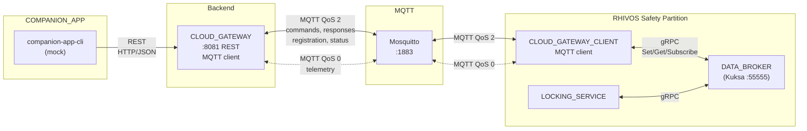
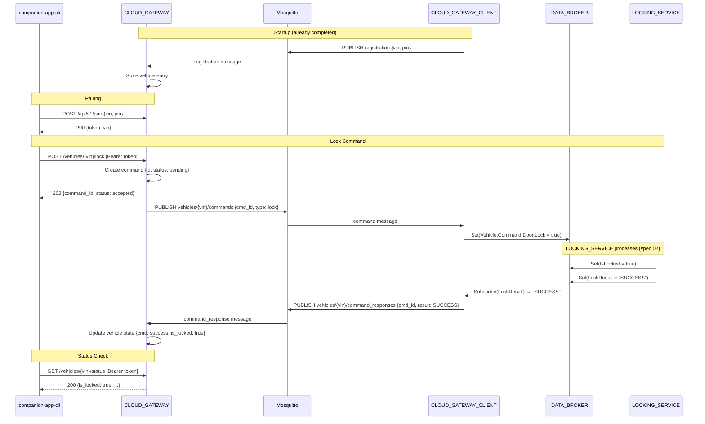

# Design Document: CLOUD_GATEWAY + CLOUD_GATEWAY_CLIENT + Mock COMPANION_APP

## Overview

This design covers the vehicle-to-cloud connectivity layer. CLOUD_GATEWAY is
a Go backend service exposing a REST API for companion apps and an MQTT client
for vehicle communication. CLOUD_GATEWAY_CLIENT is a Rust service running in
the RHIVOS safety partition, bridging MQTT commands to Kuksa DATA_BROKER
signals and publishing telemetry. The two are decoupled through MQTT via
Eclipse Mosquitto, with the VIN as the correlation identifier.

## Architecture

### Runtime Architecture



### Lock Command Sequence



### Module Responsibilities

1. **CLOUD_GATEWAY (`backend/cloud-gateway/`)** — Go service managing REST
   API, MQTT client, vehicle state, and pairing database.
2. **CLOUD_GATEWAY_CLIENT (`rhivos/cloud-gateway-client/`)** — Rust service
   managing MQTT subscription, DATA_BROKER integration, command forwarding,
   result reporting, and telemetry publishing.
3. **Mock COMPANION_APP CLI (`mock/companion-app-cli/`)** — Go CLI for
   pairing, lock/unlock commands, and status queries via REST.

## Components and Interfaces

### CLOUD_GATEWAY REST API

| Method | Endpoint | Auth | Request Body | Response | Description |
|--------|----------|------|-------------|----------|-------------|
| GET | `/healthz` | None | — | `200 {}` | Health check |
| POST | `/api/v1/pair` | None | `{vin, pin}` | `200 {token, vin}` | Pair companion app |
| POST | `/api/v1/vehicles/{vin}/lock` | Bearer | — | `202 {command_id, status}` | Send lock command |
| POST | `/api/v1/vehicles/{vin}/unlock` | Bearer | — | `202 {command_id, status}` | Send unlock command |
| GET | `/api/v1/vehicles/{vin}/status` | Bearer | — | `200 {vehicle_state}` | Get vehicle status |

### MQTT Topics

| Topic Pattern | Direction | QoS | Payload | Purpose |
|---------------|-----------|-----|---------|---------|
| `vehicles/{vin}/commands` | GW → CGC | 2 | CommandMessage | Lock/unlock commands |
| `vehicles/{vin}/command_responses` | CGC → GW | 2 | CommandResponse | Command results |
| `vehicles/{vin}/status_request` | GW → CGC | 2 | StatusRequest | On-demand status query |
| `vehicles/{vin}/status_response` | CGC → GW | 2 | StatusResponse | Status query response |
| `vehicles/{vin}/telemetry` | CGC → GW | 0 | TelemetryMessage | Periodic state |
| `vehicles/{vin}/registration` | CGC → GW | 2 | RegistrationMessage | Vehicle registration |

### MQTT Message Schemas

#### CommandMessage

```json
{
  "command_id": "550e8400-e29b-41d4-a716-446655440000",
  "type": "lock",
  "timestamp": 1708300800
}
```

- `type`: `"lock"` or `"unlock"`
- `command_id`: UUID generated by CLOUD_GATEWAY

#### CommandResponse

```json
{
  "command_id": "550e8400-e29b-41d4-a716-446655440000",
  "type": "lock",
  "result": "SUCCESS",
  "timestamp": 1708300801
}
```

- `result`: `"SUCCESS"`, `"REJECTED_SPEED"`, or `"REJECTED_DOOR_OPEN"`

#### StatusRequest

```json
{
  "request_id": "660e8400-e29b-41d4-a716-446655440000",
  "timestamp": 1708300802
}
```

#### StatusResponse / TelemetryMessage

```json
{
  "request_id": "660e8400-e29b-41d4-a716-446655440000",
  "vin": "DEMO0000000000001",
  "is_locked": true,
  "is_door_open": false,
  "speed": 0.0,
  "latitude": 48.1351,
  "longitude": 11.5820,
  "parking_session_active": false,
  "timestamp": 1708300802
}
```

- `request_id` is present in status responses, absent in telemetry.
- Fields with unknown values are set to `null` or omitted.

#### RegistrationMessage

```json
{
  "vin": "DEMO0000000000001",
  "pairing_pin": "482916",
  "timestamp": 1708300800
}
```

### CLOUD_GATEWAY Internal Architecture

```
backend/cloud-gateway/
├── main.go                 # Entry point, config, wiring
├── api/
│   ├── handlers.go         # REST endpoint handlers
│   └── middleware.go        # Auth middleware (bearer token validation)
├── mqtt/
│   ├── client.go           # MQTT connection, publish, subscribe
│   └── handlers.go         # MQTT message handlers (response, telemetry, registration)
├── state/
│   └── store.go            # Thread-safe vehicle state store + pairing database
└── messages/
    └── types.go            # Shared message types (JSON structs)
```

#### Vehicle State Store

```go
type VehicleEntry struct {
    VIN        string
    PairingPIN string
    PairToken  string    // empty until paired

    // Latest known state (from telemetry/status responses)
    IsLocked             *bool
    IsDoorOpen           *bool
    Speed                *float64
    Latitude             *float64
    Longitude            *float64
    ParkingSessionActive *bool
    StateUpdatedAt       time.Time

    // Pending commands
    Commands   map[string]*CommandEntry // keyed by command_id
}

type CommandEntry struct {
    CommandID string
    Type      string    // "lock" or "unlock"
    Status    string    // "accepted", "success", "rejected"
    Result    string    // "", "SUCCESS", "REJECTED_SPEED", "REJECTED_DOOR_OPEN"
    CreatedAt time.Time
    UpdatedAt time.Time
}

type Store struct {
    mu       sync.RWMutex
    vehicles map[string]*VehicleEntry // keyed by VIN
}
```

### CLOUD_GATEWAY_CLIENT Internal Architecture

```
rhivos/cloud-gateway-client/
├── src/
│   ├── main.rs             # Entry point, config, lifecycle
│   ├── config.rs           # Configuration (MQTT addr, Kuksa addr, VIN path, intervals)
│   ├── vin.rs              # VIN generation, persistence, PIN generation
│   ├── mqtt.rs             # MQTT client wrapper (rumqttc)
│   ├── command_handler.rs  # Process incoming MQTT commands → DATA_BROKER
│   ├── result_forwarder.rs # Subscribe LockResult → publish MQTT response
│   ├── telemetry.rs        # Periodic DATA_BROKER reads → MQTT publish
│   ├── status_handler.rs   # Handle status requests → DATA_BROKER read → MQTT response
│   └── messages.rs         # MQTT message types (serde JSON)
```

#### VIN Generation

```rust
pub fn generate_vin() -> String {
    // Format: DEMO + 13 random alphanumeric chars (17 chars total, standard VIN length)
    format!("DEMO{}", random_alphanumeric(13))
}

pub fn generate_pairing_pin() -> String {
    // 6-digit numeric PIN
    format!("{:06}", rand::thread_rng().gen_range(0..1_000_000))
}
```

VIN and PIN are persisted to `{data_dir}/vin.json`:

```json
{
  "vin": "DEMO0000000000001",
  "pairing_pin": "482916"
}
```

Default `data_dir`: `./data` (configurable via `--data-dir` flag).

#### Command Processing Loop

On receiving a command via MQTT:

1. Parse JSON → `CommandMessage`.
2. Store the `command_id` for correlating the response.
3. Write `Vehicle.Command.Door.Lock = (type == "lock")` to DATA_BROKER.
4. The `result_forwarder` task picks up the `LockResult` signal change
   from DATA_BROKER and publishes a `CommandResponse` to MQTT, using the
   most recent `command_id`.

#### Telemetry Publishing

A background task runs on a timer (default 5 seconds):

1. Read all relevant signals from DATA_BROKER (`IsLocked`, `IsOpen`, `Speed`,
   `Latitude`, `Longitude`, `ParkingSessionActive`).
2. Construct a `TelemetryMessage` JSON.
3. Publish to `vehicles/{vin}/telemetry` with QoS 0.

### Mock COMPANION_APP CLI

```
companion-app-cli [flags] <command>

Commands:
  pair              POST /api/v1/pair {vin, pin} → prints token
  lock              POST /api/v1/vehicles/{vin}/lock → prints response
  unlock            POST /api/v1/vehicles/{vin}/unlock → prints response
  status            GET  /api/v1/vehicles/{vin}/status → prints state

Global Flags:
  --gateway-addr    CLOUD_GATEWAY address (default: http://localhost:8081)
  --vin             Vehicle VIN (required for all commands)
  --token           Bearer token (required for lock/unlock/status)
  --pin             Pairing PIN (required for pair)
```

## Data Models

### Configuration

#### CLOUD_GATEWAY

| Flag | Env Var | Default | Description |
|------|---------|---------|-------------|
| `--listen-addr` | `LISTEN_ADDR` | `:8081` | REST listen address |
| `--mqtt-addr` | `MQTT_ADDR` | `localhost:1883` | Mosquitto broker address |

#### CLOUD_GATEWAY_CLIENT

| Flag | Env Var | Default | Description |
|------|---------|---------|-------------|
| `--mqtt-addr` | `MQTT_ADDR` | `localhost:1883` | Mosquitto broker address |
| `--databroker-addr` | `DATABROKER_ADDR` | `localhost:55555` | Kuksa address |
| `--data-dir` | `DATA_DIR` | `./data` | Directory for VIN persistence |
| `--telemetry-interval` | `TELEMETRY_INTERVAL` | `5s` | Telemetry publish interval |

### REST Response Schemas

#### POST /api/v1/pair (success)

```json
{
  "token": "eyJhbGciOiJIUzI1NiIs...",
  "vin": "DEMO0000000000001"
}
```

#### POST /api/v1/vehicles/{vin}/lock (accepted)

```json
{
  "command_id": "550e8400-e29b-41d4-a716-446655440000",
  "status": "accepted"
}
```

#### GET /api/v1/vehicles/{vin}/status

```json
{
  "vin": "DEMO0000000000001",
  "is_locked": true,
  "is_door_open": false,
  "speed": 0.0,
  "latitude": 48.1351,
  "longitude": 11.5820,
  "parking_session_active": false,
  "last_command": {
    "command_id": "550e8400-e29b-41d4-a716-446655440000",
    "type": "lock",
    "status": "success",
    "result": "SUCCESS"
  },
  "updated_at": "2024-02-19T10:00:00Z"
}
```

#### Error Responses

```json
{
  "error": "vehicle not found",
  "code": "NOT_FOUND"
}
```

## Operational Readiness

### Observability

- CLOUD_GATEWAY logs all REST requests and MQTT messages at INFO level.
- CLOUD_GATEWAY_CLIENT uses `tracing` for structured logging of command
  processing, telemetry publishing, and connection state.
- Both services log connection and reconnection events.

### Areas of Improvement (Deferred)

- **TLS for MQTT:** Plaintext MQTT for local dev. Production uses TLS.
- **Persistent state:** CLOUD_GATEWAY uses in-memory state. Production
  would use a database.
- **Token expiry:** Bearer tokens do not expire in the demo.
- **Rate limiting:** No rate limiting on REST endpoints.

## Correctness Properties

### Property 1: Command Delivery

*For any* valid lock or unlock command accepted by the REST API, THE
CLOUD_GATEWAY SHALL publish an MQTT message to `vehicles/{vin}/commands`
with QoS 2, and CLOUD_GATEWAY_CLIENT SHALL write the corresponding boolean
value to `Vehicle.Command.Door.Lock` in DATA_BROKER.

**Validates: Requirements 03-REQ-1.1, 03-REQ-1.2, 03-REQ-2.2, 03-REQ-3.2,
03-REQ-3.3**

### Property 2: Result Propagation

*For any* `LockResult` value written to DATA_BROKER by LOCKING_SERVICE, THE
CLOUD_GATEWAY_CLIENT SHALL publish a `CommandResponse` to MQTT, and
CLOUD_GATEWAY SHALL update the vehicle's command state to reflect the result.

**Validates: Requirements 03-REQ-3.4, 03-REQ-2.3**

### Property 3: Async Command Pattern

*For any* lock or unlock REST request, THE CLOUD_GATEWAY SHALL return an
HTTP response (202 Accepted) without waiting for the MQTT command
response round-trip.

**Validates: Requirements 03-REQ-1.5**

### Property 4: Pairing Authorization

*For any* REST request to a protected endpoint (lock, unlock, status) without
a valid bearer token that is associated with the target VIN, THE
CLOUD_GATEWAY SHALL reject the request with HTTP 401 or 403.

**Validates: Requirements 03-REQ-5.5, 03-REQ-1.E2**

### Property 5: Telemetry Accuracy

*For any* telemetry message published by CLOUD_GATEWAY_CLIENT, THE signal
values SHALL match the DATA_BROKER state at the time of reading.

**Validates: Requirements 03-REQ-4.1, 03-REQ-4.2**

### Property 6: QoS Compliance

*For any* MQTT message published by CLOUD_GATEWAY or CLOUD_GATEWAY_CLIENT,
THE QoS level SHALL be 2 for commands, responses, status, and registration,
and 0 for telemetry.

**Validates: Requirements 03-REQ-2.1, 03-REQ-2.2, 03-REQ-4.1**

### Property 7: VIN Persistence

*For any* CLOUD_GATEWAY_CLIENT restart with an existing data directory, THE
service SHALL reuse the previously generated VIN and pairing PIN, not
generate new ones.

**Validates: Requirements 03-REQ-5.1, 03-REQ-5.E3**

## Error Handling

| Error Condition | Behavior | Requirement |
|----------------|----------|-------------|
| REST: unknown VIN | 404 Not Found | 03-REQ-1.E1 |
| REST: missing/invalid token | 401 Unauthorized | 03-REQ-1.E2 |
| REST: MQTT broker down | 503 Service Unavailable | 03-REQ-1.E3 |
| GW MQTT connection lost | Reconnect with backoff | 03-REQ-2.E1 |
| GW unknown command_id in response | Log warning, discard | 03-REQ-2.E2 |
| CGC DATA_BROKER unreachable | Retry with backoff | 03-REQ-3.E1 |
| CGC MQTT connection lost | Reconnect and re-subscribe | 03-REQ-3.E2 |
| CGC invalid command JSON | Log error, discard | 03-REQ-3.E3 |
| CGC telemetry signal unavailable | Omit field or use null | 03-REQ-4.E1 |
| Pair: unknown VIN | 404 Not Found | 03-REQ-5.E1 |
| Pair: wrong PIN | 403 Forbidden | 03-REQ-5.E2 |
| CLI: gateway unreachable | Print error, exit non-zero | 03-REQ-6.E1 |

## Technology Stack

| Component | Technology | Version | Purpose |
|-----------|-----------|---------|---------|
| CLOUD_GATEWAY | Go | 1.22+ | Backend service |
| Go HTTP | net/http (stdlib) | — | REST API |
| Go MQTT | eclipse/paho.mqtt.golang | latest | MQTT client |
| Go JSON | encoding/json (stdlib) | — | Message serialization |
| Go UUID | google/uuid | latest | Command ID generation |
| CLOUD_GATEWAY_CLIENT | Rust | 1.75+ | Vehicle-side service |
| Rust MQTT | rumqttc | 0.24+ | Async MQTT client |
| Rust JSON | serde + serde_json | 1.x | Message serialization |
| Rust UUID | uuid | 1.x | Command ID handling |
| Rust async | tokio | 1.x | Async runtime |
| Rust logging | tracing | 0.1 | Structured logging |
| Kuksa client | parking-proto (spec 02) | — | DATA_BROKER gRPC |
| MQTT Broker | Eclipse Mosquitto | 2.x | Message routing (infra) |

## Definition of Done

A task group is complete when ALL of the following are true:

1. All subtasks within the group are checked off (`[x]`)
2. All property tests for the task group pass
3. All previously passing tests still pass (no regressions)
4. No linter warnings or errors introduced
5. Code is committed on a feature branch and pushed to remote
6. Feature branch is merged back to `develop`
7. `tasks.md` checkboxes are updated to reflect completion

## Testing Strategy

### CLOUD_GATEWAY Unit Tests

- **REST handlers:** Use `httptest` to test each endpoint in isolation with
  a mock state store. Verify correct status codes, response bodies, and
  auth validation.
- **MQTT message handlers:** Inject messages directly into handler functions.
  Verify state store updates.
- **Pairing logic:** Test token generation, PIN validation, token-to-VIN
  mapping.
- **State store:** Test thread safety with concurrent reads and writes.

### CLOUD_GATEWAY_CLIENT Unit Tests

- **Command handler:** Mock MQTT and Kuksa clients. Verify correct
  DATA_BROKER writes and MQTT response publications for each command type.
- **VIN management:** Test generation, persistence, and reload.
- **Telemetry:** Mock Kuksa client returning known values. Verify JSON
  output matches expected schema.
- **Message parsing:** Test JSON deserialization with valid, invalid, and
  edge-case inputs.

### Integration Tests

Require running infrastructure: Kuksa, Mosquitto, LOCKING_SERVICE,
CLOUD_GATEWAY, CLOUD_GATEWAY_CLIENT.

1. **Pairing flow:** Start CGC → verify registration received by GW → pair
   via REST → verify token works.
2. **Lock command flow:** Send lock via REST → verify IsLocked in Kuksa →
   verify command response in GW state → verify status reflects lock.
3. **Unlock command flow:** Same path, verify unlock.
4. **Rejection flow:** Set unsafe conditions → lock → verify rejection
   propagated to GW.
5. **Telemetry flow:** Start CGC → verify GW receives telemetry within
   interval.

Integration tests are gated on infrastructure availability and skip cleanly.

### Mock CLI Tests

- **Argument parsing:** Verify each subcommand parses flags correctly.
- **HTTP client:** Use `httptest` server to verify request construction
  (method, path, headers, body).
