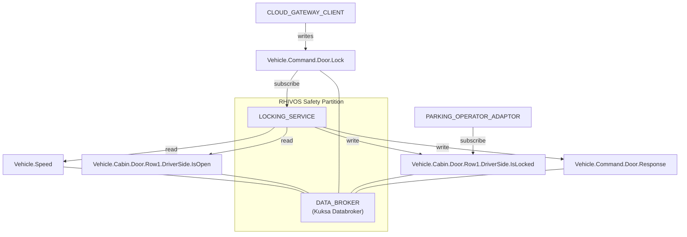
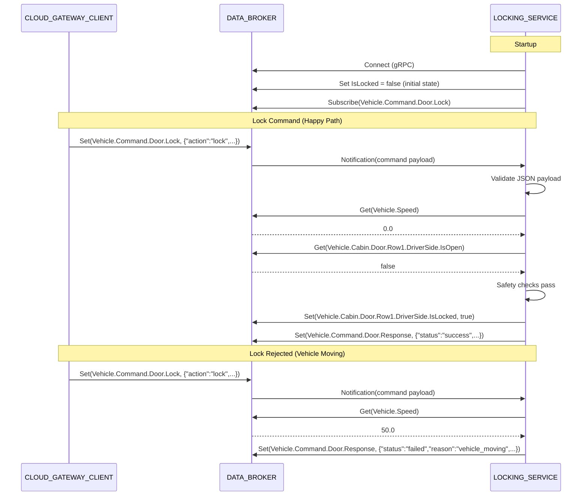

# Design Document: LOCKING_SERVICE

## Overview

The LOCKING_SERVICE is a Rust binary (`rhivos/locking-service`) that runs as a long-lived process, subscribing to lock/unlock command signals from Eclipse Kuksa Databroker (DATA_BROKER) via gRPC. It validates command payloads, checks safety constraints (speed, door ajar), manages lock state, and publishes responses. The service uses tonic-generated gRPC clients from the `kuksa.val.v1` proto definitions.

## Architecture





### Module Responsibilities

1. **main** — Entry point: parses config, connects to DATA_BROKER, sets initial state, starts command loop, handles shutdown signals.
2. **command** — Command payload parsing and validation: deserializes JSON, validates required fields, normalizes the command structure.
3. **safety** — Safety constraint checker: reads speed and door signals from DATA_BROKER, evaluates preconditions for lock operations.
4. **broker** — DATA_BROKER client abstraction: wraps tonic-generated kuksa.val.v1 gRPC client, provides typed get/set/subscribe operations on VSS signals.
5. **response** — Response builder: constructs JSON response payloads with command_id, status, reason, and timestamp.

## Components and Interfaces

### CLI Interface

```
$ locking-service
locking-service v0.1.0 - ASIL-B door lock service

Usage: locking-service [options]

Environment:
  DATABROKER_ADDR   DATA_BROKER gRPC address (default: http://localhost:55556)

The service subscribes to Vehicle.Command.Door.Lock and processes
lock/unlock commands with safety validation.
```

### Core Data Types

```rust
/// Deserialized lock/unlock command from Vehicle.Command.Door.Lock
struct LockCommand {
    command_id: String,
    action: Action,       // Lock | Unlock
    doors: Vec<String>,
    source: Option<String>,
    vin: Option<String>,
    timestamp: Option<i64>,
}

enum Action {
    Lock,
    Unlock,
}

/// Safety check result
enum SafetyResult {
    Safe,
    VehicleMoving,
    DoorOpen,
}

/// Command response published to Vehicle.Command.Door.Response
struct CommandResponse {
    command_id: String,
    status: String,       // "success" | "failed"
    reason: Option<String>,
    timestamp: i64,
}
```

### Module Interfaces

```rust
// command module
fn parse_command(json: &str) -> Result<LockCommand, CommandError>;
fn validate_command(cmd: &LockCommand) -> Result<(), CommandError>;

// safety module
async fn check_safety(broker: &BrokerClient) -> SafetyResult;

// broker module
struct BrokerClient { /* wraps kuksa.val.v1 gRPC client */ }
impl BrokerClient {
    async fn connect(addr: &str) -> Result<Self, BrokerError>;
    async fn subscribe(&self, signal: &str) -> Result<SubscriptionStream, BrokerError>;
    async fn get_float(&self, signal: &str) -> Result<Option<f32>, BrokerError>;
    async fn get_bool(&self, signal: &str) -> Result<Option<bool>, BrokerError>;
    async fn set_bool(&self, signal: &str, value: bool) -> Result<(), BrokerError>;
    async fn set_string(&self, signal: &str, value: &str) -> Result<(), BrokerError>;
}

// response module
fn success_response(command_id: &str) -> String;
fn failure_response(command_id: &str, reason: &str) -> String;
```

## Data Models

### Command Payload Schema

```json
{
  "command_id": "string (required, non-empty UUID)",
  "action": "string (required, 'lock' | 'unlock')",
  "doors": ["string (required, must contain 'driver')"],
  "source": "string (optional, e.g. 'companion_app')",
  "vin": "string (optional)",
  "timestamp": "integer (optional, unix timestamp)"
}
```

### Response Payload Schema

```json
{
  "command_id": "string (echoed from command)",
  "status": "string ('success' | 'failed')",
  "reason": "string (present only when status is 'failed')",
  "timestamp": "integer (unix timestamp of response)"
}
```

### Failure Reasons

| Reason | Trigger |
|--------|---------|
| `"invalid_command"` | Missing or malformed required fields |
| `"unsupported_door"` | `doors` contains a value other than `"driver"` |
| `"vehicle_moving"` | `Vehicle.Speed` >= 1.0 km/h |
| `"door_open"` | `Vehicle.Cabin.Door.Row1.DriverSide.IsOpen` is true |

### Configuration

| Env Var | Default | Description |
|---------|---------|-------------|
| `DATABROKER_ADDR` | `http://localhost:55556` | DATA_BROKER gRPC endpoint (TCP or UDS) |

## Operational Readiness

- **Startup logging:** Service logs version, DATA_BROKER address, and ready status.
- **Shutdown:** Handles SIGTERM/SIGINT, completes in-flight command, logs shutdown.
- **Health:** The service is healthy if the DATA_BROKER subscription is active. No separate health endpoint (it's an embedded service, not a web server).
- **Rollback:** Revert to skeleton binary via `git checkout`. No persistent state — all state is in DATA_BROKER.

## Correctness Properties

### Property 1: Command Validation Completeness

*For any* string input received on the `Vehicle.Command.Door.Lock` signal, the LOCKING_SERVICE SHALL either (a) parse it into a valid `LockCommand` with all required fields and proceed to safety checks, or (b) publish a failure response or discard the input.

**Validates: Requirements 03-REQ-2.1, 03-REQ-2.2, 03-REQ-2.3, 03-REQ-2.E1, 03-REQ-2.E2**

### Property 2: Safety Gate for Lock Commands

*For any* valid lock command, the LOCKING_SERVICE SHALL execute the lock if and only if `Vehicle.Speed < 1.0` AND `Vehicle.Cabin.Door.Row1.DriverSide.IsOpen == false`. In all other cases, the service SHALL publish a failure response with the appropriate reason.

**Validates: Requirements 03-REQ-3.1, 03-REQ-3.2, 03-REQ-3.3**

### Property 3: Unlock Bypass

*For any* valid unlock command, the LOCKING_SERVICE SHALL execute the unlock regardless of vehicle speed or door ajar state.

**Validates: Requirements 03-REQ-3.4**

### Property 4: State-Response Consistency

*For any* successfully executed command (lock or unlock), the LOCKING_SERVICE SHALL publish the lock state signal before publishing the success response. The lock state value SHALL match the commanded action (true for lock, false for unlock).

**Validates: Requirements 03-REQ-4.1, 03-REQ-4.2, 03-REQ-5.1**

### Property 5: Idempotent Operations

*For any* lock command when the door is already locked, or unlock command when the door is already unlocked, the LOCKING_SERVICE SHALL publish a success response without modifying the lock state signal.

**Validates: Requirements 03-REQ-4.E1, 03-REQ-4.E2**

### Property 6: Response Completeness

*For any* command processed by the LOCKING_SERVICE (whether successful or failed), exactly one response SHALL be published to `Vehicle.Command.Door.Response` containing the original `command_id`, a `status` field, and a `timestamp` field.

**Validates: Requirements 03-REQ-5.1, 03-REQ-5.2, 03-REQ-5.3**

## Error Handling

| Error Condition | Behavior | Requirement |
|----------------|----------|-------------|
| DATA_BROKER unreachable on startup | Retry with exponential backoff (1s, 2s, 4s), exit after 5 attempts | 03-REQ-1.E1 |
| Subscription stream interrupted | Resubscribe up to 3 times, then exit | 03-REQ-1.E2 |
| Invalid JSON payload | Log error, discard command (no response) | 03-REQ-2.E1 |
| Missing required field | Publish failure response with reason "invalid_command" | 03-REQ-2.E2 |
| Unsupported door value | Publish failure response with reason "unsupported_door" | 03-REQ-2.E3 |
| Vehicle speed >= 1.0 km/h | Publish failure response with reason "vehicle_moving" | 03-REQ-3.1 |
| Door ajar (IsOpen == true) | Publish failure response with reason "door_open" | 03-REQ-3.2 |
| Speed signal unset | Treat as 0.0 (stationary), allow lock | 03-REQ-3.E1 |
| Door signal unset | Treat as false (closed), allow lock | 03-REQ-3.E2 |
| Lock when already locked | Publish success, no state change | 03-REQ-4.E1 |
| Unlock when already unlocked | Publish success, no state change | 03-REQ-4.E2 |
| Response publish fails | Log error, continue processing | 03-REQ-5.E1 |
| SIGTERM during command processing | Complete in-flight command, then exit 0 | 03-REQ-6.E1 |

## Technology Stack

| Technology | Version | Purpose |
|-----------|---------|---------|
| Rust | edition 2021 | Service implementation |
| tonic | 0.11+ | gRPC client framework |
| prost | 0.12+ | Protocol Buffer code generation |
| tokio | 1.x | Async runtime |
| serde / serde_json | 1.x | JSON serialization/deserialization |
| tracing | 0.1+ | Structured logging |
| kuksa.val.v1 proto | — | Kuksa Databroker gRPC API definitions (vendored) |

## Definition of Done

A task group is complete when ALL of the following are true:

1. All subtasks within the group are checked off (`[x]`)
2. All spec tests (`test_spec.md` entries) for the task group pass
3. All property tests for the task group pass
4. All previously passing tests still pass (no regressions)
5. No linter warnings or errors introduced
6. Code is committed on a feature branch and pushed to remote
7. Feature branch is merged back to `main`
8. `tasks.md` checkboxes are updated to reflect completion

## Testing Strategy

- **Unit tests:** The `command`, `safety`, and `response` modules are pure functions testable without DATA_BROKER. Tests use `#[test]` with serde_json for payload testing and mock inputs for safety checks.
- **Integration tests:** A `tests/locking-service/` Go module (or Rust integration tests) starts the databroker container, runs the locking-service binary, sends commands via gRPC, and verifies responses. Requires Podman.
- **Property tests:** Use `proptest` crate for Rust property-based testing of command parsing (arbitrary JSON strings) and safety logic (arbitrary speed/door combinations).
- **Mock broker:** Unit tests for the command processing loop use a mock `BrokerClient` trait implementation that returns configurable signal values, avoiding dependency on a live databroker.
