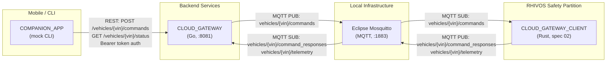
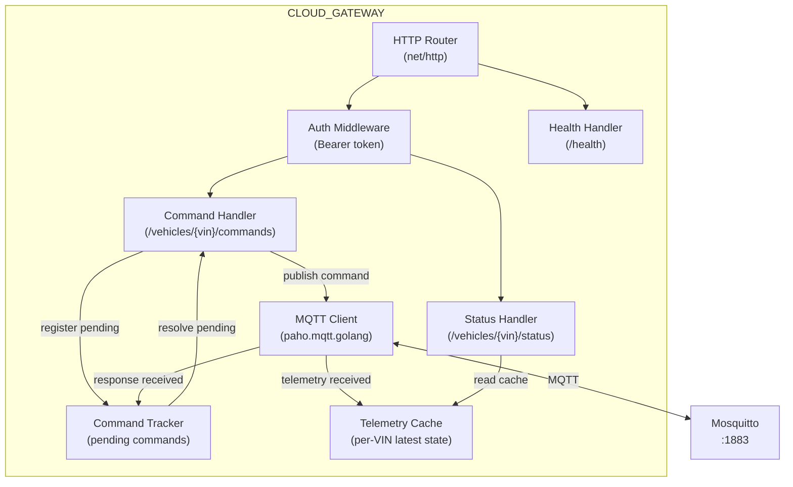
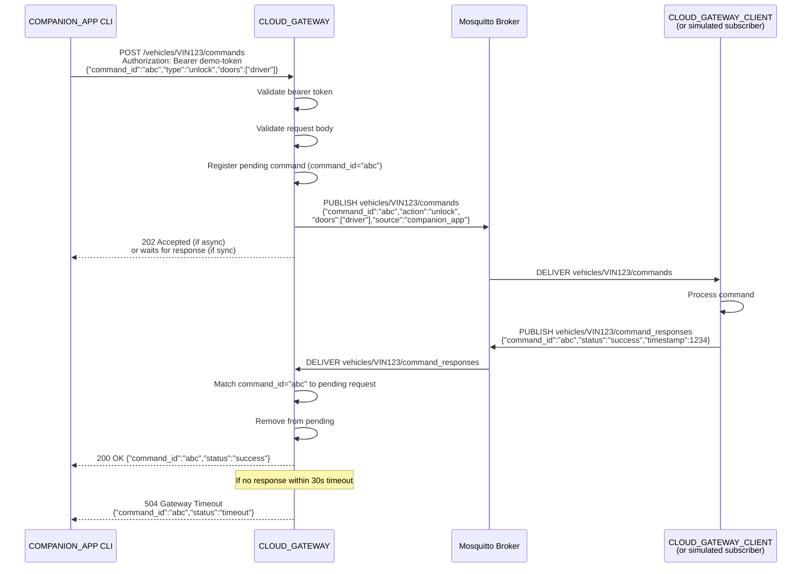
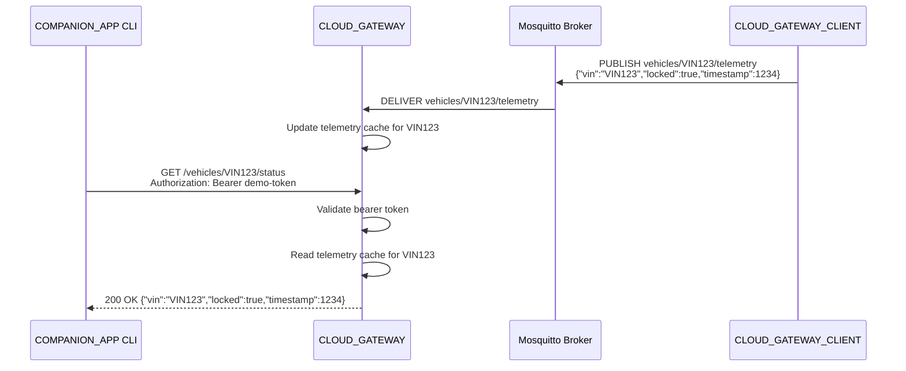

# Design Document: Vehicle-to-Cloud Connectivity (Phase 2.2)

## Overview

This design describes the CLOUD_GATEWAY backend service, the enhanced mock
COMPANION_APP CLI, and the integration test strategy for the vehicle-to-cloud
connectivity layer. The CLOUD_GATEWAY is the protocol bridge between REST
(mobile apps) and MQTT (vehicle). It receives lock/unlock commands via REST,
publishes them to MQTT, waits for responses on MQTT, and returns them to the
REST caller. The mock COMPANION_APP CLI is upgraded from a stub to a functional
REST client.

## Architecture

### System Context



### CLOUD_GATEWAY Internal Architecture



### Command Request-Response Flow



### Telemetry Flow



## Components and Interfaces

### CLOUD_GATEWAY Module Structure

```
backend/cloud-gateway/
├── go.mod
├── go.sum
├── main.go                    # Entry point: starts HTTP + MQTT
├── main_test.go               # Unit tests
├── internal/
│   ├── api/
│   │   ├── router.go          # HTTP router setup, health endpoint
│   │   ├── router_test.go
│   │   ├── middleware.go       # Bearer token auth middleware
│   │   ├── middleware_test.go
│   │   ├── commands.go         # POST /vehicles/{vin}/commands handler
│   │   ├── commands_test.go
│   │   ├── status.go           # GET /vehicles/{vin}/status handler
│   │   └── status_test.go
│   ├── mqtt/
│   │   ├── client.go           # MQTT client wrapper (connect, pub, sub)
│   │   ├── client_test.go
│   │   ├── topics.go           # Topic name construction helpers
│   │   └── topics_test.go
│   ├── bridge/
│   │   ├── bridge.go           # REST-to-MQTT bridge logic
│   │   ├── bridge_test.go
│   │   ├── tracker.go          # Pending command tracker
│   │   └── tracker_test.go
│   └── config/
│       ├── config.go           # Configuration (env vars)
│       └── config_test.go
└── integration_test.go         # Integration test (build tag: integration)
```

### Mock COMPANION_APP CLI Module Structure

```
mock/companion-app-cli/
├── go.mod
├── go.sum
├── main.go                    # Cobra root command setup
├── main_test.go               # Unit tests
└── cmd/
    ├── root.go                # Root command, global flags
    ├── lock.go                # lock subcommand
    ├── lock_test.go
    ├── unlock.go              # unlock subcommand
    ├── unlock_test.go
    ├── status.go              # status subcommand
    └── status_test.go
```

### REST Endpoint Specifications

#### POST /vehicles/{vin}/commands

**Purpose:** Send a lock or unlock command to a vehicle.

**Request:**
```
POST /vehicles/{vin}/commands HTTP/1.1
Authorization: Bearer <token>
Content-Type: application/json

{
  "command_id": "550e8400-e29b-41d4-a716-446655440000",
  "type": "lock",
  "doors": ["driver"]
}
```

**Success Response (command acknowledged, waiting for vehicle):**
```
HTTP/1.1 202 Accepted
Content-Type: application/json

{
  "command_id": "550e8400-e29b-41d4-a716-446655440000",
  "status": "pending"
}
```

Note: The CLOUD_GATEWAY returns 202 immediately after publishing to MQTT. If
the caller wants to wait for the final result, it can poll the status endpoint
or the CLOUD_GATEWAY can optionally hold the connection open until the MQTT
response arrives (implementation choice — see Design Decisions below).

**Error Responses:**

| Status | Condition | Body |
|--------|-----------|------|
| 400 | Invalid JSON or missing fields | `{"error": "<description>"}` |
| 400 | Invalid command type | `{"error": "type must be 'lock' or 'unlock'"}` |
| 401 | Missing or invalid bearer token | `{"error": "unauthorized"}` |
| 504 | MQTT response timeout | `{"command_id": "<id>", "status": "timeout"}` |

#### GET /vehicles/{vin}/status

**Purpose:** Query the latest known status of a vehicle.

**Request:**
```
GET /vehicles/{vin}/status HTTP/1.1
Authorization: Bearer <token>
```

**Success Response:**
```
HTTP/1.1 200 OK
Content-Type: application/json

{
  "vin": "VIN12345",
  "locked": true,
  "timestamp": 1708700000
}
```

**Error Responses:**

| Status | Condition | Body |
|--------|-----------|------|
| 401 | Missing or invalid bearer token | `{"error": "unauthorized"}` |
| 404 | No telemetry received for VIN | `{"error": "no status available for vehicle"}` |

#### GET /health

**Purpose:** Health check endpoint (no authentication required).

**Request:**
```
GET /health HTTP/1.1
```

**Response:**
```
HTTP/1.1 200 OK
Content-Type: application/json

{"status": "ok"}
```

### MQTT Topic and Payload Formats

#### Topic: `vehicles/{vin}/commands`

**Publisher:** CLOUD_GATEWAY
**Subscriber:** CLOUD_GATEWAY_CLIENT (spec 02)
**QoS:** 1 (at least once)

**Payload:**
```json
{
  "command_id": "550e8400-e29b-41d4-a716-446655440000",
  "action": "lock",
  "doors": ["driver"],
  "source": "companion_app"
}
```

| Field | Type | Description |
|-------|------|-------------|
| `command_id` | string (UUID) | Unique command identifier for correlation |
| `action` | string | "lock" or "unlock" (mapped from REST `type` field) |
| `doors` | array of strings | Target doors (e.g., ["driver"]) |
| `source` | string | Always "companion_app" for commands from CLI |

Note: The REST field `type` is mapped to the MQTT field `action` to align
with the PRD's VSS command signal format (`Vehicle.Command.Door.Lock`).

#### Topic: `vehicles/{vin}/command_responses`

**Publisher:** CLOUD_GATEWAY_CLIENT (spec 02)
**Subscriber:** CLOUD_GATEWAY
**QoS:** 1 (at least once)

**Payload:**
```json
{
  "command_id": "550e8400-e29b-41d4-a716-446655440000",
  "status": "success",
  "reason": "",
  "timestamp": 1708700000
}
```

| Field | Type | Description |
|-------|------|-------------|
| `command_id` | string (UUID) | Matches the original command |
| `status` | string | "success" or "failed" |
| `reason` | string | Optional explanation for failures |
| `timestamp` | integer | Unix epoch seconds |

#### Topic: `vehicles/{vin}/telemetry`

**Publisher:** CLOUD_GATEWAY_CLIENT (spec 02)
**Subscriber:** CLOUD_GATEWAY
**QoS:** 0 (at most once — telemetry is best-effort)

**Payload:**
```json
{
  "vin": "VIN12345",
  "locked": true,
  "doors": {
    "driver": {"locked": true, "open": false}
  },
  "location": {
    "latitude": 48.1351,
    "longitude": 11.5820
  },
  "speed": 0.0,
  "parking_session_active": false,
  "timestamp": 1708700000
}
```

### Command Correlation

Commands are correlated using a `command_id` (UUID v4) that flows through the
entire lifecycle:

1. COMPANION_APP CLI generates a UUID v4 `command_id`.
2. The CLI sends it in the REST POST body.
3. CLOUD_GATEWAY extracts the `command_id` and registers a pending entry in
   the Command Tracker.
4. CLOUD_GATEWAY includes the `command_id` in the MQTT message published to
   `vehicles/{vin}/commands`.
5. The vehicle-side CLOUD_GATEWAY_CLIENT echoes the `command_id` in its MQTT
   response on `vehicles/{vin}/command_responses`.
6. CLOUD_GATEWAY matches the incoming `command_id` to the pending entry and
   resolves the REST response.

The Command Tracker is an in-memory map:
```
map[string]chan CommandResponse  // key: command_id, value: response channel
```

Each pending command has a goroutine-safe channel that the REST handler blocks
on (with timeout). When an MQTT response arrives, the bridge writes to the
channel, unblocking the REST handler.

### Configuration

| Variable | Component | Default | Description |
|----------|-----------|---------|-------------|
| `PORT` | cloud-gateway | `8081` | HTTP listen port |
| `MQTT_BROKER_URL` | cloud-gateway | `tcp://localhost:1883` | MQTT broker address |
| `MQTT_CLIENT_ID` | cloud-gateway | `cloud-gateway` | MQTT client identifier |
| `COMMAND_TIMEOUT` | cloud-gateway | `30s` | Max wait time for command response |
| `AUTH_TOKEN` | cloud-gateway | `demo-token` | Valid bearer token (demo only) |
| `GATEWAY_URL` | companion-app-cli | `http://localhost:8081` | CLOUD_GATEWAY base URL |

### Design Decisions

**D1: Synchronous command wait.** The CLOUD_GATEWAY holds the REST connection
open until an MQTT response arrives (or timeout). This simplifies the CLI
(single request-response) at the cost of holding HTTP connections open. For a
demo with low concurrency, this is acceptable. The initial 202 Accepted
response is returned only if the MQTT broker is unreachable (degraded mode).
Under normal operation, the handler blocks until the command completes or
times out.

**D2: Per-VIN MQTT subscriptions.** The CLOUD_GATEWAY subscribes to wildcard
topics `vehicles/+/command_responses` and `vehicles/+/telemetry` rather than
subscribing per-VIN. This avoids subscription management complexity and is
efficient for the demo's scale.

**D3: In-memory state only.** The Command Tracker and telemetry cache are
in-memory. No persistence is needed for a demo. A restart clears all pending
commands and cached telemetry.

**D4: Single bearer token.** For the demo, a single configurable token
(`AUTH_TOKEN` env var) is valid for all VINs. No per-user or per-VIN
authorization.

## Correctness Properties

### Property 1: Command ID Preservation

*For any* command submitted via REST, the `command_id` in the MQTT message
published to `vehicles/{vin}/commands` SHALL be identical to the `command_id`
in the original REST request body.

**Validates: Requirements 03-REQ-3.1, 03-REQ-3.3**

### Property 2: Response Correlation Correctness

*For any* MQTT response received on `vehicles/{vin}/command_responses`, if its
`command_id` matches a pending REST request, the REST response SHALL contain
the same `command_id` and the `status` from the MQTT response.

**Validates: Requirements 03-REQ-3.2, 03-REQ-2.5**

### Property 3: Authentication Enforcement

*For any* request to `/vehicles/{vin}/commands` or `/vehicles/{vin}/status`
without a valid bearer token, the response SHALL be HTTP 401 regardless of the
request body content.

**Validates: Requirement 03-REQ-1.4**

### Property 4: Topic Routing Correctness

*For any* command submitted for VIN V via REST, the MQTT message SHALL be
published to topic `vehicles/V/commands` (not to any other VIN's topic).

**Validates: Requirements 03-REQ-2.2, 03-REQ-5.1**

### Property 5: Timeout Guarantee

*For any* pending command that does not receive an MQTT response within the
configured timeout, the REST client SHALL receive an HTTP 504 response with
`status: "timeout"`.

**Validates: Requirement 03-REQ-2.E3**

### Property 6: Multi-Vehicle Isolation

*For any* two concurrent commands for different VINs (V1 and V2), a response
for V1 SHALL NOT be delivered to V2's pending request, even if both commands
have the same `command_id` (which should not happen with UUIDs but must be
safe regardless).

**Validates: Requirement 03-REQ-5.2**

### Property 7: Graceful Degradation

*For any* state where the MQTT broker is unreachable, the CLOUD_GATEWAY REST
API SHALL remain responsive (returning appropriate error responses) rather than
hanging or crashing.

**Validates: Requirements 03-REQ-2.E1, 03-REQ-2.E2**

## Error Handling

| Error Condition | Behavior | Requirement |
|----------------|----------|-------------|
| Missing bearer token | HTTP 401 Unauthorized | 03-REQ-1.4 |
| Invalid bearer token | HTTP 401 Unauthorized | 03-REQ-1.4 |
| Malformed JSON body | HTTP 400 Bad Request with error description | 03-REQ-1.E1, 03-REQ-1.E2 |
| Invalid command type | HTTP 400 Bad Request with error description | 03-REQ-1.E1 |
| Missing required fields | HTTP 400 Bad Request with error description | 03-REQ-1.E1 |
| MQTT broker unreachable (startup) | Log warning, start REST in degraded mode, retry connection | 03-REQ-2.E1 |
| MQTT broker disconnected (runtime) | Log event, auto-reconnect, pending commands timeout | 03-REQ-2.E2 |
| Command response timeout | HTTP 504 with `{"command_id":"...","status":"timeout"}` | 03-REQ-2.E3 |
| Unknown command_id in MQTT response | Log warning, discard message | 03-REQ-3.E1 |
| Duplicate command_id response | Use first, ignore subsequent | 03-REQ-3.E2 |
| No telemetry for VIN | HTTP 404 with error message | 03-REQ-1.2 |
| CLI missing --token flag | Print error to stderr, exit non-zero | 03-REQ-4.E1 |
| CLI cannot connect to CLOUD_GATEWAY | Print error to stderr, exit non-zero | 03-REQ-4.E2 |

## Technology Stack

| Category | Technology | Version | Purpose |
|----------|-----------|---------|---------|
| Language | Go | 1.22+ | CLOUD_GATEWAY and mock CLI |
| HTTP | net/http (stdlib) | — | REST API server and client |
| HTTP routing | net/http (Go 1.22 pattern matching) | — | Path parameter extraction |
| MQTT | eclipse/paho.mqtt.golang | 1.4+ | MQTT client library |
| CLI | github.com/spf13/cobra | 1.8+ | CLI framework (mock companion-app-cli) |
| UUID | github.com/google/uuid | 1.6+ | Command ID generation |
| JSON | encoding/json (stdlib) | — | Request/response serialization |
| Testing | testing (stdlib) | — | Unit and integration tests |
| MQTT broker | Eclipse Mosquitto | 2.x | Local development (from spec 01 infra) |
| Containers | Podman/Docker | 4.x+ | Mosquitto container |

## Definition of Done

A task group is complete when ALL of the following are true:

1. All subtasks within the group are checked off (`[x]`)
2. All spec tests (`test_spec.md` entries) for the task group pass
3. All property tests for the task group pass
4. All previously passing tests still pass (no regressions)
5. No linter warnings or errors introduced
6. Code is committed on a feature branch and pushed to remote
7. Feature branch is merged back to `develop`
8. `tasks.md` checkboxes are updated to reflect completion

## Testing Strategy

### Unit Tests

Each Go package within the CLOUD_GATEWAY module includes `_test.go` files that
test the package in isolation using mocks or stubs for external dependencies.

- **api/**: Test HTTP handlers using `httptest.NewRecorder()` and
  `httptest.NewRequest()`. Mock the bridge interface.
- **mqtt/**: Test topic construction and message formatting. Mock the MQTT
  client connection for publish/subscribe tests.
- **bridge/**: Test the Command Tracker (register, resolve, timeout) using
  channels and goroutines. No external dependencies.
- **config/**: Test environment variable parsing with `t.Setenv()`.

Unit tests run without infrastructure: `go test ./...` in the module directory.

### Integration Tests

Integration tests require a running Mosquitto broker (`make infra-up`). They
are gated by a build tag (`//go:build integration`) or by checking if the
broker is reachable (skip if not).

The integration test:
1. Starts a CLOUD_GATEWAY instance (in-process) connected to the local
   Mosquitto.
2. Creates a separate MQTT client to simulate CLOUD_GATEWAY_CLIENT.
3. Sends a REST command via HTTP client.
4. Verifies the command appears on the MQTT topic.
5. Publishes a simulated response on the command_responses topic.
6. Verifies the REST response contains the correct `command_id` and status.

### Mock COMPANION_APP CLI Tests

- Unit tests: verify that each subcommand constructs the correct HTTP request
  (method, URL, headers, body) using a local `httptest.Server`.
- Integration test coverage: the CLI is exercised as part of the CLOUD_GATEWAY
  integration test.

### Property Test Approach

| Property | Test Approach |
|----------|---------------|
| P1: Command ID Preservation | Send command, capture MQTT message, assert `command_id` matches |
| P2: Response Correlation | Send command, publish MQTT response with matching ID, assert REST response matches |
| P3: Authentication Enforcement | Send requests without token, assert all return 401 |
| P4: Topic Routing | Send command for VIN "X", subscribe to `vehicles/X/commands`, assert message received; subscribe to `vehicles/Y/commands`, assert no message |
| P5: Timeout Guarantee | Send command, do not publish MQTT response, assert 504 after timeout |
| P6: Multi-Vehicle Isolation | Send concurrent commands for different VINs, publish responses, assert each gets correct response |
| P7: Graceful Degradation | Start CLOUD_GATEWAY without Mosquitto, send REST request, assert non-crash and error response |
