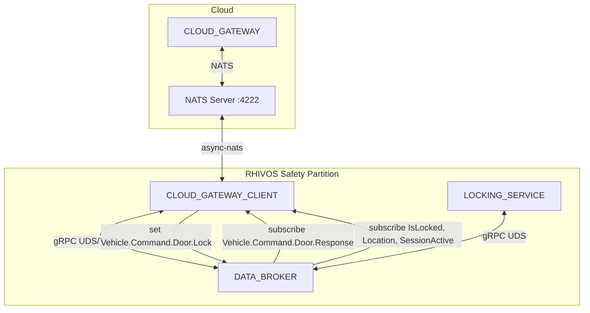
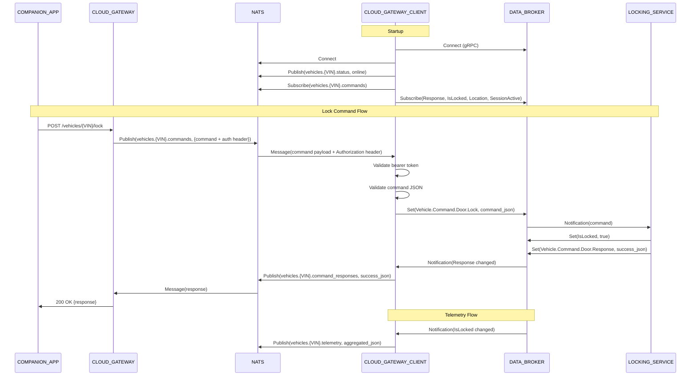

# Design Document: CLOUD_GATEWAY_CLIENT

## Overview

The CLOUD_GATEWAY_CLIENT is a Rust binary (`rhivos/cloud-gateway-client`) that bridges the vehicle's DATA_BROKER with the cloud-based CLOUD_GATEWAY. It runs two concurrent async tasks: (1) a command handler that subscribes to NATS commands, validates them, and forwards to DATA_BROKER; (2) a telemetry/response handler that subscribes to DATA_BROKER signals and publishes changes to NATS. Both tasks share a tokio runtime and are managed by a main loop that handles graceful shutdown.

## Architecture





### Module Responsibilities

1. **main** — Entry point: parses config, connects to NATS and DATA_BROKER, spawns command and telemetry tasks, handles shutdown signals.
2. **config** — Configuration parsing: reads VIN, NATS_URL, DATABROKER_ADDR, BEARER_TOKEN from environment.
3. **command** — Command handling: validates bearer tokens, parses/validates command JSON, forwards to DATA_BROKER.
4. **telemetry** — Telemetry aggregation: subscribes to DATA_BROKER signals, builds and publishes aggregated telemetry messages to NATS.
5. **relay** — Response relay: subscribes to `Vehicle.Command.Door.Response` in DATA_BROKER, publishes changes to NATS.
6. **broker** — DATA_BROKER client abstraction: wraps tonic-generated kuksa.val.v1 gRPC client (shared with or similar to spec 03's broker module).
7. **nats_client** — NATS client wrapper: connection management, publish/subscribe helpers, header access.

## Components and Interfaces

### CLI Interface

```
$ cloud-gateway-client
cloud-gateway-client v0.1.0 - Vehicle-to-cloud NATS bridge

Usage: cloud-gateway-client

Environment:
  VIN              Vehicle identification number (required)
  NATS_URL         NATS server URL (default: nats://localhost:4222)
  DATABROKER_ADDR  DATA_BROKER gRPC address (default: http://localhost:55556)
  BEARER_TOKEN     Expected bearer token for command auth (default: demo-token)
```

### Core Data Types

```rust
struct Config {
    vin: String,
    nats_url: String,
    databroker_addr: String,
    bearer_token: String,
}

/// Incoming command from NATS
struct IncomingCommand {
    command_id: String,
    action: String,
    doors: Option<Vec<String>>,
    source: Option<String>,
    vin: Option<String>,
    timestamp: Option<i64>,
}

/// Aggregated telemetry published to NATS
struct TelemetryMessage {
    vin: String,
    #[serde(skip_serializing_if = "Option::is_none")]
    is_locked: Option<bool>,
    #[serde(skip_serializing_if = "Option::is_none")]
    latitude: Option<f64>,
    #[serde(skip_serializing_if = "Option::is_none")]
    longitude: Option<f64>,
    #[serde(skip_serializing_if = "Option::is_none")]
    parking_active: Option<bool>,
    timestamp: i64,
}

/// Registration message published on startup
struct RegistrationMessage {
    vin: String,
    status: String,  // "online"
    timestamp: i64,
}
```

### Module Interfaces

```rust
// config module
fn load_config() -> Result<Config, ConfigError>;

// command module
fn validate_bearer_token(header: Option<&str>, expected: &str) -> bool;
fn parse_and_validate_command(payload: &[u8]) -> Result<IncomingCommand, CommandError>;

// telemetry module
fn build_telemetry(vin: &str, state: &TelemetryState) -> TelemetryMessage;
struct TelemetryState {
    is_locked: Option<bool>,
    latitude: Option<f64>,
    longitude: Option<f64>,
    parking_active: Option<bool>,
}

// relay module (async)
async fn relay_responses(broker: &BrokerClient, nats: &NatsClient, vin: &str) -> Result<(), RelayError>;

// nats_client module
struct NatsClient { /* wraps async_nats::Client */ }
impl NatsClient {
    async fn connect(url: &str) -> Result<Self, NatsError>;
    async fn subscribe(&self, subject: &str) -> Result<Subscription, NatsError>;
    async fn publish(&self, subject: &str, payload: &[u8]) -> Result<(), NatsError>;
    async fn publish_with_headers(&self, subject: &str, headers: HeaderMap, payload: &[u8]) -> Result<(), NatsError>;
}
```

## Data Models

### Configuration

| Env Var | Default | Required | Description |
|---------|---------|----------|-------------|
| `VIN` | — | Yes | Vehicle identification number |
| `NATS_URL` | `nats://localhost:4222` | No | NATS server URL |
| `DATABROKER_ADDR` | `http://localhost:55556` | No | DATA_BROKER gRPC endpoint |
| `BEARER_TOKEN` | `demo-token` | No | Expected bearer token for command auth |

### NATS Subjects

| Subject | Direction | Payload |
|---------|-----------|---------|
| `vehicles.{VIN}.commands` | Subscribe | Command JSON (with `Authorization` header) |
| `vehicles.{VIN}.command_responses` | Publish | Response JSON (verbatim from DATA_BROKER) |
| `vehicles.{VIN}.telemetry` | Publish | Aggregated telemetry JSON |
| `vehicles.{VIN}.status` | Publish (once) | Registration JSON |

### Telemetry Payload

```json
{
  "vin": "WDB123456789",
  "is_locked": true,
  "latitude": 48.8566,
  "longitude": 2.3522,
  "parking_active": true,
  "timestamp": 1700000000
}
```

## Operational Readiness

- **Startup logging:** Service logs version, VIN, NATS URL, DATA_BROKER address, and ready status.
- **Shutdown:** Handles SIGTERM/SIGINT, drains NATS connection, closes gRPC channel.
- **Health:** Service is healthy if both NATS and DATA_BROKER connections are active. No separate health endpoint.
- **Rollback:** Revert to skeleton binary via `git checkout`. No persistent state.

## Correctness Properties

### Property 1: Command Authentication Gate

*For any* NATS message received on `vehicles.{VIN}.commands`, the CLOUD_GATEWAY_CLIENT SHALL forward the command to DATA_BROKER if and only if the `Authorization` header contains a bearer token matching the configured `BEARER_TOKEN`.

**Validates: Requirements 04-REQ-2.1, 04-REQ-2.E1**

### Property 2: Command Validation Completeness

*For any* NATS message payload that passes token validation, the CLOUD_GATEWAY_CLIENT SHALL forward it to DATA_BROKER if and only if the payload is valid JSON containing a non-empty `command_id` and an `action` value of `"lock"` or `"unlock"`.

**Validates: Requirements 04-REQ-2.2, 04-REQ-2.3, 04-REQ-2.E2, 04-REQ-2.E3**

### Property 3: Response Relay Fidelity

*For any* change to `Vehicle.Command.Door.Response` in DATA_BROKER, the CLOUD_GATEWAY_CLIENT SHALL publish the exact same JSON string to `vehicles.{VIN}.command_responses` on NATS.

**Validates: Requirements 04-REQ-3.1, 04-REQ-3.2**

### Property 4: Telemetry Aggregation

*For any* change to a subscribed telemetry signal in DATA_BROKER, the CLOUD_GATEWAY_CLIENT SHALL publish an aggregated telemetry message to NATS containing the VIN, all currently known signal values, and a timestamp.

**Validates: Requirements 04-REQ-4.1, 04-REQ-4.2, 04-REQ-4.3**

### Property 5: VIN Subject Consistency

*For any* NATS subject used by the service (commands, command_responses, telemetry, status), the subject SHALL contain the configured VIN.

**Validates: Requirements 04-REQ-1.2, 04-REQ-6.1**

### Property 6: Graceful Shutdown Completeness

*For any* SIGTERM/SIGINT received by the service, the service SHALL close NATS and DATA_BROKER connections and exit with code 0.

**Validates: Requirements 04-REQ-7.1**

## Error Handling

| Error Condition | Behavior | Requirement |
|----------------|----------|-------------|
| NATS unreachable on startup | Retry with exponential backoff, exit after 5 attempts | 04-REQ-1.E1 |
| NATS connection lost | Reconnect up to 3 times, then exit | 04-REQ-1.E2 |
| Bearer token missing/invalid | Log rejection, discard command | 04-REQ-2.E1 |
| Invalid JSON payload | Log error, discard command | 04-REQ-2.E2 |
| Missing required command field | Log error, discard command | 04-REQ-2.E3 |
| Response NATS publish fails | Log error, continue | 04-REQ-3.E1 |
| Telemetry signal never set | Omit field from payload | 04-REQ-4.E1 |
| Telemetry NATS publish fails | Log error, continue | 04-REQ-4.E2 |
| DATA_BROKER unreachable on startup | Retry with exponential backoff, exit after 5 attempts | 04-REQ-5.E1 |
| VIN env var not set | Exit with code 1, log error | 04-REQ-6.E1 |
| SIGTERM during command processing | Complete in-flight command, then exit 0 | 04-REQ-7.E1 |

## Technology Stack

| Technology | Version | Purpose |
|-----------|---------|---------|
| Rust | edition 2021 | Service implementation |
| tokio | 1.x | Async runtime |
| async-nats | 0.33+ | NATS client |
| tonic | 0.11+ | gRPC client (DATA_BROKER) |
| prost | 0.12+ | Protocol Buffer code generation |
| serde / serde_json | 1.x | JSON serialization |
| tracing | 0.1+ | Structured logging |
| kuksa.val.v1 proto | — | Kuksa Databroker gRPC API definitions (vendored) |

## Definition of Done

A task group is complete when ALL of the following are true:

1. All subtasks within the group are checked off (`[x]`)
2. All spec tests (`test_spec.md` entries) for the task group pass
3. All property tests for the task group pass
4. All previously passing tests still pass (no regressions)
5. No linter warnings or errors introduced
6. Code is committed on a feature branch and pushed to remote
7. Feature branch is merged back to `main`
8. `tasks.md` checkboxes are updated to reflect completion

## Testing Strategy

- **Unit tests:** The `config`, `command`, and `telemetry` modules are pure functions testable without external services. Tests use `#[test]` with serde_json and mock NATS headers.
- **Integration tests:** A `tests/cloud-gateway-client/` Go module starts NATS and databroker containers, runs the service binary, sends NATS messages, and verifies responses and telemetry. Requires Podman.
- **Property tests:** Use `proptest` crate for command validation (arbitrary payloads) and telemetry aggregation (arbitrary signal states).
- **Mock broker:** Unit tests for the command processing use a mock `BrokerClient` trait (shared pattern with spec 03). Unit tests for NATS use mock message structs with configurable headers.
