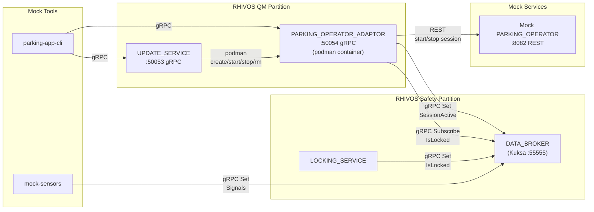
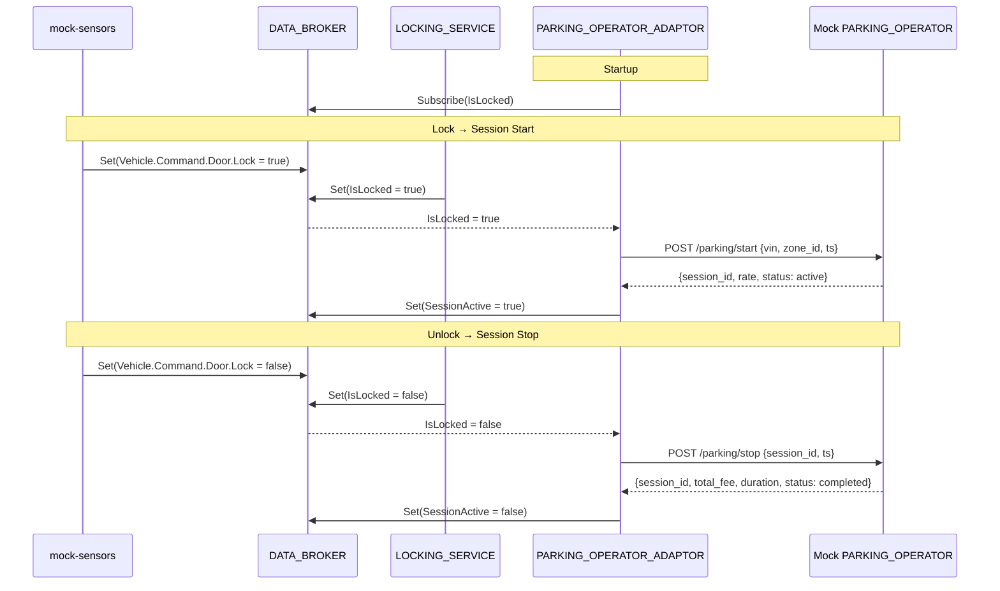
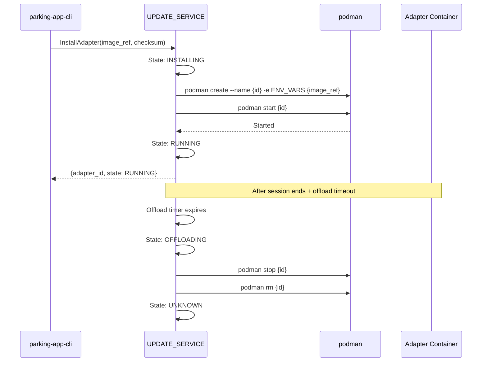

# Design Document: PARKING_OPERATOR_ADAPTOR + UPDATE_SERVICE

## Overview

This design covers the RHIVOS QM partition: the PARKING_OPERATOR_ADAPTOR that
autonomously manages parking sessions based on lock/unlock events, and the
UPDATE_SERVICE that manages adapter container lifecycle via podman. The adaptor
bridges the vehicle's DATA_BROKER signals to a PARKING_OPERATOR's REST API.
The UPDATE_SERVICE starts adapters as podman containers (pre-built locally)
and offloads them after inactivity.

## Architecture

### Runtime Architecture



### Parking Session Sequence



### Adapter Lifecycle Sequence



### Module Responsibilities

1. **`rhivos/parking-operator-adaptor/`** — Rust service: Kuksa subscription
   for lock events, REST client for PARKING_OPERATOR, gRPC server for
   PARKING_APP, session state management.
2. **`rhivos/update-service/`** — Rust service: gRPC server for PARKING_APP,
   podman CLI integration, adapter state machine, persistence, offload timer.
3. **`mock/parking-operator/`** — Go REST service: simulates a parking operator
   with configurable rates and in-memory session store.
4. **`mock/parking-app-cli/`** — Go CLI: gRPC client for UPDATE_SERVICE and
   PARKING_OPERATOR_ADAPTOR.

## Components and Interfaces

### PARKING_OPERATOR_ADAPTOR Internal Architecture

```
rhivos/parking-operator-adaptor/
├── src/
│   ├── main.rs            # Entry point, config, wiring
│   ├── config.rs          # Configuration from env vars / CLI flags
│   ├── session.rs         # Session state management
│   ├── lock_watcher.rs    # DATA_BROKER subscription for IsLocked
│   ├── operator_client.rs # REST client for PARKING_OPERATOR
│   └── grpc_server.rs     # ParkingAdapter gRPC service implementation
```

#### Configuration

```rust
pub struct Config {
    pub listen_addr: String,          // default: "0.0.0.0:50054"
    pub databroker_addr: String,      // default: "localhost:55555"
    pub parking_operator_url: String, // required
    pub zone_id: String,              // required
    pub vehicle_vin: String,          // required
}
```

#### Session State

```rust
pub struct ParkingSession {
    pub session_id: String,
    pub vehicle_id: String,
    pub zone_id: String,
    pub start_time: i64,        // Unix timestamp
    pub end_time: Option<i64>,
    pub rate_type: RateType,
    pub rate_amount: f64,
    pub currency: String,
    pub total_fee: Option<f64>,
    pub status: SessionStatus,  // Active, Completed
}

pub enum RateType {
    PerMinute,
    Flat,
}

pub enum SessionStatus {
    Active,
    Completed,
}
```

#### Lock Watcher

```rust
pub async fn watch_lock_events(
    kuksa: KuksaClient,
    operator: OperatorClient,
    session_state: Arc<Mutex<Option<ParkingSession>>>,
    config: Config,
) {
    let mut stream = kuksa.subscribe_bool(SIGNAL_DOOR_IS_LOCKED).await?;
    while let Some(is_locked) = stream.next().await {
        let mut session = session_state.lock().await;
        match (is_locked?, session.is_some()) {
            (true, false) => {
                // Lock event, no active session → start
                let resp = operator.start_session(&config).await?;
                *session = Some(ParkingSession::from(resp));
                kuksa.set_bool(SIGNAL_PARKING_SESSION_ACTIVE, true).await?;
            }
            (false, true) => {
                // Unlock event, active session → stop
                let sess = session.as_ref().unwrap();
                let resp = operator.stop_session(&sess.session_id).await?;
                session.as_mut().unwrap().complete(resp);
                kuksa.set_bool(SIGNAL_PARKING_SESSION_ACTIVE, false).await?;
            }
            _ => {} // Ignore duplicate events
        }
    }
}
```

### PARKING_OPERATOR REST Client

```rust
pub struct OperatorClient {
    base_url: String,
    http: reqwest::Client,
}

impl OperatorClient {
    pub async fn start_session(&self, config: &Config) -> Result<StartResponse>;
    pub async fn stop_session(&self, session_id: &str) -> Result<StopResponse>;
    pub async fn get_rate(&self, zone_id: &str) -> Result<RateResponse>;
    pub async fn get_session(&self, session_id: &str) -> Result<SessionResponse>;
}
```

### UPDATE_SERVICE Internal Architecture

```
rhivos/update-service/
├── src/
│   ├── main.rs            # Entry point, config, wiring
│   ├── config.rs          # Configuration
│   ├── state.rs           # Adapter state machine + persistence
│   ├── podman.rs          # Podman CLI wrapper
│   ├── offload.rs         # Offloading timer management
│   └── grpc_server.rs     # UpdateService gRPC implementation
```

#### Adapter State Machine

```rust
pub enum AdapterState {
    Unknown,
    Installing,
    Running,
    Stopped,
    Error(String),
    Offloading,
}

/// Valid state transitions
impl AdapterState {
    pub fn can_transition_to(&self, target: &AdapterState) -> bool {
        matches!(
            (self, target),
            (AdapterState::Unknown, AdapterState::Installing)
            | (AdapterState::Installing, AdapterState::Running)
            | (AdapterState::Installing, AdapterState::Error(_))
            | (AdapterState::Running, AdapterState::Stopped)
            | (AdapterState::Running, AdapterState::Offloading)
            | (AdapterState::Running, AdapterState::Error(_))
            | (AdapterState::Offloading, AdapterState::Unknown)
            | (AdapterState::Error(_), AdapterState::Installing)
            | (AdapterState::Stopped, AdapterState::Installing)
        )
    }
}
```

#### Adapter Entry (Persisted)

```rust
pub struct AdapterEntry {
    pub adapter_id: String,
    pub image_ref: String,
    pub checksum: String,
    pub container_name: String,     // podman container name
    pub state: AdapterState,
    pub config: AdapterConfig,      // env vars passed to container
    pub installed_at: Option<i64>,
    pub session_ended_at: Option<i64>,
}
```

#### Persistence

State is persisted to `{data_dir}/adapters.json`:

```json
[
  {
    "adapter_id": "adapter-001",
    "image_ref": "localhost/parking-operator-adaptor:latest",
    "checksum": "sha256:abc123",
    "container_name": "poa-adapter-001",
    "state": "Running",
    "installed_at": 1708300800,
    "session_ended_at": null
  }
]
```

Loaded on startup; reconciled with `podman ps` to detect containers that
were stopped or removed externally.

#### Podman Wrapper

```rust
pub struct PodmanRunner;

impl PodmanRunner {
    /// Create and start a container.
    pub async fn create_and_start(
        name: &str,
        image: &str,
        env_vars: &HashMap<String, String>,
        network: &str,
    ) -> Result<()> {
        // podman create --name {name} --network {network} -e K=V ... {image}
        // podman start {name}
    }

    /// Stop and remove a container.
    pub async fn stop_and_remove(name: &str) -> Result<()> {
        // podman stop {name}
        // podman rm {name}
    }

    /// Check if a container is running.
    pub async fn is_running(name: &str) -> Result<bool> {
        // podman inspect --format '{{.State.Running}}' {name}
    }

    /// List containers matching a prefix.
    pub async fn list(prefix: &str) -> Result<Vec<ContainerInfo>>;
}
```

#### Offload Timer

```rust
pub struct OffloadManager {
    timeout: Duration,          // default: 5 minutes
    timers: HashMap<String, JoinHandle<()>>,
}

impl OffloadManager {
    /// Start an offload timer for an adapter.
    pub fn start_timer(&mut self, adapter_id: String, callback: impl FnOnce());

    /// Cancel the timer (e.g., new session started).
    pub fn cancel_timer(&mut self, adapter_id: &str);
}
```

#### WatchAdapterStates

The gRPC streaming RPC uses a broadcast channel:

```rust
pub struct StateNotifier {
    sender: broadcast::Sender<AdapterStateEvent>,
}

impl StateNotifier {
    pub fn notify(&self, event: AdapterStateEvent);
    pub fn subscribe(&self) -> broadcast::Receiver<AdapterStateEvent>;
}
```

### Mock PARKING_OPERATOR

```
mock/parking-operator/
├── go.mod
├── main.go
└── handlers.go
```

#### REST API

| Method | Endpoint | Request | Response |
|--------|----------|---------|----------|
| POST | `/parking/start` | `{vehicle_id, zone_id, timestamp}` | `{session_id, status, rate}` |
| POST | `/parking/stop` | `{session_id, timestamp}` | `{session_id, status, total_fee, duration_seconds, currency}` |
| GET | `/parking/sessions/{id}` | — | `{session_id, vehicle_id, zone_id, start_time, end_time, rate, total_fee, status}` |
| GET | `/parking/rate` | — | `{zone_id, rate_type, rate_amount, currency}` |

#### Fee Calculation

```go
func calculateFee(session Session, rateType string, rateAmount float64) float64 {
    switch rateType {
    case "per_minute":
        minutes := math.Ceil(session.Duration().Minutes())
        return rateAmount * minutes
    case "flat":
        return rateAmount
    }
}
```

### Mock PARKING_APP CLI (Updated)

```
parking-app-cli [flags] <command>

UPDATE_SERVICE commands:
  install-adapter --image-ref <ref> [--checksum <sha>]
  list-adapters
  remove-adapter --adapter-id <id>
  adapter-status --adapter-id <id>
  watch-adapters

PARKING_OPERATOR_ADAPTOR commands:
  start-session --zone-id <zone> --vehicle-vin <vin>
  stop-session --session-id <id>
  get-status [--session-id <id>]
  get-rate --zone-id <zone>

Global Flags:
  --update-service-addr   (default: localhost:50053)
  --adapter-addr          (default: localhost:50054)
```

## Data Models

### Mock PARKING_OPERATOR Request/Response Schemas

#### POST /parking/start

```json
// Request
{"vehicle_id": "DEMO0000000000001", "zone_id": "zone-1", "timestamp": 1708300800}

// Response
{
  "session_id": "sess-001",
  "status": "active",
  "rate": {"rate_type": "per_minute", "rate_amount": 0.05, "currency": "EUR"}
}
```

#### POST /parking/stop

```json
// Request
{"session_id": "sess-001", "timestamp": 1708301100}

// Response
{
  "session_id": "sess-001",
  "status": "completed",
  "total_fee": 0.25,
  "duration_seconds": 300,
  "currency": "EUR"
}
```

#### GET /parking/rate

```json
{"zone_id": "zone-1", "rate_type": "per_minute", "rate_amount": 0.05, "currency": "EUR"}
```

### Configuration Summary

| Service | Flag / Env Var | Default |
|---------|---------------|---------|
| PARKING_OPERATOR_ADAPTOR | `LISTEN_ADDR` | `0.0.0.0:50054` |
| PARKING_OPERATOR_ADAPTOR | `DATABROKER_ADDR` | `localhost:55555` |
| PARKING_OPERATOR_ADAPTOR | `PARKING_OPERATOR_URL` | (required) |
| PARKING_OPERATOR_ADAPTOR | `ZONE_ID` | (required) |
| PARKING_OPERATOR_ADAPTOR | `VEHICLE_VIN` | (required) |
| UPDATE_SERVICE | `LISTEN_ADDR` | `0.0.0.0:50053` |
| UPDATE_SERVICE | `DATA_DIR` | `./data` |
| UPDATE_SERVICE | `OFFLOAD_TIMEOUT` | `5m` |
| Mock PARKING_OPERATOR | `--listen-addr` | `:8082` |
| Mock PARKING_OPERATOR | `--rate-type` | `per_minute` |
| Mock PARKING_OPERATOR | `--rate-amount` | `0.05` |
| Mock PARKING_OPERATOR | `--currency` | `EUR` |

## Operational Readiness

### Observability

- Both Rust services use `tracing` for structured logging.
- UPDATE_SERVICE logs all state transitions and podman operations.
- PARKING_OPERATOR_ADAPTOR logs session start/stop events and
  PARKING_OPERATOR responses.

### Areas of Improvement (Deferred)

- **OCI registry pull:** Currently uses pre-built local images. Future: pull
  from Google Artifact Registry with checksum verification.
- **Resource monitoring:** Currently timer-only offloading. Future: monitor
  disk/memory usage.
- **Multi-adapter support:** The demo uses one adapter at a time. The state
  machine supports multiple, but integration testing focuses on single.
- **Podman API:** Currently uses CLI. Future: use podman REST API for better
  error handling.

## Correctness Properties

### Property 1: Event-Session Invariant

*For any* `IsLocked` transition to `true` when no session is active, THE
PARKING_OPERATOR_ADAPTOR SHALL call `POST /parking/start` on the
PARKING_OPERATOR and set `SessionActive = true` in DATA_BROKER. *For any*
`IsLocked` transition to `false` when a session is active, THE adaptor
SHALL call `POST /parking/stop` and set `SessionActive = false`.

**Validates: Requirements 04-REQ-1.2, 04-REQ-1.3, 04-REQ-1.4, 04-REQ-1.5**

### Property 2: Session Idempotency

*For any* duplicate `IsLocked` event (lock while already locked, unlock while
already unlocked), THE PARKING_OPERATOR_ADAPTOR SHALL NOT start or stop a
session and SHALL NOT modify `SessionActive`.

**Validates: Requirements 04-REQ-1.E2, 04-REQ-1.E3**

### Property 3: State Machine Integrity

*For any* adapter managed by UPDATE_SERVICE, THE state SHALL only transition
via valid edges in the state machine. No invalid transition SHALL occur.

**Validates: Requirements 04-REQ-3.4**

### Property 4: Podman-State Consistency

*For any* adapter in state `RUNNING`, THE corresponding podman container
SHALL be running. *For any* adapter in state `UNKNOWN` or `STOPPED`, no
corresponding podman container SHALL exist.

**Validates: Requirements 04-REQ-3.1, 04-REQ-3.3, 04-REQ-3.6**

### Property 5: Offloading Timer Correctness

*For any* adapter whose session ended more than `OFFLOAD_TIMEOUT` ago, THE
UPDATE_SERVICE SHALL offload the adapter. *For any* adapter with an active
session or a session that ended less than `OFFLOAD_TIMEOUT` ago, THE
UPDATE_SERVICE SHALL NOT offload it.

**Validates: Requirements 04-REQ-5.1, 04-REQ-5.2, 04-REQ-5.3**

### Property 6: Persistence Round-Trip

*For any* adapter state written to the persistence file, THE same state SHALL
be recoverable after an UPDATE_SERVICE restart and SHALL match the actual
podman container state.

**Validates: Requirements 04-REQ-3.5, 04-REQ-3.6**

### Property 7: Fee Calculation Accuracy

*For any* parking session with `per_minute` rate, THE total fee SHALL equal
`rate_amount × ceil(duration_minutes)`. *For any* session with `flat` rate,
THE total fee SHALL equal `rate_amount` regardless of duration.

**Validates: Requirements 04-REQ-6.5**

### Property 8: SessionActive Signal Accuracy

*For any* moment in time, THE `Vehicle.Parking.SessionActive` signal in
DATA_BROKER SHALL be `true` if and only if the PARKING_OPERATOR_ADAPTOR
has an active session.

**Validates: Requirements 04-REQ-1.3, 04-REQ-1.5**

## Error Handling

| Error Condition | Behavior | Requirement |
|----------------|----------|-------------|
| PARKING_OPERATOR unreachable (session start) | Log error, do not set SessionActive, retry on next lock | 04-REQ-1.E1 |
| Duplicate lock event (session already active) | Ignore | 04-REQ-1.E2 |
| Duplicate unlock event (no active session) | Ignore | 04-REQ-1.E3 |
| StartSession while session active (gRPC) | Return existing session | 04-REQ-2.E1 |
| StopSession with unknown session_id | gRPC NOT_FOUND | 04-REQ-2.E2 |
| podman create/start fails | State → ERROR, return error details | 04-REQ-3.E1 |
| InstallAdapter for already-running adapter | Return existing info | 04-REQ-3.E2 |
| Container image not found locally | State → ERROR | 04-REQ-3.E3 |
| GetAdapterStatus unknown adapter_id | gRPC NOT_FOUND | 04-REQ-4.E1 |
| RemoveAdapter unknown adapter_id | gRPC NOT_FOUND | 04-REQ-4.E2 |
| Manual remove before offload timer | Cancel timer | 04-REQ-5.E1 |
| Mock: stop unknown session | REST 404 | 04-REQ-6.E1 |
| Mock: duplicate start for same vehicle | Return existing session | 04-REQ-6.E2 |
| CLI: target unreachable | Error + non-zero exit | 04-REQ-7.E1 |

## Technology Stack

| Component | Technology | Version | Purpose |
|-----------|-----------|---------|---------|
| PARKING_OPERATOR_ADAPTOR | Rust | 1.75+ | Adapter service |
| UPDATE_SERVICE | Rust | 1.75+ | Container lifecycle manager |
| gRPC framework | tonic | 0.12.x | gRPC server |
| HTTP client | reqwest | 0.12.x | REST client for PARKING_OPERATOR |
| Async runtime | tokio | 1.x | Async runtime |
| JSON serialization | serde + serde_json | 1.x | Config persistence, REST messages |
| CLI parsing | clap | 4.x | Configuration |
| Logging | tracing | 0.1 | Structured logging |
| Kuksa client | parking-proto (spec 02) | — | DATA_BROKER gRPC |
| Container runtime | Podman CLI | 4.x+ | Adapter container management |
| Mock PARKING_OPERATOR | Go | 1.22+ | Mock REST service |
| Mock PARKING_APP CLI | Go | 1.22+ | gRPC test client |

## Definition of Done

A task group is complete when ALL of the following are true:

1. All subtasks within the group are checked off (`[x]`)
2. All property tests for the task group pass
3. All previously passing tests still pass (no regressions)
4. No linter warnings or errors introduced
5. Code is committed on a feature branch and pushed to remote
6. Feature branch is merged back to `develop`
7. `tasks.md` checkboxes are updated to reflect completion

## Testing Strategy

### PARKING_OPERATOR_ADAPTOR Unit Tests

- **Lock watcher:** Mock Kuksa client emitting IsLocked events + mock
  OperatorClient. Verify start/stop calls, SessionActive writes, duplicate
  event handling.
- **Operator client:** Use `mockito` or similar to mock HTTP responses.
  Verify request payloads and response parsing.
- **gRPC server:** Start server on random port, call each RPC, verify
  correct behavior.

### UPDATE_SERVICE Unit Tests

- **State machine:** Test all valid transitions, verify invalid transitions
  are rejected. Property-based test with random transition sequences.
- **Persistence:** Write state, read it back, verify equality.
- **Offload timer:** Use `tokio::time::pause()` to control time. Verify
  timer fires after timeout, verify cancellation.
- **Podman wrapper:** Test with mock command executor (trait-based). Verify
  correct podman CLI invocations.
- **gRPC server:** Start server, call each RPC, verify state changes.

### Mock PARKING_OPERATOR Tests

- **Handlers:** Use `httptest` to verify each endpoint's request/response.
- **Fee calculation:** Unit test with known durations and rates.

### Integration Tests

Require: Kuksa, LOCKING_SERVICE, PARKING_OPERATOR_ADAPTOR (standalone),
mock PARKING_OPERATOR, and optionally UPDATE_SERVICE + podman.

1. **Session flow:** mock-sensors lock → adaptor starts session → verify
   SessionActive + PARKING_OPERATOR session created → mock-sensors unlock →
   verify session completed with fee.
2. **Adapter lifecycle:** parking-app-cli install-adapter → verify RUNNING →
   remove-adapter → verify STOPPED.
3. **Offloading:** Install adapter → start/stop session → wait for timeout →
   verify adapter removed.
4. **State persistence:** Install adapter → restart UPDATE_SERVICE → verify
   adapter still tracked and reconciled with podman.
