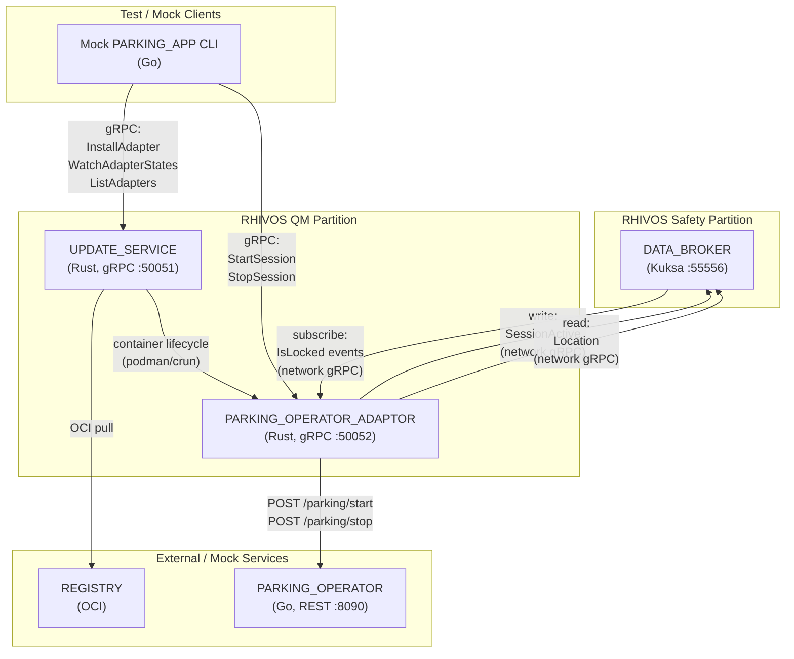
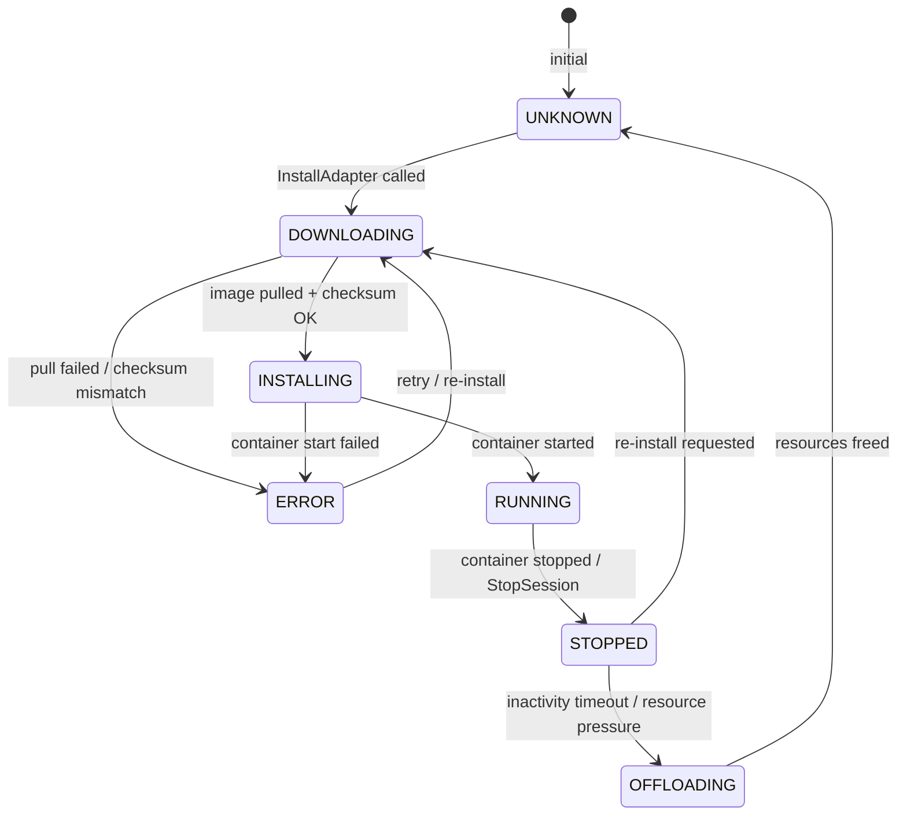
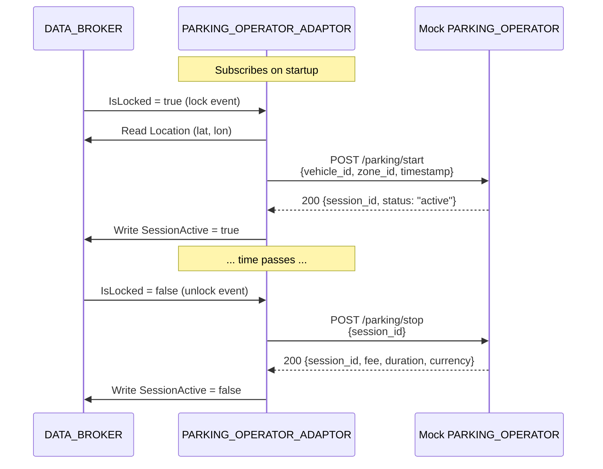

# Design Document: RHIVOS QM Partition (Phase 2.3)

## Overview

This design describes the architecture and implementation approach for the
RHIVOS QM partition services: PARKING_OPERATOR_ADAPTOR and UPDATE_SERVICE,
along with the mock PARKING_OPERATOR and mock PARKING_APP CLI enhancements.
The QM partition bridges the vehicle's safety-critical signals (via DATA_BROKER)
with external cloud-based parking operators. The design prioritizes clear
separation of concerns, observable state machines, and testability.

## Architecture

### Component Data Flow



### Adapter Lifecycle State Machine



### Autonomous Session Flow



## Components and Interfaces

### PARKING_OPERATOR_ADAPTOR

**Crate:** `rhivos/parking-operator-adaptor`

#### Module Structure

```
parking-operator-adaptor/
├── Cargo.toml
├── build.rs
└── src/
    ├── main.rs              # Entry point, server startup, config
    ├── lib.rs               # Re-exports, module declarations
    ├── grpc_service.rs      # ParkingAdaptor gRPC trait implementation
    ├── session_manager.rs   # Autonomous session state machine
    ├── databroker_client.rs # Kuksa DATA_BROKER gRPC client
    ├── operator_client.rs   # PARKING_OPERATOR REST client (reqwest)
    └── config.rs            # Configuration (env vars, addresses)
```

#### Configuration (Environment Variables)

| Variable | Default | Description |
|----------|---------|-------------|
| `ADAPTOR_GRPC_ADDR` | `0.0.0.0:50052` | gRPC listen address |
| `DATABROKER_ADDR` | `localhost:55556` | DATA_BROKER gRPC address |
| `OPERATOR_URL` | `http://localhost:8090` | PARKING_OPERATOR REST base URL |
| `VEHICLE_ID` | `VIN12345` | Vehicle identifier |

#### gRPC Interface

Implements `ParkingAdaptor` service from `parking_adaptor.proto`:

| Method | Input | Output | Behavior |
|--------|-------|--------|----------|
| `StartSession` | `StartSessionRequest{vehicle_id, zone_id}` | `StartSessionResponse{session_id, status}` | Calls `POST /parking/start` on operator; writes `SessionActive = true` to DATA_BROKER |
| `StopSession` | `StopSessionRequest{session_id}` | `StopSessionResponse{session_id, total_fee, duration_seconds, currency}` | Calls `POST /parking/stop` on operator; writes `SessionActive = false` to DATA_BROKER |
| `GetStatus` | `GetStatusRequest{session_id}` | `GetStatusResponse{session_id, active, start_time, current_fee, currency}` | Calls `GET /parking/{session_id}/status` on operator |
| `GetRate` | `GetRateRequest{zone_id}` | `GetRateResponse{rate_per_hour, currency, zone_name}` | Calls `GET /rate/{zone_id}` on operator |

#### REST Client (towards PARKING_OPERATOR)

Uses `reqwest` (async HTTP client):

| Endpoint | Method | Request Body | Response Body |
|----------|--------|-------------|---------------|
| `/parking/start` | POST | `{"vehicle_id": "...", "zone_id": "...", "timestamp": 1234}` | `{"session_id": "...", "status": "active"}` |
| `/parking/stop` | POST | `{"session_id": "..."}` | `{"session_id": "...", "fee": 2.50, "duration_seconds": 3600, "currency": "EUR"}` |
| `/parking/{session_id}/status` | GET | — | `{"session_id": "...", "active": true, "start_time": 1234, "current_fee": 1.25, "currency": "EUR"}` |
| `/rate/{zone_id}` | GET | — | `{"rate_per_hour": 2.50, "currency": "EUR", "zone_name": "Zone A"}` |

#### Session Manager

The `SessionManager` maintains the current session state:

```rust
pub struct SessionManager {
    active_session: Option<ActiveSession>,
    override_active: bool,  // true if PARKING_APP overrode autonomous behavior
}

pub struct ActiveSession {
    session_id: String,
    zone_id: String,
    start_time: i64,
}
```

State transitions:
- Lock event + no active session -> start session (autonomous)
- Unlock event + active session -> stop session (autonomous)
- `StartSession` gRPC call -> start session (override)
- `StopSession` gRPC call -> stop session (override)
- Lock event + active session -> ignore (idempotent)
- Unlock event + no active session -> ignore (idempotent)

#### DATA_BROKER Client

Uses the Kuksa Databroker gRPC API (from `kuksa.val.v1` proto):

- **Subscribe:** Opens a streaming subscription to
  `Vehicle.Cabin.Door.Row1.DriverSide.IsLocked`
- **Read:** Single get request for
  `Vehicle.CurrentLocation.Latitude` and
  `Vehicle.CurrentLocation.Longitude`
- **Write:** Set request for `Vehicle.Parking.SessionActive`

Connection uses network gRPC (TCP) for cross-partition communication.

### UPDATE_SERVICE

**Crate:** `rhivos/update-service`

#### Module Structure

```
update-service/
├── Cargo.toml
├── build.rs
└── src/
    ├── main.rs              # Entry point, server startup
    ├── lib.rs               # Re-exports, module declarations
    ├── grpc_service.rs      # UpdateService gRPC trait implementation
    ├── adapter_manager.rs   # Adapter state machine, lifecycle management
    ├── oci_client.rs        # OCI registry client (image pull, manifest)
    ├── container_runtime.rs # podman/crun CLI invocations
    ├── checksum.rs          # SHA-256 verification
    ├── offloader.rs         # Inactivity timer and offloading logic
    └── config.rs            # Configuration
```

#### Configuration (Environment Variables)

| Variable | Default | Description |
|----------|---------|-------------|
| `UPDATE_GRPC_ADDR` | `0.0.0.0:50051` | gRPC listen address |
| `REGISTRY_URL` | `localhost:5000` | OCI registry URL |
| `OFFLOAD_TIMEOUT_HOURS` | `24` | Inactivity timeout before offloading (hours) |
| `CONTAINER_STORE_PATH` | `/var/lib/containers/adapters/` | Container storage path |

#### gRPC Interface

Implements `UpdateService` service from `update_service.proto`:

| Method | Input | Output | Behavior |
|--------|-------|--------|----------|
| `InstallAdapter` | `InstallAdapterRequest{image_ref, checksum_sha256}` | `InstallAdapterResponse{job_id, adapter_id, state}` | Initiates async download; returns immediately with DOWNLOADING state |
| `WatchAdapterStates` | `WatchAdapterStatesRequest{}` | `stream AdapterStateEvent` | Server-streaming; emits events on all adapter state transitions |
| `ListAdapters` | `ListAdaptersRequest{}` | `ListAdaptersResponse{adapters[]}` | Returns snapshot of all known adapters |
| `RemoveAdapter` | `RemoveAdapterRequest{adapter_id}` | `RemoveAdapterResponse{}` | Stops container, removes resources |
| `GetAdapterStatus` | `GetAdapterStatusRequest{adapter_id}` | `GetAdapterStatusResponse{adapter}` | Returns single adapter info |

#### Adapter Manager

Manages a map of adapters and enforces state machine transitions:

```rust
pub struct AdapterManager {
    adapters: HashMap<String, AdapterRecord>,
    state_tx: broadcast::Sender<AdapterStateEvent>,
    offload_timeout: Duration,
}

pub struct AdapterRecord {
    info: AdapterInfo,
    last_active: Instant,
    container_id: Option<String>,
}
```

Valid state transitions are defined in Requirement 7 (`04-REQ-7.1`).

#### OCI Client

Handles image pulling from OCI-compliant registries:

1. Fetch manifest: `GET /v2/{name}/manifests/{reference}`
2. Verify SHA-256 checksum of manifest digest
3. Fetch layers: `GET /v2/{name}/blobs/{digest}`
4. Store to `CONTAINER_STORE_PATH`

For the demo, this can be implemented using the `oci-distribution` crate or
manual HTTP requests with `reqwest`.

#### Container Runtime

Invokes `podman` or `crun` via `std::process::Command`:

- **Create:** `podman create --name {adapter_id} {image_ref}`
- **Start:** `podman start {adapter_id}`
- **Stop:** `podman stop {adapter_id}`
- **Remove:** `podman rm {adapter_id}`
- **Status:** `podman inspect {adapter_id}`

Container lifecycle events are mapped to adapter state transitions.

#### Offloader

Background tokio task that periodically checks stopped adapters:

```rust
async fn offload_loop(manager: Arc<Mutex<AdapterManager>>) {
    loop {
        tokio::time::sleep(CHECK_INTERVAL).await;
        let mut mgr = manager.lock().await;
        for adapter in mgr.stopped_adapters() {
            if adapter.last_active.elapsed() > mgr.offload_timeout {
                mgr.transition(adapter.id, OFFLOADING);
                // remove container resources
                mgr.transition(adapter.id, UNKNOWN);
                mgr.remove(adapter.id);
            }
        }
    }
}
```

### Mock PARKING_OPERATOR (Go)

**Module:** `mock/parking-operator`

#### Module Structure

```
mock/parking-operator/
├── go.mod
├── go.sum
├── main.go          # HTTP server setup, route registration
├── handler.go       # Request handlers
├── store.go         # In-memory session/zone storage
└── main_test.go     # Unit tests
```

#### Configuration (Environment Variables)

| Variable | Default | Description |
|----------|---------|-------------|
| `PORT` | `8090` | HTTP listen port |

#### REST API

| Endpoint | Method | Request Body | Response Body | Status |
|----------|--------|-------------|---------------|--------|
| `/parking/start` | POST | `{"vehicle_id": "V1", "zone_id": "Z1", "timestamp": 1234}` | `{"session_id": "uuid", "status": "active"}` | 200 |
| `/parking/stop` | POST | `{"session_id": "uuid"}` | `{"session_id": "uuid", "fee": 2.50, "duration_seconds": 3600, "currency": "EUR"}` | 200 |
| `/parking/{session_id}/status` | GET | — | `{"session_id": "uuid", "active": true, "start_time": 1234, "current_fee": 1.25, "currency": "EUR"}` | 200 |
| `/rate/{zone_id}` | GET | — | `{"rate_per_hour": 2.50, "currency": "EUR", "zone_name": "Zone A"}` | 200 |
| `/health` | GET | — | `{"status": "ok"}` | 200 |

#### In-Memory Store

```go
type Session struct {
    ID             string
    VehicleID      string
    ZoneID         string
    StartTime      time.Time
    StopTime       *time.Time
    Active         bool
}

type Zone struct {
    ID          string
    Name        string
    RatePerHour float64
    Currency    string
}
```

Pre-configured zones (hardcoded):

| Zone ID | Name | Rate/Hour | Currency |
|---------|------|-----------|----------|
| `zone-munich-central` | Munich Central | 2.50 | EUR |
| `zone-munich-west` | Munich West | 1.50 | EUR |

Fee calculation: `fee = rate_per_hour * (duration_seconds / 3600.0)`

### Mock PARKING_APP CLI Enhancements

**Module:** `mock/parking-app-cli` (extends existing skeleton from Phase 1.2)

#### Enhanced Commands

| Command | Target Service | gRPC Method | Flags |
|---------|---------------|-------------|-------|
| `install` | UPDATE_SERVICE | `InstallAdapter` | `--image-ref`, `--checksum` |
| `watch` | UPDATE_SERVICE | `WatchAdapterStates` | (none) |
| `list` | UPDATE_SERVICE | `ListAdapters` | (none) |
| `start-session` | PARKING_OPERATOR_ADAPTOR | `StartSession` | `--vehicle-id`, `--zone-id` |
| `stop-session` | PARKING_OPERATOR_ADAPTOR | `StopSession` | `--session-id` |

Each command establishes a gRPC connection, makes the call, prints the
response in human-readable format, and exits. The `watch` command prints events
in a streaming fashion until interrupted (Ctrl+C).

## Data Models

### REST Request/Response Models (PARKING_OPERATOR)

**Start Session Request:**
```json
{
    "vehicle_id": "VIN12345",
    "zone_id": "zone-munich-central",
    "timestamp": 1708700000
}
```

**Start Session Response:**
```json
{
    "session_id": "550e8400-e29b-41d4-a716-446655440000",
    "status": "active"
}
```

**Stop Session Request:**
```json
{
    "session_id": "550e8400-e29b-41d4-a716-446655440000"
}
```

**Stop Session Response:**
```json
{
    "session_id": "550e8400-e29b-41d4-a716-446655440000",
    "fee": 2.50,
    "duration_seconds": 3600,
    "currency": "EUR"
}
```

**Session Status Response:**
```json
{
    "session_id": "550e8400-e29b-41d4-a716-446655440000",
    "active": true,
    "start_time": 1708700000,
    "current_fee": 1.25,
    "currency": "EUR"
}
```

**Rate Response:**
```json
{
    "rate_per_hour": 2.50,
    "currency": "EUR",
    "zone_name": "Munich Central"
}
```

## Correctness Properties

### Property 1: Session State Consistency

*For any* sequence of lock/unlock events processed by PARKING_OPERATOR_ADAPTOR,
the value of `Vehicle.Parking.SessionActive` in DATA_BROKER SHALL match whether
the adaptor has an active session with the PARKING_OPERATOR.

**Validates: Requirements 04-REQ-2.3, 04-REQ-2.4**

### Property 2: Autonomous Idempotency

*For any* repeated lock event when a session is already active, the adaptor
SHALL not create duplicate sessions. Similarly, repeated unlock events when no
session is active SHALL have no effect.

**Validates: Requirements 04-REQ-2.E1, 04-REQ-2.E3**

### Property 3: Override Precedence

*For any* manual `StartSession` or `StopSession` gRPC call, the adaptor SHALL
execute the override regardless of the current lock state, and the
`Vehicle.Parking.SessionActive` signal SHALL reflect the override result.

**Validates: Requirement 04-REQ-2.5**

### Property 4: State Machine Integrity

*For any* adapter managed by UPDATE_SERVICE, the adapter's lifecycle state
SHALL only transition via the allowed transitions defined in `04-REQ-7.1`.
No invalid transition SHALL occur.

**Validates: Requirements 04-REQ-7.1, 04-REQ-7.2**

### Property 5: Checksum Gate

*For any* adapter installation, the adapter SHALL NOT transition from
`DOWNLOADING` to `INSTALLING` unless the SHA-256 checksum of the OCI manifest
digest matches the provided checksum. A mismatch SHALL always result in an
`ERROR` state.

**Validates: Requirements 04-REQ-5.2, 04-REQ-5.E1**

### Property 6: Offloading Correctness

*For any* adapter in `STOPPED` state, if `last_active.elapsed() > offload_timeout`
and no re-install has been requested, the adapter SHALL be offloaded. An adapter
in `RUNNING` state SHALL never be offloaded.

**Validates: Requirements 04-REQ-6.1, 04-REQ-6.2**

### Property 7: Mock Operator Fee Accuracy

*For any* parking session managed by the mock PARKING_OPERATOR, the fee
returned on stop SHALL equal `rate_per_hour * (duration_seconds / 3600.0)`,
using the rate for the session's zone.

**Validates: Requirement 04-REQ-8.3**

### Property 8: Event Stream Completeness

*For any* adapter state transition that occurs, a `WatchAdapterStates` stream
that was active at the time of the transition SHALL receive the corresponding
`AdapterStateEvent`.

**Validates: Requirements 04-REQ-4.3, 04-REQ-6.3**

## Error Handling

| Error Condition | Behavior | Requirement |
|----------------|----------|-------------|
| PARKING_OPERATOR unreachable (REST) | Return gRPC UNAVAILABLE; do not update SessionActive | 04-REQ-1.E3, 04-REQ-2.E2 |
| Duplicate StartSession (already active) | Return gRPC ALREADY_EXISTS | 04-REQ-1.E1 |
| StopSession with unknown session_id | Return gRPC NOT_FOUND | 04-REQ-1.E2 |
| Lock event while session active | Ignore (idempotent) | 04-REQ-2.E3 |
| Unlock event with no active session | Ignore (idempotent) | 04-REQ-2.E1 |
| DATA_BROKER unreachable at startup | Retry with exponential backoff | 04-REQ-3.E1 |
| InstallAdapter for already-installed adapter | Return gRPC ALREADY_EXISTS | 04-REQ-4.E1 |
| RemoveAdapter/GetAdapterStatus with unknown ID | Return gRPC NOT_FOUND | 04-REQ-4.E2 |
| Container start failure | Transition to ERROR state | 04-REQ-4.E3 |
| OCI checksum mismatch | Transition to ERROR; discard image | 04-REQ-5.E1 |
| Registry unreachable | Transition to ERROR state | 04-REQ-5.E2 |
| Re-install during OFFLOADING | Cancel offload; re-download | 04-REQ-6.E1 |
| Mock operator: stop unknown session | HTTP 404 | 04-REQ-8.E1 |
| Mock operator: status unknown session | HTTP 404 | 04-REQ-8.E2 |
| Mock operator: rate for unknown zone | HTTP 404 | 04-REQ-8.E3 |
| CLI: target service unreachable | Print error with address; exit non-zero | 04-REQ-9.E1 |

## Technology Stack

| Category | Technology | Version | Purpose |
|----------|-----------|---------|---------|
| Language | Rust | 1.75+ (edition 2021) | PARKING_OPERATOR_ADAPTOR, UPDATE_SERVICE |
| Language | Go | 1.22+ | Mock PARKING_OPERATOR, Mock CLI enhancements |
| Rust gRPC | tonic | 0.12 | gRPC server/client |
| Rust protobuf | prost | 0.13 | Protobuf serialization |
| Rust async | tokio | 1.x | Async runtime |
| Rust HTTP | reqwest | 0.12+ | REST client for PARKING_OPERATOR |
| Rust serialization | serde, serde_json | 1.x | JSON serialization for REST |
| Rust crypto | sha2 | 0.10+ | SHA-256 checksum computation |
| Go gRPC client | google.golang.org/grpc | 1.65+ | gRPC client for CLI |
| Go CLI | github.com/spf13/cobra | 1.8+ | CLI framework |
| Container runtime | podman / crun | 4.x+ | Adapter container management |
| DATA_BROKER | Eclipse Kuksa Databroker | 0.5.x | Vehicle signal broker (dependency) |
| Protobuf | Proto3 | 3.x | Shared interface definitions |

## Definition of Done

A task group is complete when ALL of the following are true:

1. All subtasks within the group are checked off (`[x]`)
2. All spec tests (`test_spec.md` entries) for the task group pass
3. All property tests for the task group pass
4. All previously passing tests still pass (no regressions)
5. No linter warnings or errors introduced
6. Code is committed on a feature branch and pushed to remote
7. Feature branch is merged back to `develop`
8. `tasks.md` checkboxes are updated to reflect completion

## Testing Strategy

### Unit Tests

- **PARKING_OPERATOR_ADAPTOR:** Test session manager state transitions, gRPC
  handler logic with mocked operator client and DATA_BROKER client. Test
  idempotency of lock/unlock events.
- **UPDATE_SERVICE:** Test adapter state machine transitions (valid and
  invalid), checksum verification logic, offloader timer logic.
- **Mock PARKING_OPERATOR:** Test HTTP handlers (start, stop, status, rate),
  fee calculation accuracy, error responses for unknown resources.

Rust tests use `#[tokio::test]` for async functions. Go tests use standard
`testing` package with `httptest` for HTTP handler tests.

### Integration Tests

Integration tests are located in `tests/integration/` and require local
infrastructure running (`make infra-up` for DATA_BROKER).

- **Lock-to-session test:** Publish IsLocked=true to DATA_BROKER via
  Kuksa CLI or gRPC client, verify PARKING_OPERATOR_ADAPTOR starts a session
  on mock PARKING_OPERATOR, verify SessionActive=true in DATA_BROKER.
- **CLI-to-UpdateService test:** Run mock PARKING_APP CLI `install` command
  against UPDATE_SERVICE, verify adapter transitions via `list` command.
- **Adaptor-to-operator test:** Start PARKING_OPERATOR_ADAPTOR with mock
  PARKING_OPERATOR running, call StartSession via gRPC, verify REST call
  was made to mock operator.

### Property Test Approach

| Property | Test Approach |
|----------|---------------|
| P1: Session State Consistency | Sequence of lock/unlock events; assert SessionActive matches after each |
| P2: Autonomous Idempotency | Send duplicate lock events; assert single session created |
| P3: Override Precedence | Send lock, then manual StopSession; assert SessionActive=false |
| P4: State Machine Integrity | Attempt invalid transitions; assert rejection |
| P5: Checksum Gate | Provide wrong checksum; assert ERROR state, no INSTALLING transition |
| P6: Offloading Correctness | Stop adapter, advance timer past threshold; assert OFFLOADING |
| P7: Fee Accuracy | Start/stop sessions with known durations; assert fee calculation |
| P8: Event Stream Completeness | Watch stream while triggering transitions; assert all events received |
