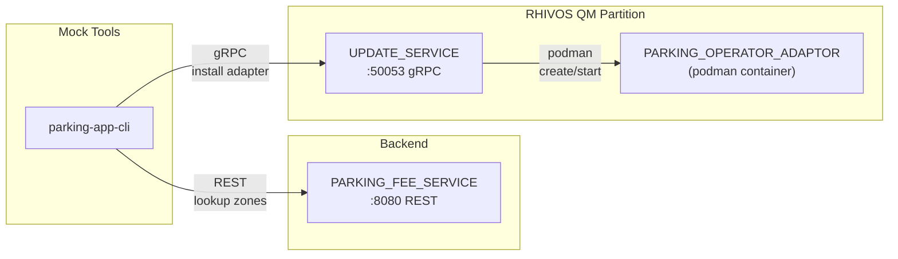
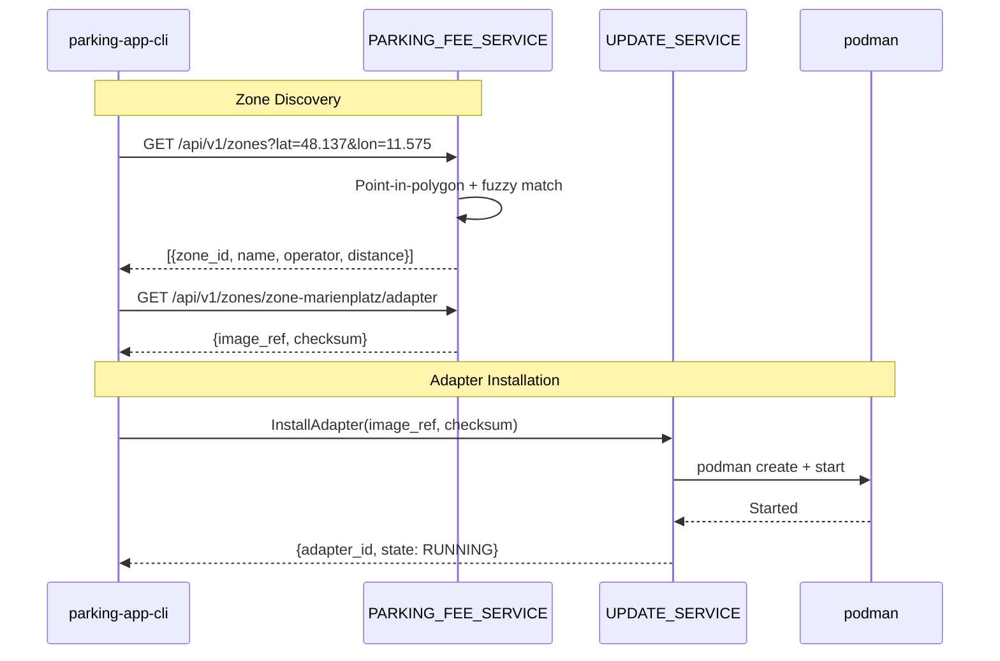

# Design Document: PARKING_FEE_SERVICE

## Overview

The PARKING_FEE_SERVICE is a Go backend service exposing a REST API for
parking zone discovery and adapter metadata retrieval. It enables the
PARKING_APP (or mock CLI) to look up parking zones by geographic location,
retrieve zone details and rates, and obtain the container image reference
needed to install the correct adapter via UPDATE_SERVICE. The service uses
hardcoded demo zone data with realistic Munich geofence polygons and performs
point-in-polygon and fuzzy-radius matching for location lookups.

## Architecture

### Runtime Architecture



### Adapter Discovery Sequence



### Module Responsibilities

1. **`backend/parking-fee-service/`** — Go service: REST API, zone data store,
   geospatial matching logic, hardcoded demo seed data.

## Components and Interfaces

### PARKING_FEE_SERVICE Internal Architecture

```
backend/parking-fee-service/
├── main.go            # Entry point, config, route registration
├── api/
│   └── handlers.go    # REST endpoint handlers
├── geo/
│   └── geo.go         # Point-in-polygon, Haversine distance
└── zones/
    ├── store.go       # Zone data store (in-memory)
    └── seed.go        # Hardcoded demo zone data
```

### REST API

| Method | Endpoint | Request | Response | Description |
|--------|----------|---------|----------|-------------|
| GET | `/healthz` | — | `200 {}` | Health check |
| GET | `/api/v1/zones?lat=X&lon=Y` | Query params | `200 [{zone}]` | Lookup zones by location |
| GET | `/api/v1/zones/{zone_id}` | Path param | `200 {zone}` | Get zone details |
| GET | `/api/v1/zones/{zone_id}/adapter` | Path param | `200 {adapter}` | Get adapter metadata |

### Zone Data Store

```go
type Zone struct {
    ZoneID          string    `json:"zone_id"`
    Name            string    `json:"name"`
    OperatorName    string    `json:"operator_name"`
    Polygon         []LatLon  `json:"polygon"`
    AdapterImageRef string    `json:"adapter_image_ref"`
    AdapterChecksum string    `json:"adapter_checksum"`
    RateType        string    `json:"rate_type"`    // "per_minute" or "flat"
    RateAmount      float64   `json:"rate_amount"`
    Currency        string    `json:"currency"`
}

type LatLon struct {
    Latitude  float64 `json:"latitude"`
    Longitude float64 `json:"longitude"`
}

type Store struct {
    zones map[string]*Zone // keyed by zone_id
}

func (s *Store) FindByLocation(lat, lon float64) []ZoneMatch
func (s *Store) GetByID(zoneID string) (*Zone, bool)
```

### Zone Lookup Result

```go
type ZoneMatch struct {
    ZoneID        string  `json:"zone_id"`
    Name          string  `json:"name"`
    OperatorName  string  `json:"operator_name"`
    RateType      string  `json:"rate_type"`
    RateAmount    float64 `json:"rate_amount"`
    Currency      string  `json:"currency"`
    DistanceMeters float64 `json:"distance_meters"` // 0 if inside polygon
}
```

### Adapter Metadata Response

```go
type AdapterMetadata struct {
    ZoneID   string `json:"zone_id"`
    ImageRef string `json:"image_ref"`
    Checksum string `json:"checksum"`
}
```

### Geospatial Functions

```go
package geo

// PointInPolygon checks whether a point (lat, lon) lies inside a polygon
// using the ray-casting algorithm.
func PointInPolygon(lat, lon float64, polygon []LatLon) bool

// HaversineDistance returns the distance in meters between two geographic
// points using the Haversine formula.
func HaversineDistance(lat1, lon1, lat2, lon2 float64) float64

// DistanceToPolygon returns the minimum distance in meters from a point
// to the nearest edge of a polygon.
func DistanceToPolygon(lat, lon float64, polygon []LatLon) float64
```

#### Point-in-Polygon Algorithm

Uses ray-casting: cast a horizontal ray from the point and count how many
polygon edges it crosses. Odd count → inside; even count → outside.

#### Haversine Formula

```
a = sin²(Δlat/2) + cos(lat1) × cos(lat2) × sin²(Δlon/2)
c = 2 × atan2(√a, √(1−a))
d = R × c    (R = 6371000 meters)
```

#### Distance to Polygon

For each edge of the polygon, compute the distance from the point to the
closest point on that edge segment. Return the minimum distance across all
edges.

### Demo Zone Seed Data

```go
// Munich demo zones with realistic geofence polygons

var SeedZones = []Zone{
    {
        ZoneID:          "zone-marienplatz",
        Name:            "Marienplatz Central",
        OperatorName:    "München Parking GmbH",
        Polygon: []LatLon{
            {48.1380, 11.5730},
            {48.1380, 11.5780},
            {48.1355, 11.5780},
            {48.1355, 11.5730},
        },
        AdapterImageRef: "localhost/parking-operator-adaptor:latest",
        AdapterChecksum: "sha256:demo-checksum-marienplatz",
        RateType:        "per_minute",
        RateAmount:      0.05,
        Currency:        "EUR",
    },
    {
        ZoneID:          "zone-olympiapark",
        Name:            "Olympiapark",
        OperatorName:    "Olympiapark Parking Services",
        Polygon: []LatLon{
            {48.1770, 11.5490},
            {48.1770, 11.5580},
            {48.1720, 11.5580},
            {48.1720, 11.5490},
        },
        AdapterImageRef: "localhost/parking-operator-adaptor:latest",
        AdapterChecksum: "sha256:demo-checksum-olympiapark",
        RateType:        "per_minute",
        RateAmount:      0.04,
        Currency:        "EUR",
    },
    {
        ZoneID:          "zone-sendlinger-tor",
        Name:            "Sendlinger Tor",
        OperatorName:    "City Parking Munich",
        Polygon: []LatLon{
            {48.1345, 11.5650},
            {48.1345, 11.5700},
            {48.1320, 11.5700},
            {48.1320, 11.5650},
        },
        AdapterImageRef: "localhost/parking-operator-adaptor:latest",
        AdapterChecksum: "sha256:demo-checksum-sendlinger-tor",
        RateType:        "flat",
        RateAmount:      2.50,
        Currency:        "EUR",
    },
}
```

### Mock PARKING_APP CLI Extensions

New subcommands added to `mock/parking-app-cli`:

```
parking-app-cli [flags] <command>

Existing commands (spec 04):
  install-adapter, list-adapters, remove-adapter,
  adapter-status, watch-adapters,
  start-session, stop-session, get-status, get-rate

New commands (spec 05):
  lookup-zones --lat <lat> --lon <lon>
  zone-info --zone-id <id>
  adapter-info --zone-id <id>

New flag:
  --parking-fee-service-addr  (default: http://localhost:8080)
```

## Data Models

### Configuration

| Flag | Env Var | Default | Description |
|------|---------|---------|-------------|
| `--listen-addr` | `LISTEN_ADDR` | `:8080` | REST listen address |

### REST Response Schemas

#### GET /api/v1/zones?lat=48.137&lon=11.575

```json
[
  {
    "zone_id": "zone-marienplatz",
    "name": "Marienplatz Central",
    "operator_name": "München Parking GmbH",
    "rate_type": "per_minute",
    "rate_amount": 0.05,
    "currency": "EUR",
    "distance_meters": 0
  }
]
```

#### GET /api/v1/zones/zone-marienplatz

```json
{
  "zone_id": "zone-marienplatz",
  "name": "Marienplatz Central",
  "operator_name": "München Parking GmbH",
  "polygon": [
    {"latitude": 48.1380, "longitude": 11.5730},
    {"latitude": 48.1380, "longitude": 11.5780},
    {"latitude": 48.1355, "longitude": 11.5780},
    {"latitude": 48.1355, "longitude": 11.5730}
  ],
  "rate_type": "per_minute",
  "rate_amount": 0.05,
  "currency": "EUR"
}
```

#### GET /api/v1/zones/zone-marienplatz/adapter

```json
{
  "zone_id": "zone-marienplatz",
  "image_ref": "localhost/parking-operator-adaptor:latest",
  "checksum": "sha256:demo-checksum-marienplatz"
}
```

#### Error Responses

```json
{
  "error": "zone not found",
  "code": "NOT_FOUND"
}
```

```json
{
  "error": "missing required query parameter: lat",
  "code": "BAD_REQUEST"
}
```

## Operational Readiness

### Observability

- PARKING_FEE_SERVICE logs all REST requests at INFO level using Go's
  `slog` structured logger.
- Zone lookup results are logged with match count and query coordinates.

### Areas of Improvement (Deferred)

- **Database persistence:** Currently in-memory. Production would use
  PostgreSQL with PostGIS for spatial queries.
- **Authentication:** No auth in the demo. Production would require API keys
  or OAuth tokens.
- **Dynamic zone management:** Currently hardcoded. Production would have
  CRUD endpoints for zone management.
- **Registry integration:** Currently returns metadata only. Production would
  validate image availability against the OCI registry.
- **Configurable fuzzy radius:** Currently hardcoded at 200m. Production
  would make this configurable.

## Correctness Properties

### Property 1: Point-in-Polygon Accuracy

*For any* geographic point that lies geometrically inside a zone's geofence
polygon, THE `FindByLocation` function SHALL include that zone in the results
with `distance_meters = 0`.

**Validates: Requirements 05-REQ-1.2**

### Property 2: Fuzzy Radius Boundary

*For any* geographic point that lies outside all zone polygons, THE
`FindByLocation` function SHALL include a zone in the results if and only if
the point's distance to the nearest polygon edge is ≤ 200 meters. The
reported `distance_meters` SHALL match the calculated Haversine distance
(within 1m tolerance).

**Validates: Requirements 05-REQ-1.3**

### Property 3: No-Match Safety

*For any* geographic point that is more than 200 meters from all zone
polygons, THE `FindByLocation` function SHALL return an empty result set.
THE HTTP response SHALL be 200 with an empty JSON array.

**Validates: Requirements 05-REQ-1.E1**

### Property 4: Adapter Metadata Consistency

*For any* zone in the store, THE adapter metadata returned by
`GET /api/v1/zones/{zone_id}/adapter` SHALL have `image_ref` and `checksum`
values identical to the zone's configured `AdapterImageRef` and
`AdapterChecksum`.

**Validates: Requirements 05-REQ-3.1, 05-REQ-3.2**

### Property 5: Sort Order Invariant

*For any* zone lookup result with multiple matches, THE results SHALL be
sorted in non-decreasing order of `distance_meters`.

**Validates: Requirements 05-REQ-1.5**

### Property 6: Haversine Symmetry

*For any* two geographic points A and B, THE Haversine distance from A to B
SHALL equal the distance from B to A (within floating-point tolerance).

**Validates: Requirements 05-REQ-1.3 (prerequisite correctness)**

## Error Handling

| Error Condition | Behavior | Requirement |
|----------------|----------|-------------|
| Missing lat or lon query param | 400 Bad Request | 05-REQ-1.E2 |
| Non-numeric lat or lon | 400 Bad Request | 05-REQ-1.E2 |
| Unknown zone_id (details) | 404 Not Found | 05-REQ-2.E1 |
| Unknown zone_id (adapter) | 404 Not Found | 05-REQ-3.E1 |
| No zones match location | 200 with empty array | 05-REQ-1.E1 |
| Malformed seed data | Log warning, skip zone | 05-REQ-4.E1 |
| CLI: PFS unreachable | Error + non-zero exit | 05-REQ-6.E1 |

## Technology Stack

| Component | Technology | Version | Purpose |
|-----------|-----------|---------|---------|
| PARKING_FEE_SERVICE | Go | 1.22+ | Backend service |
| HTTP framework | net/http (stdlib) | — | REST API |
| JSON | encoding/json (stdlib) | — | Response serialization |
| Logging | log/slog (stdlib) | — | Structured logging |
| Math | math (stdlib) | — | Haversine, trig functions |
| Mock PARKING_APP CLI | Go | 1.22+ | REST test client |
| HTTP client | net/http (stdlib) | — | CLI HTTP calls |

## Definition of Done

A task group is complete when ALL of the following are true:

1. All subtasks within the group are checked off (`[x]`)
2. All property tests for the task group pass
3. All previously passing tests still pass (no regressions)
4. No linter warnings or errors introduced
5. Code is committed on a feature branch and pushed to remote
6. Feature branch is merged back to `develop`
7. `tasks.md` checkboxes are updated to reflect completion

## Testing Strategy

### Geospatial Unit Tests

- **Point-in-polygon:** Test with points clearly inside, clearly outside,
  on edges, on vertices. Use known polygons (rectangles for easy verification).
- **Haversine distance:** Test with known city pairs (e.g., Munich to Berlin
  ≈ 504 km). Verify symmetry property.
- **Distance to polygon:** Test with points at known distances from polygon
  edges. Verify boundary conditions.

### REST Handler Unit Tests

- **Zone lookup:** Use `httptest` to test with known seed data. Verify
  correct zones returned for coordinates inside, near, and far from zones.
- **Zone details:** Test known zone_id returns full data. Test unknown
  zone_id returns 404.
- **Adapter metadata:** Test known zone_id returns correct image_ref and
  checksum. Test unknown zone_id returns 404.
- **Health check:** Verify 200 response.

### Store Unit Tests

- **FindByLocation:** Test exact match (inside polygon), fuzzy match
  (within 200m), no match (far from all zones).
- **GetByID:** Test existing and non-existing zone IDs.

### Integration Tests

Require: PARKING_FEE_SERVICE, and optionally UPDATE_SERVICE + podman for
the full discovery-to-install flow.

1. **Zone discovery:** Start PFS → lookup with Munich coordinates → verify
   zones returned.
2. **Adapter metadata → install flow:** Get adapter metadata → call
   UPDATE_SERVICE InstallAdapter → verify adapter running.
3. **Full flow with CLI:** Use parking-app-cli to perform the complete
   discovery-to-install workflow.

Integration tests are gated on infrastructure availability and skip cleanly.
