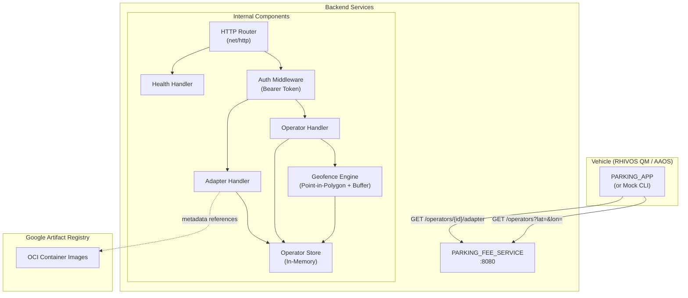
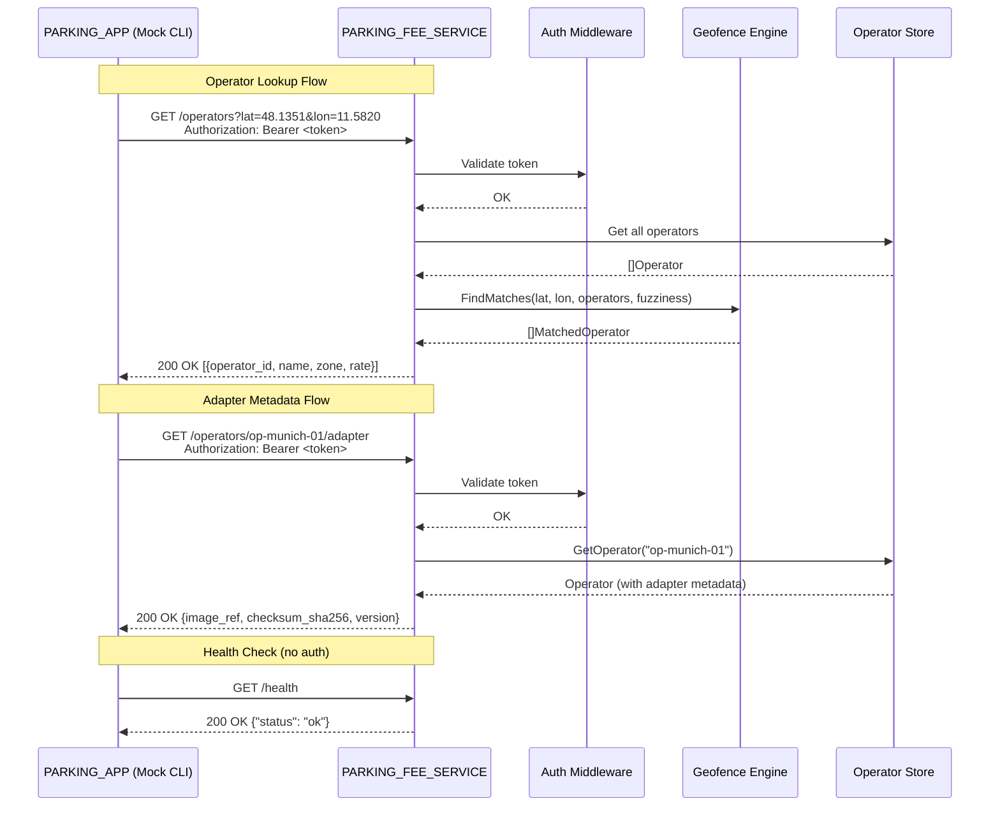

# Design Document: Parking Fee Service (Phase 2.4)

## Overview

This design specifies the architecture, data model, REST API, geofence
matching algorithm, and integration points for the PARKING_FEE_SERVICE.
The service is a stateless Go HTTP server that loads operator data on startup
(from embedded defaults or a JSON config file), responds to location-based
operator queries using point-in-polygon geofence matching with fuzziness, and
serves adapter metadata for secure adapter provisioning.

The design also covers enhancements to the mock PARKING_APP CLI to integrate
with the PARKING_FEE_SERVICE for operator discovery and adapter metadata
retrieval.

## Architecture



### Request Flow



### Module Structure

```
backend/parking-fee-service/
├── main.go                    # Entry point, server setup, config loading
├── main_test.go               # Placeholder / integration test
├── internal/
│   ├── config/
│   │   ├── config.go          # Configuration loading (env vars, JSON)
│   │   └── config_test.go
│   ├── handler/
│   │   ├── health.go          # GET /health handler
│   │   ├── operators.go       # GET /operators handler
│   │   ├── adapter.go         # GET /operators/{id}/adapter handler
│   │   ├── middleware.go      # Auth middleware
│   │   └── handler_test.go    # Handler unit tests
│   ├── geo/
│   │   ├── polygon.go         # Point-in-polygon + fuzziness algorithm
│   │   └── polygon_test.go    # Geofence matching unit tests
│   ├── model/
│   │   ├── operator.go        # Operator, Zone, Adapter data types
│   │   └── operator_test.go
│   └── store/
│       ├── store.go           # In-memory operator store
│       ├── default_data.go    # Embedded default operator dataset
│       └── store_test.go
└── testdata/
    ├── operators.json         # Sample external config file for tests
    └── invalid.json           # Malformed config file for edge case tests
```

## Components and Interfaces

### REST API Specification

#### GET /health

Health check endpoint. Does not require authentication.

**Request:**
```
GET /health HTTP/1.1
Host: localhost:8080
```

**Response (200 OK):**
```json
{
  "status": "ok"
}
```

---

#### GET /operators?lat={lat}&lon={lon}

Lookup parking operators by vehicle GPS coordinates.

**Request:**
```
GET /operators?lat=48.1351&lon=11.5820 HTTP/1.1
Host: localhost:8080
Authorization: Bearer demo-token-1
```

**Response (200 OK):**
```json
{
  "operators": [
    {
      "operator_id": "op-munich-01",
      "name": "Munich City Parking",
      "zone": {
        "zone_id": "zone-munich-center",
        "name": "Munich City Center",
        "polygon": [
          {"lat": 48.1400, "lon": 11.5600},
          {"lat": 48.1400, "lon": 11.6000},
          {"lat": 48.1280, "lon": 11.6000},
          {"lat": 48.1280, "lon": 11.5600}
        ]
      },
      "rate": {
        "amount_per_hour": 2.50,
        "currency": "EUR"
      }
    }
  ]
}
```

**Response (400 Bad Request) — missing parameter:**
```json
{
  "error": "missing required query parameter: lat"
}
```

**Response (400 Bad Request) — invalid coordinate:**
```json
{
  "error": "invalid value for lat: must be a number between -90 and 90"
}
```

**Response (401 Unauthorized) — missing token:**
```json
{
  "error": "missing authorization header"
}
```

---

#### GET /operators/{id}/adapter

Retrieve adapter metadata for a specific parking operator.

**Request:**
```
GET /operators/op-munich-01/adapter HTTP/1.1
Host: localhost:8080
Authorization: Bearer demo-token-1
```

**Response (200 OK):**
```json
{
  "operator_id": "op-munich-01",
  "image_ref": "us-docker.pkg.dev/rhadp-demo/adapters/munich-parking:v1.0.0",
  "checksum_sha256": "sha256:a1b2c3d4e5f6a1b2c3d4e5f6a1b2c3d4e5f6a1b2c3d4e5f6a1b2c3d4e5f6a1b2",
  "version": "1.0.0"
}
```

**Response (404 Not Found):**
```json
{
  "error": "operator not found: op-unknown"
}
```

### Data Model

#### Operator

```go
type Operator struct {
    ID      string  `json:"operator_id"`
    Name    string  `json:"name"`
    Zone    Zone    `json:"zone"`
    Rate    Rate    `json:"rate"`
    Adapter Adapter `json:"adapter"`
}
```

#### Zone

```go
type Zone struct {
    ID      string  `json:"zone_id"`
    Name    string  `json:"name"`
    Polygon []Point `json:"polygon"`
}
```

#### Point

```go
type Point struct {
    Lat float64 `json:"lat"`
    Lon float64 `json:"lon"`
}
```

#### Rate

```go
type Rate struct {
    AmountPerHour float64 `json:"amount_per_hour"`
    Currency      string  `json:"currency"`
}
```

#### Adapter

```go
type Adapter struct {
    ImageRef      string `json:"image_ref"`
    ChecksumSHA256 string `json:"checksum_sha256"`
    Version       string `json:"version"`
}
```

#### OperatorsConfig (top-level JSON config structure)

```go
type OperatorsConfig struct {
    Operators []Operator `json:"operators"`
}
```

### Sample Zone Data (Realistic Coordinates)

The embedded default dataset includes two demo operators with realistic
geofence polygons in Munich, Germany:

#### Operator 1: Munich City Parking

- **Operator ID:** `op-munich-01`
- **Name:** Munich City Parking
- **Zone:** Munich City Center (Altstadt-Lehel area)
- **Polygon vertices:**
  - (48.1400, 11.5600) — northwest corner
  - (48.1400, 11.5900) — northeast corner
  - (48.1300, 11.5900) — southeast corner
  - (48.1300, 11.5600) — southwest corner
- **Rate:** 2.50 EUR/hour
- **Adapter image:** `us-docker.pkg.dev/rhadp-demo/adapters/munich-parking:v1.0.0`
- **Adapter checksum:** `sha256:a1b2c3d4e5f6a1b2c3d4e5f6a1b2c3d4e5f6a1b2c3d4e5f6a1b2c3d4e5f6a1b2`
- **Adapter version:** `1.0.0`

#### Operator 2: Airport Parking Munich

- **Operator ID:** `op-munich-02`
- **Name:** Airport Parking Munich
- **Zone:** Munich Airport (Flughafen area)
- **Polygon vertices:**
  - (48.3570, 11.7700) — northwest corner
  - (48.3570, 11.8100) — northeast corner
  - (48.3480, 11.8100) — southeast corner
  - (48.3480, 11.7700) — southwest corner
- **Rate:** 4.00 EUR/hour
- **Adapter image:** `us-docker.pkg.dev/rhadp-demo/adapters/airport-parking:v1.0.0`
- **Adapter checksum:** `sha256:b2c3d4e5f6a1b2c3d4e5f6a1b2c3d4e5f6a1b2c3d4e5f6a1b2c3d4e5f6a1b2c3`
- **Adapter version:** `1.0.0`

### Geofence Matching Algorithm

#### Point-in-Polygon (Ray Casting)

The ray-casting algorithm determines whether a point P is inside a polygon by
casting a horizontal ray from P to positive infinity and counting how many
times the ray intersects polygon edges. An odd count means the point is inside;
an even count means outside.

```
function PointInPolygon(point P, polygon vertices V[0..n-1]) -> bool:
    crossings = 0
    for i = 0 to n-1:
        j = (i + 1) mod n
        // Check if the edge from V[i] to V[j] crosses the horizontal ray
        if (V[i].Lat > P.Lat) != (V[j].Lat > P.Lat):
            // Compute the x-coordinate of the intersection
            intersectLon = V[i].Lon + (P.Lat - V[i].Lat) / (V[j].Lat - V[i].Lat) * (V[j].Lon - V[i].Lon)
            if P.Lon < intersectLon:
                crossings += 1
    return crossings mod 2 == 1
```

#### Fuzziness Buffer (Near-Zone Matching)

For near-zone matching, the service computes the minimum distance from the
query point to each edge of the polygon. If this distance is less than or
equal to the fuzziness buffer, the point is considered a match.

The distance from a point to a line segment uses the Haversine formula for
short distances, approximated as:

```
function DistanceToSegment(point P, segment A-B) -> meters:
    // Project P onto the line through A and B
    // Clamp to segment endpoints
    // Return great-circle distance from P to nearest point on segment
    // Approximation: at these scales, use equirectangular projection
    //   dx = (B.Lon - A.Lon) * cos(midLat)
    //   dy = (B.Lat - A.Lat)
    //   distance = sqrt(dx^2 + dy^2) * 111_320  (meters per degree at equator)
```

The complete matching function:

```
function FindMatches(lat, lon, operators, fuzzinessMeters) -> []Operator:
    point = {lat, lon}
    matches = []
    for each operator in operators:
        if len(operator.Zone.Polygon) < 3:
            continue  // skip degenerate zones
        if PointInPolygon(point, operator.Zone.Polygon):
            matches.append(operator)
        else if fuzzinessMeters > 0:
            minDist = MinDistanceToPolygon(point, operator.Zone.Polygon)
            if minDist <= fuzzinessMeters:
                matches.append(operator)
    return matches
```

### Authentication Middleware

The auth middleware intercepts requests to protected endpoints (`/operators`
and `/operators/{id}/adapter`) and validates the `Authorization` header.

```
function AuthMiddleware(next Handler, validTokens []string) -> Handler:
    return func(w, r):
        authHeader = r.Header.Get("Authorization")
        if authHeader == "":
            respond(w, 401, {"error": "missing authorization header"})
            return
        if not authHeader.startsWith("Bearer "):
            respond(w, 401, {"error": "invalid authorization scheme"})
            return
        token = authHeader[len("Bearer "):]
        if token not in validTokens:
            respond(w, 401, {"error": "invalid token"})
            return
        next.ServeHTTP(w, r)
```

### Configuration

| Variable | Default | Description |
|----------|---------|-------------|
| `PORT` | `8080` | HTTP listen port |
| `OPERATORS_CONFIG` | (embedded) | Path to JSON config file for operator data |
| `FUZZINESS_METERS` | `100` | Near-zone fuzziness buffer in meters |
| `AUTH_TOKENS` | `demo-token-1` | Comma-separated list of valid bearer tokens |

### Mock PARKING_APP CLI Enhancements

The mock PARKING_APP CLI (`mock/parking-app-cli/`) is enhanced with two
functional commands:

#### `lookup` command

```
parking-app-cli lookup --lat=48.1351 --lon=11.5820

Flags:
  --lat float    Latitude of the vehicle
  --lon float    Longitude of the vehicle
```

Behavior:
1. Send `GET /operators?lat={lat}&lon={lon}` to PARKING_FEE_SERVICE
2. Include `Authorization: Bearer <token>` header (from `--token` flag or
   default)
3. Parse JSON response
4. Print operator list in human-readable format:
   ```
   Found 1 operator(s):
     [1] Munich City Parking (op-munich-01)
         Zone: Munich City Center (zone-munich-center)
         Rate: 2.50 EUR/hour
   ```
5. Exit with code 0 on success, 1 on error

#### `adapter` command (renamed from generic `lookup`)

```
parking-app-cli adapter --operator-id=op-munich-01

Flags:
  --operator-id string    Operator ID to retrieve adapter metadata for
```

Behavior:
1. Send `GET /operators/{id}/adapter` to PARKING_FEE_SERVICE
2. Include `Authorization: Bearer <token>` header
3. Parse JSON response
4. Print adapter metadata:
   ```
   Adapter metadata for operator op-munich-01:
     Image: us-docker.pkg.dev/rhadp-demo/adapters/munich-parking:v1.0.0
     Checksum: sha256:a1b2c3d4...
     Version: 1.0.0
   ```
5. Exit with code 0 on success, 1 on error

Global flags for both commands:
- `--pfs-url string` — PARKING_FEE_SERVICE URL (default `http://localhost:8080`)
- `--token string` — Bearer token (default `demo-token-1`)

## Correctness Properties

### Property 1: Geofence Determinism

*For any* point P and polygon Q, the result of `PointInPolygon(P, Q)` SHALL
be deterministic — identical inputs always produce identical outputs.

**Validates: Requirement 05-REQ-2.1**

### Property 2: Fuzziness Monotonicity

*For any* point P and polygon Q, if P is matched with fuzziness buffer D1,
then P SHALL also be matched with any fuzziness buffer D2 > D1.

**Validates: Requirements 05-REQ-3.1, 05-REQ-3.2**

### Property 3: Interior Points Always Match

*For any* point P that lies strictly inside a polygon Q (not on the boundary),
P SHALL be matched regardless of the fuzziness buffer value (including 0).

**Validates: Requirement 05-REQ-2.1**

### Property 4: Distant Points Never Match

*For any* point P that is more than `fuzzinessMeters` distance from every edge
of polygon Q, P SHALL NOT be matched.

**Validates: Requirements 05-REQ-2.1, 05-REQ-3.2**

### Property 5: Adapter Metadata Consistency

*For any* valid operator ID, the adapter metadata returned by
`GET /operators/{id}/adapter` SHALL contain non-empty `image_ref`,
`checksum_sha256`, and `version` fields.

**Validates: Requirement 05-REQ-4.2**

### Property 6: Authentication Enforcement

*For any* request to `/operators` or `/operators/{id}/adapter` without a valid
bearer token, the service SHALL return HTTP 401 and never return operator data.

**Validates: Requirements 05-REQ-7.1, 05-REQ-7.2**

### Property 7: Health Endpoint Availability

*For any* state of the operator data store (loaded, empty, or partially
configured), the health endpoint SHALL return HTTP 200 with
`{"status": "ok"}`.

**Validates: Requirement 05-REQ-5.1**

## Error Handling

| Error Condition | HTTP Status | Response Body | Requirement |
|----------------|-------------|---------------|-------------|
| Missing `lat` or `lon` parameter | 400 | `{"error": "missing required query parameter: <param>"}` | 05-REQ-1.E2 |
| Invalid `lat` or `lon` value | 400 | `{"error": "invalid value for <param>: must be a number between <range>"}` | 05-REQ-1.E3 |
| Coordinate out of range | 400 | `{"error": "invalid value for <param>: must be a number between <range>"}` | 05-REQ-1.E4 |
| Missing Authorization header | 401 | `{"error": "missing authorization header"}` | 05-REQ-7.E1 |
| Invalid bearer token | 401 | `{"error": "invalid token"}` | 05-REQ-7.E2 |
| Invalid authorization scheme | 401 | `{"error": "invalid authorization scheme"}` | 05-REQ-7.E3 |
| Unknown operator ID | 404 | `{"error": "operator not found: <id>"}` | 05-REQ-4.E1 |
| No operators match location | 200 | `{"operators": []}` | 05-REQ-1.E1 |
| Malformed config file | Startup failure | Process exits with non-zero code and error log | 05-REQ-6.E1 |
| Degenerate polygon (< 3 vertices) | N/A (skipped) | Zone silently excluded from matching | 05-REQ-2.E1 |

## Technology Stack

| Category | Technology | Version | Purpose |
|----------|-----------|---------|---------|
| Language | Go | 1.22+ | Service implementation |
| HTTP | net/http (stdlib) | — | HTTP server and routing |
| JSON | encoding/json (stdlib) | — | JSON serialization |
| Math | math (stdlib) | — | Trigonometric functions for geofence |
| Testing | testing (stdlib) | — | Unit tests |
| Testing | net/http/httptest (stdlib) | — | HTTP handler tests |
| CLI | github.com/spf13/cobra | 1.8+ | Mock CLI command framework |

## Definition of Done

A task group is complete when ALL of the following are true:

1. All subtasks within the group are checked off (`[x]`)
2. All spec tests (`test_spec.md` entries) for the task group pass
3. All property tests for the task group pass
4. All previously passing tests still pass (no regressions)
5. No linter warnings or errors introduced
6. Code is committed on a feature branch and pushed to remote
7. Feature branch is merged back to `develop`
8. `tasks.md` checkboxes are updated to reflect completion

## Testing Strategy

### Unit Tests

Unit tests cover individual components in isolation:

- **Geofence engine tests** (`internal/geo/polygon_test.go`): Point-in-polygon
  with known polygons and points (inside, outside, boundary, near). Fuzziness
  buffer calculations with known distances.
- **Handler tests** (`internal/handler/handler_test.go`): HTTP handler logic
  using `httptest.NewRecorder()`. Test each endpoint with valid and invalid
  inputs. Auth middleware tested separately.
- **Store tests** (`internal/store/store_test.go`): Operator lookup by ID,
  listing all operators. JSON config loading from file and embedded defaults.
- **Config tests** (`internal/config/config_test.go`): Environment variable
  parsing, defaults, JSON file loading.

Unit tests run with `go test ./...` in the `backend/parking-fee-service/`
directory and do not require any running infrastructure.

### Integration Tests

Integration tests verify the full HTTP stack with a real (in-process) server:

- Start the PARKING_FEE_SERVICE in-process using `httptest.NewServer()`
- Mock PARKING_APP CLI integration: build the CLI binary, run it against the
  test server, verify stdout output and exit codes
- Test the full operator discovery flow: lookup by location, then retrieve
  adapter metadata for a matched operator

Integration tests are placed in `tests/integration/parking_fee_service/` and
tagged with `//go:build integration`.

### Property Test Approach

| Property | Test Approach |
|----------|---------------|
| P1: Geofence Determinism | Call PointInPolygon 100 times with same inputs, assert same result |
| P2: Fuzziness Monotonicity | For a near-boundary point, verify match at D1 implies match at D1+50 |
| P3: Interior Points | Generate points known to be inside polygon, verify all match at fuzziness=0 |
| P4: Distant Points | Generate points >1km from polygon, verify none match at fuzziness=100m |
| P5: Adapter Metadata | For each operator, verify adapter fields are non-empty strings |
| P6: Auth Enforcement | For each protected endpoint, send requests without token, verify 401 |
| P7: Health Availability | Call /health with various store states, verify always 200 |
