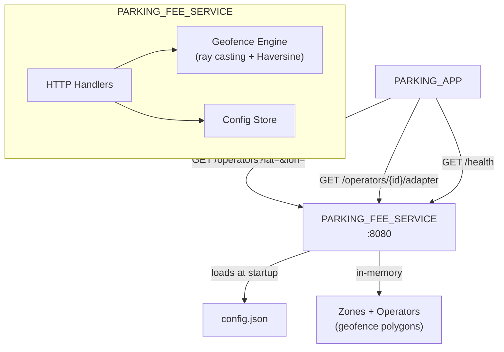
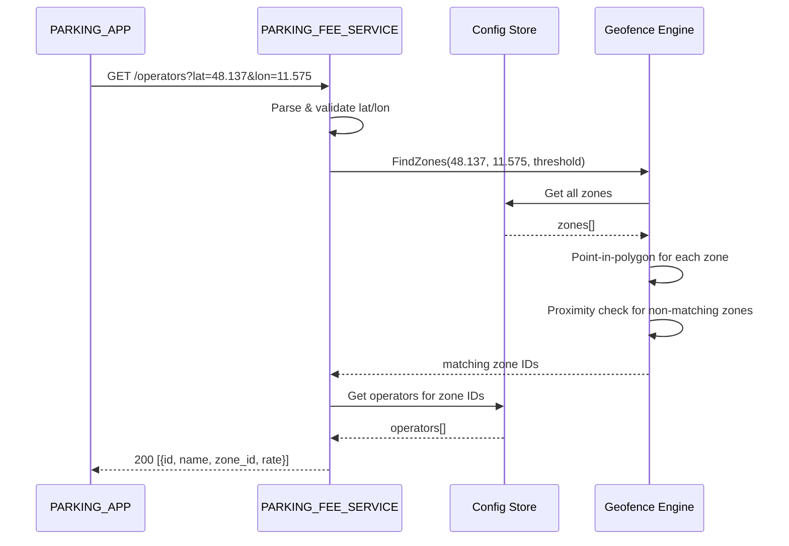

# Design Document: PARKING_FEE_SERVICE

## Overview

The PARKING_FEE_SERVICE is a Go HTTP server (`backend/parking-fee-service`) providing three REST endpoints for parking operator discovery, adapter metadata retrieval, and health checks. It loads operator/zone data from a JSON config file at startup, stores it in memory, and uses point-in-polygon + proximity matching for location queries. Built entirely with Go standard library — no external dependencies.

## Architecture





### Module Responsibilities

1. **main** — Entry point: loads config, sets up HTTP routes, starts server, handles shutdown signals.
2. **config** — Configuration loading and parsing: reads JSON file, provides defaults, validates structure.
3. **handler** — HTTP request handlers: operator lookup, adapter metadata, health check.
4. **geo** — Geofence engine: point-in-polygon (ray casting), Haversine distance, proximity matching.
5. **store** — In-memory data store: zones and operators indexed for fast lookup by zone ID and operator ID.
6. **model** — Core data types: Zone, Operator, Rate, AdapterMeta, Coordinate.

## Components and Interfaces

### REST API

| Method | Path | Request | Response (200) | Errors |
|--------|------|---------|----------------|--------|
| GET | `/operators?lat={lat}&lon={lon}` | Query params | `[{Operator}]` | 400 |
| GET | `/operators/{id}/adapter` | Path param | `{AdapterMeta}` | 404 |
| GET | `/health` | — | `{"status":"ok"}` | — |

### Core Data Types

```go
type Coordinate struct {
    Lat float64 `json:"lat"`
    Lon float64 `json:"lon"`
}

type Zone struct {
    ID       string       `json:"id"`
    Name     string       `json:"name"`
    Polygon  []Coordinate `json:"polygon"`
}

type Rate struct {
    Type     string  `json:"type"`     // "per-hour" | "flat-fee"
    Amount   float64 `json:"amount"`
    Currency string  `json:"currency"` // "EUR"
}

type AdapterMeta struct {
    ImageRef      string `json:"image_ref"`
    ChecksumSHA256 string `json:"checksum_sha256"`
    Version       string `json:"version"`
}

type Operator struct {
    ID      string      `json:"id"`
    Name    string      `json:"name"`
    ZoneID  string      `json:"zone_id"`
    Rate    Rate        `json:"rate"`
    Adapter AdapterMeta `json:"adapter"`
}

type Config struct {
    Port               int        `json:"port"`
    ProximityThreshold float64    `json:"proximity_threshold_meters"`
    Zones              []Zone     `json:"zones"`
    Operators          []Operator `json:"operators"`
}
```

### Module Interfaces

```go
// config package
func LoadConfig(path string) (*Config, error)
func DefaultConfig() *Config

// geo package
func PointInPolygon(point Coordinate, polygon []Coordinate) bool
func HaversineDistance(a, b Coordinate) float64
func DistanceToPolygonEdge(point Coordinate, polygon []Coordinate) float64
func FindMatchingZones(point Coordinate, zones []Zone, threshold float64) []string

// store package
type Store struct { /* indexed zones and operators */ }
func NewStore(zones []Zone, operators []Operator) *Store
func (s *Store) GetZone(id string) (*Zone, bool)
func (s *Store) GetOperator(id string) (*Operator, bool)
func (s *Store) GetOperatorsByZoneIDs(zoneIDs []string) []Operator

// handler package
func NewOperatorHandler(store *Store, geo GeoEngine) http.HandlerFunc
func NewAdapterHandler(store *Store) http.HandlerFunc
func HealthHandler() http.HandlerFunc
```

## Data Models

### Configuration File (config.json)

```json
{
  "port": 8080,
  "proximity_threshold_meters": 500,
  "zones": [
    {
      "id": "munich-central",
      "name": "Munich Central Station Area",
      "polygon": [
        {"lat": 48.1400, "lon": 11.5550},
        {"lat": 48.1400, "lon": 11.5650},
        {"lat": 48.1350, "lon": 11.5650},
        {"lat": 48.1350, "lon": 11.5550}
      ]
    },
    {
      "id": "munich-marienplatz",
      "name": "Marienplatz Area",
      "polygon": [
        {"lat": 48.1380, "lon": 11.5730},
        {"lat": 48.1380, "lon": 11.5790},
        {"lat": 48.1350, "lon": 11.5790},
        {"lat": 48.1350, "lon": 11.5730}
      ]
    }
  ],
  "operators": [
    {
      "id": "parkhaus-munich",
      "name": "Parkhaus München GmbH",
      "zone_id": "munich-central",
      "rate": {"type": "per-hour", "amount": 2.50, "currency": "EUR"},
      "adapter": {
        "image_ref": "us-docker.pkg.dev/sdv-demo/adapters/parkhaus-munich:v1.0.0",
        "checksum_sha256": "sha256:abc123def456",
        "version": "1.0.0"
      }
    },
    {
      "id": "city-park-munich",
      "name": "CityPark München",
      "zone_id": "munich-marienplatz",
      "rate": {"type": "flat-fee", "amount": 5.00, "currency": "EUR"},
      "adapter": {
        "image_ref": "us-docker.pkg.dev/sdv-demo/adapters/citypark-munich:v1.0.0",
        "checksum_sha256": "sha256:789ghi012jkl",
        "version": "1.0.0"
      }
    }
  ]
}
```

### Operator Lookup Response

```json
[
  {
    "id": "parkhaus-munich",
    "name": "Parkhaus München GmbH",
    "zone_id": "munich-central",
    "rate": {"type": "per-hour", "amount": 2.50, "currency": "EUR"}
  }
]
```

Note: The adapter field is intentionally excluded from the lookup response — the client must call `/operators/{id}/adapter` separately.

### Error Response

```json
{"error": "lat and lon query parameters are required"}
```

## Operational Readiness

- **Startup logging:** Logs version, port, zone count, operator count.
- **Shutdown:** Handles SIGTERM/SIGINT, uses `http.Server.Shutdown()` for graceful drain.
- **Health:** `/health` endpoint returns `{"status":"ok"}`.
- **Rollback:** Revert via `git checkout`. No persistent state.

## Correctness Properties

### Property 1: Point-in-Polygon Correctness

*For any* coordinate inside a convex polygon, `PointInPolygon` SHALL return `true`, and for any coordinate outside the polygon by more than the proximity threshold, `FindMatchingZones` SHALL return an empty list.

**Validates: Requirements 05-REQ-1.2, 05-REQ-1.5**

### Property 2: Proximity Matching

*For any* coordinate outside a zone's polygon but within `threshold` meters of the nearest edge, `FindMatchingZones` SHALL include that zone in the results.

**Validates: Requirements 05-REQ-1.3**

### Property 3: Operator-Zone Association

*For any* set of matching zone IDs, `GetOperatorsByZoneIDs` SHALL return all and only operators whose `zone_id` is in the set.

**Validates: Requirements 05-REQ-1.4**

### Property 4: Coordinate Validation

*For any* latitude outside [-90, 90] or longitude outside [-180, 180], the operator lookup handler SHALL return HTTP 400.

**Validates: Requirements 05-REQ-1.E2, 05-REQ-1.E3**

### Property 5: Adapter Metadata Completeness

*For any* valid operator ID, `GetOperator` SHALL return an operator with non-empty `image_ref`, `checksum_sha256`, and `version` fields.

**Validates: Requirements 05-REQ-2.1**

### Property 6: Config Defaults

*For any* missing or nonexistent config file path, `LoadConfig` SHALL return a valid default configuration with at least one zone and one operator.

**Validates: Requirements 05-REQ-4.E1**

## Error Handling

| Error Condition | Behavior | Requirement |
|----------------|----------|-------------|
| Missing lat/lon params | 400 with error message | 05-REQ-1.E1 |
| Invalid coordinates (range) | 400 with error message | 05-REQ-1.E2 |
| Non-numeric lat/lon | 400 with error message | 05-REQ-1.E3 |
| Unknown operator ID | 404 with error message | 05-REQ-2.E1 |
| Config file missing | Start with defaults, log warning | 05-REQ-4.E1 |
| Config file invalid JSON | Exit non-zero, log error | 05-REQ-4.E2 |

## Technology Stack

| Technology | Version | Purpose |
|-----------|---------|---------|
| Go | 1.22+ | Service implementation |
| net/http | stdlib | HTTP server (Go 1.22 ServeMux patterns) |
| encoding/json | stdlib | JSON encoding/decoding |
| math | stdlib | Haversine distance calculations |
| os/signal | stdlib | Graceful shutdown |
| log/slog | stdlib | Structured logging |

## Definition of Done

A task group is complete when ALL of the following are true:

1. All subtasks within the group are checked off (`[x]`)
2. All spec tests (`test_spec.md` entries) for the task group pass
3. All property tests for the task group pass
4. All previously passing tests still pass (no regressions)
5. No linter warnings or errors introduced
6. Code is committed on a feature branch and pushed to remote
7. Feature branch is merged back to `main`
8. `tasks.md` checkboxes are updated to reflect completion

## Testing Strategy

- **Unit tests:** Go `_test.go` files alongside source. The `geo`, `config`, `store`, and `handler` packages each have unit tests.
- **Property tests:** Go `testing/quick` or table-driven tests with boundary coordinates for geofence logic.
- **Integration tests:** `httptest` server for end-to-end HTTP request/response testing. No external dependencies needed — the service is self-contained.
- **All tests run via:** `cd backend && go test -v ./parking-fee-service/...`
