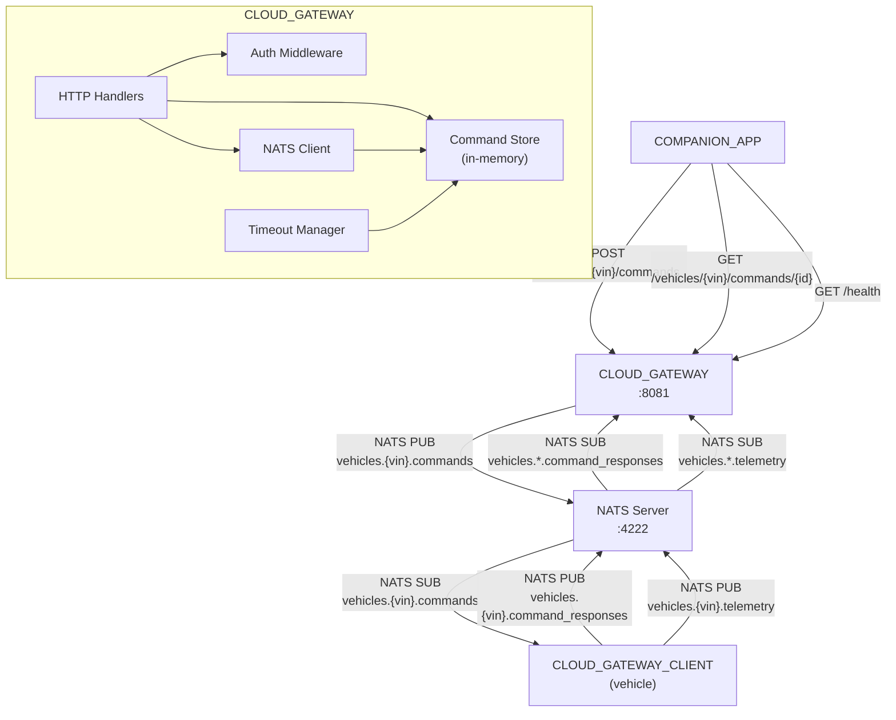
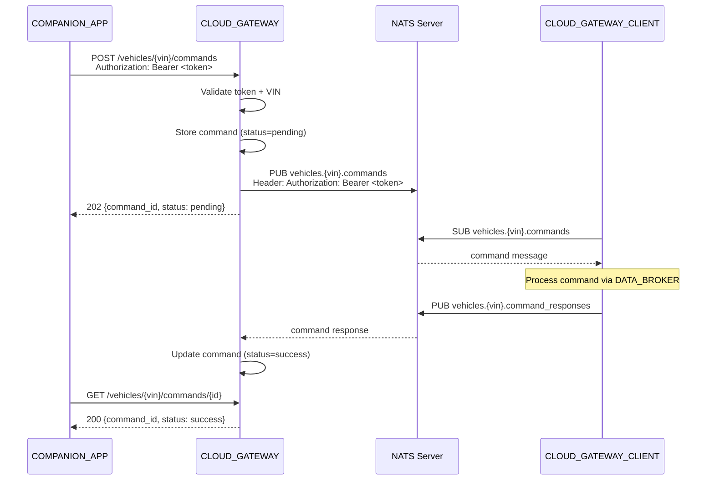

# Design Document: CLOUD_GATEWAY

## Overview

The CLOUD_GATEWAY is a Go HTTP server (`backend/cloud-gateway`) that bridges COMPANION_APPs (REST) and vehicles (NATS). It receives lock/unlock commands via REST, publishes them to NATS for the target vehicle's CLOUD_GATEWAY_CLIENT, receives command responses and telemetry back via NATS subscriptions, and serves command status queries via REST. Authentication uses bearer tokens mapped to VINs via a JSON config file. Built with Go standard library `net/http` and `github.com/nats-io/nats.go`.

## Architecture





### Module Responsibilities

1. **main** — Entry point: loads config, connects NATS, sets up HTTP routes, starts server, handles shutdown signals.
2. **config** — Configuration loading and parsing: reads JSON file, provides defaults, validates structure.
3. **auth** — Authentication: validates bearer tokens, enforces token-VIN authorization.
4. **handler** — HTTP request handlers: command submission, command status query, health check.
5. **store** — In-memory command store: stores command status, updates on response, handles timeout expiry.
6. **nats_client** — NATS client wrapper: connect with retry, publish commands, subscribe to responses and telemetry.
7. **model** — Core data types: Command, CommandStatus, CommandResponse, Config.

## Components and Interfaces

### REST API

| Method | Path | Request | Response (Success) | Errors |
|--------|------|---------|-------------------|--------|
| POST | `/vehicles/{vin}/commands` | Bearer token + JSON body | 202 `{command_id, status}` | 400, 401, 403 |
| GET | `/vehicles/{vin}/commands/{command_id}` | Bearer token | 200 `{command_id, status, reason?}` | 401, 403, 404 |
| GET | `/health` | — | 200 `{"status":"ok"}` | — |

### Core Data Types

```go
type Command struct {
    CommandID string `json:"command_id"`
    Type      string `json:"type"`      // "lock" | "unlock"
    Doors     []string `json:"doors"`
}

type CommandStatus struct {
    CommandID string  `json:"command_id"`
    Status    string  `json:"status"`    // "pending" | "success" | "failed" | "timeout"
    Reason    string  `json:"reason,omitempty"`
    VIN       string  `json:"-"`
    CreatedAt time.Time `json:"-"`
}

type CommandResponse struct {
    CommandID string `json:"command_id"`
    Status    string `json:"status"`    // "success" | "failed"
    Reason    string `json:"reason,omitempty"`
}

type TokenMapping struct {
    Token string `json:"token"`
    VIN   string `json:"vin"`
}

type Config struct {
    Port           int            `json:"port"`
    NatsURL        string         `json:"nats_url"`
    CommandTimeout int            `json:"command_timeout_seconds"`
    Tokens         []TokenMapping `json:"tokens"`
}
```

### Module Interfaces

```go
// config package
func LoadConfig(path string) (*Config, error)
func DefaultConfig() *Config

// auth package
func ValidateToken(header string) (token string, err error)
func (a *Authenticator) AuthorizeVIN(token, vin string) bool
func NewAuthenticator(tokens []TokenMapping) *Authenticator

// store package
type Store struct { /* mutex-protected map */ }
func NewStore() *Store
func (s *Store) Add(cmd CommandStatus)
func (s *Store) Get(commandID string) (*CommandStatus, bool)
func (s *Store) UpdateFromResponse(resp CommandResponse)
func (s *Store) ExpireTimedOut(timeout time.Duration)

// nats_client package
func Connect(url string, maxRetries int) (*nats.Conn, error)
func PublishCommand(nc *nats.Conn, vin string, cmd Command, bearerToken string) error
func SubscribeResponses(nc *nats.Conn, store *Store) (*nats.Subscription, error)
func SubscribeTelemetry(nc *nats.Conn) (*nats.Subscription, error)

// handler package
func NewCommandHandler(store *Store, nc *nats.Conn, auth *Authenticator) http.HandlerFunc
func NewStatusHandler(store *Store, auth *Authenticator) http.HandlerFunc
func HealthHandler() http.HandlerFunc
```

## Data Models

### Configuration File (config.json)

```json
{
  "port": 8081,
  "nats_url": "nats://localhost:4222",
  "command_timeout_seconds": 30,
  "tokens": [
    {
      "token": "demo-token-car1",
      "vin": "VIN12345"
    },
    {
      "token": "demo-token-car2",
      "vin": "VIN67890"
    }
  ]
}
```

### Command Submission Response

```json
{
  "command_id": "550e8400-e29b-41d4-a716-446655440000",
  "status": "pending"
}
```

### Command Status Response

```json
{
  "command_id": "550e8400-e29b-41d4-a716-446655440000",
  "status": "success"
}
```

Or with failure reason:

```json
{
  "command_id": "550e8400-e29b-41d4-a716-446655440000",
  "status": "failed",
  "reason": "vehicle_moving"
}
```

### Error Response

```json
{"error": "unauthorized"}
```

## Operational Readiness

- **Startup logging:** Logs version, port, NATS URL, token count.
- **Shutdown:** Handles SIGTERM/SIGINT, drains NATS connection, uses `http.Server.Shutdown()` for graceful drain.
- **Health:** `/health` endpoint returns `{"status":"ok"}`.
- **Rollback:** Revert via `git checkout`. No persistent state.

## Correctness Properties

### Property 1: Command Routing Fidelity

*For any* valid command submission with token `T` authorized for VIN `V`, the CLOUD_GATEWAY SHALL publish the command to NATS subject `vehicles.V.commands` with the bearer token included as a NATS header, and store the command with status `"pending"`.

**Validates: Requirements 06-REQ-1.1, 06-REQ-1.3, 06-REQ-1.4**

### Property 2: Authentication Enforcement

*For any* REST request to a protected endpoint, the CLOUD_GATEWAY SHALL return HTTP 401 if the bearer token is missing or malformed, and HTTP 403 if the token is valid but not authorized for the VIN in the URL path.

**Validates: Requirements 06-REQ-1.E1, 06-REQ-1.E2, 06-REQ-6.1, 06-REQ-6.3**

### Property 3: Response Status Update

*For any* command response received via NATS with a known `command_id`, the CLOUD_GATEWAY SHALL update the stored command status to match the received status, and subsequent status queries SHALL return the updated status.

**Validates: Requirements 06-REQ-3.2, 06-REQ-2.1, 06-REQ-2.3**

### Property 4: Command Timeout

*For any* command that remains in `"pending"` status longer than the configured timeout, the CLOUD_GATEWAY SHALL update the status to `"timeout"`.

**Validates: Requirements 06-REQ-4.1, 06-REQ-4.2**

### Property 5: Payload Validation

*For any* POST body that is not valid JSON, or that is missing `command_id`, `type`, or `doors`, or has `type` not in `["lock", "unlock"]`, the CLOUD_GATEWAY SHALL return HTTP 400.

**Validates: Requirements 06-REQ-1.E3, 06-REQ-1.E4**

### Property 6: Config Defaults

*For any* missing or nonexistent config file path, the CLOUD_GATEWAY SHALL start with default configuration (port 8081, NATS URL `nats://localhost:4222`, timeout 30s) and log a warning.

**Validates: Requirements 06-REQ-7.1, 06-REQ-7.3, 06-REQ-7.E1**

### Property 7: NATS Subject Correctness

*For any* VIN `V`, commands SHALL be published to exactly `vehicles.V.commands`, and the service SHALL subscribe to `vehicles.*.command_responses` and `vehicles.*.telemetry`.

**Validates: Requirements 06-REQ-1.1, 06-REQ-3.1, 06-REQ-5.1**

## Error Handling

| Error Condition | Behavior | Requirement |
|----------------|----------|-------------|
| Missing/invalid Authorization header | 401 Unauthorized | 06-REQ-1.E1 |
| Token not authorized for VIN | 403 Forbidden | 06-REQ-1.E2 |
| Invalid command payload | 400 Bad Request | 06-REQ-1.E3, 06-REQ-1.E4 |
| Unknown command ID | 404 Not Found | 06-REQ-2.E1 |
| Invalid NATS response JSON | Log and discard | 06-REQ-3.E1 |
| Unknown command_id in NATS response | Log warning and discard | 06-REQ-3.E2 |
| Invalid telemetry JSON | Log warning and discard | 06-REQ-5.E1 |
| Config file missing | Start with defaults | 06-REQ-7.E1 |
| Config file invalid JSON | Exit non-zero | 06-REQ-7.E2 |
| NATS unreachable at startup | Retry 5x, then exit non-zero | 06-REQ-8.E1 |

## Technology Stack

| Technology | Version | Purpose |
|-----------|---------|---------|
| Go | 1.22+ | Service implementation |
| net/http | stdlib | HTTP server (Go 1.22 ServeMux patterns) |
| encoding/json | stdlib | JSON encoding/decoding |
| sync | stdlib | Mutex for concurrent map access |
| os/signal | stdlib | Graceful shutdown |
| log/slog | stdlib | Structured logging |
| nats.go | latest | NATS client (github.com/nats-io/nats.go) |
| google/uuid | latest | UUID validation (optional) |

## Definition of Done

A task group is complete when ALL of the following are true:

1. All subtasks within the group are checked off (`[x]`)
2. All spec tests (`test_spec.md` entries) for the task group pass
3. All property tests for the task group pass
4. All previously passing tests still pass (no regressions)
5. No linter warnings or errors introduced
6. Code is committed on a feature branch and pushed to remote
7. Feature branch is merged back to `main`
8. `tasks.md` checkboxes are updated to reflect completion

## Testing Strategy

- **Unit tests:** Go `_test.go` files alongside source. The `auth`, `config`, `store`, `handler`, and `nats_client` packages each have unit tests.
- **Property tests:** Table-driven tests with randomized inputs for auth validation, payload parsing, and timeout behavior.
- **Integration tests:** `httptest` server for HTTP handler testing. NATS integration tests in `tests/cloud-gateway/` Go module requiring a running NATS server.
- **All tests run via:** `cd backend && go test -v ./cloud-gateway/...` (unit) and `cd tests/cloud-gateway && go test -v ./...` (integration).
