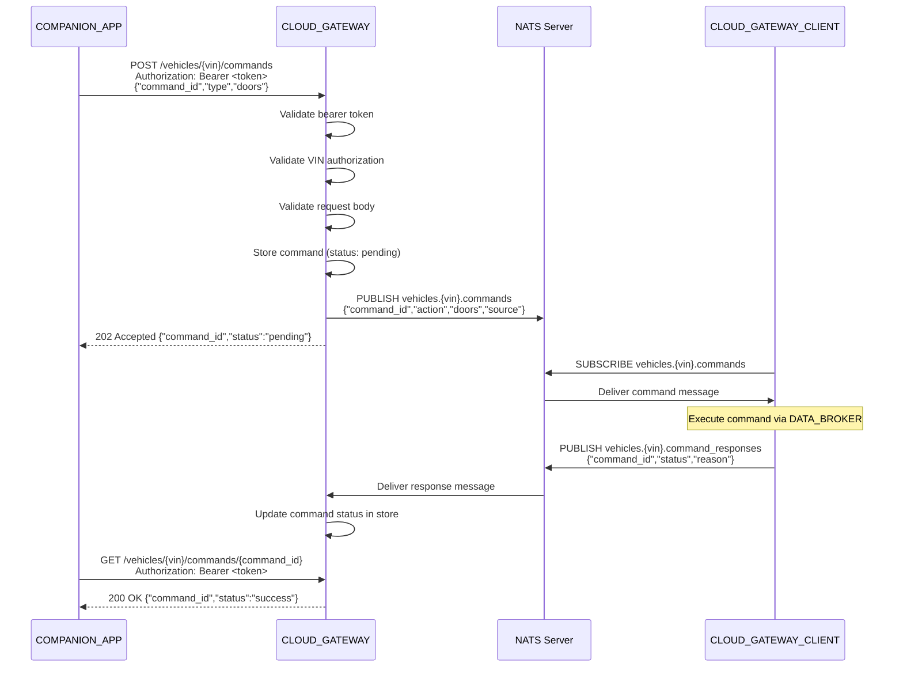

# Design: CLOUD_GATEWAY (Spec 06)

> Design document for the CLOUD_GATEWAY cloud service.
> Implements requirements from `.specs/06_cloud_gateway/requirements.md`.

## Architecture Overview

The CLOUD_GATEWAY is a Go service with two concurrent interfaces: an HTTP server providing a REST API for COMPANION_APPs, and a NATS client connecting to vehicles via CLOUD_GATEWAY_CLIENT. It translates between REST and NATS protocols, routes commands by VIN, and stores command status and telemetry in memory.

```
  COMPANION_APP                                              CLOUD_GATEWAY_CLIENT
  (REST/HTTPS)                                               (NATS)
       |                                                          |
       v                                                          v
+-----------------------------------------------------------------------------+
|                         CLOUD_GATEWAY (Go :8081)                            |
|                                                                             |
|  +---------------------+     +---------------------+                        |
|  | Auth Middleware      |     | NATS Client         |                        |
|  | (Bearer Token)      |     | (nats.go)           |                        |
|  +---------------------+     +---------------------+                        |
|           |                        |          ^                              |
|           v                        |          |                              |
|  +---------------------+          |          |                              |
|  | REST Handlers        |         |          |                              |
|  | POST /vehicles/      |  publish|          | subscribe                    |
|  |   {vin}/commands     |-------->|          |                              |
|  | GET  /vehicles/      |         |   vehicles.{vin}.command_responses      |
|  |   {vin}/commands/    |         |   vehicles.{vin}.telemetry              |
|  |   {command_id}       |         v          |                              |
|  | GET  /health         |   vehicles.{vin}.commands                         |
|  +---------------------+                                                    |
|           |                                                                  |
|           v                                                                  |
|  +---------------------+                                                    |
|  | Command Store       |                                                    |
|  | (in-memory map)     |                                                    |
|  +---------------------+                                                    |
|           |                                                                  |
|  +---------------------+                                                    |
|  | Telemetry Store     |                                                    |
|  | (in-memory map)     |                                                    |
|  +---------------------+                                                    |
|           |                                                                  |
|  +---------------------+                                                    |
|  | Token Store         |                                                    |
|  | (token -> VIN map)  |                                                    |
|  +---------------------+                                                    |
+-----------------------------------------------------------------------------+
```

## Module Structure

```
backend/cloud-gateway/
  go.mod
  go.sum
  main.go                  # Server entry point, wiring
  handler.go               # REST handler functions
  handler_test.go          # Handler tests (httptest)
  auth.go                  # Bearer token authentication middleware
  auth_test.go             # Auth middleware tests
  nats_client.go           # NATS connection, publish, subscribe
  nats_client_test.go      # NATS client tests
  store.go                 # In-memory command and telemetry stores
  store_test.go            # Store unit tests
  model.go                 # Data model types
  config.go                # Configuration (tokens, VINs, NATS URL)
```

## API Endpoint Specifications

### POST /vehicles/{vin}/commands

Submits a lock/unlock command to a specific vehicle.

**Request:**

| Header | Value | Required |
|--------|-------|----------|
| Authorization | `Bearer <token>` | yes |
| Content-Type | `application/json` | yes |

**Request Body:**

```json
{
  "command_id": "550e8400-e29b-41d4-a716-446655440000",
  "type": "lock",
  "doors": ["driver"]
}
```

| Field | Type | Required | Constraints |
|-------|------|----------|-------------|
| command_id | string | yes | UUID format |
| type | string | yes | "lock" or "unlock" |
| doors | []string | yes | non-empty array |

**Response (202 Accepted):**

```json
{
  "command_id": "550e8400-e29b-41d4-a716-446655440000",
  "status": "pending"
}
```

**NATS Message Published to `vehicles.{vin}.commands`:**

```json
{
  "command_id": "550e8400-e29b-41d4-a716-446655440000",
  "action": "lock",
  "doors": ["driver"],
  "source": "companion_app"
}
```

**Error Responses:**

| Status | Condition | Requirement |
|--------|-----------|-------------|
| 400 | Missing/invalid fields in body | 06-REQ-1.E1, 06-REQ-1.E2 |
| 401 | Missing or invalid token | 06-REQ-2.E1, 06-REQ-2.E2 |
| 403 | Token not authorized for VIN | 06-REQ-2.E3 |
| 404 | Unknown VIN | 06-REQ-7.E1 |
| 503 | NATS unavailable | 06-REQ-3.E1 |

### GET /vehicles/{vin}/commands/{command_id}

Queries the status of a previously submitted command.

**Request:**

| Header | Value | Required |
|--------|-------|----------|
| Authorization | `Bearer <token>` | yes |

**Response (200 OK):**

```json
{
  "command_id": "550e8400-e29b-41d4-a716-446655440000",
  "status": "success"
}
```

Or with failure reason:

```json
{
  "command_id": "550e8400-e29b-41d4-a716-446655440000",
  "status": "failed",
  "reason": "door ajar"
}
```

**Error Responses:**

| Status | Condition | Requirement |
|--------|-----------|-------------|
| 401 | Missing or invalid token | 06-REQ-2.E1, 06-REQ-2.E2 |
| 403 | Token not authorized for VIN | 06-REQ-2.E3 |
| 404 | Unknown command_id | 06-REQ-4.E1 |
| 404 | Unknown VIN | 06-REQ-7.E1 |

### GET /health

Returns service health status. No authentication required.

**Response (200 OK):**

```json
{
  "status": "ok"
}
```

## NATS Subject Hierarchy

| Subject | Direction | Purpose |
|---------|-----------|---------|
| `vehicles.{vin}.commands` | CLOUD_GATEWAY -> CLOUD_GATEWAY_CLIENT | Lock/unlock commands |
| `vehicles.{vin}.command_responses` | CLOUD_GATEWAY_CLIENT -> CLOUD_GATEWAY | Command execution results |
| `vehicles.{vin}.telemetry` | CLOUD_GATEWAY_CLIENT -> CLOUD_GATEWAY | Vehicle state telemetry |

### NATS Message Formats

**Command (published by CLOUD_GATEWAY):**

```json
{
  "command_id": "<uuid>",
  "action": "lock" | "unlock",
  "doors": ["driver"],
  "source": "companion_app"
}
```

**Command Response (received by CLOUD_GATEWAY):**

```json
{
  "command_id": "<uuid>",
  "status": "success" | "failed",
  "reason": "<optional>"
}
```

**Telemetry (received by CLOUD_GATEWAY):**

```json
{
  "vin": "<vin>",
  "door_locked": true,
  "latitude": 48.1351,
  "longitude": 11.5820,
  "parking_active": false,
  "timestamp": 1709654400
}
```

## Bearer Token Validation Model

Tokens are stored in a static in-memory map for the demo:

```go
// TokenStore maps bearer tokens to VINs
type TokenStore struct {
    tokens map[string]string // token -> VIN
}
```

### Demo Token Configuration

```go
var demoTokens = map[string]string{
    "companion-token-vehicle-1": "VIN12345",
    "companion-token-vehicle-2": "VIN67890",
}
```

### Validation Flow

1. Extract `Authorization` header value
2. Verify it starts with `"Bearer "`
3. Extract token string after prefix
4. Look up token in the token store
5. If not found, return 401
6. Compare associated VIN with the VIN in the URL path
7. If VINs do not match, return 403
8. Allow request to proceed

## Command Flow Sequence Diagram



## Correctness Properties

### Property 1: Token-VIN Binding

*For any* bearer token and request path VIN, THE CLOUD_GATEWAY SHALL allow the request only if the token maps to the exact VIN in the path. A token valid for VIN-A SHALL NOT grant access to VIN-B.

**Validates: 06-REQ-2.1, 06-REQ-2.2**

### Property 2: Command-to-NATS Subject Mapping

*For any* command submitted for VIN `V`, THE CLOUD_GATEWAY SHALL publish the command exclusively to NATS subject `vehicles.V.commands`. No command SHALL be published to a subject containing a different VIN.

**Validates: 06-REQ-1.1, 06-REQ-3.1, 06-REQ-7.1**

### Property 3: Response-to-Command Correlation

*For any* command response received on NATS subject `vehicles.{vin}.command_responses` with a `command_id`, THE CLOUD_GATEWAY SHALL update the stored status for exactly that `command_id`. No other command's status SHALL be affected.

**Validates: 06-REQ-4.1**

### Property 4: Command Status Lifecycle

*For any* command, the status SHALL transition only in the sequence: `pending` -> `success` or `pending` -> `failed`. A command SHALL never transition from `success` to `failed` or vice versa, and SHALL never revert to `pending`.

**Validates: 06-REQ-1.1, 06-REQ-4.1, 06-REQ-4.2**

### Property 5: REST-to-NATS Field Mapping

*For any* command submission with `type` field value `T`, THE CLOUD_GATEWAY SHALL publish a NATS message with `action` field set to `T`. The `command_id` and `doors` fields SHALL be passed through unchanged. The `source` field SHALL always be `"companion_app"`.

**Validates: 06-REQ-1.2**

### Property 6: Response Format Consistency

*For any* REST API response (success or error), THE CLOUD_GATEWAY SHALL set the `Content-Type` header to `application/json` and the response body SHALL be valid JSON.

**Validates: 06-REQ-8.1, 06-REQ-8.2**

### Property 7: Health Endpoint Independence

*For any* `GET /health` request, regardless of the presence or value of an `Authorization` header, THE CLOUD_GATEWAY SHALL return HTTP 200 with `{"status": "ok"}`.

**Validates: 06-REQ-6.1, 06-REQ-6.E1**

## Error Handling

| Error Condition | Behavior | Requirement |
|----------------|----------|-------------|
| Missing Authorization header | HTTP 401 with JSON error | 06-REQ-2.E1 |
| Invalid bearer token | HTTP 401 with JSON error | 06-REQ-2.E2 |
| Token not authorized for VIN | HTTP 403 with JSON error | 06-REQ-2.E3 |
| Missing required body fields | HTTP 400 with JSON error | 06-REQ-1.E1 |
| Invalid command type | HTTP 400 with JSON error | 06-REQ-1.E2 |
| Unknown VIN | HTTP 404 with JSON error | 06-REQ-7.E1 |
| Unknown command_id | HTTP 404 with JSON error | 06-REQ-4.E1 |
| NATS connection unavailable | HTTP 503 with JSON error | 06-REQ-3.E1 |
| Unparseable telemetry JSON | Log error and discard | 06-REQ-5.E1 |
| Undefined route | HTTP 404 with JSON error | 06-REQ-8.E1 |
| Internal panic | HTTP 500, recover | 06-REQ-8.E2 |

## Data Models

### CommandRequest

```go
type CommandRequest struct {
    CommandID string   `json:"command_id"`
    Type      string   `json:"type"`
    Doors     []string `json:"doors"`
}
```

### CommandStatus

```go
type CommandStatus struct {
    CommandID string `json:"command_id"`
    Status    string `json:"status"`           // "pending", "success", "failed"
    Reason    string `json:"reason,omitempty"`
}
```

### NATSCommand

```go
type NATSCommand struct {
    CommandID string   `json:"command_id"`
    Action    string   `json:"action"`
    Doors     []string `json:"doors"`
    Source    string   `json:"source"`
}
```

### NATSCommandResponse

```go
type NATSCommandResponse struct {
    CommandID string `json:"command_id"`
    Status    string `json:"status"`
    Reason    string `json:"reason,omitempty"`
}
```

### TelemetryData

```go
type TelemetryData struct {
    VIN           string  `json:"vin"`
    DoorLocked    bool    `json:"door_locked"`
    Latitude      float64 `json:"latitude"`
    Longitude     float64 `json:"longitude"`
    ParkingActive bool    `json:"parking_active"`
    Timestamp     int64   `json:"timestamp"`
}
```

### ErrorResponse

```go
type ErrorResponse struct {
    Error string `json:"error"`
}
```

## Technology Stack

| Component | Choice |
|-----------|--------|
| Language | Go 1.22+ |
| HTTP framework | `net/http` standard library (Go 1.22 ServeMux with method and path pattern matching) |
| NATS client | `github.com/nats-io/nats.go` |
| JSON | `encoding/json` standard library |
| Testing | `testing` standard library, `net/http/httptest` |
| NATS testing | Embedded NATS server via `github.com/nats-io/nats-server/v2/server` for unit/integration tests |
| HTTP port | 8081 |
| NATS URL | `nats://localhost:4222` (configurable via environment variable `NATS_URL`) |

## Definition of Done

A task group is complete when ALL of the following are true:

1. All subtasks within the group are checked off (`[x]`)
2. All spec tests (`test_spec.md` entries) for the task group pass
3. All property tests for the task group pass
4. All previously passing tests still pass (no regressions)
5. No linter warnings or errors introduced
6. Code is committed on a feature branch and pushed to remote
7. Feature branch is merged back to `develop`
8. `tasks.md` checkboxes are updated to reflect completion

## Testing Strategy

### Unit Tests

- **Auth middleware:** Test token extraction, validation, and VIN matching with valid, invalid, and missing tokens.
- **Store:** Test command storage, retrieval, status updates, and telemetry storage.
- **Model:** Test JSON serialization/deserialization of all data types.

### Integration Tests (via httptest + embedded NATS)

- **Handler tests:** Use `httptest.NewServer` or `httptest.NewRecorder` to exercise full HTTP request/response cycle with authentication.
- **NATS relay tests:** Use an embedded NATS server to verify command publishing and response subscription without external infrastructure.
- **End-to-end flow:** Submit command via REST, verify NATS publication, simulate response via NATS, verify status query returns the response.

### Property Tests

- **Token-VIN binding:** For any token in the store, only the associated VIN is accessible.
- **Command-subject mapping:** For any VIN, commands are published to the correct NATS subject.
- **Response correlation:** For any command_id, only the matching command status is updated.
- **Status lifecycle:** Command status transitions follow the defined state machine.
