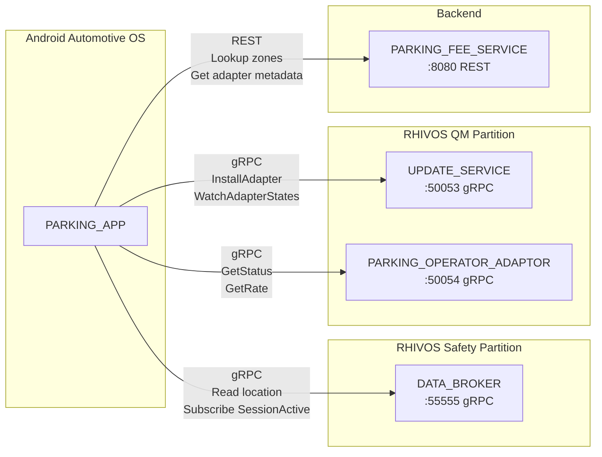
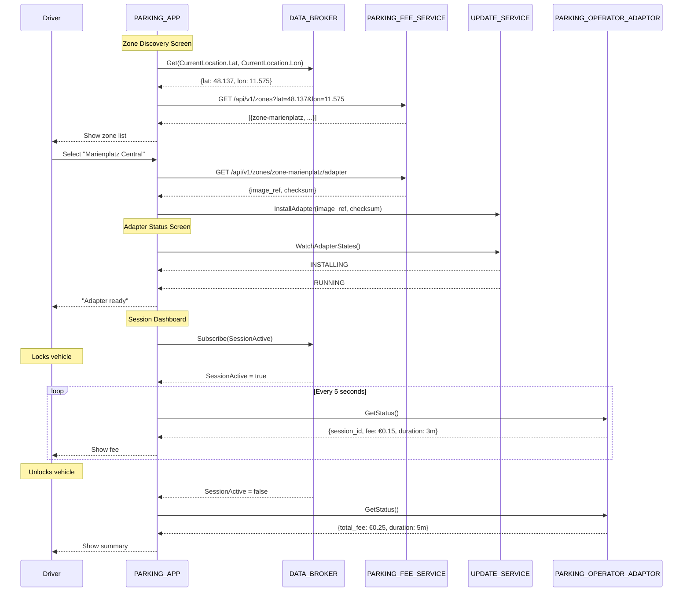

# Design Document: PARKING_APP

## Overview

The PARKING_APP is an Android Automotive OS application written in Kotlin
using Jetpack Compose. It provides a minimal functional UI for parking zone
discovery, adapter installation monitoring, and parking session tracking.
The app communicates with four backend services: DATA_BROKER (Kuksa gRPC)
for vehicle signals, PARKING_FEE_SERVICE (REST) for zone lookup,
UPDATE_SERVICE (gRPC) for adapter management, and PARKING_OPERATOR_ADAPTOR
(gRPC) for session status. It follows MVVM architecture with ViewModels and
StateFlow for reactive state management.

## Architecture

### Runtime Architecture



### User Flow Sequence



### Module Responsibilities

1. **UI Layer** (`ui/`) — Jetpack Compose screens and navigation.
2. **ViewModel Layer** (`ui/*/ViewModel.kt`) — State management, service
   orchestration, error handling.
3. **Data Layer** (`data/`) — Service client wrappers for gRPC and REST.
4. **Model Layer** (`model/`) — Data classes used across the app.

## Components and Interfaces

### Project Structure

```
aaos/parking-app/
├── app/
│   ├── build.gradle.kts
│   └── src/
│       ├── main/
│       │   ├── AndroidManifest.xml
│       │   ├── kotlin/com/rhadp/parking/
│       │   │   ├── ParkingApp.kt           # Application class
│       │   │   ├── MainActivity.kt         # Single activity, Compose host
│       │   │   ├── navigation/
│       │   │   │   └── NavGraph.kt         # Navigation routes
│       │   │   ├── ui/
│       │   │   │   ├── zone/
│       │   │   │   │   ├── ZoneDiscoveryScreen.kt
│       │   │   │   │   └── ZoneDiscoveryViewModel.kt
│       │   │   │   ├── adapter/
│       │   │   │   │   ├── AdapterStatusScreen.kt
│       │   │   │   │   └── AdapterStatusViewModel.kt
│       │   │   │   └── session/
│       │   │   │       ├── SessionDashboardScreen.kt
│       │   │   │       └── SessionDashboardViewModel.kt
│       │   │   ├── data/
│       │   │   │   ├── DataBrokerClient.kt
│       │   │   │   ├── ParkingFeeServiceClient.kt
│       │   │   │   ├── UpdateServiceClient.kt
│       │   │   │   └── ParkingAdapterClient.kt
│       │   │   └── model/
│       │   │       └── Models.kt
│       │   └── res/
│       │       ├── values/
│       │       │   ├── strings.xml
│       │       │   └── themes.xml
│       │       └── drawable/
│       └── test/
│           └── kotlin/com/rhadp/parking/
│               ├── ui/
│               │   ├── ZoneDiscoveryViewModelTest.kt
│               │   ├── AdapterStatusViewModelTest.kt
│               │   └── SessionDashboardViewModelTest.kt
│               └── data/
│                   ├── ParkingFeeServiceClientTest.kt
│                   ├── UpdateServiceClientTest.kt
│                   └── DataBrokerClientTest.kt
├── build.gradle.kts        # Project-level
├── settings.gradle.kts
└── gradle.properties
```

### Service Clients

#### DataBrokerClient

```kotlin
class DataBrokerClient(
    private val channel: ManagedChannel
) {
    private val stub = VALGrpcKt.VALCoroutineStub(channel)

    /** Read current vehicle location. */
    suspend fun getLocation(): Location? {
        val response = stub.get(GetRequest.newBuilder()
            .addEntries(EntryRequest.newBuilder()
                .setPath("Vehicle.CurrentLocation.Latitude")
                .addFields(Field.FIELD_VALUE))
            .addEntries(EntryRequest.newBuilder()
                .setPath("Vehicle.CurrentLocation.Longitude")
                .addFields(Field.FIELD_VALUE))
            .build())
        // Parse lat/lon from response entries
    }

    /** Subscribe to SessionActive signal. Returns a Flow<Boolean>. */
    fun subscribeSessionActive(): Flow<Boolean> {
        val request = SubscribeRequest.newBuilder()
            .addEntries(SubscribeEntry.newBuilder()
                .setPath("Vehicle.Parking.SessionActive")
                .addFields(Field.FIELD_VALUE))
            .build()
        return stub.subscribe(request)
            .map { it.entriesList.first().value.bool }
    }
}
```

#### ParkingFeeServiceClient

```kotlin
class ParkingFeeServiceClient(
    private val httpClient: OkHttpClient,
    private val baseUrl: String
) {
    suspend fun lookupZones(lat: Double, lon: Double): List<ZoneMatch> {
        val url = "$baseUrl/api/v1/zones?lat=$lat&lon=$lon"
        // GET request, parse JSON response
    }

    suspend fun getZoneAdapter(zoneId: String): AdapterMetadata {
        val url = "$baseUrl/api/v1/zones/$zoneId/adapter"
        // GET request, parse JSON response
    }
}
```

#### UpdateServiceClient

```kotlin
class UpdateServiceClient(
    private val channel: ManagedChannel
) {
    private val stub = UpdateServiceGrpcKt.UpdateServiceCoroutineStub(channel)

    suspend fun installAdapter(imageRef: String, checksum: String):
            InstallAdapterResponse {
        return stub.installAdapter(InstallAdapterRequest.newBuilder()
            .setImageRef(imageRef)
            .setChecksum(checksum)
            .build())
    }

    fun watchAdapterStates(): Flow<AdapterStateEvent> {
        return stub.watchAdapterStates(WatchAdapterStatesRequest.getDefaultInstance())
    }
}
```

#### ParkingAdapterClient

```kotlin
class ParkingAdapterClient(
    private val channel: ManagedChannel
) {
    private val stub = ParkingAdapterGrpcKt.ParkingAdapterCoroutineStub(channel)

    suspend fun getStatus(sessionId: String): GetStatusResponse {
        return stub.getStatus(GetStatusRequest.newBuilder()
            .setSessionId(sessionId)
            .build())
    }
}
```

### ViewModels

#### ZoneDiscoveryViewModel

```kotlin
class ZoneDiscoveryViewModel(
    private val dataBrokerClient: DataBrokerClient,
    private val pfsClient: ParkingFeeServiceClient,
    private val updateServiceClient: UpdateServiceClient
) : ViewModel() {

    sealed class UiState {
        object Loading : UiState()
        data class ZonesFound(val zones: List<ZoneMatch>) : UiState()
        object NoZones : UiState()
        data class Error(val message: String) : UiState()
        data class Installing(val zoneId: String) : UiState()
    }

    private val _uiState = MutableStateFlow<UiState>(UiState.Loading)
    val uiState: StateFlow<UiState> = _uiState.asStateFlow()

    fun loadZones() { /* Read location → query PFS → update state */ }
    fun selectZone(zone: ZoneMatch) { /* Get metadata → install adapter */ }
}
```

#### AdapterStatusViewModel

```kotlin
class AdapterStatusViewModel(
    private val updateServiceClient: UpdateServiceClient
) : ViewModel() {

    sealed class UiState {
        data class InProgress(val state: String) : UiState()
        object Ready : UiState()
        data class Error(val message: String) : UiState()
    }

    private val _uiState = MutableStateFlow<UiState>(UiState.InProgress("INSTALLING"))
    val uiState: StateFlow<UiState> = _uiState.asStateFlow()

    fun watchAdapter(adapterId: String) { /* Stream state events */ }
    fun retry() { /* Re-install adapter */ }
}
```

#### SessionDashboardViewModel

```kotlin
class SessionDashboardViewModel(
    private val dataBrokerClient: DataBrokerClient,
    private val adapterClient: ParkingAdapterClient
) : ViewModel() {

    sealed class UiState {
        object WaitingForSession : UiState()
        data class SessionActive(
            val sessionId: String,
            val startTime: Long,
            val currentFee: Double,
            val currency: String,
            val zoneName: String
        ) : UiState()
        data class SessionCompleted(
            val totalFee: Double,
            val durationSeconds: Long,
            val currency: String
        ) : UiState()
        data class Error(val message: String) : UiState()
    }

    private val _uiState = MutableStateFlow<UiState>(UiState.WaitingForSession)
    val uiState: StateFlow<UiState> = _uiState.asStateFlow()

    /** Subscribe to SessionActive, poll GetStatus while active. */
    fun startMonitoring() { /* ... */ }
}
```

### Navigation

```kotlin
sealed class Screen(val route: String) {
    object ZoneDiscovery : Screen("zone_discovery")
    object AdapterStatus : Screen("adapter_status/{adapterId}")
    object SessionDashboard : Screen("session_dashboard")
}
```

Flow: `ZoneDiscovery → AdapterStatus → SessionDashboard`

The user can navigate back to ZoneDiscovery to select a different zone.

### Compose Screens (Minimal)

Each screen follows the same pattern:

```kotlin
@Composable
fun ZoneDiscoveryScreen(
    viewModel: ZoneDiscoveryViewModel,
    onAdapterInstalled: (String) -> Unit
) {
    val uiState by viewModel.uiState.collectAsState()

    when (val state = uiState) {
        is UiState.Loading -> CircularProgressIndicator()
        is UiState.ZonesFound -> ZoneList(state.zones, viewModel::selectZone)
        is UiState.NoZones -> Text("No parking zones nearby.")
        is UiState.Error -> ErrorMessage(state.message, viewModel::loadZones)
        is UiState.Installing -> /* Navigate to AdapterStatus */
    }
}
```

## Data Models

### Kotlin Data Classes

```kotlin
data class Location(val latitude: Double, val longitude: Double)

data class ZoneMatch(
    val zoneId: String,
    val name: String,
    val operatorName: String,
    val rateType: String,
    val rateAmount: Double,
    val currency: String,
    val distanceMeters: Double
)

data class AdapterMetadata(
    val zoneId: String,
    val imageRef: String,
    val checksum: String
)

data class SessionInfo(
    val sessionId: String,
    val active: Boolean,
    val startTime: Long,
    val currentFee: Double
)
```

### Configuration

| Constant | Default | Description |
|----------|---------|-------------|
| `DATABROKER_ADDR` | `10.0.2.2:55555` | DATA_BROKER gRPC address |
| `UPDATE_SERVICE_ADDR` | `10.0.2.2:50053` | UPDATE_SERVICE gRPC address |
| `ADAPTER_ADDR` | `10.0.2.2:50054` | PARKING_OPERATOR_ADAPTOR gRPC |
| `PFS_BASE_URL` | `http://10.0.2.2:8080` | PARKING_FEE_SERVICE REST URL |
| `SESSION_POLL_INTERVAL` | `5000` (ms) | GetStatus polling interval |

Note: `10.0.2.2` is the Android emulator alias for the host machine's
localhost. When running on a real device or Cuttlefish, these addresses
must be configured to point to the actual service hosts.

### Gradle Configuration

#### app/build.gradle.kts

```kotlin
plugins {
    id("com.android.application")
    id("org.jetbrains.kotlin.android")
    id("com.google.protobuf")
    id("org.jetbrains.kotlin.plugin.serialization")
}

android {
    namespace = "com.rhadp.parking"
    compileSdk = 34
    defaultConfig {
        applicationId = "com.rhadp.parking"
        minSdk = 29
        targetSdk = 34
        versionCode = 1
        versionName = "1.0"
    }
    buildFeatures {
        compose = true
    }
}

dependencies {
    // Compose
    implementation(platform("androidx.compose:compose-bom:2024.02.00"))
    implementation("androidx.compose.ui:ui")
    implementation("androidx.compose.material3:material3")
    implementation("androidx.activity:activity-compose")
    implementation("androidx.navigation:navigation-compose")
    implementation("androidx.lifecycle:lifecycle-viewmodel-compose")

    // gRPC
    implementation("io.grpc:grpc-kotlin-stub:1.4.1")
    implementation("io.grpc:grpc-okhttp:1.62.2")
    implementation("io.grpc:grpc-protobuf-lite:1.62.2")
    implementation("com.google.protobuf:protobuf-kotlin-lite:3.25.3")

    // HTTP
    implementation("com.squareup.okhttp3:okhttp:4.12.0")
    implementation("org.jetbrains.kotlinx:kotlinx-serialization-json:1.6.3")

    // Coroutines
    implementation("org.jetbrains.kotlinx:kotlinx-coroutines-android:1.8.0")

    // Testing
    testImplementation("junit:junit:4.13.2")
    testImplementation("org.jetbrains.kotlinx:kotlinx-coroutines-test:1.8.0")
    testImplementation("io.grpc:grpc-testing:1.62.2")
    testImplementation("io.mockk:mockk:1.13.9")
}

protobuf {
    protoc {
        artifact = "com.google.protobuf:protoc:3.25.3"
    }
    plugins {
        create("grpc") {
            artifact = "io.grpc:protoc-gen-grpc-java:1.62.2"
        }
        create("grpckt") {
            artifact = "io.grpc:protoc-gen-grpc-kotlin:1.4.1:jdk8@jar"
        }
    }
    generateProtoTasks {
        all().forEach { task ->
            task.builtins {
                create("java") { option("lite") }
                create("kotlin") { option("lite") }
            }
            task.plugins {
                create("grpc") { option("lite") }
                create("grpckt") { option("lite") }
            }
        }
    }
}
```

#### Proto source configuration

The `protobuf` plugin is configured to find proto files from the repository
root:

```kotlin
sourceSets {
    main {
        proto {
            srcDir("../../proto")
        }
    }
}
```

This allows the Android project to compile the same proto files used by
the Rust and Go services.

## Operational Readiness

### Observability

- ViewModel state transitions are logged using `android.util.Log`.
- Service client errors are logged with full exception details.
- Network requests are logged via OkHttp logging interceptor (debug builds).

### Areas of Improvement (Deferred)

- **Dependency injection:** Currently using manual construction. Production
  would use Hilt/Dagger.
- **Error reporting:** Currently logs only. Production would use Crashlytics
  or similar.
- **Offline support:** No offline mode. Production would cache zone data.
- **Accessibility:** Minimal. Production would add content descriptions and
  semantic properties.
- **Localization:** English only. Production would support multiple languages.

## Correctness Properties

### Property 1: Location-to-Zone Pipeline

*For any* valid location reading from DATA_BROKER, THE PARKING_APP SHALL
query PARKING_FEE_SERVICE with those exact coordinates and display the
returned zones without modification.

**Validates: Requirements 06-REQ-1.1, 06-REQ-1.2**

### Property 2: Adapter Install Trigger

*For any* zone selected by the user, THE PARKING_APP SHALL use the
`image_ref` and `checksum` from PARKING_FEE_SERVICE's adapter metadata
endpoint when calling `UPDATE_SERVICE.InstallAdapter()`. No values SHALL be
modified or substituted.

**Validates: Requirements 06-REQ-1.4**

### Property 3: Session State Consistency

*For any* moment while the Session Dashboard is displayed, THE displayed
session state (active/inactive) SHALL match the most recent
`Vehicle.Parking.SessionActive` value received from DATA_BROKER.

**Validates: Requirements 06-REQ-3.1, 06-REQ-3.2, 06-REQ-3.4**

### Property 4: Error Visibility

*For any* service communication failure (gRPC error, HTTP error, network
timeout), THE PARKING_APP SHALL display a user-visible error message. No
error SHALL be silently swallowed.

**Validates: Requirements 06-REQ-1.E2, 06-REQ-1.E3, 06-REQ-2.E1,
06-REQ-2.E2, 06-REQ-3.E1, 06-REQ-4.E1**

### Property 5: Navigation Integrity

*For any* adapter state transition to `RUNNING`, THE PARKING_APP SHALL
navigate to the Session Dashboard. *For any* adapter state transition to
`ERROR`, THE PARKING_APP SHALL remain on the Adapter Status screen and
display the error.

**Validates: Requirements 06-REQ-2.3, 06-REQ-2.E1**

## Error Handling

| Error Condition | Behavior | Requirement |
|----------------|----------|-------------|
| DATA_BROKER unreachable | Error message + retry | 06-REQ-1.E2 |
| PARKING_FEE_SERVICE unreachable | Error message + retry | 06-REQ-1.E3 |
| No zones found | "No parking zones nearby" | 06-REQ-1.E1 |
| Adapter state → ERROR | Show error + retry option | 06-REQ-2.E1 |
| UPDATE_SERVICE stream lost | Connection error + retry | 06-REQ-2.E2 |
| Adaptor unreachable during poll | Last known info + indicator | 06-REQ-3.E1 |
| Any gRPC failure | User-friendly error message | 06-REQ-4.E1 |

## Technology Stack

| Component | Technology | Version | Purpose |
|-----------|-----------|---------|---------|
| Language | Kotlin | 1.9+ | Application code |
| UI | Jetpack Compose | BOM 2024.02 | Declarative UI |
| Design system | Material 3 | — | UI components |
| Navigation | Navigation Compose | 2.7+ | Screen navigation |
| Architecture | ViewModel + StateFlow | — | MVVM state management |
| gRPC | grpc-kotlin | 1.4+ | gRPC client stubs |
| gRPC transport | grpc-okhttp | 1.62+ | Android gRPC transport |
| Proto | protobuf-kotlin-lite | 3.25+ | Proto message classes |
| HTTP | OkHttp | 4.12+ | REST client |
| JSON | kotlinx-serialization | 1.6+ | REST response parsing |
| Coroutines | kotlinx-coroutines | 1.8+ | Async operations |
| Build | Android Gradle Plugin | 8.x | Android build toolchain |
| Proto codegen | protobuf-gradle-plugin | 0.9+ | Proto compilation |
| Testing | JUnit 4 + MockK | — | Unit testing |
| gRPC testing | grpc-testing | 1.62+ | In-process gRPC server |

## Definition of Done

A task group is complete when ALL of the following are true:

1. All subtasks within the group are checked off (`[x]`)
2. All property tests for the task group pass
3. All previously passing tests still pass (no regressions)
4. No linter warnings or errors introduced
5. Code is committed on a feature branch and pushed to remote
6. Feature branch is merged back to `develop`
7. `tasks.md` checkboxes are updated to reflect completion

## Testing Strategy

### ViewModel Unit Tests

- **ZoneDiscoveryViewModel:** Mock DataBrokerClient and PFSClient. Test
  states: Loading → ZonesFound, Loading → NoZones, Loading → Error.
  Test zone selection triggers adapter install.
- **AdapterStatusViewModel:** Mock UpdateServiceClient. Test streaming
  states: InProgress → Ready (triggers navigation), InProgress → Error.
- **SessionDashboardViewModel:** Mock DataBrokerClient and AdapterClient.
  Test: WaitingForSession → SessionActive (polling starts),
  SessionActive → SessionCompleted. Test connection-lost handling.

### Service Client Unit Tests

- **ParkingFeeServiceClient:** Use MockWebServer (OkHttp testing). Verify
  correct URL construction, JSON parsing, error handling.
- **UpdateServiceClient:** Use grpc-testing InProcessServer. Verify
  InstallAdapter call params, WatchAdapterStates streaming.
- **DataBrokerClient:** Use grpc-testing InProcessServer. Verify Get call
  for location, Subscribe call for SessionActive.
- **ParkingAdapterClient:** Use grpc-testing InProcessServer. Verify
  GetStatus call params and response parsing.

### What is NOT tested

- **Compose UI rendering:** No instrumented tests for this spec (bare
  minimum). Visual correctness verified manually.
- **End-to-end on device:** Requires AAOS emulator with all services
  running. Verified in final demo scenario validation.
