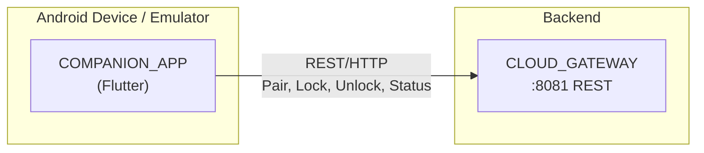
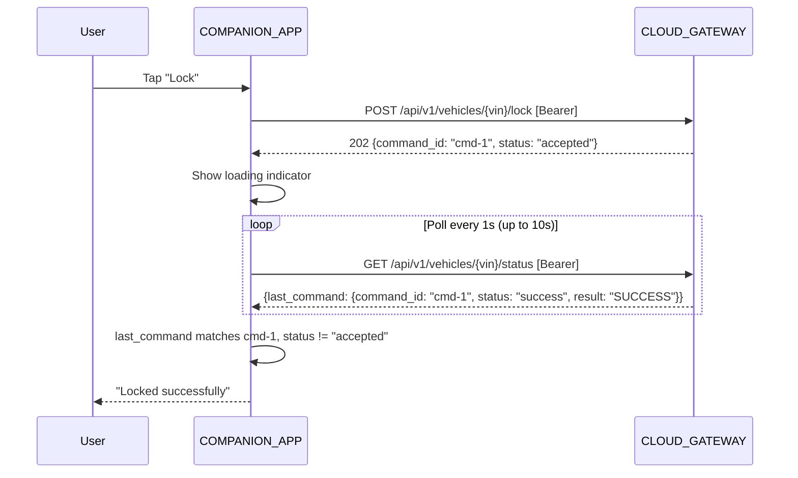

# Design Document: COMPANION_APP

## Overview

The COMPANION_APP is a Flutter/Dart mobile application providing remote
vehicle control via the CLOUD_GATEWAY REST API. It has two screens: a
pairing screen (VIN + PIN) and a dashboard (status display + lock/unlock
commands). The app persists its pairing token locally and polls for vehicle
status and command results. State is managed with Provider/ChangeNotifier.

## Architecture

### Runtime Architecture



### Command Feedback Sequence



### Module Responsibilities

1. **`services/`** — HTTP client wrapper for CLOUD_GATEWAY REST API.
2. **`providers/`** — State management (ChangeNotifier) for vehicle data and
   command state.
3. **`screens/`** — Flutter UI widgets for pairing and dashboard.
4. **`models/`** — Data classes for API responses.

## Components and Interfaces

### Project Structure

```
android/companion-app/
├── lib/
│   ├── main.dart                  # App entry point, Provider setup
│   ├── models/
│   │   └── models.dart            # VehicleStatus, CommandResult, PairResponse
│   ├── services/
│   │   └── cloud_gateway_client.dart  # REST client for CLOUD_GATEWAY
│   ├── providers/
│   │   └── vehicle_provider.dart  # State management
│   └── screens/
│       ├── pairing_screen.dart    # VIN + PIN input
│       └── dashboard_screen.dart  # Status + lock/unlock
├── test/
│   ├── cloud_gateway_client_test.dart
│   └── vehicle_provider_test.dart
├── pubspec.yaml
├── analysis_options.yaml
└── android/                       # Flutter Android runner (generated)
```

### Data Models

```dart
class PairResponse {
  final String token;
  final String vin;
}

class VehicleStatus {
  final String vin;
  final bool? isLocked;
  final bool? isDoorOpen;
  final double? speed;
  final double? latitude;
  final double? longitude;
  final bool? parkingSessionActive;
  final CommandInfo? lastCommand;
  final DateTime? updatedAt;
}

class CommandInfo {
  final String commandId;
  final String type;     // "lock" or "unlock"
  final String status;   // "accepted", "success", "rejected"
  final String? result;  // "SUCCESS", "REJECTED_SPEED", "REJECTED_DOOR_OPEN"
}

class CommandResponse {
  final String commandId;
  final String status;   // "accepted"
}
```

### CloudGatewayClient

```dart
class CloudGatewayClient {
  final String baseUrl;
  final http.Client _client;

  CloudGatewayClient({
    required this.baseUrl,
    http.Client? client,
  }) : _client = client ?? http.Client();

  /// Pair with a vehicle. Returns token + VIN.
  Future<PairResponse> pair(String vin, String pin) async {
    final response = await _client.post(
      Uri.parse('$baseUrl/api/v1/pair'),
      headers: {'Content-Type': 'application/json'},
      body: jsonEncode({'vin': vin, 'pin': pin}),
    );
    if (response.statusCode == 200) {
      return PairResponse.fromJson(jsonDecode(response.body));
    }
    throw GatewayException.fromResponse(response);
  }

  /// Send a lock command. Returns command_id.
  Future<CommandResponse> lock(String vin, String token) async {
    final response = await _client.post(
      Uri.parse('$baseUrl/api/v1/vehicles/$vin/lock'),
      headers: {'Authorization': 'Bearer $token'},
    );
    if (response.statusCode == 202) {
      return CommandResponse.fromJson(jsonDecode(response.body));
    }
    throw GatewayException.fromResponse(response);
  }

  /// Send an unlock command. Returns command_id.
  Future<CommandResponse> unlock(String vin, String token) async {
    // Same pattern as lock, different endpoint
  }

  /// Get vehicle status.
  Future<VehicleStatus> getStatus(String vin, String token) async {
    final response = await _client.get(
      Uri.parse('$baseUrl/api/v1/vehicles/$vin/status'),
      headers: {'Authorization': 'Bearer $token'},
    );
    if (response.statusCode == 200) {
      return VehicleStatus.fromJson(jsonDecode(response.body));
    }
    throw GatewayException.fromResponse(response);
  }
}

class GatewayException implements Exception {
  final int statusCode;
  final String message;
  final String? code;
}
```

### VehicleProvider

```dart
class VehicleProvider extends ChangeNotifier {
  final CloudGatewayClient _client;
  final SharedPreferences _prefs;

  // Pairing state
  String? _vin;
  String? _token;
  bool get isPaired => _token != null && _vin != null;

  // Vehicle status
  VehicleStatus? _status;
  VehicleStatus? get status => _status;
  bool _isStatusLoading = false;
  String? _statusError;

  // Command state
  bool _isCommandPending = false;
  String? _commandResult;   // User-friendly result message
  String? _commandError;

  Timer? _statusTimer;
  Timer? _commandPollTimer;

  /// Load persisted pairing on startup.
  Future<void> loadPersistedPairing() async {
    _vin = _prefs.getString('vin');
    _token = _prefs.getString('token');
    notifyListeners();
  }

  /// Pair with a vehicle.
  Future<void> pair(String vin, String pin) async {
    final response = await _client.pair(vin, pin);
    _vin = response.vin;
    _token = response.token;
    await _prefs.setString('vin', _vin!);
    await _prefs.setString('token', _token!);
    notifyListeners();
  }

  /// Clear pairing.
  Future<void> unpair() async {
    _stopStatusPolling();
    _vin = null;
    _token = null;
    _status = null;
    await _prefs.remove('vin');
    await _prefs.remove('token');
    notifyListeners();
  }

  /// Start polling vehicle status every 5 seconds.
  void startStatusPolling() {
    _fetchStatus(); // Immediate first fetch
    _statusTimer = Timer.periodic(
      const Duration(seconds: 5),
      (_) => _fetchStatus(),
    );
  }

  void _stopStatusPolling() {
    _statusTimer?.cancel();
    _statusTimer = null;
  }

  /// Send lock or unlock command with result polling.
  Future<void> sendCommand(String type) async {
    _isCommandPending = true;
    _commandResult = null;
    _commandError = null;
    notifyListeners();

    try {
      final cmdResponse = type == 'lock'
          ? await _client.lock(_vin!, _token!)
          : await _client.unlock(_vin!, _token!);

      // Poll for result every 1s, up to 10s
      await _pollForCommandResult(cmdResponse.commandId);
    } catch (e) {
      _commandError = 'Failed to send command: $e';
      _isCommandPending = false;
      notifyListeners();
    }
  }

  Future<void> _pollForCommandResult(String commandId) async {
    int attempts = 0;
    _commandPollTimer = Timer.periodic(
      const Duration(seconds: 1),
      (_) async {
        attempts++;
        try {
          final status = await _client.getStatus(_vin!, _token!);
          if (status.lastCommand?.commandId == commandId &&
              status.lastCommand?.status != 'accepted') {
            _commandPollTimer?.cancel();
            _commandResult = _formatResult(status.lastCommand!);
            _isCommandPending = false;
            _status = status;
            notifyListeners();
          }
        } catch (_) {}

        if (attempts >= 10) {
          _commandPollTimer?.cancel();
          _commandResult = 'Command timed out — check status manually.';
          _isCommandPending = false;
          notifyListeners();
        }
      },
    );
  }

  String _formatResult(CommandInfo cmd) {
    switch (cmd.result) {
      case 'SUCCESS':
        return cmd.type == 'lock'
            ? 'Locked successfully'
            : 'Unlocked successfully';
      case 'REJECTED_SPEED':
        return 'Rejected: vehicle speed too high';
      case 'REJECTED_DOOR_OPEN':
        return 'Rejected: door is open';
      default:
        return 'Command result: ${cmd.result}';
    }
  }
}
```

### Screens

#### Pairing Screen

```
┌─────────────────────────┐
│     COMPANION APP       │
│                         │
│  VIN: [_______________] │
│  PIN: [______]          │
│                         │
│      [ PAIR ]           │
│                         │
│  Error: Wrong PIN       │
└─────────────────────────┘
```

#### Dashboard Screen

```
┌─────────────────────────┐
│  Vehicle: DEMO000...001 │
│  ─────────────────────  │
│  Locked:    ✓ Yes       │
│  Door:      Closed      │
│  Speed:     0.0 km/h    │
│  Location:  48.13, 11.58│
│  Parking:   Active      │
│  Updated:   12:34:56    │
│  ─────────────────────  │
│  [ 🔒 LOCK ] [ 🔓 UNLOCK]│
│                         │
│  ✓ Locked successfully  │
│                         │
│         [Unpair]        │
└─────────────────────────┘
```

## Operational Readiness

### Observability

- HTTP requests and responses are logged in debug mode using Dart's
  `developer.log`.
- State changes in VehicleProvider are logged for debugging.

### Areas of Improvement (Deferred)

- **Push notifications:** Real-time command results via push instead of
  polling.
- **Multi-vehicle:** Support pairing with multiple vehicles.
- **iOS build:** Flutter supports iOS out of the box, but not tested for
  the demo.
- **Secure storage:** Use `flutter_secure_storage` instead of
  `shared_preferences` for token storage in production.
- **TLS:** HTTP for demo. Production would enforce HTTPS.

## Correctness Properties

### Property 1: Token-Request Consistency

*For any* REST request to a protected endpoint (lock, unlock, status), THE
COMPANION_APP SHALL include the `Authorization: Bearer {token}` header using
the exact token received from the pairing response.

**Validates: Requirements 07-REQ-1.3, 07-REQ-3.2**

### Property 2: Command-Result Correlation

*For any* lock or unlock command, THE COMPANION_APP SHALL only display a
result when the polled `last_command.command_id` matches the `command_id`
from the original 202 response. Results from previous commands SHALL NOT
be displayed as the current result.

**Validates: Requirements 07-REQ-3.3, 07-REQ-3.4**

### Property 3: Token Persistence Round-Trip

*For any* successful pairing, THE persisted token and VIN SHALL be
recoverable after app restart, and THE app SHALL navigate to the dashboard
without requiring re-pairing.

**Validates: Requirements 07-REQ-4.1, 07-REQ-4.2**

### Property 4: Error Visibility

*For any* HTTP error or network failure, THE COMPANION_APP SHALL display a
user-visible error message. No error SHALL be silently swallowed.

**Validates: Requirements 07-REQ-1.E1, 07-REQ-1.E2, 07-REQ-2.E2,
07-REQ-3.E1, 07-REQ-3.E2**

### Property 5: Status Data Preservation

*For any* failed status poll, THE COMPANION_APP SHALL retain and display the
last successfully received status data rather than clearing the display.

**Validates: Requirements 07-REQ-2.E2**

## Error Handling

| Error Condition | Behavior | Requirement |
|----------------|----------|-------------|
| Pair: wrong PIN | Show "Wrong PIN" | 07-REQ-1.E1 |
| Pair: unknown VIN | Show "Vehicle not found" | 07-REQ-1.E1 |
| Pair: gateway unreachable | Show "Connection error" | 07-REQ-1.E2 |
| Status: null field | Show "Unknown" | 07-REQ-2.E1 |
| Status: request failed | "Connection lost" indicator | 07-REQ-2.E2 |
| Command: poll timeout | "Command timed out" | 07-REQ-3.E1 |
| Command: request failed | Show error message | 07-REQ-3.E2 |

## Technology Stack

| Component | Technology | Version | Purpose |
|-----------|-----------|---------|---------|
| Framework | Flutter | 3.x | Cross-platform mobile UI |
| Language | Dart | 3.x | Application code |
| HTTP | http (package) | 1.x | REST client |
| State management | provider | 6.x | ChangeNotifier + Provider |
| Local storage | shared_preferences | 2.x | Token persistence |
| Testing | flutter_test | — | Unit testing (built-in) |
| HTTP mocking | http (MockClient) | — | Mock HTTP for tests |

## Definition of Done

A task group is complete when ALL of the following are true:

1. All subtasks within the group are checked off (`[x]`)
2. All property tests for the task group pass
3. All previously passing tests still pass (no regressions)
4. No linter warnings or errors introduced
5. Code is committed on a feature branch and pushed to remote
6. Feature branch is merged back to `develop`
7. `tasks.md` checkboxes are updated to reflect completion

## Testing Strategy

### CloudGatewayClient Unit Tests

- **Pairing:** Mock HTTP returning 200 → verify PairResponse parsed. Mock
  returning 403 → verify GatewayException. Mock returning 404 → verify
  exception.
- **Lock/Unlock:** Mock returning 202 → verify CommandResponse. Mock
  returning 401 → verify exception.
- **Status:** Mock returning 200 with full status → verify all fields parsed.
  Mock with null fields → verify nulls preserved.
- **Network error:** Mock throwing exception → verify GatewayException.

### VehicleProvider Unit Tests

- **Pairing flow:** pair() → verify isPaired, token/VIN persisted.
- **Auto-login:** Load with persisted token → verify isPaired, navigates
  to dashboard.
- **Unpair:** unpair() → verify not paired, prefs cleared.
- **Status polling:** Start polling → verify periodic HTTP calls, status
  updated.
- **Command feedback:** sendCommand("lock") → verify HTTP call, polling
  starts, result displayed when received, stops polling.
- **Command timeout:** sendCommand → no result in 10 polls → timeout message.
- **Error handling:** Network failure → error state, last status preserved.

### What is NOT tested

- **Widget rendering:** No widget tests for this spec. Visual correctness
  verified manually.
- **Integration with real CLOUD_GATEWAY:** Verified via mock companion-app-cli
  (spec 03) and manual testing.
