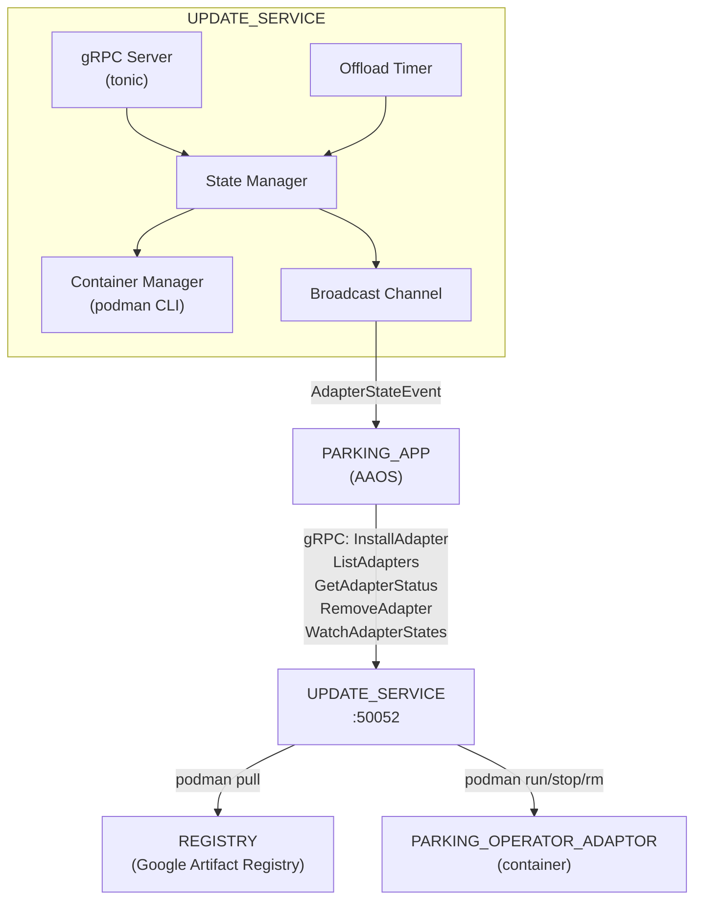
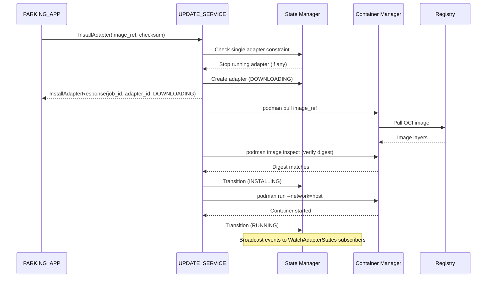

# Design Document: UPDATE_SERVICE

## Overview

The UPDATE_SERVICE is a Rust gRPC service (`rhivos/update-service`) managing the lifecycle of containerized PARKING_OPERATOR_ADAPTORs. It exposes five RPCs (InstallAdapter, WatchAdapterStates, ListAdapters, RemoveAdapter, GetAdapterStatus) via tonic/gRPC over network TCP. Container operations use podman CLI via `tokio::process::Command`. State transitions are broadcast to WatchAdapterStates subscribers via tokio broadcast channels. An inactivity timer automatically offloads stopped adapters after a configurable period.

## Architecture





### Module Responsibilities

1. **main** — Entry point: loads config, sets up gRPC server, starts offload timer, handles shutdown signals.
2. **config** — Configuration loading and parsing: reads JSON file, provides defaults, validates structure.
3. **grpc_service** — gRPC request handlers: implements the UpdateService trait generated by tonic.
4. **state** — State manager: in-memory adapter state, state transitions, broadcast channel, single adapter constraint enforcement.
5. **container** — Container manager: wraps podman CLI commands (pull, inspect, run, stop, rm, rmi) via `tokio::process::Command`.
6. **offload** — Offload timer: periodic check for stopped adapters past inactivity threshold, triggers automatic offloading.
7. **model** — Helper types and adapter ID derivation.

## Components and Interfaces

### gRPC API (from proto/update_service.proto)

| RPC | Request | Response | Streaming |
|-----|---------|----------|-----------|
| InstallAdapter | `{image_ref, checksum_sha256}` | `{job_id, adapter_id, state}` | Unary |
| WatchAdapterStates | `{}` | `{adapter_id, old_state, new_state, timestamp}` | Server-streaming |
| ListAdapters | `{}` | `{adapters: [{adapter_id, state, image_ref}]}` | Unary |
| RemoveAdapter | `{adapter_id}` | `{}` | Unary |
| GetAdapterStatus | `{adapter_id}` | `{adapter_id, state, image_ref, created_at, stopped_at}` | Unary |

### Core Data Types

```rust
#[derive(Clone, Debug, PartialEq)]
pub enum AdapterState {
    Unknown,
    Downloading,
    Installing,
    Running,
    Stopped,
    Error,
    Offloading,
}

#[derive(Clone, Debug)]
pub struct AdapterInfo {
    pub adapter_id: String,
    pub image_ref: String,
    pub checksum: String,
    pub state: AdapterState,
    pub container_id: Option<String>,
    pub created_at: i64,       // Unix timestamp
    pub stopped_at: Option<i64>,
    pub error_message: Option<String>,
}

#[derive(Clone, Debug)]
pub struct AdapterStateEvent {
    pub adapter_id: String,
    pub old_state: AdapterState,
    pub new_state: AdapterState,
    pub timestamp: i64,
}

pub struct Config {
    pub grpc_port: u16,
    pub registry_url: String,
    pub inactivity_timeout_secs: u64,
    pub container_storage_path: String,
}
```

### Module Interfaces

```rust
// config module
pub fn load_config(path: &str) -> Result<Config, ConfigError>;
pub fn default_config() -> Config;

// state module
pub struct StateManager { /* broadcast + map */ }
impl StateManager {
    pub fn new() -> Self;
    pub fn create_adapter(&self, adapter_id: &str, image_ref: &str, checksum: &str) -> Result<(), StateError>;
    pub fn transition(&self, adapter_id: &str, new_state: AdapterState) -> Result<(), StateError>;
    pub fn get(&self, adapter_id: &str) -> Option<AdapterInfo>;
    pub fn list(&self) -> Vec<AdapterInfo>;
    pub fn remove(&self, adapter_id: &str) -> Result<(), StateError>;
    pub fn get_running_adapter(&self) -> Option<String>;
    pub fn get_stopped_expired(&self, timeout_secs: u64) -> Vec<String>;
    pub fn subscribe(&self) -> tokio::sync::broadcast::Receiver<AdapterStateEvent>;
}

// container module (trait for testability)
#[async_trait]
pub trait ContainerRuntime: Send + Sync {
    async fn pull(&self, image_ref: &str) -> Result<(), ContainerError>;
    async fn inspect_digest(&self, image_ref: &str) -> Result<String, ContainerError>;
    async fn run(&self, image_ref: &str, adapter_id: &str) -> Result<String, ContainerError>;
    async fn stop(&self, container_id: &str) -> Result<(), ContainerError>;
    async fn remove(&self, container_id: &str) -> Result<(), ContainerError>;
    async fn remove_image(&self, image_ref: &str) -> Result<(), ContainerError>;
}

pub struct PodmanRuntime { /* storage_path config */ }
impl ContainerRuntime for PodmanRuntime { ... }

// model module
pub fn derive_adapter_id(image_ref: &str) -> String;
pub fn generate_job_id() -> String;
```

## Data Models

### Configuration File (config.json)

```json
{
  "grpc_port": 50052,
  "registry_url": "us-docker.pkg.dev/sdv-demo/adapters",
  "inactivity_timeout_secs": 86400,
  "container_storage_path": "/var/lib/containers/adapters/"
}
```

### Valid State Transitions

| From | To | Trigger |
|------|----|---------|
| (new) | DOWNLOADING | InstallAdapter called |
| DOWNLOADING | INSTALLING | Image pulled and checksum verified |
| DOWNLOADING | ERROR | Pull failed or checksum mismatch |
| INSTALLING | RUNNING | Container started successfully |
| INSTALLING | ERROR | Container failed to start |
| RUNNING | STOPPED | RemoveAdapter called, or new InstallAdapter preempts |
| RUNNING | ERROR | Container exited with non-zero code |
| STOPPED | RUNNING | (reserved for future restart) |
| STOPPED | OFFLOADING | Inactivity timer expired or RemoveAdapter called |
| OFFLOADING | (removed) | Container and image cleaned up |
| ERROR | (removed) | RemoveAdapter called |

## Operational Readiness

- **Startup logging:** Logs version, port, registry URL.
- **Shutdown:** Handles SIGTERM/SIGINT, stops running adapters, shuts down gRPC server.
- **Observability:** State transition events via WatchAdapterStates stream.
- **Rollback:** Revert via `git checkout`. On ERROR, adapter image is cleaned up (for checksum failures).

## Correctness Properties

### Property 1: State Machine Validity

*For any* sequence of operations on an adapter, the UPDATE_SERVICE SHALL only perform state transitions that are in the valid state transition table.

**Validates: Requirements 07-REQ-1.2, 07-REQ-5.2**

### Property 2: Single Adapter Constraint

*For any* point in time, the UPDATE_SERVICE SHALL have at most one adapter in RUNNING state.

**Validates: Requirements 07-REQ-2.1, 07-REQ-2.2**

### Property 3: Checksum Verification

*For any* InstallAdapter call with a checksum that does not match the pulled image's digest, the UPDATE_SERVICE SHALL transition the adapter to ERROR and not start the container.

**Validates: Requirements 07-REQ-1.3, 07-REQ-1.E3**

### Property 4: State Event Broadcasting

*For any* state transition, the UPDATE_SERVICE SHALL emit an AdapterStateEvent to all active WatchAdapterStates subscribers with correct adapter_id, old_state, new_state, and timestamp.

**Validates: Requirements 07-REQ-3.1, 07-REQ-3.2, 07-REQ-3.3**

### Property 5: Adapter ID Derivation

*For any* valid OCI image reference, `derive_adapter_id` SHALL produce a deterministic, non-empty string containing the image name and tag.

**Validates: Requirements 07-REQ-1.5**

### Property 6: Inactivity Offloading

*For any* adapter that has been in STOPPED state for longer than the configured inactivity timeout, the UPDATE_SERVICE SHALL eventually transition it to OFFLOADING and remove it.

**Validates: Requirements 07-REQ-6.1, 07-REQ-6.2**

### Property 7: Config Defaults

*For any* missing or nonexistent config file path, the UPDATE_SERVICE SHALL start with default configuration (port 50052, inactivity timeout 86400s, storage path `/var/lib/containers/adapters/`).

**Validates: Requirements 07-REQ-7.1, 07-REQ-7.3, 07-REQ-7.E1**

## Error Handling

| Error Condition | Behavior | Requirement |
|----------------|----------|-------------|
| Empty image_ref or checksum | gRPC INVALID_ARGUMENT | 07-REQ-1.E1 |
| Image pull failure | ERROR state + gRPC UNAVAILABLE | 07-REQ-1.E2 |
| Checksum mismatch | ERROR state + image cleanup + gRPC FAILED_PRECONDITION | 07-REQ-1.E3 |
| Container start failure | ERROR state + gRPC INTERNAL | 07-REQ-1.E4 |
| Stop running adapter fails | gRPC INTERNAL, new install aborted | 07-REQ-2.E1 |
| Unknown adapter_id (GetAdapterStatus) | gRPC NOT_FOUND | 07-REQ-4.E1 |
| Unknown adapter_id (RemoveAdapter) | gRPC NOT_FOUND | 07-REQ-5.E1 |
| Container removal failure | ERROR state + gRPC INTERNAL | 07-REQ-5.E2 |
| Config file missing | Start with defaults | 07-REQ-7.E1 |
| Config file invalid JSON | Exit non-zero | 07-REQ-7.E2 |

## Technology Stack

| Technology | Version | Purpose |
|-----------|---------|---------|
| Rust | 2021 edition | Service implementation |
| tonic | latest | gRPC server framework |
| prost | latest | Protobuf code generation |
| tokio | latest | Async runtime |
| tonic-build | latest | Proto code generation (build.rs) |
| serde + serde_json | latest | Config file parsing |
| uuid | latest | Job ID generation |
| tracing + tracing-subscriber | latest | Structured logging |
| proptest | latest (dev) | Property-based testing |
| podman | system | Container runtime (CLI) |

## Definition of Done

A task group is complete when ALL of the following are true:

1. All subtasks within the group are checked off (`[x]`)
2. All spec tests (`test_spec.md` entries) for the task group pass
3. All property tests for the task group pass
4. All previously passing tests still pass (no regressions)
5. No linter warnings or errors introduced
6. Code is committed on a feature branch and pushed to remote
7. Feature branch is merged back to `main`
8. `tasks.md` checkboxes are updated to reflect completion

## Testing Strategy

- **Unit tests:** Rust `#[cfg(test)]` modules alongside source. The `config`, `state`, `model`, and `container` modules have unit tests. The `container` module uses a mock `ContainerRuntime` trait implementation for testing without podman.
- **Property tests:** Rust `proptest` crate for state machine validity, adapter ID derivation, single adapter constraint, and config defaults.
- **Integration tests:** `tests/update-service/` Go module for end-to-end gRPC testing against a running service with a mock or real podman. Integration tests require the service binary and optionally podman.
- **All unit/property tests run via:** `cd rhivos && cargo test -p update-service`
- **Integration tests run via:** `cd tests/update-service && go test -v ./...`
