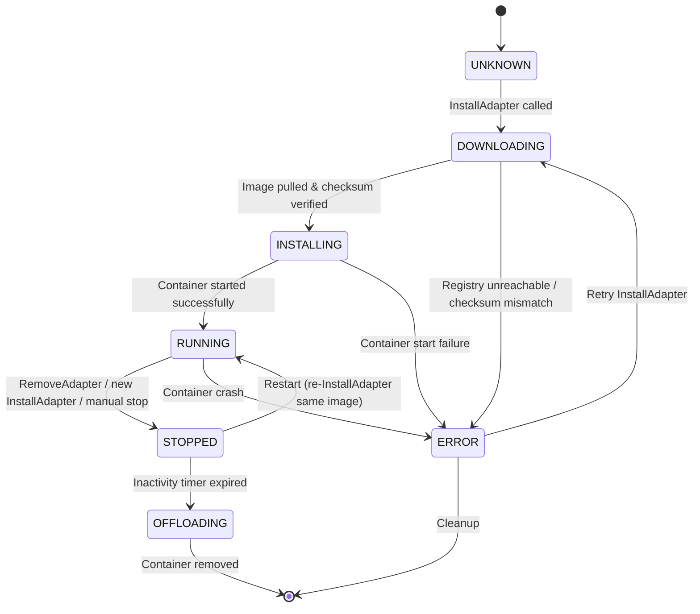

# Design: UPDATE_SERVICE (Spec 07)

> Design document for the UPDATE_SERVICE adapter lifecycle manager.
> Implements requirements from `.specs/07_update_service/requirements.md`.

## Architecture Overview

The UPDATE_SERVICE is a Rust async service built on tonic (gRPC) and tokio. It manages the full lifecycle of containerized PARKING_OPERATOR_ADAPTORs in the RHIVOS QM partition. The service interacts with an OCI registry (Google Artifact Registry) for image pulling, uses podman CLI for container management, and exposes a gRPC interface for clients (primarily PARKING_APP).

```
                     +---------------------------------------+
                     |         UPDATE_SERVICE                 |
                     |      (Rust gRPC server :50060)         |
                     +---------------------------------------+
                     |                                       |
  InstallAdapter --->|  +-----------------------------+      |
  WatchAdapterStates |  | gRPC Service Layer (tonic)  |      |
  ListAdapters       |  +-----------------------------+      |
  RemoveAdapter      |          |                            |
  GetAdapterStatus   |  +-----------------------------+      |
                     |  | Adapter Manager             |      |
                     |  | (state machine, constraints)|      |
                     |  +-----------------------------+      |
                     |       |              |                 |
                     |  +---------+   +------------+         |
                     |  | OCI     |   | Container  |         |
                     |  | Puller  |   | Runtime    |         |
                     |  | (pull & |   | (podman    |         |
                     |  | verify) |   |  CLI)      |         |
                     |  +---------+   +------------+         |
                     |       |              |                 |
                     +-------|--------------|--+              |
                             |              |                 |
                     +-------v--+   +-------v------+         |
                     | REGISTRY |   | /var/lib/     |         |
                     | (GAR)    |   | containers/   |         |
                     +----------+   | adapters/     |         |
                                    +--------------+          |
                     |                                       |
                     |  +-----------------------------+      |
                     |  | Offload Timer               |      |
                     |  | (tokio background task)     |      |
                     |  +-----------------------------+      |
                     |                                       |
                     |  +-----------------------------+      |
                     |  | State Event Broadcaster     |      |
                     |  | (tokio::sync::broadcast)    |      |
                     |  +-----------------------------+      |
                     +---------------------------------------+
```

## Module Structure

```
rhivos/update-service/
  Cargo.toml
  build.rs                    # tonic-build for proto compilation
  src/
    main.rs                   # Server entry point, config loading
    config.rs                 # Configuration struct and loading
    grpc.rs                   # gRPC service implementation (tonic)
    grpc_test.rs              # gRPC handler tests
    manager.rs                # Adapter manager (state machine, constraints)
    manager_test.rs           # Manager unit tests
    state.rs                  # AdapterState enum, state machine transitions
    state_test.rs             # State machine tests
    oci.rs                    # OCI image pulling and checksum verification
    oci_test.rs               # OCI puller tests (mocked)
    container.rs              # Container runtime (podman CLI wrapper)
    container_test.rs         # Container runtime tests (mocked)
    offload.rs                # Inactivity timer and offloading logic
    offload_test.rs           # Offload timer tests
```

## gRPC Service Definition

```protobuf
syntax = "proto3";

package update_service.v1;

service UpdateService {
  // Pull, verify, install, and start an adapter container.
  rpc InstallAdapter(InstallAdapterRequest) returns (InstallAdapterResponse);

  // Server-streaming RPC for adapter state transitions.
  rpc WatchAdapterStates(WatchAdapterStatesRequest) returns (stream AdapterStateEvent);

  // List all known adapters with current states.
  rpc ListAdapters(ListAdaptersRequest) returns (ListAdaptersResponse);

  // Stop and remove an adapter.
  rpc RemoveAdapter(RemoveAdapterRequest) returns (RemoveAdapterResponse);

  // Query status of a specific adapter.
  rpc GetAdapterStatus(GetAdapterStatusRequest) returns (GetAdapterStatusResponse);
}

enum AdapterState {
  ADAPTER_STATE_UNKNOWN = 0;
  ADAPTER_STATE_DOWNLOADING = 1;
  ADAPTER_STATE_INSTALLING = 2;
  ADAPTER_STATE_RUNNING = 3;
  ADAPTER_STATE_STOPPED = 4;
  ADAPTER_STATE_ERROR = 5;
  ADAPTER_STATE_OFFLOADING = 6;
}

message InstallAdapterRequest {
  string image_ref = 1;
  string checksum_sha256 = 2;
}

message InstallAdapterResponse {
  string job_id = 1;
  string adapter_id = 2;
  AdapterState state = 3;
}

message WatchAdapterStatesRequest {}

message AdapterStateEvent {
  string adapter_id = 1;
  AdapterState old_state = 2;
  AdapterState new_state = 3;
  int64 timestamp = 4;
}

message ListAdaptersRequest {}

message ListAdaptersResponse {
  repeated AdapterInfo adapters = 1;
}

message AdapterInfo {
  string adapter_id = 1;
  string image_ref = 2;
  AdapterState state = 3;
}

message RemoveAdapterRequest {
  string adapter_id = 1;
}

message RemoveAdapterResponse {
  bool success = 1;
}

message GetAdapterStatusRequest {
  string adapter_id = 1;
}

message GetAdapterStatusResponse {
  string adapter_id = 1;
  string image_ref = 2;
  AdapterState state = 3;
  string error_message = 4;
}
```

**Proto file location:** `proto/update_service/v1/update_service.proto`

## Adapter Lifecycle State Machine



## OCI Pull and Verification Flow

```
1. Receive InstallAdapter(image_ref, checksum_sha256)
2. Generate job_id (UUID) and adapter_id (derived from image_ref)
3. Set state = DOWNLOADING, emit AdapterStateEvent
4. Execute: podman pull <image_ref>
5. Execute: podman inspect <image_ref> --format '{{.Digest}}'
6. Compute SHA-256 of the manifest digest string
7. Compare computed hash with checksum_sha256
   - Match: Set state = INSTALLING, emit event
   - Mismatch: Set state = ERROR, emit event, podman rmi <image_ref>, return INVALID_ARGUMENT
8. Execute: podman run -d --name <adapter_id> <image_ref>
9. Verify container started: podman inspect <adapter_id> --format '{{.State.Status}}'
   - Running: Set state = RUNNING, emit event
   - Not running: Set state = ERROR, emit event, return INTERNAL
```

## Container Management via Podman CLI

The UPDATE_SERVICE manages containers by shelling out to the `podman` CLI. This approach is chosen for simplicity and compatibility with the RHIVOS environment.

| Operation | Command |
|-----------|---------|
| Pull image | `podman pull <image_ref>` |
| Inspect digest | `podman inspect <image_ref> --format '{{.Digest}}'` |
| Run container | `podman run -d --name <adapter_id> <image_ref>` |
| Stop container | `podman stop <adapter_id>` |
| Remove container | `podman rm -f <adapter_id>` |
| Remove image | `podman rmi <image_ref>` |
| Check status | `podman inspect <adapter_id> --format '{{.State.Status}}'` |
| List containers | `podman ps -a --format json` |

All podman commands are executed via `tokio::process::Command` for async compatibility. Errors from podman (non-zero exit codes, stderr output) are captured and mapped to appropriate gRPC error responses.

## Configuration

```toml
# update-service.toml

[grpc]
port = 50060

[registry]
base_url = "europe-west1-docker.pkg.dev/rhadp-parking-demo/adapters"

[offload]
inactivity_timeout_secs = 86400   # 24 hours

[storage]
path = "/var/lib/containers/adapters/"
```

Configuration is loaded from a TOML file at startup. Environment variables can override file values using the `UPDATE_SERVICE_` prefix (e.g., `UPDATE_SERVICE_GRPC_PORT=50060`).

## Correctness Properties

| ID | Property | Description |
|----|----------|-------------|
| CP-1 | State machine validity | Every state transition MUST be one of the valid transitions defined in 07-REQ-6.1. No invalid transitions are permitted. |
| CP-2 | Checksum verification | An adapter MUST NOT reach INSTALLING state unless the SHA-256 checksum of the OCI manifest digest matches the provided checksum. |
| CP-3 | Single adapter constraint | At most one adapter MUST be in RUNNING state at any time. Before starting a new adapter, any currently running adapter MUST be stopped first. |
| CP-4 | Event completeness | Every state transition MUST emit an AdapterStateEvent to all active WatchAdapterStates subscribers. |
| CP-5 | Offload correctness | An adapter MUST NOT be offloaded while in RUNNING state. Only STOPPED adapters are eligible for automatic offloading. |
| CP-6 | Idempotent install | Installing an already-running adapter with the same image_ref MUST return ALREADY_EXISTS without side effects. |
| CP-7 | Cleanup on error | When a checksum mismatch or container start failure occurs, any partially downloaded or created resources MUST be cleaned up. |

## Error Handling

| Scenario | gRPC Status | Error Message Example |
|----------|-------------|----------------------|
| Registry unreachable | UNAVAILABLE | `"failed to pull image: connection refused"` |
| Checksum mismatch | INVALID_ARGUMENT | `"checksum mismatch: expected sha256:abc..., got sha256:def..."` |
| Container start failure | INTERNAL | `"container failed to start: exit code 125"` |
| Unknown adapter_id | NOT_FOUND | `"adapter not found: adapter-xyz"` |
| Adapter already running (same image) | ALREADY_EXISTS | `"adapter already installed and running: adapter-xyz"` |
| Invalid image_ref format | INVALID_ARGUMENT | `"invalid image reference: missing tag"` |
| Storage path not writable | INTERNAL | `"storage path not writable: /var/lib/containers/adapters/"` |
| Podman not found | INTERNAL | `"podman binary not found in PATH"` |
| Invalid state transition | INTERNAL | `"invalid state transition: ERROR -> INSTALLING"` |

## Technology Stack

| Component | Choice |
|-----------|--------|
| Language | Rust (edition 2021) |
| gRPC framework | tonic 0.11+ |
| Async runtime | tokio (full features) |
| Protobuf codegen | tonic-build, prost |
| Container runtime | podman CLI (via `tokio::process::Command`) |
| Configuration | toml crate |
| UUID generation | uuid crate (v4) |
| Logging | tracing crate |
| Testing | tokio::test, mockall (for trait mocking) |

## Definition of Done

1. gRPC server starts on configured port and accepts connections.
2. `InstallAdapter` pulls an OCI image, verifies its checksum, and starts the container.
3. `WatchAdapterStates` streams state transitions to connected clients.
4. `ListAdapters` and `GetAdapterStatus` return correct adapter information.
5. `RemoveAdapter` stops and removes the specified container.
6. Checksum verification rejects images with mismatched checksums.
7. Single adapter constraint is enforced -- only one adapter can be RUNNING at a time.
8. Automatic offloading removes stopped adapters after the configured inactivity timeout.
9. All state transitions follow the defined state machine.
10. All unit tests pass: `cd rhivos && cargo test -p update-service`.
11. All linting passes: `cd rhivos && cargo clippy -p update-service`.
12. Proto definitions compile successfully via tonic-build.

## Testing Strategy

### Unit Tests

- **State machine:** Test all valid transitions succeed and all invalid transitions are rejected. Table-driven tests for completeness.
- **OCI puller (mocked):** Mock the podman CLI calls. Verify checksum verification logic with known valid and invalid checksums.
- **Container runtime (mocked):** Mock podman CLI. Verify start, stop, remove sequences produce correct state transitions.
- **Offload timer:** Use tokio time mocking to verify timer fires after configured duration and triggers offloading.
- **Adapter manager:** Verify single-adapter constraint enforcement, concurrent install handling, and error propagation.

### Integration Tests

- **gRPC round-trip:** Use tonic test client against a running server instance (with mocked podman). Exercise full InstallAdapter -> WatchAdapterStates -> RemoveAdapter flow.
- **State streaming:** Verify multiple concurrent WatchAdapterStates clients receive the same events.

### Property Tests

- **State machine completeness:** For every (state, event) pair, exactly one of {valid transition, rejection} occurs.
- **Single adapter invariant:** After any sequence of InstallAdapter/RemoveAdapter calls, at most one adapter is in RUNNING state.
