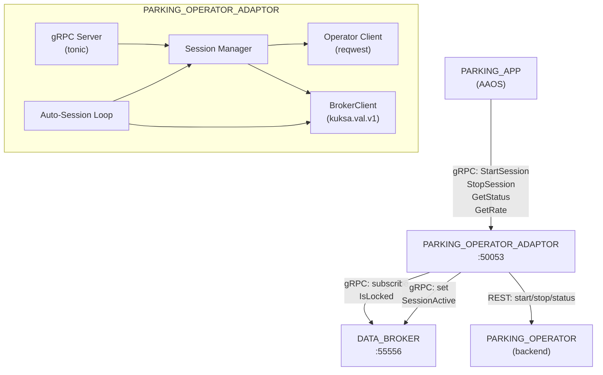
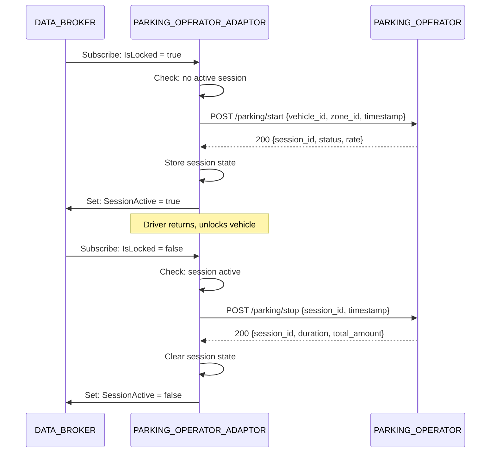

# Design Document: PARKING_OPERATOR_ADAPTOR

## Overview

The PARKING_OPERATOR_ADAPTOR is a containerized Rust application (`rhivos/parking-operator-adaptor`) that bridges the PARKING_APP (gRPC) with a PARKING_OPERATOR (REST), and autonomously manages parking sessions based on lock/unlock events from DATA_BROKER. It exposes four gRPC RPCs (StartSession, StopSession, GetStatus, GetRate) via tonic, communicates with DATA_BROKER via kuksa.val.v1 gRPC (subscribe + set), and calls the PARKING_OPERATOR's REST API via reqwest. Lock/unlock events are processed sequentially, and session operations are idempotent.

## Architecture





### Module Responsibilities

1. **main** — Entry point: loads config, connects DATA_BROKER, sets up gRPC server, starts auto-session loop, handles shutdown.
2. **config** — Configuration from env vars with defaults.
3. **session** — Session manager: in-memory session state, start/stop logic, idempotency.
4. **operator_client** — REST client for PARKING_OPERATOR: start, stop, status calls with retry logic.
5. **broker** — BrokerClient: subscribe to lock signal, write SessionActive signal.
6. **grpc_service** — gRPC handlers: StartSession, StopSession, GetStatus, GetRate.
7. **model** — Core data types: SessionState, Rate, OperatorStartResponse, OperatorStopResponse.

## Components and Interfaces

### gRPC API (from proto/parking_adaptor.proto)

| RPC | Request | Response |
|-----|---------|----------|
| StartSession | `{zone_id}` | `{session_id, status}` |
| StopSession | `{}` | `{session_id, status, duration_seconds, total_amount, currency}` |
| GetStatus | `{}` | `{session_id, active, zone_id, start_time, rate}` |
| GetRate | `{}` | `{rate_type, amount, currency}` |

### Core Data Types

```rust
#[derive(Clone, Debug)]
pub struct SessionState {
    pub session_id: String,
    pub zone_id: String,
    pub start_time: i64,   // Unix timestamp
    pub rate: Rate,
    pub active: bool,
}

#[derive(Clone, Debug, Serialize, Deserialize)]
pub struct Rate {
    pub rate_type: String,  // "per_hour" | "flat_fee"
    pub amount: f64,
    pub currency: String,   // "EUR"
}

#[derive(Serialize)]
pub struct StartRequest {
    pub vehicle_id: String,
    pub zone_id: String,
    pub timestamp: i64,
}

#[derive(Deserialize)]
pub struct StartResponse {
    pub session_id: String,
    pub status: String,
    pub rate: Rate,
}

#[derive(Serialize)]
pub struct StopRequest {
    pub session_id: String,
    pub timestamp: i64,
}

#[derive(Deserialize)]
pub struct StopResponse {
    pub session_id: String,
    pub status: String,
    pub duration_seconds: u64,
    pub total_amount: f64,
    pub currency: String,
}

pub struct Config {
    pub parking_operator_url: String,
    pub data_broker_addr: String,
    pub grpc_port: u16,
    pub vehicle_id: String,
    pub zone_id: String,
}
```

### Module Interfaces

```rust
// config module
pub fn load_config() -> Config;

// session module
pub struct SessionManager { /* Arc<Mutex<Option<SessionState>>> */ }
impl SessionManager {
    pub fn new() -> Self;
    pub fn start(&self, session_id: &str, zone_id: &str, rate: Rate) -> Result<(), SessionError>;
    pub fn stop(&self) -> Result<SessionState, SessionError>;
    pub fn get_status(&self) -> Option<SessionState>;
    pub fn get_rate(&self) -> Option<Rate>;
    pub fn is_active(&self) -> bool;
}

// operator_client module (trait for testability)
#[async_trait]
pub trait OperatorClient: Send + Sync {
    async fn start_session(&self, vehicle_id: &str, zone_id: &str) -> Result<StartResponse, OperatorError>;
    async fn stop_session(&self, session_id: &str) -> Result<StopResponse, OperatorError>;
    async fn get_session_status(&self, session_id: &str) -> Result<serde_json::Value, OperatorError>;
}

pub struct HttpOperatorClient { /* reqwest::Client + base_url */ }
impl OperatorClient for HttpOperatorClient { ... }

// broker module (trait for testability)
#[async_trait]
pub trait BrokerClient: Send + Sync {
    async fn subscribe_lock_state(&self) -> Result<Receiver<bool>, BrokerError>;
    async fn set_session_active(&self, active: bool) -> Result<(), BrokerError>;
}
```

## Data Models

### PARKING_OPERATOR REST API Contract

**Start Session:**
```
POST /parking/start
Body: {"vehicle_id": "DEMO-VIN-001", "zone_id": "zone-demo-1", "timestamp": 1700000000}
Response: {"session_id": "sess-001", "status": "active", "rate": {"rate_type": "per_hour", "amount": 2.50, "currency": "EUR"}}
```

**Stop Session:**
```
POST /parking/stop
Body: {"session_id": "sess-001", "timestamp": 1700003600}
Response: {"session_id": "sess-001", "status": "stopped", "duration_seconds": 3600, "total_amount": 2.50, "currency": "EUR"}
```

**Get Status:**
```
GET /parking/status/sess-001
Response: {"session_id": "sess-001", "status": "active", "zone_id": "zone-demo-1", "start_time": 1700000000}
```

## Operational Readiness

- **Startup logging:** Logs version, port, operator URL, DATA_BROKER address, vehicle ID.
- **Shutdown:** Handles SIGTERM/SIGINT, stops active session, closes DATA_BROKER connection, shuts down gRPC server.
- **Health:** GetStatus RPC can serve as a health indicator.
- **Rollback:** Revert via `git checkout`. No persistent state.

## Correctness Properties

### Property 1: Autonomous Session Start on Lock

*For any* lock event (IsLocked = true) when no session is active, the adaptor SHALL call the PARKING_OPERATOR start API and, on success, store the session and write SessionActive = true to DATA_BROKER.

**Validates: Requirements 08-REQ-1.1, 08-REQ-1.2, 08-REQ-1.3**

### Property 2: Autonomous Session Stop on Unlock

*For any* unlock event (IsLocked = false) when a session is active, the adaptor SHALL call the PARKING_OPERATOR stop API and, on success, clear the session and write SessionActive = false to DATA_BROKER.

**Validates: Requirements 08-REQ-2.1, 08-REQ-2.2, 08-REQ-2.3**

### Property 3: Session Idempotency

*For any* lock event while a session is already active, the adaptor SHALL not call the PARKING_OPERATOR and not modify session state. *For any* unlock event while no session is active, the same SHALL hold.

**Validates: Requirements 08-REQ-1.E1, 08-REQ-2.E1**

### Property 4: Manual Override Consistency

*For any* manual StartSession or StopSession call, the adaptor SHALL perform the same PARKING_OPERATOR API call and state updates as the autonomous flow, and resume autonomous behavior on the next lock/unlock cycle.

**Validates: Requirements 08-REQ-3.1, 08-REQ-3.2, 08-REQ-3.3**

### Property 5: Operator Retry Logic

*For any* PARKING_OPERATOR REST API failure, the adaptor SHALL retry up to 3 times with exponential backoff (1s, 2s, 4s) before reporting failure.

**Validates: Requirements 08-REQ-1.E2, 08-REQ-2.E2**

### Property 6: Config Defaults

*For any* missing environment variable, the adaptor SHALL use the defined default value.

**Validates: Requirements 08-REQ-7.1, 08-REQ-7.2**

## Error Handling

| Error Condition | Behavior | Requirement |
|----------------|----------|-------------|
| Lock event while session active | No-op, log info | 08-REQ-1.E1 |
| Operator start fails after 3 retries | Log error, session not started | 08-REQ-1.E2 |
| Unlock event while no session | No-op, log info | 08-REQ-2.E1 |
| Operator stop fails after 3 retries | Log error, session not cleared | 08-REQ-2.E2 |
| StartSession while session active | gRPC ALREADY_EXISTS | 08-REQ-3.E1 |
| StopSession while no session | gRPC NOT_FOUND | 08-REQ-3.E2 |
| GetRate while no session | gRPC NOT_FOUND | 08-REQ-5.2 |
| DATA_BROKER unreachable at startup | Retry 5x, exit non-zero | 08-REQ-6.E1 |
| SessionActive write fails | Log error, continue | 08-REQ-6.E2 |

## Technology Stack

| Technology | Version | Purpose |
|-----------|---------|---------|
| Rust | 2021 edition | Service implementation |
| tonic | latest | gRPC server framework |
| prost | latest | Protobuf code generation |
| tokio | latest | Async runtime |
| tonic-build | latest | Proto code generation (build.rs) |
| reqwest | latest | HTTP client for PARKING_OPERATOR REST API |
| serde + serde_json | latest | JSON serialization |
| tracing + tracing-subscriber | latest | Structured logging |
| proptest | latest (dev) | Property-based testing |

## Definition of Done

A task group is complete when ALL of the following are true:

1. All subtasks within the group are checked off (`[x]`)
2. All spec tests (`test_spec.md` entries) for the task group pass
3. All property tests for the task group pass
4. All previously passing tests still pass (no regressions)
5. No linter warnings or errors introduced
6. Code is committed on a feature branch and pushed to remote
7. Feature branch is merged back to `main`
8. `tasks.md` checkboxes are updated to reflect completion

## Testing Strategy

- **Unit tests:** Rust `#[cfg(test)]` modules. The `session`, `config`, `operator_client`, and `grpc_service` modules have unit tests. The `operator_client` and `broker` modules use trait-based mock implementations.
- **Property tests:** Rust `proptest` crate for session idempotency, retry behavior, and config defaults.
- **Integration tests:** `tests/parking-operator-adaptor/` Go module for end-to-end gRPC + REST testing with mock PARKING_OPERATOR.
- **All unit/property tests run via:** `cd rhivos && cargo test -p parking-operator-adaptor`
- **Integration tests run via:** `cd tests/parking-operator-adaptor && go test -v ./...`
