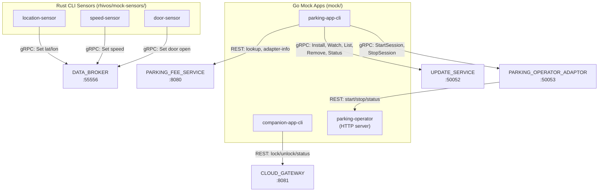

# Design Document: MOCK_APPS

## Overview

The Mock Apps are six independent tools — three Rust CLI sensors and three Go CLI/server apps — that simulate real vehicle sensors, the PARKING_APP, the COMPANION_APP, and a PARKING_OPERATOR. They enable integration testing of backend services and RHIVOS components without real hardware or Android builds.

## Architecture



### Module Responsibilities

**Rust (rhivos/mock-sensors/):**

1. **lib.rs** — Shared `BrokerWriter`: connect to DATA_BROKER, write signal value via kuksa.val.v1 gRPC.
2. **bin/location-sensor.rs** — Parse `--lat`/`--lon` args, write latitude and longitude signals.
3. **bin/speed-sensor.rs** — Parse `--speed` arg, write Vehicle.Speed signal.
4. **bin/door-sensor.rs** — Parse `--open`/`--closed` arg, write IsOpen signal.

**Go (mock/parking-operator/):**

5. **main.go** — Entry point with `serve` subcommand dispatch.
6. **handler/handler.go** — HTTP handlers for POST /parking/start, POST /parking/stop, GET /parking/status/{session_id}.
7. **store/store.go** — In-memory session store (mutex-protected map).

**Go (mock/companion-app-cli/):**

8. **main.go** — Entry point with `lock`, `unlock`, `status` subcommand dispatch and CLOUD_GATEWAY REST calls.

**Go (mock/parking-app-cli/):**

9. **main.go** — Entry point with subcommand dispatch.
10. **feeclient/feeclient.go** — PARKING_FEE_SERVICE REST client (lookup, adapter-info).
11. **grpcclient/grpcclient.go** — UPDATE_SERVICE and PARKING_OPERATOR_ADAPTOR gRPC clients.

## Components and Interfaces

### Mock Sensor CLI Interface

```
# Location sensor
location-sensor --lat=48.1351 --lon=11.5820
location-sensor --help

# Speed sensor
speed-sensor --speed=0.0
speed-sensor --help

# Door sensor
door-sensor --open
door-sensor --closed
door-sensor --help
```

### Mock PARKING_OPERATOR CLI/Server Interface

```
# Start server
parking-operator serve [--port=8080]
parking-operator --help
```

### Mock COMPANION_APP CLI Interface

```
companion-app-cli lock --vin=VIN001 [--token=<token>] [--gateway-url=<url>]
companion-app-cli unlock --vin=VIN001 [--token=<token>] [--gateway-url=<url>]
companion-app-cli status --vin=VIN001 --command-id=<uuid> [--token=<token>] [--gateway-url=<url>]
companion-app-cli --help
```

### Mock PARKING_APP CLI Interface

```
parking-app-cli lookup --lat=48.1351 --lon=11.5820
parking-app-cli adapter-info --operator-id=op-001
parking-app-cli install --image-ref=<ref> --checksum=<sha256>
parking-app-cli watch
parking-app-cli list
parking-app-cli remove --adapter-id=<id>
parking-app-cli status --adapter-id=<id>
parking-app-cli start-session --zone-id=zone-demo-1
parking-app-cli stop-session
parking-app-cli --help
```

### Core Data Types

```go
// mock/parking-operator/store/store.go
type Session struct {
    SessionID  string  `json:"session_id"`
    VehicleID  string  `json:"vehicle_id"`
    ZoneID     string  `json:"zone_id"`
    Status     string  `json:"status"`      // "active" | "stopped"
    StartTime  int64   `json:"start_time"`
    StopTime   int64   `json:"stop_time,omitempty"`
    Rate       Rate    `json:"rate"`
}

type Rate struct {
    RateType string  `json:"rate_type"` // "per_hour"
    Amount   float64 `json:"amount"`    // 2.50
    Currency string  `json:"currency"`  // "EUR"
}

type StartRequest struct {
    VehicleID string `json:"vehicle_id"`
    ZoneID    string `json:"zone_id"`
    Timestamp int64  `json:"timestamp"`
}

type StartResponse struct {
    SessionID string `json:"session_id"`
    Status    string `json:"status"`
    Rate      Rate   `json:"rate"`
}

type StopRequest struct {
    SessionID string `json:"session_id"`
    Timestamp int64  `json:"timestamp"`
}

type StopResponse struct {
    SessionID       string  `json:"session_id"`
    Status          string  `json:"status"`
    DurationSeconds int64   `json:"duration_seconds"`
    TotalAmount     float64 `json:"total_amount"`
    Currency        string  `json:"currency"`
}
```

```rust
// rhivos/mock-sensors/src/lib.rs
pub struct BrokerWriter {
    client: KuksaClient,
}

impl BrokerWriter {
    pub async fn connect(addr: &str) -> Result<Self, BrokerError>;
    pub async fn set_double(&self, path: &str, value: f64) -> Result<(), BrokerError>;
    pub async fn set_float(&self, path: &str, value: f32) -> Result<(), BrokerError>;
    pub async fn set_bool(&self, path: &str, value: bool) -> Result<(), BrokerError>;
}
```

## Data Models

### Mock PARKING_OPERATOR REST API Contract

**Start Session:**
```
POST /parking/start
Body: {"vehicle_id": "DEMO-VIN-001", "zone_id": "zone-demo-1", "timestamp": 1700000000}
Response 200: {"session_id": "uuid", "status": "active", "rate": {"rate_type": "per_hour", "amount": 2.50, "currency": "EUR"}}
```

**Stop Session:**
```
POST /parking/stop
Body: {"session_id": "uuid", "timestamp": 1700003600}
Response 200: {"session_id": "uuid", "status": "stopped", "duration_seconds": 3600, "total_amount": 2.50, "currency": "EUR"}
```

**Get Status:**
```
GET /parking/status/{session_id}
Response 200: {"session_id": "uuid", "vehicle_id": "DEMO-VIN-001", "zone_id": "zone-demo-1", "status": "active", "start_time": 1700000000, "rate": {"rate_type": "per_hour", "amount": 2.50, "currency": "EUR"}}
```

### Environment Variables

| Variable | Tool | Default |
|----------|------|---------|
| `DATA_BROKER_ADDR` | mock sensors | `http://localhost:55556` |
| `CLOUD_GATEWAY_URL` | companion-app-cli | `http://localhost:8081` |
| `CLOUD_GATEWAY_TOKEN` | companion-app-cli | (none, required) |
| `PARKING_FEE_SERVICE_URL` | parking-app-cli | `http://localhost:8080` |
| `UPDATE_SERVICE_ADDR` | parking-app-cli | `localhost:50052` |
| `ADAPTOR_ADDR` | parking-app-cli | `localhost:50053` |
| `PORT` | parking-operator | `8080` |

## Operational Readiness

- **Startup logging:** Mock PARKING_OPERATOR logs port on startup.
- **Shutdown:** Mock PARKING_OPERATOR handles SIGTERM/SIGINT for graceful shutdown.
- **Health:** No health endpoint for mock tools (they are on-demand or simple servers).
- **Rollback:** Revert via `git checkout`. No persistent state.

## Correctness Properties

### Property 1: Sensor Signal Type Correctness

*For any* mock sensor invocation with valid arguments, the sensor SHALL write the correct VSS signal path with the correct data type (double for lat/lon, float for speed, bool for door state).

**Validates: Requirements 09-REQ-1.1, 09-REQ-1.2, 09-REQ-1.3**

### Property 2: PARKING_OPERATOR Session Lifecycle

*For any* sequence of start and stop requests to the mock PARKING_OPERATOR, the server SHALL maintain consistent session state: started sessions are active, stopped sessions have correct duration and total_amount computed from rate and duration.

**Validates: Requirements 09-REQ-2.2, 09-REQ-2.3, 09-REQ-2.4**

### Property 3: CLI Subcommand Dispatch

*For any* valid subcommand string, the mock CLI tools SHALL dispatch to the correct handler and use the correct upstream service endpoint. Unknown subcommands SHALL produce an error with exit code 1.

**Validates: Requirements 09-REQ-4.1 through 09-REQ-4.9, 09-REQ-4.E1**

### Property 4: Configuration Defaults

*For any* subset of environment variables being set, unset variables SHALL use their defined defaults. Set variables SHALL override defaults.

**Validates: Requirements 09-REQ-5.1, 09-REQ-5.2, 09-REQ-5.3, 09-REQ-5.4**

### Property 5: Error Exit Code Consistency

*For any* error condition (connection failure, invalid arguments, missing token), all mock tools SHALL exit with code 1 and print to stderr. Success SHALL exit with code 0.

**Validates: Requirements 09-REQ-1.E1, 09-REQ-1.E2, 09-REQ-3.E1, 09-REQ-3.E2, 09-REQ-4.E1, 09-REQ-4.E2, 09-REQ-4.E3, 09-REQ-6.2, 09-REQ-6.3**

## Error Handling

| Error Condition | Behavior | Requirement |
|----------------|----------|-------------|
| Sensor: no arguments | Print usage, exit 1 | 09-REQ-1.E1 |
| Sensor: DATA_BROKER unreachable | Print error, exit 1 | 09-REQ-1.E2 |
| PARKING_OPERATOR: unknown session_id (stop) | HTTP 404 | 09-REQ-2.E1 |
| PARKING_OPERATOR: unknown session_id (status) | HTTP 404 | 09-REQ-2.E2 |
| PARKING_OPERATOR: invalid JSON body | HTTP 400 | 09-REQ-2.E3 |
| COMPANION_APP: missing token | Print error, exit 1 | 09-REQ-3.E1 |
| COMPANION_APP: CLOUD_GATEWAY unreachable | Print error, exit 1 | 09-REQ-3.E2 |
| PARKING_APP: unknown subcommand | Print usage, exit 1 | 09-REQ-4.E1 |
| PARKING_APP: missing required flag | Print error, exit 1 | 09-REQ-4.E2 |
| PARKING_APP: upstream unreachable | Print error, exit 1 | 09-REQ-4.E3 |

## Technology Stack

| Technology | Version | Purpose |
|-----------|---------|---------|
| Rust | 2021 edition | Mock sensor implementation |
| tonic | latest | gRPC client for DATA_BROKER |
| prost | latest | Protobuf code generation |
| tokio | latest | Async runtime for sensors |
| clap | latest | Rust CLI argument parsing |
| Go | 1.22+ | Mock CLI apps and PARKING_OPERATOR |
| net/http | stdlib | PARKING_OPERATOR HTTP server, REST clients |
| google.golang.org/grpc | latest | gRPC clients for UPDATE_SERVICE, PARKING_OPERATOR_ADAPTOR |
| flag | stdlib | Go CLI argument parsing |
| encoding/json | stdlib | JSON serialization |
| log/slog | stdlib | Structured logging |
| github.com/google/uuid | latest | UUID generation |

## Definition of Done

A task group is complete when ALL of the following are true:

1. All subtasks within the group are checked off (`[x]`)
2. All spec tests (`test_spec.md` entries) for the task group pass
3. All property tests for the task group pass
4. All previously passing tests still pass (no regressions)
5. No linter warnings or errors introduced
6. Code is committed on a feature branch and pushed to remote
7. Feature branch is merged back to `main`
8. `tasks.md` checkboxes are updated to reflect completion

## Testing Strategy

- **Unit tests (Rust):** `#[cfg(test)]` modules in mock-sensors for argument parsing, BrokerWriter mock. Run via `cd rhivos && cargo test -p mock-sensors`.
- **Unit tests (Go):** Test files in each mock package for handler logic, store operations, subcommand dispatch. Run via `cd mock && go test -v ./...`.
- **Property tests (Go):** Table-driven tests with randomized inputs for session lifecycle, config defaults, subcommand dispatch. Run via `cd mock && go test -v -run Property ./...`.
- **Integration tests:** `tests/mock-apps/` Go module for end-to-end testing of sensors against DATA_BROKER, PARKING_OPERATOR handlers, and CLI tools against running services. Run via `cd tests/mock-apps && go test -v ./...`.
