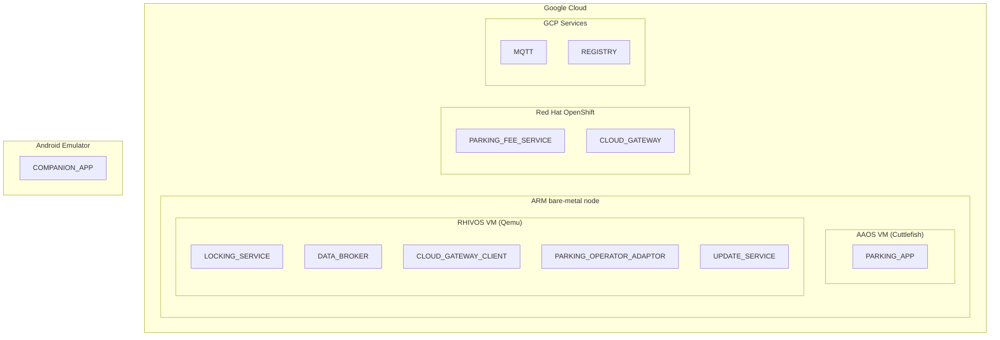
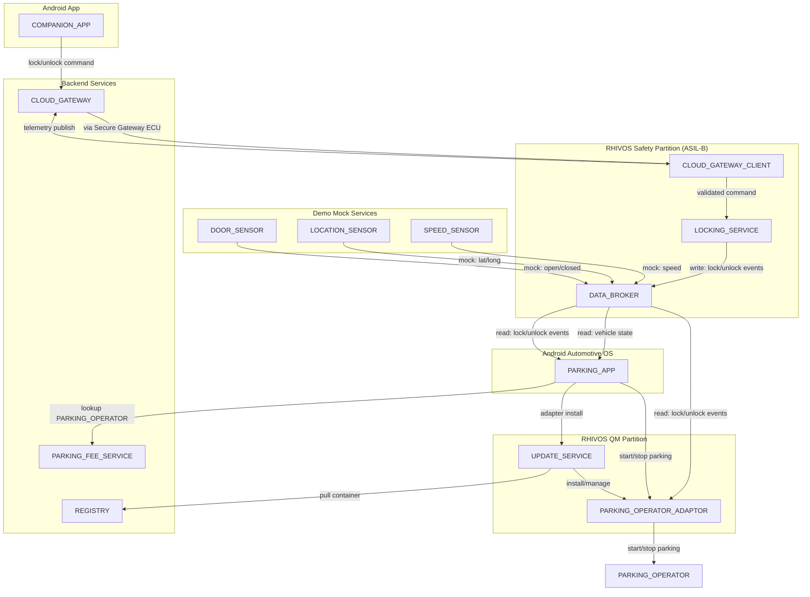

# Abstract

Modern vehicles require communication between safety-critical systems and non-critical applications. This demo shows a working implementation where an On-board parking payment service (Android Automotive OS App) communicates with an ASIL-B door locking service running on Red Hat In-Vehicle OS (RHIVOS). The scenario is realistic: automatic parking fee payment starts when the vehicle locks and stops when it unlocks, requiring cross-domain communication between a QM-level Android application and a safety-relevant locking system.

The architecture spans multiple domains: Android IVI for user interaction, RHIVOS safety partition for door locking (ASIL-B), RHIVOS QM partition for cloud connectivity and access to backend-services deployed in Google Cloud. Development uses Red Hat OpenShift for Cloud Development Environments (CDE) and CI/CD pipelines (also deployed on Google Cloud).

The demo addresses another challenge: how to dynamically provision location-specific services without preloading every possible integration. Parking operators vary by location (city, country), making static deployment impractical. Our implementation uses containerized adapters that download on-demand based on vehicle location, run during the parking session, and offload when unused for some time. This "feature-on-demand" pattern demonstrates how OEMs can enable new services post-production and create additional revenue opportunities through software monetization.

Attendees will see functioning code demonstrating practical mixed-criticality integration patterns, container deployment to vehicles, and cloud-native SDV development workflows across multiple domains (Android Automotive, Safe Linux/RHIVOS, Cloud-native services).

## User Journey

1. Vehicle Arrival: User parks their vehicle at a designated parking spot in a participating zone.
2. Automatic Location Detection: The vehicle's onboard system detects its current location and queries the cloud service to identify the appropriate parking operator adapter for that zone.
3. Adapter Provisioning: The parking oerator adapter specific to that location (e.g., municipal parking authority, private operator) downloads and initializes automatically on the vehicle's system.
4. Parking Session Confirmation: The infotainment (IVI) screen displays: "Parking active - €X.XX/hr" confirming the session has been established and showing the applicable rate.
5. Session Start: User locks the vehicle with their key fob or the car's companion app. This is handled by a door lock service, which publishes the event on the internal message bus. The parking app subscribes to this event and automatically initiate the parking payment session. No physical ticket or app interaction required.
6. Session End: User unlocks the vehicle upon return, automatically stopping the parking session. Payment is processed seamlessly based on actual duration.
7. Resource Management: If the adapter remains unused for 24 hours (vehicle hasn't returned to that parking zone), it's automatically offloaded to optimize storage and system resources.

## Problem Statement

Parking regulations and payment systems vary significantly by location and PARKING_OPERATOR. Pre-loading the car with all possible PARKING_OPERATOR integrations is impractical due to the dynamic nature of operators and their location-specific requirements. 

The car's PARKING_APP uses location data to find a suitable PARKING_OPERATOR by querying a cloud-based PARKING_FEE_SERVICE. The PARKING_FEE_SERVICE needs a flexible solution to support diverse PARKING_OPERATORs and PARKING_METER systems (physical meters, app-based, pay-by-plate, etc.).

Solution: Dynamic PARKING_OPERATOR_ADAPTORS

The PARKING_APP will utilize flexible PARKING_OPERATOR_ADAPTORS that are loaded into the car on demand. These adaptors will interface with both the car's PARKING_APP and the PARKING_OPERATOR they belong to. The PARKING_FEE_SERVICE acts as a "trusted source" for these PARKING_OPERATOR_ADAPTORS by offering a validated PARKING_OPERATOR_ADAPTORS to the PARKING_APP. Unused adaptors can be offloaded to free up resources on the car, after a certain amount of time.

### Objectives and Benefits

- To enable automatic parking fee payment via the car's IVI system.
- To eliminate the need for car owners to use multiple, dedicated parking apps.
- To orchestrate interactions with various PARKING_OPERATORs on the user's behalf.
- To provide a flexible and adaptable solution for diverse parking environments.

## Architecture Overview

### Component Placement

1. **Android IVI (QM)**: In-car user interface for the parking app
2. **RHIVOS QM Partition**: Dynamic parking operator adapters (containers)
3. **RHIVOS Safety Partition**: ASIL-B door lock service + vehicle signals
4. **Cloud (OpenShift)**: Parking operator adapter registry, parking fee service, CDE, CI/CD for development and validation
5. **Mobile Companion App**: Typical Android app (optional: iOS)

### Mixed-Criticality Communication Pattern

- ASIL-B services publish safety-relevant events (door lock/unlock)
- QM adapters subscribe to events (read-only access)
- Isolation enforced by RHIVOS partitioning + hypervisor

### Development Workflow (Primary Demo Focus)

1. Develop ASIL-B service with RHAS  tooling (development, validation, tracing)
2. Develop QM adapter as OCI container
3. All apps and services are developed on OpenShift Dev Spaces or in local IDE
4. All build processes use OpenShift pipelines

### Simplified Implementation (Demo Scope)

- Mock payment processing (no real transactions)
- Generic adapter type (demonstrate pattern, not all operators)
- Simulated location (GPS optional)
- Pre-signed adapters (simplified trust chain)
- Bare-minimum UIX for the Android apps

## Demo Scenarios

### Scenario 1: Happy Path (5 minutes)

1. Show AAOS IVI with parking app
2. Set mock location to Demo Zone
3. Adapter downloads automatically
4. Lock via companion app
5. Show parking session active on IVI
6. Unlock via companion app
7. Show parking fee calculated

### Scenario 2: Adapter Already Installed (2 minutes)

- Return to same zone, no download needed

### Scenario 3: Error Handling (3 minutes)

- Simulate registry unavailable
- Show retry logic and error messages
- Show error capturing in the telemetry stack (optional, future)

## Components

### RHIVOS

#### QM-Partition

##### PARKING_OPERATOR_ADAPTOR

- Containerized application running in the RHIVOS QM partition
- Implements a common interface towards the PARKING_APP
- Implements a proprietary interface towards its PARKING_OPERATOR

#### UPDATE_SERVICE

- Manages containerized adapter lifecycle in RHIVOS QM partition
- Pulls containers from REGISTRY on demand
- Handles installation, updates, and automatic offloading of unused adapters

#### Safety-Partition

##### LOCKING_SERVICE

- Runs in the RHIVOS safety-partition
- Interacts with actors that can initiate locking/unlocking of the car (e.g., key fob, COMPANION_APP)
- Validates safety constraints (e.g., vehicle velocity, door ajar status) before executing lock/unlock commands
- Note: For this demo, focuses on stationary vehicle scenarios where velocity checks are trivial

##### DATA_BROKER

- Eclipse Kuksa Databroker running in RHIVOS safety partition
- VSS-compliant gRPC pub/sub interface for vehicle signals
- Manages signal state and enforces read/write access control

##### CLOUD_GATEWAY_CLIENT

- Maintains secure connection to CloudGateway (MQTT/WebSocket over TLS)
- Receives authenticated lock/unlock commands from CompanionApp via cloud
- Validates command structure and authentication tokens
- Forwards validated commands to LOCKING_SERVICE
- Publishes vehicle telemetry (location, door status, parking state) to cloud
- Subscribes to DATA_BROKER for current vehicle state

### Backend Services

#### PARKING_FEE_SERVICE

- Cloud-based service providing:
  - REST API for parking session management
  - Manages/owns the OCI Container Registry (REGISTRY) for validated PARKING_OPERATOR_ADAPTORs
  - Operator validation and approval workflow (out-of-scope)

#### REGISTRY

- OCI Container Registry managed by PARKING_FEE_SERVICE operator
- Stores validated and signed PARKING_OPERATOR_ADAPTORs

#### CLOUD_GATEWAY

- Cloud-based MQTT broker for vehicle-to-cloud connectivity
- Authenticates vehicles and COMPANION_APPs
- Routes commands between mobile apps and vehicles
- Aggregates telemetry for fleet operations (optional, later phase)
- Deployed on Google Cloud infrastructure

### AAOS

#### PARKING_APP

- Android Automotive OS application running in the vehicle's IVI
- Provides user interface for parking sessions
- Queries PARKING_FEE_SERVICE for available operators
- Triggers adapter downloads
- Displays session status to the driver


### Android

#### COMPANION_APP

- Mobile app (Android, iOS)
- Allows querying the car's state
- Issues commands to the car remotely (e.g., locking/unlocking)

**Note**: In production deployments, cloud connectivity typically resides in a separate TCU or QM partition. 
For this demo, we consolidate CloudGatewayClient into the safety partition to simplify the command path and focus on 
mixed-criticality application development rather than network architecture.

### Mock-Service

#### LOCATION_SENSOR

- sends mock location data
- VSS Vehicle.CurrentLocation.Latitude
- VSS Vehicle.CurrentLocation.Longitude

#### SPEED_SENSOR

- sends mock velocity data
- VSS Vehicle.Speed

#### DOOR_SENSOR

- sends mock door openclosed data
- VSS Vehicle.Cabin.Door.Row1.DriverSide.IsOpen

#### PARKING_OPERATOR

- receives start/stop parking event from PARKING_OPERATOR_ADAPTOR

### Deployment Architecture

Since the scope of the demo is primarily on the development workflow and virtual testing, the following deployment architecture is used:



## Communication

### Component Architecture



### Communication Protocols

| Source Component         | Target Component         | Protocol       | Direction          |
| ------------------------ | -------------------------| -------------- | ------------------ |
| LOCKING_SERVICE          | DATA_BROKER              | gRPC           | Write              |
| LOCKING_SERVICE          | CLOUD_GATEWAY_CLIENT     | gRPC           | Read               |
| PARKING_APP              | DATA_BROKER              | Network gRPC   | Read               |
| PARKING_APP              | UPDATE_SERVICE           | Network gRPC   | Request/Response   |
| PARKING_APP              | PARKING_OPERATOR_ADAPTOR | Network gRPC   | Request/Response   |
| PARKING_APP              | PARKING_FEE_SERVICE      | HTTPS/REST     | Request/Response   |
| UPDATE_SERVICE           | REGISTRY                 | HTTPS/OCI      | Pull only          |
| PARKING_OPERATOR_ADAPTOR | DATA_BROKER              | Network gRPC   | Read               |
| PARKING_OPERATOR_ADAPTOR | PARKING_OPERATOR         | HTTPS/REST     | Request/Response   |
| COMPANION_APP            | CLOUD_GATEWAY            | HTTPS/REST     | Request/Response   |
| CLOUD_GATEWAY_CLIENT     | CLOUD_GATEWAY            | MQTT over TLS  | Bidirectional      |

**Note:** All gRPC services use Unix Domain Sockets for local communication and TCP/IP, HTTP/2 over TLS for network communication,
 if components communicate across doamins (e.g. AAOS to RHIVOS). gRPC Benefits for this architecture:

1. **Consistency**: All local IPC uses gRPC (DATA_BROKER, UPDATE_SERVICE)
2. **Language Agnostic**: Kotlin (AAOS) ↔ Rust (RHIVOS) seamlessly
3. **Type Safety**: Protocol buffers provide strong typing
4. **Streaming**: Native support for watching adapter state changes
5. **Performance**: Binary protocol, efficient serialization
6. **Tooling**: Excellent debugging tools (`grpcurl`, Postman, Wireshark)
7. **Modern**: Industry-standard, well-documented, actively maintained

### VSS Signals used

Base on Covesa VSS, version 5.1.

- Vehicle.Cabin.Door.Row1.DriverSide.IsLocked (bool) - lock/unlock events
- Vehicle.Cabin.Door.Row1.DriverSide.IsOpen (bool) - to detect if door is ajar
- Vehicle.CurrentLocation.Latitude (double) - for zone detection 
- Vehicle.CurrentLocation.Longitude (double) - for zone detection
- Vehicle.Speed (float) - For safety validation (optional) 
- Custom: Vehicle.Parking.SessionActive (bool) - Adapter-managed parking state

## Message Flows

### Flow 1: Parking Session Start

```
1. LOCKING_SERVICE → DATA_BROKER (gRPC)
   SetRequest(Vehicle.Cabin.Door.Row1.DriverSide.IsLocked = true)

2. DATA_BROKER → PARKING_OPERATOR_ADAPTOR (gRPC subscription stream)
   SubscribeResponse(IsLocked = true, timestamp = T)

3. PARKING_OPERATOR_ADAPTOR → PARKING_OPERATOR (REST)
   POST /parking/start
   {vehicle_id, zone_id, timestamp}

4. PARKING_OPERATOR → PARKING_OPERATOR_ADAPTOR (REST)
   200 OK {session_id, status}

5. PARKING_OPERATOR_ADAPTOR → DATA_BROKER (gRPC)
   SetRequest(Vehicle.Parking.SessionActive = true)

6. DATA_BROKER → PARKING_APP (gRPC subscription stream)
   SubscribeResponse(SessionActive = true)
```

### Flow 2: Remote Unlock via Companion App

```
1. COMPANION_APP → CLOUD_GATEWAY (MQTT)
   PUBLISH vehicles/VIN12345/commands
   {type: "unlock", doors: ["driver"]}

2. CLOUD_GATEWAY → CLOUD_GATEWAY_CLIENT (MQTT)
   Message delivery

3. CLOUD_GATEWAY_CLIENT validates command signature/token

4. CLOUD_GATEWAY_CLIENT → LOCKING_SERVICE
   (Internal function call in RHIVOS)
   ExecuteUnlock(door=driver)

5. LOCKING_SERVICE → DATA_BROKER (gRPC)
   SetRequest(IsLocked = false)

6. CLOUD_GATEWAY_CLIENT → CLOUD_GATEWAY (MQTT)
   PUBLISH vehicles/VIN12345/command_responses
   {command_id, status: "success"}

7. CLOUD_GATEWAY → COMPANION_APP (MQTT)
   Delivery notification
```

### Flow 3: Adapter Download & Installation

```
1. PARKING_APP → UPDATE_SERVICE (gRPC)
   InstallAdapter(image_ref, checksum)
   → Returns InstallAdapterResponse{job_id, adapter_id, state=DOWNLOADING}

2. PARKING_APP starts watching adapter states (gRPC stream)
   WatchAdapterStates() → stream of AdapterStateEvent

3. UPDATE_SERVICE → REGISTRY (HTTPS/OCI)
   GET /v2/adapters/demo-operator/manifests/v1.0
   → Returns manifest

4. UPDATE_SERVICE → REGISTRY (HTTPS/OCI)
   GET /v2/adapters/demo-operator/blobs/{digest}
   → Returns container layers (streaming)

5. UPDATE_SERVICE verifies checksum
   → State: DOWNLOADING → INSTALLING

6. UPDATE_SERVICE extracts container to /var/lib/containers/adapters/

7. UPDATE_SERVICE starts container via podman/crun
   → State: INSTALLING → RUNNING

8. UPDATE_SERVICE → PARKING_APP (gRPC stream)
   AdapterStateEvent{
     adapter_id, 
     old_state=INSTALLING, 
     new_state=RUNNING
   }

9. PARKING_OPERATOR_ADAPTOR initializes
   - Subscribes to DATA_BROKER for lock events (gRPC)
   - Reads current location from DATA_BROKER (gRPC)
   - Ready for parking sessions
```

## Error Handling

### gRPC Error Response Format

```
// Standard gRPC status codes used:
// - OK (0): Success
// - CANCELLED (1): Operation cancelled
// - UNKNOWN (2): Unknown error
// - INVALID_ARGUMENT (3): Invalid request
// - DEADLINE_EXCEEDED (4): Timeout
// - NOT_FOUND (5): Adapter/resource not found
// - ALREADY_EXISTS (6): Adapter already installed
// - PERMISSION_DENIED (7): Insufficient permissions
// - RESOURCE_EXHAUSTED (8): Out of storage/memory
// - FAILED_PRECONDITION (9): System not ready
// - UNAVAILABLE (14): Service temporarily unavailable
// - INTERNAL (13): Internal server error

// Example error details in response metadata:
message ErrorDetails {
  string code = 1;          // "ADAPTER_DOWNLOAD_FAILED"
  string message = 2;       // "Failed to pull container image"
  map<string, string> details = 3;  // Additional context
  int64 timestamp = 4;      // Unix timestamp
}
```

## Development Plan

The following tech stacks are used to develop the various components.

### Implementation

- RHIVOS services: Rust
- Android Automotive OS app: Kotlin
- Android app: Flutter/Dart
- Backend-services: Golang

### Infrastructure and Tooling

- Local development: VS Code based IDE (e.g Cursor), with Android and Flutter extensions installed.
- Local infrastructure: Podman to build and serve containers, containerized MQTT broker (e.g. Eclipse Mosquitto) to simulate the MQTT communication.
- Cloud Development: OpenShift Dev Spaces, with Android and Flutter extensions installed in the Dev Spaces container.
- OpenShift Automotive Suite (RHAS): OpenShift cluster on Google Cloud, with Jumpstarter and Builder operator installed to build and validate RHIVOS images.
- Google Compute Engine: ARM bare-metal instance to run Red Hat Jumpstarter exporters and Android Cuttlefish.
- Google Artifact Registry: OCI compliant container registry to store the PARKING_OPERATOR_ADAPTOR container images.

### Code Repositories

- [rhadp/parking-fee-service](https://github.com/rhadp/parking-fee-service): The monorepo used for all components.

### Development Phases

Developing the demo happens in multiple phases. The first iterations SHOULD happen locally, until a first MVP state is reached.
Once sufficient functionallity is in place, create end-to-end pipelines for e.g. nightly builds and continuous deployment. 
At this point, local and cloud-based development shoult be interchangeable.

#### Phase 1: Planing and Setup

##### Phase 1.1: Requirements Engineering

- Iterate over PRD.md (this document) and translate the "products requirements" into a requirements document.
- Decompose the requirements document into a design document.
- Create steering documents for agents based on the design.
- Create a task list of atomic implementation steps.

##### Phase 1.2: Setup

- Setup the code repo, with dedicated sub-folders for each type of code:
  - RHIVOS services: Rust
  - Android Automotive OS app: Kotlin
  - Android app: Flutter, Dart
  - Backend-services: Golang
- Create skeleton implementations for each component
- Create local build capabilities for each toolchain using make/cmake etc
- Setup local infrastructure, used for local unit and integration testing
- Setup local unit and integration testing capabilites

#### Phase 2: Implementation

##### Phase 2.1: RHIVOS Safety Partition

- Implementation of the ASIL-B services:
  - CLOUD_GATEWAY_CLIENT
  - LOCKING_SERVICE
  - DATA_BROKER
  - Demo Mock Services to test the above services

##### Phase 2.2: Vehicle-to-Cloud Connectivity

- Implementation of the V2X connectivity:
  - CLOUD_GATEWAY
  - Mock COMPANION_APP service to test the CLOUD_GATEWAY without the COMPANION_APP
  - Integration test of bi-directional CLOUD_GATEWAY - CLOUD_GATEWAY_CLIENT communication

##### Phase 2.3: RHIVOS QM Partition

- Implementation of the RHIVOS QM services
  - generic PARKING_OPERATOR_ADAPTOR
  - UPDATE_SERVICE
  - Mock PARKING_OPERATOR to test the PARKING_OPERATOR_ADAPTOR
  - Mock PARKING_APP to test the UPDATE_SERVICE without the PARKING_APP
  - Integration test of DATA_BROKER to PARKING_OPERATOR_ADAPTOR communication

#### Phase 2.4: Parking app

- Implementation of the PARKING_FEE_SERVICE
- Implementation of the PARKING_APP app
- Integration test of PARKING_APP, PARKING_FEE_SERVICE, UPDATE_SERVICE communication
- Integration test of PARKING_APP, PARKING_OPERATOR_ADAPTOR communication

##### Phase 2.5: Companion App

- Implementation of the COMPANION_APP app

#### Phase 3: Integration

##### Phase 3.1: Cloud CI/CD setup

- Create CI/CD pipelines for a cloud-based (on OpenShift) build of all components, including the Android apps
- Dploymentment of all non-Android components to OpenShift, for end-to-end integration testing (Software-in-the-loop testing)

#### Phase 3.2: Virtual validation

- Create CI/CD pipelines for RHIVOS image builds
- Deployment of RHIVOS image to a "virtual device" (Qemu VM)
- Deploment of the PARKING_APP to a "virtual device" (Cuttlefish)

#### Phase 4: Final Demo Scenario Validation

- Verify that all three demo scenarios work end-to-end

## Out-of-Scope

In order to keep the scope of the demo in check, the following aspects are out-of-scope:

- Real payment processing
- Authentication/authorization beyond basic tokens
- Multi-user scenarios
- Edge cases (e.g., network failures during parking session)
- Production-grade security/encryption
- Real GPS or other hardware integration

## References

- [Standalone MQTT broker architecture on Google Cloud](https://docs.cloud.google.com/architecture/connected-devices/mqtt-broker-architecture)
- [Eclipse Mosquitto](https://mosquitto.org)
