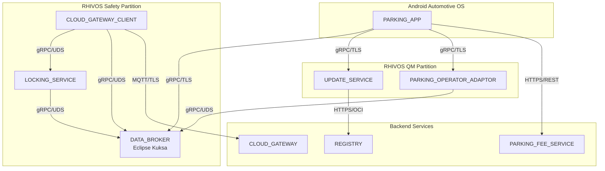

# SDV Parking Demo System

A Software-Defined Vehicle (SDV) demonstration showcasing mixed-criticality communication between Android Automotive OS applications and ASIL-B safety services running on Red Hat In-Vehicle OS (RHIVOS).

## Overview

This project demonstrates automatic parking fee payment where the parking session starts when the vehicle locks and stops when it unlocks. The architecture spans multiple domains:

- **Android IVI (QM)**: In-car user interface for the parking app
- **RHIVOS Safety Partition (ASIL-B)**: Door locking service and vehicle signals
- **RHIVOS QM Partition**: Dynamic parking operator adapters (containers)
- **Cloud Backend**: Parking fee service and adapter registry

The system uses containerized adapters that download on-demand based on vehicle location, demonstrating a "feature-on-demand" pattern for post-production service enablement.

## Architecture



## Project Structure

```
parking-fee-service/
├── rhivos/                    # Rust services for RHIVOS
│   ├── locking-service/       # ASIL-B door locking (safety partition)
│   ├── cloud-gateway-client/  # MQTT client (safety partition)
│   ├── parking-operator-adaptor/  # Dynamic adapter (QM partition)
│   ├── update-service/        # Container lifecycle (QM partition)
│   └── shared/                # Shared Rust libraries
├── android/
│   ├── parking-app/           # Kotlin AAOS application
│   └── companion_app/         # Flutter/Dart mobile app
├── backend/
│   ├── parking-fee-service/   # Go service for parking operations
│   └── cloud-gateway/         # Go MQTT broker/router
├── proto/                     # Shared Protocol Buffer definitions
├── containers/                # Containerfiles for building images
├── infra/                     # Local development infrastructure
├── scripts/                   # Build and utility scripts
├── docs/                      # Documentation
└── tests/                     # Property-based and integration tests
```

## Quick Start

### Prerequisites

- **Rust** 1.70+ with cargo
- **Go** 1.21+
- **Protocol Buffers** compiler (protoc)
- **Podman** or Docker for container builds
- **Flutter** 3.x for companion app
- **Android Studio** with Kotlin support for parking app

### Clone and Build

```bash
# Clone the repository
git clone https://github.com/rhadp/parking-fee-service.git
cd parking-fee-service

# Generate Protocol Buffer bindings
make proto

# Build all components
make build

# Run tests
make test
```

### Start Local Infrastructure

```bash
# Start local development services (Mosquitto, Kuksa Databroker)
make infra-up

# Verify services are running
make infra-status

# Stop infrastructure when done
make infra-down
```

### Build Containers

```bash
# Build all container images
make build-containers

# Build specific service
make build-rhivos
make build-backend
```

## Communication Protocols

| Source | Target | Protocol | Description |
|--------|--------|----------|-------------|
| PARKING_APP | DATA_BROKER | gRPC/TLS | Read vehicle signals |
| PARKING_APP | UPDATE_SERVICE | gRPC/TLS | Adapter lifecycle |
| PARKING_APP | PARKING_FEE_SERVICE | HTTPS/REST | Parking operations |
| LOCKING_SERVICE | DATA_BROKER | gRPC/UDS | Write lock events |
| CLOUD_GATEWAY_CLIENT | CLOUD_GATEWAY | MQTT/TLS | Vehicle-to-cloud |
| UPDATE_SERVICE | REGISTRY | HTTPS/OCI | Pull adapters |

## Development Guides

- [Rust Development Setup](docs/setup-rust.md)
- [Android/Kotlin Development Setup](docs/setup-android.md)
- [Flutter/Dart Development Setup](docs/setup-flutter.md)
- [Go Development Setup](docs/setup-go.md)
- [Local Infrastructure Guide](docs/local-infrastructure.md)

## Demo Scenarios

### Scenario 1: Happy Path
1. Vehicle arrives at parking zone
2. Adapter downloads automatically based on location
3. User locks vehicle → parking session starts
4. User unlocks vehicle → session ends, fee calculated

### Scenario 2: Adapter Already Installed
- Return to same zone, no download needed

### Scenario 3: Error Handling
- Simulated registry unavailability with retry logic

## License

See [LICENSE](LICENSE) for details.
