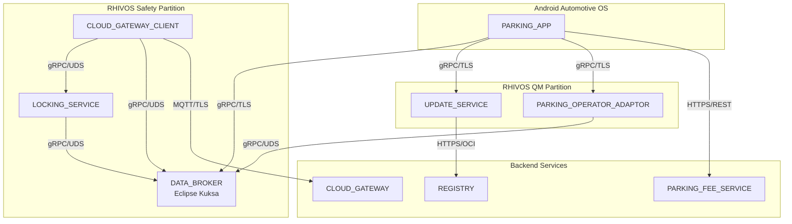

# SDV Parking Demo System

A Software-Defined Vehicle (SDV) demonstration showcasing mixed-criticality communication between Android Automotive OS applications and ASIL-B safety services running on Red Hat In-Vehicle OS (RHIVOS).

## Overview

This project demonstrates automatic parking fee payment where the parking session starts when the vehicle locks and stops when it unlocks. The architecture spans multiple domains:

- **Android IVI (QM)**: In-car user interface for the parking app
- **RHIVOS Safety Partition (ASIL-B)**: Door locking service and vehicle signals
- **RHIVOS QM Partition**: Dynamic parking operator adapters (containers)
- **Cloud Backend**: Parking fee service and adapter registry

The system uses containerized adapters that download on-demand based on vehicle location, demonstrating a "feature-on-demand" pattern for post-production service enablement.

## Architecture



## Project Structure

```
parking-fee-service/
├── Makefile                        # Root build orchestrator
├── rhivos/                         # Rust services for RHIVOS
│   ├── Cargo.toml                  # Workspace manifest
│   ├── parking-proto/              # Shared proto bindings crate
│   ├── locking-service/            # ASIL-B door locking (safety partition)
│   ├── cloud-gateway-client/       # MQTT client (safety partition)
│   ├── parking-operator-adaptor/   # Dynamic adapter (QM partition)
│   └── update-service/             # Container lifecycle (QM partition)
├── backend/
│   ├── parking-fee-service/        # Go REST service for parking operations
│   └── cloud-gateway/              # Go REST gateway for vehicle-to-cloud
├── mock/
│   ├── parking-app-cli/            # Go CLI simulating Android parking app
│   ├── companion-app-cli/          # Go CLI simulating companion mobile app
│   └── sensors/                    # Rust CLI for mock VSS sensor data
├── android/
│   ├── parking-app/                # AAOS application (placeholder)
│   └── companion-app/              # Mobile companion app (placeholder)
├── proto/                          # Shared Protocol Buffer definitions
│   ├── common/                     # Shared message types
│   ├── services/                   # Service interface definitions
│   └── gen/go/                     # Generated Go proto packages
├── containers/                     # Containerfiles for OCI images
│   ├── rhivos/                     # Rust service containers
│   ├── backend/                    # Go service containers
│   └── mock/                       # Mock tool containers
├── infra/                          # Local development infrastructure
│   ├── compose.yaml                # Podman/Docker Compose for Kuksa + Mosquitto
│   └── config/                     # Service configuration files
├── scripts/                        # Build and utility scripts
├── docs/                           # Documentation
└── tests/                          # Verification test scripts
```

## Quick Start

### Prerequisites

- **Rust** 1.75+ with cargo
- **Go** 1.22+
- **Protocol Buffers** compiler (`protoc` 3.x+)
- **protoc-gen-go** and **protoc-gen-go-grpc** (Go proto plugins)
- **Podman** (preferred) or Docker for containers and local infrastructure

Verify all tools are installed:

```bash
./scripts/check-tools.sh
```

### Clone and Build

```bash
# Clone the repository
git clone https://github.com/rhadp/parking-fee-service.git
cd parking-fee-service

# Generate Protocol Buffer Go bindings
make proto

# Build all components (Rust + Go)
make build

# Run all tests
make test

# Run linters (clippy for Rust, go vet for Go)
make lint
```

### Start Local Infrastructure

Local development uses Eclipse Kuksa Databroker (VSS signal broker) and Eclipse Mosquitto (MQTT broker):

```bash
# Start local development services
make infra-up

# Verify services are running
make infra-status

# Stop infrastructure when done
make infra-down
```

| Service | Port | Protocol |
|---------|------|----------|
| Kuksa Databroker | 55555 | gRPC |
| Mosquitto | 1883 | MQTT |

### Build Container Images

```bash
# Build all container images
make build-containers
```

### Clean Build Artifacts

```bash
# Remove all build artifacts (Rust, Go, generated proto files)
make clean
```

## Makefile Targets

| Target | Description |
|--------|-------------|
| `make build` | Build all Rust and Go components |
| `make test` | Run all unit tests across Rust and Go |
| `make lint` | Run linters (clippy for Rust, go vet for Go) |
| `make proto` | Generate Go proto bindings from `.proto` files |
| `make clean` | Remove all build artifacts |
| `make infra-up` | Start local Kuksa Databroker and Mosquitto |
| `make infra-down` | Stop and remove infrastructure containers |
| `make infra-status` | Show infrastructure container status |
| `make test-e2e` | Run cloud connectivity E2E tests (requires `make infra-up`) |
| `make test-parking-e2e` | Run QM partition parking E2E tests (requires `make infra-up`) |
| `make test-zone-discovery-e2e` | Run zone discovery E2E tests for PARKING_FEE_SERVICE |
| `make build-containers` | Build OCI container images for all services |
| `make check-tools` | Verify all required development tools are installed |

## Service Ports (Local Development)

| Service | Port | Protocol |
|---------|------|----------|
| locking-service | — | Kuksa client (no listening port) |
| cloud-gateway-client | — | Kuksa/MQTT client (no listening port) |
| update-service | 50053 | gRPC |
| parking-operator-adaptor | 50054 | gRPC |
| parking-fee-service | 8080 | HTTP/REST |
| cloud-gateway | 8081 | HTTP/REST |
| mock parking-operator | 8082 | HTTP/REST |
| Kuksa Databroker (infra) | 55555 | gRPC |
| Mosquitto (infra) | 1883 | MQTT |

## Mock CLI Tools

Mock CLI applications are provided for integration testing without real Android builds.

### parking-app-cli

Simulates the Android parking app, calling gRPC and REST services:

```bash
parking-app-cli [flags] <command>

Commands (UpdateService — gRPC):
  install-adapter   Call UpdateService.InstallAdapter
  list-adapters     Call UpdateService.ListAdapters
  remove-adapter    Call UpdateService.RemoveAdapter
  adapter-status    Call UpdateService.GetAdapterStatus
  watch-adapters    Call UpdateService.WatchAdapterStates (streaming)

Commands (ParkingAdapter — gRPC):
  start-session     Call ParkingAdapter.StartSession
  stop-session      Call ParkingAdapter.StopSession
  get-status        Call ParkingAdapter.GetStatus
  get-rate          Call ParkingAdapter.GetRate

Commands (PARKING_FEE_SERVICE — REST):
  lookup-zones      Look up parking zones by GPS coordinates
  zone-info         Get full details for a parking zone
  adapter-info      Get adapter container metadata for a zone

Flags:
  --update-service-addr        Address of UpdateService (default: localhost:50053)
  --adapter-addr               Address of ParkingAdapter (default: localhost:50054)
  --parking-fee-service-addr   Address of PARKING_FEE_SERVICE (default: http://localhost:8080)
```

See [docs/parking-fee-service-api.md](docs/parking-fee-service-api.md) for the
REST API documentation and [docs/zone-discovery.md](docs/zone-discovery.md) for
the zone discovery workflow.

### mock parking-operator

Simulates a parking operator REST backend for testing the PARKING_OPERATOR_ADAPTOR:

```bash
mock/parking-operator/parking-operator [flags]

Flags:
  -listen-addr    Address to listen on (default: :8082)
  -rate-type      Rate type: per_minute or flat (default: per_minute)
  -rate-amount    Rate amount per unit (default: 0.05)
  -currency       Currency code (default: EUR)
  -zone-id        Zone identifier (default: zone-1)
```

See [docs/parking-operator-api.md](docs/parking-operator-api.md) for the full
REST API documentation.

### companion-app-cli

Simulates the companion mobile app, calling REST endpoints:

```bash
companion-app-cli [flags] <command>

Commands:
  pair     POST /api/v1/pair — pair with vehicle using VIN and PIN
  lock     POST /api/v1/vehicles/{vin}/lock — lock the vehicle
  unlock   POST /api/v1/vehicles/{vin}/unlock — unlock the vehicle
  status   GET  /api/v1/vehicles/{vin}/status — query vehicle state

Flags:
  --gateway-addr   Address of CloudGateway (default: http://localhost:8081)
  --vin            Vehicle VIN (required)
  --token          Bearer token (required for lock/unlock/status)
  --pin            Pairing PIN (required for pair)
```

See [docs/vehicle-pairing.md](docs/vehicle-pairing.md) for the full pairing
workflow.

### mock-sensors

Publishes mock VSS sensor data to Kuksa Databroker:

```bash
mock-sensors [flags] <command>

Commands:
  set-location <lat> <lon>     Set Vehicle.CurrentLocation.{Latitude,Longitude}
  set-speed <km/h>             Set Vehicle.Speed
  set-door <open|closed>       Set Vehicle.Cabin.Door.Row1.DriverSide.IsOpen
  lock-command <lock|unlock>   Set Vehicle.Command.Door.Lock

Flags:
  --databroker-addr   Address of Kuksa Databroker (default: http://localhost:55555)
```

## Communication Protocols

| Source | Target | Protocol | Description |
|--------|--------|----------|-------------|
| PARKING_APP | DATA_BROKER | gRPC/TLS | Read vehicle signals |
| PARKING_APP | UPDATE_SERVICE | gRPC/TLS | Adapter lifecycle |
| PARKING_APP | PARKING_FEE_SERVICE | HTTPS/REST | Zone lookup and adapter discovery |
| LOCKING_SERVICE | DATA_BROKER | gRPC/UDS | Write lock events |
| CLOUD_GATEWAY_CLIENT | CLOUD_GATEWAY | MQTT/TLS | Vehicle-to-cloud |
| UPDATE_SERVICE | REGISTRY | HTTPS/OCI | Pull adapters |

## Proto Definitions

The `proto/` directory contains shared Protocol Buffer definitions:

- **`common/common.proto`** — Shared message types: `Location`, `VehicleId`, `AdapterInfo`, `AdapterState`, `ErrorDetails`
- **`services/update_service.proto`** — UpdateService gRPC interface (adapter lifecycle)
- **`services/parking_adapter.proto`** — ParkingAdapter gRPC interface (parking sessions)

Generated Go bindings are committed under `proto/gen/go/`. Rust bindings are generated at build time via `tonic-build` in `rhivos/parking-proto/`.

## Current Status

| Service | Status | Description |
|---------|--------|-------------|
| locking-service | **Implemented** | Safety-validated lock/unlock via Kuksa Databroker |
| mock-sensors | **Implemented** | CLI tool for publishing mock VSS signals |
| cloud-gateway-client | **Implemented** | MQTT-Kuksa bridge with command processing and telemetry |
| cloud-gateway | **Implemented** | REST API + MQTT gateway with pairing and auth |
| companion-app-cli | **Implemented** | CLI for pairing, lock/unlock, and status queries |
| update-service | **Implemented** | Container lifecycle manager with offloading |
| parking-operator-adaptor | **Implemented** | Event-driven parking session management |
| parking-app-cli | **Implemented** | gRPC CLI for adapter and session management |
| mock parking-operator | **Implemented** | Mock REST parking operator backend |
| parking-fee-service | **Implemented** | Zone lookup, adapter metadata REST API |

The **locking-service** subscribes to `Vehicle.Command.Door.Lock` via Kuksa Databroker, validates commands against vehicle speed and door state, and writes `IsLocked` and `LockResult` signals. See [docs/vss-signals.md](docs/vss-signals.md) for custom VSS signal definitions.

The **cloud-gateway** and **cloud-gateway-client** form the vehicle-to-cloud connectivity layer. The cloud-gateway exposes a REST API for companion apps and communicates with vehicles via MQTT. The cloud-gateway-client bridges MQTT commands to Kuksa DATA_BROKER signals and publishes telemetry. See [docs/mqtt-protocol.md](docs/mqtt-protocol.md) for MQTT topic and message documentation, and [docs/vehicle-pairing.md](docs/vehicle-pairing.md) for the pairing flow.

The **parking-operator-adaptor** subscribes to `IsLocked` events via Kuksa Databroker and automatically starts/stops parking sessions with the configured PARKING_OPERATOR. It also exposes a gRPC interface for manual session control and rate queries. See [docs/parking-operator-api.md](docs/parking-operator-api.md) for the mock operator's REST API.

The **update-service** manages adapter container lifecycle via podman, including installation, removal, state tracking, persistence, and automatic offloading of unused adapters. See [docs/adapter-lifecycle.md](docs/adapter-lifecycle.md) for the state machine, offloading behavior, and configuration.

The **parking-fee-service** provides a REST API for parking zone discovery and adapter metadata retrieval. It uses hardcoded Munich demo zones with geofence polygons and supports point-in-polygon and fuzzy radius (200m) location matching. See [docs/parking-fee-service-api.md](docs/parking-fee-service-api.md) for the REST API and [docs/zone-discovery.md](docs/zone-discovery.md) for the discovery workflow.

## License

See [LICENSE](LICENSE) for details.
