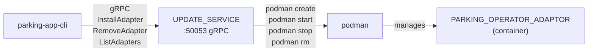
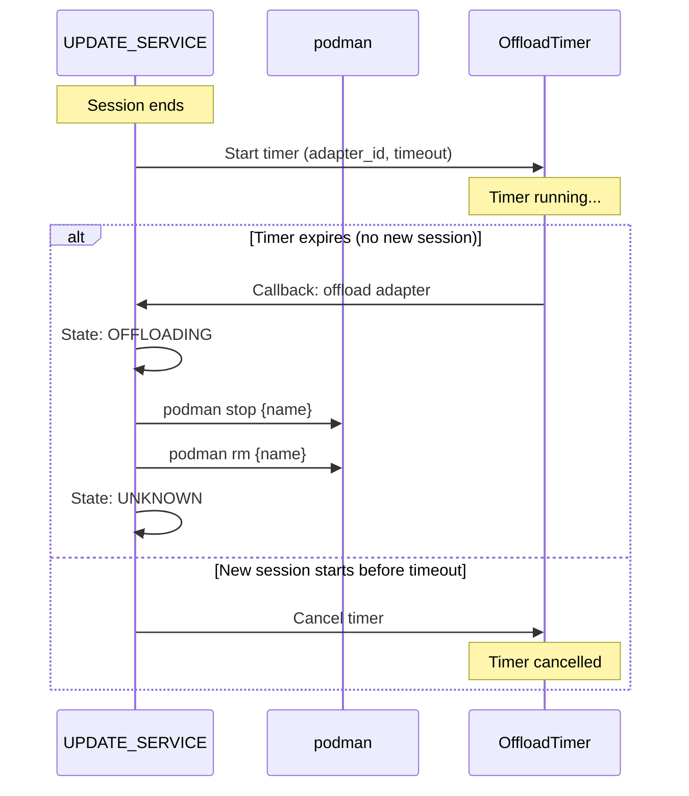

# Adapter Lifecycle and Offloading

This document describes the UPDATE_SERVICE's management of PARKING_OPERATOR_ADAPTOR
containers, including the adapter state machine, container lifecycle operations,
automatic offloading, and state persistence.

## Overview

The UPDATE_SERVICE manages parking operator adapter containers using podman. It
provides a gRPC interface for installing, monitoring, and removing adapters, and
automatically offloads unused adapters after a configurable period of inactivity.

## Architecture



## Adapter State Machine

Adapters follow a strict state machine with validated transitions (04-REQ-3.4):

```
Unknown ──► Installing ──► Running
                │              │
                ▼              ├──► Stopped ──► Installing
              Error ◄─────────┤
                │              └──► Offloading ──► Unknown
                └──► Installing
```

### States

| State | Description |
|-------|-------------|
| `Unknown` | Not installed or fully removed after offloading |
| `Installing` | Container is being created and started via podman |
| `Running` | Container is running and serving requests |
| `Stopped` | Container has been stopped and removed (via manual `RemoveAdapter`) |
| `Error(msg)` | An error occurred (e.g. podman create failed, image not found) |
| `Offloading` | Container is being removed due to inactivity timeout |

### Valid Transitions

| From | To | Trigger |
|------|----|---------|
| `Unknown` | `Installing` | `InstallAdapter` RPC called |
| `Installing` | `Running` | Container successfully created and started |
| `Installing` | `Error` | podman create or start failed |
| `Running` | `Stopped` | `RemoveAdapter` RPC called |
| `Running` | `Offloading` | Offload timer expired |
| `Running` | `Error` | Container crashed or unexpected error |
| `Offloading` | `Unknown` | Container successfully stopped and removed |
| `Error` | `Installing` | `InstallAdapter` RPC called (retry) |
| `Stopped` | `Installing` | `InstallAdapter` RPC called (re-install) |

Any other state transition is rejected with an `InvalidTransition` error. Self-
transitions (e.g. `Running` to `Running`) are not allowed.

## Container Lifecycle

### Install Adapter

When `InstallAdapter(image_ref, checksum)` is called:

1. If an adapter with the same image is already `Running`, return its info without
   creating a duplicate (04-REQ-3.E2).
2. Create a new `AdapterEntry` with state `Unknown`.
3. Transition to `Installing`.
4. Run `podman create` with the image reference, environment variables, and
   network configuration.
5. Run `podman start` to start the container.
6. On success: transition to `Running`.
7. On failure: transition to `Error` with the error message (04-REQ-3.E1).
8. Persist state to disk.
9. Return the `InstallAdapterResponse` with `adapter_id`, `job_id`, and `state`.

### Environment Variables

The UPDATE_SERVICE passes the following environment variables to adapter
containers (04-REQ-3.2):

| Variable | Description |
|----------|-------------|
| `DATABROKER_ADDR` | Kuksa Databroker address (e.g. `localhost:55555`) |
| `PARKING_OPERATOR_URL` | Parking operator REST URL (e.g. `http://localhost:8082`) |
| `ZONE_ID` | Parking zone identifier |
| `VEHICLE_VIN` | Vehicle VIN |
| `LISTEN_ADDR` | gRPC listen address for the adapter |

### Remove Adapter

When `RemoveAdapter(adapter_id)` is called:

1. If the adapter is not found, return gRPC `NOT_FOUND` (04-REQ-4.E2).
2. Run `podman stop` to stop the container.
3. Run `podman rm` to remove the container.
4. Transition to `Stopped`.
5. Cancel any active offload timer (04-REQ-5.E1).
6. Persist state to disk.

### Query Operations

- **`ListAdapters()`**: Returns all known adapters with their current state and
  info (04-REQ-4.4).
- **`GetAdapterStatus(adapter_id)`**: Returns a single adapter's info and state,
  or gRPC `NOT_FOUND` if unknown (04-REQ-4.5, 04-REQ-4.E1).
- **`WatchAdapterStates()`**: Server-streaming RPC that emits an
  `AdapterStateEvent` message for every state transition (04-REQ-4.3). Events are
  broadcast via a `tokio::sync::broadcast` channel.

## Automatic Offloading

Unused adapters are automatically removed after a configurable period of
inactivity to free system resources (04-REQ-5.1 through 04-REQ-5.4).

### How Offloading Works



### Timer Behavior

1. **Start timer**: When a parking session ends (or an adapter is installed
   without an active session), the offload timer starts counting down.
2. **Cancel on activity**: If a new session starts before the timer expires,
   the timer is cancelled (04-REQ-5.3).
3. **Timer expiry**: When the timer fires, the adapter transitions to
   `Offloading`, the container is stopped and removed, and the adapter
   transitions to `Unknown` (04-REQ-5.2).
4. **Manual removal**: If `RemoveAdapter` is called before the timer expires,
   the timer is cancelled and the adapter transitions to `Stopped` instead
   (04-REQ-5.E1).
5. **Replacement**: Starting a new timer for the same adapter cancels any
   existing timer.

### Configuration

The offload timeout is configurable via the `OFFLOAD_TIMEOUT` environment
variable or `--offload-timeout` CLI flag (04-REQ-5.4):

| Format | Example | Duration |
|--------|---------|----------|
| `<n>s` | `300s` | 300 seconds |
| `<n>m` | `5m` | 5 minutes |
| `<n>h` | `1h` | 1 hour |
| `<n>` | `300` | 300 seconds (plain number) |

Default: `5m` (5 minutes).

For integration tests, a short timeout like `5s` is used to avoid long waits.

## State Persistence

Adapter state is persisted to `{data_dir}/adapters.json` as a JSON array
(04-REQ-3.5). The file is automatically created and updated after every state
transition.

### File Format

```json
[
  {
    "adapter_id": "adapter-001",
    "image_ref": "localhost/parking-operator-adaptor:latest",
    "checksum": "sha256:abc123",
    "container_name": "poa-adapter-001",
    "state": {"status": "Running"},
    "config": {
      "databroker_addr": "localhost:55555",
      "parking_operator_url": "http://localhost:8082",
      "zone_id": "zone-1",
      "vehicle_vin": "DEMO0000000000001",
      "listen_addr": "0.0.0.0:50054"
    },
    "installed_at": 1708300800,
    "session_ended_at": null
  }
]
```

### Startup Reconciliation

On startup, the UPDATE_SERVICE (04-REQ-3.6):

1. Loads the persisted adapter entries from `{data_dir}/adapters.json`.
2. For each adapter in `Running` state, checks if the corresponding podman
   container is actually running via `podman inspect`.
3. If the container is not running (e.g. it was stopped externally), transitions
   the adapter to `Error` state.
4. Restarts offload timers for any adapters that have a `session_ended_at`
   timestamp.

If the persistence file does not exist, an empty adapter list is used.

## UPDATE_SERVICE Configuration

| Flag / Env Var | Default | Description |
|---------------|---------|-------------|
| `--listen-addr` / `LISTEN_ADDR` | `0.0.0.0:50053` | gRPC listen address |
| `--data-dir` / `DATA_DIR` | `./data` | Directory for state persistence |
| `--offload-timeout` / `OFFLOAD_TIMEOUT` | `5m` | Adapter inactivity timeout |

### Example

```bash
./rhivos/target/debug/update-service \
    --listen-addr 0.0.0.0:50053 \
    --data-dir ./data \
    --offload-timeout 5m
```

## Using the parking-app-cli

The `parking-app-cli` provides subcommands for all UPDATE_SERVICE operations:

```bash
# Install an adapter
parking-app-cli --update-service-addr localhost:50053 \
    install-adapter --image-ref parking-operator-adaptor:latest

# List all adapters
parking-app-cli --update-service-addr localhost:50053 \
    list-adapters

# Check adapter status
parking-app-cli --update-service-addr localhost:50053 \
    adapter-status --adapter-id adapter-001

# Watch state changes (streaming)
parking-app-cli --update-service-addr localhost:50053 \
    watch-adapters

# Remove an adapter
parking-app-cli --update-service-addr localhost:50053 \
    remove-adapter --adapter-id adapter-001
```

## Requirements Traceability

| Requirement | Feature |
|-------------|---------|
| 04-REQ-3.1 | Container create and start via podman |
| 04-REQ-3.2 | Environment variables passed to containers |
| 04-REQ-3.3 | Container stop and remove via podman |
| 04-REQ-3.4 | State machine with validated transitions |
| 04-REQ-3.5 | JSON persistence of adapter state |
| 04-REQ-3.6 | State load and podman reconciliation on startup |
| 04-REQ-3.E1 | podman failure transitions to Error state |
| 04-REQ-3.E2 | Already-running adapter returns existing info |
| 04-REQ-3.E3 | Image not found transitions to Error |
| 04-REQ-4.1 | gRPC UpdateService interface |
| 04-REQ-4.2 | InstallAdapter response format |
| 04-REQ-4.3 | WatchAdapterStates streaming |
| 04-REQ-4.4 | ListAdapters returns all adapters |
| 04-REQ-4.5 | GetAdapterStatus for a single adapter |
| 04-REQ-4.6 | Configuration via env vars and CLI flags |
| 04-REQ-4.E1 | Unknown adapter returns NOT_FOUND |
| 04-REQ-4.E2 | Remove unknown adapter returns NOT_FOUND |
| 04-REQ-5.1 | Offload timer starts on session end |
| 04-REQ-5.2 | Timer expiry removes adapter |
| 04-REQ-5.3 | New session cancels timer |
| 04-REQ-5.4 | Configurable offload timeout |
| 04-REQ-5.E1 | Manual removal cancels timer |
