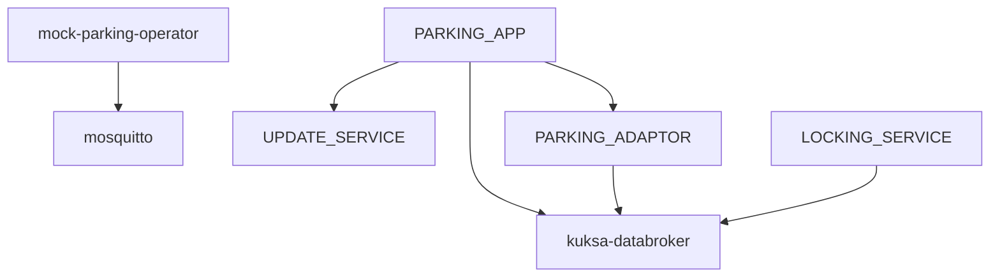

# Local Development Infrastructure

Detailed setup instructions for the SDV Parking Demo System local development environment.

## Overview

The local infrastructure provides a containerized environment for developing and testing components without cloud dependencies. It uses Podman Compose to orchestrate services that simulate the production environment.

## Prerequisites

- Podman 4.0+ or Docker 20.10+
- Podman Compose or Docker Compose
- 4GB+ available RAM
- 10GB+ available disk space

### Install Podman (macOS)

```bash
brew install podman podman-compose
podman machine init
podman machine start
```

### Install Podman (Linux)

```bash
# Fedora/RHEL
sudo dnf install podman podman-compose

# Ubuntu/Debian
sudo apt-get install podman podman-compose
```

## Quick Start

### Complete Development Environment

The recommended way to start the complete local development environment:

```bash
# Start infrastructure containers + RHIVOS native services
make dev-up

# Check all services are healthy
make dev-status

# Use CLI simulators for testing
./backend/bin/companion-cli    # Remote vehicle control
./backend/bin/parking-cli      # Parking session management

# Tail service logs
make dev-logs

# Run integration tests
make dev-test

# Stop everything
make dev-down
```

### Infrastructure Only

If you only need the containerized infrastructure services:

```bash
# Start infrastructure containers only
make infra-up

# Verify services are running
cd infra/compose && podman-compose ps

# Stop infrastructure
make infra-down
```

## Services

### Eclipse Mosquitto MQTT Broker

Simulates vehicle-to-cloud communication channel.

| Property | Value |
|----------|-------|
| Image | `eclipse-mosquitto:2.0` |
| MQTT Port | 1883 (plain) |
| MQTT/TLS Port | 8883 |
| WebSocket Port | 9001 |
| Config | `infra/config/mosquitto/mosquitto.conf` |

**Test Connection:**
```bash
# Subscribe to all topics
mosquitto_sub -h localhost -p 1883 -t '#' -v

# Publish test message
mosquitto_pub -h localhost -p 1883 -t 'test/topic' -m 'hello'
```

### Eclipse Kuksa Databroker

Provides VSS-compliant gRPC pub/sub interface for vehicle signals.

| Property | Value |
|----------|-------|
| Image | `ghcr.io/eclipse-kuksa/kuksa-databroker:0.4.4` |
| gRPC Port | 55556 |
| Config | `infra/config/kuksa/config.json` |

**Test Connection:**
```bash
# Using grpcurl
grpcurl -plaintext localhost:55556 list

# Using kuksa-client (if installed)
kuksa-client --address localhost:55556 --insecure
```

### Mock Parking Operator

Simulates external parking operator API for testing.

| Property | Value |
|----------|-------|
| Image | Built from `containers/mock/Containerfile.parking-operator` |
| HTTP Port | 8080 |
| Health Endpoint | `/health` |

**Test Connection:**
```bash
# Health check
curl http://localhost:8080/health

# Start session
curl -X POST http://localhost:8080/api/v1/sessions \
  -H "Content-Type: application/json" \
  -d '{"vehicle_id": "VIN123", "zone_id": "ZONE-A"}'
```

## Port Assignments

### Local Development Ports

| Service | Protocol | Port | Description |
|---------|----------|------|-------------|
| MOSQUITTO | MQTT | 1883 | Plain MQTT (dev only) |
| MOSQUITTO | MQTT/TLS | 8883 | Encrypted MQTT |
| KUKSA_DATABROKER | gRPC | 55556 | VSS signal API |
| MOCK_PARKING_OPERATOR | HTTP | 8080 | Test parking API |
| PARKING_FEE_SERVICE | HTTP | 8081 | Parking operations |
| CLOUD_GATEWAY | HTTP | 8082 | Companion app REST API |
| UPDATE_SERVICE | gRPC | 50051 | Container lifecycle |
| PARKING_OPERATOR_ADAPTOR | gRPC | 50052 | Parking sessions |
| LOCKING_SERVICE | gRPC | 50053 | Door locking |

### Production Socket Paths (RHIVOS)

| Service | Socket Path |
|---------|-------------|
| DATA_BROKER | `/run/kuksa/databroker.sock` |
| LOCKING_SERVICE | `/run/rhivos/locking.sock` |
| UPDATE_SERVICE | `/run/rhivos/update.sock` |
| PARKING_ADAPTOR | `/run/rhivos/parking.sock` |
| CLOUD_GATEWAY_CLIENT | `/run/rhivos/cloud-gateway.sock` |

## Service Dependencies



## Configuration Files

### mosquitto.conf

Location: `infra/config/mosquitto/mosquitto.conf`

```
listener 1883
listener 8883
cafile /mosquitto/config/ca.crt
certfile /mosquitto/config/server.crt
keyfile /mosquitto/config/server.key
allow_anonymous true
```

### kuksa/config.json

Location: `infra/config/kuksa/config.json`

Defines VSS signal tree and access control rules.

### endpoints.yaml

Location: `infra/config/endpoints.yaml`

Complete endpoint configuration for all services.

### development.yaml

Location: `infra/config/development.yaml`

Development-specific settings:
- TLS verification disabled
- Debug logging enabled
- Mock service endpoints

## TLS Certificates

Development certificates are located in `infra/certs/`:

```
infra/certs/
├── ca/
│   ├── ca.crt           # Root CA certificate
│   └── ca.key           # CA private key
├── server/
│   ├── server.crt       # Server certificate
│   └── server.key       # Server private key
└── client/
    ├── client.crt       # Client certificate
    └── client.key       # Client private key
```

### Regenerate Certificates

```bash
./scripts/generate-certs.sh
```

**Warning:** Development certificates are self-signed and should never be used in production.

## Health Checks

All services include health checks. View status:

```bash
cd infra/compose && podman-compose ps
```

| Service | Health Check |
|---------|--------------|
| Mosquitto | `mosquitto_sub -t '$SYS/#' -C 1` |
| Kuksa Databroker | Container status (minimal image) |
| Mock Parking Operator | `curl http://localhost:8080/health` |

## Logs

View service logs:

```bash
# All services
cd infra/compose && podman-compose logs -f

# Specific service
podman-compose logs -f mosquitto
podman-compose logs -f kuksa-databroker
podman-compose logs -f mock-parking-operator
```

## Volumes

Persistent data is stored in named volumes:

| Volume | Purpose |
|--------|---------|
| `mosquitto-data` | MQTT message persistence |
| `mosquitto-log` | MQTT broker logs |

## Network

Services communicate on the `sdv-parking-demo` bridge network.

```bash
# Inspect network
podman network inspect sdv-parking-demo
```

## Troubleshooting

### Port Already in Use

```bash
# Find process using port
lsof -i :PORT

# Kill process
kill -9 PID
```

### Container Won't Start

```bash
# Check logs
podman-compose logs SERVICE_NAME

# Check container status
podman ps -a
```

### TLS Errors

```bash
# Regenerate certificates
./scripts/generate-certs.sh

# Restart services
make infra-down && make infra-up
```

### Kuksa Connection Issues

The Kuksa Databroker uses a minimal container without shell access. Verify externally:

```bash
# Check port is listening
nc -zv localhost 55556

# Test gRPC
grpcurl -plaintext localhost:55556 list
```

### Reset Everything

```bash
# Stop and remove all containers, volumes, networks
cd infra/compose && podman-compose down -v

# Restart fresh
make infra-up
```

## Environment Variables

### Service Configuration

Services can be configured via environment variables:

| Variable | Service | Description |
|----------|---------|-------------|
| `LOG_LEVEL` | All | Logging verbosity (debug/info/warn/error) |
| `MOCK_DELAY_MS` | Mock Parking | Simulated response delay |
| `TLS_ENABLED` | All | Enable/disable TLS |

### CLI Simulator Configuration

Configure CLI simulators to connect to local services:

```bash
# Set environment for CLI simulators
source scripts/dev-env.sh local_insecure

# Or set manually:
export CLOUD_GATEWAY_URL=http://localhost:8082
export DATA_BROKER_ADDR=localhost:55556
export PARKING_FEE_SERVICE_URL=http://localhost:8081
export UPDATE_SERVICE_ADDR=localhost:50051
export PARKING_ADAPTOR_ADDR=localhost:50052
export LOCKING_SERVICE_ADDR=localhost:50053
export VIN=DEMO_VIN_001
```

| Variable | CLI | Description |
|----------|-----|-------------|
| `CLOUD_GATEWAY_URL` | companion-cli | CLOUD_GATEWAY REST API |
| `DATA_BROKER_ADDR` | parking-cli | KUKSA_DATABROKER gRPC |
| `PARKING_FEE_SERVICE_URL` | parking-cli | PARKING_FEE_SERVICE REST API |
| `UPDATE_SERVICE_ADDR` | parking-cli | UPDATE_SERVICE gRPC |
| `PARKING_ADAPTOR_ADDR` | parking-cli | PARKING_OPERATOR_ADAPTOR gRPC |
| `LOCKING_SERVICE_ADDR` | parking-cli | LOCKING_SERVICE gRPC |
| `VIN` | companion-cli | Vehicle identification number |

## Development Mode

For development, TLS verification can be disabled:

```bash
export TLS_SKIP_VERIFY=true
```

Or in `infra/config/development.yaml`:

```yaml
tls:
  skip_verify: true
```
