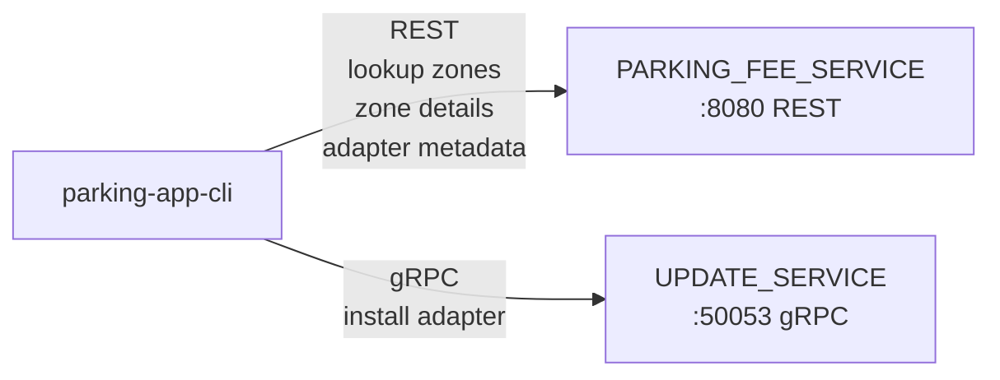

# PARKING_FEE_SERVICE REST API

This document describes the PARKING_FEE_SERVICE REST API endpoints, request and
response formats, error handling, and configuration.

## Overview

The PARKING_FEE_SERVICE is a Go backend service that provides a REST API for
parking zone discovery and adapter metadata retrieval. It enables the
PARKING_APP (or mock `parking-app-cli`) to look up parking zones by geographic
location, retrieve zone details and rates, and obtain the container image
reference needed to install the correct adapter via UPDATE_SERVICE.

The service uses hardcoded demo zone data with realistic Munich geofence
polygons and an in-memory data store. No external dependencies or databases
are required.

## Architecture



## Endpoints

### GET /healthz

Health check endpoint.

**Response:** `200 OK`

```json
{}
```

### GET /api/v1/zones?lat={lat}&lon={lon}

Look up parking zones by geographic location. Returns zones whose geofence
polygon contains the point, or zones within 200 meters of the point (fuzzy
matching).

**Query Parameters:**

| Parameter | Type | Required | Description |
|-----------|------|----------|-------------|
| `lat` | float | Yes | Latitude of the lookup point |
| `lon` | float | Yes | Longitude of the lookup point |

**Success Response:** `200 OK`

```json
[
  {
    "zone_id": "zone-marienplatz",
    "name": "Marienplatz Central",
    "operator_name": "München Parking GmbH",
    "rate_type": "per_minute",
    "rate_amount": 0.05,
    "currency": "EUR",
    "distance_meters": 0
  }
]
```

**Response Fields:**

| Field | Type | Description |
|-------|------|-------------|
| `zone_id` | string | Unique zone identifier |
| `name` | string | Human-readable zone name |
| `operator_name` | string | Parking operator name |
| `rate_type` | string | `"per_minute"` or `"flat"` |
| `rate_amount` | float | Rate amount in the given currency |
| `currency` | string | ISO currency code (e.g. `"EUR"`) |
| `distance_meters` | float | Distance from the query point to the zone (0 if inside the polygon) |

**Matching Behavior:**

1. **Exact match:** If the point lies inside a zone's geofence polygon
   (ray-casting point-in-polygon test), the zone is included with
   `distance_meters = 0`.
2. **Fuzzy match:** If no zone contains the point, zones whose nearest polygon
   edge is within 200 meters are included with the calculated Haversine
   distance.
3. **No match:** If no zone matches, an empty JSON array `[]` is returned
   (HTTP 200, not an error).
4. **Sort order:** Results are sorted by `distance_meters` ascending (nearest
   first).

**Error Responses:**

| Status | Condition | Body |
|--------|-----------|------|
| `400` | Missing `lat` parameter | `{"error": "missing required query parameter: lat", "code": "BAD_REQUEST"}` |
| `400` | Missing `lon` parameter | `{"error": "missing required query parameter: lon", "code": "BAD_REQUEST"}` |
| `400` | Non-numeric `lat` | `{"error": "invalid query parameter: lat must be numeric", "code": "BAD_REQUEST"}` |
| `400` | Non-numeric `lon` | `{"error": "invalid query parameter: lon must be numeric", "code": "BAD_REQUEST"}` |

### GET /api/v1/zones/{zone_id}

Get full details for a specific parking zone, including the geofence polygon
coordinates.

**Path Parameters:**

| Parameter | Type | Description |
|-----------|------|-------------|
| `zone_id` | string | Zone identifier (e.g. `zone-marienplatz`) |

**Success Response:** `200 OK`

```json
{
  "zone_id": "zone-marienplatz",
  "name": "Marienplatz Central",
  "operator_name": "München Parking GmbH",
  "polygon": [
    {"latitude": 48.1380, "longitude": 11.5730},
    {"latitude": 48.1380, "longitude": 11.5780},
    {"latitude": 48.1355, "longitude": 11.5780},
    {"latitude": 48.1355, "longitude": 11.5730}
  ],
  "rate_type": "per_minute",
  "rate_amount": 0.05,
  "currency": "EUR"
}
```

**Error Response:** `404 Not Found`

```json
{
  "error": "zone not found",
  "code": "NOT_FOUND"
}
```

### GET /api/v1/zones/{zone_id}/adapter

Get adapter container metadata for a parking zone. The returned `image_ref` and
`checksum` can be passed to `UPDATE_SERVICE.InstallAdapter()` to install the
correct parking operator adapter.

**Path Parameters:**

| Parameter | Type | Description |
|-----------|------|-------------|
| `zone_id` | string | Zone identifier (e.g. `zone-marienplatz`) |

**Success Response:** `200 OK`

```json
{
  "zone_id": "zone-marienplatz",
  "image_ref": "localhost/parking-operator-adaptor:latest",
  "checksum": "sha256:demo-checksum-marienplatz"
}
```

**Response Fields:**

| Field | Type | Description |
|-------|------|-------------|
| `zone_id` | string | Zone identifier |
| `image_ref` | string | OCI container image reference for the adapter |
| `checksum` | string | Image checksum for verification |

**Error Response:** `404 Not Found`

```json
{
  "error": "zone not found",
  "code": "NOT_FOUND"
}
```

## Configuration

| Flag | Env Var | Default | Description |
|------|---------|---------|-------------|
| `--listen-addr` | `LISTEN_ADDR` | `:8080` | REST listen address |

### Example

```bash
# Start with default settings
./backend/parking-fee-service/parking-fee-service

# Start on a custom port
./backend/parking-fee-service/parking-fee-service --listen-addr :9090

# Start using environment variable
LISTEN_ADDR=:9090 ./backend/parking-fee-service/parking-fee-service
```

## Demo Zone Data

The service ships with 3 hardcoded Munich demo zones. See
[zone-discovery.md](zone-discovery.md) for full details on the demo zones and
the discovery workflow.

| Zone ID | Name | Operator | Rate |
|---------|------|----------|------|
| `zone-marienplatz` | Marienplatz Central | München Parking GmbH | EUR 0.05/min |
| `zone-olympiapark` | Olympiapark | Olympiapark Parking Services | EUR 0.04/min |
| `zone-sendlinger-tor` | Sendlinger Tor | City Parking Munich | EUR 2.50 flat |

## Observability

- All incoming HTTP requests are logged at INFO level using Go's `slog`
  structured logger.
- Zone lookup results are logged with match count and query coordinates.
- The service does not require authentication for any endpoint.

## Using the parking-app-cli

The `parking-app-cli` provides subcommands for all PARKING_FEE_SERVICE
operations:

```bash
# Look up zones at a location
parking-app-cli --parking-fee-service-addr http://localhost:8080 \
    lookup-zones --lat 48.1365 --lon 11.5755

# Get zone details
parking-app-cli --parking-fee-service-addr http://localhost:8080 \
    zone-info --zone-id zone-marienplatz

# Get adapter metadata
parking-app-cli --parking-fee-service-addr http://localhost:8080 \
    adapter-info --zone-id zone-marienplatz
```

## Requirements Traceability

| Requirement | Feature |
|-------------|---------|
| 05-REQ-1.1 | Zone lookup by location via `GET /api/v1/zones?lat=X&lon=Y` |
| 05-REQ-1.2 | Point-in-polygon matching with `distance_meters = 0` |
| 05-REQ-1.3 | Fuzzy matching within 200m using Haversine distance |
| 05-REQ-1.4 | Response includes zone_id, name, operator, rate, distance |
| 05-REQ-1.5 | Results sorted by distance ascending |
| 05-REQ-1.E1 | No-match returns empty array with HTTP 200 |
| 05-REQ-1.E2 | Missing or invalid lat/lon returns HTTP 400 |
| 05-REQ-2.1 | Zone details via `GET /api/v1/zones/{zone_id}` |
| 05-REQ-2.2 | Zone details include polygon coordinates |
| 05-REQ-2.E1 | Unknown zone_id returns HTTP 404 |
| 05-REQ-3.1 | Adapter metadata via `GET /api/v1/zones/{zone_id}/adapter` |
| 05-REQ-3.2 | Response includes image_ref and checksum |
| 05-REQ-3.E1 | Unknown zone_id returns HTTP 404 |
| 05-REQ-5.1 | Configurable listen address via `--listen-addr` flag |
| 05-REQ-5.2 | Health check at `GET /healthz` returns HTTP 200 |
| 05-REQ-5.3 | No authentication required |
| 05-REQ-5.4 | All requests logged at INFO level |
