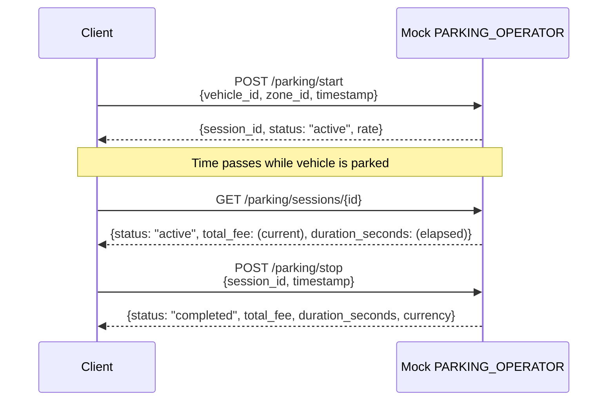

# Mock PARKING_OPERATOR REST API

The mock PARKING_OPERATOR simulates an external parking operator backend for
development and integration testing of the PARKING_OPERATOR_ADAPTOR. It manages
parking sessions in memory and calculates fees based on configurable rates.

## Configuration

The mock PARKING_OPERATOR accepts configuration via CLI flags or environment
variables:

| Flag | Env Var | Default | Description |
|------|---------|---------|-------------|
| `-listen-addr` | `LISTEN_ADDR` | `:8082` | Address to listen on (host:port) |
| `-rate-type` | `RATE_TYPE` | `per_minute` | Rate type: `per_minute` or `flat` |
| `-rate-amount` | `RATE_AMOUNT` | `0.05` | Rate amount per unit |
| `-currency` | `CURRENCY` | `EUR` | Currency code |
| `-zone-id` | `ZONE_ID` | `zone-1` | Zone identifier |

### Example

```bash
./mock/parking-operator/parking-operator \
    -listen-addr :8082 \
    -rate-type per_minute \
    -rate-amount 0.05 \
    -currency EUR \
    -zone-id zone-1
```

## Endpoints

### POST /parking/start

Start a new parking session for a vehicle.

**Request Body:**

```json
{
  "vehicle_id": "DEMO0000000000001",
  "zone_id": "zone-1",
  "timestamp": 1708300800
}
```

| Field | Type | Required | Description |
|-------|------|----------|-------------|
| `vehicle_id` | string | Yes | Vehicle identifier (VIN) |
| `zone_id` | string | Yes | Parking zone identifier |
| `timestamp` | integer | No | Unix epoch seconds. If `0` or omitted, uses current time |

**Success Response (200 OK):**

```json
{
  "session_id": "sess-001",
  "status": "active",
  "rate": {
    "zone_id": "zone-1",
    "rate_type": "per_minute",
    "rate_amount": 0.05,
    "currency": "EUR"
  }
}
```

**Edge Cases:**

| Condition | Status | Response |
|-----------|--------|----------|
| Missing `vehicle_id` or `zone_id` | 400 Bad Request | `{"error": "vehicle_id and zone_id are required"}` |
| Invalid JSON body | 400 Bad Request | `{"error": "invalid request body"}` |
| Active session exists for same vehicle | 200 OK | Returns existing session (no duplicate) |

Session IDs are generated monotonically: `sess-001`, `sess-002`, etc.

---

### POST /parking/stop

Stop an active parking session and calculate the fee.

**Request Body:**

```json
{
  "session_id": "sess-001",
  "timestamp": 1708301100
}
```

| Field | Type | Required | Description |
|-------|------|----------|-------------|
| `session_id` | string | Yes | Session identifier from start response |
| `timestamp` | integer | No | Unix epoch seconds. If `0` or omitted, uses current time |

**Success Response (200 OK):**

```json
{
  "session_id": "sess-001",
  "status": "completed",
  "total_fee": 0.25,
  "duration_seconds": 300,
  "currency": "EUR"
}
```

**Edge Cases:**

| Condition | Status | Response |
|-----------|--------|----------|
| Unknown `session_id` | 404 Not Found | `{"error": "session not found"}` |
| Missing `session_id` | 400 Bad Request | `{"error": "session_id is required"}` |
| Session already completed | 200 OK | Returns existing completed state |

---

### GET /parking/sessions/{id}

Query details for a specific parking session.

**Success Response (200 OK):**

```json
{
  "session_id": "sess-001",
  "vehicle_id": "DEMO0000000000001",
  "zone_id": "zone-1",
  "start_time": 1708300800,
  "end_time": 1708301100,
  "rate": {
    "rate_type": "per_minute",
    "rate_amount": 0.05,
    "currency": "EUR"
  },
  "total_fee": 0.25,
  "duration_seconds": 300,
  "status": "completed"
}
```

For **active** sessions, `total_fee` and `duration_seconds` are calculated
based on elapsed time from `start_time` to now. The `end_time` field is omitted.

**Edge Cases:**

| Condition | Status | Response |
|-----------|--------|----------|
| Unknown session ID | 404 Not Found | `{"error": "session not found"}` |

---

### GET /parking/rate

Return the configured rate information for the operator's zone.

**Response (200 OK):**

```json
{
  "zone_id": "zone-1",
  "rate_type": "per_minute",
  "rate_amount": 0.05,
  "currency": "EUR"
}
```

| Field | Type | Description |
|-------|------|-------------|
| `zone_id` | string | Parking zone identifier |
| `rate_type` | string | `"per_minute"` or `"flat"` |
| `rate_amount` | float | Cost per unit |
| `currency` | string | Currency code (e.g. `EUR`, `USD`) |

## Fee Calculation

The mock operator supports two rate types:

### Per-Minute Rate

```
total_fee = rate_amount * ceil(duration_minutes)
```

Duration in minutes is computed as `ceil(duration_seconds / 60)`. A session
lasting 1 second is charged for 1 full minute.

**Example:** 5 minutes 30 seconds at 0.05 EUR/min = `0.05 * 6 = 0.30 EUR`

### Flat Rate

```
total_fee = rate_amount
```

A fixed fee regardless of session duration.

**Example:** Flat rate of 5.00 EUR = `5.00 EUR` whether parked for 5 minutes
or 5 hours.

## Session Lifecycle



## Integration with PARKING_OPERATOR_ADAPTOR

The PARKING_OPERATOR_ADAPTOR communicates with this mock service via its REST
client (`operator_client.rs`). The adaptor calls:

- `POST /parking/start` when `IsLocked` transitions to `true`
- `POST /parking/stop` when `IsLocked` transitions to `false`
- `GET /parking/rate` when the gRPC `GetRate` RPC is called
- `GET /parking/sessions/{id}` when session details are needed

The adaptor is configured with the mock operator's URL via `PARKING_OPERATOR_URL`
environment variable (e.g. `http://localhost:8082`).

## Requirements Traceability

| Requirement | Endpoint / Feature |
|-------------|-------------------|
| 04-REQ-6.1 | `POST /parking/start` |
| 04-REQ-6.2 | `POST /parking/stop` |
| 04-REQ-6.3 | `GET /parking/sessions/{id}` |
| 04-REQ-6.4 | `GET /parking/rate` |
| 04-REQ-6.5 | Fee calculation (per_minute and flat) |
| 04-REQ-6.6 | CLI flags and env var configuration |
| 04-REQ-6.E1 | Unknown session_id returns 404 |
| 04-REQ-6.E2 | Duplicate start returns existing session |
