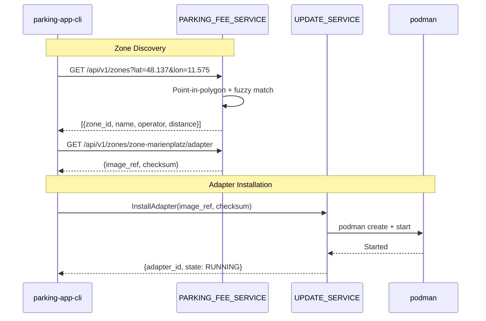

# Zone Discovery and Adapter Installation

This document describes the zone discovery workflow, demo zone data, geospatial
matching algorithms, and the end-to-end adapter discovery-to-installation flow.

## Overview

The PARKING_FEE_SERVICE enables a "feature-on-demand" pattern where the correct
parking operator adapter is discovered and installed based on the vehicle's
current location:

1. The vehicle reports its GPS coordinates.
2. The PARKING_APP queries the PARKING_FEE_SERVICE for nearby parking zones.
3. The app retrieves adapter metadata (container image reference) for the
   selected zone.
4. The app calls UPDATE_SERVICE to install the adapter container.
5. The adapter automatically manages parking sessions.

## Discovery Sequence



## Demo Zone Data

The service includes 3 hardcoded parking zones with realistic Munich
coordinates. Each zone has a rectangular geofence polygon with 4 coordinate
points.

### Marienplatz Central

| Property | Value |
|----------|-------|
| Zone ID | `zone-marienplatz` |
| Operator | München Parking GmbH |
| Rate | EUR 0.05 per minute |
| Adapter Image | `localhost/parking-operator-adaptor:latest` |
| Checksum | `sha256:demo-checksum-marienplatz` |

Polygon coordinates (rectangular area around Marienplatz):

| Point | Latitude | Longitude |
|-------|----------|-----------|
| NW | 48.1380 | 11.5730 |
| NE | 48.1380 | 11.5780 |
| SE | 48.1355 | 11.5780 |
| SW | 48.1355 | 11.5730 |

### Olympiapark

| Property | Value |
|----------|-------|
| Zone ID | `zone-olympiapark` |
| Operator | Olympiapark Parking Services |
| Rate | EUR 0.04 per minute |
| Adapter Image | `localhost/parking-operator-adaptor:latest` |
| Checksum | `sha256:demo-checksum-olympiapark` |

Polygon coordinates (rectangular area around Olympiapark):

| Point | Latitude | Longitude |
|-------|----------|-----------|
| NW | 48.1770 | 11.5490 |
| NE | 48.1770 | 11.5580 |
| SE | 48.1720 | 11.5580 |
| SW | 48.1720 | 11.5490 |

### Sendlinger Tor

| Property | Value |
|----------|-------|
| Zone ID | `zone-sendlinger-tor` |
| Operator | City Parking Munich |
| Rate | EUR 2.50 flat |
| Adapter Image | `localhost/parking-operator-adaptor:latest` |
| Checksum | `sha256:demo-checksum-sendlinger-tor` |

Polygon coordinates (rectangular area around Sendlinger Tor):

| Point | Latitude | Longitude |
|-------|----------|-----------|
| NW | 48.1345 | 11.5650 |
| NE | 48.1345 | 11.5700 |
| SE | 48.1320 | 11.5700 |
| SW | 48.1320 | 11.5650 |

## Geospatial Matching

The PARKING_FEE_SERVICE uses two geospatial algorithms for zone matching:

### Point-in-Polygon (Ray Casting)

Determines whether a geographic point lies inside a zone's geofence polygon.

**Algorithm:** Cast a horizontal ray from the test point and count how many
polygon edges it crosses. If the count is odd, the point is inside; if even,
the point is outside.

**Used for:** Exact matches where the vehicle is parked inside a zone.
These matches have `distance_meters = 0`.

### Haversine Distance

Calculates the great-circle distance between two geographic points on Earth's
surface.

**Formula:**

```
a = sin²(Δlat/2) + cos(lat1) × cos(lat2) × sin²(Δlon/2)
c = 2 × atan2(√a, √(1−a))
d = R × c    (R = 6,371,000 meters)
```

**Used for:** Fuzzy matching when the vehicle is near but not inside a zone.
The distance from the query point to the nearest polygon edge is computed, and
zones within 200 meters are included in the results.

### Matching Priority

1. **Inside polygon:** If the point is inside any zone polygon, return all
   containing zones with `distance_meters = 0`.
2. **Within 200m:** If no zone contains the point, find zones whose nearest
   polygon edge is within 200 meters and return them with the calculated
   distance.
3. **No match:** If no zone is within 200 meters, return an empty array.

Results are always sorted by `distance_meters` ascending (nearest first).

## Running the Discovery Flow

### Using the parking-app-cli

The complete discovery-to-installation workflow can be run using the mock CLI:

```bash
# Step 1: Find zones near the vehicle
parking-app-cli --parking-fee-service-addr http://localhost:8080 \
    lookup-zones --lat 48.1365 --lon 11.5755

# Step 2: Get adapter metadata for a zone
parking-app-cli --parking-fee-service-addr http://localhost:8080 \
    adapter-info --zone-id zone-marienplatz

# Step 3: Install the adapter via UPDATE_SERVICE
parking-app-cli --update-service-addr localhost:50053 \
    install-adapter --image-ref localhost/parking-operator-adaptor:latest

# Step 4: Verify the adapter is running
parking-app-cli --update-service-addr localhost:50053 \
    list-adapters
```

### Using curl

```bash
# Look up zones at Marienplatz
curl http://localhost:8080/api/v1/zones?lat=48.1365\&lon=11.5755

# Get zone details
curl http://localhost:8080/api/v1/zones/zone-marienplatz

# Get adapter metadata
curl http://localhost:8080/api/v1/zones/zone-marienplatz/adapter
```

## Integration Tests

The zone discovery integration tests verify the end-to-end flow:

```bash
# Run zone discovery E2E tests
make test-zone-discovery-e2e
```

The test suite covers:

1. **Zone discovery (05-REQ-7.1, 05-REQ-7.2):** Lookup inside a zone, fuzzy
   match near a zone, and no-match far from all zones.
2. **Adapter install flow (05-REQ-7.3):** Retrieve adapter metadata from
   PARKING_FEE_SERVICE, pass it to UPDATE_SERVICE.InstallAdapter, and verify
   the adapter state.
3. **Full CLI workflow (05-REQ-7.4):** Use `parking-app-cli` to perform the
   complete discovery-to-install workflow end-to-end.

Tests that require podman or UPDATE_SERVICE skip cleanly when the
infrastructure is unavailable (05-REQ-7.E1).

## Requirements Traceability

| Requirement | Feature |
|-------------|---------|
| 05-REQ-4.1 | 3 hardcoded parking zones with Munich coordinates |
| 05-REQ-4.2 | Each zone has a 4-point geofence polygon |
| 05-REQ-4.3 | Each zone has rate config and adapter metadata |
| 05-REQ-4.4 | Zones loaded into in-memory store on startup |
| 05-REQ-4.E1 | Malformed zones (< 3 polygon points) logged and skipped |
| 05-REQ-7.1 | Integration test verifies zone lookup inside polygon |
| 05-REQ-7.2 | Integration test verifies fuzzy match within 200m |
| 05-REQ-7.3 | Integration test verifies adapter metadata to install flow |
| 05-REQ-7.4 | Integration test verifies full discovery workflow via CLI |
| 05-REQ-7.E1 | Tests skip cleanly when infrastructure is unavailable |
